# Quill编辑器基础使用

<cite>
**本文档引用的文件**
- [quill.vue](file://src/views/rich-editor/quill.vue)
- [package.json](file://package.json)
- [science-blue.css](file://src/assets/custom-theme/science-blue.css)
- [theme-summer.css](file://src/assets/custom-theme/theme-summer.css)
- [dark.scss](file://src/assets/style/dark.scss)
- [base.scss](file://src/assets/style/base.scss)
</cite>

## 目录
1. [简介](#简介)
2. [项目结构](#项目结构)
3. [核心组件](#核心组件)
4. [架构概览](#架构概览)
5. [详细组件分析](#详细组件分析)
6. [依赖关系分析](#依赖关系分析)
7. [性能考虑](#性能考虑)
8. [故障排除指南](#故障排除指南)
9. [结论](#结论)

## 简介

本项目展示了如何在Vue.js项目中集成和使用Quill富文本编辑器。Quill是一个现代化的富文本编辑器，支持模块化架构、丰富的API和灵活的主题定制能力。本文档将详细介绍Quill编辑器的初始化配置、基本功能和核心API，帮助开发者快速上手并掌握Quill编辑器的使用技巧。

## 项目结构

该项目采用Vue.js单页应用架构，Quill编辑器作为富文本编辑功能的核心组件被集成在`src/views/rich-editor/`目录下。

```mermaid
graph TB
subgraph "项目结构"
A[src/views/rich-editor/] --> B[quill.vue]
A --> C[tinymce.vue]
D[src/assets/custom-theme/] --> E[science-blue.css]
D --> F[theme-summer.css]
G[src/assets/style/] --> H[dark.scss]
G --> I[base.scss]
end
subgraph "依赖管理"
J[package.json] --> K[quill@1.3.7]
J --> L[quill-image-drop-module@1.0.3]
J --> M[quill-image-resize-module@3.0.0]
end
B --> J
E --> N[主题定制]
F --> N
H --> O[深色模式]
I --> P[基础样式]
```

**图表来源**
- [quill.vue:1-236](file://src/views/rich-editor/quill.vue#L1-L236)
- [package.json:33-63](file://package.json#L33-L63)

**章节来源**
- [quill.vue:1-34](file://src/views/rich-editor/quill.vue#L1-L34)
- [package.json:1-99](file://package.json#L1-L99)

## 核心组件

### Quill编辑器主组件

Quill编辑器组件位于`src/views/rich-editor/quill.vue`，包含了完整的编辑器初始化、配置和功能实现。

#### 主要特性
- **工具栏自定义配置**：支持字体大小、标题级别、文本格式化、对齐方式等
- **图片处理功能**：集成拖拽上传和尺寸调整
- **内容统计**：实时显示字符计数和限制
- **事件监听**：响应编辑器状态变化
- **主题适配**：支持多种主题样式定制

#### 关键配置选项

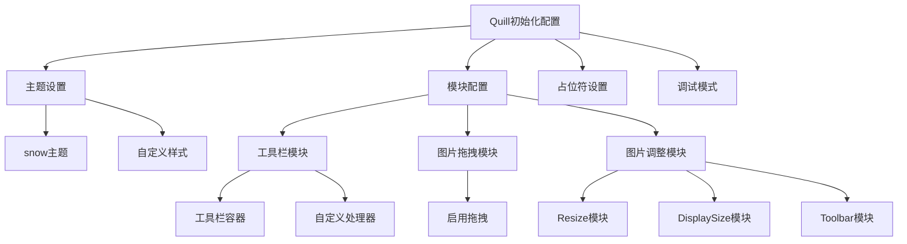

**图表来源**
- [quill.vue:135-183](file://src/views/rich-editor/quill.vue#L135-L183)

**章节来源**
- [quill.vue:46-192](file://src/views/rich-editor/quill.vue#L46-L192)

## 架构概览

### 整体架构设计

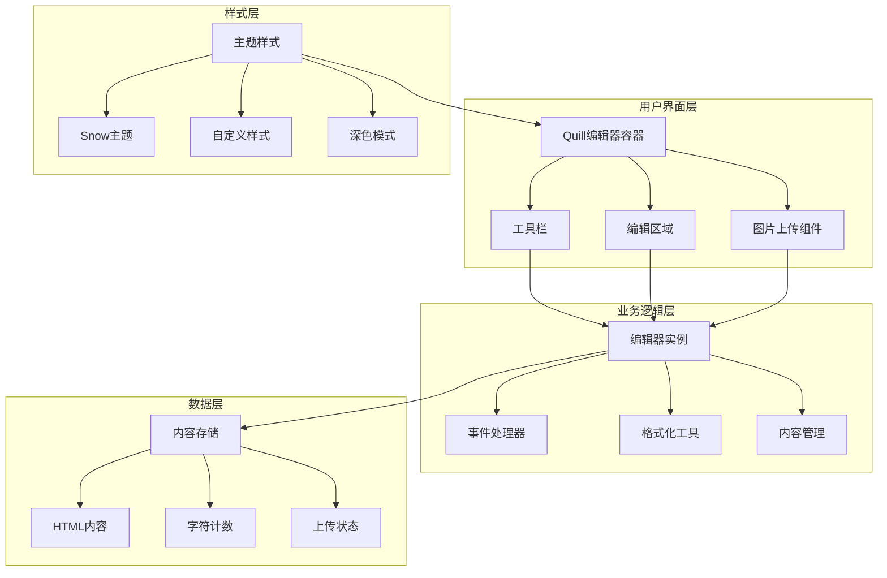

**图表来源**
- [quill.vue:135-183](file://src/views/rich-editor/quill.vue#L135-L183)
- [quill.vue:37-44](file://src/views/rich-editor/quill.vue#L37-L44)

### 数据流架构

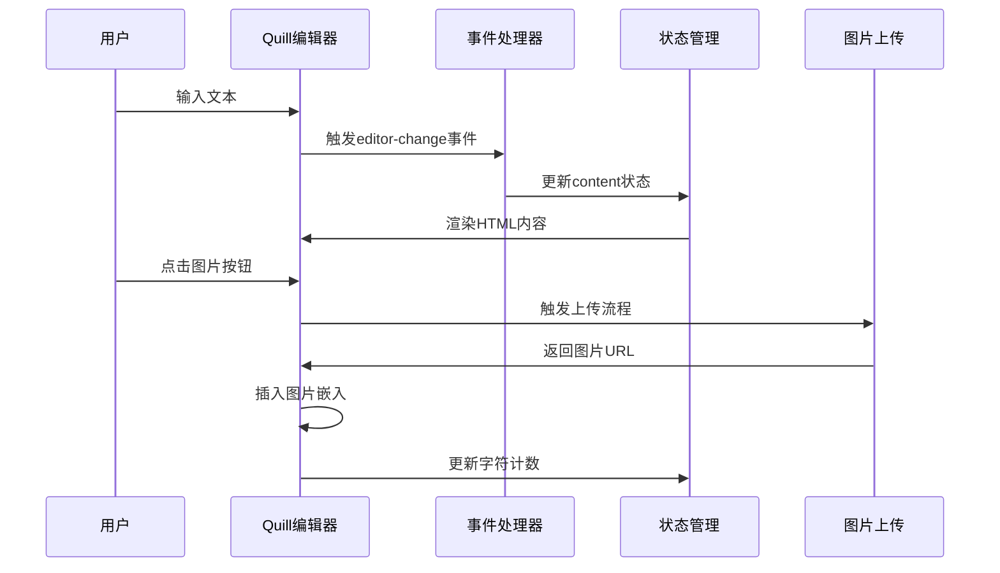

**图表来源**
- [quill.vue:110-118](file://src/views/rich-editor/quill.vue#L110-L118)
- [quill.vue:88-109](file://src/views/rich-editor/quill.vue#L88-L109)

## 详细组件分析

### 工具栏配置系统

#### 工具栏选项定义

Quill编辑器的工具栏通过`toolbarOptions`数组进行配置，支持多种格式化选项：

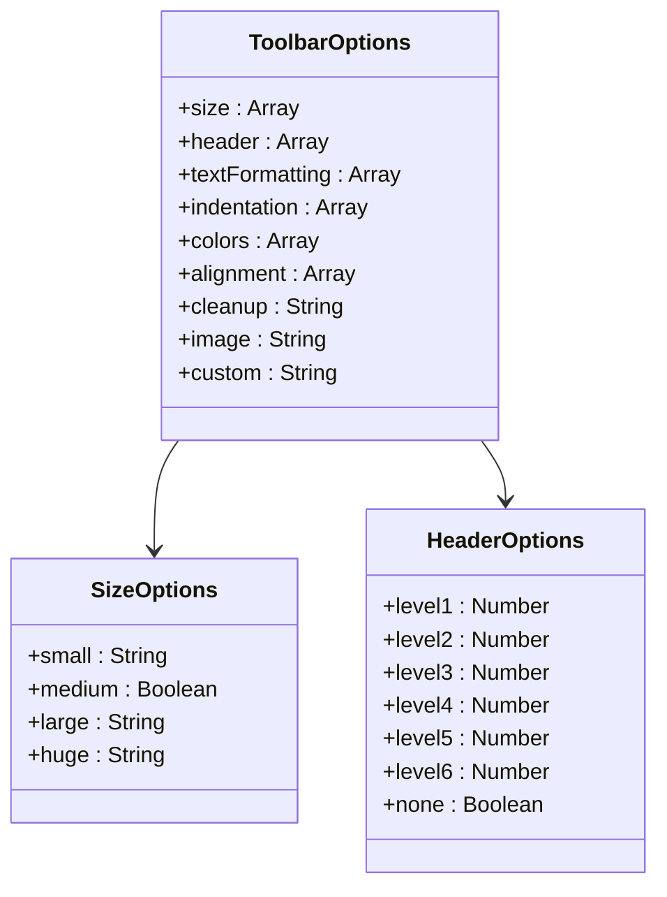

**图表来源**
- [quill.vue:48-58](file://src/views/rich-editor/quill.vue#L48-L58)

#### 工具栏处理器配置

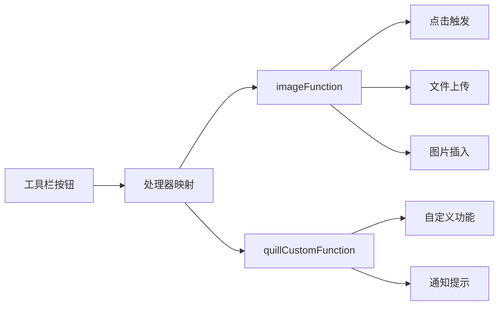

**图表来源**
- [quill.vue:142-149](file://src/views/rich-editor/quill.vue#L142-L149)
- [quill.vue:60-66](file://src/views/rich-editor/quill.vue#L60-L66)

**章节来源**
- [quill.vue:47-58](file://src/views/rich-editor/quill.vue#L47-L58)
- [quill.vue:141-149](file://src/views/rich-editor/quill.vue#L141-L149)

### 图片处理模块

#### 图片拖拽上传功能

Quill编辑器集成了两个重要的图片处理模块：

1. **quill-image-drop-module**：支持拖拽上传图片
2. **quill-image-resize-module**：提供图片尺寸调整功能

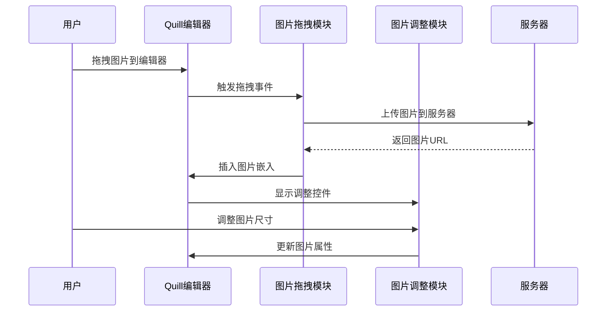

**图表来源**
- [quill.vue:37-44](file://src/views/rich-editor/quill.vue#L37-L44)
- [quill.vue:150-170](file://src/views/rich-editor/quill.vue#L150-L170)

#### 图片上传处理流程

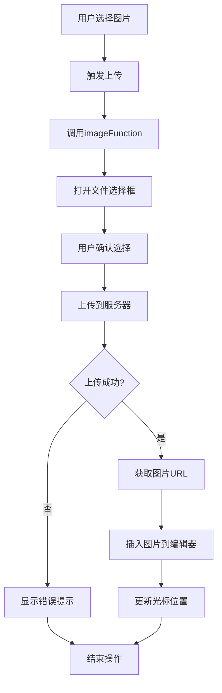

**图表来源**
- [quill.vue:88-109](file://src/views/rich-editor/quill.vue#L88-L109)

**章节来源**
- [quill.vue:88-109](file://src/views/rich-editor/quill.vue#L88-L109)
- [quill.vue:150-170](file://src/views/rich-editor/quill.vue#L150-L170)

### 内容格式化机制

#### 基础样式设置

Quill编辑器支持多种内容格式化选项：

| 格式化类型 | 支持选项 | 示例用途 |
|-----------|----------|----------|
| 字体大小 | small, medium, large, huge | 标题和正文分级 |
| 标题级别 | 1-6级标题 | 文档结构组织 |
| 文本格式 | bold, italic, underline, strike | 强调和装饰 |
| 缩进 | -1, +1 | 列表和段落层次 |
| 颜色 | 颜色选择器 | 高亮和主题色彩 |
| 对齐方式 | left, center, right, justify | 排版布局 |

#### 字符计数和验证

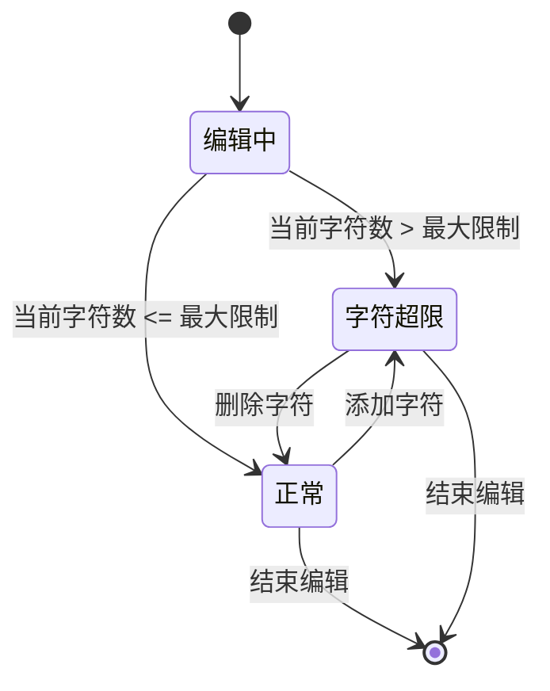

**图表来源**
- [quill.vue:75-86](file://src/views/rich-editor/quill.vue#L75-L86)
- [quill.vue:23-25](file://src/views/rich-editor/quill.vue#L23-L25)

**章节来源**
- [quill.vue:75-86](file://src/views/rich-editor/quill.vue#L75-L86)
- [quill.vue:23-25](file://src/views/rich-editor/quill.vue#L23-L25)

### 事件监听和数据绑定

#### 编辑器变更监听

Quill编辑器提供了丰富的事件监听机制：

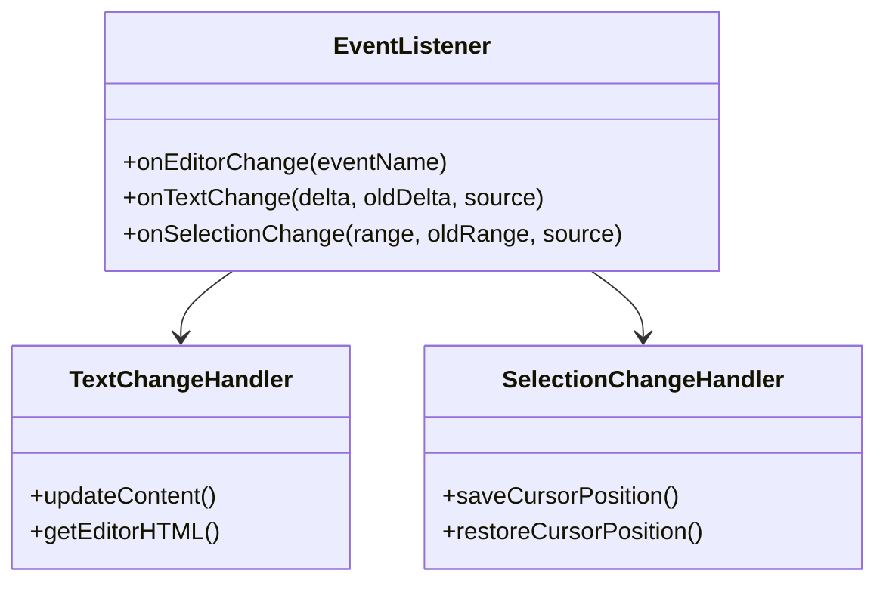

**图表来源**
- [quill.vue:110-118](file://src/views/rich-editor/quill.vue#L110-L118)

#### 数据绑定策略

编辑器采用双向数据绑定的方式管理内容状态：

1. **内容同步**：通过`editor-change`事件实时同步编辑器内容到Vue组件状态
2. **字符计数**：动态计算并显示当前字符数量
3. **状态管理**：维护编辑器实例引用以便后续操作

**章节来源**
- [quill.vue:110-118](file://src/views/rich-editor/quill.vue#L110-L118)
- [quill.vue:182-183](file://src/views/rich-editor/quill.vue#L182-L183)

### 样式定制和主题适配

#### 主题系统架构

项目提供了多种主题定制方案：

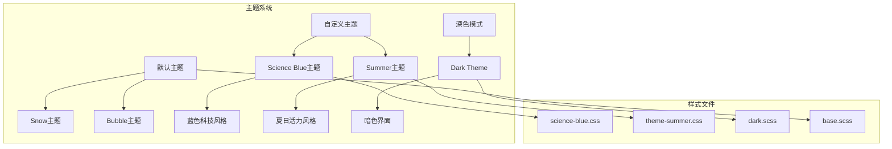

**图表来源**
- [science-blue.css:1-49](file://src/assets/custom-theme/science-blue.css#L1-L49)
- [theme-summer.css:1-800](file://src/assets/custom-theme/theme-summer.css#L1-L800)
- [dark.scss:1-33](file://src/assets/style/dark.scss#L1-L33)

#### Snow主题定制

Snow主题是Quill的默认主题，提供了简洁优雅的编辑器外观：

| 样式类别 | 定制点 | 实现方式 |
|---------|--------|----------|
| 工具栏样式 | 背景色、边框、按钮样式 | CSS类覆盖 |
| 编辑区域 | 边框、阴影、内边距 | 样式变量 |
| 图片控件 | 调整手柄、工具栏按钮 | SVG样式定制 |
| 响应式设计 | 移动端适配 | 媒体查询 |

**章节来源**
- [science-blue.css:1-49](file://src/assets/custom-theme/science-blue.css#L1-L49)
- [theme-summer.css:1-800](file://src/assets/custom-theme/theme-summer.css#L1-L800)
- [dark.scss:1-33](file://src/assets/style/dark.scss#L1-L33)

## 依赖关系分析

### 外部依赖管理

项目通过npm管理Quill相关的外部依赖：

```mermaid
graph LR
subgraph "Quill生态系统"
A[quill@1.3.7] --> B[parchment@1.1.4]
A --> C[quill-delta@3.6.2]
A --> D[eventemitter3@2.0.3]
E[quill-image-drop-module@1.0.3] --> A
F[quill-image-resize-module@3.0.0] --> A
G[quill-delta] --> H[deep-equal@1.0.1]
G --> I[extend@3.0.2]
G --> J[fast-diff@1.1.2]
end
subgraph "项目集成"
K[quill.vue] --> A
K --> E
K --> F
end
```

**图表来源**
- [package.json:50-52](file://package.json#L50-L52)
- [package.json:15990-16043](file://package.json#L15990-L16043)

### 模块注册机制

Quill编辑器通过模块注册系统扩展功能：

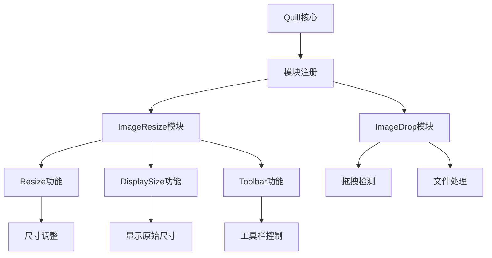

**图表来源**
- [quill.vue:37-44](file://src/views/rich-editor/quill.vue#L37-L44)
- [quill.vue:151-170](file://src/views/rich-editor/quill.vue#L151-L170)

**章节来源**
- [package.json:50-52](file://package.json#L50-L52)
- [quill.vue:37-44](file://src/views/rich-editor/quill.vue#L37-L44)

## 性能考虑

### 编辑器性能优化

1. **懒加载策略**：仅在需要时初始化编辑器实例
2. **事件节流**：对频繁触发的事件进行节流处理
3. **内存管理**：在组件销毁时正确清理编辑器实例
4. **DOM操作优化**：最小化DOM查询和更新次数

### 图片处理性能

- **异步上传**：避免阻塞主线程
- **预览缓存**：减少重复渲染
- **尺寸控制**：防止过大图片影响性能

## 故障排除指南

### 常见问题及解决方案

#### 编辑器初始化失败

**问题描述**：编辑器无法正常初始化
**可能原因**：
- DOM元素未就绪
- 样式文件加载失败
- 模块注册顺序错误

**解决方案**：
1. 确保在`mounted`生命周期中初始化
2. 检查CSS文件导入路径
3. 验证模块注册顺序

#### 图片上传失败

**问题描述**：图片上传过程中出现错误
**可能原因**：
- 服务器响应格式不正确
- 文件类型不支持
- 网络连接问题

**解决方案**：
1. 检查服务器返回的数据结构
2. 验证文件类型和大小限制
3. 添加网络错误处理逻辑

#### 样式冲突问题

**问题描述**：编辑器样式与其他组件冲突
**可能原因**：
- CSS作用域污染
- 样式优先级问题
- 主题切换冲突

**解决方案**：
1. 使用scoped样式隔离
2. 调整CSS选择器优先级
3. 实现主题切换时的样式重置

**章节来源**
- [quill.vue:188-191](file://src/views/rich-editor/quill.vue#L188-L191)
- [quill.vue:106-108](file://src/views/rich-editor/quill.vue#L106-L108)

## 结论

本项目成功展示了Quill富文本编辑器在Vue.js项目中的完整集成方案。通过合理的架构设计和模块化配置，实现了功能丰富、性能优良的富文本编辑体验。

### 主要优势

1. **模块化架构**：清晰的功能分离和可扩展性
2. **丰富的API**：完善的事件监听和数据绑定机制
3. **灵活的样式定制**：支持多种主题和个性化定制
4. **良好的用户体验**：直观的工具栏和流畅的交互

### 最佳实践建议

1. **合理配置工具栏**：根据实际需求精简工具栏选项
2. **优化图片处理**：实现高效的图片上传和预览机制
3. **加强错误处理**：完善异常情况的处理逻辑
4. **注重性能优化**：避免不必要的DOM操作和重绘

通过遵循这些指导原则，开发者可以构建出高质量的富文本编辑功能，为用户提供优秀的写作体验。