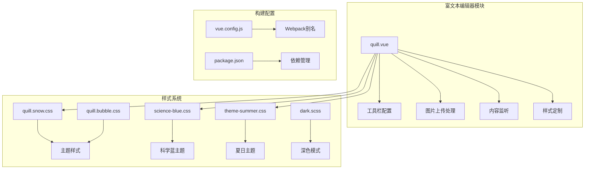
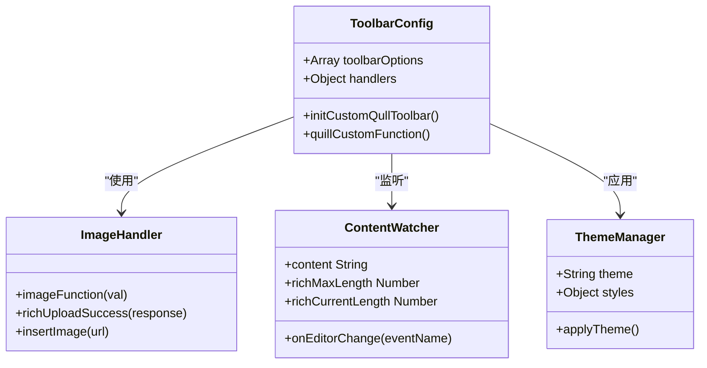
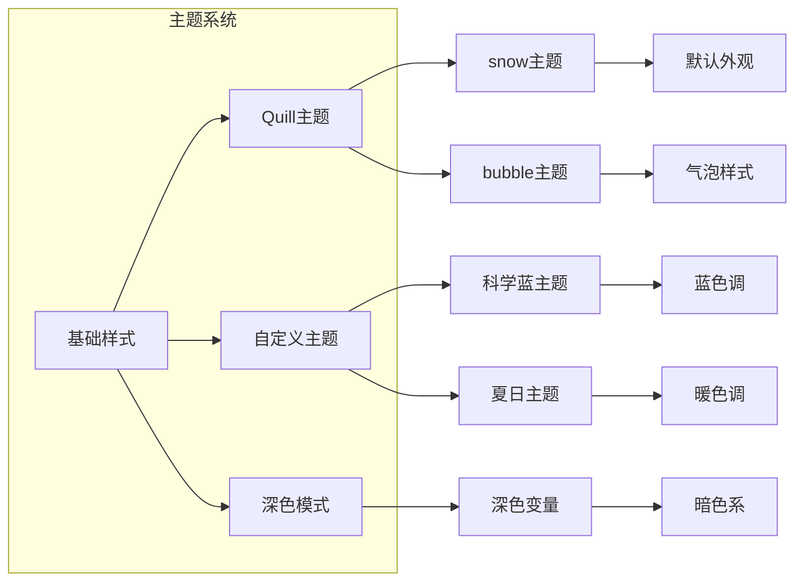
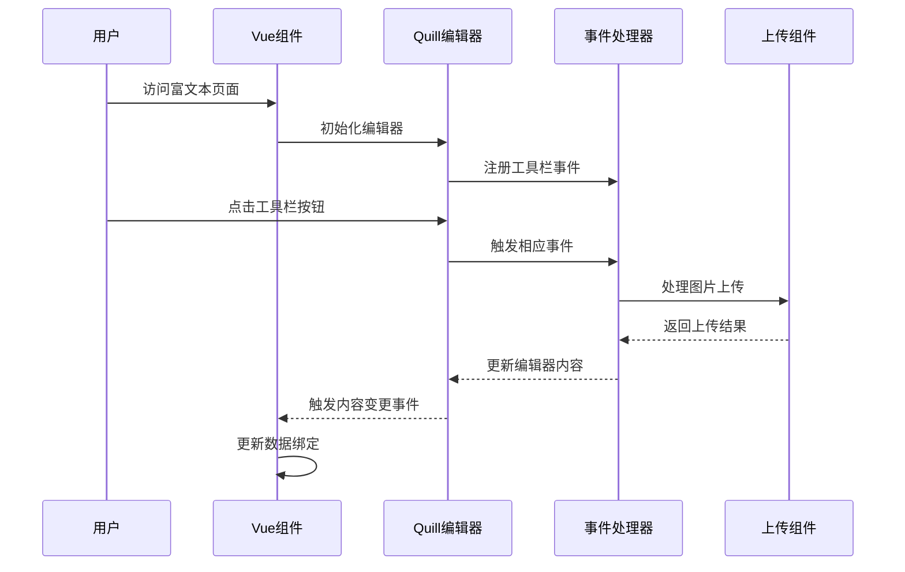
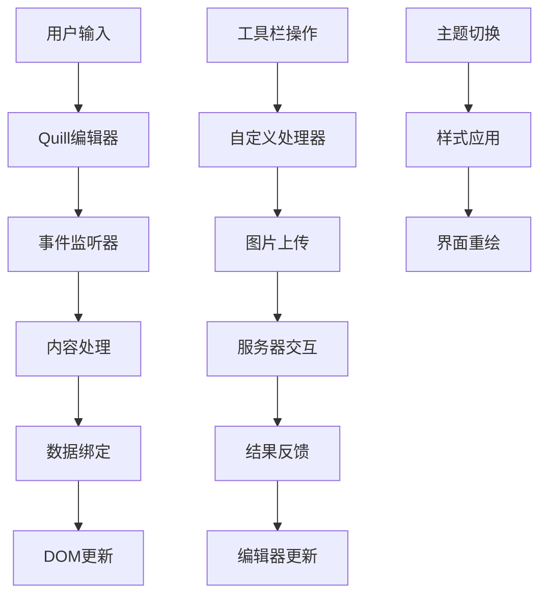
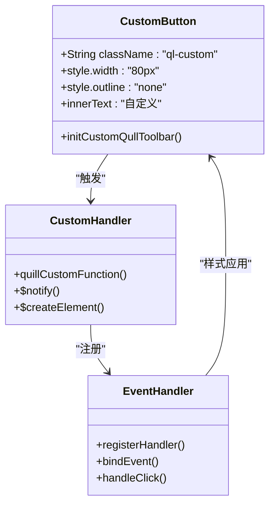
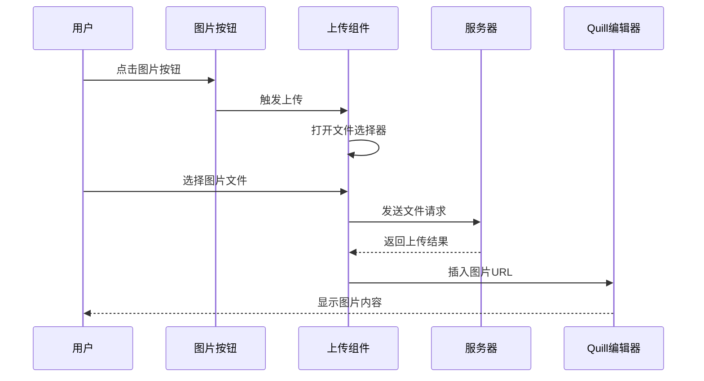
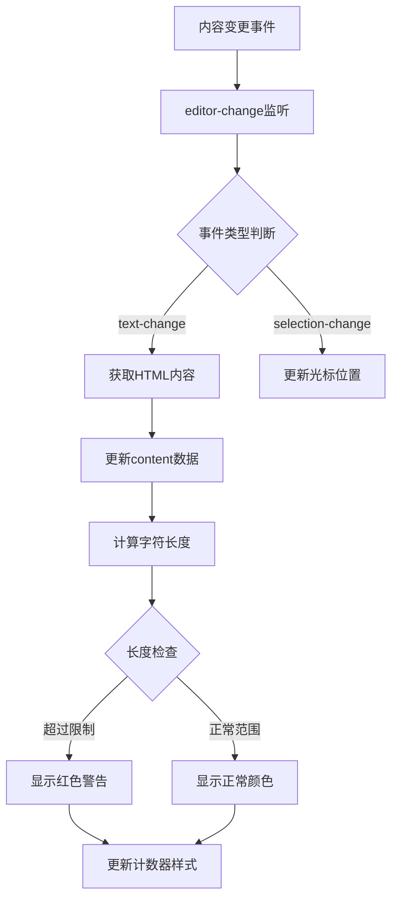
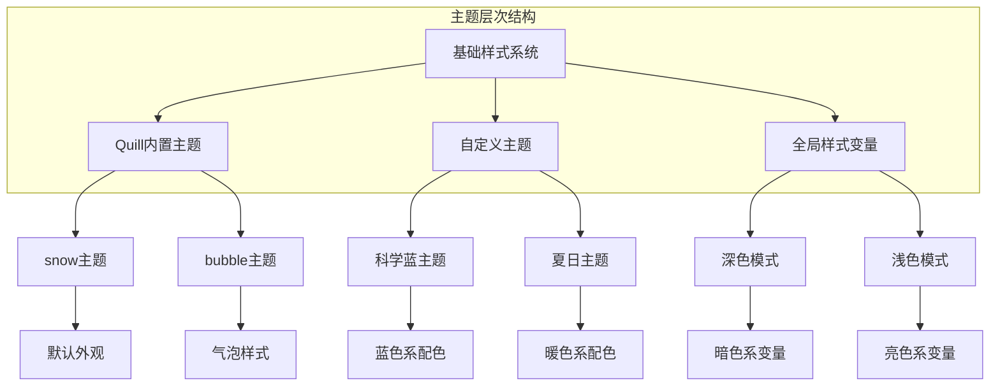
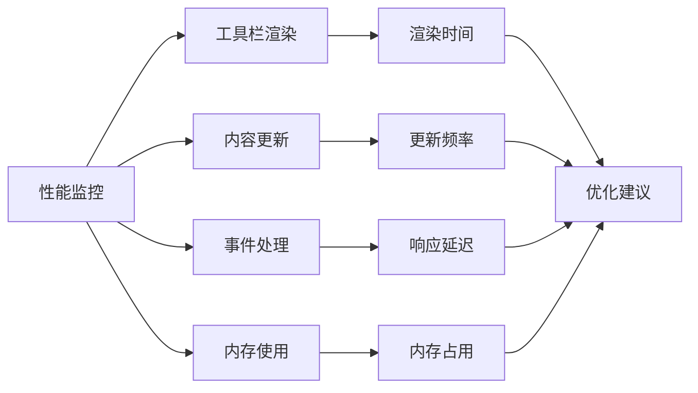

# Quill自定义工具栏

<cite>
**本文档引用的文件**
- [quill.vue](file://src/views/rich-editor/quill.vue)
- [quill.snow.css](file://node_modules/quill/dist/quill.snow.css)
- [quill.bubble.css](file://node_modules/quill/dist/quill.bubble.css)
- [science-blue.css](file://src/assets/custom-theme/science-blue.css)
- [theme-summer.css](file://src/assets/custom-theme/theme-summer.css)
- [base.scss](file://src/assets/style/base.scss)
- [dark.scss](file://src/assets/style/dark.scss)
- [vue.config.js](file://vue.config.js)
- [package.json](file://package.json)
</cite>

## 目录
1. [简介](#简介)
2. [项目结构](#项目结构)
3. [核心组件](#核心组件)
4. [架构概览](#架构概览)
5. [详细组件分析](#详细组件分析)
6. [依赖关系分析](#依赖关系分析)
7. [性能考虑](#性能考虑)
8. [故障排除指南](#故障排除指南)
9. [结论](#结论)

## 简介

本项目实现了基于Quill富文本编辑器的自定义工具栏功能。Quill是一个现代化的富文本编辑器，支持CDN和npm两种引入方式。该实现展示了如何自定义工具栏配置、添加自定义按钮、处理图片上传功能，以及实现响应式布局和主题定制。

主要特性包括：
- 自定义工具栏配置选项
- 图片上传功能集成
- 字数统计和验证
- 响应式设计
- 多主题支持
- 自定义按钮功能扩展

## 项目结构

项目采用Vue.js单页应用架构，富文本编辑器功能位于`src/views/rich-editor/`目录下：



**图表来源**
- [quill.vue:1-236](file://src/views/rich-editor/quill.vue#L1-L236)
- [quill.snow.css:1-200](file://node_modules/quill/dist/quill.snow.css#L1-L200)
- [science-blue.css:1-49](file://src/assets/custom-theme/science-blue.css#L1-L49)

**章节来源**
- [quill.vue:1-236](file://src/views/rich-editor/quill.vue#L1-L236)
- [vue.config.js:47-102](file://vue.config.js#L47-L102)

## 核心组件

### 工具栏配置系统

项目实现了完整的工具栏配置系统，支持多种格式化选项：



**图表来源**
- [quill.vue:47-66](file://src/views/rich-editor/quill.vue#L47-L66)
- [quill.vue:119-134](file://src/views/rich-editor/quill.vue#L119-L134)

### 主题系统架构

项目提供了多主题支持机制：



**图表来源**
- [quill.snow.css:1-200](file://node_modules/quill/dist/quill.snow.css#L1-L200)
- [science-blue.css:1-49](file://src/assets/custom-theme/science-blue.css#L1-L49)
- [dark.scss:1-33](file://src/assets/style/dark.scss#L1-L33)

**章节来源**
- [quill.vue:47-58](file://src/views/rich-editor/quill.vue#L47-L58)
- [quill.vue:141-171](file://src/views/rich-editor/quill.vue#L141-L171)

## 架构概览

### 整体架构设计



**图表来源**
- [quill.vue:135-182](file://src/views/rich-editor/quill.vue#L135-L182)

### 数据流架构



**图表来源**
- [quill.vue:75-86](file://src/views/rich-editor/quill.vue#L75-L86)
- [quill.vue:110-118](file://src/views/rich-editor/quill.vue#L110-L118)

## 详细组件分析

### 工具栏配置详解

#### 基础格式化工具栏

工具栏配置采用了分组设计，每个数组元素代表一行工具栏：

```mermaid
graph TB
subgraph "工具栏分组"
A[字体大小组<br/>[{size: [...]}]]
B[标题组<br/>[{header: [1,2,3,4,5,6,false]}]]
C[文本格式组<br/>['bold','italic','underline','strike']]
D[缩进组<br/>[{indent: '-1'}, {indent: '+1'}]]
E[颜色组<br/>[{color: []}, {background: []}]]
F[对齐组<br/>[{align: []}]]
G[清理组<br/>['clean']]
H[媒体组<br/>['image']]
I[自定义组<br/>['custom']]
end
A --> J[工具栏容器]
B --> J
C --> J
D --> J
E --> J
F --> J
G --> J
H --> J
I --> J
```

**图表来源**
- [quill.vue:48-58](file://src/views/rich-editor/quill.vue#L48-L58)

#### 自定义按钮实现

自定义按钮的实现包含了样式定制和功能绑定：



**图表来源**
- [quill.vue:121-125](file://src/views/rich-editor/quill.vue#L121-L125)
- [quill.vue:127-134](file://src/views/rich-editor/quill.vue#L127-L134)

**章节来源**
- [quill.vue:47-58](file://src/views/rich-editor/quill.vue#L47-L58)
- [quill.vue:119-134](file://src/views/rich-editor/quill.vue#L119-L134)

### 图片上传功能

#### 上传流程设计



**图表来源**
- [quill.vue:59-66](file://src/views/rich-editor/quill.vue#L59-L66)
- [quill.vue:88-109](file://src/views/rich-editor/quill.vue#L88-L109)

#### 图片处理机制

图片上传功能集成了Element UI的上传组件，提供了完整的文件处理流程：

**章节来源**
- [quill.vue:88-109](file://src/views/rich-editor/quill.vue#L88-L109)

### 内容监听与验证

#### 实时内容监控



**图表来源**
- [quill.vue:110-118](file://src/views/rich-editor/quill.vue#L110-L118)
- [quill.vue:75-86](file://src/views/rich-editor/quill.vue#L75-L86)

**章节来源**
- [quill.vue:75-86](file://src/views/rich-editor/quill.vue#L75-L86)
- [quill.vue:110-118](file://src/views/rich-editor/quill.vue#L110-L118)

### 主题定制系统

#### 多主题支持架构



**图表来源**
- [quill.snow.css:1-200](file://node_modules/quill/dist/quill.snow.css#L1-L200)
- [science-blue.css:1-49](file://src/assets/custom-theme/science-blue.css#L1-L49)
- [theme-summer.css:1-800](file://src/assets/custom-theme/theme-summer.css#L1-L800)

**章节来源**
- [quill.snow.css:1-200](file://node_modules/quill/dist/quill.snow.css#L1-L200)
- [science-blue.css:1-49](file://src/assets/custom-theme/science-blue.css#L1-L49)
- [theme-summer.css:1-800](file://src/assets/custom-theme/theme-summer.css#L1-L800)

## 依赖关系分析

### 核心依赖关系

```mermaid
graph TB
subgraph "运行时依赖"
A[quill@1.3.7] --> B[核心编辑器]
A --> C[Delta转换]
A --> D[Parchment引擎]
end
subgraph "扩展模块"
E[quill-image-resize-module@3.0.0] --> F[图片调整]
G[quill-image-drop-module] --> H[拖拽上传]
end
subgraph "构建工具"
I[vue.config.js] --> J[Webpack别名]
I --> K[ProvidePlugin]
L[package.json] --> M[依赖声明]
end
A --> E
A --> G
I --> A
L --> A
```

**图表来源**
- [package.json](file://package.json)
- [vue.config.js:51-64](file://vue.config.js#L51-L64)

### 版本兼容性

项目使用的Quill版本为1.3.7，这是一个稳定版本，提供了完整的工具栏功能和模块化架构。扩展模块如图片调整和拖拽上传为独立包，便于按需引入。

**章节来源**
- [package.json](file://package.json)
- [vue.config.js:51-64](file://vue.config.js#L51-L64)

## 性能考虑

### 优化策略

1. **懒加载机制**：工具栏按钮按需初始化，避免不必要的DOM操作
2. **事件节流**：内容变更监听采用防抖处理，减少频繁更新
3. **内存管理**：组件销毁时清理Quill实例和事件监听器
4. **样式缓存**：主题样式一次性应用，避免重复计算

### 性能监控



## 故障排除指南

### 常见问题及解决方案

#### 工具栏按钮不响应

**问题描述**：自定义按钮点击无反应

**解决方案**：
1. 检查按钮类名是否正确设置为`ql-custom`
2. 确认事件处理器已正确注册
3. 验证CSS样式未覆盖点击事件

#### 图片上传失败

**问题描述**：图片上传后无法显示

**解决方案**：
1. 检查服务器返回格式是否符合预期
2. 验证图片URL是否可访问
3. 确认Quill实例的selection状态

#### 主题样式冲突

**问题描述**：自定义主题与Quill样式冲突

**解决方案**：
1. 使用CSS作用域隔离
2. 检查主题优先级设置
3. 验证CSS变量覆盖顺序

**章节来源**
- [quill.vue:188-191](file://src/views/rich-editor/quill.vue#L188-L191)

## 结论

本项目成功实现了Quill富文本编辑器的自定义工具栏功能，展现了以下关键特性：

1. **灵活的工具栏配置**：支持多种格式化选项和自定义按钮
2. **完整的图片处理**：集成了上传、预览和错误处理机制
3. **响应式设计**：适配不同屏幕尺寸和设备
4. **多主题支持**：提供科学蓝、夏日等主题选择
5. **性能优化**：采用懒加载和事件节流等优化策略

该实现为开发者提供了丰富的扩展点，可以根据具体需求进行功能定制和主题美化。通过模块化的架构设计，代码具有良好的可维护性和可扩展性。