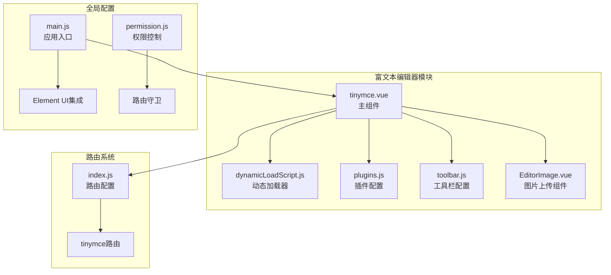
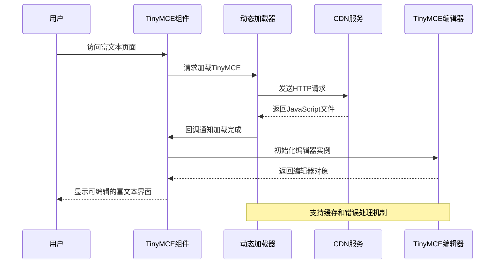
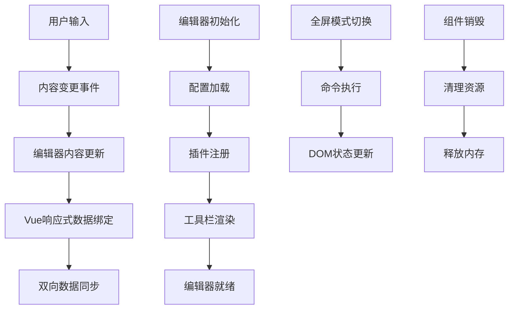
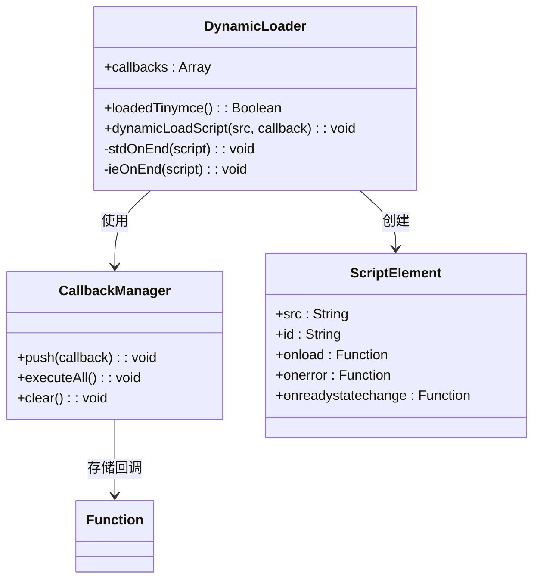
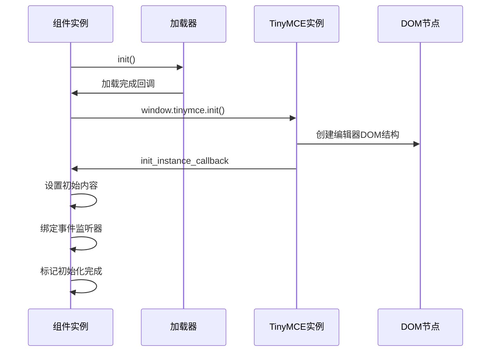
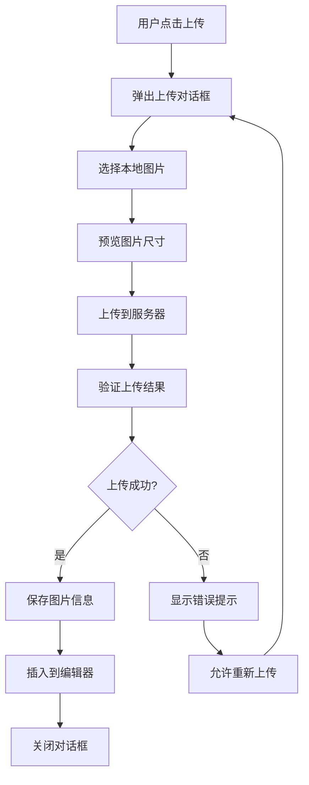
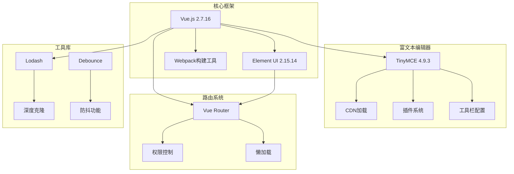

# TinyMCE动态加载机制

<cite>
**本文档引用的文件**
- [tinymce.vue](file://src/views/rich-editor/tinymce.vue)
- [dynamicLoadScript.js](file://src/views/rich-editor/tinymce-components/dynamicLoadScript.js)
- [plugins.js](file://src/views/rich-editor/tinymce-components/plugins.js)
- [toolbar.js](file://src/views/rich-editor/tinymce-components/toolbar.js)
- [EditorImage.vue](file://src/views/rich-editor/tinymce-components/components/EditorImage.vue)
- [package.json](file://package.json)
- [main.js](file://src/main.js)
- [index.js](file://src/router/index.js)
- [permission.js](file://src/permission.js)
- [index.js](file://src/utils/index.js)
</cite>

## 目录
1. [简介](#简介)
2. [项目结构](#项目结构)
3. [核心组件](#核心组件)
4. [架构概览](#架构概览)
5. [详细组件分析](#详细组件分析)
6. [依赖关系分析](#依赖关系分析)
7. [性能考虑](#性能考虑)
8. [故障排除指南](#故障排除指南)
9. [结论](#结论)

## 简介

本文档深入解析了Vue CMS项目中TinyMCE富文本编辑器的动态加载机制。该项目采用CDN异步加载策略，实现了高效的资源管理和运行时配置更新。通过动态脚本加载、缓存机制和错误处理，确保了编辑器的可靠性和性能表现。

TinyMCE作为业界领先的富文本编辑器，在本项目中被精心集成，提供了丰富的插件生态系统和高度可定制的工具栏配置。项目采用了现代化的前端技术栈，包括Vue.js 2.7.16、Element UI 2.15.14和Webpack构建工具，为富文本编辑功能提供了稳定的技术基础。

## 项目结构

项目采用模块化的组织方式，富文本编辑器相关代码主要集中在`src/views/rich-editor/`目录下：

**图表来源**
- [tinymce.vue:1-153](file://src/views/rich-editor/tinymce.vue#L1-L153)
- [dynamicLoadScript.js:1-60](file://src/views/rich-editor/tinymce-components/dynamicLoadScript.js#L1-L60)
- [index.js:269-290](file://src/router/index.js#L269-L290)

**章节来源**
- [tinymce.vue:1-153](file://src/views/rich-editor/tinymce.vue#L1-L153)
- [index.js:1-343](file://src/router/index.js#L1-L343)

## 核心组件

### 主要组件职责

**TinyMCE主组件** (`tinymce.vue`)
- 负责编辑器的整体生命周期管理
- 实现动态脚本加载和初始化流程
- 处理内容变更和状态同步
- 管理全屏模式和销毁流程

**动态加载器** (`dynamicLoadScript.js`)
- 实现CDN脚本的异步加载机制
- 提供回调函数管理和错误处理
- 支持重复加载检测和缓存策略

**配置模块**
- `plugins.js`: 定义编辑器插件集合
- `toolbar.js`: 配置工具栏按钮布局
- `EditorImage.vue`: 图片上传和管理功能

**章节来源**
- [tinymce.vue:26-125](file://src/views/rich-editor/tinymce.vue#L26-L125)
- [dynamicLoadScript.js:9-59](file://src/views/rich-editor/tinymce-components/dynamicLoadScript.js#L9-L59)

## 架构概览

项目采用分层架构设计，实现了清晰的关注点分离：

**图表来源**
- [tinymce.vue:53-62](file://src/views/rich-editor/tinymce.vue#L53-L62)
- [dynamicLoadScript.js:9-29](file://src/views/rich-editor/tinymce-components/dynamicLoadScript.js#L9-L29)

### 数据流架构

**图表来源**
- [tinymce.vue:84-99](file://src/views/rich-editor/tinymce.vue#L84-L99)
- [tinymce.vue:101-109](file://src/views/rich-editor/tinymce.vue#L101-L109)

## 详细组件分析

### 动态加载器实现

动态加载器是整个系统的核心组件，负责处理TinyMCE的异步加载：

**图表来源**
- [dynamicLoadScript.js:1-59](file://src/views/rich-editor/tinymce-components/dynamicLoadScript.js#L1-L59)

#### 关键特性分析

**重复加载检测**
- 通过检查DOM中是否存在具有特定ID的script元素来避免重复加载
- 支持已加载脚本的状态检测和回调队列管理

**跨浏览器兼容性**
- 标准浏览器使用`onload`事件处理
- IE浏览器使用`onreadystatechange`事件处理
- 统一的错误处理机制

**回调管理机制**
- 维护回调函数队列，确保所有等待的回调都能得到执行
- 支持动态添加回调函数和批量执行

**章节来源**
- [dynamicLoadScript.js:9-59](file://src/views/rich-editor/tinymce-components/dynamicLoadScript.js#L9-L59)

### 编辑器初始化流程

编辑器初始化过程体现了完整的生命周期管理：

**图表来源**
- [tinymce.vue:53-100](file://src/views/rich-editor/tinymce.vue#L53-L100)

#### 初始化配置详解

**核心配置项**
- `selector`: 指定编辑器绑定的DOM元素
- `language`: 设置编辑器界面语言
- `height`: 编辑器容器高度
- `plugins`: 插件集合配置
- `toolbar`: 工具栏按钮布局

**事件处理机制**
- `init_instance_callback`: 编辑器实例初始化完成回调
- `setup`: 编辑器实例设置回调
- 内容变更事件监听

**章节来源**
- [tinymce.vue:65-99](file://src/views/rich-editor/tinymce.vue#L65-L99)

### 插件和工具栏配置

项目实现了灵活的插件和工具栏配置系统：

**插件配置** (`plugins.js`)
- 集成了20多个官方插件
- 支持高级列表、代码示例、图像工具等功能
- 可根据需求进行选择性启用

**工具栏配置** (`toolbar.js`)
- 提供两行工具栏按钮布局
- 包含常用格式化、插入、编辑功能
- 支持自定义扩展

**章节来源**
- [plugins.js:5-7](file://src/views/rich-editor/tinymce-components/plugins.js#L5-L7)
- [toolbar.js:4-7](file://src/views/rich-editor/tinymce-components/toolbar.js#L4-L7)

### 图片上传组件

图片上传组件提供了完整的富文本图片处理功能：

**图表来源**
- [EditorImage.vue:47-59](file://src/views/rich-editor/tinymce-components/components/EditorImage.vue#L47-L59)

**章节来源**
- [EditorImage.vue:28-96](file://src/views/rich-editor/tinymce-components/components/EditorImage.vue#L28-L96)

## 依赖关系分析

### 技术栈依赖

项目采用现代化的前端技术栈，各组件间存在明确的依赖关系：

**图表来源**
- [package.json:33-63](file://package.json#L33-L63)
- [main.js:3-42](file://src/main.js#L3-L42)

### 外部依赖管理

**CDN资源管理**
- 使用jsDelivr CDN提供TinyMCE核心文件
- 版本锁定在4.9.3确保稳定性
- 支持HTTPS安全传输

**本地依赖优化**
- 仅安装必要的运行时依赖
- 避免开发工具对生产环境的影响
- 优化包体积减少加载时间

**章节来源**
- [package.json:33-63](file://package.json#L33-L63)
- [tinymce.vue:24-24](file://src/views/rich-editor/tinymce.vue#L24-L24)

## 性能考虑

### 加载性能优化

**CDN缓存策略**
- 利用浏览器缓存机制减少重复下载
- 版本号固定避免缓存污染
- 合理的缓存头设置

**异步加载优势**
- 不阻塞页面主线程
- 提升首屏渲染速度
- 支持渐进式增强

**资源压缩**
- 使用压缩版本的JavaScript文件
- 减少网络传输时间
- 优化带宽使用

### 内存管理

**组件生命周期优化**
- 在合适的时机销毁编辑器实例
- 清理事件监听器避免内存泄漏
- 合理管理DOM引用

**状态管理**
- 使用Vue响应式系统自动追踪状态变化
- 避免不必要的重新渲染
- 优化数据绑定策略

## 故障排除指南

### 常见问题及解决方案

**加载失败处理**
- 检查网络连接和CDN可用性
- 验证脚本URL的正确性
- 实施降级策略和错误提示

**初始化异常**
- 确认DOM元素存在且可访问
- 检查配置参数的有效性
- 验证插件依赖关系

**内存泄漏预防**
- 确保组件销毁时清理所有资源
- 移除事件监听器和定时器
- 释放大对象引用

### 调试技巧

**开发环境调试**
- 使用浏览器开发者工具监控网络请求
- 检查控制台错误信息
- 分析内存使用情况

**生产环境监控**
- 实施错误报告机制
- 监控加载性能指标
- 收集用户反馈信息

**章节来源**
- [dynamicLoadScript.js:41-44](file://src/views/rich-editor/tinymce-components/dynamicLoadScript.js#L41-L44)
- [tinymce.vue:55-59](file://src/views/rich-editor/tinymce.vue#L55-L59)

## 结论

本项目成功实现了TinyMCE富文本编辑器的动态加载机制，展现了现代前端开发的最佳实践。通过CDN异步加载、智能缓存和完善的错误处理，确保了编辑器的高性能和高可用性。

**主要成就**
- 实现了可靠的动态脚本加载机制
- 提供了灵活的配置更新能力
- 建立了完整的错误处理和降级策略
- 优化了加载性能和资源管理

**技术亮点**
- 跨浏览器兼容性的动态加载器
- 模块化的配置管理
- 完善的生命周期管理
- 优秀的用户体验设计

该实现为类似项目提供了宝贵的参考，展示了如何在实际生产环境中优雅地集成和优化富文本编辑功能。