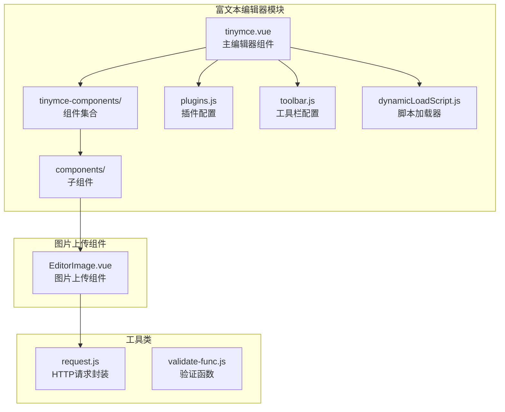
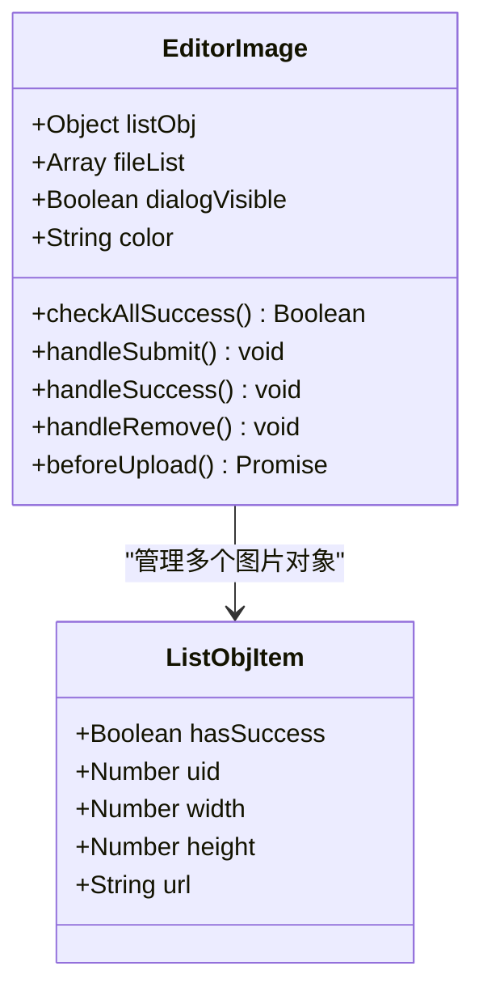
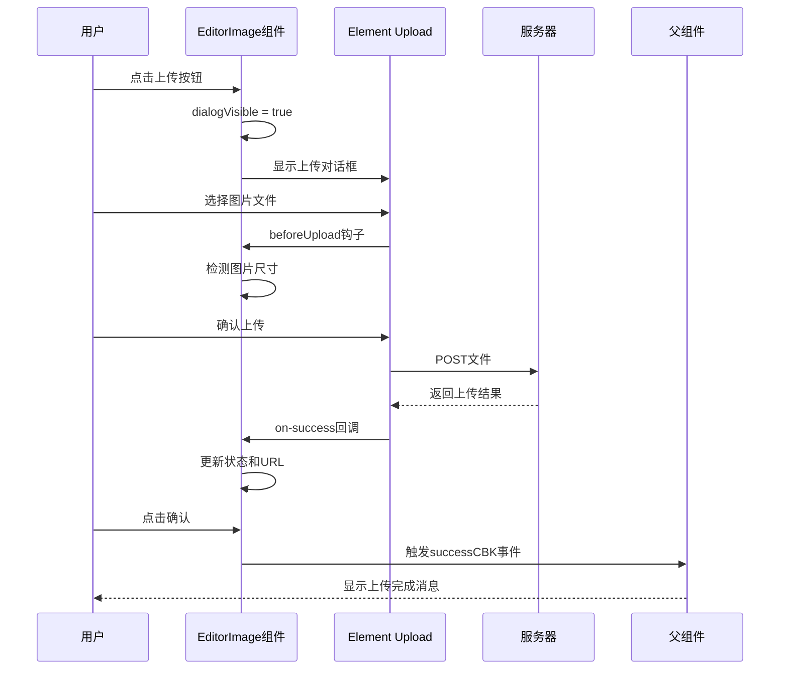
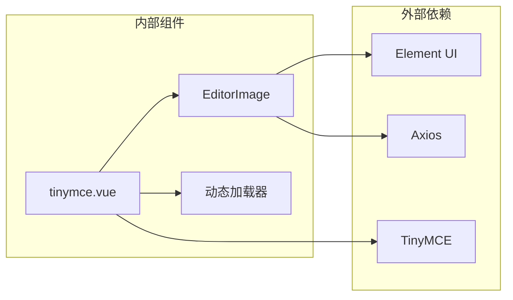
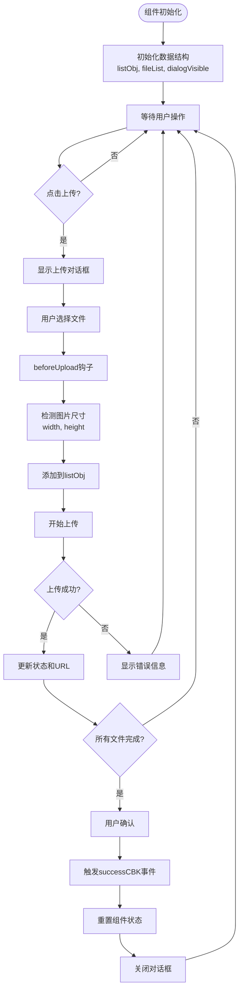
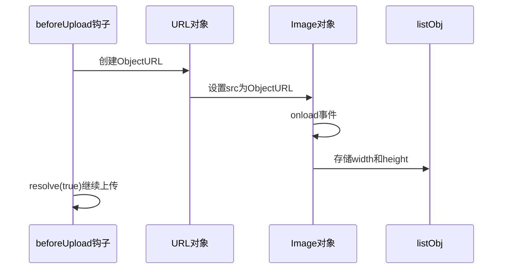
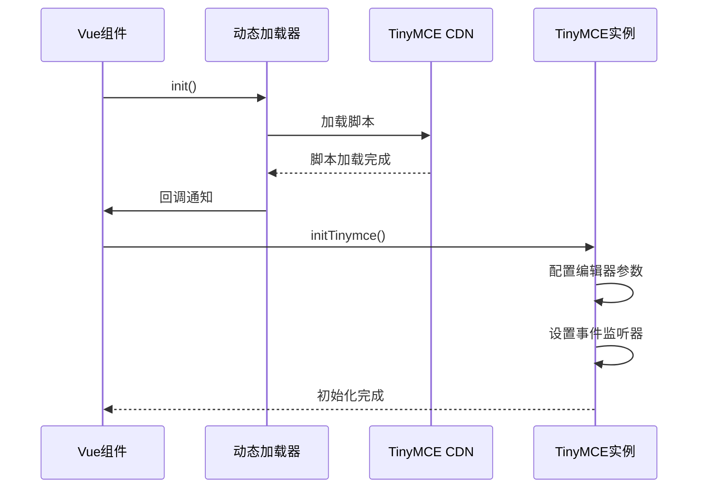
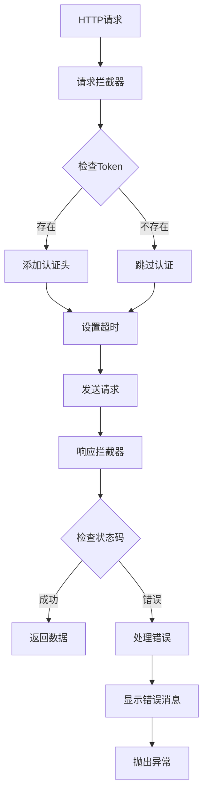
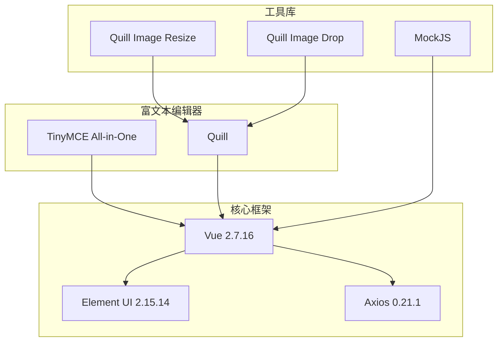
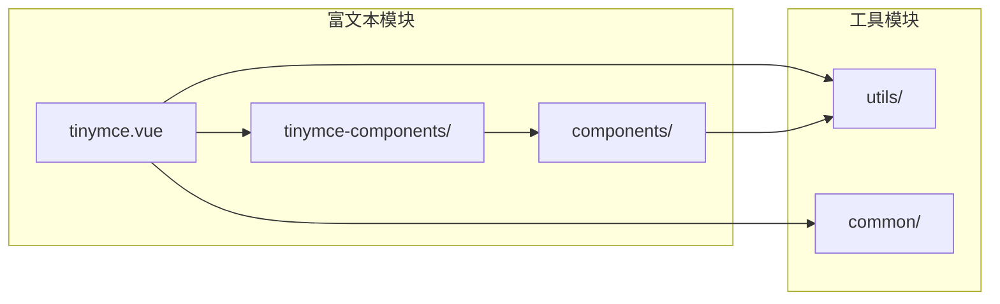

# TinyMCE图片上传组件

<cite>
**本文档引用的文件**
- [EditorImage.vue](file://src/views/rich-editor/tinymce-components/components/EditorImage.vue)
- [tinymce.vue](file://src/views/rich-editor/tinymce.vue)
- [plugins.js](file://src/views/rich-editor/tinymce-components/plugins.js)
- [toolbar.js](file://src/views/rich-editor/tinymce-components/toolbar.js)
- [dynamicLoadScript.js](file://src/views/rich-editor/tinymce-components/dynamicLoadScript.js)
- [quill.vue](file://src/views/rich-editor/quill.vue)
- [request.js](file://src/utils/request.js)
- [package.json](file://package.json)
- [README.md](file://README.md)
</cite>

## 目录
1. [简介](#简介)
2. [项目结构](#项目结构)
3. [核心组件](#核心组件)
4. [架构概览](#架构概览)
5. [详细组件分析](#详细组件分析)
6. [依赖关系分析](#依赖关系分析)
7. [性能考虑](#性能考虑)
8. [故障排除指南](#故障排除指南)
9. [结论](#结论)
10. [附录](#附录)

## 简介

本文档详细介绍基于TinyMCE富文本编辑器的图片上传组件设计与实现。该组件采用Vue.js框架开发，集成了Element UI的上传组件，实现了完整的图片上传、预览、验证和回传功能。组件支持批量图片上传、实时预览、上传状态跟踪，并通过事件机制与父组件进行数据交互。

TinyMCE作为业界领先的富文本编辑器，提供了强大的图片处理能力。结合本项目中的EditorImage组件，开发者可以轻松实现富文本编辑场景下的图片上传需求，包括图片尺寸检测、上传进度反馈、错误处理等高级功能。

## 项目结构

项目采用典型的Vue.js单页应用架构，富文本编辑器相关代码主要位于`src/views/rich-editor/`目录下：

**图表来源**
- [tinymce.vue:1-153](file://src/views/rich-editor/tinymce.vue#L1-L153)
- [EditorImage.vue:1-107](file://src/views/rich-editor/tinymce-components/components/EditorImage.vue#L1-L107)

**章节来源**
- [README.md:98-132](file://README.md#L98-L132)
- [package.json:33-64](file://package.json#L33-L64)

## 核心组件

### EditorImage组件概述

EditorImage组件是TinyMCE富文本编辑器的图片上传核心组件，具有以下关键特性：

- **响应式设计**：支持不同屏幕尺寸的适配
- **批量上传**：支持多张图片同时上传
- **实时预览**：上传前即时显示图片预览
- **状态管理**：完整跟踪每个图片的上传状态
- **事件驱动**：通过事件机制与父组件通信

### 组件属性配置

| 属性名 | 类型 | 默认值 | 描述 |
|--------|------|--------|------|
| color | String | '#1890ff' | 组件主题颜色 |

### 核心数据结构

组件内部维护三个关键数据对象：

**图表来源**
- [EditorImage.vue:36-96](file://src/views/rich-editor/tinymce-components/components/EditorImage.vue#L36-L96)

**章节来源**
- [EditorImage.vue:28-96](file://src/views/rich-editor/tinymce-components/components/EditorImage.vue#L28-L96)

## 架构概览

### 整体架构设计

**图表来源**
- [EditorImage.vue:47-59](file://src/views/rich-editor/tinymce-components/components/EditorImage.vue#L47-L59)
- [EditorImage.vue:60-70](file://src/views/rich-editor/tinymce-components/components/EditorImage.vue#L60-L70)

### 组件间依赖关系

**图表来源**
- [package.json:42-63](file://package.json#L42-L63)
- [EditorImage.vue:1-107](file://src/views/rich-editor/tinymce-components/components/EditorImage.vue#L1-L107)

**章节来源**
- [package.json:42-63](file://package.json#L42-L63)

## 详细组件分析

### EditorImage组件深度解析

#### 数据流分析

**图表来源**
- [EditorImage.vue:44-59](file://src/views/rich-editor/tinymce-components/components/EditorImage.vue#L44-L59)
- [EditorImage.vue:81-94](file://src/views/rich-editor/tinymce-components/components/EditorImage.vue#L81-L94)

#### 关键方法实现

##### 图片尺寸检测机制

组件通过创建临时Image对象来检测图片的宽高信息：

**图表来源**
- [EditorImage.vue:81-94](file://src/views/rich-editor/tinymce-components/components/EditorImage.vue#L81-L94)

##### 上传状态管理

组件使用listObj对象来跟踪每个文件的上传状态：

| 状态字段 | 类型 | 描述 |
|----------|------|------|
| hasSuccess | Boolean | 是否上传成功 |
| uid | Number | 文件唯一标识符 |
| width | Number | 图片宽度 |
| height | Number | 图片高度 |
| url | String | 服务器返回的URL |

**章节来源**
- [EditorImage.vue:44-94](file://src/views/rich-editor/tinymce-components/components/EditorImage.vue#L44-L94)

### TinyMCE集成架构

#### 编辑器初始化流程

**图表来源**
- [tinymce.vue:53-100](file://src/views/rich-editor/tinymce.vue#L53-L100)
- [dynamicLoadScript.js:9-57](file://src/views/rich-editor/tinymce-components/dynamicLoadScript.js#L9-L57)

#### 插件和工具栏配置

TinyMCE通过配置文件定义了丰富的功能特性：

**插件配置要点**：
- `imagetools`: 图片工具支持
- `image`: 图片插入功能
- `codesample`: 代码示例支持
- `table`: 表格功能
- `fullscreen`: 全屏模式

**工具栏配置要点**：
- 基础格式化：粗体、斜体、下划线
- 对齐方式：左对齐、居中、右对齐
- 列表功能：有序列表、无序列表
- 链接和图片：超链接、图片插入
- 高级功能：表格、代码、预览

**章节来源**
- [plugins.js:5-9](file://src/views/rich-editor/tinymce-components/plugins.js#L5-L9)
- [toolbar.js:4-7](file://src/views/rich-editor/tinymce-components/toolbar.js#L4-L7)

### HTTP请求和安全验证

#### 请求拦截器配置

项目使用Axios封装了统一的HTTP请求处理机制：

**图表来源**
- [request.js:18-52](file://src/utils/request.js#L18-L52)
- [request.js:66-107](file://src/utils/request.js#L66-L107)

#### 安全验证机制

系统实现了多层次的安全验证：

1. **Token验证**：自动在请求头中添加认证信息
2. **语言支持**：根据用户语言设置返回相应提示
3. **错误处理**：统一的错误消息显示和处理
4. **网络状态监控**：超时和网络错误的专门处理

**章节来源**
- [request.js:18-52](file://src/utils/request.js#L18-L52)
- [request.js:66-135](file://src/utils/request.js#L66-L135)

## 依赖关系分析

### 外部依赖分析

项目的主要外部依赖包括：

**图表来源**
- [package.json:33-64](file://package.json#L33-L64)

### 内部模块依赖

**图表来源**
- [tinymce.vue:19-24](file://src/views/rich-editor/tinymce.vue#L19-L24)

**章节来源**
- [package.json:33-64](file://package.json#L33-L64)

## 性能考虑

### 图片上传性能优化

1. **异步处理**：使用Promise处理上传过程，避免阻塞UI线程
2. **内存管理**：及时释放ObjectURL，防止内存泄漏
3. **并发控制**：合理设置上传并发数量
4. **缓存策略**：利用浏览器缓存减少重复请求

### 组件渲染优化

1. **懒加载**：TinyMCE按需加载，减少初始包体积
2. **虚拟滚动**：对于大量图片的场景考虑虚拟滚动
3. **事件节流**：对频繁触发的事件进行节流处理

## 故障排除指南

### 常见问题及解决方案

#### 上传失败问题

**问题现象**：图片上传后状态一直为未完成

**可能原因**：
1. 服务器返回格式不符合预期
2. 网络连接不稳定
3. 文件类型不被支持

**解决方案**：
1. 检查服务器响应格式
2. 添加重试机制
3. 实现文件类型验证

#### 图片预览问题

**问题现象**：上传前无法显示图片预览

**可能原因**：
1. 浏览器不支持ObjectURL
2. 图片格式不受支持
3. 内存不足

**解决方案**：
1. 添加浏览器兼容性检查
2. 实现降级方案
3. 优化内存使用

#### 编辑器初始化问题

**问题现象**：TinyMCE无法正常初始化

**可能原因**：
1. CDN加载失败
2. 脚本冲突
3. 配置参数错误

**解决方案**：
1. 检查网络连接
2. 确认脚本版本兼容性
3. 验证配置参数

**章节来源**
- [EditorImage.vue:49-53](file://src/views/rich-editor/tinymce-components/components/EditorImage.vue#L49-L53)
- [dynamicLoadScript.js:31-56](file://src/views/rich-editor/tinymce-components/dynamicLoadScript.js#L31-L56)

## 结论

TinyMCE图片上传组件展现了现代Web应用开发的最佳实践：

1. **模块化设计**：清晰的组件分离和职责划分
2. **用户体验**：完整的上传流程和状态反馈
3. **安全性**：多层次的验证和错误处理机制
4. **可扩展性**：灵活的配置选项和事件机制

该组件为富文本编辑场景下的图片上传提供了完整的解决方案，开发者可以根据具体需求进行定制和扩展。

## 附录

### 配置选项参考

| 配置项 | 类型 | 默认值 | 描述 |
|--------|------|--------|------|
| color | String | '#1890ff' | 组件主题色 |
| action | String | 'https://httpbin.org/post' | 上传目标URL |
| multiple | Boolean | true | 是否支持多文件上传 |
| show-file-list | Boolean | true | 是否显示文件列表 |

### 事件列表

| 事件名 | 参数 | 描述 |
|--------|------|------|
| successCBK | Array | 上传成功回调，返回文件数组 |
| on-remove | Object | 文件移除回调 |
| on-success | Object | 上传成功回调 |
| before-upload | File | 上传前回调 |

### 扩展开发建议

1. **自定义验证规则**：根据业务需求添加文件大小、格式等验证
2. **进度条显示**：集成上传进度监控
3. **批量操作**：支持批量删除、批量上传等功能
4. **图片压缩**：在上传前进行图片压缩处理
5. **断点续传**：实现大文件的断点续传功能