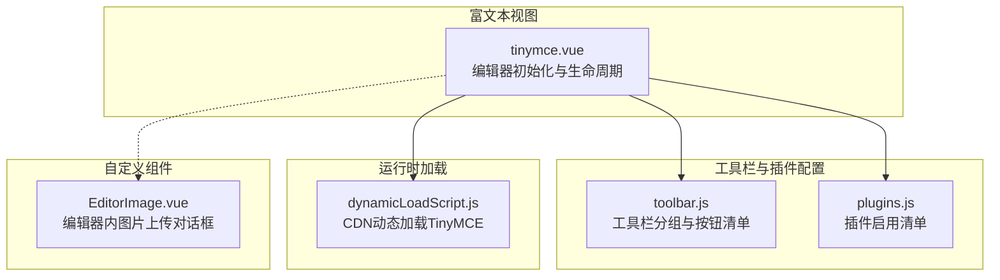
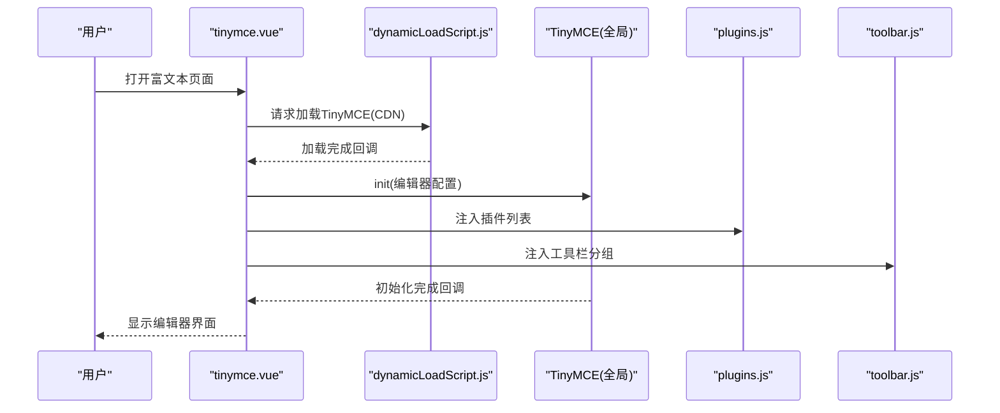
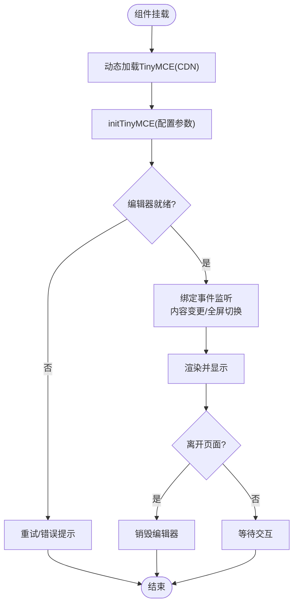
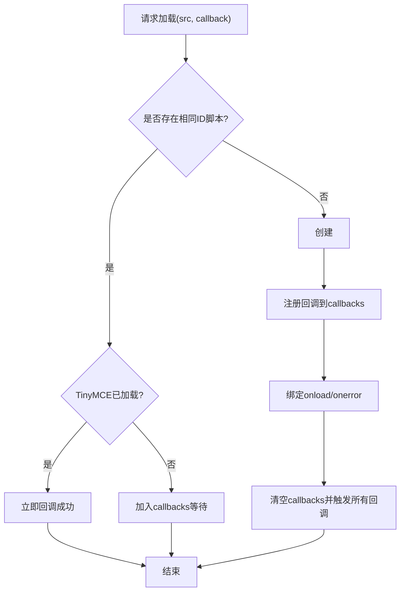
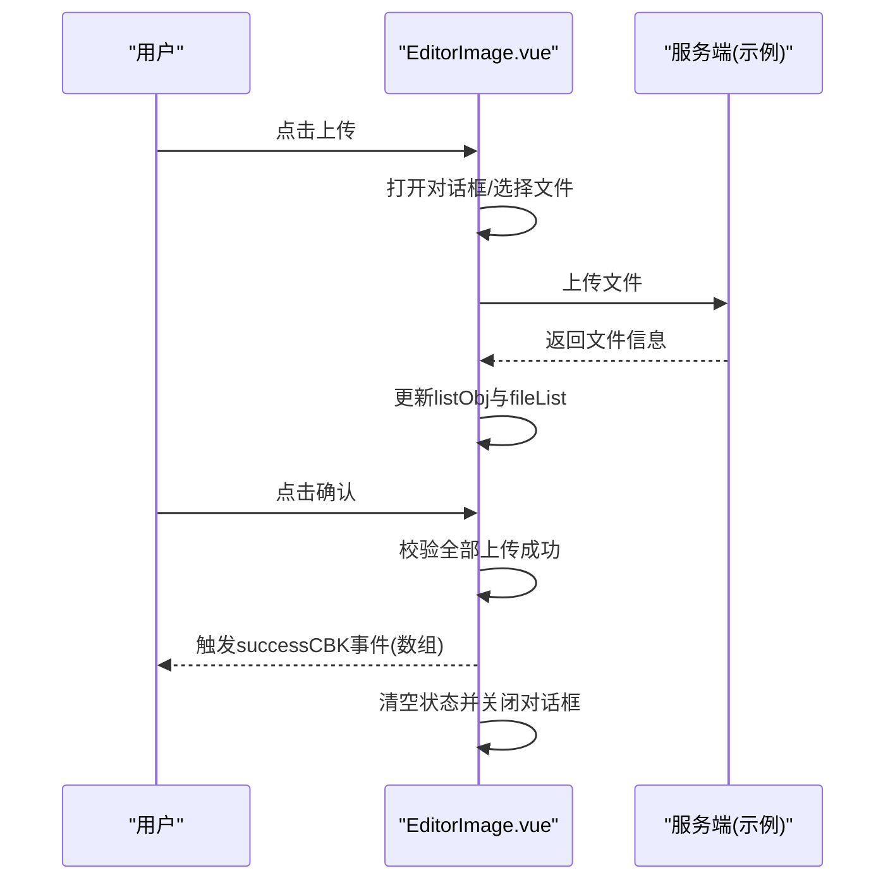
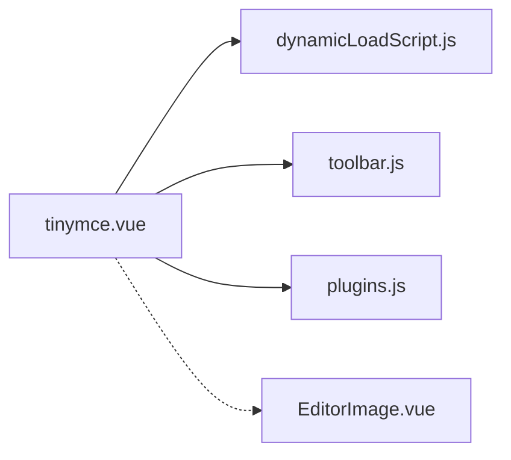

# TinyMCE工具栏定制

<cite>
**本文引用的文件**
- [tinymce.vue](file://src/views/rich-editor/tinymce.vue)
- [toolbar.js](file://src/views/rich-editor/tinymce-components/toolbar.js)
- [plugins.js](file://src/views/rich-editor/tinymce-components/plugins.js)
- [dynamicLoadScript.js](file://src/views/rich-editor/tinymce-components/dynamicLoadScript.js)
- [EditorImage.vue](file://src/views/rich-editor/tinymce-components/components/EditorImage.vue)
- [quill.vue](file://src/views/rich-editor/quill.vue)
</cite>

## 目录
1. [简介](#简介)
2. [项目结构](#项目结构)
3. [核心组件](#核心组件)
4. [架构总览](#架构总览)
5. [详细组件分析](#详细组件分析)
6. [依赖关系分析](#依赖关系分析)
7. [性能考量](#性能考量)
8. [故障排查指南](#故障排查指南)
9. [结论](#结论)
10. [附录](#附录)

## 简介
本文件聚焦于项目中TinyMCE富文本编辑器的工具栏定制实践，系统梳理工具栏配置项、按钮分组、下拉菜单与复合按钮的实现思路，并结合现有代码给出按钮扩展、事件绑定、样式设置、禁用状态、图标与提示信息、响应式布局与移动端适配、主题与视觉优化等实操建议。同时，通过与同视图下的Quill工具栏配置进行横向对比，帮助开发者在不同编辑器间做出更优选择。

## 项目结构
TinyMCE相关代码集中在富文本编辑器视图与配套组件中，采用“视图层 + 工具栏配置 + 插件配置 + 动态脚本加载 + 自定义上传组件”的分层组织方式。

**图表来源**
- [tinymce.vue:18-125](file://src/views/rich-editor/tinymce.vue#L18-L125)
- [toolbar.js:1-10](file://src/views/rich-editor/tinymce-components/toolbar.js#L1-L10)
- [plugins.js:1-10](file://src/views/rich-editor/tinymce-components/plugins.js#L1-L10)
- [dynamicLoadScript.js:1-60](file://src/views/rich-editor/tinymce-components/dynamicLoadScript.js#L1-L60)
- [EditorImage.vue:1-107](file://src/views/rich-editor/tinymce-components/components/EditorImage.vue#L1-L107)

**章节来源**
- [tinymce.vue:1-153](file://src/views/rich-editor/tinymce.vue#L1-L153)
- [toolbar.js:1-10](file://src/views/rich-editor/tinymce-components/toolbar.js#L1-L10)
- [plugins.js:1-10](file://src/views/rich-editor/tinymce-components/plugins.js#L1-L10)
- [dynamicLoadScript.js:1-60](file://src/views/rich-editor/tinymce-components/dynamicLoadScript.js#L1-L60)
- [EditorImage.vue:1-107](file://src/views/rich-editor/tinymce-components/components/EditorImage.vue#L1-L107)

## 核心组件
- 视图层组件负责编辑器初始化、事件监听、销毁与生命周期管理，工具栏与插件通过外部配置文件注入。
- 工具栏配置文件提供两行按钮分组，覆盖常用格式、插入、表格、表情、颜色、全屏等功能。
- 插件配置文件列出可用插件集合，便于按需启用增强能力。
- 动态脚本加载模块负责从CDN异步加载TinyMCE，处理加载完成回调与错误场景。
- 自定义图片上传组件作为工具栏扩展的典型示例，演示如何在编辑器内集成上传流程与结果回填。

**章节来源**
- [tinymce.vue:34-99](file://src/views/rich-editor/tinymce.vue#L34-L99)
- [toolbar.js:4-7](file://src/views/rich-editor/tinymce-components/toolbar.js#L4-L7)
- [plugins.js:5-7](file://src/views/rich-editor/tinymce-components/plugins.js#L5-L7)
- [dynamicLoadScript.js:9-57](file://src/views/rich-editor/tinymce-components/dynamicLoadScript.js#L9-L57)
- [EditorImage.vue:28-96](file://src/views/rich-editor/tinymce-components/components/EditorImage.vue#L28-L96)

## 架构总览
TinyMCE在该工程中的调用链路清晰：视图组件在挂载阶段通过动态脚本加载器加载TinyMCE，随后以配置对象初始化编辑器，工具栏与插件由独立配置文件提供，编辑器事件驱动内容同步与状态更新。

**图表来源**
- [tinymce.vue:53-99](file://src/views/rich-editor/tinymce.vue#L53-L99)
- [dynamicLoadScript.js:9-57](file://src/views/rich-editor/tinymce-components/dynamicLoadScript.js#L9-L57)
- [plugins.js:5-7](file://src/views/rich-editor/tinymce-components/plugins.js#L5-L7)
- [toolbar.js:4-7](file://src/views/rich-editor/tinymce-components/toolbar.js#L4-L7)

## 详细组件分析

### 视图层：编辑器初始化与生命周期
- 动态加载：通过传入CDN地址与回调，确保TinyMCE可用后再初始化。
- 初始化参数：语言、高度、工具栏、插件、菜单栏、内容过滤与粘贴策略、全屏状态监听等。
- 内容同步：监听节点变更、内容变更、键盘输入与设置内容事件，将编辑器HTML内容回写至组件data，实现双向显示。
- 生命周期：挂载时初始化，进入/离开keep-alive时重建或销毁，保证内存与状态一致性。

**图表来源**
- [tinymce.vue:53-124](file://src/views/rich-editor/tinymce.vue#L53-L124)

**章节来源**
- [tinymce.vue:53-124](file://src/views/rich-editor/tinymce.vue#L53-L124)

### 工具栏配置：分组、按钮与组合
- 分组方式：通过二维数组将按钮按功能分组，第一行偏基础格式与撤销重做，第二行偏插入与高级功能。
- 按钮类型：包含文本格式、对齐、缩进、引用、代码、表格、媒体、表情、颜色、全屏等。
- 组合策略：同一行内按钮紧密排列，跨行形成逻辑分组，提升可用性与可读性。

**图表来源**
- [toolbar.js:4-7](file://src/views/rich-editor/tinymce-components/toolbar.js#L4-L7)

**章节来源**
- [toolbar.js:4-7](file://src/views/rich-editor/tinymce-components/toolbar.js#L4-L7)

### 插件配置：功能扩展与能力开关
- 插件清单：涵盖列表、锚点、自动保存、粘贴、预览、打印、表格、模板、文本样式、拼写检查、方向性、表情、媒体、可视化块等。
- 使用方式：在初始化时统一注入，按需启用，避免不必要的体积与性能开销。

**图表来源**
- [plugins.js:5-7](file://src/views/rich-editor/tinymce-components/plugins.js#L5-L7)

**章节来源**
- [plugins.js:5-7](file://src/views/rich-editor/tinymce-components/plugins.js#L5-L7)

### 动态脚本加载：CDN与回调机制
- 单次加载：检测是否存在相同ID的脚本节点，避免重复注入。
- 成功/失败回调：标准与IE兼容两种onload处理，统一触发回调队列。
- 加载校验：通过全局TinyMCE存在性判断，确保后续初始化安全。

**图表来源**
- [dynamicLoadScript.js:9-57](file://src/views/rich-editor/tinymce-components/dynamicLoadScript.js#L9-L57)

**章节来源**
- [dynamicLoadScript.js:9-57](file://src/views/rich-editor/tinymce-components/dynamicLoadScript.js#L9-L57)

### 自定义组件：编辑器内图片上传
- 交互流程：点击按钮弹出对话框，支持多文件上传与移除，提交前校验全部上传成功。
- 数据结构：维护每张图片的临时对象，记录上传状态与尺寸，成功后回填URL。
- 结果回传：通过自定义事件向父组件传递上传结果数组，清空状态并关闭对话框。

**图表来源**
- [EditorImage.vue:47-59](file://src/views/rich-editor/tinymce-components/components/EditorImage.vue#L47-L59)

**章节来源**
- [EditorImage.vue:28-96](file://src/views/rich-editor/tinymce-components/components/EditorImage.vue#L28-L96)

### 与Quill工具栏配置的对比参考
- Quill采用容器+处理器的模式，通过handlers为自定义按钮绑定方法，支持模块化扩展（如图片拖放、缩放）。
- TinyMCE通过插件与工具栏分组实现功能扩展，适合更复杂的编辑场景与企业级需求。
- 两者均可实现自定义按钮与事件绑定，但TinyMCE的插件生态更丰富，Quill的模块化更轻量。

**章节来源**
- [quill.vue:47-172](file://src/views/rich-editor/quill.vue#L47-L172)

## 依赖关系分析
- 视图层依赖动态加载模块以确保TinyMCE可用，再注入工具栏与插件配置。
- 工具栏与插件配置相互独立，便于按需裁剪与扩展。
- 自定义组件与视图层松耦合，通过事件通信实现数据回传。

**图表来源**
- [tinymce.vue:18-22](file://src/views/rich-editor/tinymce.vue#L18-L22)
- [dynamicLoadScript.js:1-60](file://src/views/rich-editor/tinymce-components/dynamicLoadScript.js#L1-L60)
- [toolbar.js:1-10](file://src/views/rich-editor/tinymce-components/toolbar.js#L1-L10)
- [plugins.js:1-10](file://src/views/rich-editor/tinymce-components/plugins.js#L1-L10)
- [EditorImage.vue:1-107](file://src/views/rich-editor/tinymce-components/components/EditorImage.vue#L1-L107)

**章节来源**
- [tinymce.vue:18-22](file://src/views/rich-editor/tinymce.vue#L18-L22)

## 性能考量
- 按需加载：通过CDN动态加载，减少首屏体积；仅在进入页面时加载一次。
- 插件裁剪：根据业务需要启用插件，避免冗余功能带来的初始化与运行时开销。
- 事件节流：在频繁输入场景下，合理合并内容同步逻辑，降低DOM更新频率。
- 全屏与销毁：离开页面或切换路由时及时销毁编辑器，释放内存与事件监听。

[本节为通用指导，无需具体文件引用]

## 故障排查指南
- TinyMCE未加载：检查动态加载回调是否触发，确认网络与CDN可用性。
- 工具栏不显示：核对工具栏配置数组是否正确，确认初始化时已注入。
- 插件无效：检查插件名是否拼写正确，确认版本兼容性。
- 内容未同步：检查事件监听绑定与内容回写逻辑，确保在合适的时机更新data。
- 全屏异常：确认全屏命令与状态切换逻辑，必要时在销毁前退出全屏。

**章节来源**
- [dynamicLoadScript.js:41-44](file://src/views/rich-editor/tinymce-components/dynamicLoadScript.js#L41-L44)
- [tinymce.vue:84-98](file://src/views/rich-editor/tinymce.vue#L84-L98)

## 结论
本项目在TinyMCE工具栏定制方面采用了“配置文件 + 动态加载 + 视图层控制”的清晰架构。通过工具栏分组与插件清单实现功能模块化，配合自定义上传组件实现编辑器内工作流闭环。建议在实际项目中进一步完善以下方面：细化工具栏分组与按钮排序、按角色裁剪插件与按钮、补充移动端适配与主题定制、完善事件与状态管理的健壮性。

[本节为总结性内容，无需具体文件引用]

## 附录

### 工具栏按钮定制与扩展要点
- 按钮分组：将相关功能归类到同一行，跨行形成逻辑分区，提升可用性。
- 下拉菜单：通过插件提供的下拉控件（如颜色、字体、标题）实现空间优化。
- 复合按钮：将多个子功能整合为一个按钮（如清除格式），减少工具栏拥挤。
- 自定义按钮：在现有插件基础上扩展，或通过插件机制实现新功能（如图片上传）。
- 事件绑定：利用编辑器事件钩子（如Change、SetContent、FullscreenStateChanged）实现联动。
- 样式设置：通过CSS覆盖TinyMCE默认样式，保持与整体设计一致。
- 禁用状态：根据编辑器状态或业务规则动态启用/禁用按钮。
- 图标与提示：结合插件与自定义样式，设置图标与悬浮提示信息。
- 响应式布局：在窄屏设备上优先保留高频按钮，隐藏次要功能；在移动端考虑全屏与键盘适配。
- 主题与视觉：通过CSS变量与主题文件统一风格，确保深浅色模式兼容。

[本节为通用指导，无需具体文件引用]