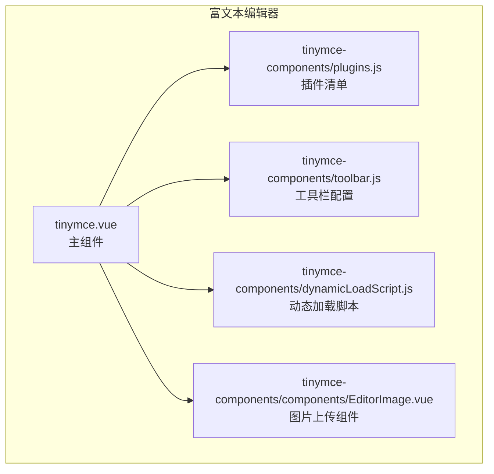
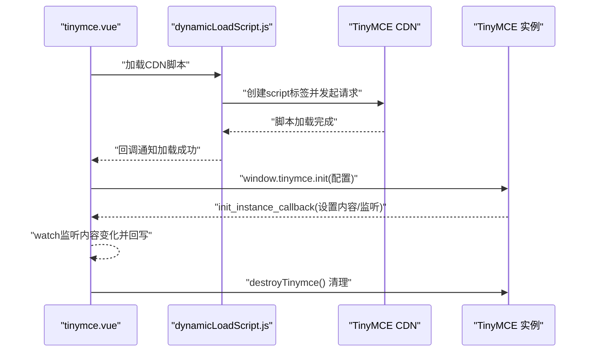
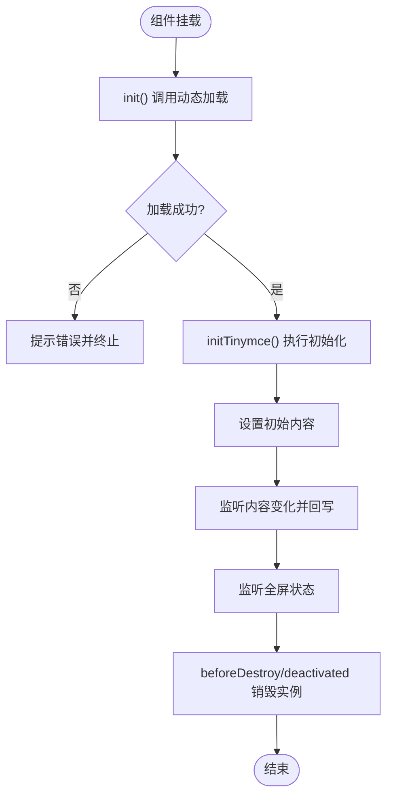
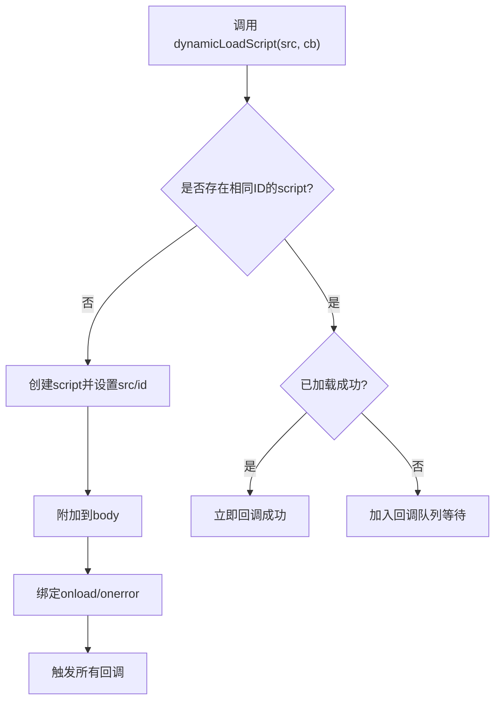
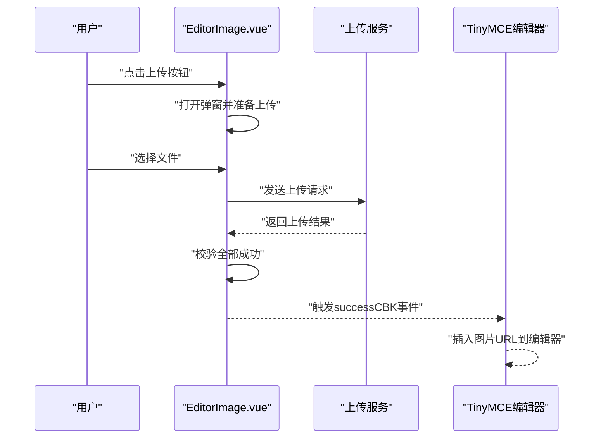
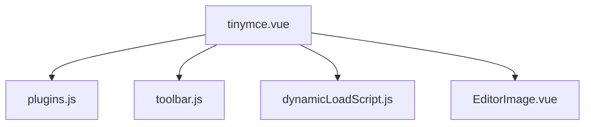

# TinyMCE插件系统

<cite>
**本文引用的文件**
- [tinymce.vue](file://src/views/rich-editor/tinymce.vue)
- [plugins.js](file://src/views/rich-editor/tinymce-components/plugins.js)
- [toolbar.js](file://src/views/rich-editor/tinymce-components/toolbar.js)
- [dynamicLoadScript.js](file://src/views/rich-editor/tinymce-components/dynamicLoadScript.js)
- [EditorImage.vue](file://src/views/rich-editor/tinymce-components/components/EditorImage.vue)
- [quill.vue](file://src/views/rich-editor/quill.vue)
- [package.json](file://package.json)
- [README.md](file://README.md)
</cite>

## 目录
1. [简介](#简介)
2. [项目结构](#项目结构)
3. [核心组件](#核心组件)
4. [架构总览](#架构总览)
5. [详细组件分析](#详细组件分析)
6. [依赖关系分析](#依赖关系分析)
7. [性能考虑](#性能考虑)
8. [故障排查指南](#故障排查指南)
9. [结论](#结论)
10. [附录](#附录)

## 简介
本文件面向开发者，系统性梳理并讲解本项目中基于Vue的TinyMCE富文本编辑器插件系统的实现与扩展方法。内容涵盖：
- TinyMCE插件架构与内置插件清单
- 插件注册机制、生命周期与API接口
- 配置选项、事件处理与UI组件集成
- 自定义TinyMCE插件的开发指南与实现方案
- 插件间依赖关系与冲突处理机制
- 性能优化与调试技巧
- 为开发者提供扩展与功能定制的技术指南

## 项目结构
本项目在“富文本”视图中同时提供了TinyMCE与Quill两种富文本编辑器的实现示例。其中TinyMCE部分采用按需加载CDN脚本的方式，通过独立的配置文件集中管理插件与工具栏，便于扩展与维护。

**图表来源**
- [tinymce.vue:18-24](file://src/views/rich-editor/tinymce.vue#L18-L24)
- [plugins.js:1-9](file://src/views/rich-editor/tinymce-components/plugins.js#L1-L9)
- [toolbar.js:1-9](file://src/views/rich-editor/tinymce-components/toolbar.js#L1-L9)
- [dynamicLoadScript.js:1-59](file://src/views/rich-editor/tinymce-components/dynamicLoadScript.js#L1-L59)
- [EditorImage.vue:1-107](file://src/views/rich-editor/tinymce-components/components/EditorImage.vue#L1-L107)

**章节来源**
- [tinymce.vue:1-153](file://src/views/rich-editor/tinymce.vue#L1-L153)
- [plugins.js:1-9](file://src/views/rich-editor/tinymce-components/plugins.js#L1-L9)
- [toolbar.js:1-9](file://src/views/rich-editor/tinymce-components/toolbar.js#L1-L9)
- [dynamicLoadScript.js:1-59](file://src/views/rich-editor/tinymce-components/dynamicLoadScript.js#L1-L59)
- [EditorImage.vue:1-107](file://src/views/rich-editor/tinymce-components/components/EditorImage.vue#L1-L107)

## 核心组件
- 主组件：负责初始化TinyMCE、绑定事件、生命周期管理与销毁。
- 插件配置：集中声明启用的插件列表，便于按需裁剪与扩展。
- 工具栏配置：集中声明工具栏按钮分组，便于统一风格与功能组织。
- 动态加载脚本：封装CDN脚本加载逻辑，避免重复加载与兼容性问题。
- 图片上传组件：作为UI组件集成到编辑器工作流中，演示如何与TinyMCE交互。

**章节来源**
- [tinymce.vue:26-125](file://src/views/rich-editor/tinymce.vue#L26-L125)
- [plugins.js:5-7](file://src/views/rich-editor/tinymce-components/plugins.js#L5-L7)
- [toolbar.js:4-7](file://src/views/rich-editor/tinymce-components/toolbar.js#L4-L7)
- [dynamicLoadScript.js:9-57](file://src/views/rich-editor/tinymce-components/dynamicLoadScript.js#L9-L57)
- [EditorImage.vue:28-96](file://src/views/rich-editor/tinymce-components/components/EditorImage.vue#L28-L96)

## 架构总览
TinyMCE在本项目中的运行时架构如下：
- 页面挂载时，主组件调用动态加载脚本，从CDN加载TinyMCE核心脚本。
- 脚本加载完成后，主组件调用TinyMCE初始化方法，传入选择器、语言、高度、插件、工具栏、菜单栏等配置。
- 初始化回调中设置内容并监听内容变化，将编辑器内容同步到组件数据。
- 生命周期钩子中处理激活/失活与销毁，保证内存与DOM清理。

**图表来源**
- [tinymce.vue:53-109](file://src/views/rich-editor/tinymce.vue#L53-L109)
- [dynamicLoadScript.js:9-57](file://src/views/rich-editor/tinymce-components/dynamicLoadScript.js#L9-L57)

**章节来源**
- [tinymce.vue:53-109](file://src/views/rich-editor/tinymce.vue#L53-L109)
- [dynamicLoadScript.js:9-57](file://src/views/rich-editor/tinymce-components/dynamicLoadScript.js#L9-L57)

## 详细组件分析

### 主组件：tinymce.vue
职责与关键点：
- 动态加载TinyMCE脚本，错误处理与消息提示。
- 初始化TinyMCE，配置语言、高度、插件、工具栏、菜单栏、对话框尺寸等。
- 监听内容变化并通过回调同步到组件数据，实现双向绑定。
- 生命周期钩子中处理全屏状态切换与实例销毁，避免内存泄漏。

**图表来源**
- [tinymce.vue:53-125](file://src/views/rich-editor/tinymce.vue#L53-L125)

**章节来源**
- [tinymce.vue:26-125](file://src/views/rich-editor/tinymce.vue#L26-L125)

### 插件配置：plugins.js
- 作用：集中声明启用的插件列表，便于按需裁剪与扩展。
- 使用：在主组件初始化时通过配置项传入TinyMCE。

**图表来源**
- [plugins.js:5-7](file://src/views/rich-editor/tinymce-components/plugins.js#L5-L7)
- [tinymce.vue](file://src/views/rich-editor/tinymce.vue#L72)

**章节来源**
- [plugins.js:1-9](file://src/views/rich-editor/tinymce-components/plugins.js#L1-L9)
- [tinymce.vue](file://src/views/rich-editor/tinymce.vue#L72)

### 工具栏配置：toolbar.js
- 作用：集中声明工具栏按钮分组，便于统一风格与功能组织。
- 使用：在主组件初始化时通过配置项传入TinyMCE。

**图表来源**
- [toolbar.js:4-7](file://src/views/rich-editor/tinymce-components/toolbar.js#L4-L7)
- [tinymce.vue](file://src/views/rich-editor/tinymce.vue#L71)

**章节来源**
- [toolbar.js:1-9](file://src/views/rich-editor/tinymce-components/toolbar.js#L1-L9)
- [tinymce.vue](file://src/views/rich-editor/tinymce.vue#L71)

### 动态加载脚本：dynamicLoadScript.js
- 作用：封装CDN脚本加载逻辑，避免重复加载与兼容性问题。
- 特性：支持标准浏览器与IE兼容处理，统一回调队列，加载失败错误提示。

**图表来源**
- [dynamicLoadScript.js:9-57](file://src/views/rich-editor/tinymce-components/dynamicLoadScript.js#L9-L57)

**章节来源**
- [dynamicLoadScript.js:1-59](file://src/views/rich-editor/tinymce-components/dynamicLoadScript.js#L1-L59)

### 图片上传组件：EditorImage.vue
- 作用：提供图片上传弹窗与批量上传能力，校验上传结果并触发父组件回调。
- 集成方式：可在编辑器中通过工具栏按钮触发该组件，上传完成后将图片URL回填至编辑器。

**图表来源**
- [EditorImage.vue:47-59](file://src/views/rich-editor/tinymce-components/components/EditorImage.vue#L47-L59)
- [tinymce.vue:89-92](file://src/views/rich-editor/tinymce.vue#L89-L92)

**章节来源**
- [EditorImage.vue:28-96](file://src/views/rich-editor/tinymce-components/components/EditorImage.vue#L28-L96)
- [tinymce.vue:89-92](file://src/views/rich-editor/tinymce.vue#L89-L92)

### 与Quill对比：插件化思路差异
- Quill通过模块注册与自定义工具栏处理器实现插件化，适合轻量扩展。
- TinyMCE通过插件清单与初始化配置实现插件化，适合复杂功能与生态插件集成。

**章节来源**
- [quill.vue:43-44](file://src/views/rich-editor/quill.vue#L43-L44)
- [quill.vue:136-172](file://src/views/rich-editor/quill.vue#L136-L172)

## 依赖关系分析
- 主组件依赖插件配置、工具栏配置与动态加载脚本。
- 图片上传组件作为UI组件与主组件解耦，通过事件与回调与编辑器交互。
- 项目未直接依赖TinyMCE npm包，而是通过CDN按需加载，降低打包体积。

**图表来源**
- [tinymce.vue:19-21](file://src/views/rich-editor/tinymce.vue#L19-L21)
- [plugins.js:1-9](file://src/views/rich-editor/tinymce-components/plugins.js#L1-L9)
- [toolbar.js:1-9](file://src/views/rich-editor/tinymce-components/toolbar.js#L1-L9)
- [dynamicLoadScript.js:1-59](file://src/views/rich-editor/tinymce-components/dynamicLoadScript.js#L1-L59)
- [EditorImage.vue:1-107](file://src/views/rich-editor/tinymce-components/components/EditorImage.vue#L1-L107)

**章节来源**
- [tinymce.vue:19-21](file://src/views/rich-editor/tinymce.vue#L19-L21)
- [package.json:33-63](file://package.json#L33-L63)

## 性能考虑
- 按需加载：通过CDN按需加载TinyMCE，避免打包体积膨胀。
- 生命周期管理：在组件销毁与失活时主动销毁编辑器实例，防止内存泄漏。
- 事件节流：监听内容变化时避免频繁回写，可通过防抖策略进一步优化。
- 插件裁剪：仅启用必要插件，减少初始化与运行时开销。
- 图片上传：批量上传前进行预校验，减少无效请求与重试。

[本节为通用建议，无需特定文件引用]

## 故障排查指南
- 脚本加载失败：检查CDN可用性与网络环境，确认回调错误提示。
- 编辑器未初始化：确认选择器与容器可见性，检查初始化回调是否执行。
- 内容不同步：检查内容监听与回写逻辑，避免循环更新。
- 全屏状态异常：确认全屏命令与状态监听逻辑。
- 图片上传失败：检查上传服务可用性与回调校验逻辑。

**章节来源**
- [dynamicLoadScript.js:41-44](file://src/views/rich-editor/tinymce-components/dynamicLoadScript.js#L41-L44)
- [tinymce.vue:84-92](file://src/views/rich-editor/tinymce.vue#L84-L92)
- [tinymce.vue:101-109](file://src/views/rich-editor/tinymce.vue#L101-L109)
- [EditorImage.vue:50-53](file://src/views/rich-editor/tinymce-components/components/EditorImage.vue#L50-L53)

## 结论
本项目通过清晰的模块划分与按需加载策略，实现了TinyMCE插件系统的可维护与可扩展。主组件负责生命周期与事件管理，插件与工具栏配置集中化，动态加载脚本保障兼容性，UI组件与编辑器通过事件解耦集成。在此基础上，开发者可按需裁剪插件、扩展工具栏、接入自定义UI组件，实现丰富的富文本编辑体验。

[本节为总结，无需特定文件引用]

## 附录

### TinyMCE插件与配置清单
- 插件清单：参见插件配置文件，包含常用插件集合。
- 工具栏配置：参见工具栏配置文件，包含按钮分组。
- 初始化配置：参见主组件初始化逻辑，包含语言、高度、菜单栏、对话框尺寸等。

**章节来源**
- [plugins.js:5-7](file://src/views/rich-editor/tinymce-components/plugins.js#L5-L7)
- [toolbar.js:4-7](file://src/views/rich-editor/tinymce-components/toolbar.js#L4-L7)
- [tinymce.vue:65-99](file://src/views/rich-editor/tinymce.vue#L65-L99)

### 开发者扩展指南
- 新增插件：在插件配置中追加插件名，确保对应插件资源可用。
- 自定义工具栏：在工具栏配置中增加按钮分组，按需调整顺序与布局。
- 集成UI组件：通过事件与回调将UI组件与编辑器交互，保持解耦。
- 生命周期管理：在组件销毁与失活时主动销毁编辑器实例，避免内存泄漏。
- 调试技巧：利用初始化回调与事件监听定位问题，结合浏览器控制台与网络面板排查。

**章节来源**
- [tinymce.vue:53-109](file://src/views/rich-editor/tinymce.vue#L53-L109)
- [EditorImage.vue:47-59](file://src/views/rich-editor/tinymce-components/components/EditorImage.vue#L47-L59)