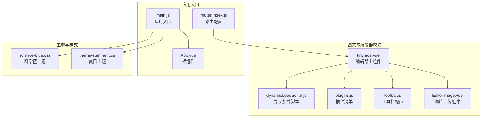
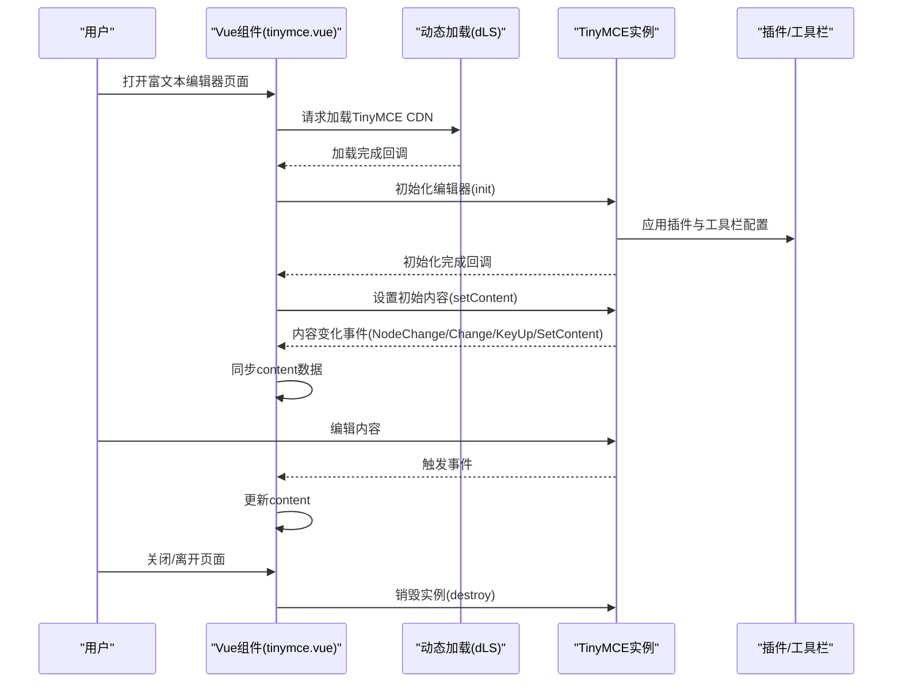
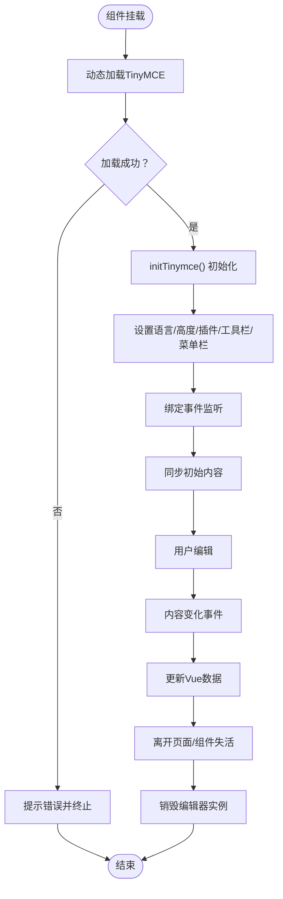
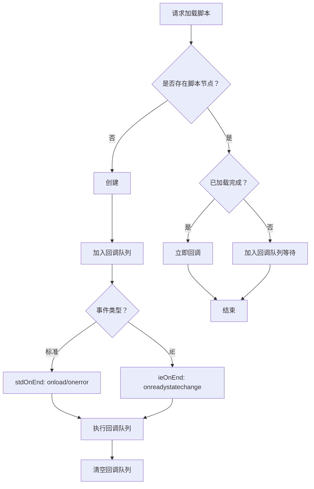
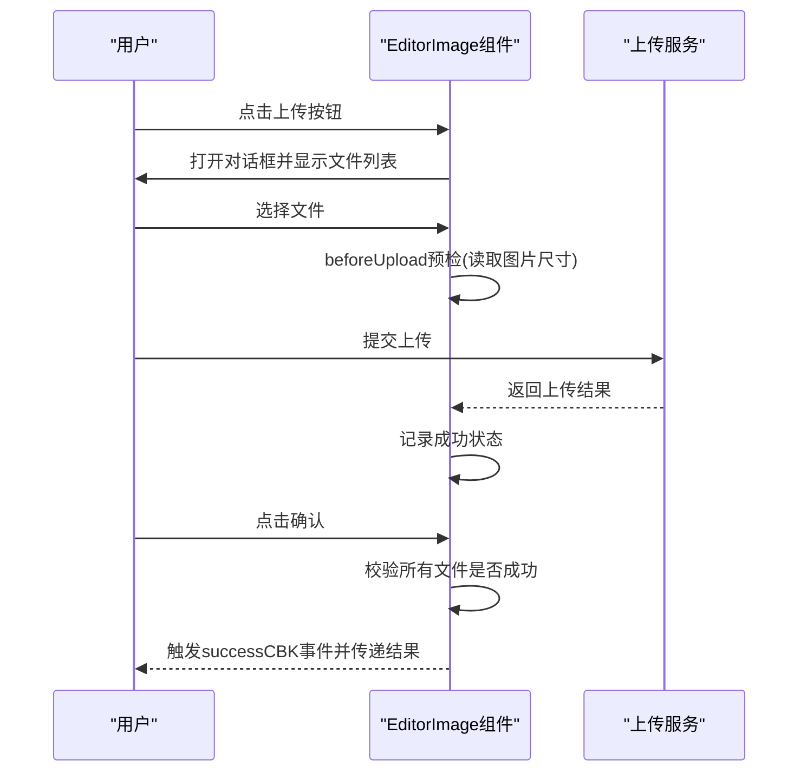
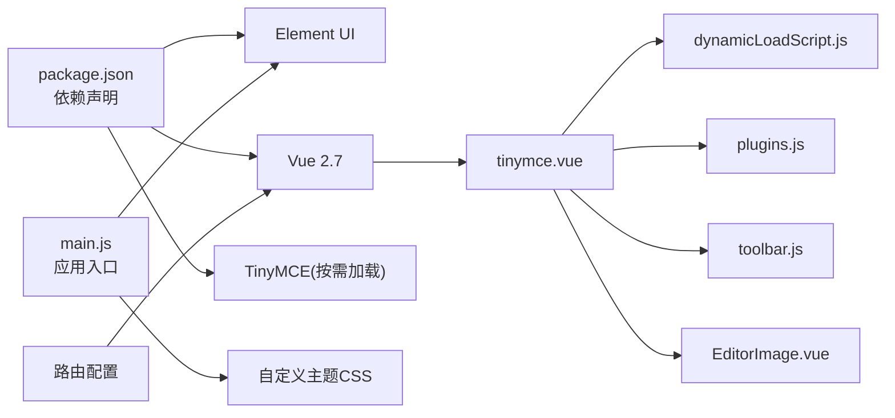

# TinyMCE编辑器基础使用

<cite>
**本文档引用的文件**
- [tinymce.vue](file://src/views/rich-editor/tinymce.vue)
- [dynamicLoadScript.js](file://src/views/rich-editor/tinymce-components/dynamicLoadScript.js)
- [plugins.js](file://src/views/rich-editor/tinymce-components/plugins.js)
- [toolbar.js](file://src/views/rich-editor/tinymce-components/toolbar.js)
- [EditorImage.vue](file://src/views/rich-editor/tinymce-components/components/EditorImage.vue)
- [index.js](file://src/router/index.js)
- [main.js](file://src/main.js)
- [App.vue](file://src/App.vue)
- [index.vue](file://src/layout/index.vue)
- [index.vue](file://src/layout/settings/index.vue)
- [science-blue.css](file://src/assets/custom-theme/science-blue.css)
- [theme-summer.css](file://src/assets/custom-theme/theme-summer.css)
- [package.json](file://package.json)
</cite>

## 目录
1. [简介](#简介)
2. [项目结构](#项目结构)
3. [核心组件](#核心组件)
4. [架构总览](#架构总览)
5. [详细组件分析](#详细组件分析)
6. [依赖关系分析](#依赖关系分析)
7. [性能考虑](#性能考虑)
8. [故障排除指南](#故障排除指南)
9. [结论](#结论)
10. [附录](#附录)

## 简介
本文件面向开发者，系统性讲解如何在Vue项目中集成与使用TinyMCE富文本编辑器。内容涵盖编辑器初始化配置、基础功能与核心API、插件系统与工具栏设置、内容格式化与样式处理、事件监听与数据管理、异步加载与动态配置、主题定制与界面适配，并提供可操作的实现方案与最佳实践。

## 项目结构
TinyMCE相关代码位于富文本编辑器视图模块中，采用“视图组件 + 辅助模块”的分层组织方式：
- 视图组件：负责编辑器实例化、生命周期管理、事件绑定与内容同步
- 辅助模块：动态加载脚本、插件清单、工具栏配置、图片上传组件
- 路由与入口：通过路由注册富文本编辑器页面，应用入口引入Element UI与国际化

**图表来源**
- [tinymce.vue:1-153](file://src/views/rich-editor/tinymce.vue#L1-L153)
- [dynamicLoadScript.js:1-60](file://src/views/rich-editor/tinymce-components/dynamicLoadScript.js#L1-L60)
- [plugins.js:1-10](file://src/views/rich-editor/tinymce-components/plugins.js#L1-L10)
- [toolbar.js:1-10](file://src/views/rich-editor/tinymce-components/toolbar.js#L1-L10)
- [EditorImage.vue:1-107](file://src/views/rich-editor/tinymce-components/components/EditorImage.vue#L1-L107)
- [index.js:269-290](file://src/router/index.js#L269-L290)
- [main.js:1-53](file://src/main.js#L1-L53)
- [science-blue.css:1-49](file://src/assets/custom-theme/science-blue.css#L1-L49)
- [theme-summer.css:1-800](file://src/assets/custom-theme/theme-summer.css#L1-L800)

**章节来源**
- [index.js:269-290](file://src/router/index.js#L269-L290)
- [main.js:1-53](file://src/main.js#L1-L53)

## 核心组件
- 编辑器主组件：负责异步加载TinyMCE、初始化配置、事件监听、内容同步与销毁
- 动态加载脚本：封装CDN加载逻辑，兼容标准与IE事件，统一回调处理
- 插件清单：声明启用的TinyMCE插件集合
- 工具栏配置：声明工具栏按钮分组
- 图片上传组件：提供图片选择、预览、批量上传与结果回调

**章节来源**
- [tinymce.vue:18-125](file://src/views/rich-editor/tinymce.vue#L18-L125)
- [dynamicLoadScript.js:9-59](file://src/views/rich-editor/tinymce-components/dynamicLoadScript.js#L9-L59)
- [plugins.js:5-9](file://src/views/rich-editor/tinymce-components/plugins.js#L5-L9)
- [toolbar.js:4-9](file://src/views/rich-editor/tinymce-components/toolbar.js#L4-L9)
- [EditorImage.vue:25-96](file://src/views/rich-editor/tinymce-components/components/EditorImage.vue#L25-L96)

## 架构总览
TinyMCE在Vue中的工作流如下：
- 应用启动后，路由进入富文本编辑器页面
- 组件挂载时触发异步加载TinyMCE脚本
- 加载成功后初始化编辑器实例，设置语言、高度、插件、工具栏、菜单栏等参数
- 监听内容变化事件，双向同步Vue数据与编辑器内容
- 支持全屏状态切换、销毁时清理实例

**图表来源**
- [tinymce.vue:53-124](file://src/views/rich-editor/tinymce.vue#L53-L124)
- [dynamicLoadScript.js:9-59](file://src/views/rich-editor/tinymce-components/dynamicLoadScript.js#L9-L59)
- [plugins.js:5-9](file://src/views/rich-editor/tinymce-components/plugins.js#L5-L9)
- [toolbar.js:4-9](file://src/views/rich-editor/tinymce-components/toolbar.js#L4-L9)

## 详细组件分析

### 编辑器主组件（tinymce.vue）
- 异步加载：通过动态加载脚本模块从CDN加载TinyMCE，错误处理统一提示
- 初始化配置：设置语言、高度、工具栏、插件、菜单栏、内容类名、对象调整、链接行为、列表样式、图片工具主机、全屏命令等
- 事件监听：在初始化回调中设置内容变化监听，实时同步到Vue数据；在setup回调中监听全屏状态
- 生命周期：mounted时初始化，beforeDestroy与activated/deactivated时销毁或重建实例，保证多页签场景正确

**图表来源**
- [tinymce.vue:53-124](file://src/views/rich-editor/tinymce.vue#L53-L124)

**章节来源**
- [tinymce.vue:18-125](file://src/views/rich-editor/tinymce.vue#L18-L125)

### 动态加载脚本（dynamicLoadScript.js）
- 功能：检测是否已存在脚本节点，避免重复加载；支持标准浏览器与IE事件；统一回调队列处理
- 适用场景：在运行时按需加载第三方库，确保只加载一次且回调可靠

**图表来源**
- [dynamicLoadScript.js:9-59](file://src/views/rich-editor/tinymce-components/dynamicLoadScript.js#L9-L59)

**章节来源**
- [dynamicLoadScript.js:1-60](file://src/views/rich-editor/tinymce-components/dynamicLoadScript.js#L1-L60)

### 插件系统（plugins.js）
- 插件清单：包含常用插件，如列表、链接、表格、媒体、表情、颜色、全屏、粘贴、预览、打印、保存、搜索替换、拼写检查、表格、模板、文本颜色等
- 使用方式：在编辑器初始化时作为plugins配置项传入

**章节来源**
- [plugins.js:5-9](file://src/views/rich-editor/tinymce-components/plugins.js#L5-L9)

### 工具栏设置（toolbar.js）
- 工具栏分组：将常用按钮按功能分组，便于在编辑器界面展示
- 使用方式：在编辑器初始化时作为toolbar配置项传入

**章节来源**
- [toolbar.js:4-9](file://src/views/rich-editor/tinymce-components/toolbar.js#L4-L9)

### 图片上传组件（EditorImage.vue）
- 功能：提供弹窗式图片上传，支持多选、移除、上传前校验、成功回调与提交确认
- 交互：点击上传按钮打开对话框，选择文件后进行尺寸预检，全部上传完成后触发successCBK事件
- 适用：与编辑器结合，将上传后的图片插入编辑器内容

**图表来源**
- [EditorImage.vue:43-96](file://src/views/rich-editor/tinymce-components/components/EditorImage.vue#L43-L96)

**章节来源**
- [EditorImage.vue:1-107](file://src/views/rich-editor/tinymce-components/components/EditorImage.vue#L1-L107)

## 依赖关系分析
- 应用依赖：Element UI用于界面组件与对话框；Vue 2.7用于响应式数据与生命周期
- 富文本依赖：TinyMCE通过CDN按需加载；插件与工具栏配置独立模块化
- 主题依赖：项目提供自定义主题CSS，可在应用入口统一引入

**图表来源**
- [package.json:33-63](file://package.json#L33-L63)
- [main.js:16-42](file://src/main.js#L16-L42)
- [index.js:269-290](file://src/router/index.js#L269-L290)
- [tinymce.vue:18-24](file://src/views/rich-editor/tinymce.vue#L18-L24)

**章节来源**
- [package.json:33-63](file://package.json#L33-L63)
- [main.js:16-42](file://src/main.js#L16-L42)

## 性能考虑
- 异步加载：仅在进入富文本页面时加载TinyMCE，减少首屏资源占用
- 实例复用：在keep-alive场景下，activated/deactivated中重建实例，避免重复绑定
- 事件节流：内容变化事件在初始化回调中统一监听，避免频繁DOM操作
- 资源优化：插件与工具栏按需启用，避免加载不必要的功能

[本节为通用指导，无需特定文件来源]

## 故障排除指南
- 加载失败：动态加载脚本提供错误回调，组件中统一提示错误信息
- 内容不同步：检查初始化回调中是否正确设置内容并绑定内容变化事件
- 全屏异常：销毁时先退出全屏再销毁实例，避免DOM残留
- 插件缺失：确认plugins.js中包含所需插件名称，且与TinyMCE版本兼容

**章节来源**
- [dynamicLoadScript.js:41-44](file://src/views/rich-editor/tinymce-components/dynamicLoadScript.js#L41-L44)
- [tinymce.vue:101-109](file://src/views/rich-editor/tinymce.vue#L101-L109)

## 结论
本项目提供了TinyMCE在Vue中的完整集成方案：通过动态加载实现按需引入，通过模块化的插件与工具栏配置提升可维护性，通过事件监听实现内容与数据的双向同步，并提供图片上传组件扩展编辑器能力。配合项目主题系统，可进一步实现界面风格的一致化与定制化。

[本节为总结，无需特定文件来源]

## 附录

### TinyMCE初始化配置要点
- 选择器与容器：使用DOM选择器定位编辑器容器
- 语言与高度：根据界面适配设置语言与编辑区高度
- 插件与工具栏：从独立模块导入，按需启用
- 菜单栏与内容类名：控制菜单栏可见性与编辑区样式
- 对象调整与链接行为：提升用户体验与安全性
- 列表样式与图片工具：增强内容结构与媒体处理能力
- 初始化回调：设置初始内容与事件监听
- 全屏状态监听：在setup回调中处理全屏切换

**章节来源**
- [tinymce.vue:63-99](file://src/views/rich-editor/tinymce.vue#L63-L99)
- [plugins.js:5-9](file://src/views/rich-editor/tinymce-components/plugins.js#L5-L9)
- [toolbar.js:4-9](file://src/views/rich-editor/tinymce-components/toolbar.js#L4-L9)

### 事件监听与数据管理
- 内容变化事件：NodeChange、Change、KeyUp、SetContent
- 数据同步：在事件回调中更新Vue数据，实现双向绑定
- 全屏状态：通过FullscreenStateChanged事件更新组件状态

**章节来源**
- [tinymce.vue:84-98](file://src/views/rich-editor/tinymce.vue#L84-L98)

### 异步加载与动态配置
- CDN加载：统一从指定CDN加载TinyMCE
- 动态配置：根据当前语言、高度、插件、工具栏等动态组装配置
- 生命周期：在合适时机初始化与销毁实例

**章节来源**
- [tinymce.vue:53-124](file://src/views/rich-editor/tinymce.vue#L53-L124)
- [dynamicLoadScript.js:9-59](file://src/views/rich-editor/tinymce-components/dynamicLoadScript.js#L9-L59)

### 主题定制与界面适配
- 自定义主题：通过CSS类覆盖Element UI与编辑器界面
- 应用入口：在main.js中引入主题CSS，实现全局样式生效
- 布局与设置：通过设置面板切换主题与布局，影响编辑器外观

**章节来源**
- [science-blue.css:1-49](file://src/assets/custom-theme/science-blue.css#L1-L49)
- [theme-summer.css:1-800](file://src/assets/custom-theme/theme-summer.css#L1-L800)
- [main.js:10-18](file://src/main.js#L10-L18)
- [index.vue:228-246](file://src/layout/settings/index.vue#L228-L246)