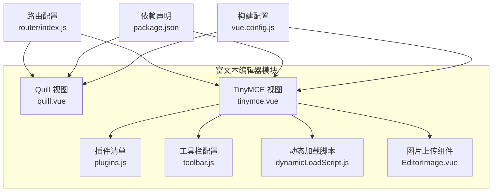
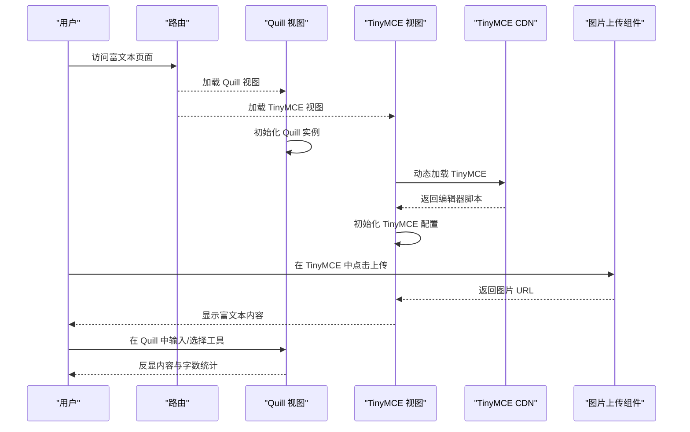
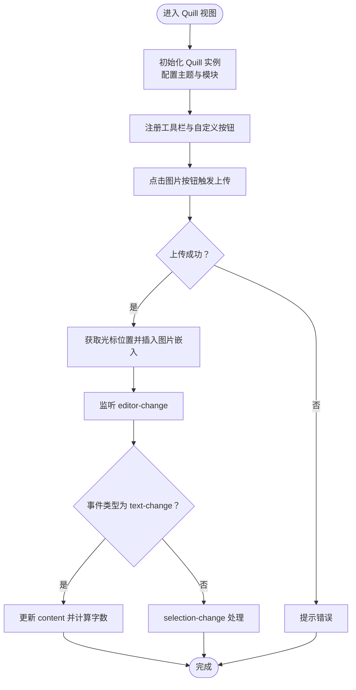
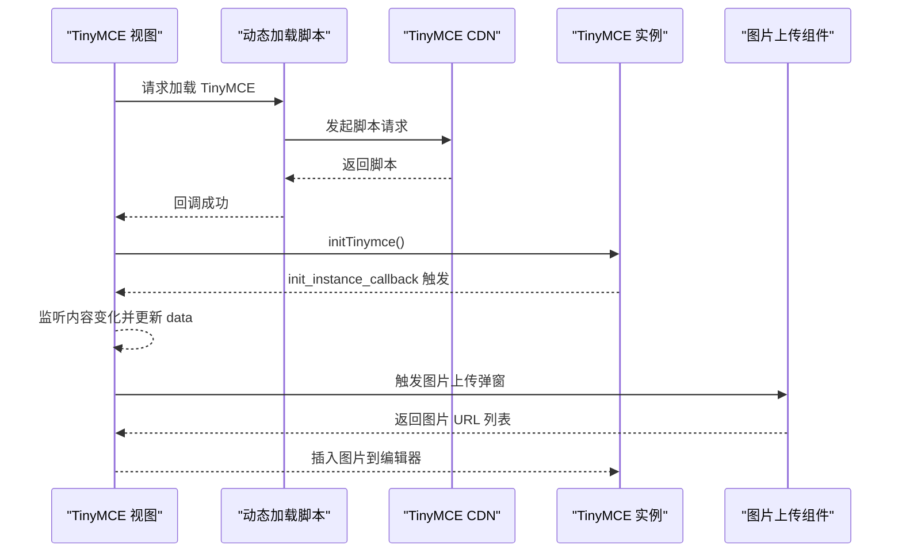
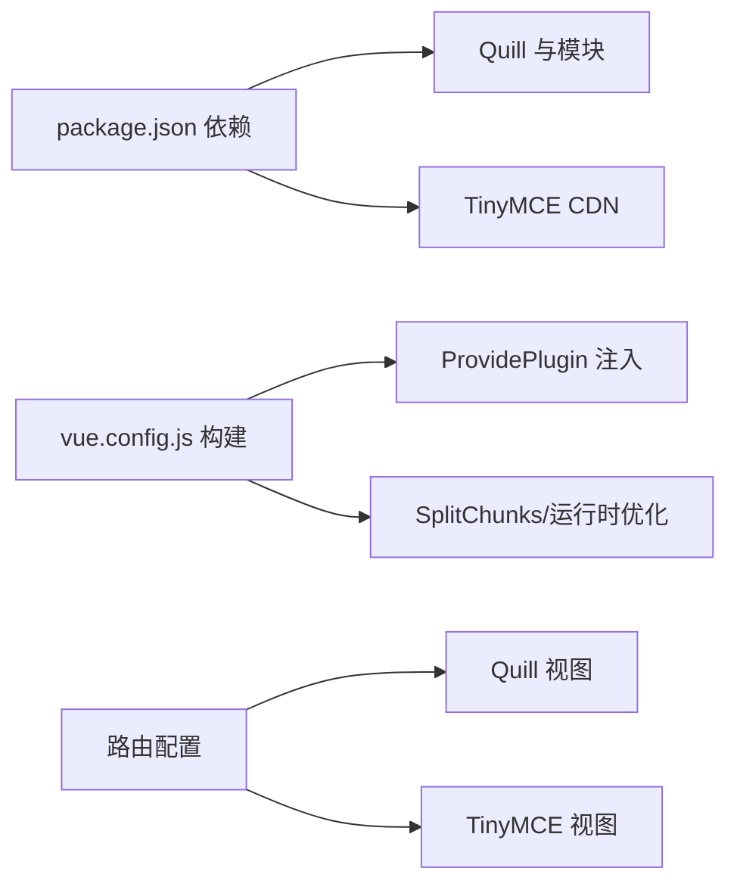

# 富文本编辑器

<cite>
**本文引用的文件**
- [quill.vue](file://src/views/rich-editor/quill.vue)
- [tinymce.vue](file://src/views/rich-editor/tinymce.vue)
- [plugins.js](file://src/views/rich-editor/tinymce-components/plugins.js)
- [toolbar.js](file://src/views/rich-editor/tinymce-components/toolbar.js)
- [dynamicLoadScript.js](file://src/views/rich-editor/tinymce-components/dynamicLoadScript.js)
- [EditorImage.vue](file://src/views/rich-editor/tinymce-components/components/EditorImage.vue)
- [index.js](file://src/router/index.js)
- [package.json](file://package.json)
- [vue.config.js](file://vue.config.js)
</cite>

## 目录
1. [简介](#简介)
2. [项目结构](#项目结构)
3. [核心组件](#核心组件)
4. [架构总览](#架构总览)
5. [详细组件分析](#详细组件分析)
6. [依赖关系分析](#依赖关系分析)
7. [性能考量](#性能考量)
8. [故障排查指南](#故障排查指南)
9. [结论](#结论)
10. [附录](#附录)

## 简介
本文件面向开发者与产品团队，系统性梳理本仓库中富文本编辑器的集成方案与最佳实践，覆盖以下要点：
- 两种编辑器（Quill 与 TinyMCE）的集成方式、初始化配置、插件与工具栏定制
- 图片上传流程、文件管理与服务端集成思路
- 编辑器事件监听、内容获取与格式化处理机制
- 样式定制与主题适配方法
- 性能优化策略（懒加载、内容压缩、渲染优化）
- 安全防护（XSS 过滤与内容验证建议）
- 扩展指南与自定义开发建议

## 项目结构
富文本编辑器相关代码集中在 views/rich-editor 目录，包含两个独立的编辑器视图与配套的 TinyMCE 辅助模块：
- Quill 视图：src/views/rich-editor/quill.vue
- TinyMCE 视图：src/views/rich-editor/tinymce.vue
- TinyMCE 辅助模块：
  - 插件清单：src/views/rich-editor/tinymce-components/plugins.js
  - 工具栏配置：src/views/rich-editor/tinymce-components/toolbar.js
  - 动态加载脚本：src/views/rich-editor/tinymce-components/dynamicLoadScript.js
  - 图片上传组件：src/views/rich-editor/tinymce-components/components/EditorImage.vue
- 路由配置：src/router/index.js
- 依赖声明：package.json
- 构建配置：vue.config.js

**图表来源**
- [quill.vue:1-236](file://src/views/rich-editor/quill.vue#L1-L236)
- [tinymce.vue:1-153](file://src/views/rich-editor/tinymce.vue#L1-L153)
- [plugins.js:1-10](file://src/views/rich-editor/tinymce-components/plugins.js#L1-L10)
- [toolbar.js:1-10](file://src/views/rich-editor/tinymce-components/toolbar.js#L1-L10)
- [dynamicLoadScript.js:1-60](file://src/views/rich-editor/tinymce-components/dynamicLoadScript.js#L1-L60)
- [EditorImage.vue:1-107](file://src/views/rich-editor/tinymce-components/components/EditorImage.vue#L1-L107)
- [index.js:269-290](file://src/router/index.js#L269-L290)
- [package.json:33-63](file://package.json#L33-L63)
- [vue.config.js:51-64](file://vue.config.js#L51-L64)

**章节来源**
- [index.js:269-290](file://src/router/index.js#L269-L290)
- [package.json:33-63](file://package.json#L33-L63)
- [vue.config.js:51-64](file://vue.config.js#L51-L64)

## 核心组件
- Quill 视图组件：负责编辑器初始化、工具栏自定义、图片上传集成、内容变更监听与字数统计。
- TinyMCE 视图组件：负责从 CDN 动态加载编辑器、初始化配置、插件与工具栏注入、内容同步与销毁。
- TinyMCE 辅助模块：插件清单、工具栏配置、动态加载脚本、图片上传组件。
- 路由与依赖：在路由中注册富文本入口，依赖在 package.json 中声明，构建时通过 ProvidePlugin 注入全局。

**章节来源**
- [quill.vue:36-192](file://src/views/rich-editor/quill.vue#L36-L192)
- [tinymce.vue:18-125](file://src/views/rich-editor/tinymce.vue#L18-L125)
- [plugins.js:1-10](file://src/views/rich-editor/tinymce-components/plugins.js#L1-L10)
- [toolbar.js:1-10](file://src/views/rich-editor/tinymce-components/toolbar.js#L1-L10)
- [dynamicLoadScript.js:1-60](file://src/views/rich-editor/tinymce-components/dynamicLoadScript.js#L1-L60)
- [EditorImage.vue:1-107](file://src/views/rich-editor/tinymce-components/components/EditorImage.vue#L1-L107)
- [index.js:269-290](file://src/router/index.js#L269-L290)
- [package.json:33-63](file://package.json#L33-L63)
- [vue.config.js:51-64](file://vue.config.js#L51-L64)

## 架构总览
下图展示了富文本编辑器在应用中的整体交互：路由进入 -> 视图挂载 -> 编辑器初始化 -> 内容与事件处理 -> 销毁清理。

**图表来源**
- [index.js:269-290](file://src/router/index.js#L269-L290)
- [quill.vue:135-183](file://src/views/rich-editor/quill.vue#L135-L183)
- [tinymce.vue:53-99](file://src/views/rich-editor/tinymce.vue#L53-L99)
- [dynamicLoadScript.js:9-57](file://src/views/rich-editor/tinymce-components/dynamicLoadScript.js#L9-L57)
- [EditorImage.vue:43-95](file://src/views/rich-editor/tinymce-components/components/EditorImage.vue#L43-L95)

## 详细组件分析

### Quill 编辑器
- 初始化与主题
  - 主题采用 snow，占位符与调试级别可配置。
  - 通过模块化启用工具栏、图片拖拽与图片尺寸调整。
- 工具栏与自定义
  - 工具栏项包括字号、标题、加粗斜体下划线删除线、缩进、颜色与对齐、清除样式、图片与自定义按钮。
  - 自定义图片按钮绑定到 imageFunction，点击触发 Element Upload 组件选择文件。
  - 自定义按钮“custom”绑定到 quillCustomFunction，用于演示扩展能力。
- 图片上传与内容处理
  - 上传成功回调 richUploadSuccess 中，读取选区索引并在光标处插入图片嵌入。
  - 内容变更监听 editor-change，区分 text-change 与 selection-change，按需更新 content。
  - 字数统计基于 quill.getLength() 计算，超过阈值高亮提示。
- 生命周期与内存清理
  - mounted 初始化，beforeDestroy 清理实例引用，避免内存泄漏。

**图表来源**
- [quill.vue:135-183](file://src/views/rich-editor/quill.vue#L135-L183)
- [quill.vue:88-118](file://src/views/rich-editor/quill.vue#L88-L118)
- [quill.vue:119-134](file://src/views/rich-editor/quill.vue#L119-L134)

**章节来源**
- [quill.vue:36-192](file://src/views/rich-editor/quill.vue#L36-L192)

### TinyMCE 编辑器
- 动态加载与初始化
  - 通过 dynamicLoadScript 从 CDN 加载 TinyMCE 脚本，失败时提示错误。
  - initTinymce 中设置语言、高度、工具栏、插件、菜单栏、内容回调与全屏状态监听。
- 工具栏与插件
  - toolbar 与 plugins 分离为独立模块，便于维护与扩展。
  - 支持多行工具栏与丰富的插件集合（列表、链接、图片、表格、媒体、表情、颜色等）。
- 内容同步与销毁
  - 通过 init_instance_callback 监听内容变化并写回组件 data。
  - destroyed/activated/deactivated 生命周期中销毁或重建实例，保证单页复用场景稳定。
- 图片上传组件
  - EditorImage.vue 提供弹窗上传、批量校验、成功回调与移除逻辑，便于在 TinyMCE 中集成。

**图表来源**
- [tinymce.vue:53-99](file://src/views/rich-editor/tinymce.vue#L53-L99)
- [dynamicLoadScript.js:9-57](file://src/views/rich-editor/tinymce-components/dynamicLoadScript.js#L9-L57)
- [plugins.js:1-10](file://src/views/rich-editor/tinymce-components/plugins.js#L1-L10)
- [toolbar.js:1-10](file://src/views/rich-editor/tinymce-components/toolbar.js#L1-L10)
- [EditorImage.vue:43-95](file://src/views/rich-editor/tinymce-components/components/EditorImage.vue#L43-L95)

**章节来源**
- [tinymce.vue:18-125](file://src/views/rich-editor/tinymce.vue#L18-L125)
- [plugins.js:1-10](file://src/views/rich-editor/tinymce-components/plugins.js#L1-L10)
- [toolbar.js:1-10](file://src/views/rich-editor/tinymce-components/toolbar.js#L1-L10)
- [dynamicLoadScript.js:1-60](file://src/views/rich-editor/tinymce-components/dynamicLoadScript.js#L1-L60)
- [EditorImage.vue:1-107](file://src/views/rich-editor/tinymce-components/components/EditorImage.vue#L1-L107)

### 图片上传与文件管理
- Quill 方案
  - 使用 Element Upload 组件触发上传，上传成功回调中插入图片嵌入。
  - 通过 quill.getSelection() 获取当前光标位置，确保插入位置准确。
- TinyMCE 方案
  - EditorImage.vue 提供弹窗上传，支持多文件、预览、校验与提交。
  - 通过回调将图片 URL 列表传回父组件，再由父组件将图片插入编辑器。
- 服务端集成建议
  - 上传接口应返回统一的成功标识与图片 URL。
  - 建议在上传前进行文件类型与大小校验，失败时提示用户。
  - 对于大图建议服务端生成缩略图与原图，前端按需显示。

**章节来源**
- [quill.vue:88-109](file://src/views/rich-editor/quill.vue#L88-L109)
- [EditorImage.vue:43-95](file://src/views/rich-editor/tinymce-components/components/EditorImage.vue#L43-L95)

### 编辑器事件监听、内容获取与格式化
- Quill
  - 通过 editor-change 事件区分 text-change 与 selection-change，按需更新 content。
  - 使用 quill.getLength() 计算字数，配合样式提示用户。
- TinyMCE
  - init_instance_callback 中监听 NodeChange/Change/KeyUp/SetContent 等事件，及时同步 content。
  - 通过 window.tinymce.get(selector).getContent() 获取 HTML 内容。
- 格式化处理
  - Quill 通过内置模块与自定义 handler 控制格式与行为。
  - TinyMCE 通过 plugins 与 toolbar 控制格式化能力，结合 init_instance_callback 进行二次处理。

**章节来源**
- [quill.vue:110-118](file://src/views/rich-editor/quill.vue#L110-L118)
- [quill.vue:75-85](file://src/views/rich-editor/quill.vue#L75-L85)
- [tinymce.vue:84-92](file://src/views/rich-editor/tinymce.vue#L84-L92)

### 样式定制与主题适配
- Quill
  - 引入 core 与 snow 主题样式，可通过 scoped 样式覆盖容器高度、计数器颜色等。
- TinyMCE
  - 通过 CSS 类名控制容器与全屏样式，可结合主题变量实现统一风格。
- 主题适配
  - 建议在全局样式中统一编辑器容器的边框、阴影、圆角与字体大小，保持与站点一致。

**章节来源**
- [quill.vue:195-235](file://src/views/rich-editor/quill.vue#L195-L235)
- [tinymce.vue:128-152](file://src/views/rich-editor/tinymce.vue#L128-L152)

## 依赖关系分析
- 依赖声明
  - Quill 与相关模块（image-resize、image-drop）在 package.json 中声明。
  - TinyMCE 通过 CDN 动态加载，不直接打包进包体。
- 构建配置
  - ProvidePlugin 将 Quill 注入全局，简化引用。
  - 生产环境优化拆分 chunk、运行时文件，提升首屏性能。
- 路由注册
  - 富文本页面在路由中注册为异步组件，支持懒加载。

**图表来源**
- [package.json:33-63](file://package.json#L33-L63)
- [vue.config.js:51-64](file://vue.config.js#L51-L64)
- [vue.config.js:116-141](file://vue.config.js#L116-L141)
- [index.js:269-290](file://src/router/index.js#L269-L290)

**章节来源**
- [package.json:33-63](file://package.json#L33-L63)
- [vue.config.js:51-64](file://vue.config.js#L51-L64)
- [vue.config.js:116-141](file://vue.config.js#L116-L141)
- [index.js:269-290](file://src/router/index.js#L269-L290)

## 性能考量
- 懒加载与按需加载
  - TinyMCE 通过 CDN 动态加载，避免打包体积过大。
  - Quill 作为 npm 依赖，配合 ProvidePlugin 注入，减少重复加载。
- 内容压缩与渲染优化
  - 生产环境关闭 source map，减小包体。
  - 合理拆分 chunk，将第三方库与公共组件分离，提升缓存命中率。
- 首屏优化
  - 删除不必要的 preload/prefetch 插件，避免无效请求。
  - 通过运行时文件优化，减少首屏阻塞。
- 图片上传性能
  - 前端限制文件大小与类型，减少无效请求。
  - 服务端生成缩略图，前端按需加载，降低带宽压力。

**章节来源**
- [vue.config.js:26-27](file://vue.config.js#L26-L27)
- [vue.config.js:79-87](file://vue.config.js#L79-L87)
- [vue.config.js:116-141](file://vue.config.js#L116-L141)
- [EditorImage.vue:81-94](file://src/views/rich-editor/tinymce-components/components/EditorImage.vue#L81-L94)

## 故障排查指南
- TinyMCE 无法加载
  - 检查 dynamicLoadScript 的回调与错误提示，确认网络可达与 CDN 正常。
  - 若已存在实例，确保在 destroyed/activated/deactivated 中正确销毁/重建。
- 内容不同步
  - Quill：确认 editor-change 事件监听与 content 更新逻辑。
  - TinyMCE：确认 init_instance_callback 中的事件触发与 setContent 调用时机。
- 图片上传失败
  - Quill：检查上传成功回调中的响应结构与插入逻辑。
  - TinyMCE：检查 EditorImage.vue 的回调与父组件插入逻辑。
- 内存泄漏
  - 确保 beforeDestroy 中清理 quill 实例引用，避免 DOM 泄漏。

**章节来源**
- [dynamicLoadScript.js:9-57](file://src/views/rich-editor/tinymce-components/dynamicLoadScript.js#L9-L57)
- [quill.vue:185-191](file://src/views/rich-editor/quill.vue#L185-L191)
- [tinymce.vue:101-124](file://src/views/rich-editor/tinymce.vue#L101-L124)
- [EditorImage.vue:43-95](file://src/views/rich-editor/tinymce-components/components/EditorImage.vue#L43-L95)

## 结论
本项目提供了两种主流富文本编辑器的完整集成方案：
- Quill：轻量、模块化强，适合对体积与定制性有要求的场景；通过模块与自定义 handler 实现灵活扩展。
- TinyMCE：功能丰富、生态完善，适合需要强大插件与工具栏的场景；通过 CDN 动态加载与模块化配置实现可维护性。
在实际落地中，建议结合业务需求选择编辑器，并遵循本文提供的事件监听、内容同步、图片上传、样式定制与性能优化的最佳实践。

## 附录
- 使用场景建议
  - Quill：简洁编辑、图片拖拽与尺寸调整、自定义工具栏。
  - TinyMCE：复杂内容管理、多插件协作、国际化与全屏模式。
- 安全建议
  - 对外链与图片 URL 进行白名单校验，避免恶意链接。
  - 对粘贴内容进行净化，移除潜在危险标签与脚本。
  - 对上传文件进行类型与大小校验，防止异常文件进入系统。
- 扩展建议
  - 新增自定义工具栏按钮时，优先封装为独立组件，便于复用与测试。
  - 对图片上传流程进行抽象，支持多种存储后端（本地、OSS、CDN）。
  - 对内容渲染进行统一处理，支持 Markdown/HTML 双向转换与预览。