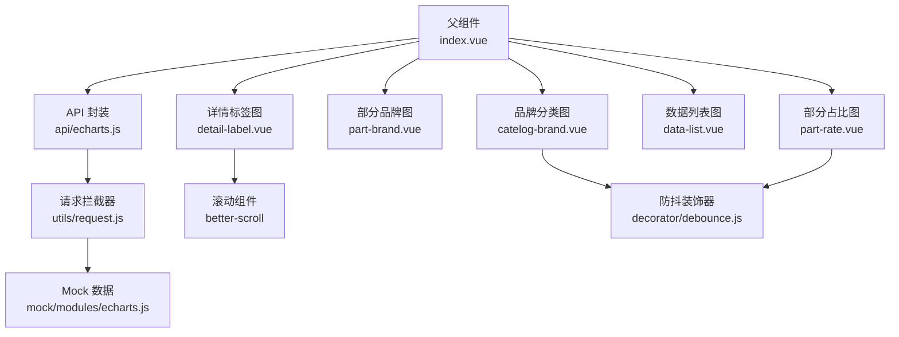
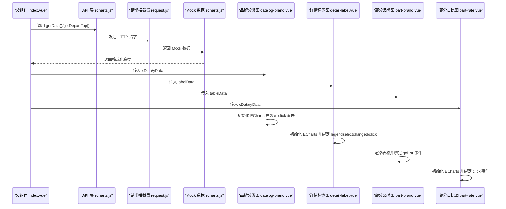
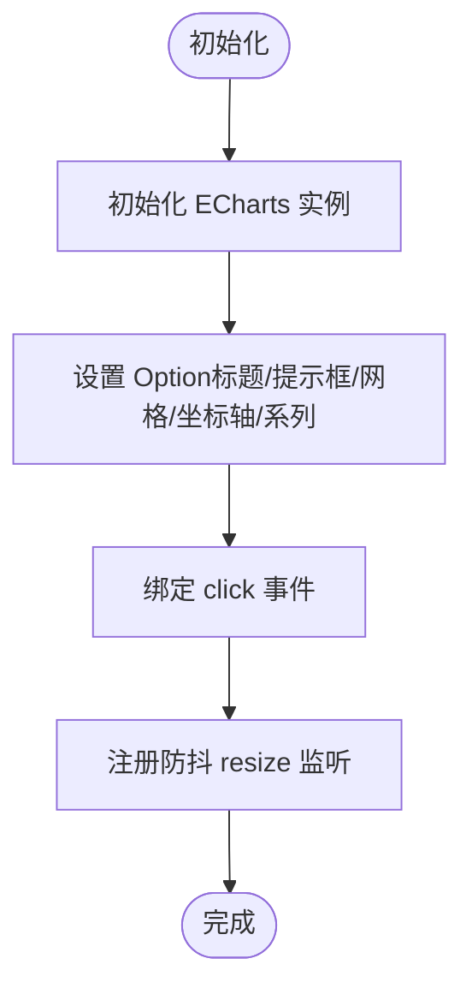
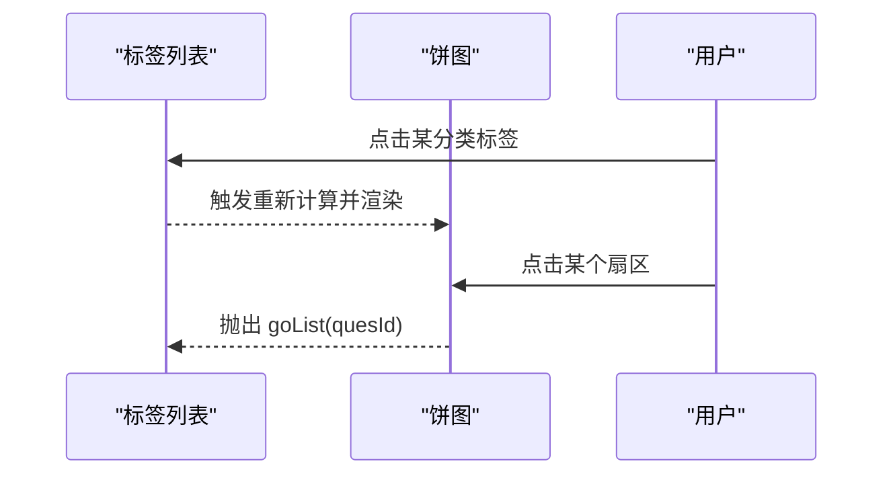
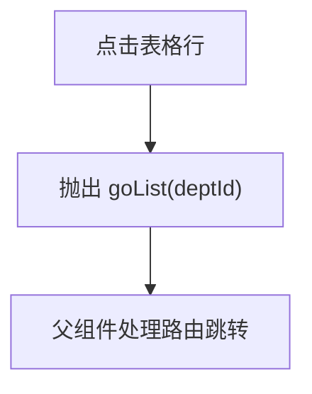
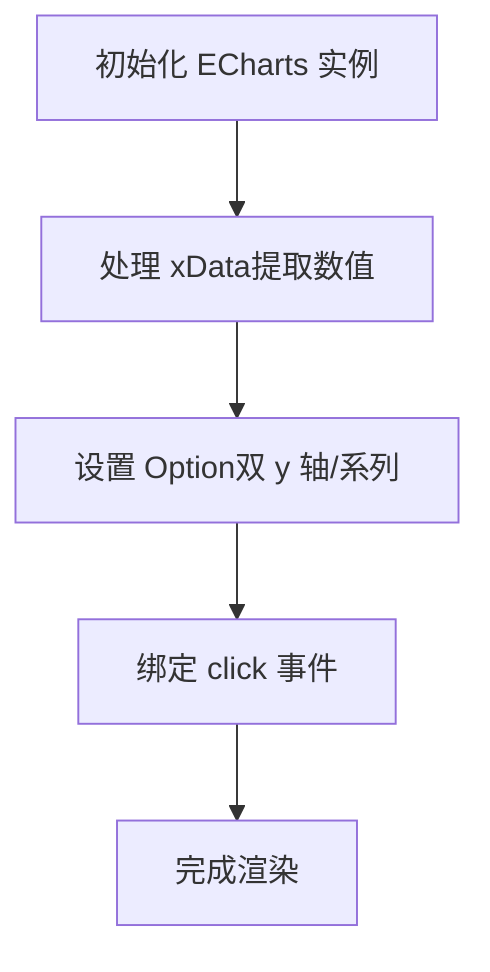
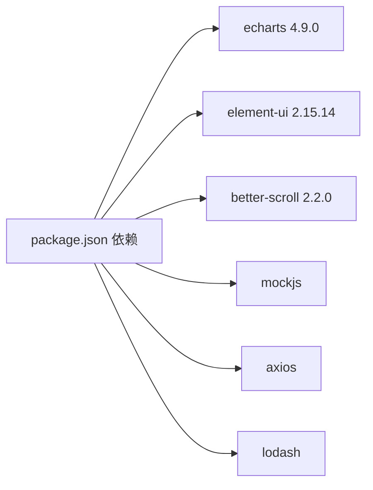

# 数据可视化

<cite>
**本文引用的文件**
- [src/views/echarts/index.vue](file://src/views/echarts/index.vue)
- [src/views/echarts/index-child/catelog-brand.vue](file://src/views/echarts/index-child/catelog-brand.vue)
- [src/views/echarts/index-child/detail-label.vue](file://src/views/echarts/index-child/detail-label.vue)
- [src/views/echarts/index-child/part-brand.vue](file://src/views/echarts/index-child/part-brand.vue)
- [src/views/echarts/index-child/part-rate.vue](file://src/views/echarts/index-child/part-rate.vue)
- [src/views/echarts/index-child/data-list.vue](file://src/views/echarts/index-child/data-list.vue)
- [src/api/echarts.js](file://src/api/echarts.js)
- [src/mock/modules/echarts.js](file://src/mock/modules/echarts.js)
- [src/utils/request.js](file://src/utils/request.js)
- [src/components/color-line/index.vue](file://src/components/color-line/index.vue)
- [src/decorator/debounce.js](file://src/decorator/debounce.js)
- [src/decorator/throttle.js](file://src/decorator/throttle.js)
- [package.json](file://package.json)
- [src/assets/custom-theme/science-blue.css](file://src/assets/custom-theme/science-blue.css)
- [src/assets/custom-theme/theme-summer.css](file://src/assets/custom-theme/theme-summer.css)
</cite>

## 目录
1. [简介](#简介)
2. [项目结构](#项目结构)
3. [核心组件](#核心组件)
4. [架构总览](#架构总览)
5. [组件详解](#组件详解)
6. [依赖关系分析](#依赖关系分析)
7. [性能考量](#性能考量)
8. [故障排查指南](#故障排查指南)
9. [结论](#结论)
10. [附录](#附录)

## 简介
本文件面向开发者与产品人员，系统性梳理该数据可视化系统的整体设计与实现，重点覆盖以下方面：
- ECharts 图表集成方式与图表类型配置
- 品牌分类图、数据列表图、详情标签图、部分品牌图、部分占比图的设计理念与交互实现
- 图表数据获取流程、格式化处理与动态更新机制
- 颜色线条组件的实现原理与配置方法
- 主题定制、样式调整与响应式适配方案
- 交互功能（缩放、选择、提示框、数据钻取）
- 性能优化策略（大数据量处理、懒加载、渲染优化）
- 可视化组件扩展指南与自定义图表开发建议

## 项目结构
该可视化模块位于 views/echarts 目录下，采用“父组件聚合 + 子组件拆分”的组织方式：
- 父组件负责数据拉取、格式化与布局编排
- 子组件封装具体图表类型，负责 ECharts 实例初始化、事件绑定与响应式处理
- API 层通过统一的请求封装进行数据访问
- Mock 提供本地开发与演示所需的数据源
- 工具层提供防抖、节流等通用能力

**图表来源**
- [src/views/echarts/index.vue:1-217](file://src/views/echarts/index.vue#L1-L217)
- [src/views/echarts/index-child/catelog-brand.vue:1-172](file://src/views/echarts/index-child/catelog-brand.vue#L1-L172)
- [src/views/echarts/index-child/detail-label.vue:1-383](file://src/views/echarts/index-child/detail-label.vue#L1-L383)
- [src/views/echarts/index-child/part-brand.vue:1-129](file://src/views/echarts/index-child/part-brand.vue#L1-L129)
- [src/views/echarts/index-child/part-rate.vue:1-187](file://src/views/echarts/index-child/part-rate.vue#L1-L187)
- [src/views/echarts/index-child/data-list.vue:1-4](file://src/views/echarts/index-child/data-list.vue#L1-L4)
- [src/api/echarts.js:1-20](file://src/api/echarts.js#L1-L20)
- [src/mock/modules/echarts.js:1-194](file://src/mock/modules/echarts.js#L1-L194)
- [src/utils/request.js:1-139](file://src/utils/request.js#L1-L139)
- [src/decorator/debounce.js:1-21](file://src/decorator/debounce.js#L1-L21)

**章节来源**
- [src/views/echarts/index.vue:1-217](file://src/views/echarts/index.vue#L1-L217)
- [src/api/echarts.js:1-20](file://src/api/echarts.js#L1-L20)
- [src/mock/modules/echarts.js:1-194](file://src/mock/modules/echarts.js#L1-L194)
- [src/utils/request.js:1-139](file://src/utils/request.js#L1-L139)

## 核心组件
- 父组件（index.vue）：负责页面布局、数据拉取与子组件编排，提供路由跳转与回退逻辑占位
- 子组件（index-child/*.vue）：封装不同图表类型，分别处理数据格式化、ECharts 初始化、事件绑定与响应式
- API 层（api/echarts.js）：对后端接口进行薄封装，便于统一管理
- Mock 层（mock/modules/echarts.js）：提供本地演示数据，模拟分类与排行数据
- 工具层（decorator/debounce.js、throttle.js）：提供通用的防抖与节流能力
- 请求层（utils/request.js）：基于 axios 的请求拦截器，统一处理鉴权、语言、超时与错误提示

**章节来源**
- [src/views/echarts/index.vue:56-172](file://src/views/echarts/index.vue#L56-L172)
- [src/api/echarts.js:5-19](file://src/api/echarts.js#L5-L19)
- [src/mock/modules/echarts.js:176-194](file://src/mock/modules/echarts.js#L176-L194)
- [src/decorator/debounce.js:16-20](file://src/decorator/debounce.js#L16-L20)
- [src/decorator/throttle.js:15-19](file://src/decorator/throttle.js#L15-L19)
- [src/utils/request.js:18-136](file://src/utils/request.js#L18-L136)

## 架构总览
整体数据流从父组件发起，经 API 层与请求拦截器，结合 Mock 数据，将格式化后的数据传递给各子组件；子组件内部初始化 ECharts 实例并绑定交互事件，同时通过防抖处理窗口 resize 以保证性能。

**图表来源**
- [src/views/echarts/index.vue:94-166](file://src/views/echarts/index.vue#L94-L166)
- [src/api/echarts.js:5-19](file://src/api/echarts.js#L5-L19)
- [src/utils/request.js:18-136](file://src/utils/request.js#L18-L136)
- [src/mock/modules/echarts.js:176-194](file://src/mock/modules/echarts.js#L176-L194)
- [src/views/echarts/index-child/catelog-brand.vue:45-146](file://src/views/echarts/index-child/catelog-brand.vue#L45-L146)
- [src/views/echarts/index-child/detail-label.vue:66-168](file://src/views/echarts/index-child/detail-label.vue#L66-L168)
- [src/views/echarts/index-child/part-brand.vue:38-51](file://src/views/echarts/index-child/part-brand.vue#L38-L51)
- [src/views/echarts/index-child/part-rate.vue:48-161](file://src/views/echarts/index-child/part-rate.vue#L48-L161)

## 组件详解

### 品牌分类图（catelog-brand）
- 设计理念：横向柱状图展示分类总量，支持点击钻取到列表页
- 关键点：
  - 使用 ECharts bar 图，渐变填充突出视觉层次
  - xAxis 支持对象数组（value/id）与原始值混合解析
  - 绑定 click 事件，读取 dataIndex 对应的 id 并向上抛出 gotoList
  - 响应式：使用防抖装饰器处理 resize，避免频繁重绘

**图表来源**
- [src/views/echarts/index-child/catelog-brand.vue:45-146](file://src/views/echarts/index-child/catelog-brand.vue#L45-L146)
- [src/decorator/debounce.js:16-20](file://src/decorator/debounce.js#L16-L20)

**章节来源**
- [src/views/echarts/index-child/catelog-brand.vue:10-172](file://src/views/echarts/index-child/catelog-brand.vue#L10-L172)

### 详情标签图（detail-label）
- 设计理念：左侧标签滚动，右侧环形饼图展示占比，支持点击扇区钻取
- 关键点：
  - 使用 better-scroll 实现横向滚动
  - 饼图中心位置与半径可配置，最小角度与悬浮偏移提升可读性
  - 图例与提示框联动，formatter 动态计算百分比与数值
  - 点击扇区映射到子问题 ID 并向上抛出 goList

**图表来源**
- [src/views/echarts/index-child/detail-label.vue:66-168](file://src/views/echarts/index-child/detail-label.vue#L66-L168)
- [src/views/echarts/index-child/detail-label.vue:169-320](file://src/views/echarts/index-child/detail-label.vue#L169-L320)

**章节来源**
- [src/views/echarts/index-child/detail-label.vue:22-383](file://src/views/echarts/index-child/detail-label.vue#L22-L383)

### 部分品牌图（part-brand）
- 设计理念：纯数据表格，展示部门 TOP10 的数量、完成数与完成率
- 关键点：
  - 表格行高亮与前三名特殊样式
  - 点击行向上抛出 goList(部门ID)，用于跳转列表页

**图表来源**
- [src/views/echarts/index-child/part-brand.vue:38-51](file://src/views/echarts/index-child/part-brand.vue#L38-L51)

**章节来源**
- [src/views/echarts/index-child/part-brand.vue:1-129](file://src/views/echarts/index-child/part-brand.vue#L1-L129)

### 部分占比图（part-rate）
- 设计理念：双轴条形图，左侧为灰底占位条，右侧为彩色进度条，展示完成率
- 关键点：
  - 双 y 轴：左侧显示部门名称，右侧显示百分比标签
  - 通过两个 series 实现“灰底+进度条”效果
  - 绑定 click 事件，读取 xData 中的 id 并抛出 goList

**图表来源**
- [src/views/echarts/index-child/part-rate.vue:48-161](file://src/views/echarts/index-child/part-rate.vue#L48-L161)
- [src/decorator/debounce.js:16-20](file://src/decorator/debounce.js#L16-L20)

**章节来源**
- [src/views/echarts/index-child/part-rate.vue:1-187](file://src/views/echarts/index-child/part-rate.vue#L1-L187)

### 数据列表图（data-list）
- 设计理念：作为详情页占位，当前为空模板，预留与父组件的双向通信
- 关键点：
  - 通过父组件的 backFromList 回调实现返回逻辑

**章节来源**
- [src/views/echarts/index-child/data-list.vue:1-4](file://src/views/echarts/index-child/data-list.vue#L1-L4)

### 颜色线条组件（color-line）
- 设计理念：轻量级折线图组件，用于展示趋势或辅助装饰
- 关键点：
  - 通过 props 接收 id、颜色、数据、宽高
  - 使用 ECharts line 图，关闭坐标轴与符号，启用平滑曲线
  - 在 mounted 中初始化并设置 option

**章节来源**
- [src/components/color-line/index.vue:1-87](file://src/components/color-line/index.vue#L1-L87)

## 依赖关系分析
- 图表库：echarts 4.9.0
- UI 框架：element-ui 2.15.14
- 滚动：better-scroll 2.2.0
- 工具：lodash（debounce/throttle）
- Mock：mockjs

**图表来源**
- [package.json:33-63](file://package.json#L33-L63)

**章节来源**
- [package.json:1-99](file://package.json#L1-L99)

## 性能考量
- 防抖与节流
  - 使用装饰器对 resize 事件进行防抖，降低频繁重绘开销
  - 可根据场景引入节流装饰器控制高频事件（如鼠标移动）
- 渲染优化
  - 按需引入 ECharts 图表模块，避免全量打包
  - 在大数据场景下，优先使用单个 series 或减少图形数量
- 数据处理
  - 在父组件统一排序与格式化，子组件仅负责渲染与交互
- 响应式
  - 通过防抖处理窗口变化，避免多次 setOption 导致卡顿

**章节来源**
- [src/decorator/debounce.js:16-20](file://src/decorator/debounce.js#L16-L20)
- [src/decorator/throttle.js:15-19](file://src/decorator/throttle.js#L15-L19)
- [src/views/echarts/index-child/catelog-brand.vue:159-168](file://src/views/echarts/index-child/catelog-brand.vue#L159-L168)
- [src/views/echarts/index-child/part-rate.vue:174-184](file://src/views/echarts/index-child/part-rate.vue#L174-L184)

## 故障排查指南
- 请求失败与超时
  - 请求拦截器统一处理超时与网络错误，并弹出消息提示
  - 若后端返回特定 code，会触发登出确认流程
- 数据格式异常
  - 父组件在接收数据后进行排序与字段抽取，确保子组件输入稳定
  - 子组件对 xData 的对象值与原始值均做兼容处理
- 图表不显示或尺寸异常
  - 确认父组件已设置容器宽高，且子组件在 mounted 后初始化
  - 确保 resize 事件已注册并使用防抖装饰器

**章节来源**
- [src/utils/request.js:54-136](file://src/utils/request.js#L54-L136)
- [src/views/echarts/index.vue:94-166](file://src/views/echarts/index.vue#L94-L166)
- [src/views/echarts/index-child/catelog-brand.vue:159-168](file://src/views/echarts/index-child/catelog-brand.vue#L159-L168)
- [src/views/echarts/index-child/part-rate.vue:174-184](file://src/views/echarts/index-child/part-rate.vue#L174-L184)

## 结论
该可视化系统以清晰的父子组件分工为基础，结合 ECharts 的灵活配置与本地 Mock 数据，实现了从宏观分布到细节钻取的完整数据故事线。通过防抖与按需引入等手段，在保证交互流畅的同时兼顾了性能。后续可在大数据量场景下进一步引入虚拟滚动、懒加载与增量渲染等策略，持续优化用户体验。

## 附录

### 主题定制与样式调整
- 自定义主题文件
  - 科学蓝主题：通过 CSS 类覆盖菜单与侧边栏样式
  - 夏日主题：提供大量 Element UI 组件的样式覆盖
- 使用建议
  - 在根组件或布局组件中切换主题类名
  - 配合 ECharts 主题变量或全局 CSS 变量统一风格

**章节来源**
- [src/assets/custom-theme/science-blue.css:1-49](file://src/assets/custom-theme/science-blue.css#L1-L49)
- [src/assets/custom-theme/theme-summer.css:1-800](file://src/assets/custom-theme/theme-summer.css#L1-L800)

### 响应式适配
- 父组件容器设置固定高度与最小宽度，保证子组件渲染空间
- 子组件通过防抖装饰器监听 window.resize，动态调用 chart.resize

**章节来源**
- [src/views/echarts/index.vue:174-217](file://src/views/echarts/index.vue#L174-L217)
- [src/views/echarts/index-child/catelog-brand.vue:159-168](file://src/views/echarts/index-child/catelog-brand.vue#L159-L168)
- [src/views/echarts/index-child/part-rate.vue:174-184](file://src/views/echarts/index-child/part-rate.vue#L174-L184)

### 交互功能清单
- 缩放：通过 chart.resize 实现
- 选择：表格行点击、饼图扇区点击、柱状图点击
- 提示框：ECharts 内置 tooltip
- 数据钻取：从品牌分类图到数据列表图，从详情标签图到数据列表图

**章节来源**
- [src/views/echarts/index-child/catelog-brand.vue:40-43](file://src/views/echarts/index-child/catelog-brand.vue#L40-L43)
- [src/views/echarts/index-child/detail-label.vue:210-227](file://src/views/echarts/index-child/detail-label.vue#L210-L227)
- [src/views/echarts/index-child/part-brand.vue:40-43](file://src/views/echarts/index-child/part-brand.vue#L40-L43)
- [src/views/echarts/index-child/part-rate.vue:43-47](file://src/views/echarts/index-child/part-rate.vue#L43-L47)

### 扩展指南与自定义建议
- 新增图表类型
  - 在 index-child 下新增组件，按现有模式引入所需 ECharts 模块
  - 在父组件中注册并传入标准化数据
- 自定义主题
  - 在自定义主题 CSS 中覆盖 ECharts 图表颜色与字体
  - 保持与全局 UI 主题一致
- 性能优化
  - 大数据量场景：采用虚拟列表、分页或分批渲染
  - 交互优化：对高频事件使用节流/防抖
  - 资源优化：按需引入 ECharts 图表模块，避免全量打包

**章节来源**
- [src/views/echarts/index.vue:64-72](file://src/views/echarts/index.vue#L64-L72)
- [package.json:40](file://package.json#L40)