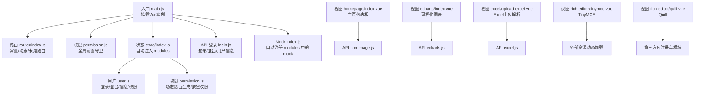
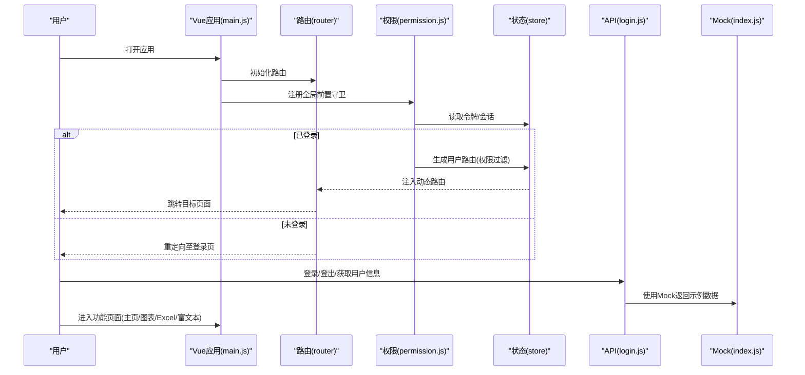
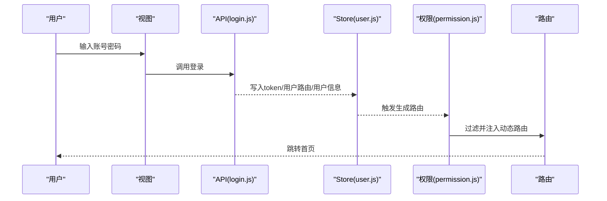
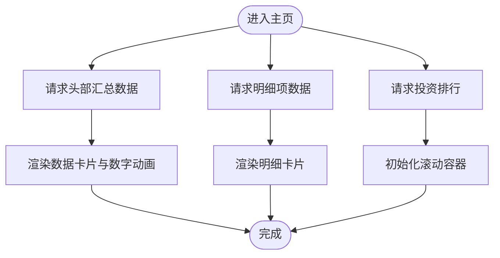
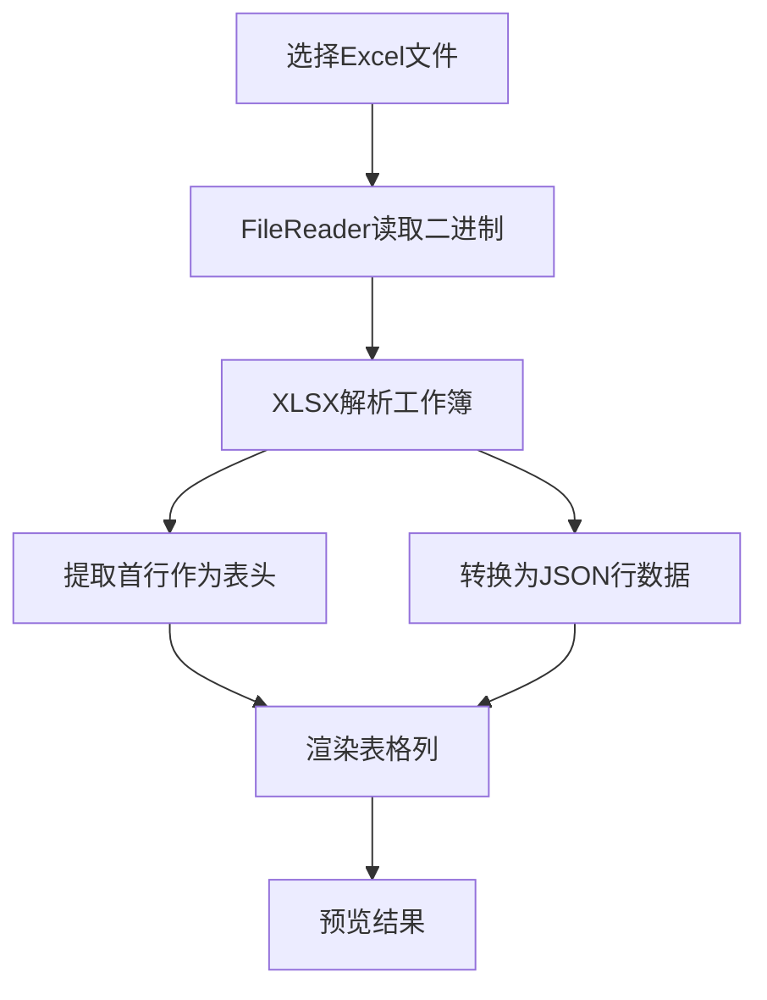
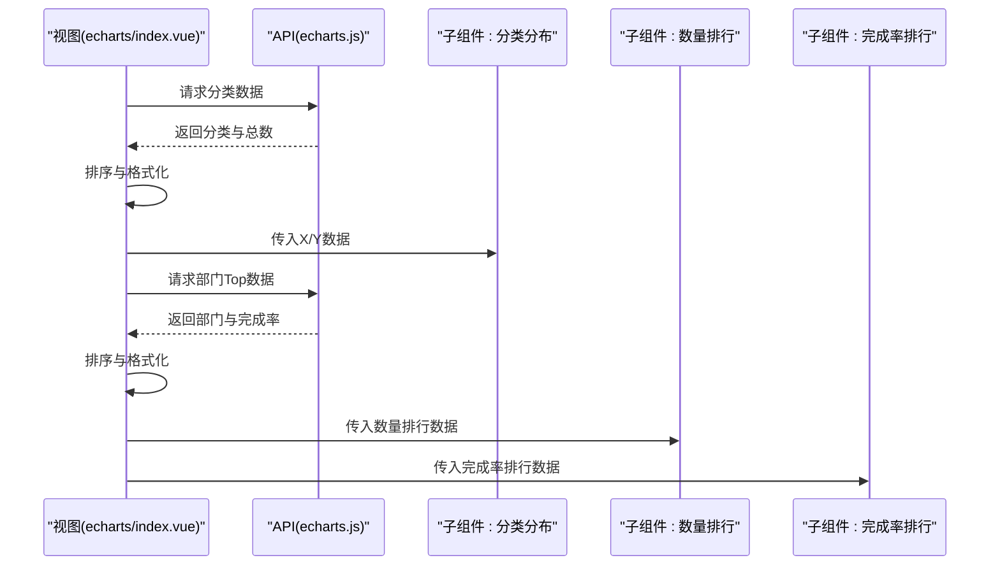
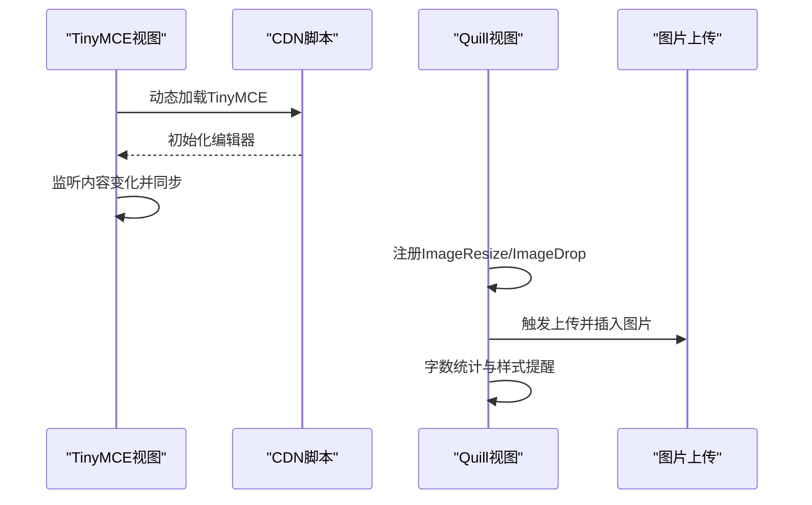
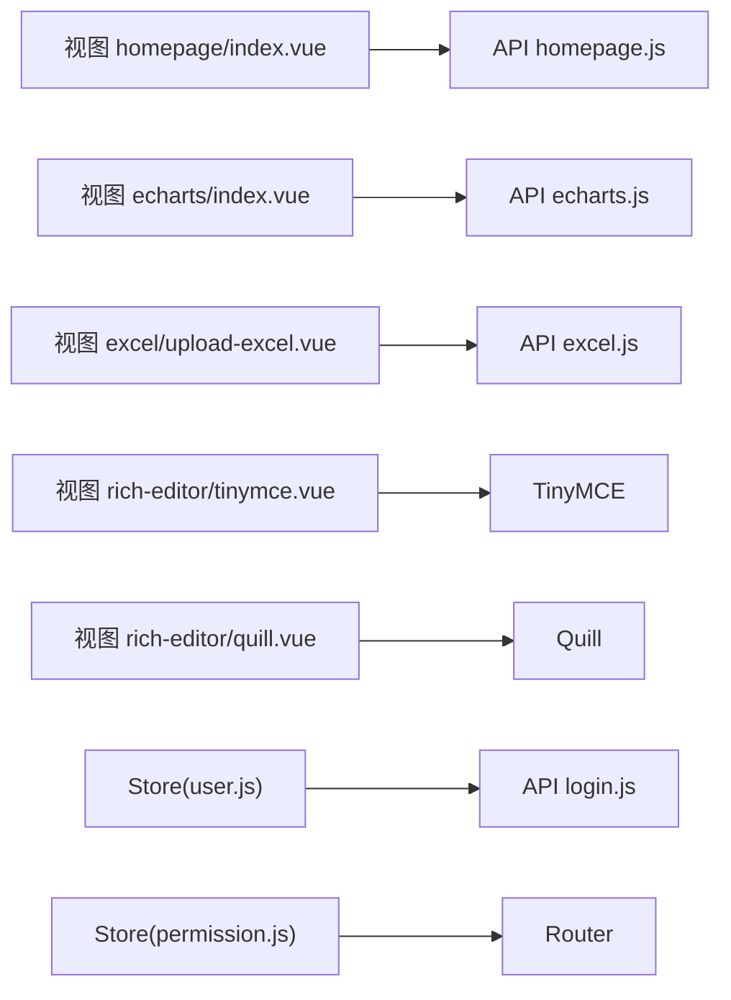

# 核心功能

<cite>
**本文引用的文件**
- [src/main.js](file://src/main.js)
- [src/router/index.js](file://src/router/index.js)
- [src/store/index.js](file://src/store/index.js)
- [src/store/modules/user.js](file://src/store/modules/user.js)
- [src/store/modules/permission.js](file://src/store/modules/permission.js)
- [src/permission.js](file://src/permission.js)
- [src/api/login.js](file://src/api/login.js)
- [src/api/homepage.js](file://src/api/homepage.js)
- [src/views/homepage/index.vue](file://src/views/homepage/index.vue)
- [src/views/echarts/index.vue](file://src/views/echarts/index.vue)
- [src/api/echarts.js](file://src/api/echarts.js)
- [src/api/excel.js](file://src/api/excel.js)
- [src/views/excel/upload-excel.vue](file://src/views/excel/upload-excel.vue)
- [src/views/rich-editor/tinymce.vue](file://src/views/rich-editor/tinymce.vue)
- [src/views/rich-editor/quill.vue](file://src/views/rich-editor/quill.vue)
- [src/mock/index.js](file://src/mock/index.js)
</cite>

## 目录
1. [简介](#简介)
2. [项目结构](#项目结构)
3. [核心组件](#核心组件)
4. [架构总览](#架构总览)
5. [详细组件分析](#详细组件分析)
6. [依赖分析](#依赖分析)
7. [性能考虑](#性能考虑)
8. [故障排查指南](#故障排查指南)
9. [结论](#结论)
10. [附录](#附录)

## 简介
本文件面向Vue CMS的核心功能模块，系统梳理并解释以下能力：
- 用户认证与权限管理：登录、令牌管理、动态路由与菜单权限、按钮权限、会话与本地存储策略
- 主页仪表板：数据卡片、滚动榜单、图表联动与数字动画
- Excel数据处理：本地Excel解析、表格渲染、文件列表与删除
- 数据可视化图表：多维度统计、排行榜、完成率图
- 富文本编辑：TinyMCE与Quill两种编辑器集成、工具栏与图片上传

文档同时阐述模块间协作关系、数据流、错误处理、性能优化建议、扩展与二次开发指南，并提供面向初学者的功能概览与面向专家的实现细节。

## 项目结构
项目采用典型的Vue SPA分层组织：入口引导、路由与权限、状态管理、API封装、视图组件、Mock数据与国际化等。核心入口负责挂载应用、引入ElementUI、国际化与全局通知组件，并加载Mock数据以支撑演示。

**图表来源**
- [src/main.js:1-53](file://src/main.js#L1-L53)
- [src/router/index.js:1-343](file://src/router/index.js#L1-L343)
- [src/store/index.js:1-74](file://src/store/index.js#L1-L74)
- [src/store/modules/user.js:1-154](file://src/store/modules/user.js#L1-L154)
- [src/store/modules/permission.js:1-187](file://src/store/modules/permission.js#L1-L187)
- [src/permission.js:1-98](file://src/permission.js#L1-L98)
- [src/api/login.js:1-24](file://src/api/login.js#L1-L24)
- [src/mock/index.js:1-38](file://src/mock/index.js#L1-L38)
- [src/views/homepage/index.vue:1-654](file://src/views/homepage/index.vue#L1-L654)
- [src/views/echarts/index.vue:1-217](file://src/views/echarts/index.vue#L1-L217)
- [src/api/echarts.js](file://src/api/echarts.js)
- [src/api/excel.js:1-38](file://src/api/excel.js#L1-L38)
- [src/views/excel/upload-excel.vue:1-130](file://src/views/excel/upload-excel.vue#L1-L130)
- [src/views/rich-editor/tinymce.vue:1-153](file://src/views/rich-editor/tinymce.vue#L1-L153)
- [src/views/rich-editor/quill.vue:1-236](file://src/views/rich-editor/quill.vue#L1-L236)

**章节来源**
- [src/main.js:1-53](file://src/main.js#L1-L53)
- [src/router/index.js:1-343](file://src/router/index.js#L1-L343)
- [src/store/index.js:1-74](file://src/store/index.js#L1-L74)

## 核心组件
- 应用入口与全局配置：引入ElementUI、国际化、全局通知、Mock数据与路由守卫
- 路由与权限：常量路由、动态路由、末尾路由、权限过滤与路由注入
- 状态管理：自动注入modules、全局getters、用户与权限模块
- 认证与权限：登录API、令牌与会话存储、用户信息拉取、登出清理
- 主页仪表板：数据聚合、数字动画、滚动榜单、图表组件组合
- 可视化图表：分类分布、数量排行、完成率排行、列表联动
- Excel处理：本地文件读取、XLSX解析、表格渲染
- 富文本编辑：TinyMCE CDN按需加载与配置、Quill工具栏与图片上传

**章节来源**
- [src/permission.js:1-98](file://src/permission.js#L1-L98)
- [src/store/modules/user.js:1-154](file://src/store/modules/user.js#L1-L154)
- [src/store/modules/permission.js:1-187](file://src/store/modules/permission.js#L1-L187)
- [src/views/homepage/index.vue:1-654](file://src/views/homepage/index.vue#L1-L654)
- [src/views/echarts/index.vue:1-217](file://src/views/echarts/index.vue#L1-L217)
- [src/views/excel/upload-excel.vue:1-130](file://src/views/excel/upload-excel.vue#L1-L130)
- [src/views/rich-editor/tinymce.vue:1-153](file://src/views/rich-editor/tinymce.vue#L1-L153)
- [src/views/rich-editor/quill.vue:1-236](file://src/views/rich-editor/quill.vue#L1-L236)

## 架构总览
整体采用“入口引导 → 路由守卫 → 动态路由注入 → 视图渲染”的流程。权限通过后端返回的路由/按钮权限与前端路由表匹配，生成用户专属路由集合并注入。视图层通过API模块调用Mock或真实后端，配合组件内部状态与第三方库完成业务功能。

**图表来源**
- [src/main.js:1-53](file://src/main.js#L1-L53)
- [src/permission.js:1-98](file://src/permission.js#L1-L98)
- [src/router/index.js:1-343](file://src/router/index.js#L1-L343)
- [src/store/modules/user.js:1-154](file://src/store/modules/user.js#L1-L154)
- [src/store/modules/permission.js:1-187](file://src/store/modules/permission.js#L1-L187)
- [src/api/login.js:1-24](file://src/api/login.js#L1-L24)
- [src/mock/index.js:1-38](file://src/mock/index.js#L1-L38)

## 详细组件分析

### 用户认证与权限管理
- 设计理念
  - 前端基于路由表与后端返回的权限集合进行匹配，生成用户专属路由
  - 令牌与用户信息持久化到Cookie与SessionStorage，确保刷新后仍保持登录态
  - 登出时清理令牌、会话与路由，保证安全与一致性
- 实现原理
  - 登录：调用登录API，写入令牌与用户路由/信息到会话，提交到Vuex
  - 动态路由：根据后端返回的路由/按钮权限，过滤前端路由表，注入到路由器
  - 权限校验：全局前置守卫在每次导航前检查令牌与路由完整性，必要时回退登录
  - 登出：调用登出API，移除令牌，清空会话与路由，重置路由实例
- 使用场景
  - 新用户首次登录、刷新后恢复登录态、权限变更后的路由重建、登出清理
- 配置与定制
  - 令牌键名、会话键名、白名单、进度条样式、ElementUI尺寸与语言
  - 路由元信息：icon、title、noCache、alwaysShow、hidden等
- 扩展与二次开发
  - 在后端增加权限类型枚举，前端通过工具函数区分菜单/按钮权限
  - 增加角色切换、多租户权限、权限缓存与失效策略
- 交互优化
  - 登录成功后自动跳转原目标页，避免重复输入
  - 路由切换时显示进度条，提升感知

**图表来源**
- [src/api/login.js:1-24](file://src/api/login.js#L1-L24)
- [src/store/modules/user.js:1-154](file://src/store/modules/user.js#L1-L154)
- [src/store/modules/permission.js:1-187](file://src/store/modules/permission.js#L1-L187)
- [src/permission.js:1-98](file://src/permission.js#L1-L98)
- [src/router/index.js:1-343](file://src/router/index.js#L1-L343)

**章节来源**
- [src/api/login.js:1-24](file://src/api/login.js#L1-L24)
- [src/store/modules/user.js:1-154](file://src/store/modules/user.js#L1-L154)
- [src/store/modules/permission.js:1-187](file://src/store/modules/permission.js#L1-L187)
- [src/permission.js:1-98](file://src/permission.js#L1-L98)
- [src/router/index.js:1-343](file://src/router/index.js#L1-L343)

### 主页仪表板
- 设计理念
  - 以数据卡片与图表组合呈现关键指标，支持响应式布局与滚动榜单
  - 数字动画增强视觉反馈，Better-Scroll提供流畅的长列表滚动体验
- 实现原理
  - 通过API获取头部汇总、明细项与投资排行，组件内进行数据处理与渲染
  - 使用第三方库实现数字递增动画与滚动区域初始化
- 使用场景
  - 首屏概览、运营监控、KPI展示
- 配置与定制
  - 卡片颜色、动画时长、滚动速度、图表尺寸
  - 国际化标题与单位换算
- 扩展与二次开发
  - 新增卡片类型、接入实时数据WebSocket、图表联动与钻取
- 交互优化
  - DOM就绪后延迟初始化滚动，避免闪烁；销毁时释放实例防止内存泄漏

**图表来源**
- [src/views/homepage/index.vue:1-654](file://src/views/homepage/index.vue#L1-L654)
- [src/api/homepage.js:1-23](file://src/api/homepage.js#L1-L23)

**章节来源**
- [src/views/homepage/index.vue:1-654](file://src/views/homepage/index.vue#L1-L654)
- [src/api/homepage.js:1-23](file://src/api/homepage.js#L1-L23)

### Excel数据处理
- 设计理念
  - 支持本地Excel文件拖拽上传，解析首张工作表为JSON并渲染表格
  - 适配常见列头与数据类型，提供预览与展示
- 实现原理
  - 使用FileReader读取二进制数据，借助XLSX库解析为工作簿
  - 提取首张表的表头与行数据，生成表格列与行
- 使用场景
  - 数据导入预览、报表数据核对、批量数据展示
- 配置与定制
  - 限制文件类型与数量、自定义表头映射、数据清洗规则
- 扩展与二次开发
  - 增加多表选择、跨表关联、数据校验与错误提示
- 交互优化
  - 文件变更即刻解析，避免自动上传造成等待

**图表来源**
- [src/views/excel/upload-excel.vue:1-130](file://src/views/excel/upload-excel.vue#L1-L130)

**章节来源**
- [src/views/excel/upload-excel.vue:1-130](file://src/views/excel/upload-excel.vue#L1-L130)
- [src/api/excel.js:1-38](file://src/api/excel.js#L1-L38)

### 数据可视化图表
- 设计理念
  - 以分类分布、数量排行、完成率排行构成多维视角，支持列表联动
- 实现原理
  - 通过API获取分类与部门数据，前端排序与格式化后传递给子组件
  - 子组件负责具体图表绘制与交互事件回调
- 使用场景
  - 业务指标分析、部门绩效对比、任务完成度监控
- 配置与定制
  - 图表尺寸、颜色主题、排序规则、百分比保留位数
- 扩展与二次开发
  - 新增图表类型、接入真实后端数据、支持时间轴与筛选器
- 交互优化
  - 列表与图表联动，点击图表项高亮对应列表行

**图表来源**
- [src/views/echarts/index.vue:1-217](file://src/views/echarts/index.vue#L1-L217)
- [src/api/echarts.js](file://src/api/echarts.js)

**章节来源**
- [src/views/echarts/index.vue:1-217](file://src/views/echarts/index.vue#L1-L217)

### 富文本编辑
- 设计理念
  - 提供两种主流富文本编辑器：TinyMCE（CDN按需加载）与Quill（模块化注册）
- 实现原理
  - TinyMCE：动态加载CDN脚本，初始化编辑器，监听内容变化并同步到视图
  - Quill：注册图片拖拽与缩放模块，自定义工具栏按钮，实现图片上传与字数统计
- 使用场景
  - 文章发布、公告编辑、帮助文档维护
- 配置与定制
  - 工具栏按钮、语言、主题、插件、图片上传接口
- 扩展与二次开发
  - 自定义插件与命令、集成云存储、水印与模板
- 交互优化
  - 全屏切换、内容同步、字数提醒、粘贴清理

**图表来源**
- [src/views/rich-editor/tinymce.vue:1-153](file://src/views/rich-editor/tinymce.vue#L1-L153)
- [src/views/rich-editor/quill.vue:1-236](file://src/views/rich-editor/quill.vue#L1-L236)

**章节来源**
- [src/views/rich-editor/tinymce.vue:1-153](file://src/views/rich-editor/tinymce.vue#L1-L153)
- [src/views/rich-editor/quill.vue:1-236](file://src/views/rich-editor/quill.vue#L1-L236)

## 依赖分析
- 组件耦合
  - 视图组件依赖API模块与第三方库，API模块依赖请求封装
  - 权限模块依赖路由配置与校验工具，用户模块依赖API与会话存储
- 外部依赖
  - ElementUI、Vue Router、Vuex、MockJS、XLSX、TinyMCE、Quill、CountUp、Better-Scroll
- 循环依赖
  - 当前结构未见循环依赖，路由与权限通过全局守卫解耦

**图表来源**
- [src/views/homepage/index.vue:1-654](file://src/views/homepage/index.vue#L1-L654)
- [src/api/homepage.js:1-23](file://src/api/homepage.js#L1-L23)
- [src/views/echarts/index.vue:1-217](file://src/views/echarts/index.vue#L1-L217)
- [src/api/echarts.js](file://src/api/echarts.js)
- [src/api/excel.js:1-38](file://src/api/excel.js#L1-L38)
- [src/views/excel/upload-excel.vue:1-130](file://src/views/excel/upload-excel.vue#L1-L130)
- [src/views/rich-editor/tinymce.vue:1-153](file://src/views/rich-editor/tinymce.vue#L1-L153)
- [src/views/rich-editor/quill.vue:1-236](file://src/views/rich-editor/quill.vue#L1-L236)
- [src/api/login.js:1-24](file://src/api/login.js#L1-L24)
- [src/store/modules/user.js:1-154](file://src/store/modules/user.js#L1-L154)
- [src/store/modules/permission.js:1-187](file://src/store/modules/permission.js#L1-L187)
- [src/router/index.js:1-343](file://src/router/index.js#L1-L343)

**章节来源**
- [src/store/index.js:1-74](file://src/store/index.js#L1-L74)
- [src/store/modules/user.js:1-154](file://src/store/modules/user.js#L1-L154)
- [src/store/modules/permission.js:1-187](file://src/store/modules/permission.js#L1-L187)
- [src/router/index.js:1-343](file://src/router/index.js#L1-L343)

## 性能考虑
- 路由与权限
  - 避免重复生成路由，利用会话存储减少重复请求
  - 路由守卫中仅在必要时过滤与注入，避免全量计算
- 视图渲染
  - 使用keep-alive缓存非关键页面，减少重复渲染
  - 表格与滚动区域在销毁时释放实例，降低内存占用
- 第三方库
  - TinyMCE按需加载，避免首屏体积过大
  - XLSX解析大文件时注意分块与异步处理，避免阻塞UI
- 网络请求
  - Mock环境设置合理延时，模拟真实网络状况
  - API层统一拦截与错误提示，避免重复错误处理

## 故障排查指南
- 登录后无法进入受控页面
  - 检查令牌是否存在与会话中用户路由是否正确写入
  - 查看路由守卫日志与错误消息提示
- 动态路由未生效
  - 确认后端返回的路由地址与前端path一致，且存在权限类型
  - 检查路由注入后是否触发replace跳转
- Excel解析失败
  - 确认文件类型与编码，检查XLSX解析是否抛错
  - 验证首张工作表是否存在与表头是否可读
- 富文本编辑器空白或不响应
  - 检查CDN加载是否成功，编辑器初始化回调是否执行
  - Quill模块注册顺序与版本兼容性

**章节来源**
- [src/permission.js:1-98](file://src/permission.js#L1-L98)
- [src/store/modules/permission.js:1-187](file://src/store/modules/permission.js#L1-L187)
- [src/views/excel/upload-excel.vue:1-130](file://src/views/excel/upload-excel.vue#L1-L130)
- [src/views/rich-editor/tinymce.vue:1-153](file://src/views/rich-editor/tinymce.vue#L1-L153)

## 结论
本项目围绕“认证与权限”“主页仪表板”“Excel处理”“可视化图表”“富文本编辑”五大核心模块构建，采用前后端分离思路与Mock数据驱动开发，具备良好的扩展性与二次开发空间。通过路由守卫与动态注入实现细粒度权限控制，结合第三方库与组件化设计，满足多样化的业务需求。建议在生产环境中替换Mock为真实后端，并完善权限模型与数据安全策略。

## 附录
- 快速开始
  - 安装依赖后运行开发服务器，访问登录页进行演示
  - 默认使用Mock数据，若需对接真实后端，请注释掉Mock加载或替换为真实接口
- 常用配置
  - ElementUI尺寸与语言、进度条样式、路由元信息、编辑器插件与工具栏
- 扩展清单
  - 新增权限类型、接入真实后端、图表联动与筛选、Excel模板与校验、富文本插件生态