# 用户认证与权限管理

<cite>
**本文引用的文件**
- [src/api/login.js](file://src/api/login.js)
- [src/common/auth.js](file://src/common/auth.js)
- [src/store/modules/user.js](file://src/store/modules/user.js)
- [src/store/modules/permission.js](file://src/store/modules/permission.js)
- [src/store/modules/language.js](file://src/store/modules/language.js)
- [src/store/modules/setting.js](file://src/store/modules/setting.js)
- [src/permission.js](file://src/permission.js)
- [src/router/index.js](file://src/router/index.js)
- [src/utils/validate.js](file://src/utils/validate.js)
- [src/views/login/index.vue](file://src/views/login/index.vue)
- [src/components/captcha/index.vue](file://src/components/captcha/index.vue)
- [src/components/lang-select/index.vue](file://src/components/lang-select/index.vue)
- [src/components/theme/index.vue](file://src/components/theme/index.vue)
- [src/common/session-storage.js](file://src/common/session-storage.js)
- [src/common/local-storage.js](file://src/common/local-storage.js)
- [src/utils/request.js](file://src/utils/request.js)
- [src/utils/get-page-title.js](file://src/utils/get-page-title.js)
- [src/common/lang.js](file://src/common/lang.js)
- [src/assets/custom-theme/science-blue.css](file://src/assets/custom-theme/science-blue.css)
- [src/language/en.js](file://src/language/en.js)
- [src/language/zh.js](file://src/language/zh.js)
- [src/main.js](file://src/main.js)
- [src/mock/login.js](file://src/mock/login.js)
- [src/mock/modules/user.js](file://src/mock/modules/user.js)
</cite>

## 更新摘要
**所做更改**
- 更新登录页面组件分析，反映现代化分屏布局设计
- 新增验证码验证系统的详细说明和实现分析
- 增强主题切换功能的架构说明，包括深色模式和自定义主题
- 扩展国际化支持的实现细节和多语言配置
- 更新登录流程图，包含验证码验证和主题切换步骤
- 新增动画装饰和品牌展示区域的技术实现分析

## 目录
1. [简介](#简介)
2. [项目结构](#项目结构)
3. [核心组件](#核心组件)
4. [架构总览](#架构总览)
5. [详细组件分析](#详细组件分析)
6. [依赖关系分析](#依赖关系分析)
7. [性能考量](#性能考量)
8. [故障排查指南](#故障排查指南)
9. [结论](#结论)
10. [附录](#附录)

## 简介
本文件面向开发者与产品人员，系统化梳理本项目的用户认证与权限管理体系，覆盖登录认证流程、Token管理机制、用户状态持久化、动态路由生成与权限验证体系。重点说明：
- 登录认证流程与前后端交互
- Token的生成、存储与刷新机制
- 用户信息的获取与缓存策略
- 权限控制实现原理（角色权限分配、菜单权限过滤、按钮权限控制）
- 路由守卫工作机制与权限拦截逻辑
- 权限配置最佳实践与安全注意事项
- 扩展指南与二次开发建议

**更新** 本次更新重点关注登录页面的重大重构，包括验证码验证系统、现代化分屏布局设计、增强的主题切换功能和国际化支持扩展。

## 项目结构
围绕认证与权限的关键模块分布如下：
- 视图层：登录页组件负责表单校验、验证码验证与主题切换
- API层：封装登录、登出、用户信息等接口调用
- 组件层：验证码组件、语言选择组件、主题切换组件提供增强功能
- 工具层：Cookie/Storage封装、Axios拦截器、权限类型判定
- 状态层：Vuex模块管理用户信息、Token、权限路由、语言设置、主题配置
- 路由层：常量路由、动态路由、末尾兜底路由与路由重置
- 权限守卫：全局前置守卫实现登录态校验与动态路由注入
- Mock层：本地模拟用户与权限数据，便于联调与演示

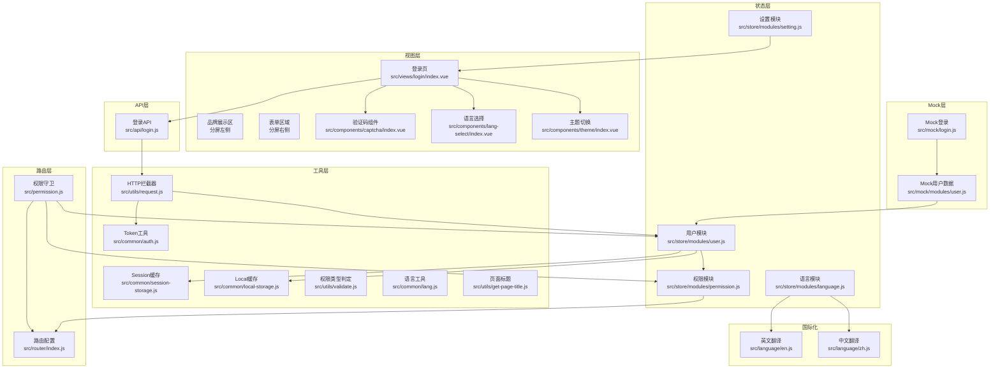

**图表来源**
- [src/views/login/index.vue:1-1120](file://src/views/login/index.vue#L1-L1120)
- [src/components/captcha/index.vue:1-117](file://src/components/captcha/index.vue#L1-L117)
- [src/components/lang-select/index.vue:1-45](file://src/components/lang-select/index.vue#L1-L45)
- [src/components/theme/index.vue:1-42](file://src/components/theme/index.vue#L1-L42)
- [src/api/login.js:1-24](file://src/api/login.js#L1-L24)
- [src/common/auth.js:1-18](file://src/common/auth.js#L1-L18)
- [src/common/session-storage.js:1-48](file://src/common/session-storage.js#L1-L48)
- [src/common/local-storage.js:1-41](file://src/common/local-storage.js#L1-L41)
- [src/utils/request.js:1-139](file://src/utils/request.js#L1-L139)
- [src/utils/validate.js:1-56](file://src/utils/validate.js#L1-L56)
- [src/store/modules/user.js:1-154](file://src/store/modules/user.js#L1-L154)
- [src/store/modules/permission.js:1-187](file://src/store/modules/permission.js#L1-L187)
- [src/store/modules/language.js:1-26](file://src/store/modules/language.js#L1-L26)
- [src/store/modules/setting.js:1-241](file://src/store/modules/setting.js#L1-L241)
- [src/router/index.js:1-343](file://src/router/index.js#L1-L343)
- [src/permission.js:1-98](file://src/permission.js#L1-L98)
- [src/language/en.js:1-152](file://src/language/en.js#L1-L152)
- [src/language/zh.js:1-150](file://src/language/zh.js#L1-L150)
- [src/common/lang.js:1-18](file://src/common/lang.js#L1-L18)
- [src/utils/get-page-title.js:1-9](file://src/utils/get-page-title.js#L1-L9)

**章节来源**
- [src/main.js:1-53](file://src/main.js#L1-L53)
- [src/router/index.js:1-343](file://src/router/index.js#L1-L343)
- [src/permission.js:1-98](file://src/permission.js#L1-L98)

## 核心组件
- 登录页组件：提供现代化分屏布局、表单校验、验证码验证、记住账号、加载态、错误日志与跳转逻辑
- 验证码组件：生成随机验证码、支持主题适配、点击刷新功能
- 语言选择组件：支持中英切换、页面标题国际化更新
- 主题切换组件：提供多种主题选择、深色模式切换
- 登录API：封装登录、登出、用户信息接口
- Token工具：基于Cookie的Token读写移除
- Vuex用户模块：登录、拉取用户信息、登出、重置Token、头像与用户信息更新
- Vuex权限模块：根据后端返回的权限类型过滤动态路由，生成按钮权限集合
- Vuex语言模块：管理当前语言状态，支持持久化存储
- Vuex设置模块：管理主题、布局、界面配置等全局设置
- 路由配置：常量路由、动态路由、末尾兜底路由与路由重置
- 权限守卫：全局前置守卫，处理白名单、Token校验、动态路由注入与错误恢复
- HTTP拦截器：统一注入Authorization头、语言头、错误弹窗与Token失效处理
- 缓存工具：Session与Local双层缓存，隔离临时与持久化数据
- Mock数据：模拟用户与权限，便于本地联调

**章节来源**
- [src/views/login/index.vue:1-1120](file://src/views/login/index.vue#L1-L1120)
- [src/components/captcha/index.vue:1-117](file://src/components/captcha/index.vue#L1-L117)
- [src/components/lang-select/index.vue:1-45](file://src/components/lang-select/index.vue#L1-L45)
- [src/components/theme/index.vue:1-42](file://src/components/theme/index.vue#L1-L42)
- [src/api/login.js:1-24](file://src/api/login.js#L1-L24)
- [src/common/auth.js:1-18](file://src/common/auth.js#L1-L18)
- [src/store/modules/user.js:1-154](file://src/store/modules/user.js#L1-L154)
- [src/store/modules/permission.js:1-187](file://src/store/modules/permission.js#L1-L187)
- [src/store/modules/language.js:1-26](file://src/store/modules/language.js#L1-L26)
- [src/store/modules/setting.js:1-241](file://src/store/modules/setting.js#L1-L241)
- [src/router/index.js:1-343](file://src/router/index.js#L1-L343)
- [src/permission.js:1-98](file://src/permission.js#L1-L98)
- [src/utils/request.js:1-139](file://src/utils/request.js#L1-L139)
- [src/common/session-storage.js:1-48](file://src/common/session-storage.js#L1-L48)
- [src/common/local-storage.js:1-41](file://src/common/local-storage.js#L1-L41)
- [src/mock/modules/user.js:1-204](file://src/mock/modules/user.js#L1-L204)

## 架构总览
整体认证与权限流程如下：
- 登录页发起登录请求，携带账号密码和验证码
- 后端返回Token与用户权限、用户信息
- 前端将Token写入Cookie，将权限与用户信息写入Session，提交到Vuex
- 权限模块根据权限类型过滤动态路由，生成可访问菜单与页面
- 路由守卫在进入路由前校验Token与动态路由状态，必要时注入动态路由
- HTTP拦截器统一注入Authorization头，处理Token失效与错误提示
- 登出时清理Token与Session，重置路由并回到登录页

**更新** 新增验证码验证流程和主题切换机制：

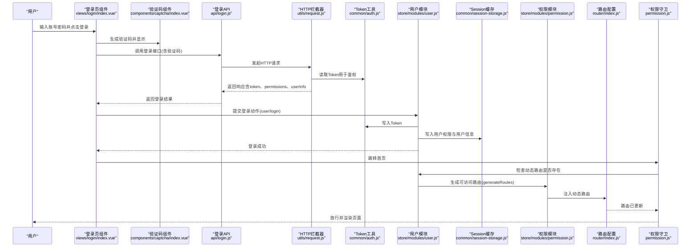

**图表来源**
- [src/views/login/index.vue:279-316](file://src/views/login/index.vue#L279-L316)
- [src/components/captcha/index.vue:36-47](file://src/components/captcha/index.vue#L36-L47)
- [src/api/login.js:3-23](file://src/api/login.js#L3-L23)
- [src/utils/request.js:18-52](file://src/utils/request.js#L18-L52)
- [src/common/auth.js:5-15](file://src/common/auth.js#L5-L15)
- [src/store/modules/user.js:54-74](file://src/store/modules/user.js#L54-L74)
- [src/store/modules/permission.js:147-178](file://src/store/modules/permission.js#L147-L178)
- [src/router/index.js:322-340](file://src/router/index.js#L322-L340)
- [src/permission.js:23-91](file://src/permission.js#L23-L91)

## 详细组件分析

### 登录认证流程与登录组件实现
- 分屏布局设计：左侧品牌展示区域包含动画装饰、网格背景、发光效果和品牌信息
- 表单验证：使用自定义校验器对用户名与密码进行规则校验
- 验证码验证：集成验证码组件，支持点击刷新、大小写不敏感验证
- 记住账号：将账号与密码写入Local缓存，下次进入自动填充
- 登录提交：校验通过后调用Vuex的登录动作，成功后跳转首页
- 错误处理：捕获登录错误并在控制台输出便于调试
- 主题切换：支持深色模式切换，自动适配验证码组件颜色
- 国际化支持：支持中英双语切换，页面标题动态更新

**更新** 新增分屏布局和验证码验证功能：

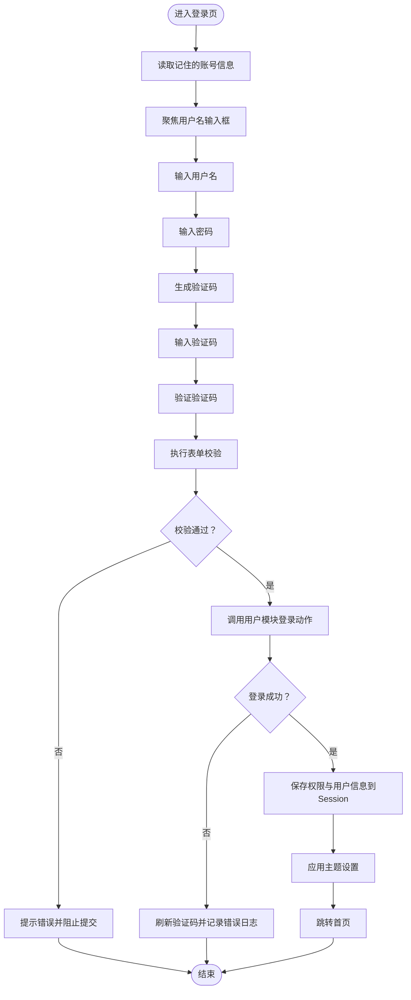

**图表来源**
- [src/views/login/index.vue:187-217](file://src/views/login/index.vue#L187-L217)
- [src/views/login/index.vue:244-246](file://src/views/login/index.vue#L244-L246)
- [src/views/login/index.vue:279-316](file://src/views/login/index.vue#L279-L316)
- [src/common/local-storage.js:13-35](file://src/common/local-storage.js#L13-L35)

**章节来源**
- [src/views/login/index.vue:1-1120](file://src/views/login/index.vue#L1-L1120)
- [src/common/local-storage.js:1-41](file://src/common/local-storage.js#L1-L41)

### 验证码验证系统
- 随机字符生成：支持字母数字组合，排除易混淆字符
- 主题适配：根据深色/浅色模式自动调整验证码颜色
- 干扰元素：绘制干扰线和点阵，提高安全性
- 字符渲染：支持旋转角度和随机字体大小
- 事件通信：通过change事件向父组件传递验证码值
- 刷新机制：点击验证码区域触发重新生成

**新增功能** 验证码组件提供完整的图形验证码解决方案：

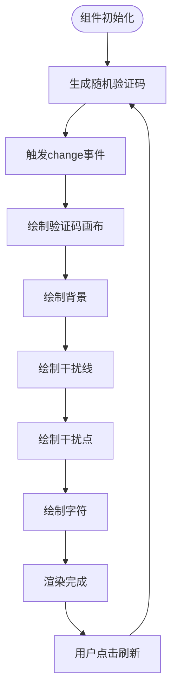

**图表来源**
- [src/components/captcha/index.vue:36-47](file://src/components/captcha/index.vue#L36-L47)
- [src/components/captcha/index.vue:48-99](file://src/components/captcha/index.vue#L48-L99)

**章节来源**
- [src/components/captcha/index.vue:1-117](file://src/components/captcha/index.vue#L1-L117)

### 主题切换功能
- 深色模式：支持全局深色主题切换，影响登录页背景和表单样式
- 自定义主题：提供科学蓝主题样式，支持侧边栏、导航栏等组件样式
- 状态管理：通过Vuex setting模块管理主题状态，支持持久化存储
- 动态样式：根据主题状态动态应用CSS类名
- 组件集成：登录页集成主题切换按钮，支持实时预览

**更新** 新增主题切换功能，支持深色模式和自定义主题：

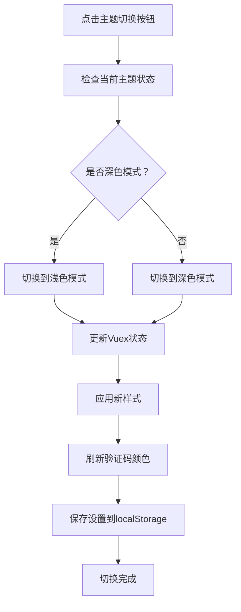

**图表来源**
- [src/views/login/index.vue:264-278](file://src/views/login/index.vue#L264-L278)
- [src/store/modules/setting.js:188-190](file://src/store/modules/setting.js#L188-L190)
- [src/components/captcha/index.vue:55-59](file://src/components/captcha/index.vue#L55-L59)

**章节来源**
- [src/views/login/index.vue:1-1120](file://src/views/login/index.vue#L1-L1120)
- [src/store/modules/setting.js:1-241](file://src/store/modules/setting.js#L1-L241)
- [src/components/theme/index.vue:1-42](file://src/components/theme/index.vue#L1-L42)

### 国际化支持扩展
- 多语言配置：支持中文和英文两种语言，配置独立的语言文件
- 动态切换：通过语言选择组件实现运行时语言切换
- 页面标题：切换语言时自动更新页面标题
- 组件本地化：登录表单、按钮、提示信息全部支持国际化
- Cookie存储：语言偏好通过Cookie持久化存储

**新增功能** 完整的国际化支持体系：

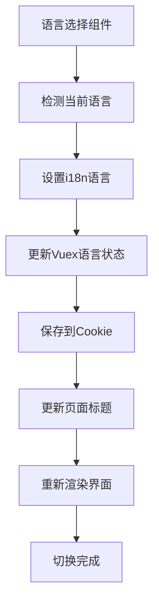

**图表来源**
- [src/components/lang-select/index.vue:28-35](file://src/components/lang-select/index.vue#L28-L35)
- [src/store/modules/language.js:9-12](file://src/store/modules/language.js#L9-L12)
- [src/common/lang.js:5-11](file://src/common/lang.js#L5-L11)
- [src/utils/get-page-title.js:3-8](file://src/utils/get-page-title.js#L3-L8)

**章节来源**
- [src/components/lang-select/index.vue:1-45](file://src/components/lang-select/index.vue#L1-L45)
- [src/store/modules/language.js:1-26](file://src/store/modules/language.js#L1-L26)
- [src/common/lang.js:1-18](file://src/common/lang.js#L1-L18)
- [src/utils/get-page-title.js:1-9](file://src/utils/get-page-title.js#L1-L9)
- [src/language/en.js:1-152](file://src/language/en.js#L1-L152)
- [src/language/zh.js:1-150](file://src/language/zh.js#L1-L150)

### Token管理机制
- Token来源：登录成功后写入Cookie，键名来自环境变量
- 读取与移除：提供统一方法读取、设置、删除Token
- 请求头注入：HTTP拦截器在请求前读取Token并注入Authorization头
- Token失效处理：响应拦截器识别特定错误码，弹窗引导重新登录并重置状态

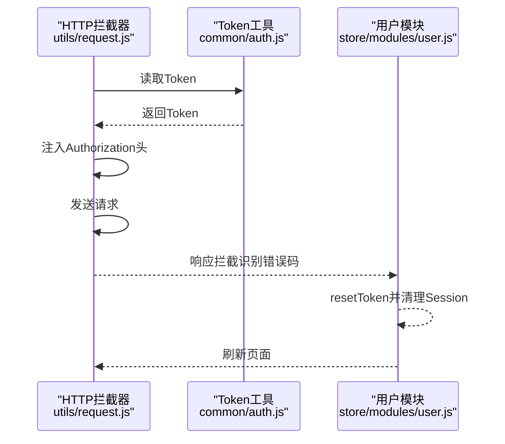

**图表来源**
- [src/utils/request.js:18-52](file://src/utils/request.js#L18-L52)
- [src/common/auth.js:5-15](file://src/common/auth.js#L5-L15)
- [src/store/modules/user.js:136-145](file://src/store/modules/user.js#L136-L145)

**章节来源**
- [src/common/auth.js:1-18](file://src/common/auth.js#L1-L18)
- [src/utils/request.js:1-139](file://src/utils/request.js#L1-L139)
- [src/store/modules/user.js:135-145](file://src/store/modules/user.js#L135-L145)

### 用户状态持久化与缓存策略
- Token：Cookie持久化，跨会话可用
- 用户信息与权限：Session临时缓存，随会话生命周期存在，退出登录时清空
- 记住账号：Local永久缓存，支持下次自动填充
- 语言设置：Cookie存储语言偏好，支持跨会话记忆
- 主题设置：localStorage持久化主题配置，支持页面刷新保持
- 退出登录：清理Token、清空Session、重置路由、回到登录页

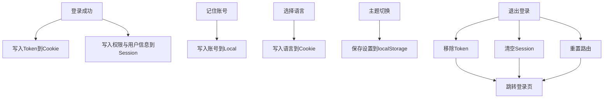

**图表来源**
- [src/store/modules/user.js:59-104](file://src/store/modules/user.js#L59-L104)
- [src/store/modules/language.js:9-12](file://src/store/modules/language.js#L9-L12)
- [src/store/modules/setting.js:86-92](file://src/store/modules/setting.js#L86-L92)
- [src/common/session-storage.js:19-45](file://src/common/session-storage.js#L19-L45)
- [src/common/local-storage.js:13-39](file://src/common/local-storage.js#L13-L39)
- [src/common/auth.js:9-15](file://src/common/auth.js#L9-L15)

**章节来源**
- [src/store/modules/user.js:1-154](file://src/store/modules/user.js#L1-L154)
- [src/store/modules/language.js:1-26](file://src/store/modules/language.js#L1-L26)
- [src/store/modules/setting.js:1-241](file://src/store/modules/setting.js#L1-L241)
- [src/common/session-storage.js:1-48](file://src/common/session-storage.js#L1-L48)
- [src/common/local-storage.js:1-41](file://src/common/local-storage.js#L1-L41)
- [src/common/auth.js:1-18](file://src/common/auth.js#L1-L18)

### 动态路由生成与权限验证体系
- 权限类型：菜单（type=1）、页面（type=2）、按钮（type=3）
- 路由过滤：根据后端返回的address与前端路由path匹配，生成可访问路由
- 按钮权限：提取type=3的address形成按钮权限数组
- 路由注入：将过滤后的动态路由与末尾兜底路由拼接，注入到路由器
- 路由重置：登出或异常时重置路由匹配器，避免重复注册

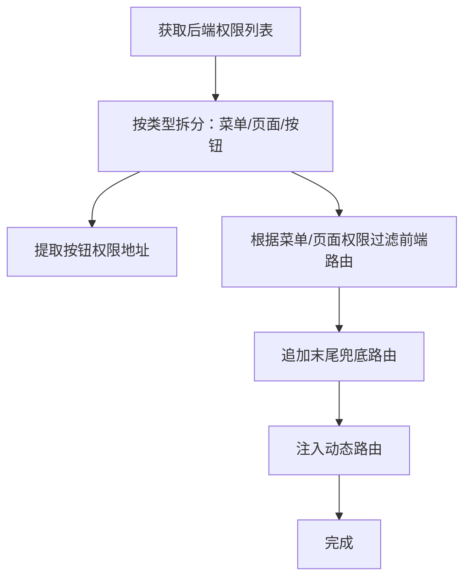

**图表来源**
- [src/store/modules/permission.js:147-178](file://src/store/modules/permission.js#L147-L178)
- [src/utils/validate.js:25-55](file://src/utils/validate.js#L25-L55)
- [src/router/index.js:80-111](file://src/router/index.js#L80-L111)

**章节来源**
- [src/store/modules/permission.js:1-187](file://src/store/modules/permission.js#L1-L187)
- [src/utils/validate.js:1-56](file://src/utils/validate.js#L1-L56)
- [src/router/index.js:1-343](file://src/router/index.js#L1-L343)

### 路由守卫工作机制与权限拦截逻辑
- 白名单：登录页、单点登录、文件下载等无需Token
- 登录态校验：若无Token且不在白名单，重定向至登录页并附带redirect参数
- 动态路由注入：若动态路由为空，尝试从Session加载并注入
- 错误恢复：注入失败或异常时，重置Token并提示错误
- 页面标题与进度条：统一设置页面标题与进度条样式

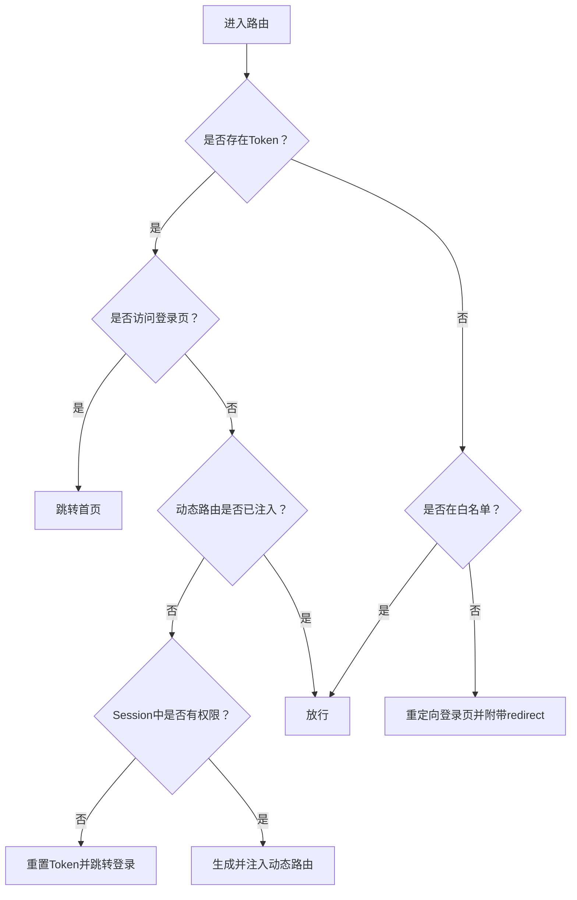

**图表来源**
- [src/permission.js:23-91](file://src/permission.js#L23-L91)
- [src/common/auth.js:5-7](file://src/common/auth.js#L5-L7)
- [src/common/session-storage.js:30-41](file://src/common/session-storage.js#L30-L41)

**章节来源**
- [src/permission.js:1-98](file://src/permission.js#L1-L98)
- [src/common/auth.js:1-18](file://src/common/auth.js#L1-L18)
- [src/common/session-storage.js:1-48](file://src/common/session-storage.js#L1-L48)

### 权限配置最佳实践与安全考虑
- 权限类型设计：使用type区分菜单、页面、按钮，确保前端与后端一致
- 地址匹配：后端返回的address需与前端路由path完全一致，保证匹配准确
- Token安全：仅通过Cookie存储，避免明文泄露；请求头注入时注意格式正确
- 缓存策略：Session存放临时权限与用户信息，Local仅存放非敏感配置；退出登录务必清空
- 验证码安全：验证码支持点击刷新，防止暴力破解；大小写不敏感提高用户体验
- 主题安全：深色模式下验证码颜色自动适配，确保可读性
- 错误处理：统一拦截Token失效与业务错误，引导用户重新登录
- 路由重置：登出或异常时重置路由匹配器，防止重复注册导致内存泄漏

**章节来源**
- [src/utils/validate.js:25-55](file://src/utils/validate.js#L25-L55)
- [src/common/auth.js:5-15](file://src/common/auth.js#L5-L15)
- [src/store/modules/user.js:91-104](file://src/store/modules/user.js#L91-L104)
- [src/utils/request.js:84-95](file://src/utils/request.js#L84-L95)
- [src/router/index.js:332-340](file://src/router/index.js#L332-L340)

### 扩展指南与二次开发建议
- 新增权限类型：在权限类型判定与路由过滤处扩展type分支
- 新增动态路由：在前端路由配置中新增路由项，后端返回对应address
- 自定义验证码：在验证码组件中扩展字符集、干扰元素、样式配置
- 新增主题：在custom-theme目录下添加新的CSS文件，通过主题组件集成
- 自定义国际化：在language目录下添加新的语言文件，更新语言选择组件
- 自定义拦截器行为：在HTTP拦截器中增加业务所需的头部或参数
- 退出登录流程：可在退出登录动作中扩展清理逻辑（如埋点、第三方登出）
- 路由守卫增强：可在守卫中加入更多业务判断（如企业微信授权、二次验证）

**章节来源**
- [src/store/modules/permission.js:147-178](file://src/store/modules/permission.js#L147-L178)
- [src/router/index.js:118-320](file://src/router/index.js#L118-L320)
- [src/utils/request.js:18-52](file://src/utils/request.js#L18-L52)
- [src/store/modules/user.js:91-104](file://src/store/modules/user.js#L91-L104)

## 依赖关系分析
- 登录页依赖API层、验证码组件、语言选择组件、主题切换组件与Vuex用户模块
- 验证码组件依赖主题状态，支持深色模式适配
- 语言选择组件依赖国际化配置和页面标题工具
- 主题切换组件依赖自定义主题样式文件
- API层依赖HTTP拦截器与Token工具
- Vuex用户模块依赖Token工具、Session缓存与路由重置
- Vuex权限模块依赖前端路由配置与权限类型判定
- Vuex语言模块依赖语言工具和Cookie存储
- Vuex设置模块管理主题、布局等全局配置
- 权限守卫依赖路由实例、Vuex用户与权限模块
- Mock层为本地联调提供用户与权限数据

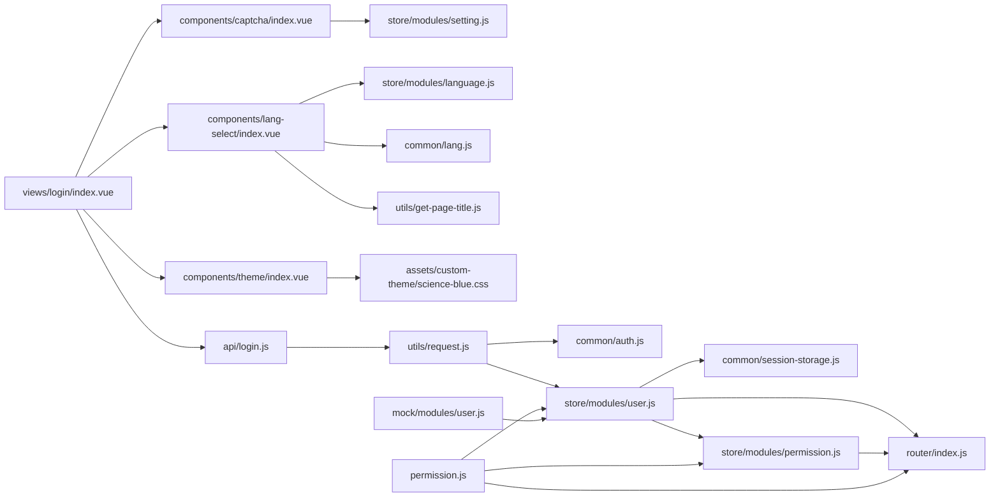

**图表来源**
- [src/views/login/index.vue:1-1120](file://src/views/login/index.vue#L1-L1120)
- [src/components/captcha/index.vue:1-117](file://src/components/captcha/index.vue#L1-L117)
- [src/components/lang-select/index.vue:1-45](file://src/components/lang-select/index.vue#L1-L45)
- [src/components/theme/index.vue:1-42](file://src/components/theme/index.vue#L1-L42)
- [src/api/login.js:1-24](file://src/api/login.js#L1-L24)
- [src/utils/request.js:1-139](file://src/utils/request.js#L1-L139)
- [src/common/auth.js:1-18](file://src/common/auth.js#L1-L18)
- [src/store/modules/user.js:1-154](file://src/store/modules/user.js#L1-L154)
- [src/store/modules/permission.js:1-187](file://src/store/modules/permission.js#L1-L187)
- [src/store/modules/language.js:1-26](file://src/store/modules/language.js#L1-L26)
- [src/store/modules/setting.js:1-241](file://src/store/modules/setting.js#L1-L241)
- [src/router/index.js:1-343](file://src/router/index.js#L1-L343)
- [src/permission.js:1-98](file://src/permission.js#L1-L98)
- [src/common/lang.js:1-18](file://src/common/lang.js#L1-L18)
- [src/utils/get-page-title.js:1-9](file://src/utils/get-page-title.js#L1-L9)
- [src/assets/custom-theme/science-blue.css:1-49](file://src/assets/custom-theme/science-blue.css#L1-L49)
- [src/mock/modules/user.js:1-204](file://src/mock/modules/user.js#L1-L204)

**章节来源**
- [src/main.js:1-53](file://src/main.js#L1-L53)
- [src/permission.js:1-98](file://src/permission.js#L1-L98)

## 性能考量
- 路由注入时机：仅在首次进入且动态路由为空时注入，避免重复注册
- 缓存策略：Session存放临时权限，减少重复请求；Local存放非敏感配置
- 请求去重：GET请求附加时间戳参数，避免浏览器缓存导致的数据陈旧
- 进度条：全局进度条提升用户感知，但需在路由完成后及时结束
- 验证码渲染：Canvas渲染验证码，支持点击刷新避免重复计算
- 主题切换：深色模式通过CSS变量和类名切换，性能开销最小
- 国际化：语言切换时仅更新必要的DOM节点，避免全页面重绘

**章节来源**
- [src/permission.js:40-74](file://src/permission.js#L40-L74)
- [src/common/session-storage.js:19-45](file://src/common/session-storage.js#L19-L45)
- [src/utils/request.js:34-43](file://src/utils/request.js#L34-L43)
- [src/permission.js:14-17](file://src/permission.js#L14-L17)
- [src/components/captcha/index.vue:36-47](file://src/components/captcha/index.vue#L36-L47)

## 故障排查指南
- 登录失败：检查登录接口返回与表单校验；查看控制台错误日志
- Token无效：确认Cookie中Token存在且未过期；检查请求头Authorization格式
- 无法进入受控页面：确认后端返回的address与前端路由path一致；检查Session中权限数据
- 动态路由未注入：确认用户模块已生成路由并注入；检查路由重置逻辑
- 退出登录异常：确认退出登录动作已清理Token与Session并重置路由
- 验证码问题：检查验证码组件是否正常渲染；确认验证码事件通信正常
- 主题切换异常：检查深色模式类名是否正确应用；确认验证码颜色适配
- 语言切换失败：确认语言文件加载正常；检查Cookie存储和Vuex状态同步

**章节来源**
- [src/views/login/index.vue:142-148](file://src/views/login/index.vue#L142-L148)
- [src/utils/request.js:84-95](file://src/utils/request.js#L84-L95)
- [src/store/modules/permission.js:147-178](file://src/store/modules/permission.js#L147-L178)
- [src/store/modules/user.js:91-104](file://src/store/modules/user.js#L91-L104)

## 结论
本项目采用"前端路由+后端权限"的权限模型，通过Token与Session实现登录态与临时数据管理，结合全局路由守卫与动态路由注入，实现了灵活可控的权限体系。本次重大重构显著提升了用户体验，包括现代化的分屏布局设计、完善的验证码验证系统、增强的主题切换功能和全面的国际化支持。建议在实际生产环境中进一步强化Token安全、完善权限校验边界与错误恢复策略，并持续优化用户体验与性能。

## 附录
- 环境变量：Cookie键名通过环境变量配置
- 白名单：登录页、单点登录、文件下载等无需Token
- Mock数据：本地模拟用户与权限，便于联调与演示
- 主题配置：支持深色模式和自定义主题样式
- 国际化配置：支持中英双语，页面标题动态更新

**章节来源**
- [src/common/auth.js:3](file://src/common/auth.js#L3)
- [src/permission.js:20](file://src/permission.js#L20)
- [src/mock/modules/user.js:9-190](file://src/mock/modules/user.js#L9-L190)
- [src/assets/custom-theme/science-blue.css:1-49](file://src/assets/custom-theme/science-blue.css#L1-L49)
- [src/language/en.js:1-152](file://src/language/en.js#L1-L152)
- [src/language/zh.js:1-150](file://src/language/zh.js#L1-L150)