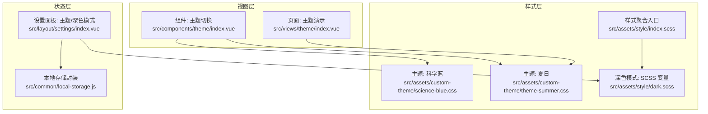
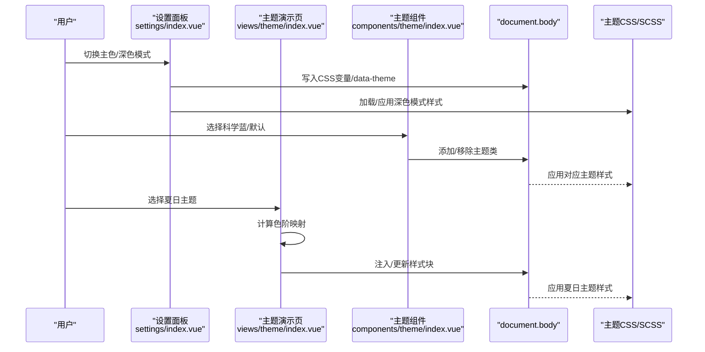
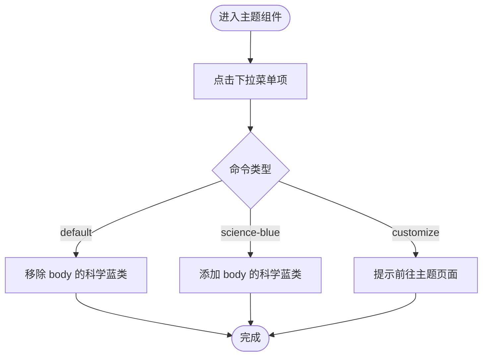
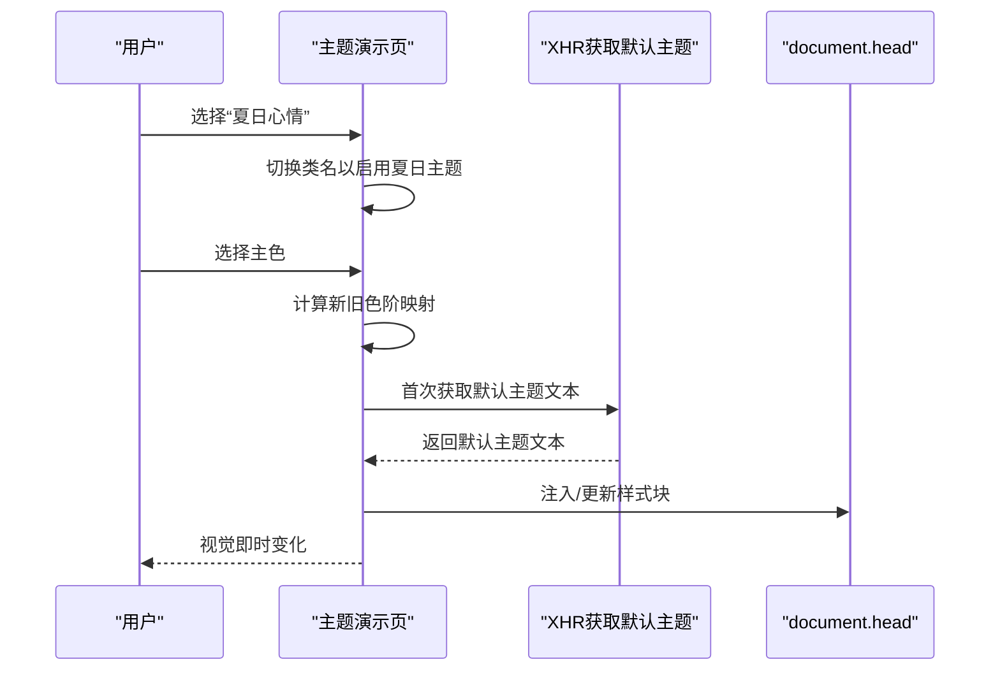
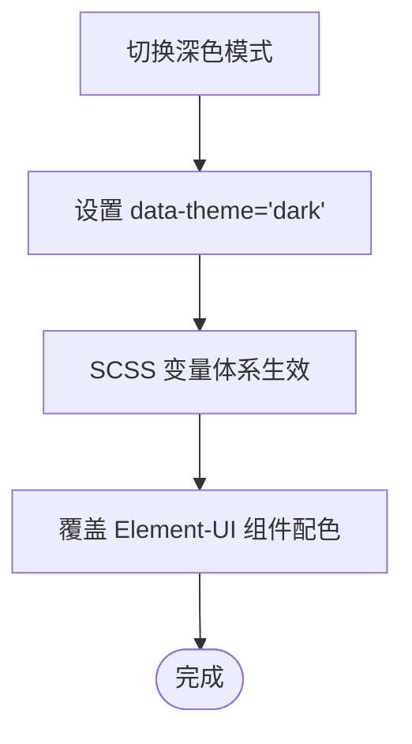
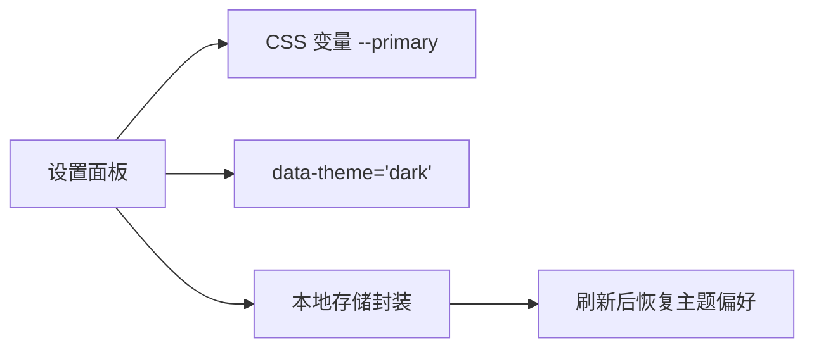
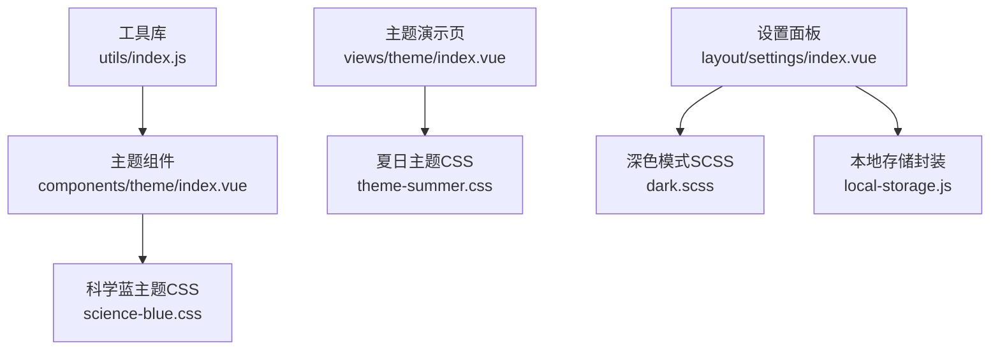

# 主题切换系统

<cite>
**本文引用的文件**
- [src/components/theme/index.vue](file://src/components/theme/index.vue)
- [src/views/theme/index.vue](file://src/views/theme/index.vue)
- [src/assets/custom-theme/science-blue.css](file://src/assets/custom-theme/science-blue.css)
- [src/assets/custom-theme/theme-summer.css](file://src/assets/custom-theme/theme-summer.css)
- [src/assets/style/dark.scss](file://src/assets/style/dark.scss)
- [src/assets/style/index.scss](file://src/assets/style/index.scss)
- [src/utils/index.js](file://src/utils/index.js)
- [src/common/local-storage.js](file://src/common/local-storage.js)
- [src/layout/settings/index.vue](file://src/layout/settings/index.vue)
- [src/store/modules/language.js](file://src/store/modules/language.js)
- [src/layout/index.vue](file://src/layout/index.vue)
</cite>

## 目录
1. [简介](#简介)
2. [项目结构](#项目结构)
3. [核心组件](#核心组件)
4. [架构总览](#架构总览)
5. [详细组件分析](#详细组件分析)
6. [依赖关系分析](#依赖关系分析)
7. [性能考量](#性能考量)
8. [故障排查指南](#故障排查指南)
9. [结论](#结论)
10. [附录](#附录)

## 简介
本文件系统性梳理并说明本项目的主题切换体系，涵盖以下方面：
- CSS 变量系统与主题文件管理
- 动态样式应用与两类主题（科学蓝、夏日）的设计理念与视觉效果
- 触发机制、状态管理与持久化存储
- 自定义主题开发指南（颜色、字体、组件样式）
- 性能优化策略与用户体验设计
- 扩展方案与第三方主题集成方法
- 定制化开发建议

## 项目结构
主题系统由三层构成：
- 视图层：提供主题选择入口与演示页面
- 样式层：主题 CSS 文件与 SCSS 变量体系
- 状态层：全局设置面板与持久化存储

**图表来源**
- [src/components/theme/index.vue:1-42](file://src/components/theme/index.vue#L1-L42)
- [src/views/theme/index.vue:1-314](file://src/views/theme/index.vue#L1-L314)
- [src/assets/custom-theme/science-blue.css:1-49](file://src/assets/custom-theme/science-blue.css#L1-L49)
- [src/assets/custom-theme/theme-summer.css:1-800](file://src/assets/custom-theme/theme-summer.css#L1-L800)
- [src/assets/style/dark.scss:1-457](file://src/assets/style/dark.scss#L1-L457)
- [src/assets/style/index.scss:1-4](file://src/assets/style/index.scss#L1-L4)
- [src/layout/settings/index.vue:1-297](file://src/layout/settings/index.vue#L1-L297)
- [src/common/local-storage.js:1-41](file://src/common/local-storage.js#L1-L41)

**章节来源**
- [src/components/theme/index.vue:1-42](file://src/components/theme/index.vue#L1-L42)
- [src/views/theme/index.vue:1-314](file://src/views/theme/index.vue#L1-L314)
- [src/assets/custom-theme/science-blue.css:1-49](file://src/assets/custom-theme/science-blue.css#L1-L49)
- [src/assets/custom-theme/theme-summer.css:1-800](file://src/assets/custom-theme/theme-summer.css#L1-L800)
- [src/assets/style/dark.scss:1-457](file://src/assets/style/dark.scss#L1-L457)
- [src/assets/style/index.scss:1-4](file://src/assets/style/index.scss#L1-L4)
- [src/layout/settings/index.vue:1-297](file://src/layout/settings/index.vue#L1-L297)
- [src/common/local-storage.js:1-41](file://src/common/local-storage.js#L1-L41)

## 核心组件
- 组件级主题切换（科学蓝/默认）：通过向 document.body 添加/移除类名，驱动对应主题 CSS 生效。
- 页面级主题演示（夏日）：通过动态注入样式块，将 Element-UI 默认主题色映射到新色系。
- 深色模式：通过 CSS 变量与 data-theme 属性控制整体明暗风格。
- 设置面板：提供主色与深色模式开关，写入 CSS 变量与 data-theme。

**章节来源**
- [src/components/theme/index.vue:14-40](file://src/components/theme/index.vue#L14-L40)
- [src/views/theme/index.vue:109-268](file://src/views/theme/index.vue#L109-L268)
- [src/assets/style/dark.scss:4-456](file://src/assets/style/dark.scss#L4-L456)
- [src/layout/settings/index.vue:228-246](file://src/layout/settings/index.vue#L228-L246)

## 架构总览
主题切换的总体流程如下：
- 用户在设置面板或主题组件中选择主题
- 系统根据选择执行两类切换策略之一：
  - 类名切换：为 document.body 添加/移除主题类，加载/卸载对应主题 CSS
  - 动态样式注入：解析 Element-UI 默认主题色，生成色阶映射，替换页面中旧色
- 深色模式通过 data-theme 属性与 CSS 变量生效
- 状态持久化：将主题偏好写入本地存储，刷新后恢复

**图表来源**
- [src/layout/settings/index.vue:228-246](file://src/layout/settings/index.vue#L228-L246)
- [src/components/theme/index.vue:18-38](file://src/components/theme/index.vue#L18-L38)
- [src/views/theme/index.vue:136-192](file://src/views/theme/index.vue#L136-L192)
- [src/assets/style/dark.scss:4-456](file://src/assets/style/dark.scss#L4-L456)
- [src/assets/custom-theme/science-blue.css:1-49](file://src/assets/custom-theme/science-blue.css#L1-L49)
- [src/assets/custom-theme/theme-summer.css:1-800](file://src/assets/custom-theme/theme-summer.css#L1-L800)

## 详细组件分析

### 组件级主题切换（科学蓝/默认）
- 触发机制：点击下拉菜单项，调用 changeTheme(command)
- 切换逻辑：
  - command 为 default：移除 body 的科学蓝类
  - command 为 science-blue：添加 body 的科学蓝类
  - command 为 customize：提示前往左侧菜单“主题”页面进行自定义
- 样式应用：当 body 拥有科学蓝类时，加载并应用科学蓝主题 CSS

**图表来源**
- [src/components/theme/index.vue:18-38](file://src/components/theme/index.vue#L18-L38)

**章节来源**
- [src/components/theme/index.vue:14-40](file://src/components/theme/index.vue#L14-L40)
- [src/assets/custom-theme/science-blue.css:1-49](file://src/assets/custom-theme/science-blue.css#L1-L49)

### 页面级主题演示（夏日主题）
- 触发机制：设置模型切换至“夏日心情”，同时隐藏颜色选择器
- 动态样式应用：
  - 通过 getThemeCluster 将输入色转换为色阶数组
  - 以 updateStyle 将页面中旧色替换为新色
  - 若未缓存 Element-UI 默认主题文本，则远程获取并缓存
  - 为避免重复注入，仅在需要时创建/更新样式标签
- 样式文件：夏日主题 CSS 包含大量 Element-UI 组件的覆盖规则与字体图标定义

**图表来源**
- [src/views/theme/index.vue:136-192](file://src/views/theme/index.vue#L136-L192)
- [src/views/theme/index.vue:203-215](file://src/views/theme/index.vue#L203-L215)
- [src/views/theme/index.vue:222-266](file://src/views/theme/index.vue#L222-L266)
- [src/assets/custom-theme/theme-summer.css:1-800](file://src/assets/custom-theme/theme-summer.css#L1-L800)

**章节来源**
- [src/views/theme/index.vue:109-268](file://src/views/theme/index.vue#L109-L268)
- [src/assets/custom-theme/theme-summer.css:1-800](file://src/assets/custom-theme/theme-summer.css#L1-L800)

### 深色模式（CSS 变量体系）
- 设计理念：以 CSS 变量统一管理主色、背景、边框、文本等，集中维护便于切换
- 实现方式：
  - 在根元素 data-theme='dark' 的作用域下，定义多组变量
  - 通过 var(--xxx) 引用变量，覆盖 Element-UI 组件的默认配色
  - 通过设置面板切换 data-theme 属性，实现一键深色模式
- 适用范围：布局容器、菜单、表格、表单、卡片、分页、消息等

**图表来源**
- [src/assets/style/dark.scss:4-456](file://src/assets/style/dark.scss#L4-L456)
- [src/layout/settings/index.vue:239-246](file://src/layout/settings/index.vue#L239-L246)

**章节来源**
- [src/assets/style/dark.scss:1-457](file://src/assets/style/dark.scss#L1-L457)
- [src/layout/settings/index.vue:228-246](file://src/layout/settings/index.vue#L228-L246)

### 设置面板与持久化
- 设置面板提供主色选择与深色模式开关，分别写入 CSS 变量与 data-theme
- 语言模块提供语言切换能力，用于国际化场景下的主题体验一致性
- 本地存储封装提供键值安全命名空间，便于持久化主题偏好

**图表来源**
- [src/layout/settings/index.vue:228-246](file://src/layout/settings/index.vue#L228-L246)
- [src/store/modules/language.js:1-26](file://src/store/modules/language.js#L1-L26)
- [src/common/local-storage.js:13-39](file://src/common/local-storage.js#L13-L39)

**章节来源**
- [src/layout/settings/index.vue:1-297](file://src/layout/settings/index.vue#L1-L297)
- [src/store/modules/language.js:1-26](file://src/store/modules/language.js#L1-L26)
- [src/common/local-storage.js:1-41](file://src/common/local-storage.js#L1-L41)

## 依赖关系分析
- 组件依赖：
  - 主题组件依赖工具库的类名操作方法
  - 主题演示页依赖 Element-UI 默认主题文本（首次按需获取）
- 样式依赖：
  - 科学蓝主题 CSS 与夏日主题 CSS 分别通过类名与动态样式注入生效
  - 深色模式依赖 SCSS 变量体系与 data-theme 属性
- 状态依赖：
  - 设置面板通过 Vuex 动作写入主题配置
  - 本地存储封装提供跨会话持久化

**图表来源**
- [src/utils/index.js:75-99](file://src/utils/index.js#L75-L99)
- [src/components/theme/index.vue:16](file://src/components/theme/index.vue#L16)
- [src/views/theme/index.vue:111](file://src/views/theme/index.vue#L111)
- [src/assets/custom-theme/science-blue.css:1-49](file://src/assets/custom-theme/science-blue.css#L1-L49)
- [src/assets/custom-theme/theme-summer.css:1-800](file://src/assets/custom-theme/theme-summer.css#L1-L800)
- [src/assets/style/dark.scss:1-457](file://src/assets/style/dark.scss#L1-L457)
- [src/common/local-storage.js:1-41](file://src/common/local-storage.js#L1-L41)

**章节来源**
- [src/utils/index.js:75-99](file://src/utils/index.js#L75-L99)
- [src/components/theme/index.vue:14-40](file://src/components/theme/index.vue#L14-L40)
- [src/views/theme/index.vue:109-268](file://src/views/theme/index.vue#L109-L268)
- [src/assets/custom-theme/science-blue.css:1-49](file://src/assets/custom-theme/science-blue.css#L1-L49)
- [src/assets/custom-theme/theme-summer.css:1-800](file://src/assets/custom-theme/theme-summer.css#L1-L800)
- [src/assets/style/dark.scss:1-457](file://src/assets/style/dark.scss#L1-L457)
- [src/common/local-storage.js:1-41](file://src/common/local-storage.js#L1-L41)

## 性能考量
- 动态样式注入策略
  - 首次获取 Element-UI 默认主题文本后缓存，避免重复网络请求
  - 仅在必要时创建/更新样式标签，减少 DOM 操作
  - 通过过滤已有样式表，精准替换目标颜色，降低全量重绘成本
- 类名切换策略
  - 通过为 body 添加/移除类名，利用 CSS 选择器批量应用主题，开销低
  - 避免频繁创建/销毁样式节点，提升切换流畅度
- 深色模式
  - 使用 CSS 变量集中管理，减少逐组件覆盖的成本
  - data-theme 属性切换影响范围可控，避免全局重排

**章节来源**
- [src/views/theme/index.vue:170-178](file://src/views/theme/index.vue#L170-L178)
- [src/views/theme/index.vue:180-190](file://src/views/theme/index.vue#L180-L190)
- [src/components/theme/index.vue:20-28](file://src/components/theme/index.vue#L20-L28)
- [src/assets/style/dark.scss:4-456](file://src/assets/style/dark.scss#L4-L456)

## 故障排查指南
- 主题切换无效
  - 检查是否正确为 document.body 添加/移除主题类
  - 确认对应主题 CSS 已被加载
- 夏日主题颜色不生效
  - 确认已计算色阶映射并成功注入样式块
  - 检查是否存在旧样式表未被替换
- 深色模式异常
  - 确认 data-theme 属性已正确设置
  - 检查 CSS 变量是否被覆盖或拼写错误
- 刷新后主题丢失
  - 检查本地存储封装的键值命名空间是否一致
  - 确认刷新后初始化逻辑是否读取并应用持久化配置

**章节来源**
- [src/utils/index.js:75-99](file://src/utils/index.js#L75-L99)
- [src/views/theme/index.vue:136-192](file://src/views/theme/index.vue#L136-L192)
- [src/assets/style/dark.scss:4-456](file://src/assets/style/dark.scss#L4-L456)
- [src/common/local-storage.js:13-39](file://src/common/local-storage.js#L13-L39)

## 结论
本主题系统采用“类名切换 + 动态样式注入 + CSS 变量”的组合策略，兼顾灵活性与性能：
- 科学蓝与夏日主题分别通过类名与动态注入实现，满足不同场景需求
- 深色模式以 CSS 变量为核心，易于扩展与维护
- 设置面板与本地存储配合，保障用户体验与持久化一致性

## 附录

### 科学蓝主题设计理念与视觉效果
- 设计理念：科技感与专业感，强调深邃蓝色系贯穿导航、侧栏与标签页
- 视觉效果：
  - 顶部导航采用背景图片强化科技氛围
  - 侧边栏使用统一深蓝底色，菜单项悬停与激活态具备高对比度
  - 标签页激活态采用品牌亮色，增强可识别性

**章节来源**
- [src/assets/custom-theme/science-blue.css:1-49](file://src/assets/custom-theme/science-blue.css#L1-L49)

### 夏日主题设计理念与视觉效果
- 设计理念：清新与活力，强调明亮与自然的色彩搭配
- 视觉效果：
  - 大量 Element-UI 组件样式覆盖，确保整体风格统一
  - 字体图标资源内嵌，保证图标渲染一致性
  - 通过动态样式注入实现主色映射，适配不同主色选择

**章节来源**
- [src/assets/custom-theme/theme-summer.css:1-800](file://src/assets/custom-theme/theme-summer.css#L1-L800)
- [src/views/theme/index.vue:136-192](file://src/views/theme/index.vue#L136-L192)

### 自定义主题开发指南
- 颜色配置
  - 使用 CSS 变量集中管理主色与辅助色，便于统一替换
  - 对于 Element-UI 组件，优先通过变量覆盖而非硬编码颜色
- 字体设置
  - 将字体资源打包进主题 CSS，确保跨设备一致性
  - 如需动态字体，可通过 CSS 变量或媒体查询控制
- 组件样式定制
  - 以主题类包裹组件样式，避免全局污染
  - 为常用组件提供默认状态与交互态的配色规范
- 动态主题色
  - 参考夏日主题的色阶映射算法，生成浅色/深色梯度
  - 通过样式注入或 CSS 变量实现主色替换

**章节来源**
- [src/assets/style/dark.scss:4-456](file://src/assets/style/dark.scss#L4-L456)
- [src/views/theme/index.vue:222-266](file://src/views/theme/index.vue#L222-L266)
- [src/assets/custom-theme/theme-summer.css:1-800](file://src/assets/custom-theme/theme-summer.css#L1-L800)

### 主题切换的触发机制、状态管理与持久化
- 触发机制
  - 设置面板：主色与深色模式开关直接写入 CSS 变量与属性
  - 主题组件：类名切换驱动主题 CSS 生效
  - 主题演示页：模型切换与颜色选择联动动态样式注入
- 状态管理
  - 设置面板通过动作写入主题配置，供全局使用
  - 语言模块与主题解耦，避免相互干扰
- 持久化存储
  - 使用本地存储封装，以命名空间隔离主题偏好
  - 刷新后读取并应用持久化配置，保持一致性

**章节来源**
- [src/layout/settings/index.vue:228-246](file://src/layout/settings/index.vue#L228-L246)
- [src/components/theme/index.vue:18-38](file://src/components/theme/index.vue#L18-L38)
- [src/views/theme/index.vue:136-192](file://src/views/theme/index.vue#L136-L192)
- [src/store/modules/language.js:1-26](file://src/store/modules/language.js#L1-L26)
- [src/common/local-storage.js:13-39](file://src/common/local-storage.js#L13-L39)

### 性能优化策略与用户体验设计
- 性能优化
  - 避免全量替换样式，仅替换目标颜色
  - 缓存默认主题文本与样式标签，减少重复创建
  - 使用 CSS 变量集中管理，降低逐组件覆盖成本
- 用户体验
  - 提供即时反馈（颜色选择器、类名切换）
  - 保留默认主题与深色模式，满足不同使用场景
  - 提示用户前往主题页面进行更丰富的自定义

**章节来源**
- [src/views/theme/index.vue:170-178](file://src/views/theme/index.vue#L170-L178)
- [src/views/theme/index.vue:180-190](file://src/views/theme/index.vue#L180-L190)
- [src/assets/style/dark.scss:4-456](file://src/assets/style/dark.scss#L4-L456)

### 扩展方案与第三方主题集成
- 扩展方案
  - 新增主题：创建独立 CSS 文件，遵循类名命名规范
  - 动态主题：沿用夏日主题的色阶映射与样式注入策略
  - 深色模式：基于现有变量体系扩展更多变量与覆盖规则
- 第三方主题集成
  - 若引入外部 UI 组件库，优先采用 CSS 变量与 data-theme 方案
  - 对于不支持变量的主题，采用动态样式注入策略进行适配
  - 通过设置面板统一入口，避免分散配置

**章节来源**
- [src/assets/custom-theme/science-blue.css:1-49](file://src/assets/custom-theme/science-blue.css#L1-L49)
- [src/assets/custom-theme/theme-summer.css:1-800](file://src/assets/custom-theme/theme-summer.css#L1-L800)
- [src/assets/style/dark.scss:4-456](file://src/assets/style/dark.scss#L4-L456)

### 定制化开发建议
- 保持主题文件结构清晰，按组件维度组织样式
- 使用语义化类名与命名空间，避免冲突
- 对关键组件提供深色模式与浅色模式的双态覆盖
- 在设置面板中提供一键重置与默认恢复能力
- 对外发布主题时，提供最小可用示例与文档链接

**章节来源**
- [src/layout/settings/index.vue:296-303](file://src/layout/settings/index.vue#L296-L303)
- [src/assets/style/index.scss:1-4](file://src/assets/style/index.scss#L1-L4)