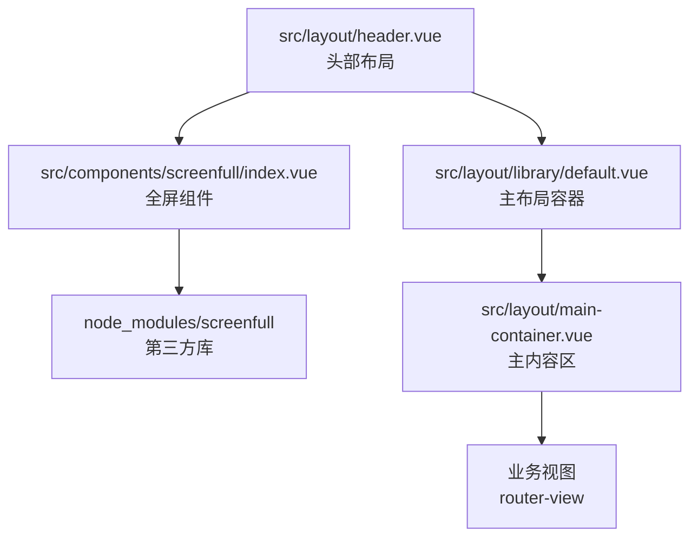
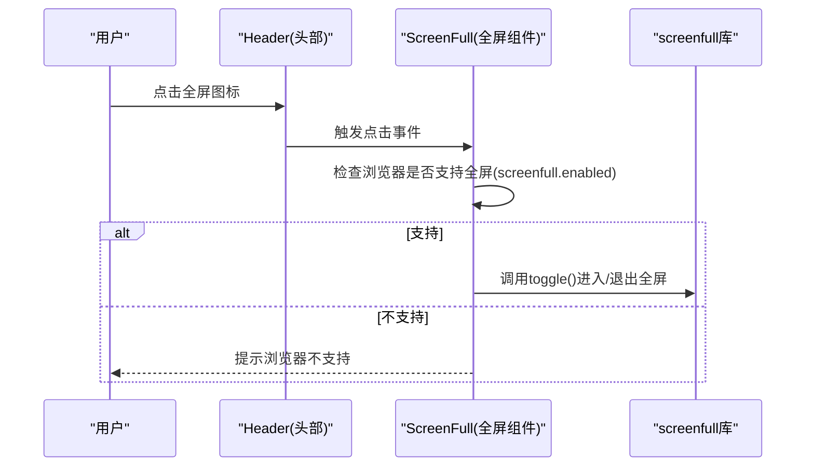
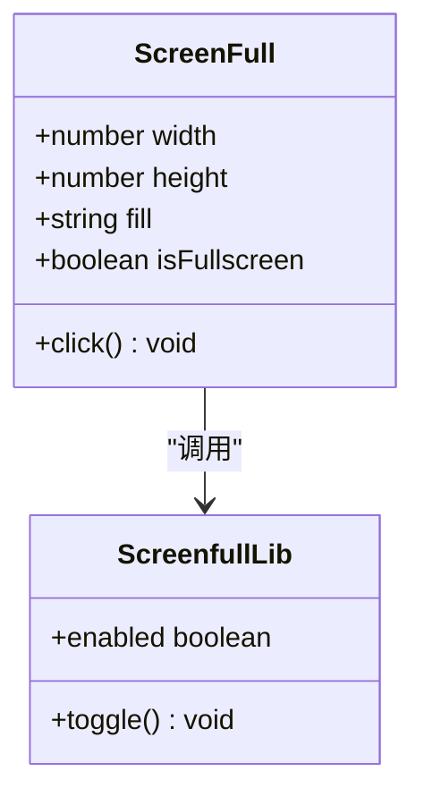
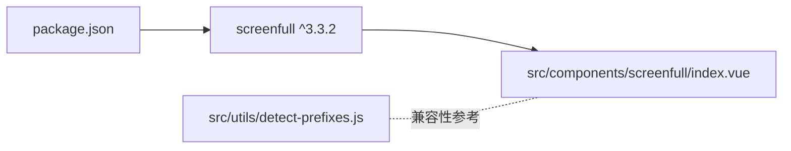
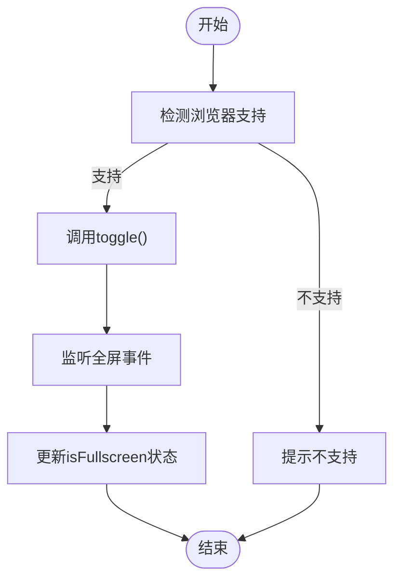

# 全屏显示功能

<cite>
**本文引用的文件**
- [src/components/screenfull/index.vue](file://src/components/screenfull/index.vue)
- [src/layout/header.vue](file://src/layout/header.vue)
- [src/layout/library/default.vue](file://src/layout/library/default.vue)
- [src/layout/library/default1.vue](file://src/layout/library/default1.vue)
- [src/layout/main-container.vue](file://src/layout/main-container.vue)
- [src/assets/style/base.scss](file://src/assets/style/base.scss)
- [src/utils/detect-prefixes.js](file://src/utils/detect-prefixes.js)
- [package.json](file://package.json)
- [README.md](file://README.md)
</cite>

## 目录
1. [简介](#简介)
2. [项目结构](#项目结构)
3. [核心组件](#核心组件)
4. [架构总览](#架构总览)
5. [详细组件分析](#详细组件分析)
6. [依赖关系分析](#依赖关系分析)
7. [性能考量](#性能考量)
8. [故障排查指南](#故障排查指南)
9. [结论](#结论)
10. [附录](#附录)

## 简介
本文件围绕“全屏显示功能”进行系统化说明，重点覆盖以下方面：
- 全屏切换的实现原理与Screenfull库集成
- 浏览器兼容性处理与事件监听
- 全屏状态检测、用户交互逻辑与样式适配
- 错误处理与降级策略
- 全屏状态的持久化管理与跨页面同步思路
- 扩展开发指南与自定义配置项

## 项目结构
全屏功能由一个独立的Vue组件封装，并在布局头部集成使用。整体结构清晰，职责分离明确。

图表来源
- [src/layout/header.vue:42](file://src/layout/header.vue#L42)
- [src/components/screenfull/index.vue:6](file://src/components/screenfull/index.vue#L6)
- [src/layout/library/default.vue:6](file://src/layout/library/default.vue#L6)
- [src/layout/main-container.vue:1](file://src/layout/main-container.vue#L1)

章节来源
- [src/layout/header.vue:42](file://src/layout/header.vue#L42)
- [src/components/screenfull/index.vue:6](file://src/components/screenfull/index.vue#L6)
- [src/layout/library/default.vue:6](file://src/layout/library/default.vue#L6)
- [src/layout/main-container.vue:1](file://src/layout/main-container.vue#L1)

## 核心组件
- 全屏组件（ScreenFull）：负责触发全屏切换、浏览器能力检测与消息提示。
- 布局头部（Header）：在顶部工具栏渲染全屏组件，提供入口。
- 主布局容器（Default/Default1）：承载滚动与内容区域，确保全屏后布局仍可滚动。
- 主内容区（MainContainer）：承载路由视图，配合滚动条组件保证内容可滚动。

章节来源
- [src/components/screenfull/index.vue:1-53](file://src/components/screenfull/index.vue#L1-L53)
- [src/layout/header.vue:42](file://src/layout/header.vue#L42)
- [src/layout/library/default.vue:6](file://src/layout/library/default.vue#L6)
- [src/layout/library/default1.vue:6](file://src/layout/library/default1.vue#L6)
- [src/layout/main-container.vue:1](file://src/layout/main-container.vue#L1)

## 架构总览
下图展示了从用户点击到全屏切换的关键调用链路与组件交互：

图表来源
- [src/layout/header.vue:42](file://src/layout/header.vue#L42)
- [src/components/screenfull/index.vue:29-38](file://src/components/screenfull/index.vue#L29-L38)

## 详细组件分析

### 全屏组件（ScreenFull）
- 功能职责
  - 渲染全屏图标，绑定点击事件
  - 使用screenfull库进行全屏切换
  - 在浏览器不支持时给出提示
- 关键点
  - 属性：width、height、fill（用于外部样式控制）
  - 数据：isFullscreen（当前是否处于全屏状态）
  - 方法：click()中进行能力检测与toggle()

图表来源
- [src/components/screenfull/index.vue:9-22](file://src/components/screenfull/index.vue#L9-L22)
- [src/components/screenfull/index.vue:23-39](file://src/components/screenfull/index.vue#L23-L39)

章节来源
- [src/components/screenfull/index.vue:1-53](file://src/components/screenfull/index.vue#L1-L53)

### 布局头部（Header）
- 集成位置：在头部右侧工具区渲染ScreenFull组件
- 作用：提供统一入口，便于用户快速切换全屏

章节来源
- [src/layout/header.vue:42](file://src/layout/header.vue#L42)

### 主布局容器（Default/Default1）
- Default：采用Element滚动容器包裹，内部包含Header、TabsView、MainContainer
- Default1：同样包含滚动容器与主内容区，提供不同布局变体
- 作用：在全屏状态下保持滚动条可用，避免内容溢出

章节来源
- [src/layout/library/default.vue:6](file://src/layout/library/default.vue#L6)
- [src/layout/library/default1.vue:6](file://src/layout/library/default1.vue#L6)

### 主内容区（MainContainer）
- 通过滚动条组件承载router-view，保证内容可滚动
- 高度计算考虑标签页开关，避免遮挡

章节来源
- [src/layout/main-container.vue:1](file://src/layout/main-container.vue#L1)

### 样式与主题适配
- 全局基础样式：定义了变量与滚动条样式，有助于在全屏前后保持一致的视觉体验
- 组件内样式：全屏图标样式与垂直对齐，确保在头部工具区中显示一致

章节来源
- [src/assets/style/base.scss:1-125](file://src/assets/style/base.scss#L1-L125)
- [src/components/screenfull/index.vue:43-52](file://src/components/screenfull/index.vue#L43-L52)

## 依赖关系分析
- 第三方库：screenfull
  - 版本：^3.3.2
  - 用途：提供跨浏览器的全屏API封装
- 工具函数：detect-prefixes.js
  - 用途：检测CSS前缀，辅助兼容性处理（与全屏无直接耦合，但体现兼容性意识）

图表来源
- [package.json:53](file://package.json#L53)
- [src/components/screenfull/index.vue:6](file://src/components/screenfull/index.vue#L6)
- [src/utils/detect-prefixes.js:8](file://src/utils/detect-prefixes.js#L8)

章节来源
- [package.json:53](file://package.json#L53)
- [src/utils/detect-prefixes.js:8](file://src/utils/detect-prefixes.js#L8)

## 性能考量
- 切换开销：全屏切换本身为浏览器原生行为，性能开销极低
- DOM更新：全屏切换可能触发布局重排，建议避免在切换期间进行大量DOM操作
- 滚动性能：主布局容器已使用滚动条组件，全屏后滚动性能稳定

## 故障排查指南
- 浏览器不支持全屏
  - 现象：点击全屏图标后弹出提示
  - 处理：检查浏览器版本与安全策略（如HTTPS要求）
- 全屏后内容不可滚动
  - 现象：全屏后无法滚动
  - 处理：确认主布局容器与主内容区的滚动条组件仍在工作
- 图标样式异常
  - 现象：图标尺寸或颜色不符合预期
  - 处理：通过组件属性width、height、fill进行调整；检查全局样式覆盖

章节来源
- [src/components/screenfull/index.vue:30-36](file://src/components/screenfull/index.vue#L30-L36)
- [src/layout/library/default.vue:61-85](file://src/layout/library/default.vue#L61-L85)
- [src/layout/main-container.vue:1](file://src/layout/main-container.vue#L1)

## 结论
该全屏功能以Screenfull为核心，结合布局组件实现简洁可靠的全屏切换。组件具备基本的能力检测与提示机制，配合布局滚动条保障全屏后的可用性。若需进一步增强，可在现有基础上扩展事件监听、状态持久化与跨页面同步能力。

## 附录

### 全屏状态检测与事件监听（扩展建议）
- 当前实现仅在点击时切换，未监听全屏事件
- 建议新增：
  - 监听全屏状态变化事件，更新isFullscreen状态
  - 在进入/退出全屏时执行回调（如刷新图表、调整布局）

（概念性流程，无需图表来源）

### 全屏状态持久化与跨页面同步（扩展建议）
- 当前组件未保存全屏状态
- 建议：
  - 将全屏状态写入会话存储（如sessionStorage），页面加载时读取并恢复
  - 在路由切换时同步状态，避免跨页面状态不一致

（概念性说明，无需章节来源）

### 自定义配置与扩展开发指南
- 组件属性扩展
  - 当前：width、height、fill
  - 建议：增加图标类名、提示文案、事件回调钩子
- 主题适配
  - 通过全局SCSS变量与组件属性组合，实现多主题下的图标一致性
- 兼容性处理
  - 参考工具函数中的前缀检测思路，为需要的场景补充前缀处理

章节来源
- [src/components/screenfull/index.vue:9-22](file://src/components/screenfull/index.vue#L9-L22)
- [src/assets/style/base.scss:1-125](file://src/assets/style/base.scss#L1-L125)
- [src/utils/detect-prefixes.js:8](file://src/utils/detect-prefixes.js#L8)

### 安装与使用注意事项
- 依赖安装：screenfull ^3.3.2
- 注意事项：README中强调了版本与安装方式，避免使用最新版导致API差异

章节来源
- [README.md:165-167](file://README.md#L165-L167)
- [package.json:53](file://package.json#L53)