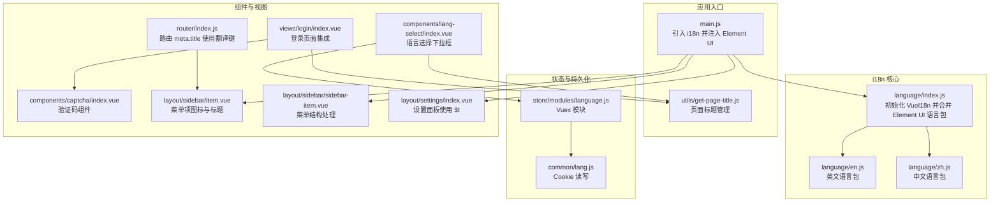
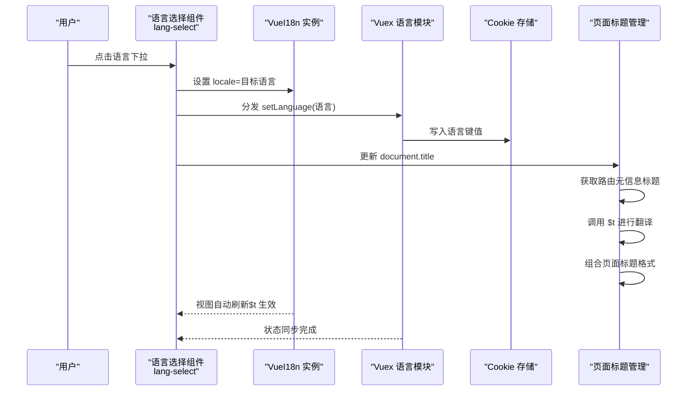
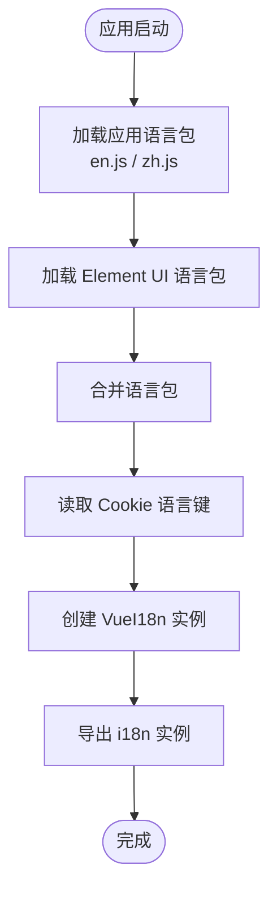
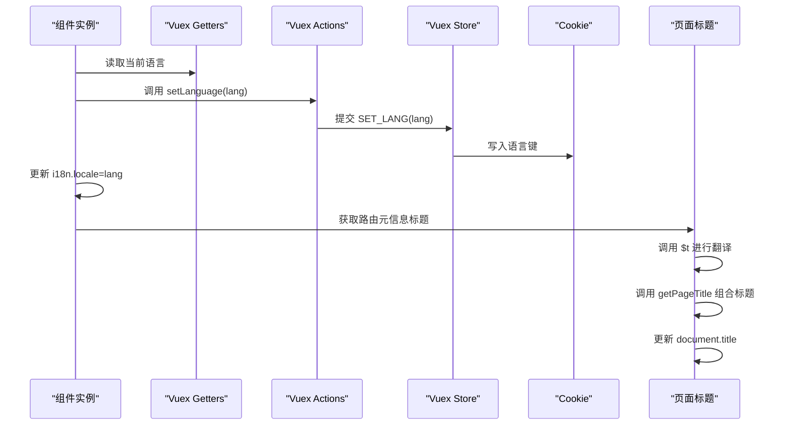
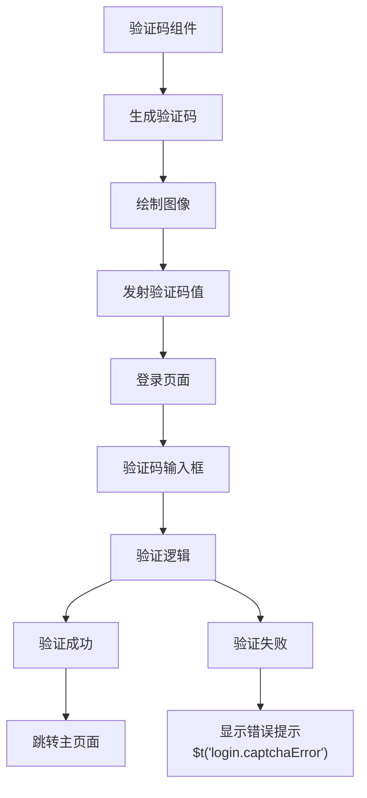
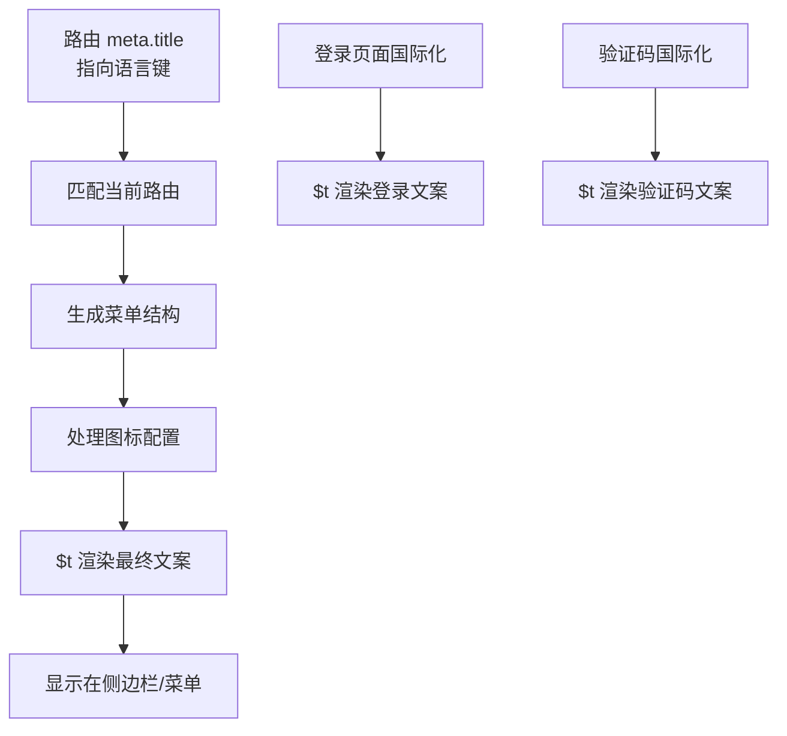
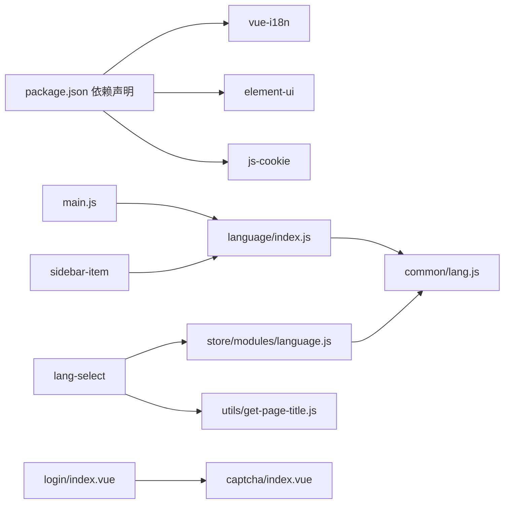

# 多语言国际化

<cite>
**本文引用的文件**
- [src/language/index.js](file://src/language/index.js)
- [src/language/en.js](file://src/language/en.js)
- [src/language/zh.js](file://src/language/zh.js)
- [src/components/lang-select/index.vue](file://src/components/lang-select/index.vue)
- [src/components/captcha/index.vue](file://src/components/captcha/index.vue)
- [src/store/modules/language.js](file://src/store/modules/language.js)
- [src/common/lang.js](file://src/common/lang.js)
- [src/main.js](file://src/main.js)
- [src/views/login/index.vue](file://src/views/login/index.vue)
- [src/layout/sidebar/item.vue](file://src/layout/sidebar/item.vue)
- [src/layout/sidebar/sidebar-item.vue](file://src/layout/sidebar/sidebar-item.vue)
- [src/layout/settings/index.vue](file://src/layout/settings/index.vue)
- [src/router/index.js](file://src/router/index.js)
- [src/utils/get-page-title.js](file://src/utils/get-page-title.js)
- [package.json](file://package.json)
</cite>

## 更新摘要
**所做更改**
- 新增验证码相关翻译键的详细说明，包括欢迎信息、副标题、品牌标语、验证码提示、错误消息和账户提示等
- 更新语言包中新增的8个验证码相关翻译键的组织结构
- 新增验证码组件与登录页面的国际化集成分析
- 更新语言选择组件的交互逻辑分析，包含验证码验证流程
- 完善路由元信息中图标配置的国际化支持

## 目录
1. [简介](#简介)
2. [项目结构](#项目结构)
3. [核心组件](#核心组件)
4. [架构总览](#架构总览)
5. [详细组件分析](#详细组件分析)
6. [依赖关系分析](#依赖关系分析)
7. [性能考量](#性能考量)
8. [故障排查指南](#故障排查指南)
9. [结论](#结论)
10. [附录](#附录)

## 简介
本文件系统性梳理本项目的多语言国际化（i18n）实现，涵盖语言包管理、动态语言切换、Element UI 国际化适配、语言选择组件设计与交互、语言数据组织与缺失翻译处理、页面标题管理增强、面包屑导航图标支持、验证码验证流程国际化、最佳实践与扩展开发策略，以及状态管理与持久化方案。目标是帮助开发者快速理解并高效维护与扩展多语言能力。

## 项目结构
围绕 i18n 的关键文件与模块分布如下：
- 语言包与适配
  - 语言包：src/language/en.js、src/language/zh.js
  - i18n 初始化与 Element UI 语言包合并：src/language/index.js
- 应用入口集成
  - main.js 中引入 i18n 并配置 Element UI 的 i18n 回调
- 语言选择组件
  - 组件：src/components/lang-select/index.vue
  - 状态管理：src/store/modules/language.js
  - 本地持久化：src/common/lang.js（基于 Cookie）
  - 页面标题管理：src/utils/get-page-title.js
- 验证码组件与登录页面
  - 验证码组件：src/components/captcha/index.vue
  - 登录页面：src/views/login/index.vue
- 菜单与图标国际化
  - 侧边栏菜单项：src/layout/sidebar/item.vue
  - 侧边栏菜单结构：src/layout/sidebar/sidebar-item.vue
- 使用场景
  - 设置抽屉使用 $t 渲染设置项标题与选项：src/layout/settings/index.vue
  - 路由 meta.title 使用翻译键：src/router/index.js

**图表来源**
- [src/main.js:22-40](file://src/main.js#L22-L40)
- [src/language/index.js:11-25](file://src/language/index.js#L11-L25)
- [src/components/lang-select/index.vue:22-30](file://src/components/lang-select/index.vue#L22-L30)
- [src/components/captcha/index.vue:1-117](file://src/components/captcha/index.vue#L1-L117)
- [src/views/login/index.vue:148-158](file://src/views/login/index.vue#L148-L158)
- [src/store/modules/language.js:1-26](file://src/store/modules/language.js#L1-L26)
- [src/common/lang.js:1-18](file://src/common/lang.js#L1-L18)
- [src/utils/get-page-title.js:1-9](file://src/utils/get-page-title.js#L1-L9)
- [src/layout/sidebar/item.vue:1-48](file://src/layout/sidebar/item.vue#L1-L48)
- [src/layout/sidebar/sidebar-item.vue:1-90](file://src/layout/sidebar/sidebar-item.vue#L1-L90)
- [src/layout/settings/index.vue:1-187](file://src/layout/settings/index.vue#L1-L187)
- [src/router/index.js:53-110](file://src/router/index.js#L53-L110)

**章节来源**
- [src/main.js:22-40](file://src/main.js#L22-L40)
- [src/language/index.js:11-25](file://src/language/index.js#L11-L25)
- [src/components/lang-select/index.vue:1-39](file://src/components/lang-select/index.vue#L1-L39)
- [src/components/captcha/index.vue:1-117](file://src/components/captcha/index.vue#L1-L117)
- [src/views/login/index.vue:148-158](file://src/views/login/index.vue#L148-L158)
- [src/store/modules/language.js:1-26](file://src/store/modules/language.js#L1-L26)
- [src/common/lang.js:1-18](file://src/common/lang.js#L1-L18)
- [src/utils/get-page-title.js:1-9](file://src/utils/get-page-title.js#L1-L9)
- [src/layout/sidebar/item.vue:1-48](file://src/layout/sidebar/item.vue#L1-L48)
- [src/layout/sidebar/sidebar-item.vue:1-90](file://src/layout/sidebar/sidebar-item.vue#L1-L90)
- [src/layout/settings/index.vue:1-187](file://src/layout/settings/index.vue#L1-L187)
- [src/router/index.js:53-110](file://src/router/index.js#L53-L110)

## 核心组件
- i18n 初始化与语言包合并
  - 通过 VueI18n 创建实例，初始语言取自 Cookie（若无则默认中文），并将 Element UI 的英文/中文语言包与应用语言包合并
- 语言选择组件
  - 下拉框提供中英切换，点击后同步更新 i18n.locale 与 Vuex 状态，并持久化到 Cookie
  - **新增**：语言切换时自动更新页面标题，确保浏览器标签页显示正确的翻译标题
- 验证码验证流程国际化
  - 验证码组件支持深色/浅色主题的动态颜色适配
  - 登录页面集成验证码输入、验证和错误提示的完整国际化流程
  - 包含8个新增的验证码相关翻译键：welcome、subtitle、brandSlogan、captcha、captchaPlaceholder、captchaError、captchaRefresh、accountTip
- 状态与持久化
  - Vuex 模块负责维护当前语言状态并写入 Cookie；读取时优先使用 Cookie，否则回退到默认值
- Element UI 适配
  - 在 ElementUI 插件注册时，通过 i18n 回调将 Element UI 的内部文案交由 VueI18n 管理，确保组件级文案随应用语言切换
- **新增**：面包屑导航图标支持
  - 侧边栏菜单项组件支持 SVG 图标和 Element UI 图标的混合使用
  - 图标前缀为 "svg-" 时使用 SVG 图标，否则使用 Element UI 内置图标
- 页面标题管理
  - 通过 get-page-title 工具函数统一管理页面标题格式
  - 支持动态更新页面标题，与路由元信息中的标题键关联

**章节来源**
- [src/language/index.js:11-25](file://src/language/index.js#L11-L25)
- [src/components/lang-select/index.vue:22-30](file://src/components/lang-select/index.vue#L22-L30)
- [src/components/captcha/index.vue:27-31](file://src/components/captcha/index.vue#L27-L31)
- [src/views/login/index.vue:187-195](file://src/views/login/index.vue#L187-L195)
- [src/store/modules/language.js:1-26](file://src/store/modules/language.js#L1-L26)
- [src/common/lang.js:1-18](file://src/common/lang.js#L1-L18)
- [src/main.js:36-40](file://src/main.js#L36-L40)
- [src/layout/sidebar/item.vue:21-30](file://src/layout/sidebar/item.vue#L21-L30)
- [src/utils/get-page-title.js:1-9](file://src/utils/get-page-title.js#L1-L9)

## 架构总览
整体流程：应用启动时加载 i18n 实例与语言包；用户在头部点击语言选择组件触发切换；组件更新 i18n.locale 并提交 Vuex 动作；Vuex 提交 mutation 写入 Cookie；同时更新页面标题；后续组件通过 $t 访问翻译键，Element UI 组件通过 i18n 回调获取对应语言文案。验证码流程中，登录页面通过 CaptchaCanvas 组件生成验证码，用户输入后进行验证，错误时显示相应的国际化提示信息。

**图表来源**
- [src/components/lang-select/index.vue:22-30](file://src/components/lang-select/index.vue#L22-L30)
- [src/store/modules/language.js:14-17](file://src/store/modules/language.js#L14-L17)
- [src/common/lang.js:9-11](file://src/common/lang.js#L9-L11)
- [src/utils/get-page-title.js:3-8](file://src/utils/get-page-title.js#L3-L8)

## 详细组件分析

### 语言包与初始化（language/index.js）
- 语言包合并策略
  - 将应用语言包（en/zh）与 Element UI 对应语言包进行浅合并，保证组件级文案与应用级文案统一由同一 i18n 实例管理
- 初始语言选择
  - 从 Cookie 读取语言键值，若不存在则默认中文
- 实例创建
  - 通过 VueI18n 构造函数创建实例并导出供应用使用

**图表来源**
- [src/language/index.js:11-25](file://src/language/index.js#L11-L25)

**章节来源**
- [src/language/index.js:11-25](file://src/language/index.js#L11-L25)

### Element UI 国际化适配（main.js）
- 注册 Element UI 插件时，通过 i18n 回调将内部文案交由 VueI18n.t 处理
- 使 Element UI 的对话框、分页、选择器等组件文案随应用语言切换

**章节来源**
- [src/main.js:36-40](file://src/main.js#L36-L40)

### 语言选择组件（components/lang-select/index.vue）
- 组件职责
  - 提供中英语言切换下拉框，禁用当前语言项，点击后同步更新 i18n.locale 与 Vuex 状态
- **更新**：交互逻辑增强
  - 通过 mapGetters 读取当前语言，通过 mapActions 调用 setLanguage 动作
  - handleSetLanguage 方法中先设置 i18n.locale，再提交 Vuex 动作，确保视图即时生效
  - **新增**：语言切换时自动更新页面标题，调用 getPageTitle 函数并传入翻译后的路由标题

**图表来源**
- [src/components/lang-select/index.vue:17-30](file://src/components/lang-select/index.vue#L17-L30)
- [src/store/modules/language.js:8-17](file://src/store/modules/language.js#L8-L17)
- [src/common/lang.js:9-11](file://src/common/lang.js#L9-L11)
- [src/utils/get-page-title.js:3-8](file://src/utils/get-page-title.js#L3-L8)

**章节来源**
- [src/components/lang-select/index.vue:1-39](file://src/components/lang-select/index.vue#L1-L39)
- [src/store/modules/language.js:1-26](file://src/store/modules/language.js#L1-L26)
- [src/common/lang.js:1-18](file://src/common/lang.js#L1-L18)

### 验证码组件与登录页面国际化（components/captcha/index.vue 与 views/login/index.vue）
- 验证码组件功能
  - 生成随机验证码字符序列，支持自定义长度
  - 动态绘制验证码图像，支持深色/浅色主题的颜色适配
  - 通过事件机制向父组件传递验证码值
- 登录页面集成
  - 集成验证码输入框和验证码显示区域
  - 实现验证码验证逻辑，包括必填验证和字符匹配验证
  - 错误时显示国际化提示信息，支持深色模式主题切换
- 翻译键支持
  - 支持8个新增的验证码相关翻译键：welcome、subtitle、brandSlogan、captcha、captchaPlaceholder、captchaError、captchaRefresh、accountTip
  - 登录表单标题、副标题、验证码提示、错误消息均通过 $t 进行国际化

**图表来源**
- [src/views/login/index.vue:148-158](file://src/views/login/index.vue#L148-L158)
- [src/views/login/index.vue:187-195](file://src/views/login/index.vue#L187-L195)
- [src/components/captcha/index.vue:36-47](file://src/components/captcha/index.vue#L36-L47)

**章节来源**
- [src/components/captcha/index.vue:1-117](file://src/components/captcha/index.vue#L1-L117)
- [src/views/login/index.vue:148-158](file://src/views/login/index.vue#L148-L158)
- [src/views/login/index.vue:187-195](file://src/views/login/index.vue#L187-L195)

### 状态管理与持久化（store/modules/language.js 与 common/lang.js）
- Vuex 模块
  - state 保存当前语言，默认从 Cookie 读取；mutations 写入新语言并调用 setLang
- Cookie 工具
  - getLang/setLang/removeLang 提供语言键的读写移除操作
- 生命周期
  - 应用启动时读取 Cookie 初始化语言；切换语言时写入 Cookie，确保刷新后仍保持

**章节来源**
- [src/store/modules/language.js:1-26](file://src/store/modules/language.js#L1-L26)
- [src/common/lang.js:1-18](file://src/common/lang.js#L1-L18)

### **新增**：页面标题管理增强（utils/get-page-title.js）
- 标题格式化
  - 默认使用环境变量 VUE_APP_TITLE 或 'Vue CMS' 作为基础标题
  - 支持动态标题与基础标题的组合格式："页面标题 - 基础标题"
- 集成应用
  - 在语言切换组件中调用，确保页面标题与当前语言和路由内容保持一致

**章节来源**
- [src/utils/get-page-title.js:1-9](file://src/utils/get-page-title.js#L1-L9)

### **新增**：面包屑导航图标支持（layout/sidebar/item.vue）
- 图标类型识别
  - 支持两种图标类型：SVG 图标和 Element UI 图标
  - 当 icon 属性以 "svg-" 开头时，使用 SVG 图标组件
  - 否则使用 Element UI 内置图标类名
- 国际化集成
  - 图标标题通过 $t 方法进行翻译，确保图标旁的文字也支持多语言
- 渲染优化
  - 使用函数式组件提高渲染性能
  - 通过作用域插槽传递图标和标题内容

**章节来源**
- [src/layout/sidebar/item.vue:1-48](file://src/layout/sidebar/item.vue#L1-L48)

### **新增**：菜单结构处理（layout/sidebar/sidebar-item.vue）
- 子路由处理逻辑
  - 支持多种菜单结构：单个子路由、多个子路由、始终显示子菜单等
  - 通过 getVisibleChildren 过滤隐藏的路由项
  - 动态生成菜单项和子菜单结构
- 图标集成
  - 在菜单项中集成图标组件，支持路由级别的图标配置
  - 通过 meta.icon 属性控制菜单图标显示

**章节来源**
- [src/layout/sidebar/sidebar-item.vue:1-90](file://src/layout/sidebar/sidebar-item.vue#L1-L90)

### 使用 $t 的组件与视图
- 设置面板
  - settings/index.vue 中大量使用 $t 渲染设置项标题、选项文案与占位符，保证设置界面的多语言一致性
- 路由 meta.title
  - router/index.js 中将路由 meta.title 设为语言键，配合 $t 实现菜单与面包屑文案动态切换
  - **更新**：路由配置中增加了丰富的图标支持，包括 SVG 图标和 Element UI 图标
- **新增**：登录页面国际化
  - login/index.vue 中使用 $t 渲染登录表单标题、副标题、字段提示、按钮文本等
  - 验证码相关文案完全支持国际化，包括验证码输入提示、错误提示和刷新提示

**图表来源**
- [src/layout/sidebar/item.vue:18-34](file://src/layout/sidebar/item.vue#L18-L34)
- [src/layout/sidebar/sidebar-item.vue:66-75](file://src/layout/sidebar/sidebar-item.vue#L66-L75)
- [src/router/index.js:53-110](file://src/router/index.js#L53-L110)
- [src/views/login/index.vue:121-122](file://src/views/login/index.vue#L121-L122)
- [src/views/login/index.vue:152-156](file://src/views/login/index.vue#L152-L156)

**章节来源**
- [src/layout/settings/index.vue:1-187](file://src/layout/settings/index.vue#L1-L187)
- [src/router/index.js:53-110](file://src/router/index.js#L53-L110)
- [src/views/login/index.vue:121-122](file://src/views/login/index.vue#L121-L122)
- [src/views/login/index.vue:152-156](file://src/views/login/index.vue#L152-L156)

## 依赖关系分析
- 外部依赖
  - vue-i18n：提供 i18n 能力与 $t 方法
  - element-ui：提供 UI 组件与语言包，需通过 i18n 回调接入
  - js-cookie：提供 Cookie 读写能力，用于语言键持久化
- 内部依赖
  - language/index.js 依赖 common/lang.js 读取初始语言
  - lang-select 依赖 store/modules/language.js 更新语言状态
  - **新增**：lang-select 依赖 utils/get-page-title.js 更新页面标题
  - **新增**：login/index.vue 依赖 captcha 组件进行验证码验证
  - main.js 依赖 language/index.js 并将 i18n 注入 Element UI
  - **新增**：sidebar-item 依赖 $t 方法进行图标标题翻译

**图表来源**
- [package.json:33-63](file://package.json#L33-L63)
- [src/main.js:22-40](file://src/main.js#L22-L40)
- [src/language/index.js:1-7](file://src/language/index.js#L1-L7)
- [src/common/lang.js:1-18](file://src/common/lang.js#L1-L18)
- [src/components/lang-select/index.vue:14-25](file://src/components/lang-select/index.vue#L14-L25)
- [src/store/modules/language.js:1](file://src/store/modules/language.js#L1)
- [src/utils/get-page-title.js:1-9](file://src/utils/get-page-title.js#L1-L9)
- [src/views/login/index.vue:176-185](file://src/views/login/index.vue#L176-L185)
- [src/layout/sidebar/item.vue:18-19](file://src/layout/sidebar/item.vue#L18-L19)

**章节来源**
- [package.json:33-63](file://package.json#L33-L63)
- [src/main.js:22-40](file://src/main.js#L22-L40)
- [src/language/index.js:1-7](file://src/language/index.js#L1-L7)
- [src/common/lang.js:1-18](file://src/common/lang.js#L1-L18)
- [src/components/lang-select/index.vue:14-25](file://src/components/lang-select/index.vue#L14-L25)
- [src/store/modules/language.js:1](file://src/store/modules/language.js#L1)
- [src/utils/get-page-title.js:1-9](file://src/utils/get-page-title.js#L1-L9)
- [src/views/login/index.vue:176-185](file://src/views/login/index.vue#L176-L185)
- [src/layout/sidebar/item.vue:18-19](file://src/layout/sidebar/item.vue#L18-L19)

## 性能考量
- 语言包合并
  - 合并英文与中文语言包后一次性注入 i18n，避免运行时重复拼装，减少内存与初始化开销
- 组件渲染
  - $t 访问为常量时间查找，Element UI 通过 i18n 回调统一处理，避免重复监听与额外计算
- 切换成本
  - 语言切换仅更新 i18n.locale 与 Cookie，组件通过响应式自动刷新，无额外昂贵操作
- **新增**：页面标题更新
  - 页面标题更新仅在语言切换时触发，通过路由元信息获取标题键，避免频繁更新
- **新增**：验证码组件性能
  - 验证码图像绘制使用 Canvas API，支持主题切换时的动态重绘
  - 验证码生成算法简单高效，避免不必要的计算开销
- **新增**：图标渲染优化
  - 侧边栏菜单项使用函数式组件，减少组件实例化开销
  - 图标类型判断在渲染时进行，避免额外的计算开销

## 故障排查指南
- 切换无效或刷新后失效
  - 检查 Cookie 语言键是否正确写入与读取
  - 确认 i18n.locale 是否被设置
  - 确认 Vuex 动作是否被分发
- 文案未生效
  - 确认语言键是否存在且拼写正确
  - 确认 $t 调用位置是否正确
  - 确认 Element UI 注入是否正确（main.js 中的 i18n 回调）
- **新增**：页面标题不更新
  - 检查路由元信息中是否正确设置了 title 键
  - 确认 get-page-title 函数是否正常工作
  - 验证语言切换时是否调用了页面标题更新逻辑
- **新增**：验证码相关问题
  - 检查验证码翻译键是否存在于语言包中
  - 确认验证码组件是否正确接收和处理验证码值
  - 验证登录页面的验证码验证逻辑是否正常工作
  - 检查深色模式切换时验证码图像是否正确重绘
- **新增**：图标显示异常
  - 检查路由配置中的 icon 属性格式是否正确
  - 确认 SVG 图标文件是否存在且名称正确
  - 验证 Element UI 图标类名是否有效

**章节来源**
- [src/common/lang.js:9-11](file://src/common/lang.js#L9-L11)
- [src/components/lang-select/index.vue:26-29](file://src/components/lang-select/index.vue#L26-L29)
- [src/store/modules/language.js:14-17](file://src/store/modules/language.js#L14-L17)
- [src/main.js:36-40](file://src/main.js#L36-L40)
- [src/utils/get-page-title.js:3-8](file://src/utils/get-page-title.js#L3-L8)
- [src/views/login/index.vue:187-195](file://src/views/login/index.vue#L187-L195)
- [src/components/captcha/index.vue:36-47](file://src/components/captcha/index.vue#L36-L47)
- [src/layout/sidebar/item.vue:21-30](file://src/layout/sidebar/item.vue#L21-L30)

## 结论
本项目采用"应用语言包 + Element UI 语言包"的统一合并策略，结合 Cookie 持久化与 Vuex 状态管理，实现了稳定、可维护的多语言体系。**最新改进包括**：页面标题管理增强确保浏览器标签页显示正确的翻译标题、语言切换时自动更新页面标题、面包屑导航图标支持、验证码验证流程国际化等新功能。语言选择组件交互简单明确，$t 与 Element UI i18n 回调覆盖了主要 UI 场景。新增的验证码系统支持完整的国际化流程，包括欢迎信息、副标题、品牌标语、验证码提示、错误消息和账户提示等8个翻译键。图标系统支持 SVG 和 Element UI 图标的混合使用，提升了界面的视觉效果。遵循本文最佳实践与扩展指南，可进一步提升翻译质量与维护效率。

## 附录

### 语言数据组织与翻译键管理
- 语言包结构
  - 采用分层命名空间组织（如 login、navbar、settings、route 等），便于定位与维护
  - 英文与中文语言包结构保持一致，键名一一对应
- **新增**：验证码相关翻译键
  - 位于 login 命名空间下，包含完整的验证码验证流程所需文案
  - 键名包括：welcome、subtitle、brandSlogan、captcha、captchaPlaceholder、captchaError、captchaRefresh、accountTip
  - 支持深色/浅色主题的验证码图像颜色适配
- 翻译键命名规范
  - 建议使用"模块.子模块.具体文案"层级命名，避免冲突
  - 保持键名语义化，便于非技术人员理解与校对
- 缺失翻译处理
  - 当前实现未显式配置回退语言或缺失键处理函数；建议在 i18n 实例中增加缺失键回退策略，以提升健壮性

**章节来源**
- [src/language/en.js:5-19](file://src/language/en.js#L5-L19)
- [src/language/zh.js:5-19](file://src/language/zh.js#L5-L19)
- [src/language/index.js:22-25](file://src/language/index.js#L22-L25)

### 动态语言切换与 Element UI 适配
- 切换流程
  - 组件设置 i18n.locale → 提交 Vuex 动作 → 写入 Cookie → 更新页面标题 → 组件响应式刷新
- Element UI 适配
  - 通过 main.js 中的 i18n 回调，将 Element UI 内部文案交由 VueI18n.t 处理，确保组件级文案与应用一致

**章节来源**
- [src/components/lang-select/index.vue:26-29](file://src/components/lang-select/index.vue#L26-L29)
- [src/main.js:36-40](file://src/main.js#L36-L40)

### **新增**：验证码验证流程国际化最佳实践
- 验证码组件设计
  - 支持深色/浅色主题的动态颜色适配，确保在不同主题下验证码的可读性
  - 通过事件机制向父组件传递验证码值，实现松耦合的数据流
- 登录页面集成
  - 集成完整的验证码验证流程，包括输入验证、字符匹配验证和错误处理
  - 错误时显示国际化提示信息，支持用户重新输入
- 翻译键组织
  - 验证码相关文案集中管理在 login 命名空间下
  - 支持多语言环境下验证码的完整用户体验

**章节来源**
- [src/components/captcha/index.vue:27-31](file://src/components/captcha/index.vue#L27-L31)
- [src/views/login/index.vue:148-158](file://src/views/login/index.vue#L148-L158)
- [src/views/login/index.vue:187-195](file://src/views/login/index.vue#L187-L195)

### **新增**：页面标题管理最佳实践
- 标题格式规范
  - 基础标题使用环境变量 VUE_APP_TITLE，确保部署时的一致性
  - 页面标题与基础标题通过" - "连接，符合浏览器标签页显示习惯
- 动态更新策略
  - 仅在语言切换和路由变化时更新页面标题
  - 通过路由元信息中的 title 键控制页面标题内容
  - 支持空标题场景，自动回退到基础标题

**章节来源**
- [src/utils/get-page-title.js:1-9](file://src/utils/get-page-title.js#L1-L9)

### **新增**：图标系统国际化指南
- 图标类型选择
  - SVG 图标适合复杂的矢量图形和品牌图标
  - Element UI 图标适合简单的功能图标和通用符号
- 路由配置建议
  - 使用 "svg-" 前缀标识 SVG 图标，如 "svg-home"
  - 不使用前缀的图标将自动映射到 Element UI 图标库
- 国际化考虑
  - 图标标题必须通过 $t 方法进行翻译，确保多语言支持
  - 图标选择应考虑不同文化的视觉含义和接受度

**章节来源**
- [src/layout/sidebar/item.vue:21-30](file://src/layout/sidebar/item.vue#L21-L30)
- [src/router/index.js:30-34](file://src/router/index.js#L30-L34)

### 最佳实践与扩展开发指南
- 键命名与上下文
  - 为易混淆键增加上下文后缀（如"button.save"、"dialog.confirm.ok"），提升准确性
  - **新增**：验证码相关键建议使用"captcha."前缀，如"captcha.placeholder"、"captcha.error"
- 复数形式处理
  - 对于需要复数的文案，建议在语言包中提供占位与规则映射，或在组件中按语言规则转换
- 扩展步骤
  - 新增语言：新增语言包文件并在 language/index.js 中合并
  - 新增组件：在组件中使用 $t 访问语言键，必要时在路由 meta.title 中使用语言键
  - 维护策略：建立翻译清单与评审流程，定期校对缺失与不一致项
- **新增**：验证码国际化
  - 为所有验证码相关文案提供对应的翻译键
  - 确保验证码组件支持主题切换时的正确颜色适配
  - 测试不同语言下的验证码验证流程
- **新增**：图标国际化
  - 为所有图标标题提供对应的翻译键
  - 确保 SVG 图标文件与路由配置正确匹配
  - 测试不同语言下的图标显示效果

**章节来源**
- [src/layout/sidebar/item.vue:18-34](file://src/layout/sidebar/item.vue#L18-L34)
- [src/router/index.js:30-34](file://src/router/index.js#L30-L34)
- [src/views/login/index.vue:187-195](file://src/views/login/index.vue#L187-L195)
- [src/components/captcha/index.vue:36-47](file://src/components/captcha/index.vue#L36-L47)