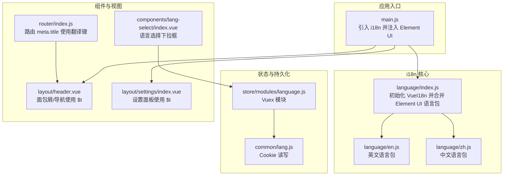
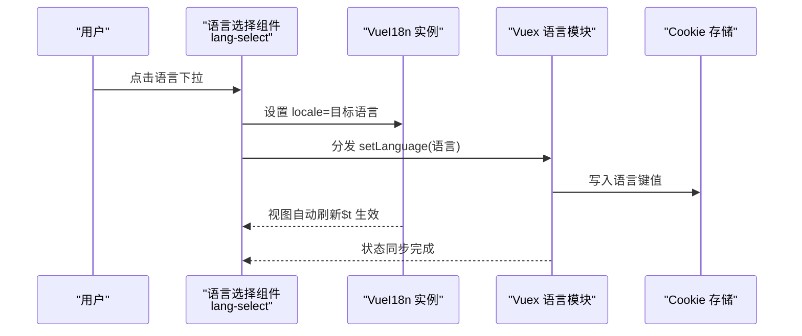
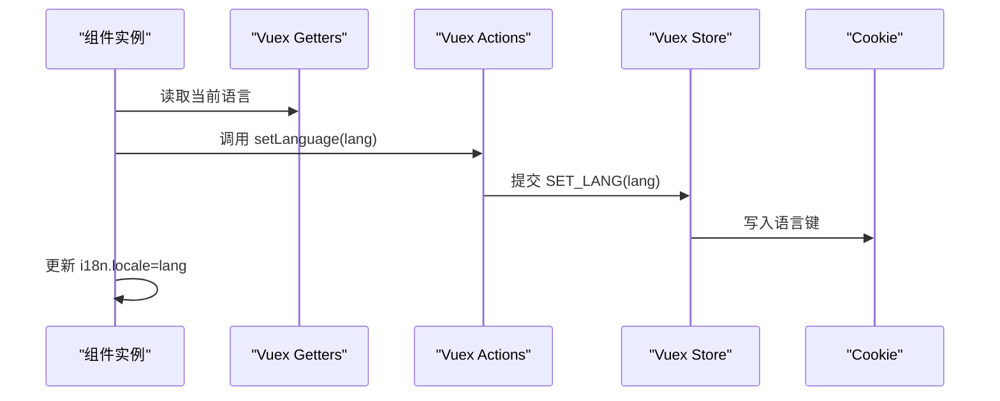
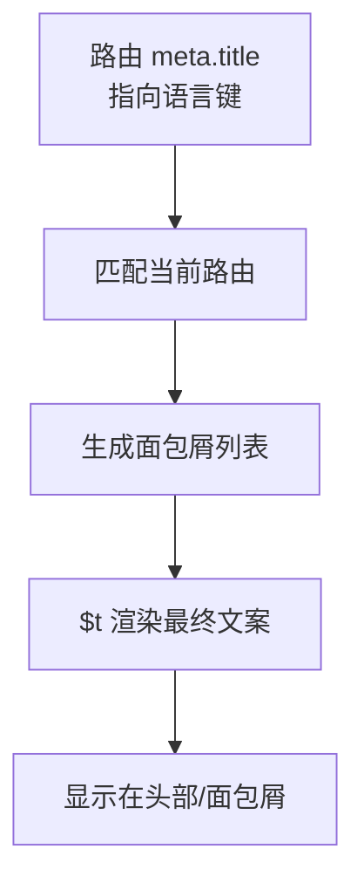
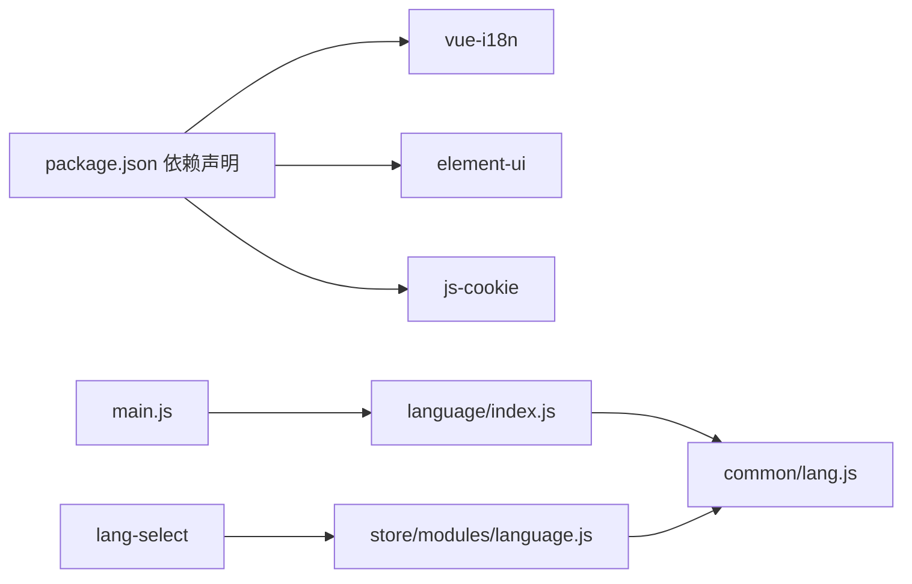

# 多语言国际化

<cite>
**本文引用的文件**
- [src/language/index.js](file://src/language/index.js)
- [src/language/en.js](file://src/language/en.js)
- [src/language/zh.js](file://src/language/zh.js)
- [src/components/lang-select/index.vue](file://src/components/lang-select/index.vue)
- [src/store/modules/language.js](file://src/store/modules/language.js)
- [src/common/lang.js](file://src/common/lang.js)
- [src/main.js](file://src/main.js)
- [src/layout/header.vue](file://src/layout/header.vue)
- [src/layout/settings/index.vue](file://src/layout/settings/index.vue)
- [src/router/index.js](file://src/router/index.js)
- [package.json](file://package.json)
</cite>

## 目录
1. [简介](#简介)
2. [项目结构](#项目结构)
3. [核心组件](#核心组件)
4. [架构总览](#架构总览)
5. [详细组件分析](#详细组件分析)
6. [依赖关系分析](#依赖关系分析)
7. [性能考量](#性能考量)
8. [故障排查指南](#故障排查指南)
9. [结论](#结论)
10. [附录](#附录)

## 简介
本文件系统性梳理本项目的多语言国际化（i18n）实现，涵盖语言包管理、动态语言切换、Element UI 国际化适配、语言选择组件设计与交互、语言数据组织与缺失翻译处理、最佳实践与扩展开发策略，以及状态管理与持久化方案。目标是帮助开发者快速理解并高效维护与扩展多语言能力。

## 项目结构
围绕 i18n 的关键文件与模块分布如下：
- 语言包与适配
  - 语言包：src/language/en.js、src/language/zh.js
  - i18n 初始化与 Element UI 适配：src/language/index.js
- 应用入口集成
  - main.js 中引入 i18n 并配置 Element UI 的 i18n 回调
- 语言选择组件
  - 组件：src/components/lang-select/index.vue
  - 状态管理：src/store/modules/language.js
  - 本地持久化：src/common/lang.js（基于 Cookie）
- 使用场景
  - 头部导航栏使用 $t 渲染多语言文案：src/layout/header.vue
  - 设置抽屉使用 $t 渲染设置项标题与选项：src/layout/settings/index.vue
  - 路由 meta.title 使用翻译键：src/router/index.js

**图表来源**
- [src/main.js:22-40](file://src/main.js#L22-L40)
- [src/language/index.js:11-25](file://src/language/index.js#L11-L25)
- [src/components/lang-select/index.vue:22-30](file://src/components/lang-select/index.vue#L22-L30)
- [src/store/modules/language.js:1-26](file://src/store/modules/language.js#L1-L26)
- [src/common/lang.js:1-18](file://src/common/lang.js#L1-L18)
- [src/layout/header.vue:18-66](file://src/layout/header.vue#L18-L66)
- [src/layout/settings/index.vue:1-187](file://src/layout/settings/index.vue#L1-L187)
- [src/router/index.js:53-110](file://src/router/index.js#L53-L110)

**章节来源**
- [src/main.js:22-40](file://src/main.js#L22-L40)
- [src/language/index.js:11-25](file://src/language/index.js#L11-L25)
- [src/components/lang-select/index.vue:1-39](file://src/components/lang-select/index.vue#L1-L39)
- [src/store/modules/language.js:1-26](file://src/store/modules/language.js#L1-L26)
- [src/common/lang.js:1-18](file://src/common/lang.js#L1-L18)
- [src/layout/header.vue:18-66](file://src/layout/header.vue#L18-L66)
- [src/layout/settings/index.vue:1-187](file://src/layout/settings/index.vue#L1-L187)
- [src/router/index.js:53-110](file://src/router/index.js#L53-L110)

## 核心组件
- i18n 初始化与语言包合并
  - 通过 VueI18n 创建实例，初始语言取自 Cookie（若无则默认中文），并将 Element UI 的英文/中文语言包与应用语言包合并
- 语言选择组件
  - 下拉框提供中英切换，点击后同步更新 i18n.locale 与 Vuex 状态，并持久化到 Cookie
- 状态与持久化
  - Vuex 模块负责维护当前语言状态并写入 Cookie；读取时优先使用 Cookie，否则回退到默认值
- Element UI 适配
  - 在 ElementUI 插件注册时，通过 i18n 回调将 Element UI 的内部文案交由 VueI18n 管理，确保组件级文案随应用语言切换

**章节来源**
- [src/language/index.js:11-25](file://src/language/index.js#L11-L25)
- [src/components/lang-select/index.vue:22-30](file://src/components/lang-select/index.vue#L22-L30)
- [src/store/modules/language.js:1-26](file://src/store/modules/language.js#L1-L26)
- [src/common/lang.js:1-18](file://src/common/lang.js#L1-L18)
- [src/main.js:36-40](file://src/main.js#L36-L40)

## 架构总览
整体流程：应用启动时加载 i18n 实例与语言包；用户在头部点击语言选择组件触发切换；组件更新 i18n.locale 并提交 Vuex 动作；Vuex 提交 mutation 写入 Cookie；后续组件通过 $t 访问翻译键，Element UI 组件通过 i18n 回调获取对应语言文案。

**图表来源**
- [src/components/lang-select/index.vue:22-30](file://src/components/lang-select/index.vue#L22-L30)
- [src/store/modules/language.js:14-17](file://src/store/modules/language.js#L14-L17)
- [src/common/lang.js:9-11](file://src/common/lang.js#L9-L11)

## 详细组件分析

### 语言包与初始化（language/index.js）
- 语言包合并策略
  - 将应用语言包（en/zh）与 Element UI 对应语言包进行浅合并，保证组件级文案与应用级文案统一由同一 i18n 实例管理
- 初始语言选择
  - 从 Cookie 读取语言键值，若不存在则默认中文
- 实例创建
  - 通过 VueI18n 构造函数创建实例并导出供应用使用

**图表来源**
- [src/language/index.js:11-25](file://src/language/index.js#L11-L25)

**章节来源**
- [src/language/index.js:11-25](file://src/language/index.js#L11-L25)

### Element UI 国际化适配（main.js）
- 注册 Element UI 插件时，通过 i18n 回调将内部文案交由 VueI18n.t 处理
- 使 Element UI 的对话框、分页、选择器等组件文案随应用语言切换

**章节来源**
- [src/main.js:36-40](file://src/main.js#L36-L40)

### 语言选择组件（components/lang-select/index.vue）
- 组件职责
  - 提供中英语言切换下拉框，禁用当前语言项，点击后同步更新 i18n.locale 与 Vuex 状态
- 交互逻辑
  - 通过 mapGetters 读取当前语言，通过 mapActions 调用 setLanguage 动作
  - handleSetLanguage 方法中先设置 i18n.locale，再提交 Vuex 动作，确保视图即时生效

**图表来源**
- [src/components/lang-select/index.vue:17-30](file://src/components/lang-select/index.vue#L17-L30)
- [src/store/modules/language.js:8-17](file://src/store/modules/language.js#L8-L17)
- [src/common/lang.js:9-11](file://src/common/lang.js#L9-L11)

**章节来源**
- [src/components/lang-select/index.vue:1-39](file://src/components/lang-select/index.vue#L1-L39)
- [src/store/modules/language.js:1-26](file://src/store/modules/language.js#L1-L26)
- [src/common/lang.js:1-18](file://src/common/lang.js#L1-L18)

### 状态管理与持久化（store/modules/language.js 与 common/lang.js）
- Vuex 模块
  - state 保存当前语言，默认从 Cookie 读取；mutations 写入新语言并调用 setLang
- Cookie 工具
  - getLang/setLang/removeLang 提供语言键的读写移除操作
- 生命周期
  - 应用启动时读取 Cookie 初始化语言；切换语言时写入 Cookie，确保刷新后仍保持

**章节来源**
- [src/store/modules/language.js:1-26](file://src/store/modules/language.js#L1-L26)
- [src/common/lang.js:1-18](file://src/common/lang.js#L1-L18)

### 使用 $t 的组件与视图
- 面包屑与导航
  - header.vue 中通过 $t 渲染路由 meta.title 指向的语言键，实现面包屑与导航文案国际化
- 设置面板
  - settings/index.vue 中大量使用 $t 渲染设置项标题、选项文案与占位符，保证设置界面的多语言一致性
- 路由 meta.title
  - router/index.js 中将路由 meta.title 设为语言键，配合 $t 实现菜单与面包屑文案动态切换

**图表来源**
- [src/layout/header.vue:18-31](file://src/layout/header.vue#L18-L31)
- [src/layout/settings/index.vue:1-187](file://src/layout/settings/index.vue#L1-L187)
- [src/router/index.js:53-110](file://src/router/index.js#L53-L110)

**章节来源**
- [src/layout/header.vue:18-31](file://src/layout/header.vue#L18-L31)
- [src/layout/settings/index.vue:1-187](file://src/layout/settings/index.vue#L1-L187)
- [src/router/index.js:53-110](file://src/router/index.js#L53-L110)

## 依赖关系分析
- 外部依赖
  - vue-i18n：提供 i18n 能力与 $t 方法
  - element-ui：提供 UI 组件与语言包，需通过 i18n 回调接入
  - js-cookie：提供 Cookie 读写能力，用于语言键持久化
- 内部依赖
  - language/index.js 依赖 common/lang.js 读取初始语言
  - lang-select 依赖 store/modules/language.js 更新语言状态
  - main.js 依赖 language/index.js 并将 i18n 注入 Element UI

**图表来源**
- [package.json:33-63](file://package.json#L33-L63)
- [src/main.js:22-40](file://src/main.js#L22-L40)
- [src/language/index.js:1-7](file://src/language/index.js#L1-L7)
- [src/common/lang.js:1-18](file://src/common/lang.js#L1-L18)
- [src/components/lang-select/index.vue:14-25](file://src/components/lang-select/index.vue#L14-L25)
- [src/store/modules/language.js:1](file://src/store/modules/language.js#L1)

**章节来源**
- [package.json:33-63](file://package.json#L33-L63)
- [src/main.js:22-40](file://src/main.js#L22-L40)
- [src/language/index.js:1-7](file://src/language/index.js#L1-L7)
- [src/common/lang.js:1-18](file://src/common/lang.js#L1-L18)
- [src/components/lang-select/index.vue:14-25](file://src/components/lang-select/index.vue#L14-L25)
- [src/store/modules/language.js:1](file://src/store/modules/language.js#L1)

## 性能考量
- 语言包合并
  - 合并英文与中文语言包后一次性注入 i18n，避免运行时重复拼装，减少内存与初始化开销
- 组件渲染
  - $t 访问为常量时间查找，Element UI 通过 i18n 回调统一处理，避免重复监听与额外计算
- 切换成本
  - 语言切换仅更新 i18n.locale 与 Cookie，组件通过响应式自动刷新，无额外昂贵操作

[本节为通用指导，不涉及具体文件分析]

## 故障排查指南
- 切换无效或刷新后失效
  - 检查 Cookie 语言键是否正确写入与读取
  - 确认 i18n.locale 是否被设置
  - 确认 Vuex 动作是否被分发
- 文案未生效
  - 确认语言键是否存在且拼写正确
  - 确认 $t 调用位置是否正确
  - 确认 Element UI 注入是否正确（main.js 中的 i18n 回调）

**章节来源**
- [src/common/lang.js:9-11](file://src/common/lang.js#L9-L11)
- [src/components/lang-select/index.vue:26-29](file://src/components/lang-select/index.vue#L26-L29)
- [src/store/modules/language.js:14-17](file://src/store/modules/language.js#L14-L17)
- [src/main.js:36-40](file://src/main.js#L36-L40)

## 结论
本项目采用“应用语言包 + Element UI 语言包”的统一合并策略，结合 Cookie 持久化与 Vuex 状态管理，实现了稳定、可维护的多语言体系。语言选择组件交互简单明确，$t 与 Element UI i18n 回调覆盖了主要 UI 场景。遵循本文最佳实践与扩展指南，可进一步提升翻译质量与维护效率。

[本节为总结，不涉及具体文件分析]

## 附录

### 语言数据组织与翻译键管理
- 语言包结构
  - 采用分层命名空间组织（如 login、navbar、settings、route 等），便于定位与维护
  - 英文与中文语言包结构保持一致，键名一一对应
- 翻译键命名规范
  - 建议使用“模块.子模块.具体文案”层级命名，避免冲突
  - 保持键名语义化，便于非技术人员理解与校对
- 缺失翻译处理
  - 当前实现未显式配置回退语言或缺失键处理函数；建议在 i18n 实例中增加缺失键回退策略，以提升健壮性

**章节来源**
- [src/language/en.js:1-144](file://src/language/en.js#L1-L144)
- [src/language/zh.js:1-142](file://src/language/zh.js#L1-L142)
- [src/language/index.js:22-25](file://src/language/index.js#L22-L25)

### 动态语言切换与 Element UI 适配
- 切换流程
  - 组件设置 i18n.locale → 提交 Vuex 动作 → 写入 Cookie → 组件响应式刷新
- Element UI 适配
  - 通过 main.js 中的 i18n 回调，将 Element UI 内部文案交由 VueI18n.t 处理，确保组件级文案与应用一致

**章节来源**
- [src/components/lang-select/index.vue:26-29](file://src/components/lang-select/index.vue#L26-L29)
- [src/main.js:36-40](file://src/main.js#L36-L40)

### 最佳实践与扩展开发指南
- 键命名与上下文
  - 为易混淆键增加上下文后缀（如“button.save”、“dialog.confirm.ok”），提升准确性
- 复数形式处理
  - 对于需要复数的文案，建议在语言包中提供占位与规则映射，或在组件中按语言规则转换
- 扩展步骤
  - 新增语言：新增语言包文件并在 language/index.js 中合并
  - 新增组件：在组件中使用 $t 访问语言键，必要时在路由 meta.title 中使用语言键
  - 维护策略：建立翻译清单与评审流程，定期校对缺失与不一致项

[本节为通用指导，不涉及具体文件分析]