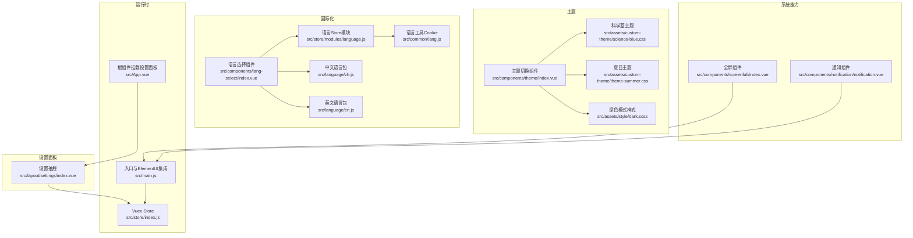
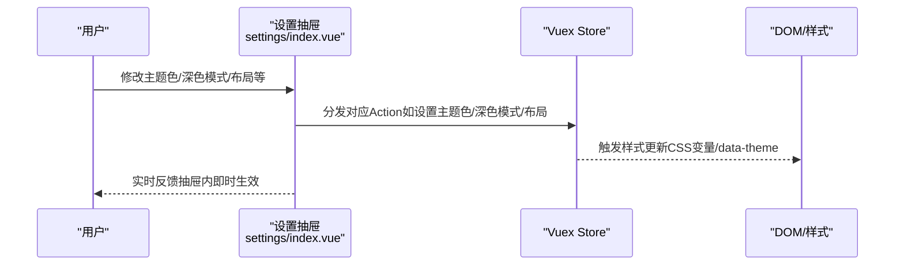
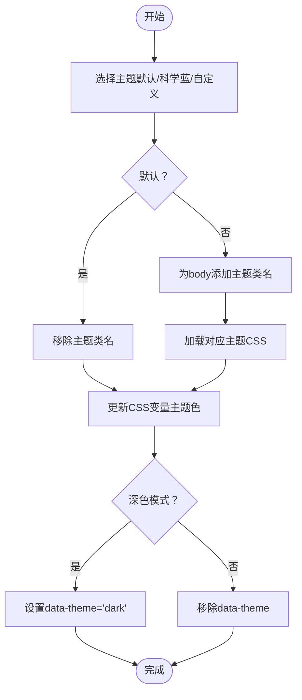
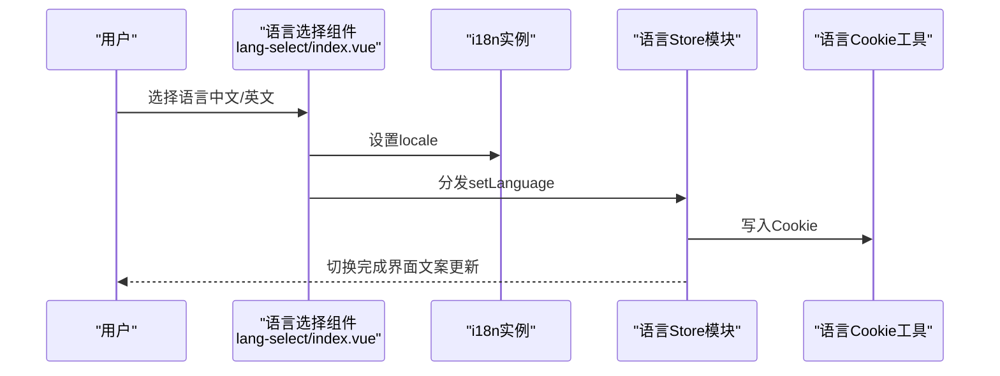
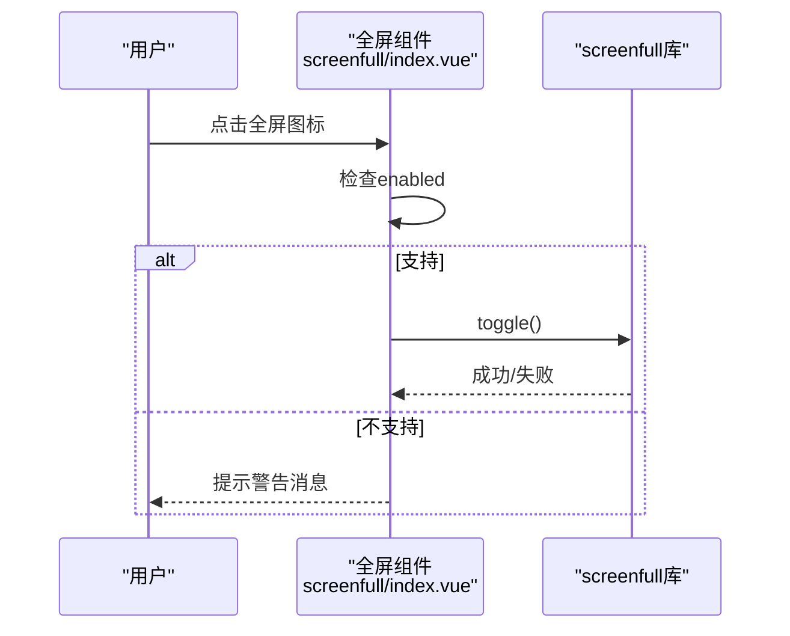
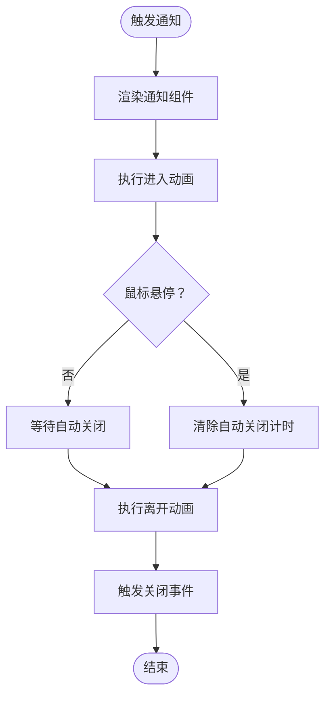
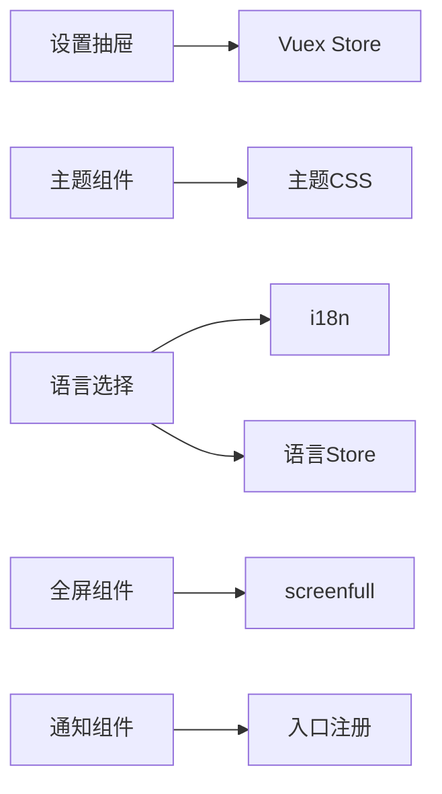

# 系统设置

<cite>
**本文引用的文件**   
- [src/layout/settings/index.vue](file://src/layout/settings/index.vue)
- [src/components/theme/index.vue](file://src/components/theme/index.vue)
- [src/assets/custom-theme/science-blue.css](file://src/assets/custom-theme/science-blue.css)
- [src/assets/custom-theme/theme-summer.css](file://src/assets/custom-theme/theme-summer.css)
- [src/assets/style/dark.scss](file://src/assets/style/dark.scss)
- [src/components/lang-select/index.vue](file://src/components/lang-select/index.vue)
- [src/store/modules/language.js](file://src/store/modules/language.js)
- [src/common/lang.js](file://src/common/lang.js)
- [src/language/zh.js](file://src/language/zh.js)
- [src/language/en.js](file://src/language/en.js)
- [src/components/screenfull/index.vue](file://src/components/screenfull/index.vue)
- [src/components/notification/notification.vue](file://src/components/notification/notification.vue)
- [src/main.js](file://src/main.js)
- [src/App.vue](file://src/App.vue)
- [src/store/index.js](file://src/store/index.js)
</cite>

## 目录
1. [简介](#简介)
2. [项目结构](#项目结构)
3. [核心组件](#核心组件)
4. [架构总览](#架构总览)
5. [详细组件分析](#详细组件分析)
6. [依赖关系分析](#依赖关系分析)
7. [性能考量](#性能考量)
8. [故障排查指南](#故障排查指南)
9. [结论](#结论)
10. [附录](#附录)

## 简介
本文件系统性梳理并说明本项目的“系统设置”能力，覆盖主题切换（含CSS变量与主题文件）、多语言切换（语言包与Element UI国际化）、全屏显示（浏览器兼容性）、通知系统（消息类型、显示位置与交互）以及设置项的持久化与用户偏好管理。文档面向开发者与产品/运营人员，既提供架构视图，也给出扩展与最佳实践建议。

## 项目结构
系统设置功能主要分布在以下模块：
- 设置抽屉面板：负责全局主题、界面布局、标签页、动画、布局样式等配置项的可视化控制与持久化。
- 主题切换组件：支持预设主题与自定义主题入口。
- 多语言选择组件：切换语言并写入持久化存储。
- 全屏组件：封装 screenfull 库，提供跨浏览器全屏能力。
- 通知组件：通用消息展示组件，支持动画与交互。
- Store 模块：集中管理语言与设置项状态。
- 全局样式：深色模式、主题样式文件。

图表来源
- [src/layout/settings/index.vue:1-512](file://src/layout/settings/index.vue#L1-L512)
- [src/components/theme/index.vue:1-42](file://src/components/theme/index.vue#L1-L42)
- [src/assets/style/dark.scss:1-457](file://src/assets/style/dark.scss#L1-L457)
- [src/assets/custom-theme/science-blue.css:1-49](file://src/assets/custom-theme/science-blue.css#L1-L49)
- [src/assets/custom-theme/theme-summer.css:1-800](file://src/assets/custom-theme/theme-summer.css#L1-L800)
- [src/components/lang-select/index.vue:1-39](file://src/components/lang-select/index.vue#L1-L39)
- [src/store/modules/language.js:1-26](file://src/store/modules/language.js#L1-L26)
- [src/common/lang.js:1-18](file://src/common/lang.js#L1-L18)
- [src/language/zh.js:1-142](file://src/language/zh.js#L1-L142)
- [src/language/en.js:1-144](file://src/language/en.js#L1-L144)
- [src/components/screenfull/index.vue:1-53](file://src/components/screenfull/index.vue#L1-L53)
- [src/components/notification/notification.vue:1-90](file://src/components/notification/notification.vue#L1-L90)
- [src/main.js:1-53](file://src/main.js#L1-L53)
- [src/App.vue:1-34](file://src/App.vue#L1-L34)
- [src/store/index.js:1-74](file://src/store/index.js#L1-L74)

章节来源
- [src/layout/settings/index.vue:1-512](file://src/layout/settings/index.vue#L1-L512)
- [src/components/theme/index.vue:1-42](file://src/components/theme/index.vue#L1-L42)
- [src/components/lang-select/index.vue:1-39](file://src/components/lang-select/index.vue#L1-L39)
- [src/components/screenfull/index.vue:1-53](file://src/components/screenfull/index.vue#L1-L53)
- [src/components/notification/notification.vue:1-90](file://src/components/notification/notification.vue#L1-L90)
- [src/store/modules/language.js:1-26](file://src/store/modules/language.js#L1-L26)
- [src/common/lang.js:1-18](file://src/common/lang.js#L1-L18)
- [src/language/zh.js:1-142](file://src/language/zh.js#L1-L142)
- [src/language/en.js:1-144](file://src/language/en.js#L1-L144)
- [src/assets/style/dark.scss:1-457](file://src/assets/style/dark.scss#L1-L457)
- [src/assets/custom-theme/science-blue.css:1-49](file://src/assets/custom-theme/science-blue.css#L1-L49)
- [src/assets/custom-theme/theme-summer.css:1-800](file://src/assets/custom-theme/theme-summer.css#L1-L800)
- [src/main.js:1-53](file://src/main.js#L1-L53)
- [src/App.vue:1-34](file://src/App.vue#L1-L34)
- [src/store/index.js:1-74](file://src/store/index.js#L1-L74)

## 核心组件
- 设置抽屉面板：提供主题色、深色模式、侧边栏折叠、菜单手风琴、面包屑、标签页、Logo/页脚、页面动画、布局样式等开关与选择，并支持一键恢复默认。
- 主题切换组件：提供“默认/科学蓝/自定义”主题入口，通过为 body 添加/移除类名实现主题切换；自定义入口引导到“主题”页面。
- 多语言选择组件：下拉切换语言，更新 i18n 与持久化存储。
- 全屏组件：基于 screenfull，检测浏览器支持并提供全屏/退出全屏能力。
- 通知组件：通用消息展示，支持进入/离开动画与关闭事件。
- Store 模块：集中管理语言与设置项状态，提供 getters 供全局使用。

章节来源
- [src/layout/settings/index.vue:1-512](file://src/layout/settings/index.vue#L1-L512)
- [src/components/theme/index.vue:1-42](file://src/components/theme/index.vue#L1-L42)
- [src/components/lang-select/index.vue:1-39](file://src/components/lang-select/index.vue#L1-L39)
- [src/components/screenfull/index.vue:1-53](file://src/components/screenfull/index.vue#L1-L53)
- [src/components/notification/notification.vue:1-90](file://src/components/notification/notification.vue#L1-L90)
- [src/store/modules/language.js:1-26](file://src/store/modules/language.js#L1-L26)
- [src/store/index.js:1-74](file://src/store/index.js#L1-L74)

## 架构总览
系统设置围绕“视图-状态-持久化”的三层结构展开：
- 视图层：设置抽屉、主题选择、语言选择、全屏、通知等组件。
- 状态层：Vuex Store 统一管理语言与设置项，提供 getters 供计算属性使用。
- 持久化层：语言使用 Cookie 存储；设置项通过组件动作写入 Store 并由 Store 决定是否持久化（如需持久化可在 Store 层扩展）。

图表来源
- [src/layout/settings/index.vue:190-305](file://src/layout/settings/index.vue#L190-L305)
- [src/store/index.js:24-73](file://src/store/index.js#L24-L73)

章节来源
- [src/layout/settings/index.vue:190-305](file://src/layout/settings/index.vue#L190-L305)
- [src/store/index.js:24-73](file://src/store/index.js#L24-L73)

## 详细组件分析

### 主题切换系统
- CSS变量驱动的主题色：设置抽屉监听主题色变更，动态设置 documentElement 的 CSS 变量，供全局样式按需引用。
- 深色模式：通过为 documentElement 设置或移除 data-theme 属性，配合深色样式文件实现暗色主题。
- 预设主题文件：通过为 body 添加/移除类名，加载对应主题样式文件（如科学蓝主题），实现快速主题切换。
- 自定义主题入口：主题组件提供“自定义”入口，引导用户到“主题”页面进行进一步操作。

图表来源
- [src/components/theme/index.vue:14-41](file://src/components/theme/index.vue#L14-L41)
- [src/assets/custom-theme/science-blue.css:1-49](file://src/assets/custom-theme/science-blue.css#L1-L49)
- [src/assets/custom-theme/theme-summer.css:1-800](file://src/assets/custom-theme/theme-summer.css#L1-L800)
- [src/layout/settings/index.vue:229-246](file://src/layout/settings/index.vue#L229-L246)
- [src/assets/style/dark.scss:1-457](file://src/assets/style/dark.scss#L1-L457)

章节来源
- [src/layout/settings/index.vue:229-246](file://src/layout/settings/index.vue#L229-L246)
- [src/components/theme/index.vue:14-41](file://src/components/theme/index.vue#L14-L41)
- [src/assets/style/dark.scss:1-457](file://src/assets/style/dark.scss#L1-L457)
- [src/assets/custom-theme/science-blue.css:1-49](file://src/assets/custom-theme/science-blue.css#L1-L49)
- [src/assets/custom-theme/theme-summer.css:1-800](file://src/assets/custom-theme/theme-summer.css#L1-L800)

### 多语言选择与国际化
- 语言选择组件：下拉切换语言，更新 i18n.locale 与 Store。
- 语言包：分别提供中文与英文语言包，键值覆盖设置面板文案、导航、路由等。
- 持久化：语言通过 Cookie 存储，刷新后仍保持上次选择。

图表来源
- [src/components/lang-select/index.vue:14-31](file://src/components/lang-select/index.vue#L14-L31)
- [src/store/modules/language.js:1-26](file://src/store/modules/language.js#L1-L26)
- [src/common/lang.js:1-18](file://src/common/lang.js#L1-L18)
- [src/language/zh.js:1-142](file://src/language/zh.js#L1-L142)
- [src/language/en.js:1-144](file://src/language/en.js#L1-L144)
- [src/main.js:22-40](file://src/main.js#L22-L40)

章节来源
- [src/components/lang-select/index.vue:14-31](file://src/components/lang-select/index.vue#L14-L31)
- [src/store/modules/language.js:1-26](file://src/store/modules/language.js#L1-L26)
- [src/common/lang.js:1-18](file://src/common/lang.js#L1-L18)
- [src/language/zh.js:1-142](file://src/language/zh.js#L1-L142)
- [src/language/en.js:1-144](file://src/language/en.js#L1-L144)
- [src/main.js:22-40](file://src/main.js#L22-L40)

### 全屏显示与浏览器兼容性
- 使用 screenfull 库封装全屏能力，提供 toggle 方法。
- 在点击前检查浏览器是否支持全屏，不支持时提示警告消息。
- 支持全屏/退出全屏，适用于桌面端主流浏览器。

图表来源
- [src/components/screenfull/index.vue:29-38](file://src/components/screenfull/index.vue#L29-L38)

章节来源
- [src/components/screenfull/index.vue:1-53](file://src/components/screenfull/index.vue#L1-L53)

### 通知系统
- 通知组件：提供内容、按钮、进入/离开动画等基础能力，支持关闭事件。
- 使用场景：主题组件在“自定义”入口未实现时，通过通知组件提示用户前往“主题”页面。
- 动画：基于 animate.css 类名，通过 props 控制进入/离开动画名称。

图表来源
- [src/components/notification/notification.vue:1-90](file://src/components/notification/notification.vue#L1-L90)
- [src/components/theme/index.vue:29-37](file://src/components/theme/index.vue#L29-L37)

章节来源
- [src/components/notification/notification.vue:1-90](file://src/components/notification/notification.vue#L1-L90)
- [src/components/theme/index.vue:29-37](file://src/components/theme/index.vue#L29-L37)

### 设置项持久化与用户偏好管理
- 语言偏好：通过 Cookie 记录，刷新后仍保持。
- 设置项：当前设置抽屉通过 Store 更新状态，未见显式的本地持久化逻辑；如需持久化，可在 Store 层扩展（如使用 localStorage 同步）。
- 入口挂载：根组件 App.vue 中挂载设置抽屉，确保全局可见。

章节来源
- [src/common/lang.js:1-18](file://src/common/lang.js#L1-L18)
- [src/store/modules/language.js:1-26](file://src/store/modules/language.js#L1-L26)
- [src/App.vue:1-34](file://src/App.vue#L1-L34)
- [src/layout/settings/index.vue:1-512](file://src/layout/settings/index.vue#L1-L512)

## 依赖关系分析
- 设置抽屉依赖 Vuex Store 提供的 getters 与 actions，实现主题色、深色模式、布局等实时切换。
- 主题组件依赖主题样式文件与工具类名切换。
- 语言组件依赖 i18n 与 Store，语言包提供翻译键值。
- 全屏组件依赖 screenfull 库。
- 通知组件在入口处注册为全局组件，便于各处调用。

图表来源
- [src/layout/settings/index.vue:190-305](file://src/layout/settings/index.vue#L190-L305)
- [src/components/theme/index.vue:14-41](file://src/components/theme/index.vue#L14-L41)
- [src/components/lang-select/index.vue:14-31](file://src/components/lang-select/index.vue#L14-L31)
- [src/components/screenfull/index.vue:6-38](file://src/components/screenfull/index.vue#L6-L38)
- [src/components/notification/notification.vue:1-90](file://src/components/notification/notification.vue#L1-L90)
- [src/main.js:28-42](file://src/main.js#L28-L42)

章节来源
- [src/layout/settings/index.vue:190-305](file://src/layout/settings/index.vue#L190-L305)
- [src/components/theme/index.vue:14-41](file://src/components/theme/index.vue#L14-L41)
- [src/components/lang-select/index.vue:14-31](file://src/components/lang-select/index.vue#L14-L31)
- [src/components/screenfull/index.vue:6-38](file://src/components/screenfull/index.vue#L6-L38)
- [src/components/notification/notification.vue:1-90](file://src/components/notification/notification.vue#L1-L90)
- [src/main.js:28-42](file://src/main.js#L28-L42)

## 性能考量
- 主题切换：CSS变量与类名切换开销极低，建议优先使用 CSS 变量与 data-theme 属性，减少重排重绘。
- 主题文件：预设主题文件较大时，可考虑按需加载或懒加载策略，避免首屏阻塞。
- 通知组件：动画使用 animate.css，注意在移动端的性能表现，必要时可禁用复杂动画。
- 全屏：仅在需要时调用，避免频繁切换造成页面抖动。

## 故障排查指南
- 全屏不可用：检查浏览器是否支持全屏，若不支持会提示警告消息。建议在移动端或受限环境下降级处理。
- 语言切换无效：确认 i18n 实例已正确初始化，且语言包键值存在；检查 Store 中语言状态是否更新。
- 深色模式不生效：确认 data-theme 属性设置与深色样式文件加载顺序正确。
- 主题文件未生效：确认主题类名已正确添加到 body，且对应主题 CSS 已加载。
- 通知不显示：确认已在入口注册通知组件，并正确传入内容与动画参数。

章节来源
- [src/components/screenfull/index.vue:29-38](file://src/components/screenfull/index.vue#L29-L38)
- [src/main.js:22-42](file://src/main.js#L22-L42)
- [src/assets/style/dark.scss:1-457](file://src/assets/style/dark.scss#L1-L457)
- [src/components/theme/index.vue:14-41](file://src/components/theme/index.vue#L14-L41)
- [src/components/notification/notification.vue:1-90](file://src/components/notification/notification.vue#L1-L90)

## 结论
本项目的系统设置功能以组件化与状态管理为核心，实现了主题切换、多语言、全屏与通知等常用系统级能力。通过 CSS 变量与主题文件的组合，提供了灵活的主题体验；通过 i18n 与 Store 的协同，保障了语言切换的一致性与持久化。建议在现有基础上扩展设置项的持久化能力，并对大体积主题文件采用按需加载策略，以进一步提升性能与用户体验。

## 附录
- 扩展开发指南
  - 新增设置项：在设置抽屉中添加开关/选择器，编写对应 action/mutation，更新 Store 与 DOM 状态。
  - 新增主题：新增主题 CSS 文件并在主题组件中注册入口，或通过 CSS 变量扩展。
  - 新增语言：在语言包中补充键值，并在语言选择组件中暴露选项。
  - 新增通知类型：在通知组件中扩展 props 与样式，或封装不同类型的快捷方法。
- 最佳实践
  - 将用户偏好的设置项纳入 Store 并考虑持久化，保证刷新后一致性。
  - 主题切换优先使用 CSS 变量与 data-theme，减少样式重算。
  - 对大文件采用懒加载与缓存策略，优化首屏性能。
  - 在移动端谨慎启用复杂动画，确保交互流畅。