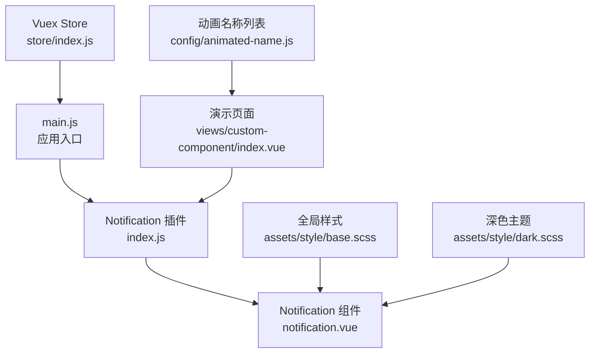
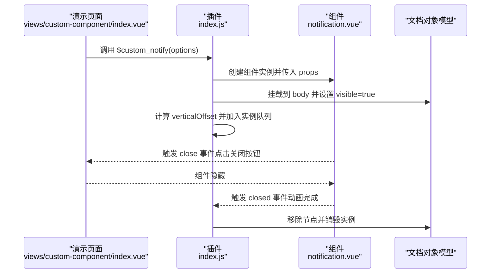
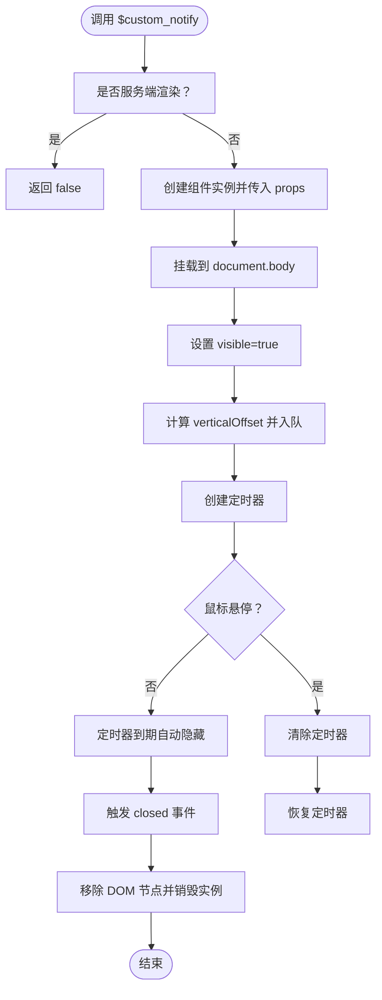
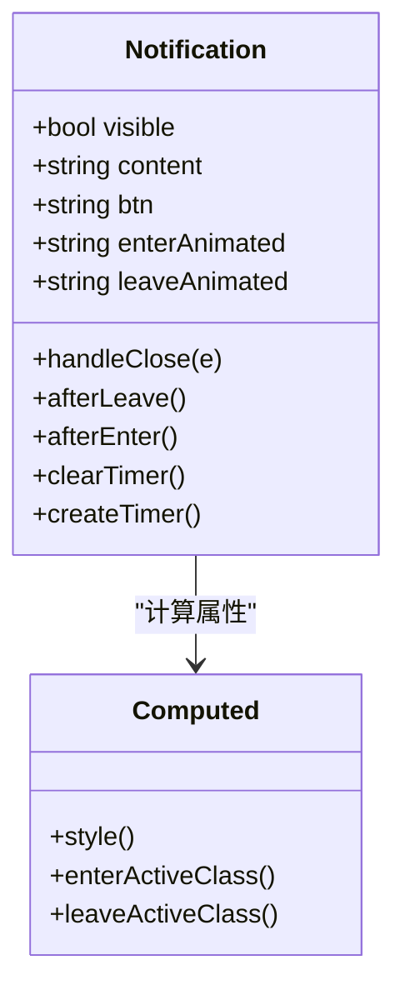
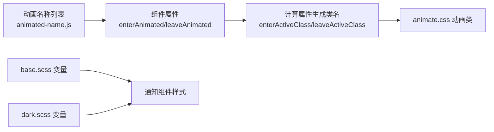
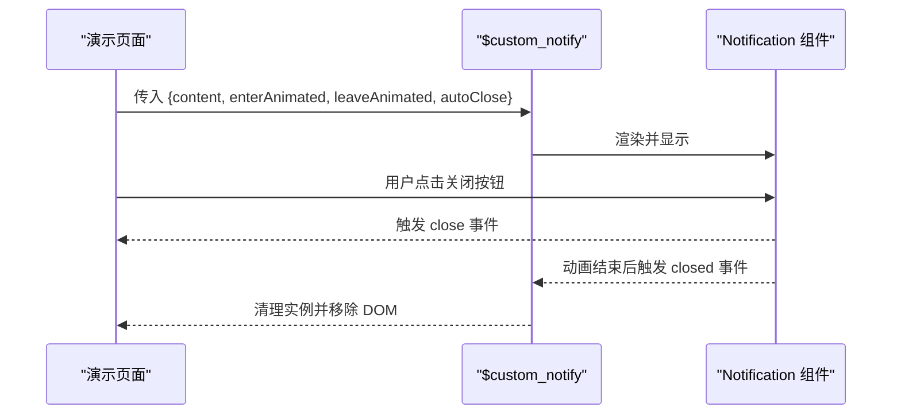
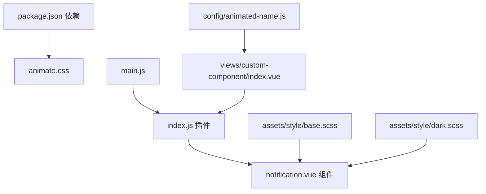

# 通知管理系统

<cite>
**本文档引用的文件**
- [src/components/notification/index.js](file://src/components/notification/index.js)
- [src/components/notification/notification.vue](file://src/components/notification/notification.vue)
- [src/components/notification/README.md](file://src/components/notification/README.md)
- [src/views/custom-component/index.vue](file://src/views/custom-component/index.vue)
- [src/config/animated-name.js](file://src/config/animated-name.js)
- [src/main.js](file://src/main.js)
- [src/assets/style/dark.scss](file://src/assets/style/dark.scss)
- [src/assets/style/base.scss](file://src/assets/style/base.scss)
- [src/store/index.js](file://src/store/index.js)
- [package.json](file://package.json)
</cite>

## 目录
1. [简介](#简介)
2. [项目结构](#项目结构)
3. [核心组件](#核心组件)
4. [架构总览](#架构总览)
5. [详细组件分析](#详细组件分析)
6. [依赖关系分析](#依赖关系分析)
7. [性能考虑](#性能考虑)
8. [故障排查指南](#故障排查指南)
9. [结论](#结论)
10. [附录](#附录)

## 简介
本通知管理系统基于 Vue 2.x 实现，提供两种使用方式：模板组件与 API 调用。系统支持消息内容展示、进入/离开动画、自动关闭计时器、鼠标悬停暂停、多条通知垂直堆叠布局、以及通过全局插件注册的方式在任意组件中调用。同时，系统具备良好的可扩展性，便于开发者自定义消息类型、动画效果与回调处理。

## 项目结构
通知系统位于 components/notification 目录，包含插件入口、组件实现与使用说明；演示页面位于 views/custom-component/index.vue；动画名称列表位于 config/animated-name.js；全局样式与主题适配位于 assets/style 下；插件在 main.js 中注册。

**图表来源**
- [src/main.js:28-42](file://src/main.js#L28-L42)
- [src/components/notification/index.js:115-118](file://src/components/notification/index.js#L115-L118)
- [src/components/notification/notification.vue:1-90](file://src/components/notification/notification.vue#L1-L90)
- [src/views/custom-component/index.vue:58-126](file://src/views/custom-component/index.vue#L58-L126)
- [src/config/animated-name.js:1-82](file://src/config/animated-name.js#L1-L82)
- [src/assets/style/base.scss:1-125](file://src/assets/style/base.scss#L1-L125)
- [src/assets/style/dark.scss:1-457](file://src/assets/style/dark.scss#L1-L457)
- [src/store/index.js:70-74](file://src/store/index.js#L70-L74)

**章节来源**
- [src/main.js:28-42](file://src/main.js#L28-L42)
- [src/components/notification/index.js:115-118](file://src/components/notification/index.js#L115-L118)
- [src/components/notification/notification.vue:1-90](file://src/components/notification/notification.vue#L1-L90)
- [src/views/custom-component/index.vue:58-126](file://src/views/custom-component/index.vue#L58-L126)
- [src/config/animated-name.js:1-82](file://src/config/animated-name.js#L1-L82)
- [src/assets/style/base.scss:1-125](file://src/assets/style/base.scss#L1-L125)
- [src/assets/style/dark.scss:1-457](file://src/assets/style/dark.scss#L1-L457)
- [src/store/index.js:70-74](file://src/store/index.js#L70-L74)

## 核心组件
- 插件入口：负责注册组件与全局方法，创建实例、挂载 DOM、维护垂直偏移与计时器，并在关闭时清理资源。
- 组件：负责渲染通知内容、绑定动画类名、处理关闭事件与生命周期钩子。
- 动画配置：通过外部提供的动画名称数组进行选择，结合 animate.css 提供的类名实现入场/离场动画。
- 演示页面：展示如何以 API 方式触发通知、如何控制动画、以及如何避免多条通知叠加的策略。

**章节来源**
- [src/components/notification/index.js:4-47](file://src/components/notification/index.js#L4-L47)
- [src/components/notification/notification.vue:10-59](file://src/components/notification/notification.vue#L10-L59)
- [src/config/animated-name.js:1-82](file://src/config/animated-name.js#L1-L82)
- [src/views/custom-component/index.vue:72-121](file://src/views/custom-component/index.vue#L72-L121)

## 架构总览
通知系统采用“插件 + 组件”的分层设计：
- 插件层：封装实例创建、DOM 挂载、队列管理与自动关闭逻辑。
- 组件层：专注 UI 渲染与动画表现，通过 props 接收内容与动画参数。
- 配置层：提供动画名称列表与全局样式，支撑主题适配。
- 应用层：在 main.js 注册插件，演示页面通过 this.$custom_notify 调用。

**图表来源**
- [src/views/custom-component/index.vue:81-86](file://src/views/custom-component/index.vue#L81-L86)
- [src/components/notification/index.js:74-113](file://src/components/notification/index.js#L74-L113)
- [src/components/notification/notification.vue:48-58](file://src/components/notification/notification.vue#L48-L58)

## 详细组件分析

### 插件入口（index.js）
- 实例创建与挂载
  - 使用 Vue.extend 扩展组件，接收外部 options 并拆解 autoClose，将其余属性作为 props 传递给组件。
  - 通过 $mount() 生成 DOM 节点但不指定挂载目标，随后手动 append 到 document.body。
- 队列管理与垂直偏移
  - 维护 instances 数组记录所有活动实例，计算 verticalOffset 使新通知从底部依次向上堆叠。
  - 删除实例时，根据被移除实例的高度与间距调整后续实例的 verticalOffset。
- 自动关闭与计时器
  - mounted 生命周期创建定时器，autoClose 为 0 或 false 时不自动关闭。
  - beforeDestroy 清理定时器，防止内存泄漏。
- 事件监听
  - 监听组件发出的 close 与 closed 事件，分别执行隐藏与清理流程。
- 全局注册
  - 注册组件与全局方法 $custom_notify，供任意组件调用。

**图表来源**
- [src/components/notification/index.js:74-113](file://src/components/notification/index.js#L74-L113)
- [src/components/notification/index.js:24-46](file://src/components/notification/index.js#L24-L46)

**章节来源**
- [src/components/notification/index.js:4-47](file://src/components/notification/index.js#L4-L47)
- [src/components/notification/index.js:49-72](file://src/components/notification/index.js#L49-L72)
- [src/components/notification/index.js:74-113](file://src/components/notification/index.js#L74-L113)

### 组件（notification.vue）
- 属性与行为
  - content：必填，支持 HTML 内容。
  - btn：可选，关闭按钮文本，默认“关闭”。
  - enterAnimated / leaveAnimated：可选，动画名称字符串，最终拼接为 animate.css 类名。
  - visible：内部控制显示状态。
- 动画与交互
  - 使用 transition 包裹，enter-active-class 与 leave-active-class 由计算属性动态生成。
  - 鼠标进入时清除定时器，离开时恢复定时器，实现悬停暂停。
  - 关闭按钮触发 close 事件，动画完成后触发 closed 事件。
- 样式与主题
  - 固定定位、固定宽高范围、圆角与阴影等基础样式。
  - 支持深色主题变量覆盖，配合 data-theme='dark' 生效。

**图表来源**
- [src/components/notification/notification.vue:10-59](file://src/components/notification/notification.vue#L10-L59)

**章节来源**
- [src/components/notification/notification.vue:10-59](file://src/components/notification/notification.vue#L10-L59)
- [src/assets/style/dark.scss:44-457](file://src/assets/style/dark.scss#L44-L457)

### 动画配置与主题适配
- 动画名称
  - 通过 config/animated-name.js 提供可用动画名称列表，组件将 enterAnimated/leaveAnimated 拼接为 animate.css 的类名。
- 主题适配
  - base.scss 定义全局 CSS 变量，dark.scss 在 [data-theme='dark'] 下覆盖颜色与边框变量，通知组件样式可随主题切换而改变。

**图表来源**
- [src/config/animated-name.js:1-82](file://src/config/animated-name.js#L1-L82)
- [src/components/notification/notification.vue:40-45](file://src/components/notification/notification.vue#L40-L45)
- [src/assets/style/base.scss:7-47](file://src/assets/style/base.scss#L7-L47)
- [src/assets/style/dark.scss:4-457](file://src/assets/style/dark.scss#L4-L457)

**章节来源**
- [src/config/animated-name.js:1-82](file://src/config/animated-name.js#L1-L82)
- [src/assets/style/base.scss:7-47](file://src/assets/style/base.scss#L7-L47)
- [src/assets/style/dark.scss:4-457](file://src/assets/style/dark.scss#L4-L457)

### 使用示例与交互行为
- 模板组件与 API 调用
  - README 与演示页面展示了两种调用方式：模板与 this.$custom_notify。
- 动画选择
  - 演示页面通过下拉框选择 enterAnimated 与 leaveAnimated，实时预览动画效果。
- 避免叠加
  - 演示页面提供了使用 Promise 与 setTimeout 的策略，确保通知按序出现而不叠加。

**图表来源**
- [src/views/custom-component/index.vue:72-86](file://src/views/custom-component/index.vue#L72-L86)
- [src/components/notification/index.js:102-111](file://src/components/notification/index.js#L102-L111)
- [src/components/notification/notification.vue:48-58](file://src/components/notification/notification.vue#L48-L58)

**章节来源**
- [src/components/notification/README.md:1-15](file://src/components/notification/README.md#L1-L15)
- [src/views/custom-component/index.vue:72-121](file://src/views/custom-component/index.vue#L72-L121)

## 依赖关系分析
- 外部依赖
  - animate.css：提供丰富的入场/离场动画类名。
  - element-ui：演示页面使用其表单与按钮组件，与通知系统无直接耦合。
- 内部依赖
  - main.js 注册 Notification 插件，使 $custom_notify 在全局可用。
  - views/custom-component/index.vue 作为使用示例，展示 API 调用与动画选择。
  - config/animated-name.js 为组件提供动画名称来源。
  - assets/style 下的样式文件为通知组件提供基础样式与主题变量。

**图表来源**
- [package.json:34-34](file://package.json#L34-L34)
- [src/main.js:28-42](file://src/main.js#L28-L42)
- [src/components/notification/index.js:115-118](file://src/components/notification/index.js#L115-L118)
- [src/components/notification/notification.vue:1-90](file://src/components/notification/notification.vue#L1-L90)
- [src/views/custom-component/index.vue:58-126](file://src/views/custom-component/index.vue#L58-L126)
- [src/config/animated-name.js:1-82](file://src/config/animated-name.js#L1-L82)
- [src/assets/style/base.scss:1-125](file://src/assets/style/base.scss#L1-L125)
- [src/assets/style/dark.scss:1-457](file://src/assets/style/dark.scss#L1-L457)

**章节来源**
- [package.json:34-34](file://package.json#L34-L34)
- [src/main.js:28-42](file://src/main.js#L28-L42)
- [src/components/notification/index.js:115-118](file://src/components/notification/index.js#L115-L118)
- [src/components/notification/notification.vue:1-90](file://src/components/notification/notification.vue#L1-L90)
- [src/views/custom-component/index.vue:58-126](file://src/views/custom-component/index.vue#L58-L126)
- [src/config/animated-name.js:1-82](file://src/config/animated-name.js#L1-L82)
- [src/assets/style/base.scss:1-125](file://src/assets/style/base.scss#L1-L125)
- [src/assets/style/dark.scss:1-457](file://src/assets/style/dark.scss#L1-L457)

## 性能考虑
- DOM 操作与内存管理
  - 仅在需要时创建与挂载 DOM，实例销毁时移除节点并释放引用，避免内存泄漏。
- 计时器管理
  - 每个实例独立计时器，进入与离开时分别清除与恢复，减少不必要的更新。
- 垂直偏移计算
  - 通过累加高度与固定间距计算 verticalOffset，避免复杂布局计算。
- 动画性能
  - 使用 animate.css 的硬件加速类名，配合 will-change 与 transform，保证流畅度。
- 队列与叠加
  - 通过实例队列与高度累加实现稳定堆叠，避免频繁重排。

[本节为通用性能建议，不直接分析具体文件]

## 故障排查指南
- 无法触发通知
  - 检查插件是否正确注册：确认 main.js 中已调用 Vue.use(Notification)。
  - 确认调用方式：模板组件或 this.$custom_notify 是否正确传入 content 等必要属性。
- 动画未生效
  - 确认 animate.css 已引入（main.js 中已引入），并检查 enterAnimated/leaveAnimated 是否为有效名称。
- 通知不自动消失
  - 检查 autoClose 参数是否为 0 或 false；若为 0，则不会自动关闭。
- 多条通知重叠
  - 按顺序使用 Promise 或 setTimeout 调用，避免在同一事件循环中连续触发导致叠加。
- 深色主题样式异常
  - 确认页面根元素存在 data-theme='dark' 属性，且 dark.scss 已加载。

**章节来源**
- [src/main.js:28-42](file://src/main.js#L28-L42)
- [src/components/notification/index.js:74-113](file://src/components/notification/index.js#L74-L113)
- [src/components/notification/notification.vue:40-45](file://src/components/notification/notification.vue#L40-L45)
- [src/views/custom-component/index.vue:88-121](file://src/views/custom-component/index.vue#L88-L121)
- [src/assets/style/dark.scss:4-457](file://src/assets/style/dark.scss#L4-L457)

## 结论
该通知管理系统以简洁的插件 + 组件架构实现了消息展示、动画控制与自动关闭等核心能力。通过全局注册与 API 调用，开发者可在任意组件中快速集成；通过动画名称配置与主题变量，系统具备良好的可定制性与可扩展性。建议在生产环境中关注计时器与 DOM 清理，确保内存与性能稳定。

[本节为总结性内容，不直接分析具体文件]

## 附录

### 扩展开发指南
- 自定义消息类型
  - 在组件中新增 props（如 type、icon、duration 等），并在样式中针对不同类型增加差异化样式。
- 自定义动画效果
  - 在 config/animated-name.js 中添加新的动画名称，并在组件中映射为 animate.css 类名。
- 回调处理
  - 在组件中新增事件（如 click、opened、closed），在插件中监听并暴露给调用方。
- 显示位置配置
  - 当前系统固定在右下角，可通过扩展组件的 style 计算属性与插件的 verticalOffset 计算逻辑，支持 top/bottom/left/right 多位置配置。
- 样式定制化与主题适配
  - 在 base.scss 中新增变量，在 dark.scss 中覆盖对应变量，组件样式中使用变量而非硬编码颜色。
- 队列管理与自动消失策略
  - 可扩展为支持优先级队列、最大显示数量限制、用户交互暂停与恢复等功能。
- 性能优化与内存管理
  - 对频繁触发的通知场景，建议使用防抖或节流；对大量通知，建议限制队列长度并及时销毁实例。

[本节为通用开发建议，不直接分析具体文件]