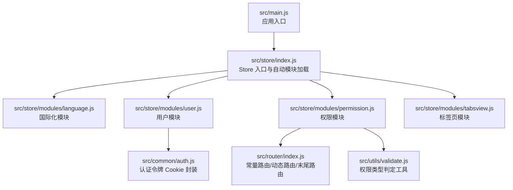
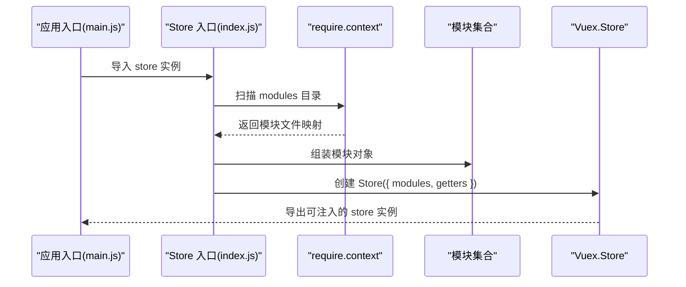
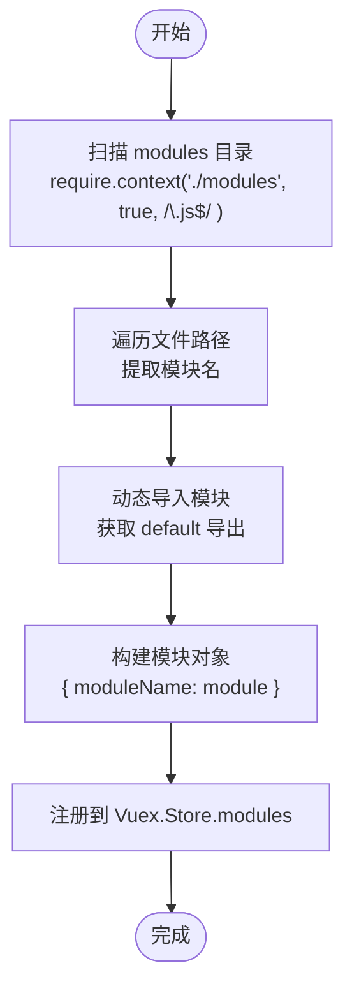
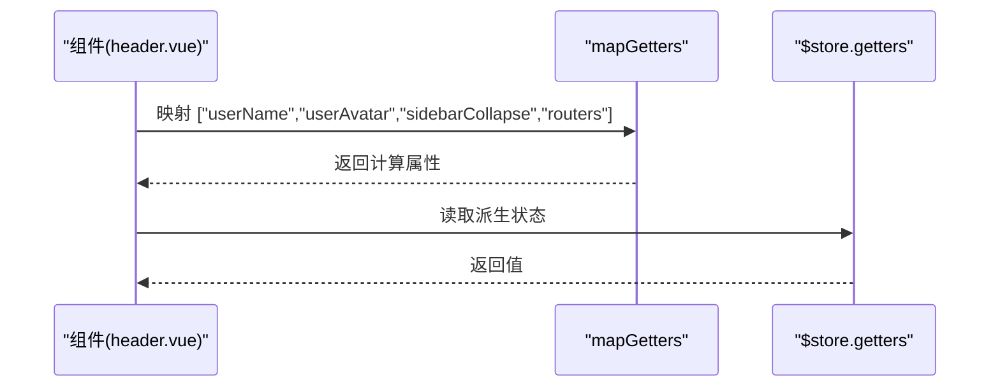
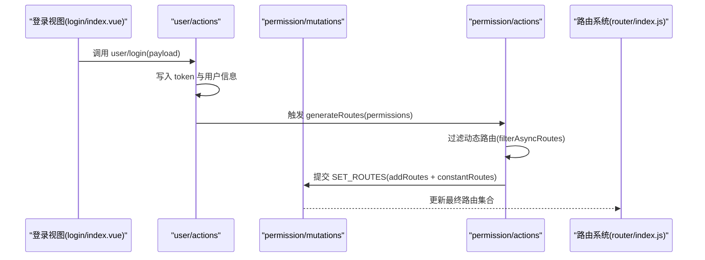
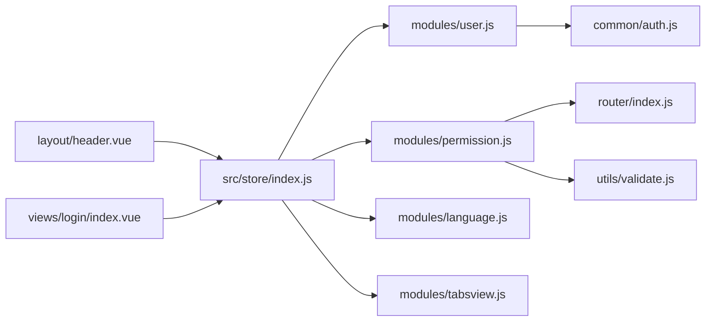

# Vuex Store 架构设计

<cite>
**本文引用的文件**
- [src/store/index.js](file://src/store/index.js)
- [src/store/modules/language.js](file://src/store/modules/language.js)
- [src/store/modules/user.js](file://src/store/modules/user.js)
- [src/store/modules/permission.js](file://src/store/modules/permission.js)
- [src/store/modules/tabsview.js](file://src/store/modules/tabsview.js)
- [src/main.js](file://src/main.js)
- [src/common/auth.js](file://src/common/auth.js)
- [src/utils/validate.js](file://src/utils/validate.js)
- [src/router/index.js](file://src/router/index.js)
- [src/views/login/index.vue](file://src/views/login/index.vue)
- [src/layout/header.vue](file://src/layout/header.vue)
- [src/layout/sidebar/sidebar-item.vue](file://src/layout/sidebar/sidebar-item.vue)
</cite>

## 目录
1. [简介](#简介)
2. [项目结构](#项目结构)
3. [核心组件](#核心组件)
4. [架构总览](#架构总览)
5. [详细组件分析](#详细组件分析)
6. [依赖关系分析](#依赖关系分析)
7. [性能考虑](#性能考虑)
8. [故障排查指南](#故障排查指南)
9. [结论](#结论)
10. [附录](#附录)

## 简介
本文件系统性梳理 Vue CMS 中的 Vuex Store 架构设计，重点覆盖以下方面：
- 整体架构设计思路与模块化组织方式
- 自动模块加载机制的实现原理与配置方法
- 全局 Getters 的设计理念与使用模式
- State、Mutations、Actions 的标准组织结构与命名规范
- Store 初始化配置与模块注册的最佳实践
- 模块间的数据共享与通信机制
- 状态管理的性能优化策略与调试技巧

## 项目结构
本项目采用“按功能域划分”的模块化组织方式，Store 目录下通过独立的模块文件管理各自的 State/Mutations/Actions/Getters，并在入口处集中注册与导出。

**图示来源**
- [src/main.js:1-53](file://src/main.js#L1-L53)
- [src/store/index.js:1-74](file://src/store/index.js#L1-L74)
- [src/store/modules/language.js:1-26](file://src/store/modules/language.js#L1-L26)
- [src/store/modules/user.js:1-154](file://src/store/modules/user.js#L1-L154)
- [src/store/modules/permission.js:1-187](file://src/store/modules/permission.js#L1-L187)
- [src/store/modules/tabsview.js:1-49](file://src/store/modules/tabsview.js#L1-L49)
- [src/common/auth.js:1-18](file://src/common/auth.js#L1-L18)
- [src/router/index.js:1-343](file://src/router/index.js#L1-L343)
- [src/utils/validate.js:1-56](file://src/utils/validate.js#L1-L56)

**章节来源**
- [src/store/index.js:1-74](file://src/store/index.js#L1-L74)
- [src/main.js:1-53](file://src/main.js#L1-L53)

## 核心组件
- Store 入口与自动模块加载：通过 require.context 扫描 modules 目录，动态构建模块集合并注册到 Vuex.Store 实例，实现“零手动引入”。
- 全局 Getters：集中定义跨模块的便捷取值方法，统一对外暴露派生状态，降低组件耦合度。
- 模块化设计：每个模块独立维护 namespaced: true，避免命名冲突；模块内部遵循 State/Mutations/Actions 的清晰边界。

**章节来源**
- [src/store/index.js:6-74](file://src/store/index.js#L6-L74)

## 架构总览
下图展示了 Store 初始化、模块注册与全局 Getters 的整体流程：

**图示来源**
- [src/main.js:1-53](file://src/main.js#L1-L53)
- [src/store/index.js:10-17](file://src/store/index.js#L10-L17)
- [src/store/index.js:70-74](file://src/store/index.js#L70-L74)

## 详细组件分析

### 自动模块加载机制
- 实现原理：利用 Webpack 的 require.context 在编译期扫描指定目录下的所有 .js 文件，基于文件路径推导模块名，将默认导出的模块对象组装为模块字典。
- 配置要点：
  - 目录扫描范围：modules 文件夹及其子目录
  - 文件匹配规则：仅匹配 .js 结尾的文件
  - 模块命名：去除前缀与扩展名后的文件名作为模块名
  - 注册方式：直接传入 Vuex.Store 的 modules 字段
- 优点：无需手动维护模块清单，新增模块即生效；减少样板代码与遗漏风险。

**图示来源**
- [src/store/index.js:10-17](file://src/store/index.js#L10-L17)

**章节来源**
- [src/store/index.js:10-17](file://src/store/index.js#L10-L17)

### 全局 Getters 设计理念与使用模式
- 设计理念：将跨模块的常用派生状态统一收敛到全局 getters，组件通过 mapGetters 或直接 $store.getters.xxx 访问，提升可读性与复用性。
- 使用模式：
  - 组件内使用 mapGetters 映射 getter 名称，获得只读计算属性
  - 对于非 namespaced 的简单字段，也可直接使用 $store.state.module.field
- 本项目全局 getters 包含：已访问标签页、用户信息、头像、账户、全量用户信息、语言、动态路由、权限、侧边栏折叠状态、系统设置面板状态等。

**图示来源**
- [src/layout/header.vue:86-87](file://src/layout/header.vue#L86-L87)
- [src/store/index.js:24-68](file://src/store/index.js#L24-L68)

**章节来源**
- [src/layout/header.vue:86-87](file://src/layout/header.vue#L86-L87)
- [src/store/index.js:24-68](file://src/store/index.js#L24-L68)

### State/Mutations/Actions 标准组织结构与命名规范
- 组织结构：
  - State：模块内部的响应式数据，建议按领域拆分字段，避免过度扁平化
  - Mutations：同步变更，命名采用大写常量（如 SET_LANG），参数为 payload
  - Actions：异步或复杂业务，通过 commit 触发 mutations，必要时返回 Promise
- 命名规范：
  - 常量常量名：全大写下划线风格（如 SET_ACCOUNT）
  - 方法名：动词短语（如 login、logout、generateRoutes）
  - 模块名：小驼峰（如 user、permission、tabsview）

**章节来源**
- [src/store/modules/language.js:3-25](file://src/store/modules/language.js#L3-L25)
- [src/store/modules/user.js:6-146](file://src/store/modules/user.js#L6-L146)
- [src/store/modules/permission.js:133-179](file://src/store/modules/permission.js#L133-L179)
- [src/store/modules/tabsview.js:1-41](file://src/store/modules/tabsview.js#L1-L41)

### Store 初始化配置与模块注册最佳实践
- 在入口文件 main.js 中引入 store 并注入到 Vue 实例，确保全局可用
- Store 入口 index.js 中：
  - 使用 require.context 自动注册模块
  - 将全局 getters 单独定义并传入 Store
  - 每个模块启用 namespaced: true，避免命名冲突
- 最佳实践：
  - 模块职责单一，避免跨模块强耦合
  - mutations 保持幂等与轻量，避免副作用
  - actions 中处理异步与业务逻辑，尽量不直接修改 state
  - 使用常量统一管理 mutation 类型，便于 IDE 提示与重构

**章节来源**
- [src/main.js:1-53](file://src/main.js#L1-L53)
- [src/store/index.js:1-74](file://src/store/index.js#L1-L74)

### 模块间的数据共享与通信机制
- 用户模块与权限模块：
  - 用户登录成功后，将权限数据写入 sessionStorage，并通过 actions.generateRoutes 过滤动态路由，提交到 permission 模块
  - permission 模块维护最终路由集合 routes 与动态路由 addRoutes，供路由层消费
- 标签页模块与路由：
  - tabsview 模块记录已访问页面，配合路由元信息 meta，实现标签页联动
- 全局 getters：
  - 为视图层提供统一的派生状态访问点，如用户头像、语言、路由等

**图示来源**
- [src/views/login/index.vue:110-124](file://src/views/login/index.vue#L110-L124)
- [src/store/modules/user.js:52-110](file://src/store/modules/user.js#L52-L110)
- [src/store/modules/permission.js:143-179](file://src/store/modules/permission.js#L143-L179)
- [src/router/index.js:43-111](file://src/router/index.js#L43-L111)

**章节来源**
- [src/store/modules/user.js:52-110](file://src/store/modules/user.js#L52-L110)
- [src/store/modules/permission.js:143-179](file://src/store/modules/permission.js#L143-L179)
- [src/router/index.js:43-111](file://src/router/index.js#L43-L111)

### State、Mutations、Actions 的实现要点
- State：模块内部集中声明，避免分散在多处；对于复杂对象建议浅拷贝或深拷贝策略，防止意外共享引用
- Mutations：严格保持同步，参数为 payload；避免在 mutations 中发起异步请求
- Actions：封装业务流程，必要时调用多个 mutations；对外返回 Promise 以便调用方处理完成/失败

**章节来源**
- [src/store/modules/language.js:5-50](file://src/store/modules/language.js#L5-L50)
- [src/store/modules/user.js:13-146](file://src/store/modules/user.js#L13-L146)
- [src/store/modules/permission.js:7-179](file://src/store/modules/permission.js#L7-L179)
- [src/store/modules/tabsview.js:4-41](file://src/store/modules/tabsview.js#L4-L41)

## 依赖关系分析
- Store 与模块：
  - Store 入口依赖各模块的默认导出对象（namespaced: true）
  - 模块之间通过 actions/mutations 的调用形成松耦合依赖
- 模块与外部：
  - user 模块依赖 common/auth.js 进行 token 管理
  - permission 模块依赖 router/index.js 的常量/动态路由与 utils/validate.js 的权限类型判断
- 视图层与 Store：
  - 组件通过 mapGetters/mapActions 与 store 交互，避免直接访问 state

**图示来源**
- [src/store/index.js:1-74](file://src/store/index.js#L1-L74)
- [src/store/modules/user.js:1-5](file://src/store/modules/user.js#L1-L5)
- [src/store/modules/permission.js:4-5](file://src/store/modules/permission.js#L4-L5)
- [src/common/auth.js:1-18](file://src/common/auth.js#L1-L18)
- [src/router/index.js:1-343](file://src/router/index.js#L1-L343)
- [src/utils/validate.js:1-56](file://src/utils/validate.js#L1-L56)
- [src/layout/header.vue:76-87](file://src/layout/header.vue#L76-L87)
- [src/views/login/index.vue:55-124](file://src/views/login/index.vue#L55-L124)

**章节来源**
- [src/store/index.js:1-74](file://src/store/index.js#L1-L74)
- [src/store/modules/user.js:1-5](file://src/store/modules/user.js#L1-L5)
- [src/store/modules/permission.js:4-5](file://src/store/modules/permission.js#L4-L5)
- [src/common/auth.js:1-18](file://src/common/auth.js#L1-L18)
- [src/router/index.js:1-343](file://src/router/index.js#L1-L343)
- [src/utils/validate.js:1-56](file://src/utils/validate.js#L1-L56)
- [src/layout/header.vue:76-87](file://src/layout/header.vue#L76-L87)
- [src/views/login/index.vue:55-124](file://src/views/login/index.vue#L55-L124)

## 性能考虑
- 模块懒加载：结合路由懒加载，避免一次性加载过多模块导致首屏压力
- 计算属性与 getters：合理使用 Vue 计算属性与 getters，避免重复计算与不必要的渲染
- Mutation 幂等：保持 mutations 同步且幂等，减少重绘与回流
- 事件与订阅：避免在 mutations 中发起异步请求，将副作用放入 actions
- 调试与可观测性：利用浏览器调试工具观察 state 变化与 action 触发，定位性能瓶颈

## 故障排查指南
- 模块未生效：
  - 检查模块文件是否位于 modules 目录且以 .js 结尾
  - 确认模块默认导出包含 namespaced、state、mutations、actions
- Getter 无法访问：
  - 确认全局 getters 已在入口文件中定义并传入 Store
  - 组件中使用 mapGetters 或 $store.getters.xxx
- 登录后路由不更新：
  - 检查 user 模块是否正确提交 token 与用户信息
  - 确认 permission 模块 generateRoutes 是否被调用并提交 SET_ROUTES
- 头像路径异常：
  - 检查全局 getters 中对头像路径的处理逻辑（BASE_URL 与 /static/ 前缀）

**章节来源**
- [src/store/index.js:24-68](file://src/store/index.js#L24-L68)
- [src/store/modules/user.js:52-110](file://src/store/modules/user.js#L52-L110)
- [src/store/modules/permission.js:143-179](file://src/store/modules/permission.js#L143-L179)

## 结论
本项目的 Vuex Store 采用“自动模块加载 + 全局 getters + namespaced 模块”的架构，实现了高内聚、低耦合的状态管理。通过统一的初始化流程与清晰的模块边界，既保证了开发效率，也为后续扩展与维护提供了良好基础。建议在团队中固化命名规范与组织结构，持续优化 getters 与 actions 的职责划分，进一步提升可维护性与性能表现。

## 附录
- 常用交互示例路径：
  - 登录触发用户模块 actions：[src/views/login/index.vue:110-124](file://src/views/login/index.vue#L110-L124)
  - 头部组件使用全局 getters：[src/layout/header.vue:86-87](file://src/layout/header.vue#L86-L87)
  - 权限过滤与路由生成：[src/store/modules/permission.js:143-179](file://src/store/modules/permission.js#L143-L179)
  - 认证令牌管理：[src/common/auth.js:1-18](file://src/common/auth.js#L1-L18)
  - 路由常量与动态路由：[src/router/index.js:43-111](file://src/router/index.js#L43-L111)