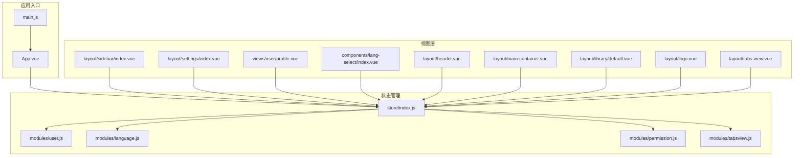
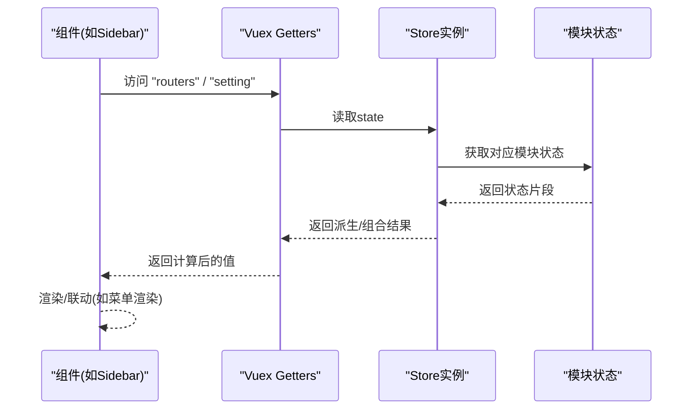
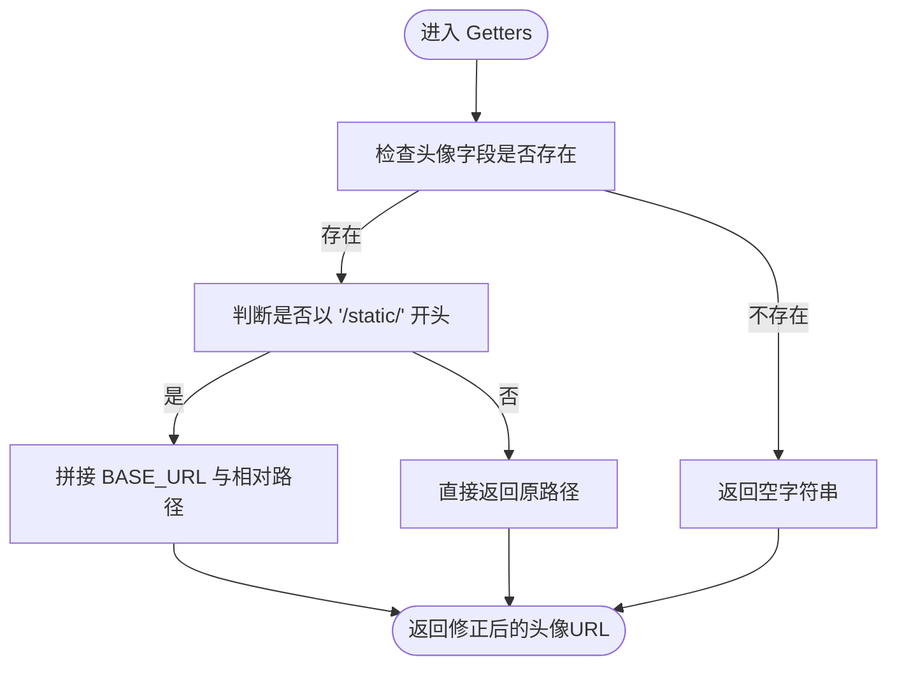
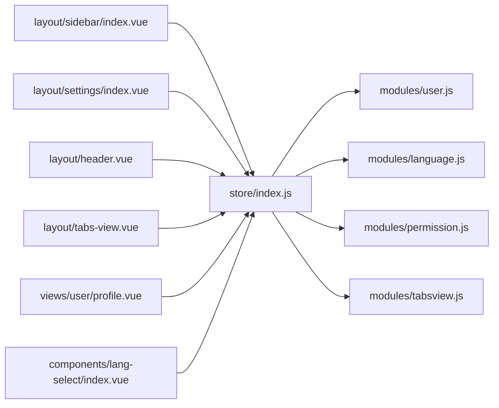

# 全局Getters设计

<cite>
**本文引用的文件**
- [src/store/index.js](file://src/store/index.js)
- [src/store/modules/user.js](file://src/store/modules/user.js)
- [src/store/modules/language.js](file://src/store/modules/language.js)
- [src/store/modules/permission.js](file://src/store/modules/permission.js)
- [src/store/modules/tabsview.js](file://src/store/modules/tabsview.js)
- [src/layout/sidebar/index.vue](file://src/layout/sidebar/index.vue)
- [src/layout/settings/index.vue](file://src/layout/settings/index.vue)
- [src/views/user/profile.vue](file://src/views/user/profile.vue)
- [src/components/lang-select/index.vue](file://src/components/lang-select/index.vue)
- [src/layout/header.vue](file://src/layout/header.vue)
- [src/layout/main-container.vue](file://src/layout/main-container.vue)
- [src/layout/library/default.vue](file://src/layout/library/default.vue)
- [src/layout/logo.vue](file://src/layout/logo.vue)
- [src/layout/tabs-view.vue](file://src/layout/tabs-view.vue)
- [src/App.vue](file://src/App.vue)
- [src/main.js](file://src/main.js)
</cite>

## 目录
1. [引言](#引言)
2. [项目结构](#项目结构)
3. [核心组件](#核心组件)
4. [架构总览](#架构总览)
5. [详细组件分析](#详细组件分析)
6. [依赖分析](#依赖分析)
7. [性能考量](#性能考量)
8. [故障排查指南](#故障排查指南)
9. [结论](#结论)
10. [附录](#附录)

## 引言
本文件系统性阐述该Vue CMS项目中的“全局Getters”设计与实践，包括设计理念、实现原理、使用模式、与组件计算属性的绑定关系、性能优化策略、复杂数据派生与转换逻辑、命名规范与组织结构、调试与监控方法、在状态组合与数据筛选中的作用，以及与第三方库的集成与兼容性处理。目标是帮助开发者在不深入源码的情况下，也能高效理解并正确使用Getters。

## 项目结构
该项目采用标准的Vue CLI工程结构，状态管理位于src/store目录下，采用Vuex模块化方案，并通过自动扫描机制加载模块，形成清晰的“按功能域划分”的模块组织。全局Getters集中定义在store入口文件中，作为跨模块的统一取值便捷层，便于组件以统一方式访问状态。

图表来源
- [src/main.js:1-53](file://src/main.js#L1-L53)
- [src/App.vue:1-35](file://src/App.vue#L1-L35)
- [src/store/index.js:1-74](file://src/store/index.js#L1-L74)
- [src/store/modules/user.js:1-154](file://src/store/modules/user.js#L1-L154)
- [src/store/modules/language.js:1-26](file://src/store/modules/language.js#L1-L26)
- [src/store/modules/permission.js:1-187](file://src/store/modules/permission.js#L1-L187)
- [src/store/modules/tabsview.js:1-49](file://src/store/modules/tabsview.js#L1-L49)
- [src/layout/sidebar/index.vue:1-142](file://src/layout/sidebar/index.vue#L1-L142)
- [src/layout/settings/index.vue:1-512](file://src/layout/settings/index.vue#L1-L512)
- [src/views/user/profile.vue](file://src/views/user/profile.vue)
- [src/components/lang-select/index.vue](file://src/components/lang-select/index.vue)
- [src/layout/header.vue](file://src/layout/header.vue)
- [src/layout/main-container.vue](file://src/layout/main-container.vue)
- [src/layout/library/default.vue](file://src/layout/library/default.vue)
- [src/layout/logo.vue](file://src/layout/logo.vue)
- [src/layout/tabs-view.vue](file://src/layout/tabs-view.vue)

章节来源
- [src/store/index.js:1-74](file://src/store/index.js#L1-L74)
- [src/main.js:1-53](file://src/main.js#L1-L53)
- [src/App.vue:1-35](file://src/App.vue#L1-L35)

## 核心组件
- 全局Store与Getters：集中定义在store/index.js，提供统一的取值入口，覆盖用户信息、语言、权限路由、标签页、系统设置等。
- 模块化状态：各模块独立维护state/mutations/actions，遵循namespaced命名空间，避免冲突。
- 组件绑定：大量组件通过mapGetters将Getters映射为本地computed，实现响应式绑定与解耦。

章节来源
- [src/store/index.js:24-68](file://src/store/index.js#L24-L68)
- [src/store/modules/user.js:13-29](file://src/store/modules/user.js#L13-L29)
- [src/store/modules/language.js:5-7](file://src/store/modules/language.js#L5-L7)
- [src/store/modules/permission.js:7-14](file://src/store/modules/permission.js#L7-L14)
- [src/store/modules/tabsview.js:4-6](file://src/store/modules/tabsview.js#L4-L6)

## 架构总览
全局Getters作为“状态投影层”，将分散在各模块的状态以统一的键名暴露给组件，降低组件对模块内部结构的耦合度。组件通过mapGetters或直接this.$store.getters.xxx访问，实现声明式的数据绑定。

图表来源
- [src/layout/sidebar/index.vue:32-35](file://src/layout/sidebar/index.vue#L32-L35)
- [src/store/index.js:61-67](file://src/store/index.js#L61-L67)

## 详细组件分析

### 全局Getters设计与实现
- 设计理念
  - 单一职责：仅负责“取值与简单派生”，不承载业务逻辑。
  - 统一入口：组件通过统一键名访问，提升一致性与可维护性。
  - 官方推荐：遵循Vuex最佳实践，将getters置于store根级别，便于全局复用。
- 实现要点
  - 自动模块加载：store/index.js通过require.context自动收集modules下的所有模块，无需手动引入。
  - 全局Getters：集中定义在store/index.js的getters对象中，键名为对外暴露的名称。
  - 路由权限与菜单：通过permission模块的addRoutes与routes组合，形成最终可用的路由树。
  - 用户信息派生：提供userInfo、userName、account、allInfo、avatar/userAvatar等便捷访问。
  - 系统设置：提供setting、sidebarCollapse、showSettingPanel等界面控制状态。
- 典型场景
  - 侧边栏菜单渲染：使用routers与sidebarCollapse控制菜单展开/折叠。
  - 顶部Header展示：使用userName、userAvatar显示当前用户信息。
  - 设置面板联动：使用showSettingPanel控制抽屉显隐，setting传递主题配置。
  - 个人资料页：使用allInfo一次性获取用户完整信息，减少多次取值。

章节来源
- [src/store/index.js:6-23](file://src/store/index.js#L6-L23)
- [src/store/index.js:24-68](file://src/store/index.js#L24-L68)
- [src/store/modules/permission.js:134-178](file://src/store/modules/permission.js#L134-L178)
- [src/store/modules/user.js:13-29](file://src/store/modules/user.js#L13-L29)

### Getters与组件计算属性的绑定关系
- 绑定方式
  - 使用mapGetters将Getters映射为本地computed，支持数组与对象两种形式。
  - 也可直接通过this.$store.getters.xxx访问，适用于少量使用场景。
- 性能优化
  - 响应式缓存：Getters基于其依赖的state进行缓存，依赖不变则直接返回缓存结果。
  - 按需订阅：组件仅订阅自身使用的Getters，避免不必要的重渲染。
  - 避免在Getters中执行副作用：确保纯函数特性，利于缓存与测试。
- 典型绑定示例
  - Sidebar：routers、setting
  - Settings：showSettingPanel、setting
  - Header：userName、userAvatar、sidebarCollapse、routers
  - TabsView：visitedTabsView
  - Profile：avatar、allInfo
  - LangSelect：language

章节来源
- [src/layout/sidebar/index.vue:20,32-35](file://src/layout/sidebar/index.vue#L20,L32-L35)
- [src/layout/settings/index.vue:190-200](file://src/layout/settings/index.vue#L190-L200)
- [src/layout/header.vue:75,86](file://src/layout/header.vue#L75,L86)
- [src/layout/tabs-view.vue:18,27](file://src/layout/tabs-view.vue#L18,L27)
- [src/views/user/profile.vue:56,96](file://src/views/user/profile.vue#L56,L96)
- [src/components/lang-select/index.vue](file://src/components/lang-select/index.vue)

### 复杂数据的派生与转换逻辑
- 用户头像路径处理
  - 当头像以/static/开头时，结合process.env.BASE_URL进行路径修正，适配子目录部署。
- 用户完整信息聚合
  - allInfo将account与userInfo中的多字段聚合为统一对象，便于表单一次性使用。
- 路由权限筛选
  - permission模块根据后端返回的权限列表与前端路由表进行匹配，递归筛选有效路由，生成最终routes与addRoutes。
- 标签页集合
  - tabsview模块维护visitedTabsView，组件通过visitedTabsView进行标签页渲染与交互。

图表来源
- [src/store/index.js:32-40](file://src/store/index.js#L32-L40)

章节来源
- [src/store/index.js:32-51](file://src/store/index.js#L32-L51)
- [src/store/modules/permission.js:41-54](file://src/store/modules/permission.js#L41-L54)
- [src/store/modules/tabsview.js:9-26](file://src/store/modules/tabsview.js#L9-L26)

### Getters命名规范与组织结构
- 命名规范
  - 语义化：键名应直观表达意图，如userName、userAvatar、routers、showSettingPanel。
  - 一致性：同一类状态使用相近前缀或后缀，如user*、setting*。
  - 避免冗余：优先使用简短且明确的名称，避免重复模块名前缀。
- 组织结构
  - 按功能域分组：用户、语言、权限、标签页、设置等分别在对应模块中维护，Getters统一暴露。
  - 单一职责：Getters只做“取值与简单派生”，不做业务逻辑。
  - 易扩展：新增Getters只需在store/index.js中追加，组件无需改动。

章节来源
- [src/store/index.js:24-68](file://src/store/index.js#L24-L68)

### 调试与监控方法
- 日志定位
  - 在permission模块的generateRoutes中打印过滤过程与最终结果，便于排查权限路由问题。
- 运行时观察
  - 在组件中通过浏览器Vue DevTools查看$store.getters与$store.state，确认Getters输出是否符合预期。
- 单元测试
  - 对复杂Getters（如头像路径处理）编写单元测试，验证边界条件与异常输入。
- 性能监控
  - 利用Vue DevTools Profiler观察组件重渲染次数，确保Getters依赖稳定，避免频繁无效更新。

章节来源
- [src/store/modules/permission.js:167-177](file://src/store/modules/permission.js#L167-L177)

### Getters在状态组合与数据筛选中的作用
- 状态组合
  - routers由constantRoutes与addRoutes组合而成，形成完整路由表；setting汇聚主题与界面配置。
- 数据筛选
  - permission模块通过filterAsyncRoutes递归筛选有效路由，结合菜单/按钮权限类型进行过滤。
- 与第三方库的集成
  - Element UI：通过mapGetters与Element组件双向绑定，实现主题、布局、菜单等配置的可视化控制。
  - js-cookie：用于读取/设置组件尺寸等偏好，间接影响界面渲染。

章节来源
- [src/store/modules/permission.js:134-178](file://src/store/modules/permission.js#L134-L178)
- [src/layout/settings/index.vue:190-304](file://src/layout/settings/index.vue#L190-L304)
- [src/main.js:36-40](file://src/main.js#L36-L40)

## 依赖分析
- Store到模块的依赖
  - store/index.js依赖各模块导出的默认对象（namespaced），并通过require.context自动注册。
- 组件到Store的依赖
  - 多个布局与功能组件通过mapGetters依赖store/index.js中定义的Getters。
- 第三方库依赖
  - Element UI：提供菜单、抽屉、颜色选择器等UI能力，与Getters联动实现主题与布局切换。
  - normalize.css、animate.css：提供基础样式与动画，与Getters无关但共同构成界面表现。

图表来源
- [src/store/index.js:10-17](file://src/store/index.js#L10-L17)
- [src/layout/sidebar/index.vue:20](file://src/layout/sidebar/index.vue#L20)
- [src/layout/settings/index.vue:190](file://src/layout/settings/index.vue#L190)
- [src/layout/header.vue:75](file://src/layout/header.vue#L75)
- [src/layout/tabs-view.vue:18](file://src/layout/tabs-view.vue#L18)
- [src/views/user/profile.vue:56](file://src/views/user/profile.vue#L56)
- [src/components/lang-select/index.vue](file://src/components/lang-select/index.vue)

章节来源
- [src/store/index.js:10-17](file://src/store/index.js#L10-L17)
- [src/layout/sidebar/index.vue:20](file://src/layout/sidebar/index.vue#L20)
- [src/layout/settings/index.vue:190](file://src/layout/settings/index.vue#L190)
- [src/layout/header.vue:75](file://src/layout/header.vue#L75)
- [src/layout/tabs-view.vue:18](file://src/layout/tabs-view.vue#L18)
- [src/views/user/profile.vue:56](file://src/views/user/profile.vue#L56)
- [src/components/lang-select/index.vue](file://src/components/lang-select/index.vue)

## 性能考量
- 响应式缓存
  - Getters基于依赖缓存，避免重复计算；确保依赖稳定，减少无意义重渲染。
- 按需订阅
  - 组件仅订阅所需Getters，避免过度依赖导致的全局波动。
- 路由筛选成本
  - permission模块的递归筛选可能带来一定开销，建议在权限数据量较大时考虑分页或懒加载策略。
- 路径处理
  - 头像路径处理为轻量逻辑，注意在大量头像渲染时避免重复拼接，可结合组件层面的缓存策略。

## 故障排查指南
- 路由不生效
  - 检查permission.generateRoutes是否正确过滤并合并routes与addRoutes。
  - 确认后端返回的权限地址与前端路由path一致。
- 头像显示异常
  - 检查头像字段是否为空，以及是否以/static/开头；确认BASE_URL配置正确。
- 设置面板不显示
  - 检查showSettingPanel的Getters与组件绑定是否一致。
- 语言切换无效
  - 检查language模块的SET_LANG是否正确提交，以及组件是否通过mapGetters读取最新语言。

章节来源
- [src/store/modules/permission.js:147-178](file://src/store/modules/permission.js#L147-L178)
- [src/store/index.js:32-40](file://src/store/index.js#L32-L40)
- [src/store/modules/language.js:9-12](file://src/store/modules/language.js#L9-L12)
- [src/layout/settings/index.vue:194-196](file://src/layout/settings/index.vue#L194-L196)

## 结论
该CMS项目的全局Getters设计遵循“单一职责、统一入口、语义化命名”的原则，通过store/index.js集中暴露跨模块状态，配合组件的mapGetters绑定，实现了高内聚、低耦合的状态访问模式。在权限路由、用户信息、系统设置等关键领域，Getters提供了清晰的派生与转换逻辑，既保证了易用性，也为后续扩展与维护奠定了良好基础。

## 附录
- 快速索引
  - 全局Getters定义位置：[src/store/index.js:24-68](file://src/store/index.js#L24-L68)
  - 模块自动加载：[src/store/index.js:10-17](file://src/store/index.js#L10-L17)
  - 路由权限筛选：[src/store/modules/permission.js:41-54](file://src/store/modules/permission.js#L41-L54)
  - 用户信息派生：[src/store/index.js:28-51](file://src/store/index.js#L28-L51)
  - 组件绑定示例：[src/layout/sidebar/index.vue:32-35](file://src/layout/sidebar/index.vue#L32-L35)、[src/layout/settings/index.vue:194-200](file://src/layout/settings/index.vue#L194-L200)、[src/layout/header.vue:86](file://src/layout/header.vue#L86)、[src/layout/tabs-view.vue:27](file://src/layout/tabs-view.vue#L27)、[src/views/user/profile.vue:96](file://src/views/user/profile.vue#L96)、[src/components/lang-select/index.vue](file://src/components/lang-select/index.vue)