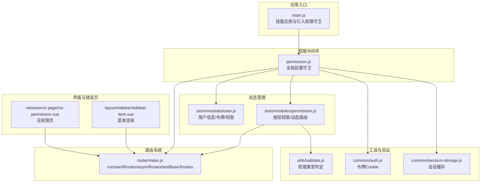
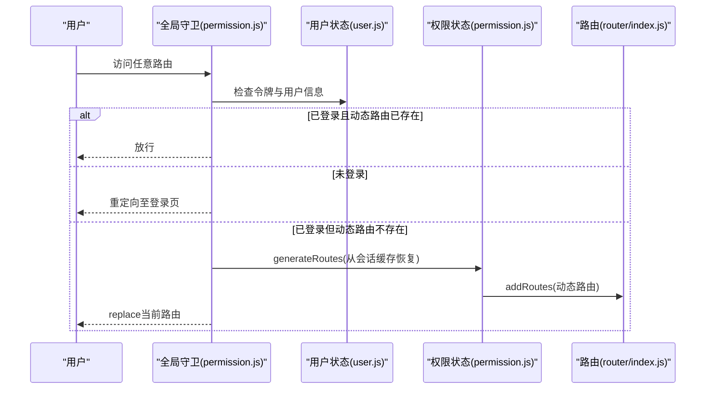
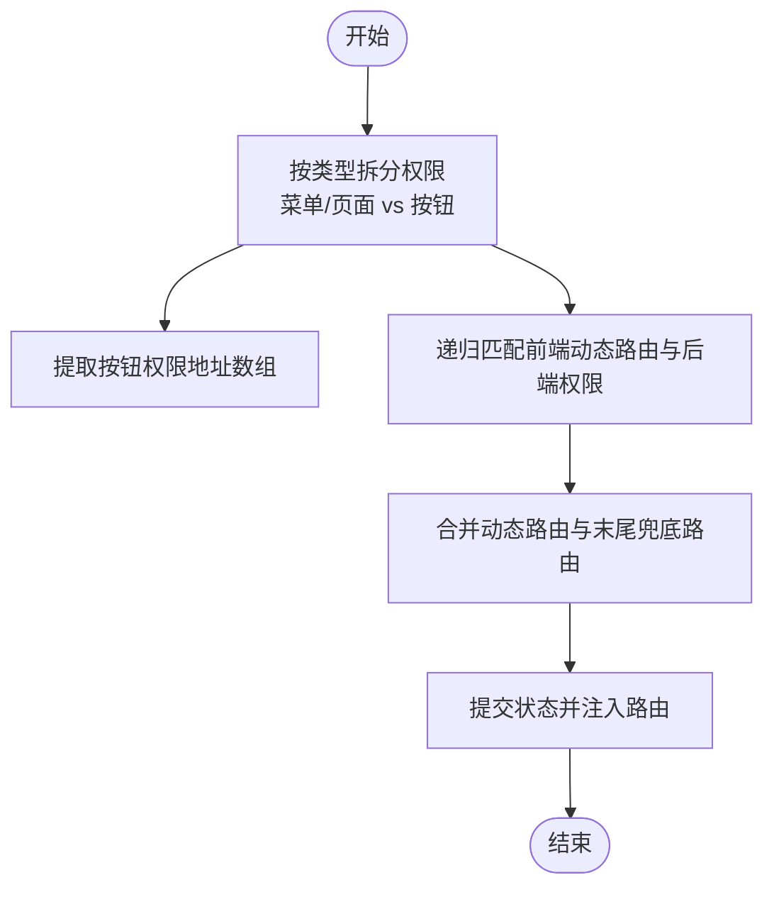
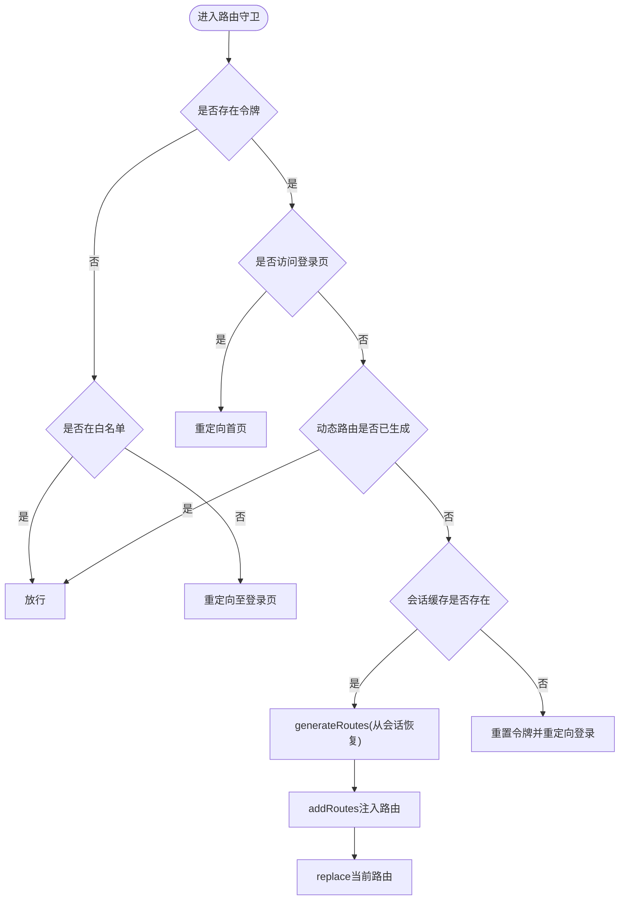
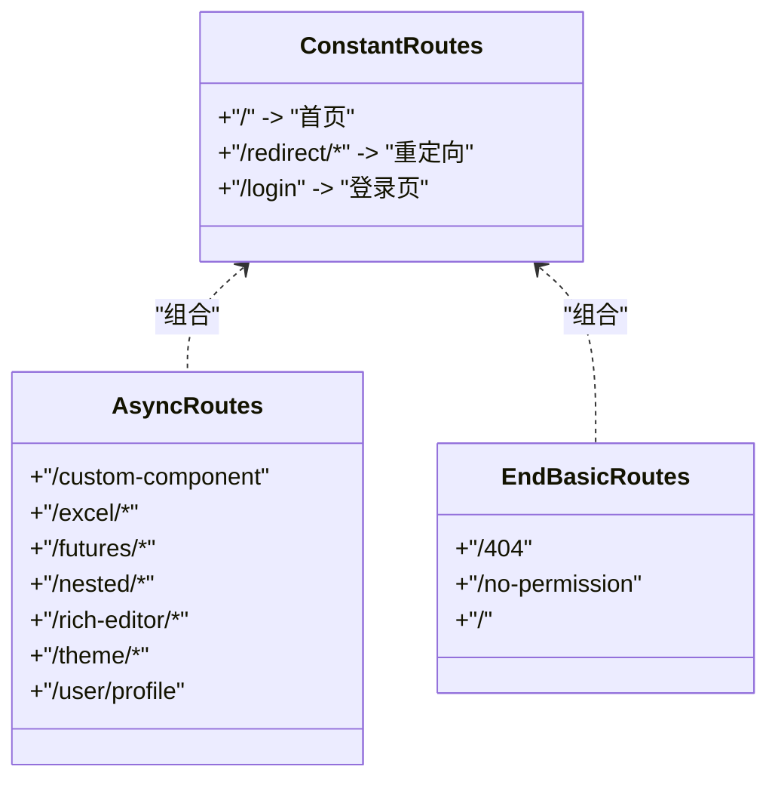
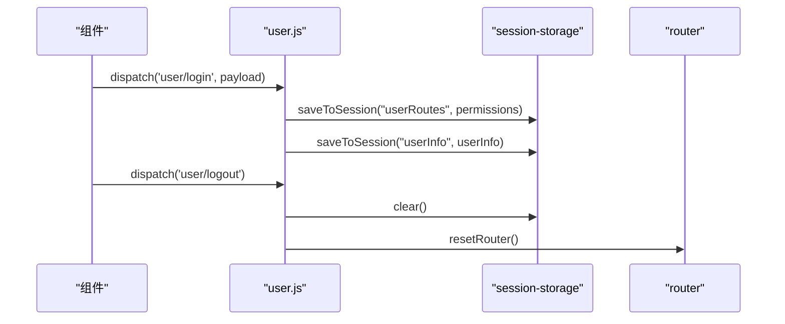
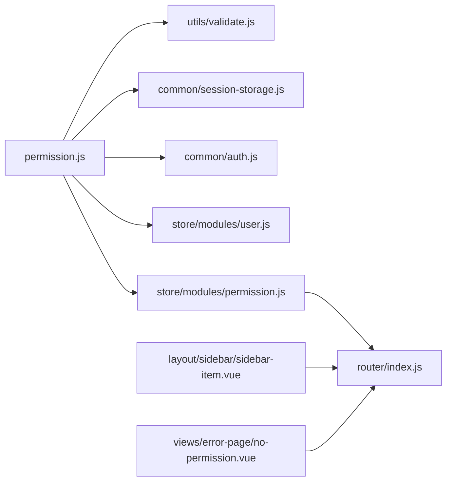

# 权限状态模块

<cite>
**本文档引用的文件**
- [src/store/modules/permission.js](file://src/store/modules/permission.js)
- [src/permission.js](file://src/permission.js)
- [src/router/index.js](file://src/router/index.js)
- [src/store/modules/user.js](file://src/store/modules/user.js)
- [src/utils/validate.js](file://src/utils/validate.js)
- [src/common/auth.js](file://src/common/auth.js)
- [src/common/session-storage.js](file://src/common/session-storage.js)
- [src/layout/sidebar/sidebar-item.vue](file://src/layout/sidebar/sidebar-item.vue)
- [src/views/error-page/no-permission.vue](file://src/views/error-page/no-permission.vue)
- [src/main.js](file://src/main.js)
- [src/App.vue](file://src/App.vue)
- [src/mock/modules/user.js](file://src/mock/modules/user.js)
</cite>

## 目录
1. [简介](#简介)
2. [项目结构](#项目结构)
3. [核心组件](#核心组件)
4. [架构总览](#架构总览)
5. [详细组件分析](#详细组件分析)
6. [依赖分析](#依赖分析)
7. [性能考虑](#性能考虑)
8. [故障排查指南](#故障排查指南)
9. [结论](#结论)
10. [附录](#附录)

## 简介
本文件系统性梳理权限状态模块的设计与实现，覆盖以下关键主题：
- 权限状态的架构设计与路由权限控制机制
- 动态路由生成的实现原理与权限匹配算法
- 权限数据结构与层级关系
- 权限状态与路由系统的集成方式
- 权限验证的中间件实现与拦截策略
- 权限状态的缓存与更新机制
- 权限变更时的状态同步与页面重定向处理
- 不同用户角色下的差异化处理

## 项目结构
权限相关能力围绕“路由 + 状态 + 中间件 + 工具”四层协同构建：
- 路由层：常量路由、动态路由、末尾兜底路由
- 状态层：用户状态与权限状态（按钮权限、动态路由集合）
- 中间件层：全局前置守卫，负责登录态与路由鉴权
- 工具层：权限类型判定、本地缓存、认证令牌

**图表来源**
- [src/main.js:25](file://src/main.js#L25)
- [src/permission.js:22-91](file://src/permission.js#L22-L91)
- [src/store/modules/permission.js:1-186](file://src/store/modules/permission.js#L1-L186)
- [src/store/modules/user.js:1-154](file://src/store/modules/user.js#L1-L154)
- [src/router/index.js:43-342](file://src/router/index.js#L43-L342)
- [src/utils/validate.js:1-56](file://src/utils/validate.js#L1-L56)
- [src/common/auth.js:1-18](file://src/common/auth.js#L1-L18)
- [src/common/session-storage.js:1-48](file://src/common/session-storage.js#L1-L48)
- [src/layout/sidebar/sidebar-item.vue:1-107](file://src/layout/sidebar/sidebar-item.vue#L1-L107)
- [src/views/error-page/no-permission.vue:1-4](file://src/views/error-page/no-permission.vue#L1-L4)

**章节来源**
- [src/main.js:25](file://src/main.js#L25)
- [src/router/index.js:43-342](file://src/router/index.js#L43-L342)

## 核心组件
- 权限状态模块（Vuex）：负责按钮权限数组与动态路由集合的生成与提交，以及菜单/页面/按钮三类权限的拆分与提取。
- 全局权限中间件（路由守卫）：在导航前根据登录态与会话缓存决定是否放行、重定向或回退至登录。
- 路由系统：定义基础路由、动态路由与末尾兜底路由，作为权限匹配与菜单渲染的基础。
- 用户状态模块：负责登录、拉取用户信息、退出登录与令牌清理，并在登录成功后写入会话缓存。
- 工具与验证：提供权限类型判定、令牌读写、会话缓存封装。

**章节来源**
- [src/store/modules/permission.js:1-186](file://src/store/modules/permission.js#L1-L186)
- [src/permission.js:22-91](file://src/permission.js#L22-L91)
- [src/router/index.js:43-342](file://src/router/index.js#L43-L342)
- [src/store/modules/user.js:1-154](file://src/store/modules/user.js#L1-L154)
- [src/utils/validate.js:1-56](file://src/utils/validate.js#L1-L56)
- [src/common/auth.js:1-18](file://src/common/auth.js#L1-L18)
- [src/common/session-storage.js:1-48](file://src/common/session-storage.js#L1-L48)

## 架构总览
权限系统采用“前端路由表 + 后端权限清单”的双向匹配机制：
- 登录成功后，后端返回权限清单（含类型与地址），前端按类型拆分为菜单/页面与按钮两类。
- 使用“菜单/页面”权限清单与前端动态路由表进行匹配，生成用户可用的动态路由集合。
- 将动态路由与基础路由合并，并追加末尾兜底路由，注入到路由系统。
- 全局守卫在每次导航前检查登录态与动态路由是否已生成，未生成则尝试从会话缓存恢复。

**图表来源**
- [src/permission.js:22-91](file://src/permission.js#L22-L91)
- [src/store/modules/permission.js:147-178](file://src/store/modules/permission.js#L147-L178)
- [src/router/index.js:322-342](file://src/router/index.js#L322-L342)

## 详细组件分析

### 权限状态模块（store/modules/permission.js）
- 状态设计
  - 按钮权限数组：用于按钮级权限控制
  - 动态路由集合：用户可用的动态路由
  - 完整路由集合：基础路由 + 动态路由
- 动态路由生成流程
  - 类型拆分：依据权限类型过滤出菜单/页面与按钮两类
  - 按钮权限提取：从按钮类权限中抽取地址形成数组
  - 权限匹配：递归遍历前端动态路由表，与后端返回的菜单/页面权限进行地址匹配
  - 结果合并：将匹配结果与末尾兜底路由合并，提交到状态并注入路由系统
- 关键算法
  - hasPermission：过滤后端权限清单中的有效地址，与前端路由的path进行精确匹配
  - filterAsyncRoutes：递归过滤子路由，保留父链路通达的节点

**图表来源**
- [src/store/modules/permission.js:147-178](file://src/store/modules/permission.js#L147-L178)
- [src/store/modules/permission.js:22-54](file://src/store/modules/permission.js#L22-L54)

**章节来源**
- [src/store/modules/permission.js:1-186](file://src/store/modules/permission.js#L1-L186)
- [src/utils/validate.js:43-55](file://src/utils/validate.js#L43-L55)

### 全局权限中间件（src/permission.js）
- 白名单机制：无需登录即可访问的路由集合
- 登录态检查：通过令牌判断是否已登录
- 动态路由恢复：若动态路由为空，尝试从会话缓存恢复
- 错误处理：异常时重置令牌并引导至登录页
- 页面标题与进度条：统一设置页面标题与进度条样式

**图表来源**
- [src/permission.js:22-91](file://src/permission.js#L22-L91)

**章节来源**
- [src/permission.js:1-98](file://src/permission.js#L1-L98)

### 路由系统（router/index.js）
- 常量路由：所有角色均可访问的基础路由
- 动态路由：按角色划分的菜单与页面路由
- 末尾兜底路由：404、无权限、通配符兜底
- 路由重置：提供重置路由实例与重新挂载守卫的能力

**图表来源**
- [src/router/index.js:43-111](file://src/router/index.js#L43-L111)
- [src/router/index.js:118-320](file://src/router/index.js#L118-L320)
- [src/router/index.js:322-342](file://src/router/index.js#L322-L342)

**章节来源**
- [src/router/index.js:43-342](file://src/router/index.js#L43-L342)

### 用户状态模块（store/modules/user.js）
- 登录：保存令牌与用户信息，写入会话缓存（包含权限清单）
- 退出：移除令牌、清空会话缓存、重置路由
- 拉取用户信息：异步请求用户信息
- 重置令牌：清理状态并重置路由

**图表来源**
- [src/store/modules/user.js:52-110](file://src/store/modules/user.js#L52-L110)
- [src/common/session-storage.js:19-45](file://src/common/session-storage.js#L19-L45)
- [src/router/index.js:332-340](file://src/router/index.js#L332-L340)

**章节来源**
- [src/store/modules/user.js:1-154](file://src/store/modules/user.js#L1-L154)
- [src/common/session-storage.js:1-48](file://src/common/session-storage.js#L1-L48)

### 工具与验证（utils/validate.js、common/auth.js、common/session-storage.js）
- 权限类型判定：区分菜单/页面/按钮三类权限
- 令牌管理：基于Cookie的令牌读写
- 会话缓存：以命名空间隔离的会话存储

**章节来源**
- [src/utils/validate.js:1-56](file://src/utils/validate.js#L1-L56)
- [src/common/auth.js:1-18](file://src/common/auth.js#L1-L18)
- [src/common/session-storage.js:1-48](file://src/common/session-storage.js#L1-L48)

### 菜单与按钮权限在UI中的体现
- 菜单渲染：侧边栏组件根据路由表渲染菜单项，支持多级嵌套与仅子路由提升
- 按钮权限：按钮级权限通过按钮权限数组进行控制，结合组件内的权限指令或方法进行显隐

**章节来源**
- [src/layout/sidebar/sidebar-item.vue:1-107](file://src/layout/sidebar/sidebar-item.vue#L1-L107)

### 无权限页面
- 当路由匹配到无权限状态时，展示无权限页面

**章节来源**
- [src/views/error-page/no-permission.vue:1-4](file://src/views/error-page/no-permission.vue#L1-L4)

## 依赖分析
- 模块耦合
  - permission.js 依赖 router、store、utils/validate、common/session-storage、common/auth
  - permission.js 与 user.js 协作：前者消费后者写入的会话缓存
  - permission.js 与 router 协作：生成路由并注入
- 外部依赖
  - Element UI（菜单与消息提示）
  - NProgress（进度条）

**图表来源**
- [src/permission.js:1-98](file://src/permission.js#L1-L98)
- [src/store/modules/permission.js:1-186](file://src/store/modules/permission.js#L1-L186)
- [src/router/index.js:43-342](file://src/router/index.js#L43-L342)
- [src/utils/validate.js:1-56](file://src/utils/validate.js#L1-L56)
- [src/common/session-storage.js:1-48](file://src/common/session-storage.js#L1-L48)
- [src/common/auth.js:1-18](file://src/common/auth.js#L1-L18)
- [src/layout/sidebar/sidebar-item.vue:1-107](file://src/layout/sidebar/sidebar-item.vue#L1-L107)
- [src/views/error-page/no-permission.vue:1-4](file://src/views/error-page/no-permission.vue#L1-L4)

**章节来源**
- [src/permission.js:1-98](file://src/permission.js#L1-L98)
- [src/store/modules/permission.js:1-186](file://src/store/modules/permission.js#L1-L186)
- [src/router/index.js:43-342](file://src/router/index.js#L43-L342)

## 性能考虑
- 路由匹配复杂度：filterAsyncRoutes 为树形递归，时间复杂度 O(N)，其中 N 为动态路由节点数
- 会话缓存命中：优先从会话缓存恢复动态路由，避免重复请求
- 进度条与页面标题：在守卫中统一处理，减少重复逻辑
- 建议优化点
  - 对权限清单进行去重与排序，降低匹配成本
  - 对动态路由进行懒加载与按需注入，减少初始包体
  - 对按钮权限进行索引化（Set/Map），提升按钮显隐判断效率

[本节为通用性能讨论，不直接分析具体文件]

## 故障排查指南
- 登录后仍被重定向至登录页
  - 检查令牌是否存在与是否过期
  - 检查会话缓存中 userRoutes 是否存在
  - 检查权限类型与地址是否正确
- 动态路由未生效
  - 确认 generateRoutes 是否被调用
  - 确认 addRoutes 是否被注入
  - 确认末尾兜底路由是否追加
- 无权限页面频繁出现
  - 检查后端返回的权限清单与前端动态路由地址是否一致
  - 检查权限类型过滤逻辑是否正确
- 退出登录后状态未清理
  - 确认是否调用了 resetToken 并清空了会话缓存
  - 确认是否重置了路由

**章节来源**
- [src/permission.js:40-70](file://src/permission.js#L40-L70)
- [src/store/modules/user.js:90-110](file://src/store/modules/user.js#L90-L110)
- [src/store/modules/permission.js:147-178](file://src/store/modules/permission.js#L147-L178)

## 结论
该权限状态模块通过“前端路由表 + 后端权限清单”的双向匹配，实现了灵活的角色驱动路由与按钮级权限控制。全局守卫负责登录态与动态路由的生命周期管理，配合会话缓存与状态模块，确保了权限变更后的状态同步与页面重定向处理。通过清晰的模块边界与职责分离，系统具备良好的可扩展性与可维护性。

[本节为总结性内容，不直接分析具体文件]

## 附录

### 权限数据结构与层级关系
- 权限清单（后端返回）
  - 字段示例：type（1=菜单，2=页面，3=按钮）、address（路由地址）
- 前端路由表（前端配置）
  - 结构：path、name、component、meta、children
- 状态结构
  - 按钮权限数组：字符串地址列表
  - 动态路由集合：路由对象数组
  - 完整路由集合：基础路由 + 动态路由

**章节来源**
- [src/store/modules/permission.js:7-14](file://src/store/modules/permission.js#L7-L14)
- [src/router/index.js:118-320](file://src/router/index.js#L118-L320)
- [src/utils/validate.js:25-37](file://src/utils/validate.js#L25-L37)

### 不同用户角色下的差异化处理
- 角色差异体现在后端返回的权限清单中，前端通过类型过滤与地址匹配实现差异化路由与按钮控制
- 示例：管理员与普通用户拥有不同的 permissions 列表，从而生成不同的动态路由集合

**章节来源**
- [src/mock/modules/user.js:108-177](file://src/mock/modules/user.js#L108-L177)
- [src/store/modules/permission.js:147-178](file://src/store/modules/permission.js#L147-L178)