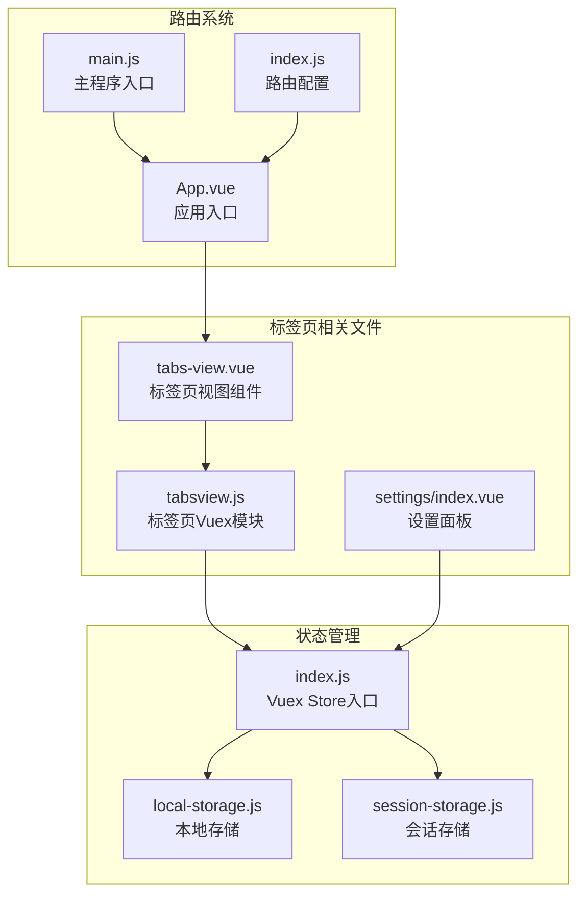
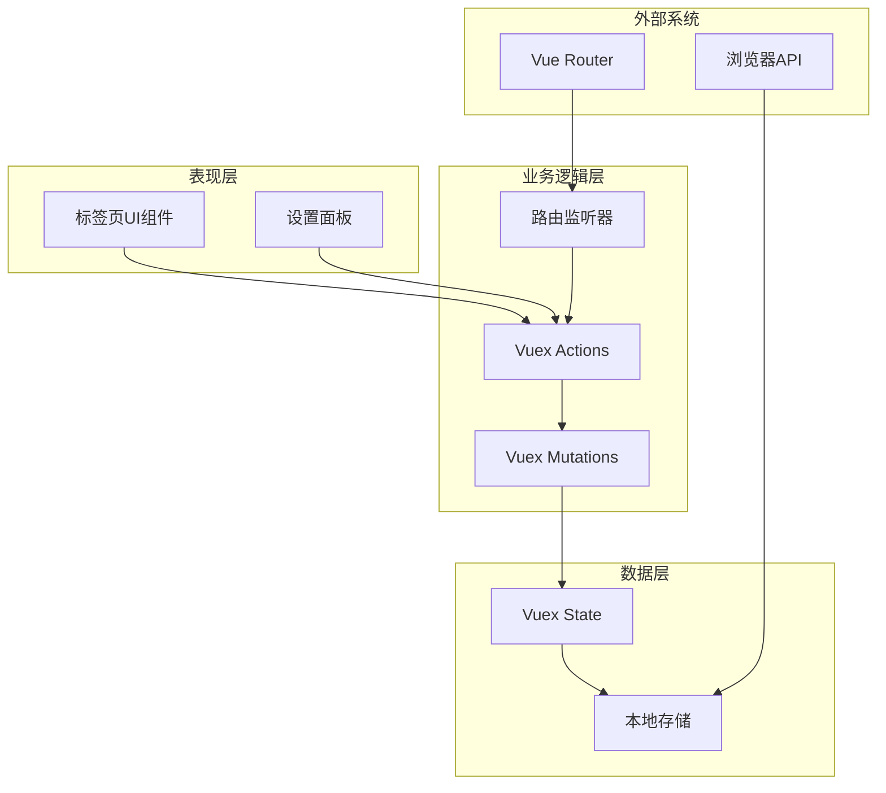
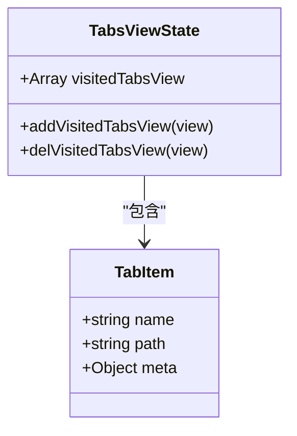
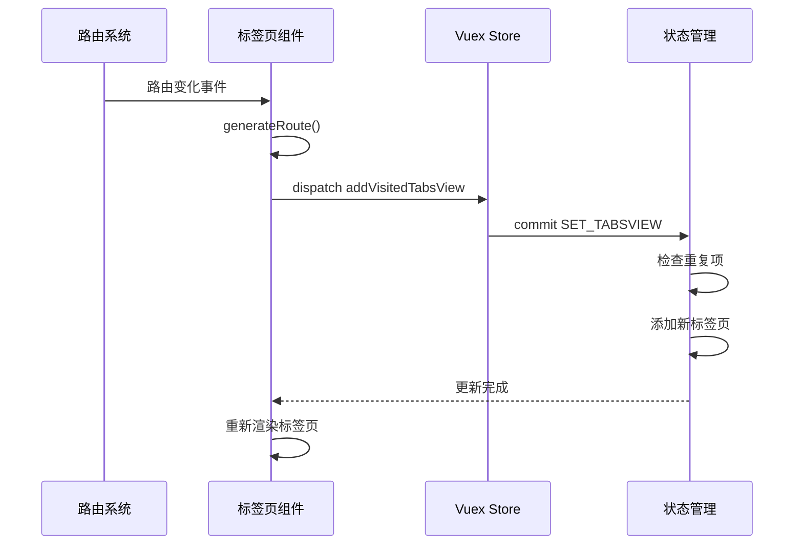
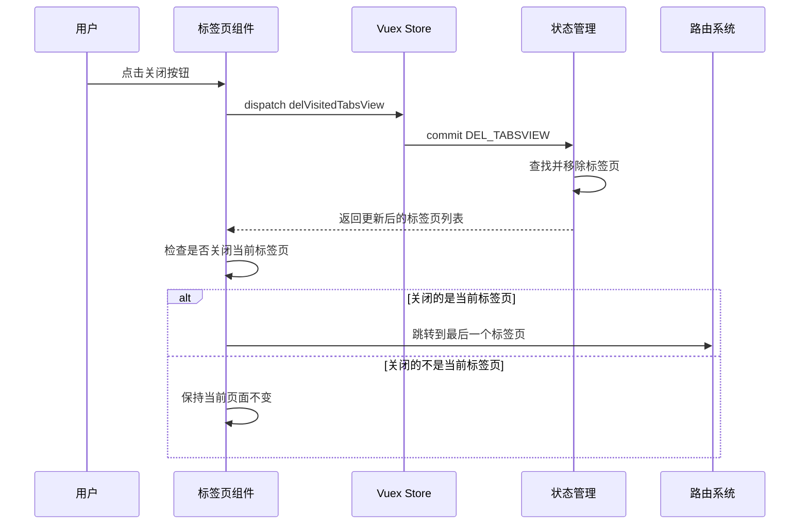
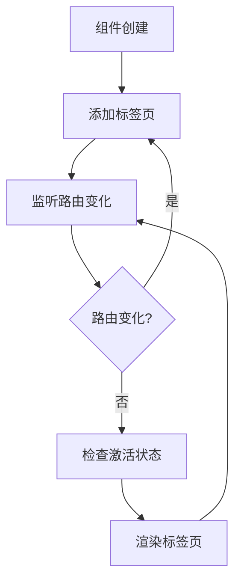
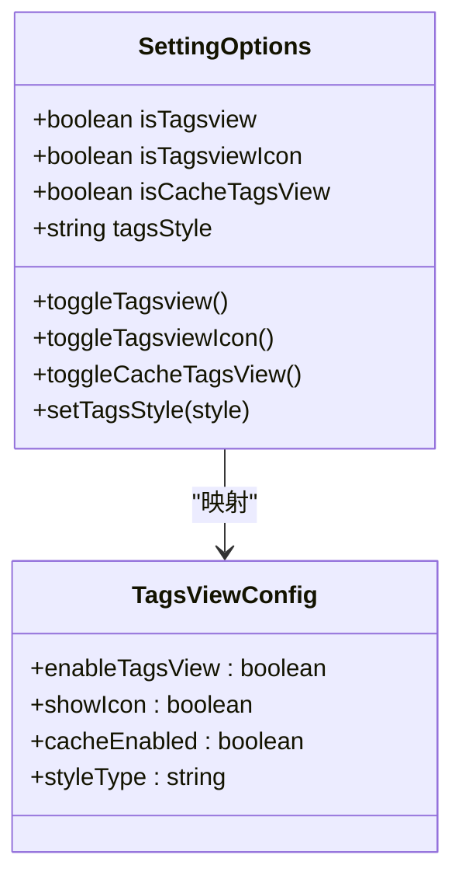
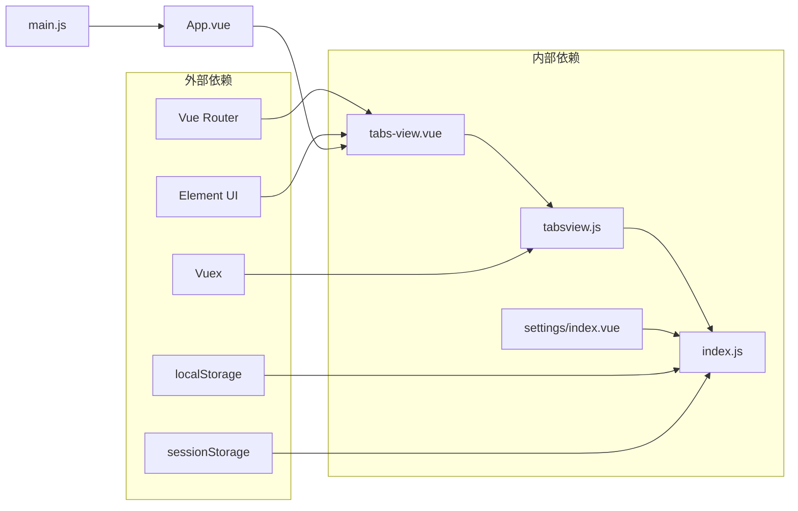

# 标签页状态模块

<cite>
**本文档引用的文件**
- [src/store/modules/tabsview.js](file://src/store/modules/tabsview.js)
- [src/layout/tabs-view.vue](file://src/layout/tabs-view.vue)
- [src/router/index.js](file://src/router/index.js)
- [src/store/index.js](file://src/store/index.js)
- [src/common/local-storage.js](file://src/common/local-storage.js)
- [src/common/session-storage.js](file://src/common/session-storage.js)
- [src/layout/settings/index.vue](file://src/layout/settings/index.vue)
- [src/App.vue](file://src/App.vue)
- [src/main.js](file://src/main.js)
</cite>

## 目录
1. [简介](#简介)
2. [项目结构](#项目结构)
3. [核心组件](#核心组件)
4. [架构概览](#架构概览)
5. [详细组件分析](#详细组件分析)
6. [依赖关系分析](#依赖关系分析)
7. [性能考虑](#性能考虑)
8. [故障排除指南](#故障排除指南)
9. [结论](#结论)

## 简介

标签页状态模块是Vue CMS项目中的一个重要功能组件，负责管理用户界面中的标签页状态。该模块实现了标签页的添加、关闭、切换和缓存机制，并与路由系统保持同步。通过Vuex状态管理，标签页状态能够在整个应用中保持一致性和响应性。

本模块提供了灵活的配置选项，包括标签页样式的切换、图标显示控制以及缓存策略的配置。同时，它还支持标签页的动态生成和销毁，确保了良好的用户体验和性能表现。

## 项目结构

标签页状态模块主要分布在以下文件中：

**图表来源**
- [src/layout/tabs-view.vue:1-209](file://src/layout/tabs-view.vue#L1-L209)
- [src/store/modules/tabsview.js:1-49](file://src/store/modules/tabsview.js#L1-L49)
- [src/store/index.js:1-74](file://src/store/index.js#L1-L74)

**章节来源**
- [src/layout/tabs-view.vue:1-209](file://src/layout/tabs-view.vue#L1-L209)
- [src/store/modules/tabsview.js:1-49](file://src/store/modules/tabsview.js#L1-L49)
- [src/store/index.js:1-74](file://src/store/index.js#L1-L74)

## 核心组件

标签页状态模块的核心组件包括：

### 标签页Vuex模块
- **状态管理**: 维护visitedTabsView数组，存储所有已访问的标签页信息
- **动作处理**: 提供addVisitedTabsView和delVisitedTabsView两个核心操作
- **数据结构**: 每个标签页包含name、path和meta信息

### 标签页视图组件
- **路由集成**: 自动监听路由变化，动态添加标签页
- **UI渲染**: 使用Element UI的标签组件展示标签页
- **交互功能**: 支持标签页关闭、激活状态显示

### 设置面板集成
- **配置选项**: 提供标签页开关、图标显示、缓存策略等设置
- **实时生效**: 设置变更立即影响标签页行为

**章节来源**
- [src/store/modules/tabsview.js:4-48](file://src/store/modules/tabsview.js#L4-L48)
- [src/layout/tabs-view.vue:18-81](file://src/layout/tabs-view.vue#L18-L81)
- [src/layout/settings/index.vue:50-79](file://src/layout/settings/index.vue#L50-L79)

## 架构概览

标签页状态模块采用分层架构设计，各层职责明确：

**图表来源**
- [src/layout/tabs-view.vue:24-80](file://src/layout/tabs-view.vue#L24-L80)
- [src/store/modules/tabsview.js:8-41](file://src/store/modules/tabsview.js#L8-L41)
- [src/store/index.js:24-68](file://src/store/index.js#L24-L68)

## 详细组件分析

### 标签页Vuex模块分析

#### 状态结构设计
标签页状态采用简化的数据结构，仅存储必要的元信息：

**图表来源**
- [src/store/modules/tabsview.js:4-18](file://src/store/modules/tabsview.js#L4-L18)

#### 核心操作流程

##### 标签页添加流程

**图表来源**
- [src/layout/tabs-view.vue:38-44](file://src/layout/tabs-view.vue#L38-L44)
- [src/store/modules/tabsview.js:9-18](file://src/store/modules/tabsview.js#L9-L18)

##### 标签页关闭流程

**图表来源**
- [src/layout/tabs-view.vue:54-67](file://src/layout/tabs-view.vue#L54-L67)
- [src/store/modules/tabsview.js:20-26](file://src/store/modules/tabsview.js#L20-L26)

**章节来源**
- [src/store/modules/tabsview.js:1-49](file://src/store/modules/tabsview.js#L1-L49)
- [src/layout/tabs-view.vue:34-81](file://src/layout/tabs-view.vue#L34-L81)

### 标签页视图组件分析

#### 生命周期管理
标签页组件采用Vue的生命周期钩子进行初始化和更新：

**图表来源**
- [src/layout/tabs-view.vue:24-80](file://src/layout/tabs-view.vue#L24-L80)

#### UI交互设计
组件提供了丰富的用户交互功能：

| 功能 | 实现方式 | 用户体验 |
|------|----------|----------|
| 标签页关闭 | ElTag组件的close事件 | 直观的关闭操作 |
| 标签页切换 | router-link导航 | 平滑的页面切换 |
| 图标显示 | 条件渲染不同图标类型 | 视觉层次丰富 |
| 滚轮滚动 | 滚轮事件处理 | 方便的横向浏览 |

**章节来源**
- [src/layout/tabs-view.vue:1-209](file://src/layout/tabs-view.vue#L1-L209)

### 设置面板集成分析

#### 配置选项设计
设置面板提供了多个与标签页相关的配置选项：

**图表来源**
- [src/layout/settings/index.vue:51-79](file://src/layout/settings/index.vue#L51-L79)

**章节来源**
- [src/layout/settings/index.vue:192-305](file://src/layout/settings/index.vue#L192-L305)

## 依赖关系分析

标签页状态模块的依赖关系清晰且层次分明：

**图表来源**
- [src/layout/tabs-view.vue:19-37](file://src/layout/tabs-view.vue#L19-L37)
- [src/store/modules/tabsview.js:1-49](file://src/store/modules/tabsview.js#L1-L49)
- [src/store/index.js:10-17](file://src/store/index.js#L10-L17)

### 关键依赖点

1. **路由系统集成**: 通过$route监听器自动管理标签页生命周期
2. **状态管理耦合**: 与Vuex store紧密集成，确保状态一致性
3. **UI框架依赖**: 依赖Element UI的标签组件和滚动组件
4. **存储系统**: 与本地存储和会话存储配合实现持久化

**章节来源**
- [src/layout/tabs-view.vue:19-37](file://src/layout/tabs-view.vue#L19-L37)
- [src/store/index.js:10-17](file://src/store/index.js#L10-L17)

## 性能考虑

### 内存管理策略
- **标签页数量控制**: 当前实现未设置标签页数量上限，需要在实际应用中考虑内存使用情况
- **组件销毁**: 路由离开时自动清理相关资源
- **状态最小化**: 仅存储必要信息，避免冗余数据

### 渲染优化
- **条件渲染**: 根据设置动态显示标签页元素
- **懒加载**: 路由组件按需加载
- **虚拟滚动**: 对于大量标签页场景可考虑实现虚拟滚动

### 缓存策略
- **会话级缓存**: 使用sessionStorage存储临时状态
- **持久化存储**: 结合localStorage实现跨会话状态保持
- **智能缓存**: 根据用户行为调整缓存策略

## 故障排除指南

### 常见问题及解决方案

#### 标签页不显示
**可能原因**:
- 路由配置问题
- 权限控制导致路由不可访问
- 设置面板禁用了标签页显示

**解决步骤**:
1. 检查路由配置是否正确
2. 验证用户权限设置
3. 确认设置面板中标签页功能已启用

#### 标签页无法关闭
**可能原因**:
- 事件绑定问题
- 状态更新延迟
- 路由跳转冲突

**调试方法**:
1. 检查控制台错误信息
2. 验证Vuex action执行情况
3. 确认路由跳转逻辑

#### 标签页状态丢失
**可能原因**:
- 浏览器刷新导致状态丢失
- 存储空间不足
- 数据格式错误

**预防措施**:
1. 实现状态持久化机制
2. 添加数据验证和错误处理
3. 提供状态恢复功能

**章节来源**
- [src/layout/tabs-view.vue:54-67](file://src/layout/tabs-view.vue#L54-L67)
- [src/common/local-storage.js:1-41](file://src/common/local-storage.js#L1-L41)
- [src/common/session-storage.js:1-48](file://src/common/session-storage.js#L1-L48)

## 结论

标签页状态模块展现了良好的架构设计和实现质量。通过清晰的分层结构、合理的状态管理策略以及与路由系统的深度集成，该模块为用户提供了流畅的多标签页浏览体验。

### 主要优势
- **架构清晰**: 分层设计使得各组件职责明确
- **扩展性强**: 模块化设计便于功能扩展和维护
- **用户体验好**: 响应式设计和流畅的交互体验
- **配置灵活**: 丰富的设置选项满足不同需求

### 改进建议
1. **添加标签页数量限制**: 防止内存泄漏和性能问题
2. **实现拖拽排序功能**: 提升用户操作效率
3. **增强错误处理**: 提供更完善的异常处理机制
4. **优化大标签页集合性能**: 考虑虚拟滚动等优化技术

该模块为Vue CMS项目提供了坚实的基础，通过持续的优化和完善，能够更好地服务于用户的各种应用场景。