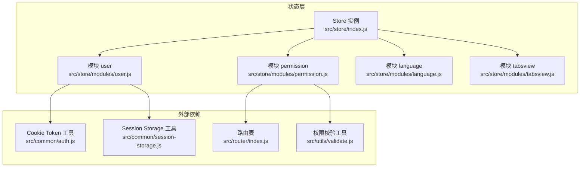
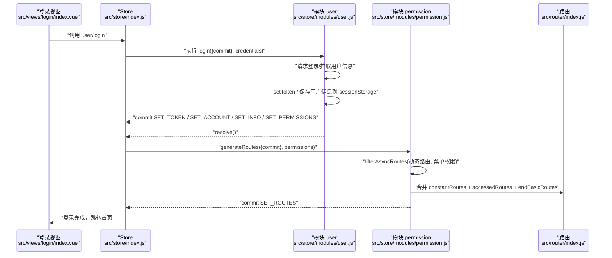
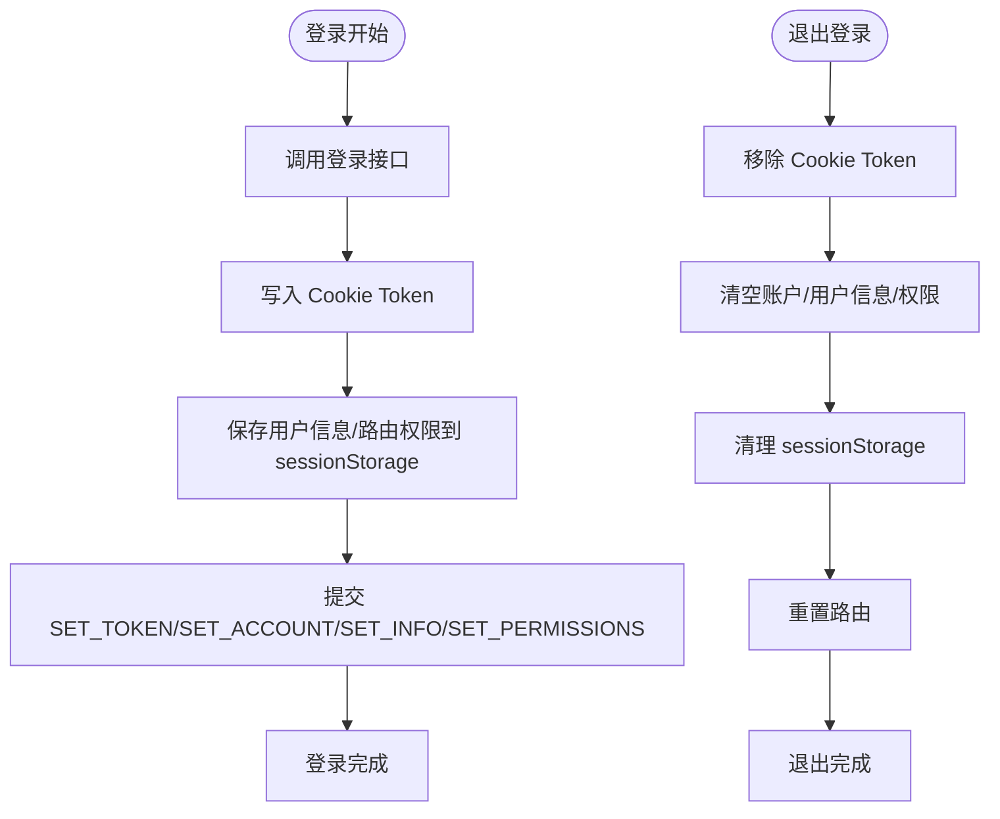
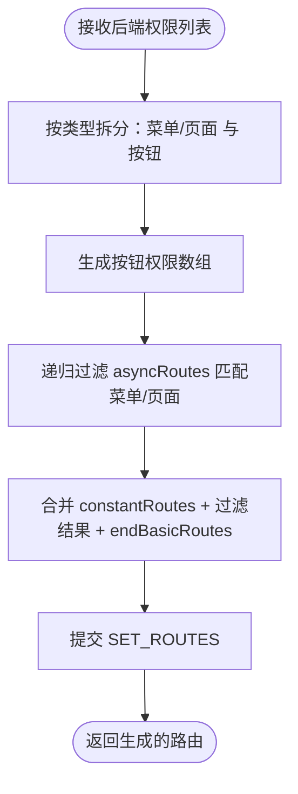
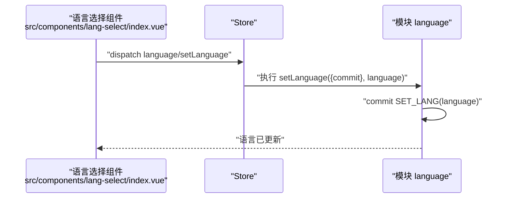
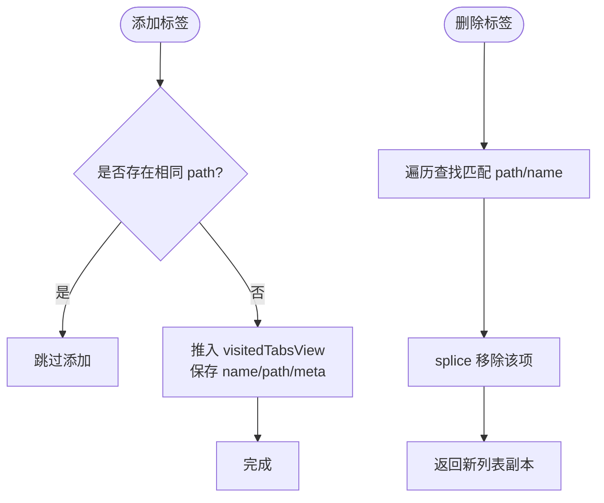
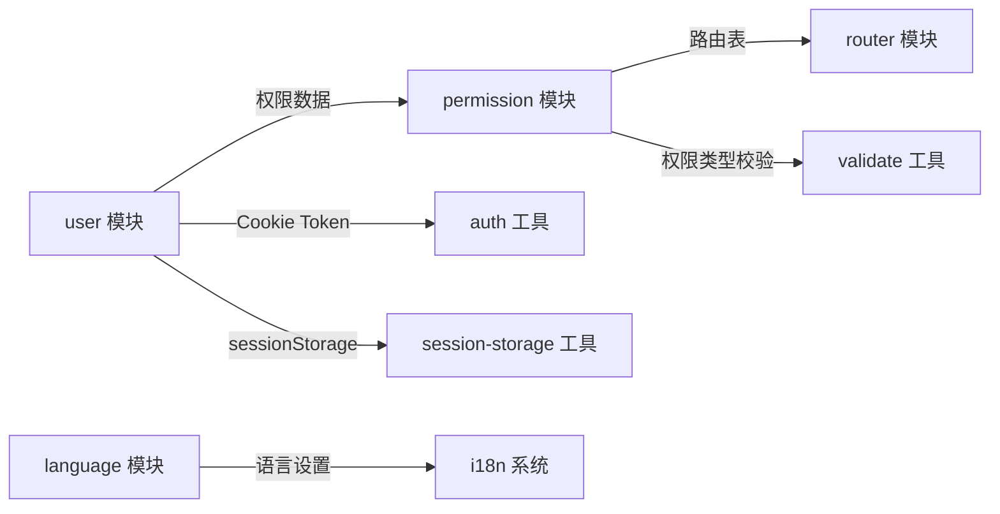

# 状态管理

<cite>
**本文引用的文件**
- [src/store/index.js](file://src/store/index.js)
- [src/store/modules/user.js](file://src/store/modules/user.js)
- [src/store/modules/permission.js](file://src/store/modules/permission.js)
- [src/store/modules/language.js](file://src/store/modules/language.js)
- [src/store/modules/tabsview.js](file://src/store/modules/tabsview.js)
- [src/common/auth.js](file://src/common/auth.js)
- [src/common/session-storage.js](file://src/common/session-storage.js)
- [src/utils/validate.js](file://src/utils/validate.js)
- [src/router/index.js](file://src/router/index.js)
- [src/main.js](file://src/main.js)
- [src/views/login/index.vue](file://src/views/login/index.vue)
- [src/layout/header.vue](file://src/layout/header.vue)
- [src/components/lang-select/index.vue](file://src/components/lang-select/index.vue)
</cite>

## 目录
1. [简介](#简介)
2. [项目结构](#项目结构)
3. [核心组件](#核心组件)
4. [架构总览](#架构总览)
5. [详细组件分析](#详细组件分析)
6. [依赖分析](#依赖分析)
7. [性能考虑](#性能考虑)
8. [故障排除指南](#故障排除指南)
9. [结论](#结论)
10. [附录](#附录)

## 简介
本文件系统性梳理 Vue CMS 的状态管理方案，围绕 Vuex 的模块化设计与自动注册机制，深入解析用户状态、权限状态、语言状态、标签页状态等核心模块的职责边界、数据流与持久化策略。同时总结 Action/Mutation 的使用模式、异步处理策略、调试与排错方法，并给出最佳实践与性能优化建议，帮助开发者高效扩展与维护状态管理。

## 项目结构
- 状态入口与模块自动注册
  - 通过 require.context 扫描 modules 目录，自动导入各模块并挂载到 Store 实例，避免手动维护模块清单，降低耦合与遗漏风险。
- 模块划分
  - user：用户登录态、账户信息、头像、权限标识等。
  - permission：路由/菜单/按钮权限的生成与合并。
  - language：国际化语言选择与持久化。
  - tabsview：多页签浏览记录与关闭。
- 全局 getters：统一对外取值入口，提供便捷访问与路径适配能力。

图示来源
- [src/store/index.js:10-17](file://src/store/index.js#L10-L17)
- [src/store/modules/user.js:1-29](file://src/store/modules/user.js#L1-L29)
- [src/store/modules/permission.js:1-14](file://src/store/modules/permission.js#L1-L14)
- [src/store/modules/language.js:1-7](file://src/store/modules/language.js#L1-L7)
- [src/store/modules/tabsview.js:1-6](file://src/store/modules/tabsview.js#L1-L6)
- [src/router/index.js:43-320](file://src/router/index.js#L43-L320)
- [src/common/auth.js:1-18](file://src/common/auth.js#L1-L18)
- [src/common/session-storage.js:19-45](file://src/common/session-storage.js#L19-L45)
- [src/utils/validate.js:24-55](file://src/utils/validate.js#L24-L55)

章节来源
- [src/store/index.js:1-74](file://src/store/index.js#L1-L74)

## 核心组件
- Store 入口与自动模块注册
  - 使用 require.context 扫描 modules 下的 JS 文件，按文件名作为模块名注入，减少手工维护成本。
  - 全局 getters 统一暴露常用派生状态，如用户信息、头像、语言、路由集合等。
- 模块命名空间
  - 各模块均启用 namespaced: true，避免命名冲突，提升可维护性。
- 模块间协作
  - permission 依赖 router 的常量/动态路由与工具函数进行权限过滤与路由拼装。
  - user 与 permission 通过登录流程联动，生成用户专属路由并持久化至 sessionStorage。
  - language 与 i18n 集成，通过组件触发 action 切换语言并持久化。

章节来源
- [src/store/index.js:10-17](file://src/store/index.js#L10-L17)
- [src/store/index.js:24-68](file://src/store/index.js#L24-L68)
- [src/store/modules/user.js:148-153](file://src/store/modules/user.js#L148-L153)
- [src/store/modules/permission.js:181-186](file://src/store/modules/permission.js#L181-L186)
- [src/store/modules/language.js:20-25](file://src/store/modules/language.js#L20-L25)

## 架构总览
下图展示登录流程中状态与路由的关键交互：用户模块发起登录请求，写入 token 与用户信息，生成路由并合并至全局路由表，随后进入首页并初始化标签页。

图示来源
- [src/views/login/index.vue:110-153](file://src/views/login/index.vue#L110-L153)
- [src/store/modules/user.js:52-110](file://src/store/modules/user.js#L52-L110)
- [src/store/modules/permission.js:143-178](file://src/store/modules/permission.js#L143-L178)
- [src/router/index.js:43-111](file://src/router/index.js#L43-L111)

## 详细组件分析

### 用户状态模块（user）
- 设计要点
  - 状态结构：token、账户、用户信息（含头像、姓名、性别、年龄、类型、描述）、原始权限。
  - 持久化策略：token 写入 Cookie；用户信息与路由权限写入 sessionStorage，便于会话内共享。
  - 计算属性：通过 getters 提供头像路径适配（处理子目录部署场景）与组合全量用户信息。
- 关键流程
  - 登录：调用登录接口，成功后写入 token 与用户信息，提交多个 mutation 并持久化。
  - 退出：移除 token，清空账户与用户信息，清理 sessionStorage，并重置路由。
  - 头像/资料更新：本地先更新，再进行后续异步同步（示例中使用延时模拟）。
- 与路由的关系
  - 登录成功后，permission 模块基于返回的权限数据过滤动态路由并合并至全局路由表。

图示来源
- [src/store/modules/user.js:52-110](file://src/store/modules/user.js#L52-L110)
- [src/common/auth.js:5-15](file://src/common/auth.js#L5-L15)
- [src/common/session-storage.js:19-45](file://src/common/session-storage.js#L19-L45)

章节来源
- [src/store/modules/user.js:1-154](file://src/store/modules/user.js#L1-L154)
- [src/common/auth.js:1-18](file://src/common/auth.js#L1-L18)
- [src/common/session-storage.js:1-48](file://src/common/session-storage.js#L1-L48)
- [src/store/index.js:24-68](file://src/store/index.js#L24-L68)

### 权限状态模块（permission）
- 设计要点
  - 状态结构：按钮权限数组、最终路由集合、动态添加的路由片段。
  - 路由过滤：根据后端返回的权限条目（含 address/type），递归匹配前端 asyncRoutes，保留命中或存在有效子节点的路由。
  - 权限类型：通过工具函数区分菜单/页面/按钮三类权限，分别用于生成路由与按钮可见性。
- 关键流程
  - generateRoutes：拆分菜单与按钮权限，生成按钮权限数组，过滤动态路由，追加末尾基础路由，提交 SET_ROUTES。
- 与路由的关系
  - 与 constantRoutes/endBasicRoutes 合并，形成完整路由表，供全局路由使用。

图示来源
- [src/store/modules/permission.js:143-178](file://src/store/modules/permission.js#L143-L178)
- [src/utils/validate.js:24-55](file://src/utils/validate.js#L24-L55)
- [src/router/index.js:43-320](file://src/router/index.js#L43-L320)

章节来源
- [src/store/modules/permission.js:1-187](file://src/store/modules/permission.js#L1-L187)
- [src/utils/validate.js:1-56](file://src/utils/validate.js#L1-L56)
- [src/router/index.js:1-343](file://src/router/index.js#L1-L343)

### 语言状态模块（language）
- 设计要点
  - 状态结构：当前语言 code。
  - 变更流程：action 触发 mutation，mutation 写入语言并调用通用语言设置工具持久化。
- 与组件集成
  - 语言选择组件通过 mapGetters 读取当前语言，通过 mapActions 触发 setLanguage，实现双向绑定与持久化。

图示来源
- [src/components/lang-select/index.vue:14-31](file://src/components/lang-select/index.vue#L14-L31)
- [src/store/modules/language.js:14-18](file://src/store/modules/language.js#L14-L18)

章节来源
- [src/store/modules/language.js:1-26](file://src/store/modules/language.js#L1-L26)
- [src/components/lang-select/index.vue:1-39](file://src/components/lang-select/index.vue#L1-L39)

### 标签页状态模块（tabsview）
- 设计要点
  - 状态结构：已访问的标签页列表。
  - 变更流程：添加时去重并保存标题键、路径与元信息；删除时按路径或名称定位并移除。
  - 异步返回：删除动作返回新的列表副本，便于组件侧同步 UI。
- 与布局集成
  - 头部导航与标签页视图组件通过 mapGetters 读取 visitedTabsView，结合路由变化动态更新。

图示来源
- [src/store/modules/tabsview.js:8-41](file://src/store/modules/tabsview.js#L8-L41)

章节来源
- [src/store/modules/tabsview.js:1-49](file://src/store/modules/tabsview.js#L1-L49)

### Getter 与全局取值
- 全局 getters 提供统一便捷访问，包括：
  - 标签页列表、用户信息、用户名、头像（含路径适配）、账户、全量用户信息、语言、路由集合、侧边栏折叠状态、设置面板开关、系统设置对象等。
- 路径适配逻辑：对以 /static/ 开头的头像路径进行 BASE_URL 前缀拼接，适配子目录部署。

章节来源
- [src/store/index.js:24-68](file://src/store/index.js#L24-L68)

## 依赖分析
- 模块内聚与耦合
  - user 与 permission 通过登录后的权限数据产生强关联，但彼此独立，降低耦合。
  - language 与 i18n 系统解耦，仅通过 action/mutation 与通用语言工具交互。
  - tabsview 与路由/布局组件松耦合，仅依赖路由元信息。
- 外部依赖
  - Cookie Token：用于跨会话的身份凭证持久化。
  - sessionStorage：用于会话内的用户信息与路由权限缓存。
  - 路由表：constantRoutes、asyncRoutes、endBasicRoutes 三者组合决定最终路由。
  - 权限校验工具：区分菜单/页面/按钮权限类型。

图示来源
- [src/store/modules/user.js:1-29](file://src/store/modules/user.js#L1-L29)
- [src/store/modules/permission.js:1-14](file://src/store/modules/permission.js#L1-L14)
- [src/router/index.js:43-320](file://src/router/index.js#L43-L320)
- [src/common/auth.js:1-18](file://src/common/auth.js#L1-L18)
- [src/common/session-storage.js:1-48](file://src/common/session-storage.js#L1-L48)
- [src/utils/validate.js:24-55](file://src/utils/validate.js#L24-L55)

章节来源
- [src/store/modules/user.js:1-154](file://src/store/modules/user.js#L1-L154)
- [src/store/modules/permission.js:1-187](file://src/store/modules/permission.js#L1-L187)
- [src/router/index.js:1-343](file://src/router/index.js#L1-L343)
- [src/common/auth.js:1-18](file://src/common/auth.js#L1-L18)
- [src/common/session-storage.js:1-48](file://src/common/session-storage.js#L1-L48)
- [src/utils/validate.js:1-56](file://src/utils/validate.js#L1-L56)

## 性能考虑
- 模块自动注册
  - 减少手动引入，避免遗漏与重复，提升构建稳定性。
- 路由过滤算法
  - 递归过滤 asyncRoutes，注意大数据量时的复杂度；可考虑预处理后端权限为索引结构以加速匹配。
- 持久化策略
  - token 使用 Cookie，适合跨标签页共享；会话内数据放入 sessionStorage，避免污染 localStorage。
- 计算属性与派生状态
  - getters 中的路径适配逻辑简单，但涉及字符串处理；建议在高频渲染场景下缓存计算结果或延迟处理。
- 组件绑定
  - 使用 mapGetters/mapActions 降低绑定成本，避免在模板中直接深层取值导致频繁重渲染。

## 故障排除指南
- 登录后无法进入首页或路由缺失
  - 检查后端返回的权限条目是否包含 address 字段，且与前端路由 path 匹配。
  - 确认 generateRoutes 是否正确提交 SET_ROUTES，以及 endBasicRoutes 是否被追加。
- 退出登录后仍可访问受保护路由
  - 确认退出流程是否调用了 removeToken、清空了用户信息与权限，并清理了 sessionStorage。
  - 确认 resetRouter 是否被调用以重建路由实例。
- 头像路径异常（子目录部署）
  - 检查 getters 中的路径适配逻辑是否生效，确认 BASE_URL 与 /static/ 前缀处理。
- 语言切换无效
  - 确认语言组件是否正确 dispatch language/setLanguage，mutation 是否写入并调用语言设置工具。
- 标签页未更新
  - 确认路由变化是否触发了标签页添加/删除逻辑，确保去重与元信息保存正常。

章节来源
- [src/store/modules/permission.js:22-54](file://src/store/modules/permission.js#L22-L54)
- [src/store/modules/user.js:91-110](file://src/store/modules/user.js#L91-L110)
- [src/store/index.js:32-40](file://src/store/index.js#L32-L40)
- [src/store/modules/language.js:8-17](file://src/store/modules/language.js#L8-L17)
- [src/store/modules/tabsview.js:8-41](file://src/store/modules/tabsview.js#L8-L41)

## 结论
本项目采用模块化、自动注册与命名空间化的 Vuex 架构，配合清晰的持久化策略与工具链，实现了用户、权限、语言、标签页等核心状态的高内聚低耦合管理。通过统一的 getters 与组件映射，状态变更与响应式更新清晰可控。建议在后续扩展中遵循现有模式，保持模块职责单一、命名规范统一，并持续关注路由过滤与计算属性的性能表现。

## 附录
- 状态与组件绑定关系
  - 登录视图通过 mapActions 调用 user/login，完成后跳转首页。
  - 头部导航通过 mapGetters 读取用户信息与路由集合，通过 mapActions 触发用户退出与设置面板开关。
  - 语言选择组件通过 mapGetters 读取语言，通过 mapActions 切换语言。
- 响应式更新机制
  - 组件通过 mapGetters 订阅状态变化；当 mutation 或 action 修改状态后，组件自动重渲染。
- 新模块开发指引
  - 在 modules 下新建模块文件，导出 namespaced: true 的 state/mutations/actions。
  - 若需全局访问，可在 store/index.js 的 getters 中新增 getter。
  - 若涉及持久化，优先使用 Cookie（token）与 sessionStorage（会话内数据），避免污染持久化存储。
  - 若涉及路由权限，参考 permission 模块的过滤与合并策略，确保与 constantRoutes/endBasicRoutes 协同。

章节来源
- [src/views/login/index.vue:110-153](file://src/views/login/index.vue#L110-L153)
- [src/layout/header.vue:86-114](file://src/layout/header.vue#L86-L114)
- [src/components/lang-select/index.vue:14-31](file://src/components/lang-select/index.vue#L14-L31)
- [src/store/index.js:24-68](file://src/store/index.js#L24-L68)
- [src/store/modules/user.js:148-153](file://src/store/modules/user.js#L148-L153)
- [src/store/modules/permission.js:181-186](file://src/store/modules/permission.js#L181-L186)
- [src/store/modules/language.js:20-25](file://src/store/modules/language.js#L20-L25)
- [src/store/modules/tabsview.js:43-48](file://src/store/modules/tabsview.js#L43-L48)