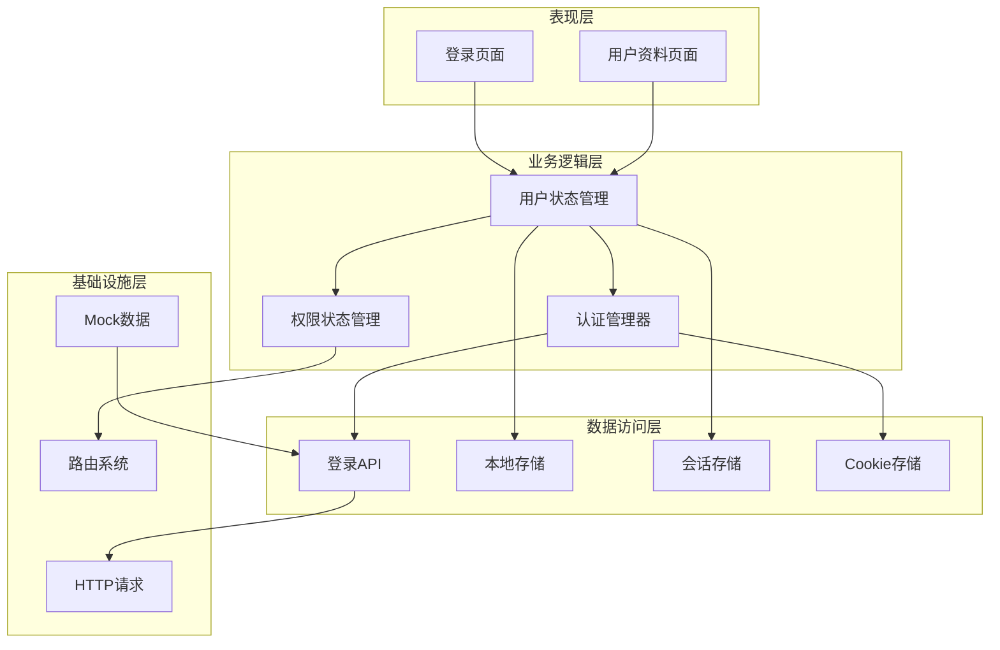
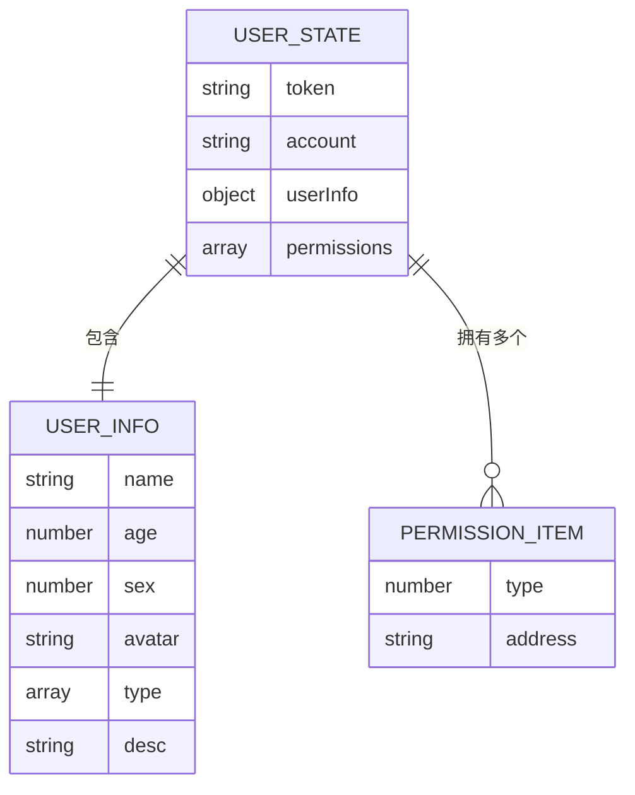
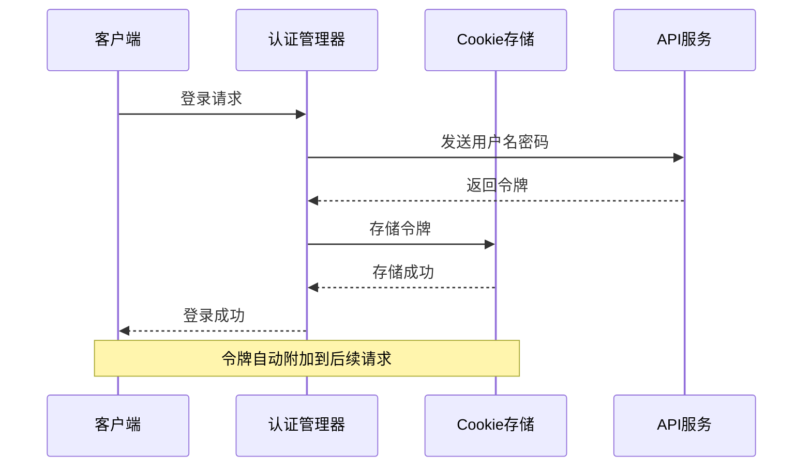
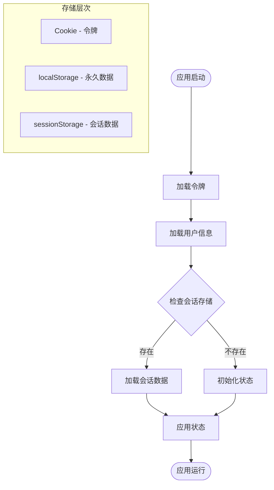
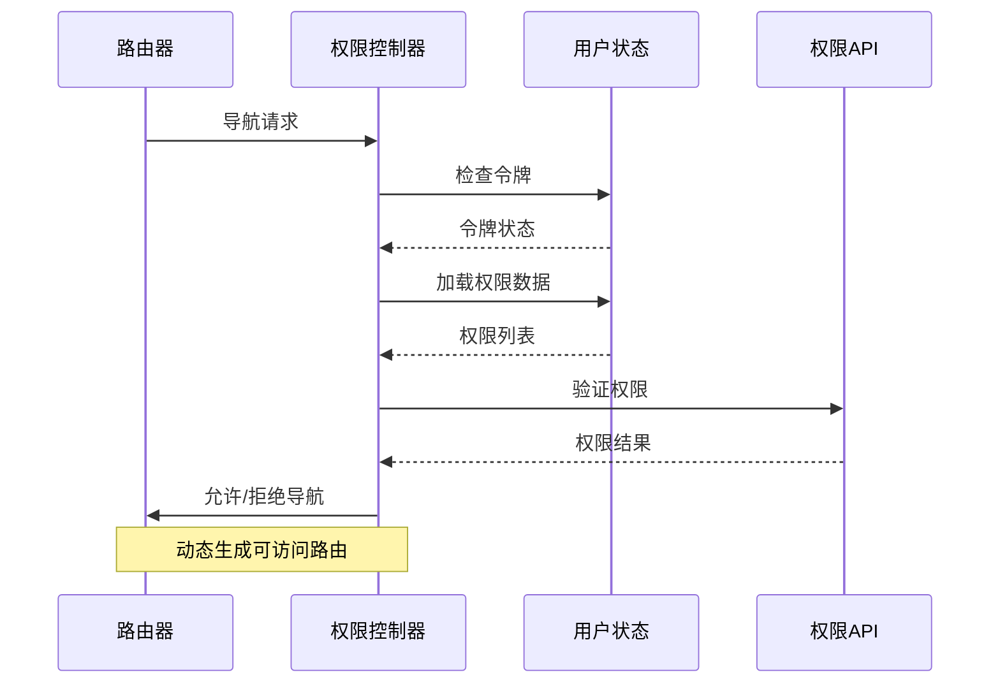
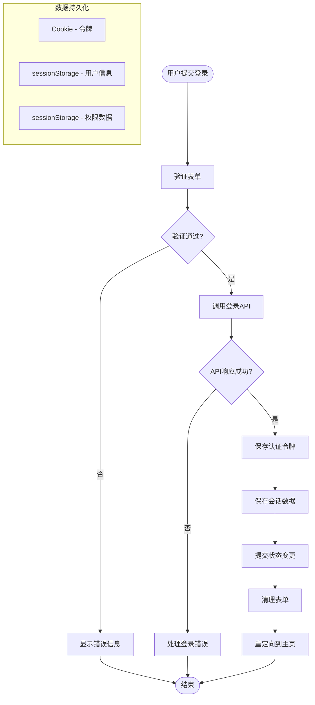
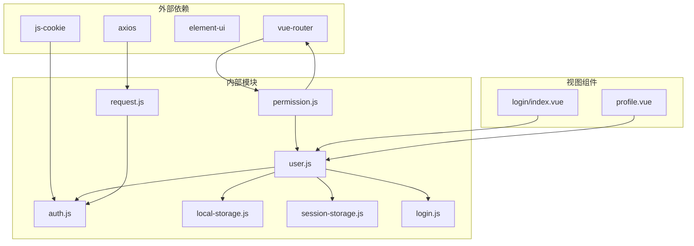

# 用户状态模块

<cite>
**本文档引用的文件**
- [src/store/modules/user.js](file://src/store/modules/user.js)
- [src/common/auth.js](file://src/common/auth.js)
- [src/common/local-storage.js](file://src/common/local-storage.js)
- [src/common/session-storage.js](file://src/common/session-storage.js)
- [src/api/login.js](file://src/api/login.js)
- [src/mock/modules/user.js](file://src/mock/modules/user.js)
- [src/store/index.js](file://src/store/index.js)
- [src/router/index.js](file://src/router/index.js)
- [src/permission.js](file://src/permission.js)
- [src/utils/request.js](file://src/utils/request.js)
- [src/views/login/index.vue](file://src/views/login/index.vue)
- [src/store/modules/permission.js](file://src/store/modules/permission.js)
- [src/main.js](file://src/main.js)
</cite>

## 目录
1. [简介](#简介)
2. [项目结构](#项目结构)
3. [核心组件](#核心组件)
4. [架构概览](#架构概览)
5. [详细组件分析](#详细组件分析)
6. [依赖关系分析](#依赖关系分析)
7. [性能考虑](#性能考虑)
8. [故障排除指南](#故障排除指南)
9. [结论](#结论)

## 简介

用户状态模块是Vue CMS项目的核心功能模块之一，负责管理用户的身份认证、权限控制和状态持久化。该模块实现了完整的用户生命周期管理，包括登录认证、权限验证、状态同步和数据持久化等功能。

本模块采用Vuex状态管理模式，结合Cookie、localStorage和sessionStorage三种存储机制，确保用户状态在不同场景下的可靠性和安全性。同时，通过与路由守卫的深度集成，实现了基于权限的动态路由生成和访问控制。

## 项目结构

用户状态模块主要分布在以下文件中：

```mermaid
graph TB
subgraph "用户状态模块结构"
A[src/store/modules/user.js<br/>用户状态管理]
B[src/common/auth.js<br/>认证令牌管理]
C[src/common/local-storage.js<br/>本地存储管理]
D[src/common/session-storage.js<br/>会话存储管理]
E[src/api/login.js<br/>登录API接口]
F[src/store/index.js<br/>Vuex Store配置]
G[src/permission.js<br/>权限控制]
H[src/router/index.js<br/>路由配置]
</subgraph>
subgraph "视图层"
I[src/views/login/index.vue<br/>登录页面]
J[src/store/modules/permission.js<br/>权限模块]
</subgraph
A --> B
A --> C
A --> D
A --> E
F --> A
G --> A
G --> H
I --> A
J --> H
```

**图表来源**
- [src/store/modules/user.js:1-154](file://src/store/modules/user.js#L1-L154)
- [src/common/auth.js:1-18](file://src/common/auth.js#L1-L18)
- [src/store/index.js:1-74](file://src/store/index.js#L1-L74)

**章节来源**
- [src/store/modules/user.js:1-154](file://src/store/modules/user.js#L1-L154)
- [src/store/index.js:1-74](file://src/store/index.js#L1-L74)

## 核心组件

用户状态模块包含以下核心组件：

### 用户状态管理器
负责管理用户的基本信息、权限数据和登录状态，提供完整的CRUD操作接口。

### 认证令牌管理器
通过Cookie机制管理用户的认证令牌，确保令牌的安全存储和传输。

### 存储管理器
提供localStorage和sessionStorage的统一接口，支持数据的持久化和临时存储。

### 权限控制器
基于用户权限动态生成可访问的路由和菜单，实现细粒度的访问控制。

**章节来源**
- [src/store/modules/user.js:13-29](file://src/store/modules/user.js#L13-L29)
- [src/common/auth.js:5-15](file://src/common/auth.js#L5-L15)
- [src/common/local-storage.js:13-39](file://src/common/local-storage.js#L13-L39)

## 架构概览

用户状态模块采用分层架构设计，各层职责明确，耦合度低：



**图表来源**
- [src/views/login/index.vue:118-153](file://src/views/login/index.vue#L118-L153)
- [src/store/modules/user.js:52-146](file://src/store/modules/user.js#L52-L146)
- [src/permission.js:23-91](file://src/permission.js#L23-L91)

## 详细组件分析

### 用户状态管理器

用户状态管理器是整个模块的核心，负责管理用户的所有状态信息：

#### 状态结构设计



**图表来源**
- [src/store/modules/user.js:13-29](file://src/store/modules/user.js#L13-L29)

#### 核心功能实现

1. **登录状态管理**
   - 令牌验证和存储
   - 用户信息获取和缓存
   - 权限数据解析和应用

2. **用户信息管理**
   - 基本信息更新
   - 头像更换
   - 完整信息编辑

3. **权限状态管理**
   - 路由权限过滤
   - 按钮权限控制
   - 动态路由生成

**章节来源**
- [src/store/modules/user.js:52-146](file://src/store/modules/user.js#L52-L146)

### 认证令牌管理系统

认证令牌管理系统通过Cookie实现安全的令牌存储和传输：

#### 令牌存储机制



**图表来源**
- [src/common/auth.js:5-15](file://src/common/auth.js#L5-L15)
- [src/utils/request.js:24-32](file://src/utils/request.js#L24-L32)

#### 安全特性
- 使用js-cookie库确保跨浏览器兼容性
- 支持令牌的获取、设置和删除
- 集成到HTTP请求拦截器中自动附加令牌

**章节来源**
- [src/common/auth.js:1-18](file://src/common/auth.js#L1-L18)
- [src/utils/request.js:18-52](file://src/utils/request.js#L18-L52)

### 存储管理系统

存储管理系统提供多层数据持久化方案：

#### 数据存储策略



**图表来源**
- [src/store/modules/user.js:14-26](file://src/store/modules/user.js#L14-L26)
- [src/common/session-storage.js:19-45](file://src/common/session-storage.js#L19-L45)

#### 存储机制对比

| 存储类型 | 生命周期 | 安全性 | 适用场景 |
|---------|----------|--------|----------|
| Cookie | 会话/持久 | 高 | 认证令牌 |
| localStorage | 永久 | 中 | 用户偏好设置 |
| sessionStorage | 会话 | 低 | 临时会话数据 |

**章节来源**
- [src/common/local-storage.js:13-39](file://src/common/local-storage.js#L13-L39)
- [src/common/session-storage.js:19-45](file://src/common/session-storage.js#L19-L45)

### 权限控制系统

权限控制系统实现基于用户角色的动态权限管理：

#### 权限验证流程



**图表来源**
- [src/permission.js:23-91](file://src/permission.js#L23-L91)
- [src/store/modules/permission.js:147-178](file://src/store/modules/permission.js#L147-L178)

#### 权限类型定义

| 权限类型 | 数字标识 | 说明 | 示例 |
|---------|----------|------|------|
| 菜单权限 | 1 | 页面/菜单访问权限 | `/user/profile` |
| 页面权限 | 2 | 页面级权限 | `/user/profile/edit` |
| 按钮权限 | 3 | 操作按钮权限 | `user:edit` |

**章节来源**
- [src/store/modules/permission.js:147-178](file://src/store/modules/permission.js#L147-L178)
- [src/mock/modules/user.js:28-141](file://src/mock/modules/user.js#L28-L141)

### 登录认证流程

登录认证流程是用户状态管理的核心业务流程：

#### 登录流程图



**图表来源**
- [src/views/login/index.vue:118-153](file://src/views/login/index.vue#L118-L153)
- [src/store/modules/user.js:54-74](file://src/store/modules/user.js#L54-L74)

#### 登录状态同步

登录成功后，系统需要同步多个状态：

1. **令牌同步**：Cookie中存储认证令牌
2. **用户信息同步**：sessionStorage存储用户基本信息
3. **权限同步**：sessionStorage存储权限数据
4. **路由同步**：动态生成可访问路由

**章节来源**
- [src/views/login/index.vue:118-153](file://src/views/login/index.vue#L118-L153)
- [src/store/modules/user.js:54-74](file://src/store/modules/user.js#L54-L74)

## 依赖关系分析

用户状态模块的依赖关系复杂但清晰：



**图表来源**
- [src/main.js:1-53](file://src/main.js#L1-L53)
- [src/store/modules/user.js:1-5](file://src/store/modules/user.js#L1-L5)

### 模块间耦合度分析

| 模块 | 主要依赖 | 耦合度 | 说明 |
|------|----------|--------|------|
| user.js | auth.js, session-storage.js, login.js | 高 | 核心状态管理 |
| permission.js | router.js, user.js | 中 | 权限控制 |
| auth.js | js-cookie | 低 | 简单工具模块 |
| session-storage.js | 无 | 低 | 简单工具模块 |
| login.js | request.js | 中 | API接口 |

**章节来源**
- [src/store/modules/user.js:1-5](file://src/store/modules/user.js#L1-L5)
- [src/permission.js:1-17](file://src/permission.js#L1-L17)

## 性能考虑

用户状态模块在设计时充分考虑了性能优化：

### 状态缓存策略
- **令牌缓存**：Cookie中缓存认证令牌，避免重复登录
- **用户信息缓存**：sessionStorage缓存用户基本信息，减少API调用
- **权限缓存**：sessionStorage缓存权限数据，提高权限验证速度

### 异步操作优化
- **Promise链式调用**：确保异步操作的顺序执行
- **错误处理**：完善的错误捕获和处理机制
- **状态预加载**：应用启动时预加载必要的用户状态

### 内存管理
- **及时清理**：退出登录时清理所有状态和缓存
- **垃圾回收**：合理释放不再使用的对象引用

## 故障排除指南

### 常见问题及解决方案

#### 登录失败问题
**症状**：用户无法登录，出现认证错误
**可能原因**：
1. 令牌过期或无效
2. 网络请求失败
3. 用户名密码错误

**解决方案**：
1. 检查网络连接和API服务状态
2. 验证用户名密码格式
3. 清除浏览器缓存重新登录

#### 权限验证失败
**症状**：用户登录后无法访问某些页面
**可能原因**：
1. 权限数据未正确加载
2. 动态路由生成失败
3. 会话存储数据损坏

**解决方案**：
1. 检查sessionStorage中的权限数据
2. 重新登录以刷新权限数据
3. 清理浏览器缓存

#### 状态不同步问题
**症状**：用户状态显示不一致
**可能原因**：
1. Vuex状态未正确更新
2. 组件未正确监听状态变化
3. 多标签页状态不同步

**解决方案**：
1. 检查Vuex mutations的执行
2. 确保组件正确使用mapState和computed
3. 实现跨标签页状态同步机制

**章节来源**
- [src/utils/request.js:75-135](file://src/utils/request.js#L75-L135)
- [src/permission.js:46-70](file://src/permission.js#L46-L70)

### 调试技巧

1. **启用开发工具**：使用Vue DevTools监控Vuex状态变化
2. **日志记录**：在关键位置添加console.log输出
3. **状态快照**：定期保存应用状态以便问题复现
4. **网络监控**：使用浏览器开发者工具监控API请求

## 结论

用户状态模块通过精心设计的架构和实现，提供了完整的用户身份认证和权限管理功能。模块采用了分层设计、多存储策略和完善的错误处理机制，确保了系统的稳定性、安全性和可维护性。

### 主要优势
- **模块化设计**：清晰的职责分离和低耦合度
- **多层次存储**：根据数据特性选择合适的存储方案
- **完善的权限控制**：支持细粒度的权限管理和动态路由生成
- **健壮的错误处理**：全面的异常捕获和恢复机制

### 改进建议
- **状态持久化增强**：考虑实现更高级的状态持久化机制
- **性能监控**：添加状态变化的性能监控和分析
- **安全审计**：定期进行安全审计和漏洞扫描
- **测试覆盖**：增加单元测试和集成测试覆盖率

该模块为Vue CMS项目提供了坚实的基础，支持了完整的用户管理功能，并为未来的扩展和维护奠定了良好的基础。