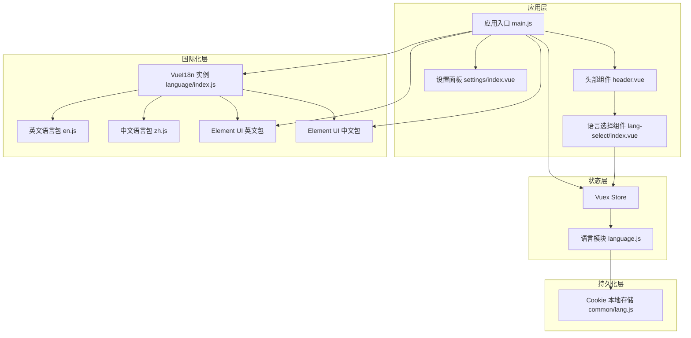
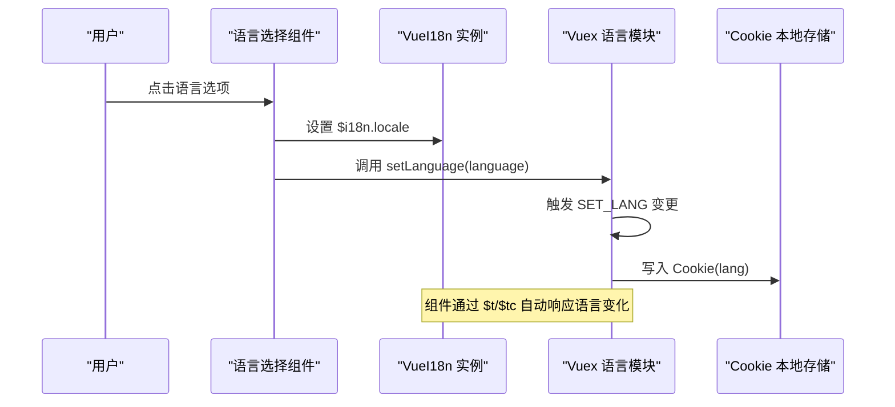
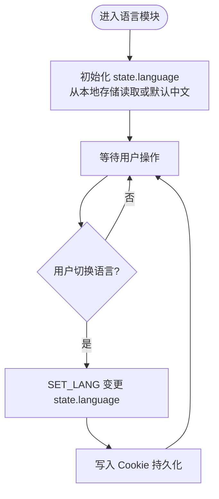
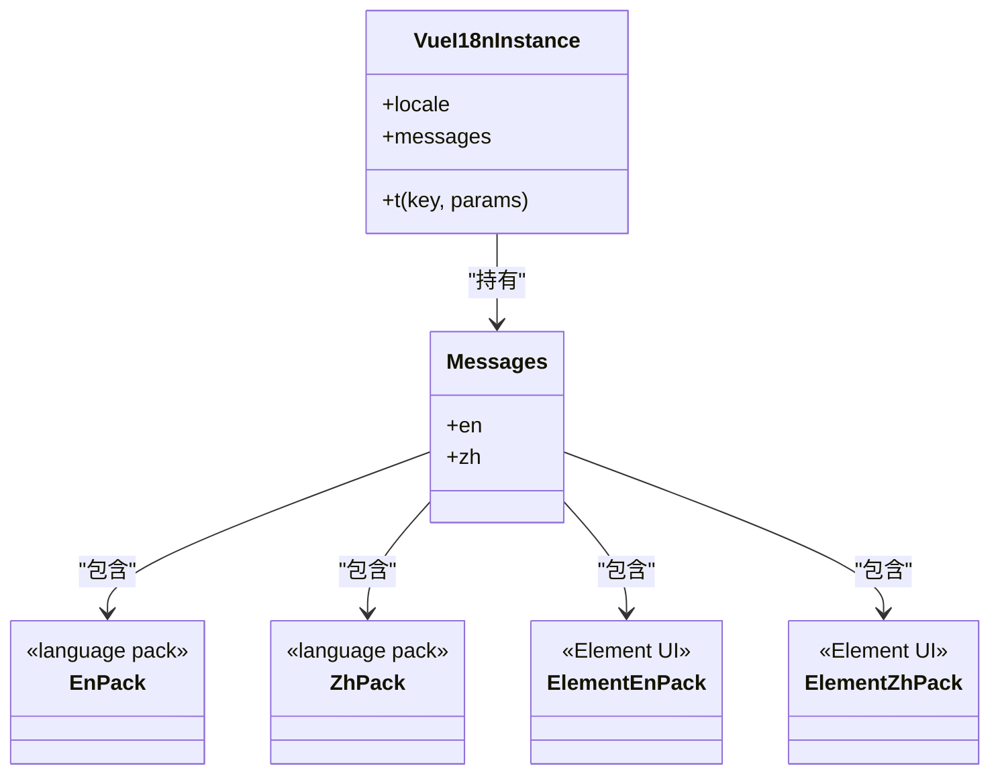
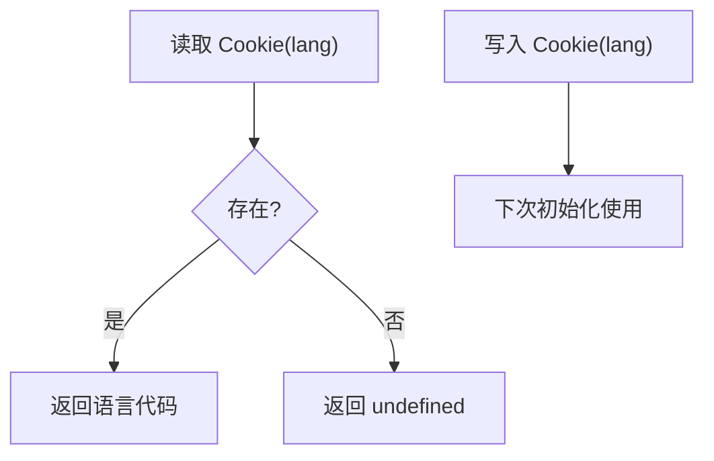
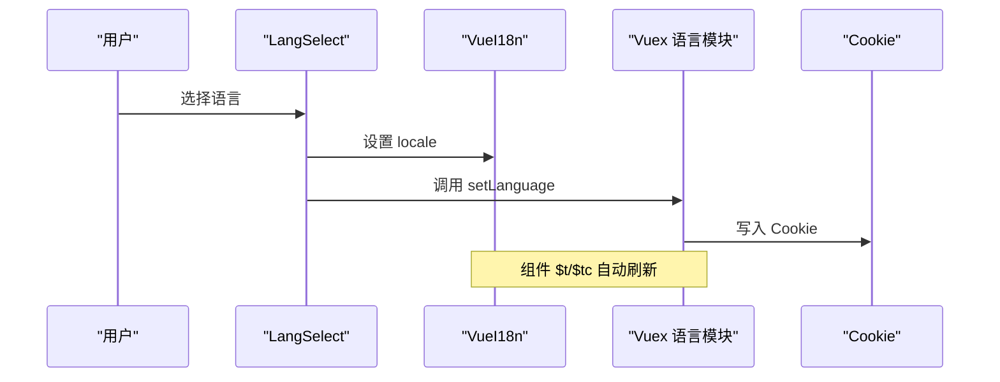
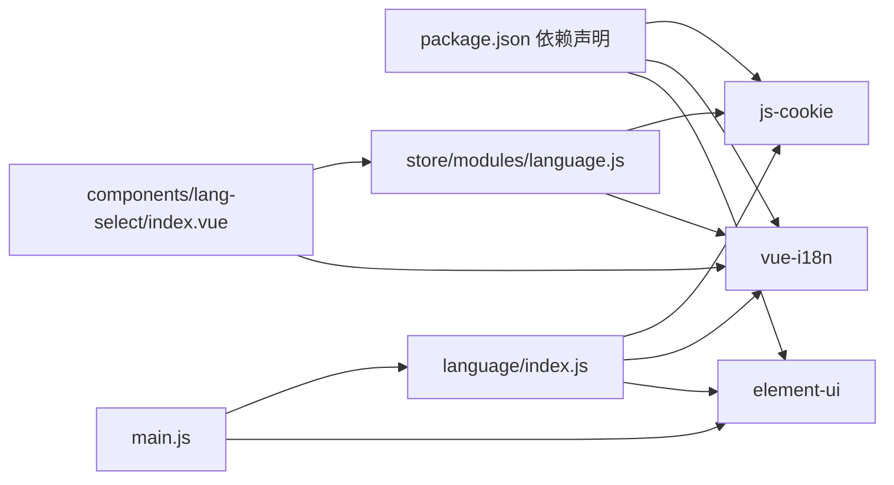

# 语言状态模块

<cite>
**本文档引用的文件**
- [src/store/modules/language.js](file://src/store/modules/language.js)
- [src/language/index.js](file://src/language/index.js)
- [src/language/en.js](file://src/language/en.js)
- [src/language/zh.js](file://src/language/zh.js)
- [src/common/lang.js](file://src/common/lang.js)
- [src/components/lang-select/index.vue](file://src/components/lang-select/index.vue)
- [src/main.js](file://src/main.js)
- [src/store/index.js](file://src/store/index.js)
- [src/layout/header.vue](file://src/layout/header.vue)
- [src/layout/settings/index.vue](file://src/layout/settings/index.vue)
- [package.json](file://package.json)
</cite>

## 目录
1. [简介](#简介)
2. [项目结构](#项目结构)
3. [核心组件](#核心组件)
4. [架构总览](#架构总览)
5. [详细组件分析](#详细组件分析)
6. [依赖关系分析](#依赖关系分析)
7. [性能考虑](#性能考虑)
8. [故障排除指南](#故障排除指南)
9. [结论](#结论)
10. [附录](#附录)

## 简介
本文件系统性梳理并解释本项目中的语言状态模块设计与实现机制，涵盖：
- 语言切换的状态管理与本地存储策略
- 语言包的组织、动态加载与缓存机制
- 与 Element UI 国际化组件的集成方式
- 语言状态的响应式更新与组件重新渲染机制
- 默认值设置与回退策略
- 在不同组件中的使用模式与最佳实践
- 性能优化与内存管理策略

## 项目结构
语言状态模块围绕 Vuex Store、VueI18n 实例以及本地存储 Cookie 三者协同工作，形成“状态持久化 + 组件响应式渲染”的闭环。关键文件与职责如下：
- 语言状态模块：负责维护当前语言代码并在变更时同步到本地存储
- 语言包：英文与中文的语言键值集合
- VueI18n 实例：初始化并挂载到 Vue 应用，提供 $t/$tc 等翻译能力
- 本地存储：通过 Cookie 存储用户语言偏好
- 语言选择组件：触发语言切换，更新 i18n 与 Vuex 状态
- 应用入口：注册 Element UI 的 i18n 适配，使 Element 组件文案随应用语言切换

图表来源
- [src/main.js:22-40](file://src/main.js#L22-L40)
- [src/store/modules/language.js:1-26](file://src/store/modules/language.js#L1-L26)
- [src/language/index.js:1-28](file://src/language/index.js#L1-L28)
- [src/common/lang.js:1-18](file://src/common/lang.js#L1-L18)
- [src/components/lang-select/index.vue:14-31](file://src/components/lang-select/index.vue#L14-L31)

章节来源
- [src/main.js:22-40](file://src/main.js#L22-L40)
- [src/store/modules/language.js:1-26](file://src/store/modules/language.js#L1-L26)
- [src/language/index.js:1-28](file://src/language/index.js#L1-L28)
- [src/common/lang.js:1-18](file://src/common/lang.js#L1-L18)
- [src/components/lang-select/index.vue:14-31](file://src/components/lang-select/index.vue#L14-L31)

## 核心组件
- 语言状态模块（Vuex）
  - 维护当前语言代码 state
  - 提供 setLanguage 动作，触发 SET_LANG 变更
  - 变更时调用本地存储工具写入 Cookie
- 语言包（VueI18n）
  - 合并应用自定义语言包与 Element UI 语言包
  - 初始化时从本地存储读取默认语言
- 本地存储（Cookie）
  - 提供 getLang/setLang/removeLang 方法
  - 键名为固定常量，便于跨组件共享
- 语言选择组件
  - 通过 $i18n.locale 切换 VueI18n 实例语言
  - 触发 Vuex 语言模块的动作进行状态持久化

章节来源
- [src/store/modules/language.js:5-18](file://src/store/modules/language.js#L5-L18)
- [src/language/index.js:11-25](file://src/language/index.js#L11-L25)
- [src/common/lang.js:3-11](file://src/common/lang.js#L3-L11)
- [src/components/lang-select/index.vue:22-29](file://src/components/lang-select/index.vue#L22-L29)

## 架构总览
语言状态模块采用“状态驱动 + 本地存储 + 组件响应”的架构：
- 初始化阶段：从 Cookie 读取语言偏好，若不存在则回退到默认中文；VueI18n 与 Element UI 的 i18n 适配均基于该语言
- 运行阶段：用户通过语言选择组件切换语言，组件先更新 VueI18n 实例语言，再提交 Vuex 动作持久化到 Cookie
- 渲染阶段：所有组件通过 $t/$tc 访问翻译键，自动跟随当前语言实例渲染

图表来源
- [src/components/lang-select/index.vue:22-29](file://src/components/lang-select/index.vue#L22-L29)
- [src/store/modules/language.js:8-12](file://src/store/modules/language.js#L8-L12)
- [src/common/lang.js:9-11](file://src/common/lang.js#L9-L11)

## 详细组件分析

### 语言状态模块（Vuex）
- 设计要点
  - 单一职责：仅维护 language 字段与持久化逻辑
  - 简洁的变更模型：SET_LANG 一次性完成状态更新与持久化
  - 命名空间隔离：避免与其他模块命名冲突
- 关键行为
  - 初始化：从本地存储读取语言，未设置时默认中文
  - 变更：commit SET_LANG 后立即 setLang，确保一致性
  - 动作：setLanguage 作为对外接口，便于组件调用
- 复杂度与性能
  - 状态读写均为 O(1)，内存占用极低
  - 与本地存储耦合，避免重复读取 Cookie

图表来源
- [src/store/modules/language.js:5-12](file://src/store/modules/language.js#L5-L12)
- [src/common/lang.js:5-11](file://src/common/lang.js#L5-L11)

章节来源
- [src/store/modules/language.js:1-26](file://src/store/modules/language.js#L1-L26)

### VueI18n 实例与语言包
- 设计要点
  - 合并策略：将应用自定义语言包与 Element UI 语言包合并，保证组件文案与业务文案一致
  - 初始化策略：从本地存储读取默认语言，确保刷新后语言保持
  - 消息结构：messages 对象按语言键组织，键名与语言模块一致
- 语言包组织
  - en.js：英文键值集合
  - zh.js：中文键值集合
  - index.js：聚合并导出 i18n 实例
- Element UI 集成
  - main.js 中通过 ElementUI 插件的 i18n 适配，使 Element 组件文案随应用语言切换

图表来源
- [src/language/index.js:11-25](file://src/language/index.js#L11-L25)
- [src/language/en.js:1-144](file://src/language/en.js#L1-L144)
- [src/language/zh.js:1-142](file://src/language/zh.js#L1-L142)

章节来源
- [src/language/index.js:1-28](file://src/language/index.js#L1-L28)
- [src/main.js:36-40](file://src/main.js#L36-L40)

### 本地存储策略（Cookie）
- 设计要点
  - 统一键名：固定键名，便于跨模块共享
  - 读写封装：提供 getLang/setLang/removeLang，避免分散逻辑
  - 默认回退：未设置时返回 undefined，由上层决定默认值
- 使用场景
  - 初始化：VueI18n 与语言模块均从 Cookie 读取
  - 持久化：语言切换后写入 Cookie
  - 清理：可选移除，便于测试或重置

图表来源
- [src/common/lang.js:5-11](file://src/common/lang.js#L5-L11)

章节来源
- [src/common/lang.js:1-18](file://src/common/lang.js#L1-L18)

### 语言选择组件（LangSelect）
- 设计要点
  - 响应式：通过 mapGetters 获取当前语言，禁用已选语言项
  - 双向更新：先设置 $i18n.locale，再提交 Vuex 动作持久化
  - 易用性：下拉菜单提供中英切换，图标提示
- 交互流程
  - 用户点击语言项 -> 组件方法 -> 更新 i18n -> 提交动作 -> 写入 Cookie -> 全局组件响应

图表来源
- [src/components/lang-select/index.vue:22-29](file://src/components/lang-select/index.vue#L22-L29)
- [src/store/modules/language.js:14-17](file://src/store/modules/language.js#L14-L17)

章节来源
- [src/components/lang-select/index.vue:1-39](file://src/components/lang-select/index.vue#L1-L39)

### 应用入口与 Element UI 集成
- 设计要点
  - 注册 VueI18n 实例到 Vue
  - 通过 ElementUI 插件的 i18n 适配，使 Element 组件文案随应用语言切换
- 关键点
  - main.js 中 i18n.t 与 Element 的 i18n 适配，确保 Element 组件与应用语言一致

章节来源
- [src/main.js:22-40](file://src/main.js#L22-L40)

### 组件中的使用模式
- 头部组件 header.vue
  - 使用 $t 访问翻译键，如面包屑标题、导航文案等
  - 通过 $i18n.locale 切换语言后，组件自动重新渲染
- 设置面板 settings/index.vue
  - 大量使用 $t 访问设置面板文案，包括开关、下拉框、按钮等
  - 语言切换后，设置面板文案随之更新

章节来源
- [src/layout/header.vue:17-67](file://src/layout/header.vue#L17-L67)
- [src/layout/settings/index.vue:1-200](file://src/layout/settings/index.vue#L1-L200)

## 依赖关系分析
- 外部依赖
  - js-cookie：用于 Cookie 读写
  - vue-i18n：提供 $t/$tc 与 VueI18n 实例
  - element-ui：提供 UI 组件与语言包
- 内部依赖
  - language/index.js 依赖 common/lang.js 读取默认语言
  - language.js 模块依赖 common/lang.js 写入 Cookie
  - lang-select 组件依赖 Vuex 语言模块与 VueI18n 实例
  - main.js 依赖 language/index.js 与 Element UI 的 i18n 适配

图表来源
- [package.json:33-63](file://package.json#L33-L63)
- [src/language/index.js:1-28](file://src/language/index.js#L1-L28)
- [src/store/modules/language.js:1](file://src/store/modules/language.js#L1)
- [src/components/lang-select/index.vue:14-31](file://src/components/lang-select/index.vue#L14-L31)
- [src/main.js:22-40](file://src/main.js#L22-L40)

章节来源
- [package.json:33-63](file://package.json#L33-L63)

## 性能考虑
- 本地存储读写
  - 读取：初始化时一次性读取，后续通过状态与实例更新，避免频繁 IO
  - 写入：仅在语言切换时写入一次，开销极小
- VueI18n 缓存
  - VueI18n 实例在应用生命周期内复用，翻译键查询为 O(1)
  - 合并语言包减少重复键查找
- 组件渲染
  - $t/$tc 依赖响应式系统，语言切换触发相关组件重新渲染，但仅限于使用翻译键的组件
- 内存管理
  - 语言模块状态极小，语言包按需加载，整体内存占用可控
  - Cookie 仅存储语言键，体积极小

## 故障排除指南
- 语言未生效或回退到默认
  - 检查 Cookie 中是否存在 lang 键，确认是否被清除或覆盖
  - 确认 language/index.js 初始化时是否正确读取 Cookie
- 切换语言后 Element 组件文案未更新
  - 确认 main.js 中 ElementUI 的 i18n 适配是否正确配置
  - 确认语言选择组件是否先设置 $i18n.locale 再提交 Vuex 动作
- 语言切换后页面未刷新
  - 检查组件是否使用 $t/$tc 访问翻译键
  - 确认组件未被缓存导致未重新渲染（如 keep-alive）

章节来源
- [src/common/lang.js:5-11](file://src/common/lang.js#L5-L11)
- [src/language/index.js:22-25](file://src/language/index.js#L22-L25)
- [src/main.js:36-40](file://src/main.js#L36-L40)
- [src/components/lang-select/index.vue:22-29](file://src/components/lang-select/index.vue#L22-L29)

## 结论
本语言状态模块通过“Vuex 状态 + VueI18n 实例 + Cookie 本地存储”的组合，实现了简洁、可靠且高性能的语言切换机制。其设计遵循单一职责与最小耦合原则，既满足 Element UI 的国际化需求，又保证了组件层面的响应式渲染。通过合理的默认值与回退策略，确保在多种环境下都能稳定运行。

## 附录
- 默认值与回退策略
  - 语言模块：初始化时从 Cookie 读取，未设置则默认中文
  - VueI18n：初始化时从 Cookie 读取，未设置则默认中文
- 最佳实践
  - 组件中统一使用 $t/$tc 访问翻译键
  - 语言切换时先更新 $i18n.locale，再提交 Vuex 动作
  - 新增语言包时，同时更新语言模块与 Element UI 语言包
  - 避免在组件内部直接读写 Cookie，统一通过语言模块与本地存储工具