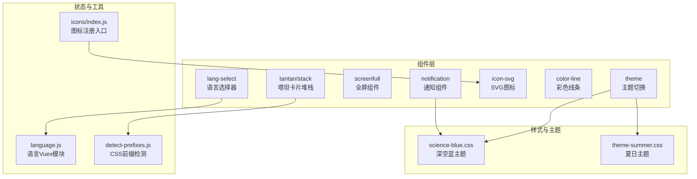
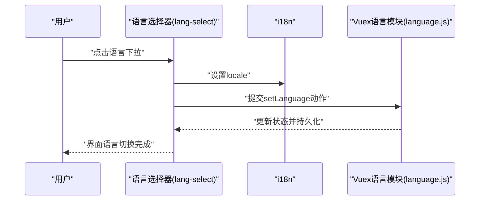
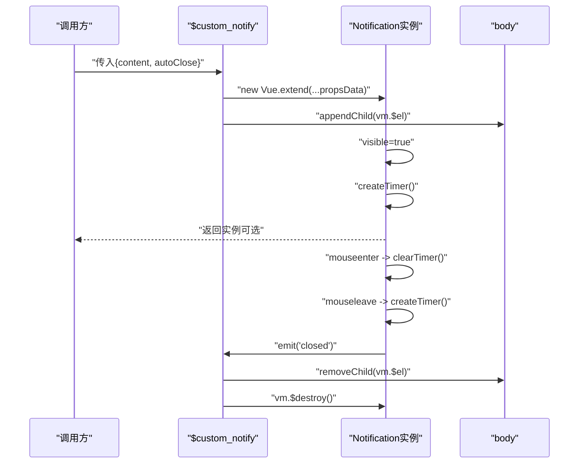
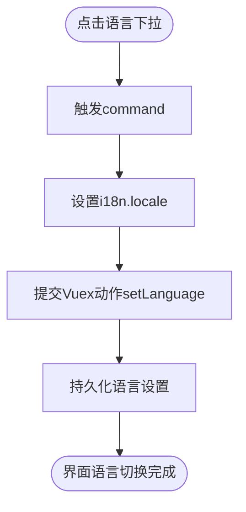
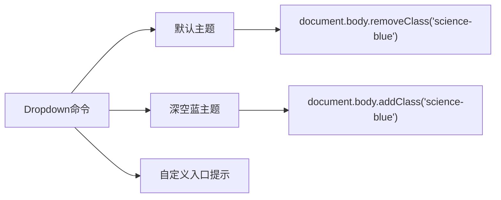
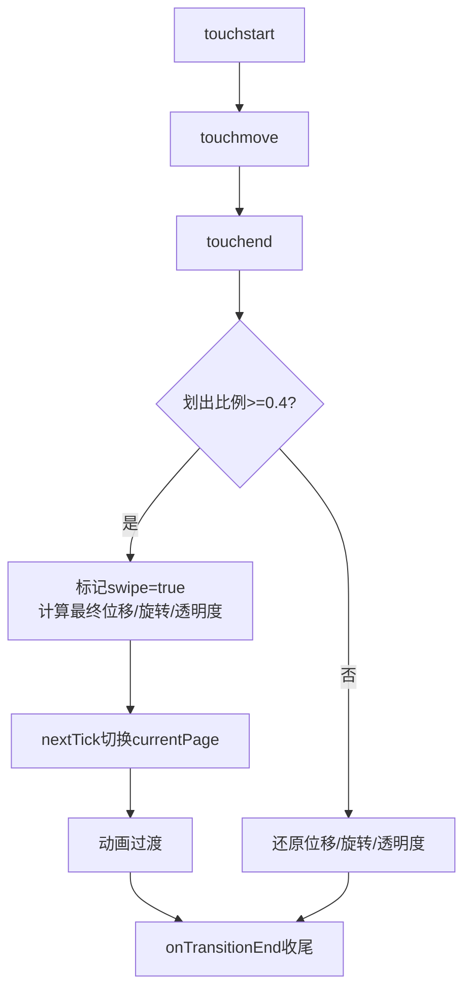
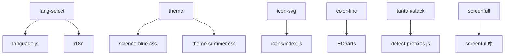

# 业务组件

<cite>
**本文引用的文件**
- [notification/index.js](file://src/components/notification/index.js)
- [notification/notification.vue](file://src/components/notification/notification.vue)
- [notification/README.md](file://src/components/notification/README.md)
- [lang-select/index.vue](file://src/components/lang-select/index.vue)
- [screenfull/index.vue](file://src/components/screenfull/index.vue)
- [theme/index.vue](file://src/components/theme/index.vue)
- [icon-svg/index.vue](file://src/components/icon-svg/index.vue)
- [color-line/index.vue](file://src/components/color-line/index.vue)
- [tantan/stack.vue](file://src/components/tantan/stack.vue)
- [science-blue.css](file://src/assets/custom-theme/science-blue.css)
- [theme-summer.css](file://src/assets/custom-theme/theme-summer.css)
- [language.js](file://src/store/modules/language.js)
- [detect-prefixes.js](file://src/utils/detect-prefixes.js)
- [icons/index.js](file://src/icons/index.js)
</cite>

## 目录
1. [简介](#简介)
2. [项目结构](#项目结构)
3. [核心组件](#核心组件)
4. [架构总览](#架构总览)
5. [详细组件分析](#详细组件分析)
6. [依赖关系分析](#依赖关系分析)
7. [性能考虑](#性能考虑)
8. [故障排查指南](#故障排查指南)
9. [结论](#结论)
10. [附录](#附录)

## 简介
本文件系统化梳理 Vue CMS 中的可复用业务组件，覆盖通知组件、语言选择器、全屏显示、主题切换、SVG 图标、彩色线条与塔坦组件等。文档从设计原则、实现细节、API 接口、配置项、事件与状态管理、生命周期钩子、样式定制与主题适配、性能优化与懒加载策略、使用示例与集成指南，到扩展与二次开发方法进行全面阐述，帮助开发者快速理解与高效复用。

## 项目结构
业务组件集中位于 src/components 下，按功能分模块组织；主题样式位于 src/assets/custom-theme；国际化状态位于 src/store/modules/language；图标注册位于 src/icons/index.js；部分组件依赖工具函数（如检测 CSS 前缀）位于 src/utils。

图表来源
- [notification/index.js:1-119](file://src/components/notification/index.js#L1-L119)
- [lang-select/index.vue:1-39](file://src/components/lang-select/index.vue#L1-L39)
- [screenfull/index.vue:1-53](file://src/components/screenfull/index.vue#L1-L53)
- [theme/index.vue:1-42](file://src/components/theme/index.vue#L1-L42)
- [icon-svg/index.vue:1-33](file://src/components/icon-svg/index.vue#L1-L33)
- [color-line/index.vue:1-87](file://src/components/color-line/index.vue#L1-L87)
- [tantan/stack.vue:1-363](file://src/components/tantan/stack.vue#L1-L363)
- [science-blue.css:1-49](file://src/assets/custom-theme/science-blue.css#L1-L49)
- [theme-summer.css:1-800](file://src/assets/custom-theme/theme-summer.css#L1-L800)
- [language.js:1-26](file://src/store/modules/language.js#L1-L26)
- [detect-prefixes.js:1-46](file://src/utils/detect-prefixes.js#L1-L46)
- [icons/index.js:1-12](file://src/icons/index.js#L1-L12)

章节来源
- [notification/index.js:1-119](file://src/components/notification/index.js#L1-L119)
- [lang-select/index.vue:1-39](file://src/components/lang-select/index.vue#L1-L39)
- [screenfull/index.vue:1-53](file://src/components/screenfull/index.vue#L1-L53)
- [theme/index.vue:1-42](file://src/components/theme/index.vue#L1-L42)
- [icon-svg/index.vue:1-33](file://src/components/icon-svg/index.vue#L1-L33)
- [color-line/index.vue:1-87](file://src/components/color-line/index.vue#L1-L87)
- [tantan/stack.vue:1-363](file://src/components/tantan/stack.vue#L1-L363)
- [science-blue.css:1-49](file://src/assets/custom-theme/science-blue.css#L1-L49)
- [theme-summer.css:1-800](file://src/assets/custom-theme/theme-summer.css#L1-L800)
- [language.js:1-26](file://src/store/modules/language.js#L1-L26)
- [detect-prefixes.js:1-46](file://src/utils/detect-prefixes.js#L1-L46)
- [icons/index.js:1-12](file://src/icons/index.js#L1-L12)

## 核心组件
- 通知组件：支持模板与 API 双模式调用，自动关闭、垂直偏移、高度计算与实例管理。
- 语言选择器：基于 Element Dropdown 的国际化切换，联动 Vuex 语言模块与 i18n。
- 全屏组件：封装 screenfull 库，提供浏览器兼容性提示与点击切换。
- 主题切换：通过给 body 添加/移除类名切换主题，内置默认与深空蓝主题。
- SVG 图标：统一的 svg-icon 组件，按需注册与使用。
- 彩色线条：基于 ECharts 的迷你折线图，支持颜色、尺寸与数据配置。
- 塔坦卡片堆栈：手势驱动的卡片堆叠翻页，支持触摸与鼠标交互，复杂动画与状态机。

章节来源
- [notification/index.js:1-119](file://src/components/notification/index.js#L1-L119)
- [notification/notification.vue:1-90](file://src/components/notification/notification.vue#L1-L90)
- [lang-select/index.vue:1-39](file://src/components/lang-select/index.vue#L1-L39)
- [screenfull/index.vue:1-53](file://src/components/screenfull/index.vue#L1-L53)
- [theme/index.vue:1-42](file://src/components/theme/index.vue#L1-L42)
- [icon-svg/index.vue:1-33](file://src/components/icon-svg/index.vue#L1-L33)
- [color-line/index.vue:1-87](file://src/components/color-line/index.vue#L1-L87)
- [tantan/stack.vue:1-363](file://src/components/tantan/stack.vue#L1-L363)

## 架构总览
组件间通过以下方式协作：
- 通知组件通过 Vue.extend 动态创建实例，挂载到 body 并维护垂直偏移与高度，支持定时关闭与手动关闭事件。
- 语言选择器通过 Vuex 语言模块与 i18n 同步，Dropdown 触发命令切换语言。
- 主题切换通过给 document.body 添加/移除类名，配合主题 CSS 文件生效。
- SVG 图标通过全局注册与 require.context 按需加载，统一使用 svg-icon 组件。
- 彩色线条组件初始化 ECharts 实例并绘制折线图。
- 塔坦卡片堆栈通过 detect-prefixes 获取 CSS 前缀，结合 touch/mouse 事件与 transform/rotate 实现翻页动画。

图表来源
- [lang-select/index.vue:14-31](file://src/components/lang-select/index.vue#L14-L31)
- [language.js:14-25](file://src/store/modules/language.js#L14-L25)

章节来源
- [lang-select/index.vue:1-39](file://src/components/lang-select/index.vue#L1-L39)
- [language.js:1-26](file://src/store/modules/language.js#L1-L26)

## 详细组件分析

### 通知组件（notification）
- 设计原则
  - 单例/多实例管理：通过数组维护实例列表，动态计算垂直偏移，避免重叠。
  - 生命周期：mounted 创建定时器，beforeDestroy 清理定时器；transition 进出场动画控制。
  - API 与模板双入口：既可直接使用组件标签，也可通过 Vue.prototype 扩展的 API 调用。
- 关键属性与行为
  - 属性：content（必填）、btn（默认“关闭”）、enterAnimated、leaveAnimated。
  - 方法：createTimer/clearTimer 控制自动关闭；afterEnter 计算高度；handleClose/closed 事件。
  - 定时关闭：autoClose 默认 3000ms，支持传参覆盖。
  - 偏移计算：根据已存在实例的高度累加 verticalOffset，保证从底部依次弹出。
- 使用场景
  - 系统提示、错误反馈、成功消息等需要自动消失的通知。
- 事件与状态
  - 事件：close（手动关闭）、closed（动画结束后销毁）。
  - 状态：visible 控制显隐；timer 管理自动关闭。
- 性能与优化
  - 仅在非服务端渲染环境初始化；实例销毁时移除 DOM 与清理定时器。
  - 使用 transition 控制动画，避免频繁重排。
- 样式与主题
  - 固定定位、阴影、圆角与深色背景；按钮颜色可定制。
- 扩展与二次开发
  - 支持传入 enterAnimated/leaveAnimated 使用 Animate.css 动画库。
  - 可增加类型（info/success/warning/error）与图标支持。

图表来源
- [notification/index.js:74-118](file://src/components/notification/index.js#L74-L118)
- [notification/notification.vue:10-58](file://src/components/notification/notification.vue#L10-L58)

章节来源
- [notification/index.js:1-119](file://src/components/notification/index.js#L1-L119)
- [notification/notification.vue:1-90](file://src/components/notification/notification.vue#L1-L90)
- [notification/README.md:1-15](file://src/components/notification/README.md#L1-L15)

### 语言选择器（lang-select）
- 设计原则
  - 低耦合：仅依赖 i18n 与 Vuex 语言模块，UI 使用 Element Dropdown。
  - 易扩展：Dropdown 命令与语言值一一对应，便于新增语言。
- 关键属性与行为
  - 计算属性：映射当前语言 getter。
  - 方法：handleSetLanguage 设置 i18n.locale 并提交 Vuex 动作。
- 使用场景
  - 多语言站点的语言切换入口。
- 事件与状态
  - 无显式组件事件；通过 Vuex 与 i18n 同步状态。
- 性能与优化
  - 无额外开销；Dropdown 按需渲染。
- 样式与主题
  - 使用 Element 图标与样式，可按需调整尺寸与光标样式。
- 扩展与二次开发
  - 新增语言只需在 Dropdown 中添加命令项，并在 i18n 中补充对应资源。

图表来源
- [lang-select/index.vue:22-30](file://src/components/lang-select/index.vue#L22-L30)
- [language.js:14-17](file://src/store/modules/language.js#L14-L17)

章节来源
- [lang-select/index.vue:1-39](file://src/components/lang-select/index.vue#L1-L39)
- [language.js:1-26](file://src/store/modules/language.js#L1-L26)

### 全屏显示（screenfull）
- 设计原则
  - 封装第三方库：对 screenfull 进行简单封装，提供统一的点击切换与兼容性提示。
- 关键属性与行为
  - 属性：width、height、fill（图标尺寸与填充色）。
  - 方法：click 切换全屏；若不支持则提示浏览器兼容问题。
- 使用场景
  - 数据大屏、演示页面、图表全屏展示。
- 事件与状态
  - 无内部状态；通过外部提示框反馈能力限制。
- 性能与优化
  - 仅在点击时触发，无常驻监听。
- 样式与主题
  - 图标样式独立，可通过 props 调整尺寸与颜色。
- 扩展与二次开发
  - 可扩展支持退出全屏回调、进入全屏事件监听等。

章节来源
- [screenfull/index.vue:1-53](file://src/components/screenfull/index.vue#L1-L53)

### 主题切换（theme）
- 设计原则
  - 类名切换：通过给 document.body 添加/移除类名实现主题切换，轻量且可控。
  - 内置主题：默认与深空蓝主题；支持“自定义”引导至主题页面。
- 关键属性与行为
  - 方法：changeTheme(command) 根据命令切换主题或提示自定义入口。
- 使用场景
  - 用户偏好设置、运营活动主题切换。
- 事件与状态
  - 无内部状态；通过 CSS 类名驱动样式。
- 性能与优化
  - 切换成本极低；主题 CSS 已预加载。
- 样式与主题
  - 深空蓝主题针对导航栏、侧边栏、标签页等关键区域进行样式覆盖。
- 扩展与二次开发
  - 新增主题：新建 CSS 文件并在组件中添加命令项与导入语句。

图表来源
- [theme/index.vue:18-38](file://src/components/theme/index.vue#L18-L38)
- [science-blue.css:6-48](file://src/assets/custom-theme/science-blue.css#L6-L48)

章节来源
- [theme/index.vue:1-42](file://src/components/theme/index.vue#L1-L42)
- [science-blue.css:1-49](file://src/assets/custom-theme/science-blue.css#L1-L49)
- [theme-summer.css:1-800](file://src/assets/custom-theme/theme-summer.css#L1-L800)

### SVG 图标（icon-svg）
- 设计原则
  - 统一入口：通过全局组件注册与 require.context 按需加载，减少重复引入。
  - 语义化：使用 <use xlink:href="#icon-xxx">，支持主题色与尺寸控制。
- 关键属性与行为
  - 属性：iconClass（必填）。
  - 行为：computed 返回 #icon-{iconClass}，样式使用 currentColor 与 overflow 控制。
- 使用场景
  - 导航、按钮、列表项中的小图标。
- 事件与状态
  - 无内部状态。
- 性能与优化
  - 按需加载，避免一次性引入过多 SVG。
- 样式与主题
  - fill: currentColor，可随文本颜色变化；建议统一尺寸与垂直对齐。
- 扩展与二次开发
  - 新增图标：在 icons/svg 目录下添加 SVG 文件，确保命名规范一致。

章节来源
- [icon-svg/index.vue:1-33](file://src/components/icon-svg/index.vue#L1-L33)
- [icons/index.js:1-12](file://src/icons/index.js#L1-L12)

### 彩色线条（color-line）
- 设计原则
  - 轻量图表：基于 ECharts 最小化引入，仅绘制折线，适合内嵌展示。
  - 可配置：支持颜色、尺寸、数据与容器 ID。
- 关键属性与行为
  - 属性：id（必填）、color、optionData（默认值）、width、height。
  - 方法：drawPie 初始化 ECharts 并设置网格、坐标轴与折线样式。
  - 生命周期：mounted 设置容器宽高并绘制。
- 使用场景
  - KPI 指标趋势、简要数据走势展示。
- 事件与状态
  - 无内部事件；通过 props 驱动。
- 性能与优化
  - 在 $nextTick 中初始化图表，避免 DOM 未就绪；按需渲染。
- 样式与主题
  - 通过 color 属性控制线条颜色；容器尺寸通过 props 控制。
- 扩展与二次开发
  - 可扩展为多系列、多指标；支持平滑曲线与点样式定制。

章节来源
- [color-line/index.vue:1-87](file://src/components/color-line/index.vue#L1-L87)

### 塔坦卡片堆栈（tantan/stack）
- 设计原则
  - 交互优先：支持触摸与鼠标，手势识别与动画自然流畅。
  - 状态机清晰：tracking/tracing、animation/swipe 等状态变量明确。
  - 兼容性强：通过 detect-prefixes 检测 CSS 前缀，适配多浏览器。
- 关键属性与行为
  - 属性：stackinit（初始配置）、pages（页面 HTML 数组）。
  - 数据：basicdata（起点/终点）、temporaryData（临时状态，含偏移、旋转、透明度、z-index 等）。
  - 方法：touchstart/touchmove/touchend 处理手势；next/prev 触发翻页；onTransitionEnd 结束动画；transform/transformIndex 计算样式。
  - 计算属性：offsetRatio/offsetWidthRatio 计算划出比例。
- 使用场景
  - 图片轮播、卡片翻阅、移动端滑动面板。
- 事件与状态
  - 事件：webkit-transition-end/transitionend 监听动画结束；组件内部 emit 用于外部控制（如 next/prev）。
  - 状态：tracking（跟踪中）、animation（动画中）、swipe（滑动中）、currentPage（当前页）。
- 性能与优化
  - 使用 translate3D 与硬件加速；动画时长固定，避免过度重绘。
  - 通过 visible 控制可见层数，减少 DOM 数量。
- 样式与主题
  - 使用 perspective 与 3D 变换营造立体效果；z-index 与透明度控制层级。
- 扩展与二次开发
  - 可扩展为水平/垂直方向、多方向翻页、自定义动画曲线等。

图表来源
- [tantan/stack.vue:97-170](file://src/components/tantan/stack.vue#L97-L170)
- [tantan/stack.vue:187-199](file://src/components/tantan/stack.vue#L187-L199)
- [tantan/stack.vue:212-223](file://src/components/tantan/stack.vue#L212-L223)

章节来源
- [tantan/stack.vue:1-363](file://src/components/tantan/stack.vue#L1-L363)
- [detect-prefixes.js:1-46](file://src/utils/detect-prefixes.js#L1-L46)

## 依赖关系分析
- 组件依赖
  - lang-select 依赖 Vuex 语言模块与 i18n。
  - theme 依赖 CSS 主题文件与工具类操作函数。
  - icon-svg 依赖 icons/index.js 的全局注册与 require.context。
  - color-line 依赖 ECharts（按需引入）。
  - tatan/stack 依赖 detect-prefixes.js。
- 外部依赖
  - screenfull：全屏能力。
  - Element UI：Dropdown、Message 等组件与样式。
  - Animate.css：通知组件的 enter/leave 动画类名。

图表来源
- [lang-select/index.vue:14-31](file://src/components/lang-select/index.vue#L14-L31)
- [language.js:1-26](file://src/store/modules/language.js#L1-L26)
- [theme/index.vue:15-38](file://src/components/theme/index.vue#L15-L38)
- [icon-svg/index.vue:1-33](file://src/components/icon-svg/index.vue#L1-L33)
- [icons/index.js:4-12](file://src/icons/index.js#L4-L12)
- [color-line/index.vue:7-8](file://src/components/color-line/index.vue#L7-L8)
- [tantan/stack.vue:23](file://src/components/tantan/stack.vue#L23)
- [screenfull/index.vue:6](file://src/components/screenfull/index.vue#L6)

章节来源
- [lang-select/index.vue:1-39](file://src/components/lang-select/index.vue#L1-L39)
- [theme/index.vue:1-42](file://src/components/theme/index.vue#L1-L42)
- [icon-svg/index.vue:1-33](file://src/components/icon-svg/index.vue#L1-L33)
- [icons/index.js:1-12](file://src/icons/index.js#L1-L12)
- [color-line/index.vue:1-87](file://src/components/color-line/index.vue#L1-L87)
- [tantan/stack.vue:1-363](file://src/components/tantan/stack.vue#L1-L363)
- [screenfull/index.vue:1-53](file://src/components/screenfull/index.vue#L1-L53)

## 性能考虑
- 通知组件
  - 仅在客户端初始化；实例销毁时移除 DOM 与清理定时器，避免内存泄漏。
  - 使用 transition 控制动画，减少不必要的 reflow。
- 语言选择器
  - 无常驻监听，切换即刻生效。
- 全屏组件
  - 仅在点击时触发，避免常驻监听。
- 主题切换
  - 通过类名切换，成本极低；主题 CSS 已预加载。
- SVG 图标
  - require.context 按需加载，减少首屏体积。
- 彩色线条
  - ECharts 按需引入，仅在需要时初始化；容器尺寸通过 props 控制，避免重复布局。
- 塔坦卡片堆栈
  - 使用 translate3D 与硬件加速；动画时长固定；visible 控制层数，降低 DOM 压力。

[本节为通用性能建议，无需特定文件引用]

## 故障排查指南
- 通知组件
  - 症状：无法自动关闭或重复弹出。
  - 排查：确认 autoClose 参数是否正确传递；检查定时器是否被 mouseenter/mouseleave 清理/重建。
  - 相关路径：[notification/index.js:24-46](file://src/components/notification/index.js#L24-L46)、[notification/notification.vue:47-58](file://src/components/notification/notification.vue#L47-L58)
- 语言选择器
  - 症状：切换无效或 i18n 不生效。
  - 排查：确认 i18n.locale 是否被设置；Vuex 动作是否提交成功；本地存储是否正确写入。
  - 相关路径：[lang-select/index.vue:26-29](file://src/components/lang-select/index.vue#L26-L29)、[language.js:14-17](file://src/store/modules/language.js#L14-L17)
- 全屏组件
  - 症状：点击无反应或提示浏览器不支持。
  - 排查：检查 screenfull.enabled；确认浏览器支持全屏 API。
  - 相关路径：[screenfull/index.vue:30-37](file://src/components/screenfull/index.vue#L30-L37)
- 主题切换
  - 症状：切换后样式未生效。
  - 排查：确认类名添加/移除逻辑；检查主题 CSS 是否正确导入。
  - 相关路径：[theme/index.vue:20-37](file://src/components/theme/index.vue#L20-L37)、[science-blue.css:6-48](file://src/assets/custom-theme/science-blue.css#L6-L48)
- SVG 图标
  - 症状：图标不显示或样式异常。
  - 排查：确认图标文件是否存在；xlink:href 是否匹配；currentColor 是否被父级覆盖。
  - 相关路径：[icon-svg/index.vue:17-19](file://src/components/icon-svg/index.vue#L17-L19)、[icons/index.js:9-12](file://src/icons/index.js#L9-L12)
- 彩色线条
  - 症状：图表不显示或尺寸异常。
  - 排查：确认容器 ID 存在；width/height 是否设置；ECharts 是否按需引入。
  - 相关路径：[color-line/index.vue:36-76](file://src/components/color-line/index.vue#L36-L76)
- 塔坦卡片堆栈
  - 症状：手势无响应或动画异常。
  - 排查：确认 detectPrefixes 返回的前缀；事件绑定是否正确；visible 与 z-index 是否合理。
  - 相关路径：[tantan/stack.vue:46](file://src/components/tantan/stack.vue#L46)、[detect-prefixes.js:8-44](file://src/utils/detect-prefixes.js#L8-L44)

章节来源
- [notification/index.js:24-46](file://src/components/notification/index.js#L24-L46)
- [notification/notification.vue:47-58](file://src/components/notification/notification.vue#L47-L58)
- [lang-select/index.vue:26-29](file://src/components/lang-select/index.vue#L26-L29)
- [language.js:14-17](file://src/store/modules/language.js#L14-L17)
- [screenfull/index.vue:30-37](file://src/components/screenfull/index.vue#L30-L37)
- [theme/index.vue:20-37](file://src/components/theme/index.vue#L20-L37)
- [science-blue.css:6-48](file://src/assets/custom-theme/science-blue.css#L6-L48)
- [icon-svg/index.vue:17-19](file://src/components/icon-svg/index.vue#L17-L19)
- [icons/index.js:9-12](file://src/icons/index.js#L9-L12)
- [color-line/index.vue:36-76](file://src/components/color-line/index.vue#L36-L76)
- [tantan/stack.vue:46](file://src/components/tantan/stack.vue#L46)
- [detect-prefixes.js:8-44](file://src/utils/detect-prefixes.js#L8-L44)

## 结论
上述业务组件以“低耦合、高内聚、易扩展”为目标，覆盖通知、国际化、全屏、主题、图标、图表与交互等常见场景。通过统一的注册与按需加载策略、合理的状态与事件管理、以及主题与样式的解耦设计，能够有效提升开发效率与用户体验。建议在实际项目中遵循组件的配置与扩展方式，结合性能优化与故障排查清单，确保稳定交付。

[本节为总结性内容，无需特定文件引用]

## 附录
- 使用示例与集成指南
  - 通知组件：在入口文件中安装插件后，即可通过 $custom_notify(options) 调用；或直接在模板中使用组件标签。
  - 语言选择器：在布局头部引入，Dropdown 命令与语言值保持一致。
  - 全屏组件：在需要全屏展示的页面引入，注意浏览器兼容性提示。
  - 主题切换：在设置面板中引入，Dropdown 命令与主题类名一致。
  - SVG 图标：全局注册后，在任意组件中使用 svg-icon 组件并传入 iconClass。
  - 彩色线条：在需要展示趋势的区域引入，传入 id、color、optionData、width、height。
  - 塔坦卡片堆栈：在需要滑动翻页的场景引入，传入 pages 与 stackinit。
- 扩展与二次开发
  - 新增语言：在 Dropdown 中添加命令项，并在 i18n 中补充资源。
  - 新增主题：新增 CSS 文件并在组件中添加命令项与导入语句。
  - 新增图标：在 icons/svg 目录下添加 SVG 文件并保持命名规范。
  - 新增通知类型：在通知组件中增加类型枚举与样式分支。
  - 新增图表类型：在 color-line 中扩展 ECharts 配置与渲染逻辑。
  - 新增手势方向：在塔坦卡片堆栈中扩展 transform 与动画逻辑。

[本节为通用指导，无需特定文件引用]