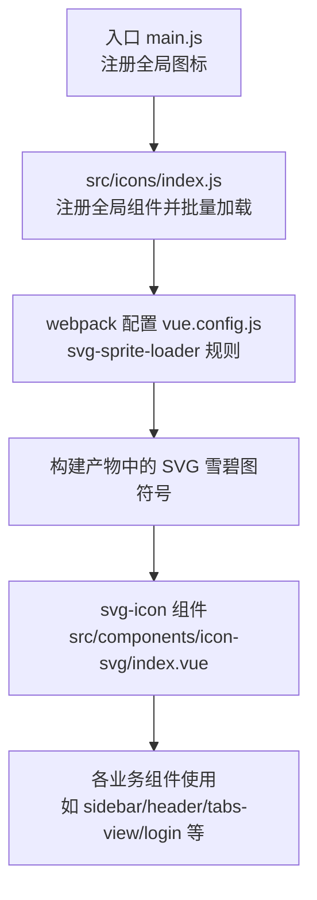
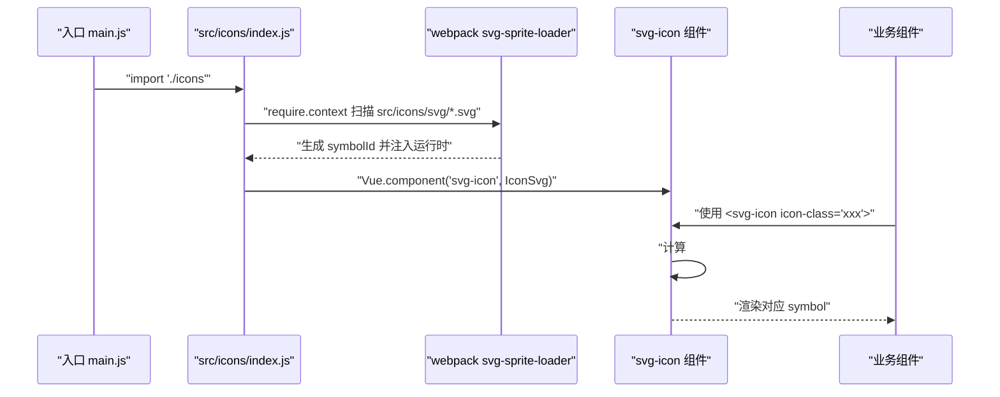
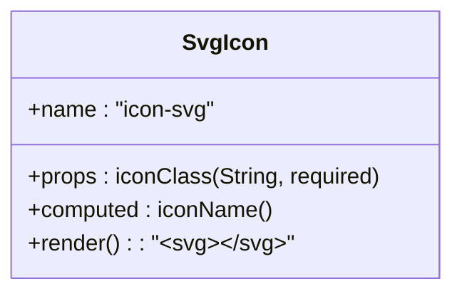
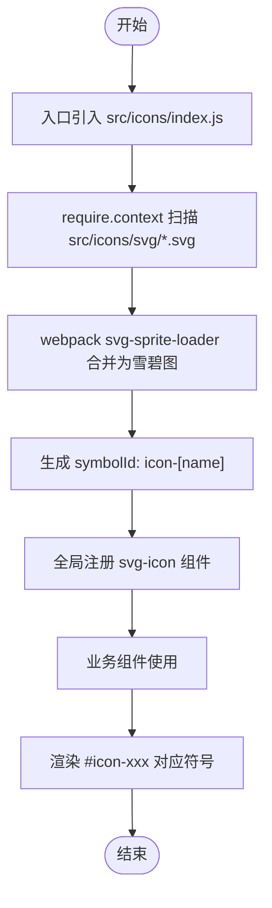
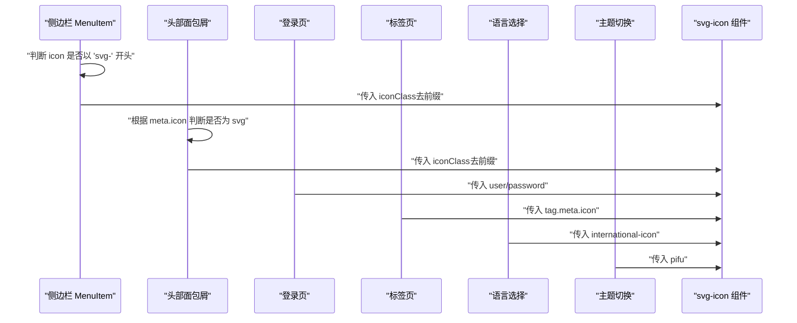
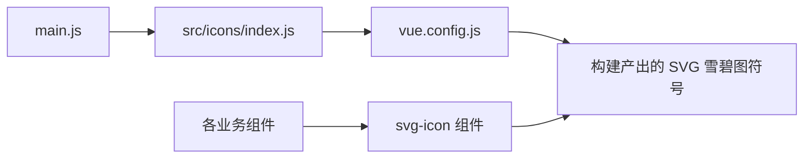

# 图标系统

<cite>
**本文引用的文件**
- [src/icons/index.js](file://src/icons/index.js)
- [src/components/icon-svg/index.vue](file://src/components/icon-svg/index.vue)
- [src/main.js](file://src/main.js)
- [vue.config.js](file://vue.config.js)
- [src/layout/sidebar/item.vue](file://src/layout/sidebar/item.vue)
- [src/layout/header.vue](file://src/layout/header.vue)
- [src/views/login/index.vue](file://src/views/login/index.vue)
- [src/components/lang-select/index.vue](file://src/components/lang-select/index.vue)
- [src/components/theme/index.vue](file://src/components/theme/index.vue)
- [src/layout/tabs-view.vue](file://src/layout/tabs-view.vue)
</cite>

## 目录
1. [简介](#简介)
2. [项目结构](#项目结构)
3. [核心组件](#核心组件)
4. [架构总览](#架构总览)
5. [详细组件分析](#详细组件分析)
6. [依赖关系分析](#依赖关系分析)
7. [性能与优化](#性能与优化)
8. [故障排查指南](#故障排查指南)
9. [结论](#结论)
10. [附录](#附录)

## 简介
本章节概述Vue CMS图标的整体设计理念与实现架构。系统采用SVG雪碧图（sprite）方案，结合webpack的svg-sprite-loader进行打包与按需复用；通过一个全局可复用的svg-icon组件统一渲染，支持主题色与尺寸等样式定制；在多处UI组件中以统一模式使用，保证一致性与可维护性。

## 项目结构
图标系统主要由以下部分组成：
- 构建配置：通过vue.config.js中的svg-sprite-loader规则，将src/icons目录下的SVG作为雪碧图符号处理。
- 全局注册：在入口文件中引入src/icons/index.js，自动注册全局svg-icon组件并批量加载图标。
- 组件层：提供通用的svg-icon组件用于渲染具体图标。
- 使用层：在布局、菜单、标签页、登录页等组件中以统一方式调用svg-icon。

图表来源
- [src/main.js:20-21](file://src/main.js#L20-L21)
- [src/icons/index.js:5-11](file://src/icons/index.js#L5-L11)
- [vue.config.js:89-102](file://vue.config.js#L89-L102)
- [src/components/icon-svg/index.vue:1-33](file://src/components/icon-svg/index.vue#L1-L33)

章节来源
- [src/main.js:20-21](file://src/main.js#L20-L21)
- [src/icons/index.js:5-11](file://src/icons/index.js#L5-L11)
- [vue.config.js:89-102](file://vue.config.js#L89-L102)

## 核心组件
- 全局注册与批量加载
  - 在入口文件中引入图标模块，完成全局组件注册与图标批量加载。
  - 批量加载基于require.context扫描src/icons/svg目录下的所有SVG文件。
- svg-icon组件
  - 通过props接收iconClass，计算出对应的symbolId并使用<use xlink:href>引用。
  - 默认样式使用currentColor继承父级文本颜色，便于主题切换。
- 构建与打包
  - 通过svg-sprite-loader将src/icons目录下的SVG合并为雪碧图，并以“icon-[name]”作为symbolId模板。

章节来源
- [src/icons/index.js:5-11](file://src/icons/index.js#L5-L11)
- [src/components/icon-svg/index.vue:8-21](file://src/components/icon-svg/index.vue#L8-L21)
- [vue.config.js:89-102](file://vue.config.js#L89-L102)

## 架构总览
下图展示了从入口到组件渲染的完整流程，以及构建期对SVG的处理方式。

图表来源
- [src/main.js:20-21](file://src/main.js#L20-L21)
- [src/icons/index.js:5-11](file://src/icons/index.js#L5-L11)
- [vue.config.js:89-102](file://vue.config.js#L89-L102)
- [src/components/icon-svg/index.vue:16-19](file://src/components/icon-svg/index.vue#L16-L19)

## 详细组件分析

### svg-icon 组件
- 设计要点
  - 单一职责：只负责根据iconClass拼接symbolId并渲染。
  - 可复用性强：全局注册后可在任意组件中直接使用。
  - 主题友好：fill使用currentColor，随父元素颜色变化。
- 关键属性与行为
  - props: iconClass（必填字符串）
  - 计算属性：iconName（拼接为#icon-{iconClass}）
  - 渲染：<svg><use :xlink:href="iconName"/></svg>
- 样式特性
  - 默认尺寸：约1.1em × 1.1em
  - 垂直对齐：-0.2em
  - 溢出隐藏：避免symbol过大导致溢出

图表来源
- [src/components/icon-svg/index.vue:8-21](file://src/components/icon-svg/index.vue#L8-L21)

章节来源
- [src/components/icon-svg/index.vue:1-33](file://src/components/icon-svg/index.vue#L1-L33)

### 图标批量注册与构建流程
- 入口注册
  - 在main.js中引入src/icons/index.js，触发全局组件注册与图标加载。
- 批量加载
  - 使用require.context扫描src/icons/svg目录下所有SVG文件并逐一require，使它们被纳入构建。
- 构建规则
  - 通过vue.config.js为src/icons目录单独配置svg-sprite-loader，将SVG合并为雪碧图并生成symbolId。
- 符号引用
  - 组件通过#icon-{iconClass}引用对应symbol，实现按需渲染。

图表来源
- [src/main.js:20-21](file://src/main.js#L20-L21)
- [src/icons/index.js:9-11](file://src/icons/index.js#L9-L11)
- [vue.config.js:89-102](file://vue.config.js#L89-L102)
- [src/components/icon-svg/index.vue:16-19](file://src/components/icon-svg/index.vue#L16-L19)

章节来源
- [src/main.js:20-21](file://src/main.js#L20-L21)
- [src/icons/index.js:9-11](file://src/icons/index.js#L9-L11)
- [vue.config.js:89-102](file://vue.config.js#L89-L102)

### 在布局与页面中的使用模式
- 侧边栏菜单项
  - 当路由meta.icon以“svg-”开头时，解析去除前缀后的图标名并渲染svg-icon。
- 面包屑导航
  - 根据配置决定是否显示图标；若为svg图标，则移除“svg-”前缀后传给svg-icon。
- 登录页
  - 用户名与密码输入框前使用svg-icon展示对应图标。
- 标签页
  - 若开启标签页图标功能且路由meta中指定图标，则渲染对应svg-icon。
- 语言选择与主题切换
  - 语言选择器与主题切换组件内部也使用svg-icon进行图标展示。

图表来源
- [src/layout/sidebar/item.vue:21-30](file://src/layout/sidebar/item.vue#L21-L30)
- [src/layout/header.vue:14-29](file://src/layout/header.vue#L14-L29)
- [src/views/login/index.vue:23,32](file://src/views/login/index.vue#L23,L32)
- [src/layout/tabs-view.vue:9](file://src/layout/tabs-view.vue#L9)
- [src/components/lang-select/index.vue:3](file://src/components/lang-select/index.vue#L3)
- [src/components/theme/index.vue:3](file://src/components/theme/index.vue#L3)

章节来源
- [src/layout/sidebar/item.vue:21-30](file://src/layout/sidebar/item.vue#L21-L30)
- [src/layout/header.vue:14-29](file://src/layout/header.vue#L14-L29)
- [src/views/login/index.vue:23,32](file://src/views/login/index.vue#L23,L32)
- [src/layout/tabs-view.vue:9](file://src/layout/tabs-view.vue#L9)
- [src/components/lang-select/index.vue:3](file://src/components/lang-select/index.vue#L3)
- [src/components/theme/index.vue:3](file://src/components/theme/index.vue#L3)

## 依赖关系分析
- 入口依赖
  - main.js依赖src/icons/index.js完成全局注册。
- 构建依赖
  - vue.config.js为src/icons目录配置专用loader，排除默认svg处理规则。
- 组件依赖
  - svg-icon组件依赖构建期生成的symbolId，运行时通过xlink:href引用。
- 使用依赖
  - 业务组件通过统一的svg-icon组件间接依赖构建产物。

图表来源
- [src/main.js:20-21](file://src/main.js#L20-L21)
- [src/icons/index.js:5-11](file://src/icons/index.js#L5-L11)
- [vue.config.js:89-102](file://vue.config.js#L89-L102)
- [src/components/icon-svg/index.vue:1-33](file://src/components/icon-svg/index.vue#L1-L33)

章节来源
- [src/main.js:20-21](file://src/main.js#L20-L21)
- [src/icons/index.js:5-11](file://src/icons/index.js#L5-L11)
- [vue.config.js:89-102](file://vue.config.js#L89-L102)

## 性能与优化
- 构建期优化
  - 使用svg-sprite-loader将多个SVG合并为单一雪碧图，减少HTTP请求与体积冗余。
  - 通过symbolId模板“icon-[name]”确保唯一性与可读性。
- 运行时优化
  - svg-icon使用currentColor继承父级颜色，避免重复定义样式。
  - 统一尺寸与垂直对齐，减少样式重复计算。
- 资源加载
  - 通过require.context在构建期一次性打包，避免运行时动态请求。
- 与打包策略配合
  - 生产环境关闭source map以减小体积。
  - 分包策略拆分第三方库与公共组件，提升缓存命中率。

章节来源
- [vue.config.js:89-102](file://vue.config.js#L89-L102)
- [src/components/icon-svg/index.vue:24-31](file://src/components/icon-svg/index.vue#L24-L31)
- [vue.config.js:26,116-141](file://vue.config.js#L26,L116-L141)

## 故障排查指南
- 图标不显示
  - 检查iconClass是否与构建生成的symbolId一致（“icon-[name]”）。
  - 确认src/icons/svg目录下是否存在对应SVG文件。
- 图标颜色异常
  - 确保父容器或组件有明确的颜色值，因为fill使用currentColor。
- 图标尺寸不一致
  - 统一使用svg-icon组件，避免手动写死尺寸。
- 构建报错
  - 确认vue.config.js中已为src/icons目录配置svg-sprite-loader规则。
  - 确认require.context扫描路径正确且无拼写错误。

章节来源
- [src/components/icon-svg/index.vue:16-19](file://src/components/icon-svg/index.vue#L16-L19)
- [vue.config.js:89-102](file://vue.config.js#L89-L102)
- [src/icons/index.js:9-11](file://src/icons/index.js#L9-L11)

## 结论
该图标系统通过构建期合并与运行时复用相结合的方式，实现了高性能、易维护、可扩展的SVG图标方案。统一的svg-icon组件与全局注册机制，使得图标在各业务组件中以一致的方式呈现，同时具备良好的主题适配能力。建议在新增图标时遵循现有命名与目录规范，并保持构建配置稳定，以确保长期可维护性。

## 附录

### 图标库组织结构与命名规范
- 目录结构
  - src/icons/svg：存放所有SVG图标文件。
- 命名规范
  - 文件名即为最终symbolId的[name]部分，建议使用语义化英文小写加短横线风格。
  - 在组件中通过icon-class传入与文件名对应的名称（不含扩展名）。
- 使用规范
  - 在路由meta.icon或组件属性中使用“svg-”前缀标识自定义SVG图标。
  - 侧边栏与面包屑会自动识别并移除前缀后传递给svg-icon。

章节来源
- [src/icons/index.js:9-11](file://src/icons/index.js#L9-L11)
- [vue.config.js:99-101](file://vue.config.js#L99-L101)
- [src/layout/sidebar/item.vue:24-26](file://src/layout/sidebar/item.vue#L24-L26)
- [src/layout/header.vue:15-17](file://src/layout/header.vue#L15-L17)

### 动态加载与缓存策略
- 动态加载
  - 构建期通过require.context一次性加载，运行时不进行额外网络请求。
- 缓存策略
  - 雪碧图作为静态资源参与浏览器缓存；建议在生产环境启用长效缓存策略。
  - 通过分包策略将第三方库与公共组件独立打包，提升缓存命中率。

章节来源
- [src/icons/index.js:9-11](file://src/icons/index.js#L9-L11)
- [vue.config.js:116-141](file://vue.config.js#L116-L141)

### 主题适配与颜色定制
- 主题适配
  - svg-icon使用currentColor继承父元素颜色，适合通过CSS变量或主题切换实现全局变色。
- 定制方案
  - 在父容器上设置颜色或使用CSS变量覆盖，svg-icon会自动跟随。
  - 如需局部覆盖，可通过scoped样式或深度选择器调整svg-icon的fill颜色。

章节来源
- [src/components/icon-svg/index.vue:29](file://src/components/icon-svg/index.vue#L29)

### 添加新图标与维护流程
- 新增步骤
  - 将SVG文件放入src/icons/svg目录，确保文件名为语义化英文。
  - 在需要使用的组件中通过<svg-icon icon-class="your-icon-name"/>引用。
- 维护建议
  - 统一管理SVG文件，避免重复与冗余。
  - 保持icon-class与文件名一致，便于检索与更新。
  - 如需修改symbolId模板，请同步更新组件引用逻辑。

章节来源
- [vue.config.js:99-101](file://vue.config.js#L99-L101)
- [src/icons/index.js:9-11](file://src/icons/index.js#L9-L11)

### 使用示例与集成指南
- 基本用法
  - 在任意组件中直接使用<svg-icon icon-class="icon-name"/>。
- 在侧边栏与面包屑中使用
  - 路由meta.icon以“svg-”开头时，系统会自动解析并渲染对应图标。
- 在登录页等表单中使用
  - 在用户名与密码输入框前插入svg-icon，提升视觉一致性。

章节来源
- [src/layout/sidebar/item.vue:24-26](file://src/layout/sidebar/item.vue#L24-L26)
- [src/layout/header.vue:15-17](file://src/layout/header.vue#L15-L17)
- [src/views/login/index.vue:23,32](file://src/views/login/index.vue#L23,L32)