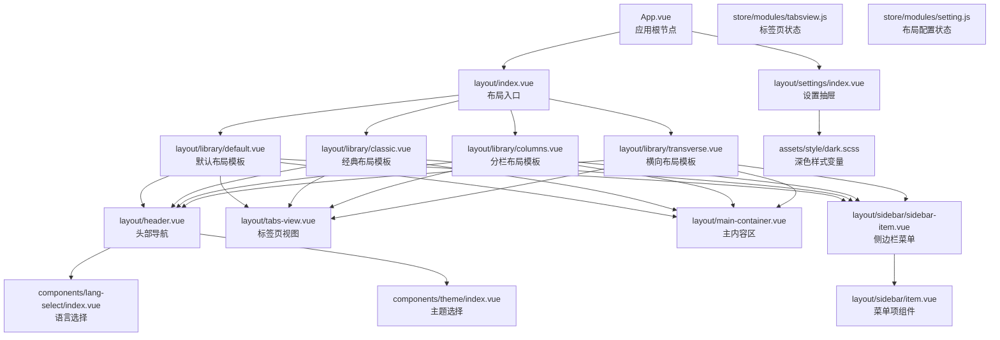
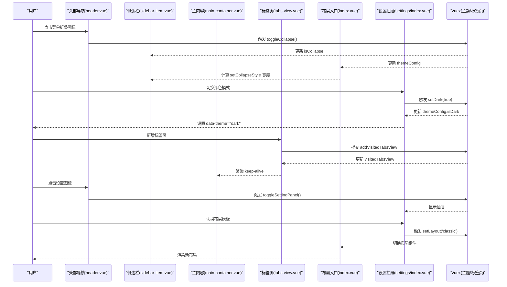
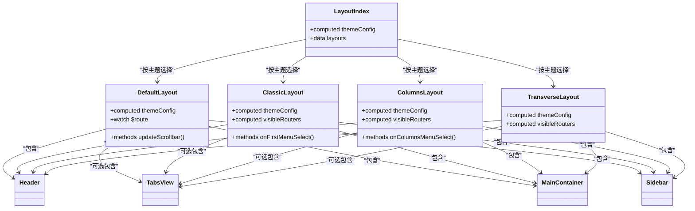
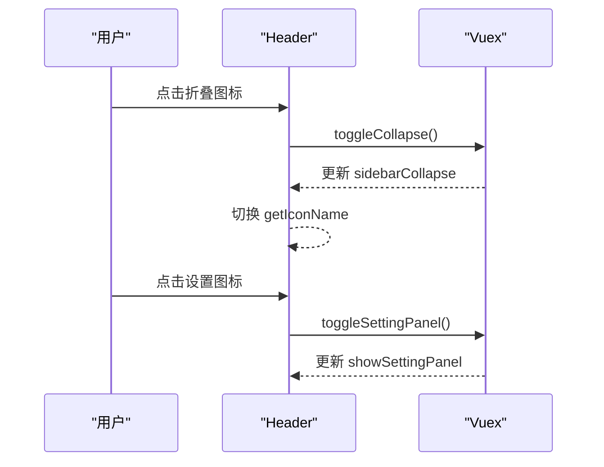
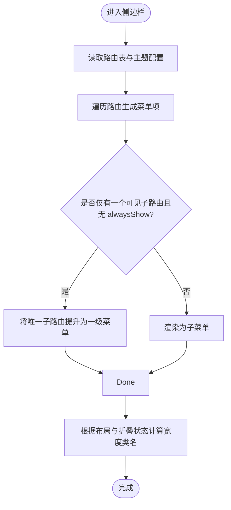
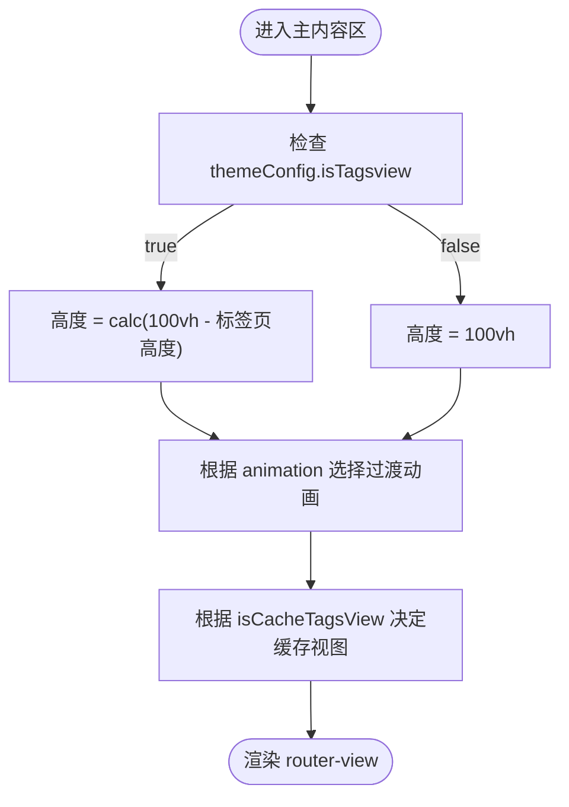
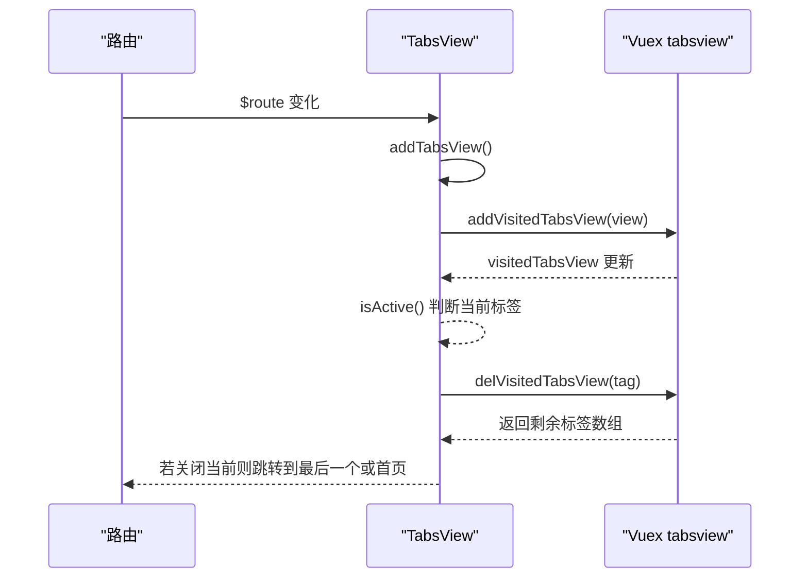
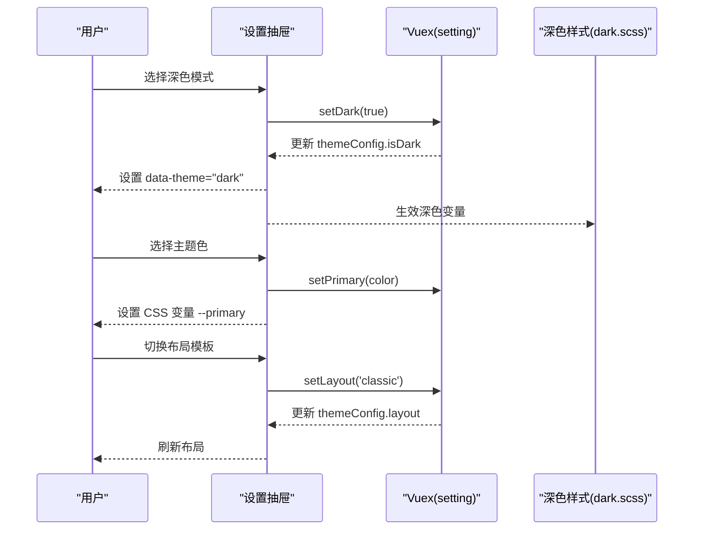
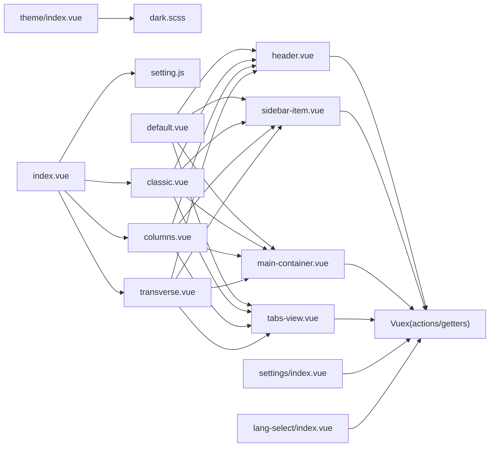

# 布局组件

<cite>
**本文引用的文件**
- [src/layout/index.vue](file://src/layout/index.vue)
- [src/layout/library/default.vue](file://src/layout/library/default.vue)
- [src/layout/library/classic.vue](file://src/layout/library/classic.vue)
- [src/layout/library/columns.vue](file://src/layout/library/columns.vue)
- [src/layout/library/transverse.vue](file://src/layout/library/transverse.vue)
- [src/layout/header.vue](file://src/layout/header.vue)
- [src/layout/sidebar/item.vue](file://src/layout/sidebar/item.vue)
- [src/layout/sidebar/sidebar-item.vue](file://src/layout/sidebar/sidebar-item.vue)
- [src/layout/main-container.vue](file://src/layout/main-container.vue)
- [src/layout/tabs-view.vue](file://src/layout/tabs-view.vue)
- [src/layout/settings/index.vue](file://src/layout/settings/index.vue)
- [src/layout/logo.vue](file://src/layout/logo.vue)
- [src/store/modules/setting.js](file://src/store/modules/setting.js)
- [src/store/modules/tabsview.js](file://src/store/modules/tabsview.js)
- [src/components/lang-select/index.vue](file://src/components/lang-select/index.vue)
- [src/components/theme/index.vue](file://src/components/theme/index.vue)
- [src/assets/style/dark.scss](file://src/assets/style/dark.scss)
- [src/App.vue](file://src/App.vue)
</cite>

## 更新摘要
**所做更改**
- 新增四种布局模板（classic、columns、transverse）的详细说明
- 更新布局入口组件以支持多布局动态切换
- 增强设置抽屉的布局切换功能和自动配置持久化系统
- 完善侧边栏重构后的菜单项渲染机制
- 新增暗色主题支持和主题配置持久化
- 更新标签页视图的样式定制化选项

## 目录
1. [简介](#简介)
2. [项目结构](#项目结构)
3. [核心组件](#核心组件)
4. [架构总览](#架构总览)
5. [组件详解](#组件详解)
6. [依赖关系分析](#依赖关系分析)
7. [性能与优化](#性能与优化)
8. [故障排查](#故障排查)
9. [结论](#结论)
10. [附录：使用与扩展指南](#附录使用与扩展指南)

## 简介
本文件面向 Vue CMS 的布局系统，围绕"主布局组件"的设计与实现进行系统化说明，涵盖四种布局模板（默认、经典、横向、分栏）的协同工作机制；阐述响应式设计、主题适配与布局切换逻辑；解释组件间通信、状态管理与数据流；并提供布局定制化（菜单折叠、主题切换、语言切换等）的实现方案、性能优化策略与扩展指南。

## 项目结构
布局系统由"布局入口"、"多布局模板"、"头部导航"、"侧边栏菜单"、"主内容区"、"标签页视图"、"设置抽屉"以及"主题/语言选择组件"构成，并通过 Vuex 模块集中管理主题配置与标签页状态，支持自动配置持久化到 localStorage。

**图表来源**
- [src/App.vue:1-35](file://src/App.vue#L1-L35)
- [src/layout/index.vue:1-33](file://src/layout/index.vue#L1-L33)
- [src/layout/library/default.vue:1-180](file://src/layout/library/default.vue#L1-L180)
- [src/layout/library/classic.vue:1-401](file://src/layout/library/classic.vue#L1-L401)
- [src/layout/library/columns.vue:1-419](file://src/layout/library/columns.vue#L1-L419)
- [src/layout/library/transverse.vue:1-285](file://src/layout/library/transverse.vue#L1-L285)
- [src/layout/header.vue:1-265](file://src/layout/header.vue#L1-L265)
- [src/layout/sidebar/sidebar-item.vue:1-90](file://src/layout/sidebar/sidebar-item.vue#L1-L90)
- [src/layout/sidebar/item.vue:1-48](file://src/layout/sidebar/item.vue#L1-L48)
- [src/layout/main-container.vue:1-121](file://src/layout/main-container.vue#L1-L121)
- [src/layout/tabs-view.vue:1-218](file://src/layout/tabs-view.vue#L1-L218)
- [src/layout/settings/index.vue:1-524](file://src/layout/settings/index.vue#L1-L524)
- [src/store/modules/setting.js:1-241](file://src/store/modules/setting.js#L1-L241)
- [src/store/modules/tabsview.js:1-49](file://src/store/modules/tabsview.js#L1-L49)
- [src/components/lang-select/index.vue:1-39](file://src/components/lang-select/index.vue#L1-L39)
- [src/components/theme/index.vue:1-42](file://src/components/theme/index.vue#L1-L42)
- [src/assets/style/dark.scss:1-457](file://src/assets/style/dark.scss#L1-L457)

**章节来源**
- [src/layout/index.vue:1-33](file://src/layout/index.vue#L1-L33)
- [src/layout/library/default.vue:1-180](file://src/layout/library/default.vue#L1-L180)
- [src/layout/library/classic.vue:1-401](file://src/layout/library/classic.vue#L1-L401)
- [src/layout/library/columns.vue:1-419](file://src/layout/library/columns.vue#L1-L419)
- [src/layout/library/transverse.vue:1-285](file://src/layout/library/transverse.vue#L1-L285)
- [src/layout/header.vue:1-265](file://src/layout/header.vue#L1-L265)
- [src/layout/sidebar/sidebar-item.vue:1-90](file://src/layout/sidebar/sidebar-item.vue#L1-L90)
- [src/layout/sidebar/item.vue:1-48](file://src/layout/sidebar/item.vue#L1-L48)
- [src/layout/main-container.vue:1-121](file://src/layout/main-container.vue#L1-L121)
- [src/layout/tabs-view.vue:1-218](file://src/layout/tabs-view.vue#L1-L218)
- [src/layout/settings/index.vue:1-524](file://src/layout/settings/index.vue#L1-L524)
- [src/store/modules/setting.js:1-241](file://src/store/modules/setting.js#L1-L241)
- [src/store/modules/tabsview.js:1-49](file://src/store/modules/tabsview.js#L1-L49)
- [src/components/lang-select/index.vue:1-39](file://src/components/lang-select/index.vue#L1-L39)
- [src/components/theme/index.vue:1-42](file://src/components/theme/index.vue#L1-L42)
- [src/assets/style/dark.scss:1-457](file://src/assets/style/dark.scss#L1-L457)

## 核心组件
- **布局入口**：根据主题配置动态选择具体布局组件，支持默认、经典、横向、分栏四种布局。
- **布局模板**：四种独立的布局实现，每种布局都有特定的菜单组织方式和视觉风格。
- **头部导航**：提供菜单折叠切换、面包屑导航、全屏、语言切换、用户下拉菜单与设置抽屉入口。
- **侧边栏菜单**：基于路由生成菜单树，支持折叠、手风琴、Logo 显示控制与不同布局下的宽度适配。
- **主内容区**：根据是否启用标签页计算高度，支持页面切换动画与缓存策略。
- **标签页视图**：记录访问历史、渲染标签项、支持关闭与横向滚动，支持多种样式定制。
- **设置抽屉**：集中管理主题色、深色模式、菜单折叠、面包屑、标签页、布局切换等全局配置。
- **语言与主题选择**：提供语言切换与主题换肤入口。
- **标签页状态**：Vuex 模块维护已访问标签页集合。
- **自动配置持久化**：设置配置自动保存到 localStorage 并在刷新后恢复。

**章节来源**
- [src/layout/index.vue:1-33](file://src/layout/index.vue#L1-L33)
- [src/layout/library/default.vue:1-180](file://src/layout/library/default.vue#L1-L180)
- [src/layout/library/classic.vue:1-401](file://src/layout/library/classic.vue#L1-L401)
- [src/layout/library/columns.vue:1-419](file://src/layout/library/columns.vue#L1-L419)
- [src/layout/library/transverse.vue:1-285](file://src/layout/library/transverse.vue#L1-L285)
- [src/layout/header.vue:1-265](file://src/layout/header.vue#L1-L265)
- [src/layout/sidebar/sidebar-item.vue:1-90](file://src/layout/sidebar/sidebar-item.vue#L1-L90)
- [src/layout/sidebar/item.vue:1-48](file://src/layout/sidebar/item.vue#L1-L48)
- [src/layout/main-container.vue:1-121](file://src/layout/main-container.vue#L1-L121)
- [src/layout/tabs-view.vue:1-218](file://src/layout/tabs-view.vue#L1-L218)
- [src/layout/settings/index.vue:1-524](file://src/layout/settings/index.vue#L1-L524)
- [src/store/modules/setting.js:1-241](file://src/store/modules/setting.js#L1-L241)
- [src/store/modules/tabsview.js:1-49](file://src/store/modules/tabsview.js#L1-L49)
- [src/components/lang-select/index.vue:1-39](file://src/components/lang-select/index.vue#L1-L39)
- [src/components/theme/index.vue:1-42](file://src/components/theme/index.vue#L1-L42)

## 架构总览
布局系统采用"入口组件 + 多模板组件 + 子组件 + 设置抽屉 + 状态模块"的分层架构。主题配置作为单一事实源驱动各子组件行为；头部与侧边栏通过 Vuex 动作与 Getter 实现跨组件通信；标签页视图通过 Vuex 持久化访问历史；设置抽屉统一变更主题配置并触发 DOM 属性或 CSS 变量更新，支持自动配置持久化。

**图表来源**
- [src/layout/header.vue:110-173](file://src/layout/header.vue#L110-L173)
- [src/layout/sidebar/sidebar-item.vue:64-94](file://src/layout/sidebar/sidebar-item.vue#L64-L94)
- [src/layout/main-container.vue:32-56](file://src/layout/main-container.vue#L32-L56)
- [src/layout/tabs-view.vue:33-81](file://src/layout/tabs-view.vue#L33-L81)
- [src/layout/index.vue:13-30](file://src/layout/index.vue#L13-L30)
- [src/layout/settings/index.vue:304-306](file://src/layout/settings/index.vue#L304-L306)
- [src/store/modules/tabsview.js:29-41](file://src/store/modules/tabsview.js#L29-L41)

## 组件详解

### 布局入口与多布局模板
- **布局入口**根据主题配置动态选择具体布局组件，支持默认、经典、横向、分栏四种布局。
- **布局模板**各自组合侧边栏、头部、标签页与主内容区；监听路由变化后更新滚动条，保证新页面滚动位置正确。
- **布局切换**通过设置抽屉的布局选择器实现，支持实时预览和一键恢复默认设置。

**图表来源**
- [src/layout/index.vue:15-30](file://src/layout/index.vue#L15-L30)
- [src/layout/library/default.vue:26-82](file://src/layout/library/default.vue#L26-L82)
- [src/layout/library/classic.vue:91-236](file://src/layout/library/classic.vue#L91-L236)
- [src/layout/library/columns.vue:104-274](file://src/layout/library/columns.vue#L104-L274)
- [src/layout/library/transverse.vue:73-151](file://src/layout/library/transverse.vue#L73-L151)

**章节来源**
- [src/layout/index.vue:1-33](file://src/layout/index.vue#L1-L33)
- [src/layout/library/default.vue:1-180](file://src/layout/library/default.vue#L1-L180)
- [src/layout/library/classic.vue:1-401](file://src/layout/library/classic.vue#L1-L401)
- [src/layout/library/columns.vue:1-419](file://src/layout/library/columns.vue#L1-L419)
- [src/layout/library/transverse.vue:1-285](file://src/layout/library/transverse.vue#L1-L285)

### 头部导航
- **功能点**：菜单折叠切换、面包屑导航（可配置显示/图标）、全屏、语言选择、用户下拉菜单、打开设置抽屉。
- **数据流**：通过 mapGetters 读取用户名、头像、侧边栏折叠状态与路由表；通过 mapActions 触发 Vuex 动作切换折叠状态、打开设置面板与退出登录。
- **响应式**：根据主题配置决定是否显示面包屑与图标；根据折叠状态动态切换折叠/展开图标。

**图表来源**
- [src/layout/header.vue:86-94](file://src/layout/header.vue#L86-L94)
- [src/layout/header.vue:110-124](file://src/layout/header.vue#L110-L124)
- [src/layout/header.vue:101-108](file://src/layout/header.vue#L101-L108)

**章节来源**
- [src/layout/header.vue:1-265](file://src/layout/header.vue#L1-L265)

### 侧边栏菜单
- **菜单生成**：基于路由表生成菜单树，支持"单子路由提升为一级""手风琴展开"等规则。
- **折叠适配**：根据布局类型与折叠状态动态计算宽度类名，确保动画与视觉一致性。
- **主题适配**：菜单项与子菜单标题颜色、悬停态、激活态均使用 CSS 变量，配合深色样式文件生效。

**图表来源**
- [src/layout/sidebar/sidebar-item.vue:36-50](file://src/layout/sidebar/sidebar-item.vue#L36-L50)
- [src/layout/sidebar/sidebar-item.vue:64-94](file://src/layout/sidebar/sidebar-item.vue#L64-L94)

**章节来源**
- [src/layout/sidebar/sidebar-item.vue:1-90](file://src/layout/sidebar/sidebar-item.vue#L1-L90)
- [src/layout/sidebar/item.vue:1-48](file://src/layout/sidebar/item.vue#L1-L48)

### 主内容区
- **高度计算**：根据是否启用标签页和当前布局类型决定主内容区高度，避免遮挡。
- **动画与缓存**：根据主题配置选择页面切换动画；根据缓存开关决定 keep-alive 包裹的视图集合。

**图表来源**
- [src/layout/main-container.vue:32-56](file://src/layout/main-container.vue#L32-L56)

**章节来源**
- [src/layout/main-container.vue:1-121](file://src/layout/main-container.vue#L1-L121)

### 标签页视图
- **访问记录**：在路由变化时写入标签页集合，避免重复添加；关闭标签页时回退到上一个标签页。
- **渲染与交互**：支持图标、关闭、横向滚动与多种标签样式；通过 $t 对标题进行国际化。
- **样式定制**：支持卡片样式、简约样式、圆滑样式三种预设样式。

**图表来源**
- [src/layout/tabs-view.vue:33-81](file://src/layout/tabs-view.vue#L33-L81)
- [src/store/modules/tabsview.js:29-41](file://src/store/modules/tabsview.js#L29-L41)

**章节来源**
- [src/layout/tabs-view.vue:1-218](file://src/layout/tabs-view.vue#L1-L218)
- [src/store/modules/tabsview.js:1-49](file://src/store/modules/tabsview.js#L1-L49)

### 设置抽屉与主题/语言
- **设置抽屉**：集中管理主题色、深色模式、菜单折叠、面包屑、标签页、布局切换、页面动画、Logo/页脚显示等。
- **布局切换**：支持四种布局模板的可视化切换，包含布局预览和一键恢复默认设置。
- **主题适配**：通过设置抽屉变更 CSS 变量与 data-theme 属性，配合深色样式文件实现全局主题切换。
- **语言切换**：通过语言选择组件设置 i18n 语言并持久化到 Vuex。
- **自动持久化**：所有设置自动保存到 localStorage，在刷新后恢复。

**图表来源**
- [src/layout/settings/index.vue:206-304](file://src/layout/settings/index.vue#L206-L304)
- [src/assets/style/dark.scss:4-457](file://src/assets/style/dark.scss#L4-L457)

**章节来源**
- [src/layout/settings/index.vue:1-524](file://src/layout/settings/index.vue#L1-L524)
- [src/components/lang-select/index.vue:1-39](file://src/components/lang-select/index.vue#L1-L39)
- [src/components/theme/index.vue:1-42](file://src/components/theme/index.vue#L1-L42)
- [src/assets/style/dark.scss:1-457](file://src/assets/style/dark.scss#L1-L457)
- [src/store/modules/setting.js:70-102](file://src/store/modules/setting.js#L70-L102)

## 依赖关系分析
- **组件耦合**：布局入口聚合多个布局模板；头部与侧边栏通过 Vuex 间接耦合；设置抽屉与主题/语言组件通过 Vuex 与 DOM 属性耦合。
- **状态管理**：主题配置与标签页状态分别由 Vuex 模块集中管理，避免跨组件重复维护。
- **自动持久化**：设置模块订阅 store 变化，自动保存配置到 localStorage。
- **外部依赖**：Element UI 组件库用于菜单、面包屑、标签、抽屉等；SVG 图标组件用于图标渲染；SCSS 变量与深色样式文件提供主题适配。

**图表来源**
- [src/layout/header.vue:76-94](file://src/layout/header.vue#L76-L94)
- [src/layout/sidebar/sidebar-item.vue:18-35](file://src/layout/sidebar/sidebar-item.vue#L18-L35)
- [src/layout/main-container.vue:15-28](file://src/layout/main-container.vue#L15-L28)
- [src/layout/tabs-view.vue:18-32](file://src/layout/tabs-view.vue#L18-L32)
- [src/layout/settings/index.vue:189-200](file://src/layout/settings/index.vue#L189-L200)
- [src/layout/index.vue:13-30](file://src/layout/index.vue#L13-L30)
- [src/components/lang-select/index.vue:13-31](file://src/components/lang-select/index.vue#L13-L31)
- [src/components/theme/index.vue:14-41](file://src/components/theme/index.vue#L14-L41)
- [src/assets/style/dark.scss:1-457](file://src/assets/style/dark.scss#L1-L457)
- [src/store/modules/setting.js:233-241](file://src/store/modules/setting.js#L233-L241)

**章节来源**
- [src/layout/header.vue:1-265](file://src/layout/header.vue#L1-L265)
- [src/layout/sidebar/sidebar-item.vue:1-90](file://src/layout/sidebar/sidebar-item.vue#L1-L90)
- [src/layout/main-container.vue:1-121](file://src/layout/main-container.vue#L1-L121)
- [src/layout/tabs-view.vue:1-218](file://src/layout/tabs-view.vue#L1-L218)
- [src/layout/settings/index.vue:1-524](file://src/layout/settings/index.vue#L1-L524)
- [src/layout/index.vue:1-33](file://src/layout/index.vue#L1-L33)
- [src/components/lang-select/index.vue:1-39](file://src/components/lang-select/index.vue#L1-L39)
- [src/components/theme/index.vue:1-42](file://src/components/theme/index.vue#L1-L42)
- [src/assets/style/dark.scss:1-457](file://src/assets/style/dark.scss#L1-L457)
- [src/store/modules/setting.js:1-241](file://src/store/modules/setting.js#L1-L241)

## 性能与优化
- **路由切换滚动复位**：在默认布局中监听路由变化后延迟更新滚动条，避免异步组件加载导致的 DOM 不一致。
- **标签页缓存**：根据 isCacheTagsView 控制 keep-alive 缓存集合，减少重复渲染成本。
- **菜单渲染优化**：通过"单子路由提升"减少层级，降低菜单渲染复杂度。
- **主题切换**：通过 CSS 变量与 data-theme 属性切换，避免全量样式重绘。
- **深色样式**：集中变量定义，减少重复声明与计算。
- **自动配置持久化**：设置模块订阅 store 变化，自动保存配置到 localStorage，避免重复维护。
- **布局模板优化**：每种布局模板独立实现，避免不必要的组件渲染。

**章节来源**
- [src/layout/library/default.vue:66-82](file://src/layout/library/default.vue#L66-L82)
- [src/layout/main-container.vue:52-56](file://src/layout/main-container.vue#L52-L56)
- [src/layout/sidebar/sidebar-item.vue:64-94](file://src/layout/sidebar/sidebar-item.vue#L64-L94)
- [src/layout/settings/index.vue:234-246](file://src/layout/settings/index.vue#L234-L246)
- [src/assets/style/dark.scss:4-457](file://src/assets/style/dark.scss#L4-L457)
- [src/store/modules/setting.js:233-241](file://src/store/modules/setting.js#L233-L241)

## 故障排查
- **面包屑不显示**：检查 themeConfig.isBreadcrumb 与路由 meta.title/hidden 字段。
- **菜单图标不显示**：确认 isBreadcrumbIcon 与 meta.icon 值，区分普通图标与 SVG 图标。
- **标签页无法关闭**：确认路由 name 是否存在，以及 tabsview 模块的去重逻辑。
- **深色模式无效**：确认 data-theme 属性是否正确设置，以及 dark.scss 是否被正确引入。
- **设置抽屉不显示**：确认 App.vue 中是否挂载了设置组件，且 Vuex 中 showSettingPanel 状态正常。
- **布局切换失败**：检查设置抽屉中的布局选择器是否正确，以及 themeConfig.layout 值是否更新。
- **配置不持久化**：确认 localStorage 中是否存在 vue-cms-setting 键，以及 settingPlugin 是否正常工作。

**章节来源**
- [src/layout/header.vue:128-153](file://src/layout/header.vue#L128-L153)
- [src/layout/tabs-view.vue:38-81](file://src/layout/tabs-view.vue#L38-L81)
- [src/layout/settings/index.vue:225-227](file://src/layout/settings/index.vue#L225-L227)
- [src/App.vue:8-24](file://src/App.vue#L8-L24)
- [src/store/modules/setting.js:70-102](file://src/store/modules/setting.js#L70-L102)

## 结论
该布局系统以"主题配置为中心"，通过入口组件与四种布局模板整合头部、侧边栏、标签页与主内容区，结合设置抽屉实现主题、布局与交互的动态切换；借助 Vuex 管理状态与数据流，组件间通过 Getter/Action 解耦协作。新增的四种布局模板提供了更丰富的用户体验，自动配置持久化系统确保了良好的用户体验，整体结构清晰、扩展性强，适合在多布局、多主题场景下持续演进。

## 附录：使用与扩展指南
- **启用/禁用标签页**：在设置抽屉中切换 isTagsview，并根据需要开启标签页图标与缓存。
- **切换菜单折叠与手风琴**：通过设置抽屉控制 isCollapse 与 isUniqueOpened。
- **面包屑配置**：通过 isBreadcrumb 与 isBreadcrumbIcon 控制显示与图标。
- **主题与深色模式**：通过设置抽屉选择主题色与深色模式；也可通过主题选择组件快速切换预设主题。
- **布局切换**：在设置抽屉中选择 layout（defaults/classic/transverse/columns），并观察侧边栏宽度与菜单行为变化。
- **语言切换**：通过语言选择组件在中文与英文之间切换，并持久化到 Vuex。
- **标签页样式定制**：通过设置抽屉选择标签页样式（卡片/简约/圆滑）。
- **自动配置持久化**：所有设置自动保存到 localStorage，刷新后自动恢复。
- **扩展建议**：
  - 新增布局：在布局入口注册新布局组件并在设置抽屉中暴露切换入口。
  - 新增主题：新增 SCSS 变量文件并通过主题选择组件切换。
  - 自定义菜单：在路由 meta 中增加图标、标题与隐藏字段，配合菜单项渲染逻辑。
  - 性能优化：对长列表与大图标的渲染进行懒加载与节流；合理使用 keep-alive 缓存。

**章节来源**
- [src/layout/settings/index.vue:106-175](file://src/layout/settings/index.vue#L106-L175)
- [src/layout/settings/index.vue:228-304](file://src/layout/settings/index.vue#L228-L304)
- [src/components/lang-select/index.vue:22-31](file://src/components/lang-select/index.vue#L22-L31)
- [src/components/theme/index.vue:18-39](file://src/components/theme/index.vue#L18-L39)
- [src/layout/sidebar/sidebar-item.vue:36-50](file://src/layout/sidebar/sidebar-item.vue#L36-L50)
- [src/store/modules/setting.js:70-102](file://src/store/modules/setting.js#L70-L102)