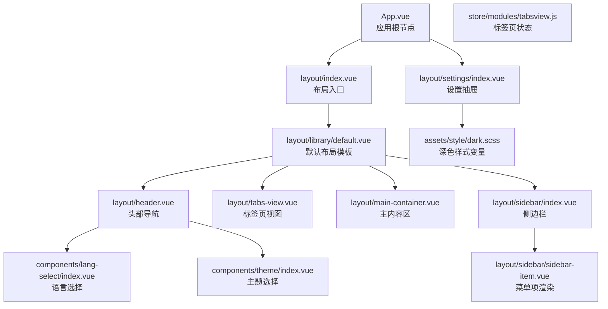
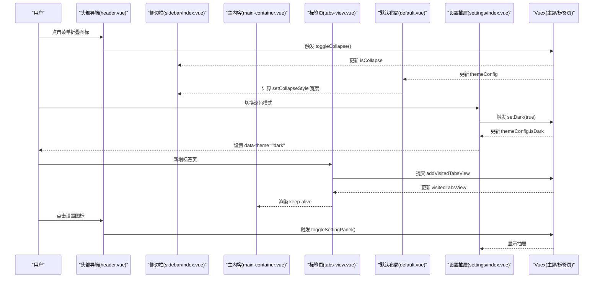
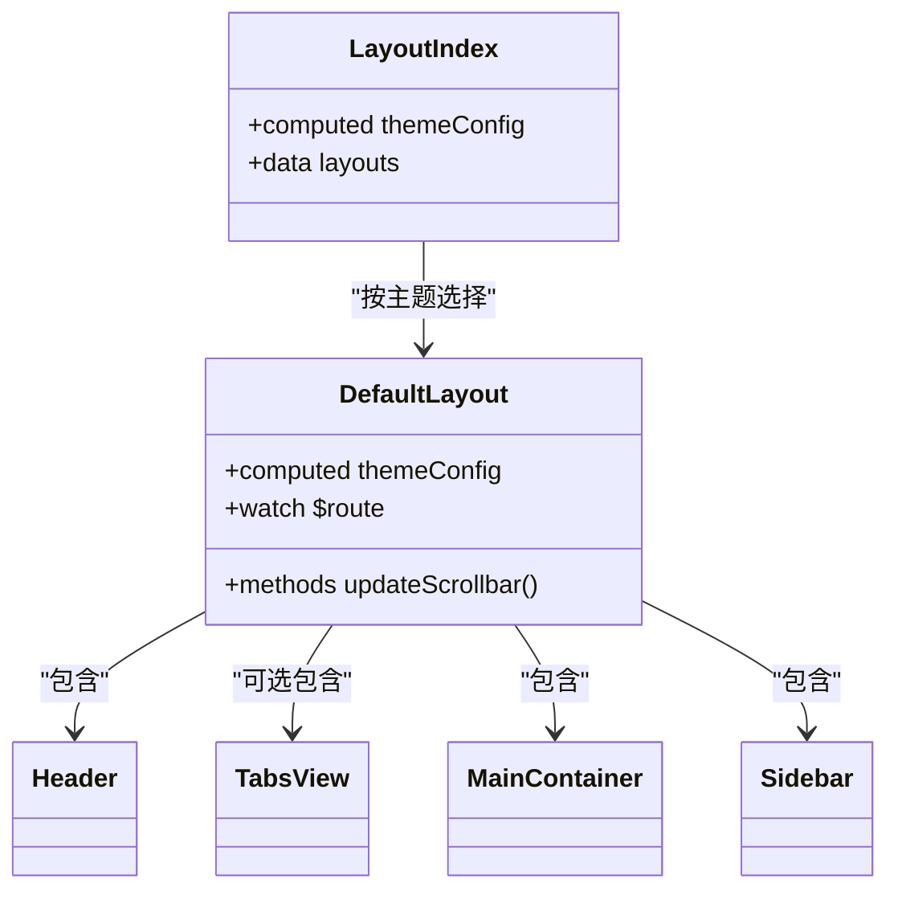
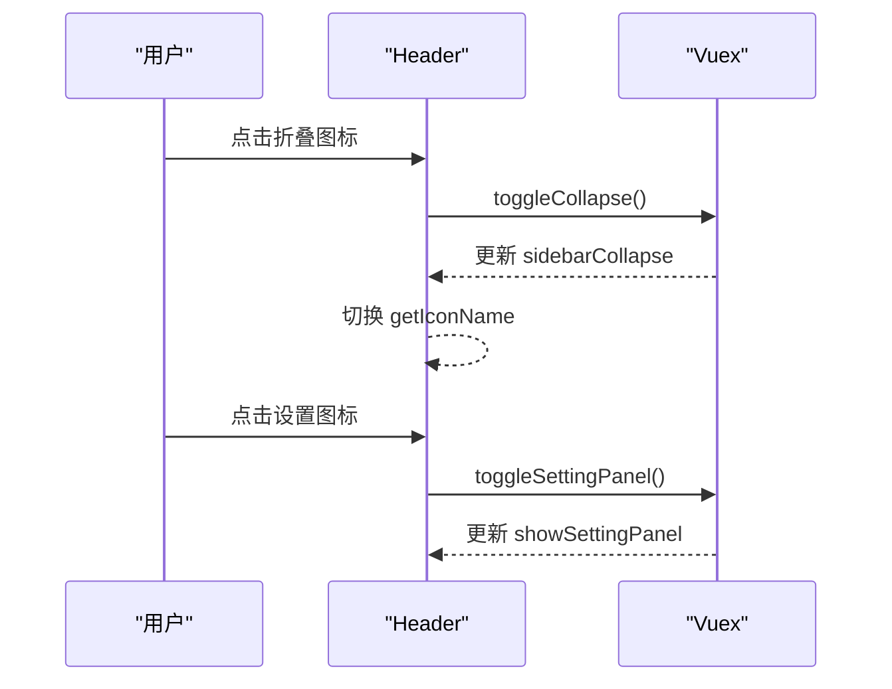
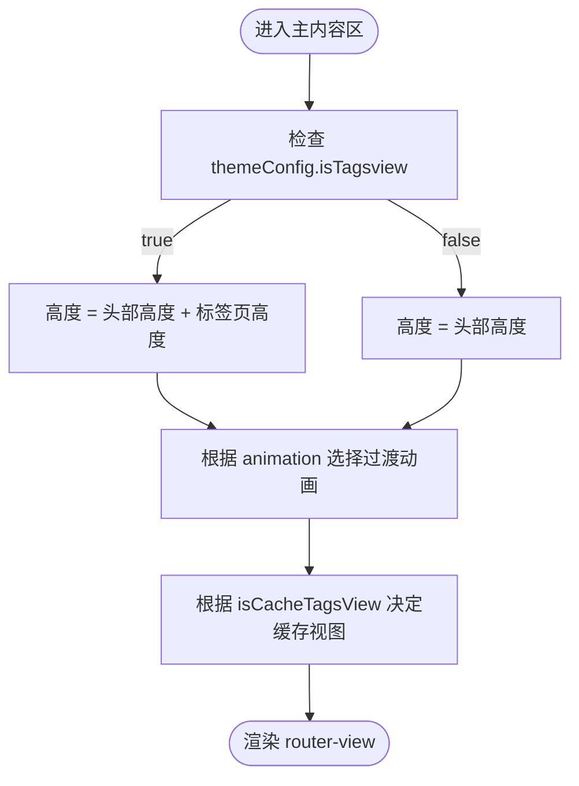
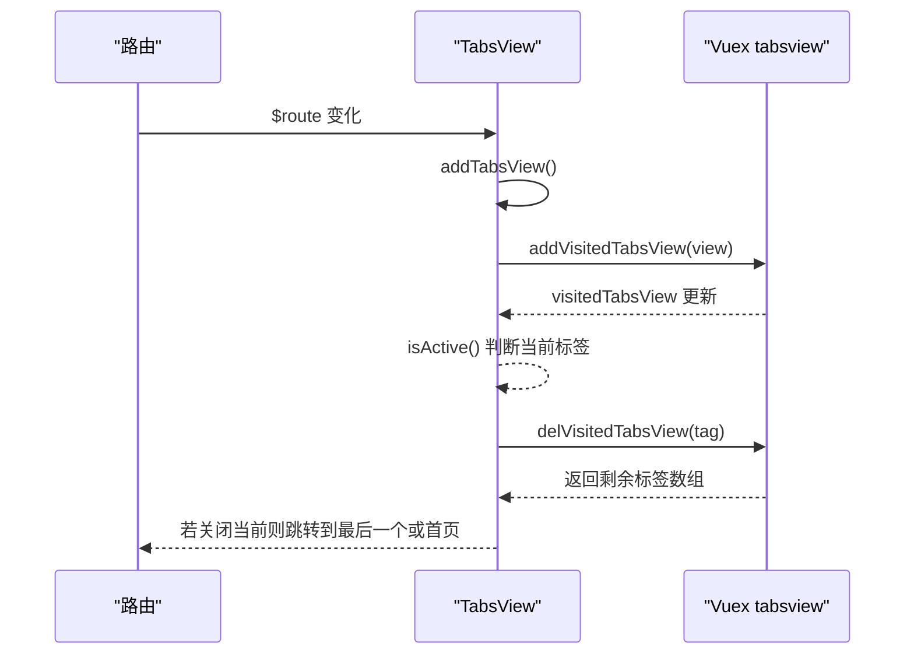
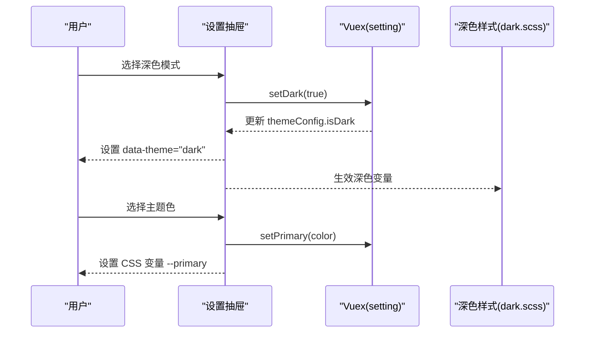
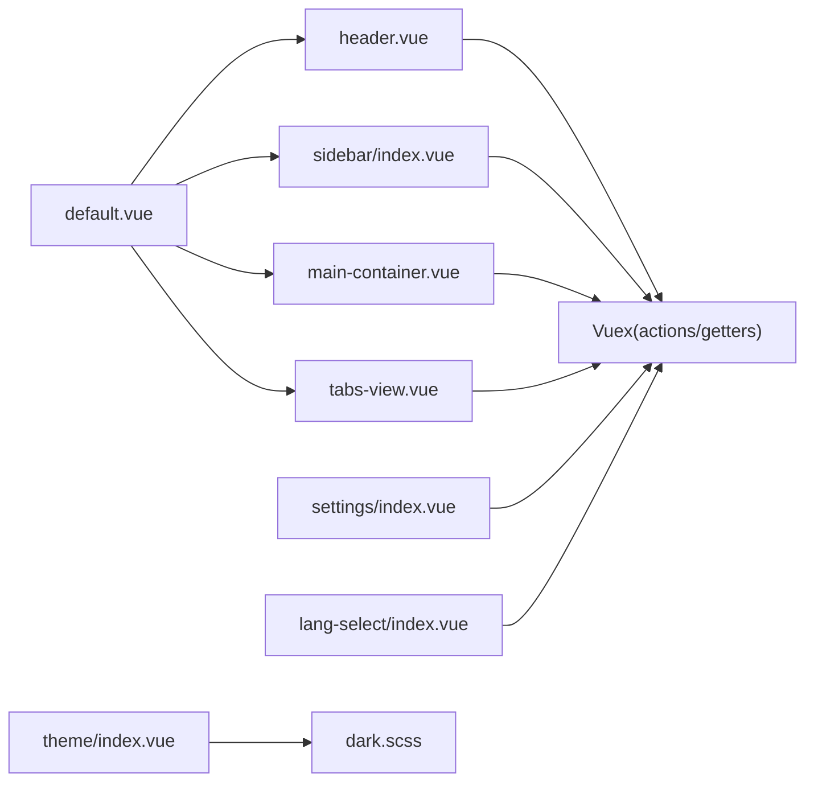

# 布局组件

<cite>
**本文引用的文件**
- [src/layout/index.vue](file://src/layout/index.vue)
- [src/layout/library/default.vue](file://src/layout/library/default.vue)
- [src/layout/header.vue](file://src/layout/header.vue)
- [src/layout/sidebar/index.vue](file://src/layout/sidebar/index.vue)
- [src/layout/sidebar/sidebar-item.vue](file://src/layout/sidebar/sidebar-item.vue)
- [src/layout/main-container.vue](file://src/layout/main-container.vue)
- [src/layout/tabs-view.vue](file://src/layout/tabs-view.vue)
- [src/layout/settings/index.vue](file://src/layout/settings/index.vue)
- [src/App.vue](file://src/App.vue)
- [src/store/modules/tabsview.js](file://src/store/modules/tabsview.js)
- [src/components/lang-select/index.vue](file://src/components/lang-select/index.vue)
- [src/components/theme/index.vue](file://src/components/theme/index.vue)
- [src/assets/style/dark.scss](file://src/assets/style/dark.scss)
</cite>

## 目录
1. [简介](#简介)
2. [项目结构](#项目结构)
3. [核心组件](#核心组件)
4. [架构总览](#架构总览)
5. [组件详解](#组件详解)
6. [依赖关系分析](#依赖关系分析)
7. [性能与优化](#性能与优化)
8. [故障排查](#故障排查)
9. [结论](#结论)
10. [附录：使用与扩展指南](#附录使用与扩展指南)

## 简介
本文件面向 Vue CMS 的布局系统，围绕“主布局组件”的设计与实现进行系统化说明，涵盖头部导航、侧边栏菜单、主内容区域与标签页视图的协同工作机制；阐述响应式设计、主题适配与布局切换逻辑；解释组件间通信、状态管理与数据流；并提供布局定制化（菜单折叠、主题切换、语言切换等）的实现方案、性能优化策略与扩展指南。

## 项目结构
布局系统由“布局入口”“默认布局模板”“头部导航”“侧边栏菜单”“主内容区”“标签页视图”“设置抽屉”以及“主题/语言选择组件”构成，并通过 Vuex 模块集中管理主题配置与标签页状态。

图表来源
- [src/App.vue:1-35](file://src/App.vue#L1-L35)
- [src/layout/index.vue:1-32](file://src/layout/index.vue#L1-L32)
- [src/layout/library/default.vue:1-87](file://src/layout/library/default.vue#L1-L87)
- [src/layout/header.vue:1-270](file://src/layout/header.vue#L1-L270)
- [src/layout/sidebar/index.vue:1-142](file://src/layout/sidebar/index.vue#L1-L142)
- [src/layout/sidebar/sidebar-item.vue:1-107](file://src/layout/sidebar/sidebar-item.vue#L1-L107)
- [src/layout/main-container.vue:1-109](file://src/layout/main-container.vue#L1-L109)
- [src/layout/tabs-view.vue:1-209](file://src/layout/tabs-view.vue#L1-L209)
- [src/layout/settings/index.vue:1-512](file://src/layout/settings/index.vue#L1-L512)
- [src/store/modules/tabsview.js:1-49](file://src/store/modules/tabsview.js#L1-L49)
- [src/components/lang-select/index.vue:1-39](file://src/components/lang-select/index.vue#L1-L39)
- [src/components/theme/index.vue:1-42](file://src/components/theme/index.vue#L1-L42)
- [src/assets/style/dark.scss:1-457](file://src/assets/style/dark.scss#L1-L457)

章节来源
- [src/layout/index.vue:1-32](file://src/layout/index.vue#L1-L32)
- [src/layout/library/default.vue:1-87](file://src/layout/library/default.vue#L1-L87)
- [src/layout/header.vue:1-270](file://src/layout/header.vue#L1-L270)
- [src/layout/sidebar/index.vue:1-142](file://src/layout/sidebar/index.vue#L1-L142)
- [src/layout/sidebar/sidebar-item.vue:1-107](file://src/layout/sidebar/sidebar-item.vue#L1-L107)
- [src/layout/main-container.vue:1-109](file://src/layout/main-container.vue#L1-L109)
- [src/layout/tabs-view.vue:1-209](file://src/layout/tabs-view.vue#L1-L209)
- [src/layout/settings/index.vue:1-512](file://src/layout/settings/index.vue#L1-L512)
- [src/App.vue:1-35](file://src/App.vue#L1-L35)
- [src/store/modules/tabsview.js:1-49](file://src/store/modules/tabsview.js#L1-L49)
- [src/components/lang-select/index.vue:1-39](file://src/components/lang-select/index.vue#L1-L39)
- [src/components/theme/index.vue:1-42](file://src/components/theme/index.vue#L1-L42)
- [src/assets/style/dark.scss:1-457](file://src/assets/style/dark.scss#L1-L457)

## 核心组件
- 布局入口：根据主题配置动态选择布局组件，当前仅支持默认布局。
- 默认布局模板：组合侧边栏、头部、标签页与主内容区，负责滚动条复位与路由变化联动。
- 头部导航：提供菜单折叠切换、面包屑导航、全屏、语言切换、用户下拉菜单与设置抽屉入口。
- 侧边栏菜单：基于路由生成菜单树，支持折叠、手风琴、Logo 显示控制与不同布局下的宽度适配。
- 主内容区：根据是否启用标签页计算高度，支持页面切换动画与缓存策略。
- 标签页视图：记录访问历史、渲染标签项、支持关闭与横向滚动。
- 设置抽屉：集中管理主题色、深色模式、菜单折叠、面包屑、标签页、布局切换等全局配置。
- 语言与主题选择：提供语言切换与主题换肤入口。
- 标签页状态：Vuex 模块维护已访问标签页集合。

章节来源
- [src/layout/index.vue:1-32](file://src/layout/index.vue#L1-L32)
- [src/layout/library/default.vue:1-87](file://src/layout/library/default.vue#L1-L87)
- [src/layout/header.vue:1-270](file://src/layout/header.vue#L1-L270)
- [src/layout/sidebar/index.vue:1-142](file://src/layout/sidebar/index.vue#L1-L142)
- [src/layout/sidebar/sidebar-item.vue:1-107](file://src/layout/sidebar/sidebar-item.vue#L1-L107)
- [src/layout/main-container.vue:1-109](file://src/layout/main-container.vue#L1-L109)
- [src/layout/tabs-view.vue:1-209](file://src/layout/tabs-view.vue#L1-L209)
- [src/layout/settings/index.vue:1-512](file://src/layout/settings/index.vue#L1-L512)
- [src/store/modules/tabsview.js:1-49](file://src/store/modules/tabsview.js#L1-L49)
- [src/components/lang-select/index.vue:1-39](file://src/components/lang-select/index.vue#L1-L39)
- [src/components/theme/index.vue:1-42](file://src/components/theme/index.vue#L1-L42)

## 架构总览
布局系统采用“入口组件 + 模板组件 + 子组件 + 设置抽屉 + 状态模块”的分层架构。主题配置作为单一事实源驱动各子组件行为；头部与侧边栏通过 Vuex 动作与 Getter 实现跨组件通信；标签页视图通过 Vuex 持久化访问历史；设置抽屉统一变更主题配置并触发 DOM 属性或 CSS 变量更新。

图表来源
- [src/layout/header.vue:109-173](file://src/layout/header.vue#L109-L173)
- [src/layout/sidebar/index.vue:36-50](file://src/layout/sidebar/index.vue#L36-L50)
- [src/layout/library/default.vue:39-57](file://src/layout/library/default.vue#L39-L57)
- [src/layout/main-container.vue:25-56](file://src/layout/main-container.vue#L25-L56)
- [src/layout/tabs-view.vue:33-81](file://src/layout/tabs-view.vue#L33-L81)
- [src/layout/settings/index.vue:206-304](file://src/layout/settings/index.vue#L206-L304)
- [src/store/modules/tabsview.js:29-41](file://src/store/modules/tabsview.js#L29-L41)

## 组件详解

### 布局入口与默认布局模板
- 布局入口根据主题配置动态选择具体布局组件，默认仅绑定“默认布局”。
- 默认布局模板组合侧边栏、头部、标签页与主内容区；监听路由变化后更新滚动条，保证新页面滚动位置正确。

图表来源
- [src/layout/index.vue:15-30](file://src/layout/index.vue#L15-L30)
- [src/layout/library/default.vue:26-58](file://src/layout/library/default.vue#L26-L58)

章节来源
- [src/layout/index.vue:1-32](file://src/layout/index.vue#L1-L32)
- [src/layout/library/default.vue:1-87](file://src/layout/library/default.vue#L1-L87)

### 头部导航
- 功能点：菜单折叠切换、面包屑导航（可配置显示/图标）、全屏、语言选择、用户下拉菜单、打开设置抽屉。
- 数据流：通过 mapGetters 读取用户名、头像、侧边栏折叠状态与路由表；通过 mapActions 触发 Vuex 动作切换折叠状态、打开设置面板与退出登录。
- 响应式：根据主题配置决定是否显示面包屑与图标；根据折叠状态动态切换折叠/展开图标。

图表来源
- [src/layout/header.vue:86-94](file://src/layout/header.vue#L86-L94)
- [src/layout/header.vue:110-124](file://src/layout/header.vue#L110-L124)
- [src/layout/header.vue:101-108](file://src/layout/header.vue#L101-L108)

章节来源
- [src/layout/header.vue:1-270](file://src/layout/header.vue#L1-L270)

### 侧边栏菜单
- 菜单生成：基于路由表生成菜单树，支持“单子路由提升为一级”“手风琴展开”等规则。
- 折叠适配：根据布局类型与折叠状态动态计算宽度类名，确保动画与视觉一致性。
- 主题适配：菜单项与子菜单标题颜色、悬停态、激活态均使用 CSS 变量，配合深色样式文件生效。

图表来源
- [src/layout/sidebar/index.vue:36-50](file://src/layout/sidebar/index.vue#L36-L50)
- [src/layout/sidebar/sidebar-item.vue:64-94](file://src/layout/sidebar/sidebar-item.vue#L64-L94)

章节来源
- [src/layout/sidebar/index.vue:1-142](file://src/layout/sidebar/index.vue#L1-L142)
- [src/layout/sidebar/sidebar-item.vue:1-107](file://src/layout/sidebar/sidebar-item.vue#L1-L107)

### 主内容区
- 高度计算：根据是否启用标签页决定主内容区高度，避免遮挡。
- 动画与缓存：根据主题配置选择页面切换动画；根据缓存开关决定 keep-alive 包裹的视图集合。

图表来源
- [src/layout/main-container.vue:32-56](file://src/layout/main-container.vue#L32-L56)

章节来源
- [src/layout/main-container.vue:1-109](file://src/layout/main-container.vue#L1-L109)

### 标签页视图
- 访问记录：在路由变化时写入标签页集合，避免重复添加；关闭标签页时回退到上一个标签页。
- 渲染与交互：支持图标、关闭、横向滚动与多种标签样式；通过 $t 对标题进行国际化。

图表来源
- [src/layout/tabs-view.vue:33-81](file://src/layout/tabs-view.vue#L33-L81)
- [src/store/modules/tabsview.js:29-41](file://src/store/modules/tabsview.js#L29-L41)

章节来源
- [src/layout/tabs-view.vue:1-209](file://src/layout/tabs-view.vue#L1-L209)
- [src/store/modules/tabsview.js:1-49](file://src/store/modules/tabsview.js#L1-L49)

### 设置抽屉与主题/语言
- 设置抽屉：集中管理主题色、深色模式、菜单折叠、面包屑、标签页、布局切换、页面动画、Logo/页脚显示等。
- 主题适配：通过设置抽屉变更 CSS 变量与 data-theme 属性，配合深色样式文件实现全局主题切换。
- 语言切换：通过语言选择组件设置 i18n 语言并持久化到 Vuex。

图表来源
- [src/layout/settings/index.vue:206-304](file://src/layout/settings/index.vue#L206-L304)
- [src/assets/style/dark.scss:4-457](file://src/assets/style/dark.scss#L4-L457)

章节来源
- [src/layout/settings/index.vue:1-512](file://src/layout/settings/index.vue#L1-L512)
- [src/components/lang-select/index.vue:1-39](file://src/components/lang-select/index.vue#L1-L39)
- [src/components/theme/index.vue:1-42](file://src/components/theme/index.vue#L1-L42)
- [src/assets/style/dark.scss:1-457](file://src/assets/style/dark.scss#L1-L457)

## 依赖关系分析
- 组件耦合：默认布局模板聚合多个子组件；头部与侧边栏通过 Vuex 间接耦合；设置抽屉与主题/语言组件通过 Vuex 与 DOM 属性耦合。
- 状态管理：主题配置与标签页状态分别由 Vuex 模块集中管理，避免跨组件重复维护。
- 外部依赖：Element UI 组件库用于菜单、面包屑、标签、抽屉等；SVG 图标组件用于图标渲染；SCSS 变量与深色样式文件提供主题适配。

图表来源
- [src/layout/header.vue:76-94](file://src/layout/header.vue#L76-L94)
- [src/layout/sidebar/index.vue:18-35](file://src/layout/sidebar/index.vue#L18-L35)
- [src/layout/main-container.vue:15-28](file://src/layout/main-container.vue#L15-L28)
- [src/layout/tabs-view.vue:18-32](file://src/layout/tabs-view.vue#L18-L32)
- [src/layout/settings/index.vue:189-200](file://src/layout/settings/index.vue#L189-L200)
- [src/components/lang-select/index.vue:13-31](file://src/components/lang-select/index.vue#L13-L31)
- [src/components/theme/index.vue:14-41](file://src/components/theme/index.vue#L14-L41)
- [src/assets/style/dark.scss:1-457](file://src/assets/style/dark.scss#L1-L457)

章节来源
- [src/layout/header.vue:1-270](file://src/layout/header.vue#L1-L270)
- [src/layout/sidebar/index.vue:1-142](file://src/layout/sidebar/index.vue#L1-L142)
- [src/layout/main-container.vue:1-109](file://src/layout/main-container.vue#L1-L109)
- [src/layout/tabs-view.vue:1-209](file://src/layout/tabs-view.vue#L1-L209)
- [src/layout/settings/index.vue:1-512](file://src/layout/settings/index.vue#L1-L512)
- [src/components/lang-select/index.vue:1-39](file://src/components/lang-select/index.vue#L1-L39)
- [src/components/theme/index.vue:1-42](file://src/components/theme/index.vue#L1-L42)
- [src/assets/style/dark.scss:1-457](file://src/assets/style/dark.scss#L1-L457)

## 性能与优化
- 路由切换滚动复位：在默认布局中监听路由变化后延迟更新滚动条，避免异步组件加载导致的 DOM 不一致。
- 标签页缓存：根据 isCacheTagsView 控制 keep-alive 缓存集合，减少重复渲染成本。
- 菜单渲染优化：通过“单子路由提升”减少层级，降低菜单渲染复杂度。
- 主题切换：通过 CSS 变量与 data-theme 属性切换，避免全量样式重绘。
- 深色样式：集中变量定义，减少重复声明与计算。

章节来源
- [src/layout/library/default.vue:39-57](file://src/layout/library/default.vue#L39-L57)
- [src/layout/main-container.vue:52-56](file://src/layout/main-container.vue#L52-L56)
- [src/layout/sidebar/sidebar-item.vue:64-94](file://src/layout/sidebar/sidebar-item.vue#L64-L94)
- [src/layout/settings/index.vue:234-246](file://src/layout/settings/index.vue#L234-L246)
- [src/assets/style/dark.scss:4-457](file://src/assets/style/dark.scss#L4-L457)

## 故障排查
- 面包屑不显示：检查 themeConfig.isBreadcrumb 与路由 meta.title/hidden 字段。
- 菜单图标不显示：确认 isBreadcrumbIcon 与 meta.icon 值，区分普通图标与 SVG 图标。
- 标签页无法关闭：确认路由 name 是否存在，以及 tabsview 模块的去重逻辑。
- 深色模式无效：确认 data-theme 属性是否正确设置，以及 dark.scss 是否被正确引入。
- 设置抽屉不显示：确认 App.vue 中是否挂载了设置组件，且 Vuex 中 showSettingPanel 状态正常。

章节来源
- [src/layout/header.vue:128-153](file://src/layout/header.vue#L128-L153)
- [src/layout/tabs-view.vue:38-81](file://src/layout/tabs-view.vue#L38-L81)
- [src/layout/settings/index.vue:225-227](file://src/layout/settings/index.vue#L225-L227)
- [src/App.vue:8-24](file://src/App.vue#L8-L24)

## 结论
该布局系统以“主题配置为中心”，通过入口组件与默认布局模板整合头部、侧边栏、标签页与主内容区，结合设置抽屉实现主题、布局与交互的动态切换；借助 Vuex 管理状态与数据流，组件间通过 Getter/Action 解耦协作。整体结构清晰、扩展性强，适合在多布局、多主题场景下持续演进。

## 附录：使用与扩展指南
- 启用/禁用标签页：在设置抽屉中切换 isTagsview，并根据需要开启标签页图标与缓存。
- 切换菜单折叠与手风琴：通过设置抽屉控制 isCollapse 与 isUniqueOpened。
- 面包屑配置：通过 isBreadcrumb 与 isBreadcrumbIcon 控制显示与图标。
- 主题与深色模式：通过设置抽屉选择主题色与深色模式；也可通过主题选择组件快速切换预设主题。
- 布局切换：在设置抽屉中选择 layout（defaults/classic/transverse/columns），并观察侧边栏宽度与菜单行为变化。
- 语言切换：通过语言选择组件在中文与英文之间切换，并持久化到 Vuex。
- 扩展建议：
  - 新增布局：在布局入口注册新布局组件并在设置抽屉中暴露切换入口。
  - 新增主题：新增 SCSS 变量文件并通过主题选择组件切换。
  - 自定义菜单：在路由 meta 中增加图标、标题与隐藏字段，配合菜单项渲染逻辑。
  - 性能优化：对长列表与大图标的渲染进行懒加载与节流；合理使用 keep-alive 缓存。

章节来源
- [src/layout/settings/index.vue:106-175](file://src/layout/settings/index.vue#L106-L175)
- [src/layout/settings/index.vue:228-304](file://src/layout/settings/index.vue#L228-L304)
- [src/components/lang-select/index.vue:22-31](file://src/components/lang-select/index.vue#L22-L31)
- [src/components/theme/index.vue:18-39](file://src/components/theme/index.vue#L18-L39)
- [src/layout/sidebar/index.vue:36-50](file://src/layout/sidebar/index.vue#L36-L50)