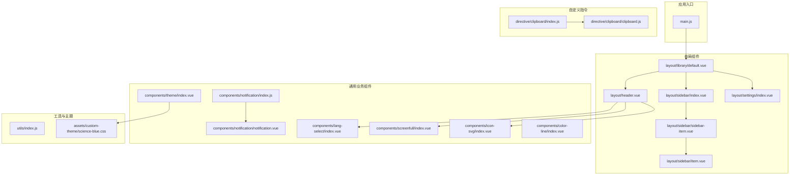
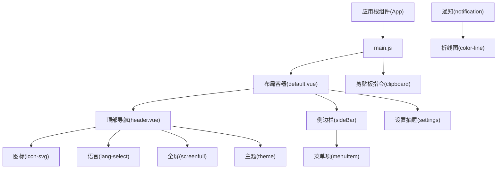
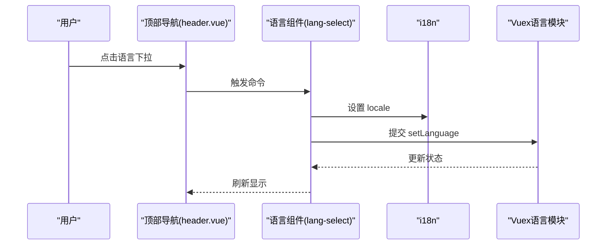
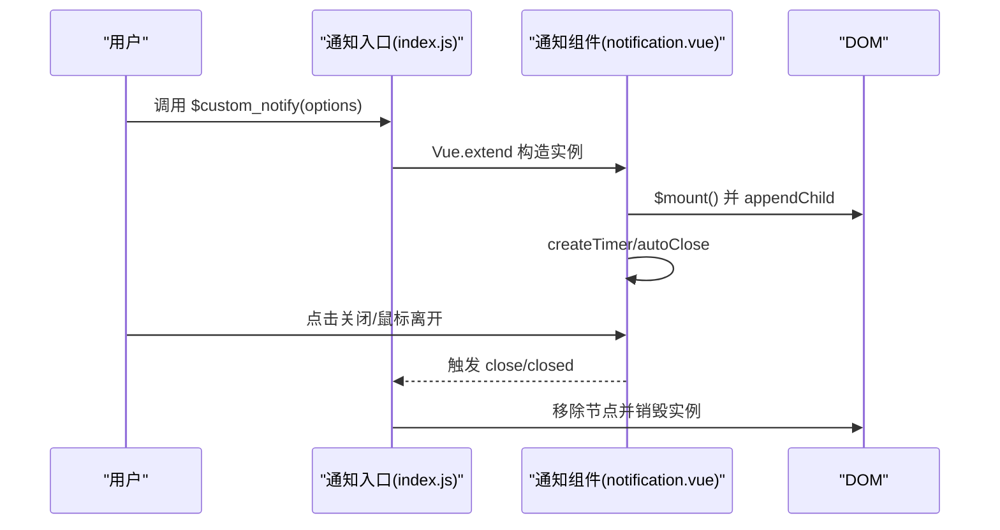
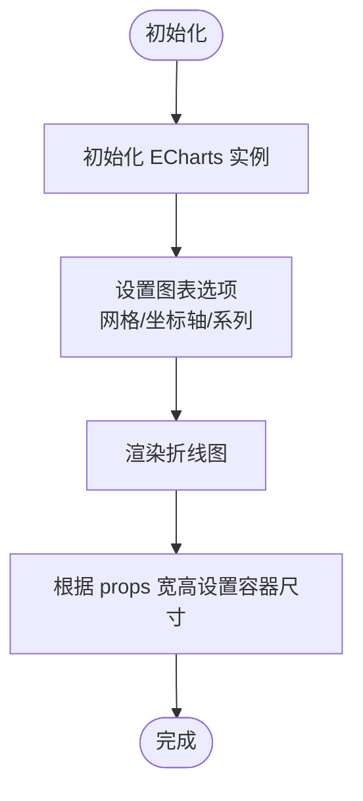
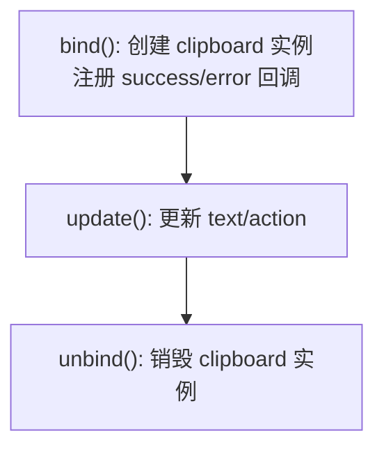
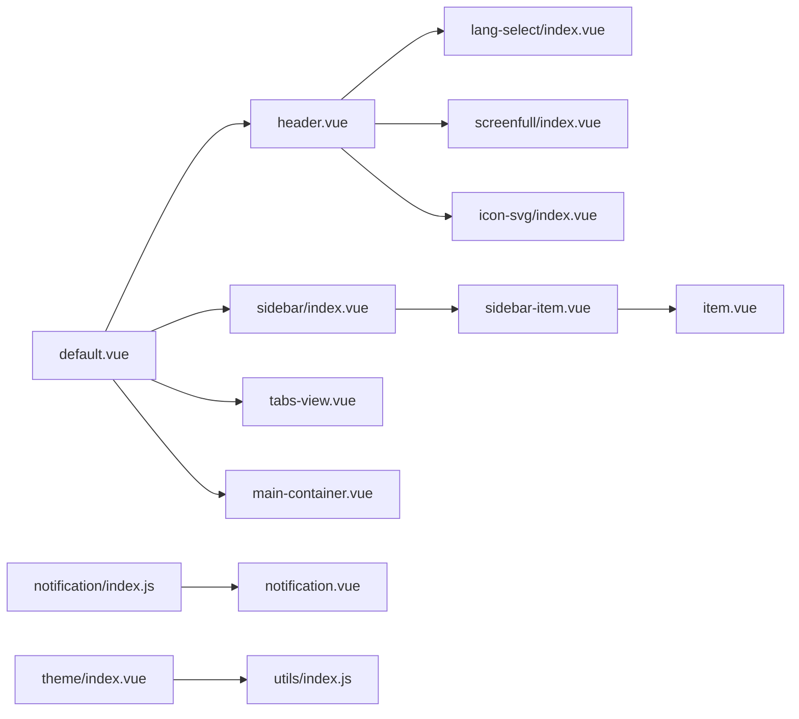

# 组件系统

<cite>
**本文引用的文件**   
- [src/components/color-line/index.vue](file://src/components/color-line/index.vue)
- [src/components/icon-svg/index.vue](file://src/components/icon-svg/index.vue)
- [src/components/lang-select/index.vue](file://src/components/lang-select/index.vue)
- [src/components/notification/notification.vue](file://src/components/notification/notification.vue)
- [src/components/notification/index.js](file://src/components/notification/index.js)
- [src/components/screenfull/index.vue](file://src/components/screenfull/index.vue)
- [src/components/theme/index.vue](file://src/components/theme/index.vue)
- [src/directive/clipboard/clipboard.js](file://src/directive/clipboard/clipboard.js)
- [src/directive/clipboard/index.js](file://src/directive/clipboard/index.js)
- [src/layout/header.vue](file://src/layout/header.vue)
- [src/layout/sidebar/index.vue](file://src/layout/sidebar/index.vue)
- [src/layout/sidebar/item.vue](file://src/layout/sidebar/item.vue)
- [src/layout/sidebar/sidebar-item.vue](file://src/layout/sidebar/sidebar-item.vue)
- [src/layout/library/default.vue](file://src/layout/library/default.vue)
- [src/layout/settings/index.vue](file://src/layout/settings/index.vue)
- [src/assets/custom-theme/science-blue.css](file://src/assets/custom-theme/science-blue.css)
- [src/utils/index.js](file://src/utils/index.js)
- [src/main.js](file://src/main.js)
- [package.json](file://package.json)
</cite>

## 目录
1. [简介](#简介)
2. [项目结构](#项目结构)
3. [核心组件](#核心组件)
4. [架构总览](#架构总览)
5. [详细组件分析](#详细组件分析)
6. [依赖关系分析](#依赖关系分析)
7. [性能考量](#性能考量)
8. [故障排查指南](#故障排查指南)
9. [结论](#结论)
10. [附录](#附录)

## 简介
本文件系统性梳理 Vue CMS 的组件体系，覆盖布局组件、业务组件、自定义指令与图标系统，详解 props 传递、事件处理、插槽与生命周期管理，并给出组合模式、样式定制与主题适配、响应式设计、性能优化与懒加载策略、开发规范与测试调试建议，以及扩展与二次开发指导。

## 项目结构
- 组件按职责分层组织：
  - 布局组件：位于 src/layout 下，负责整体页面骨架与导航。
  - 通用业务组件：位于 src/components 下，如通知、语言切换、全屏、主题切换、SVG 图标、折线图等。
  - 自定义指令：位于 src/directive 下，如剪贴板指令。
  - 工具与入口：src/utils 提供工具方法；src/main.js 注册全局组件与指令；package.json 定义依赖。
- 主题与样式：通过 CSS 变量与 SCSS 变量实现主题切换；自定义主题样式文件按需引入。

图表来源
- [src/main.js:1-53](file://src/main.js#L1-L53)
- [src/layout/library/default.vue:1-87](file://src/layout/library/default.vue#L1-L87)
- [src/layout/header.vue:1-270](file://src/layout/header.vue#L1-L270)
- [src/layout/sidebar/index.vue:1-142](file://src/layout/sidebar/index.vue#L1-L142)
- [src/layout/sidebar/sidebar-item.vue:1-107](file://src/layout/sidebar/sidebar-item.vue#L1-L107)
- [src/layout/sidebar/item.vue:1-48](file://src/layout/sidebar/item.vue#L1-L48)
- [src/layout/settings/index.vue:1-512](file://src/layout/settings/index.vue#L1-L512)
- [src/components/icon-svg/index.vue:1-33](file://src/components/icon-svg/index.vue#L1-L33)
- [src/components/lang-select/index.vue:1-39](file://src/components/lang-select/index.vue#L1-L39)
- [src/components/screenfull/index.vue:1-53](file://src/components/screenfull/index.vue#L1-L53)
- [src/components/theme/index.vue:1-42](file://src/components/theme/index.vue#L1-L42)
- [src/components/notification/notification.vue:1-90](file://src/components/notification/notification.vue#L1-L90)
- [src/components/notification/index.js:1-119](file://src/components/notification/index.js#L1-L119)
- [src/components/color-line/index.vue:1-87](file://src/components/color-line/index.vue#L1-L87)
- [src/directive/clipboard/clipboard.js:1-58](file://src/directive/clipboard/clipboard.js#L1-L58)
- [src/directive/clipboard/index.js:1-15](file://src/directive/clipboard/index.js#L1-L15)
- [src/assets/custom-theme/science-blue.css:1-49](file://src/assets/custom-theme/science-blue.css#L1-L49)
- [src/utils/index.js:1-122](file://src/utils/index.js#L1-L122)

章节来源
- [src/main.js:1-53](file://src/main.js#L1-L53)
- [src/layout/library/default.vue:1-87](file://src/layout/library/default.vue#L1-L87)

## 核心组件
- 布局组件
  - 默认布局容器：整合侧边栏、头部、标签页与主内容区，统一滚动与尺寸控制。
  - 侧边栏与菜单：支持多级菜单、手风琴、图标与标题国际化渲染。
  - 顶部导航：集成面包屑、设置面板、全屏、语言切换、用户下拉。
  - 设置抽屉：主题色、暗色模式、布局切换、标签页与面包屑配置。
- 业务组件
  - SVG 图标：基于雪碧图的可复用图标组件。
  - 语言切换：下拉选择中英文，联动 i18n 与 Vuex。
  - 全屏：封装 screenfull，兼容浏览器能力检测。
  - 主题切换：内置主题类名切换与“自定义”提示。
  - 通知：基于 Vue.extend 的消息提示组件，支持队列与自动关闭。
  - 折线图：基于 ECharts 的轻量折线图组件。
- 自定义指令
  - 剪贴板：封装 clipboard 库，支持复制/剪切回调与生命周期清理。
- 工具与主题
  - 工具函数：防抖、类名操作、深拷贝等。
  - 主题样式：通过类名与 CSS 变量实现主题切换。

章节来源
- [src/layout/library/default.vue:1-87](file://src/layout/library/default.vue#L1-L87)
- [src/layout/sidebar/index.vue:1-142](file://src/layout/sidebar/index.vue#L1-L142)
- [src/layout/sidebar/sidebar-item.vue:1-107](file://src/layout/sidebar/sidebar-item.vue#L1-L107)
- [src/layout/sidebar/item.vue:1-48](file://src/layout/sidebar/item.vue#L1-L48)
- [src/layout/header.vue:1-270](file://src/layout/header.vue#L1-L270)
- [src/layout/settings/index.vue:1-512](file://src/layout/settings/index.vue#L1-L512)
- [src/components/icon-svg/index.vue:1-33](file://src/components/icon-svg/index.vue#L1-L33)
- [src/components/lang-select/index.vue:1-39](file://src/components/lang-select/index.vue#L1-L39)
- [src/components/screenfull/index.vue:1-53](file://src/components/screenfull/index.vue#L1-L53)
- [src/components/theme/index.vue:1-42](file://src/components/theme/index.vue#L1-L42)
- [src/components/notification/notification.vue:1-90](file://src/components/notification/notification.vue#L1-L90)
- [src/components/notification/index.js:1-119](file://src/components/notification/index.js#L1-L119)
- [src/components/color-line/index.vue:1-87](file://src/components/color-line/index.vue#L1-L87)
- [src/directive/clipboard/clipboard.js:1-58](file://src/directive/clipboard/clipboard.js#L1-L58)
- [src/directive/clipboard/index.js:1-15](file://src/directive/clipboard/index.js#L1-L15)
- [src/utils/index.js:1-122](file://src/utils/index.js#L1-L122)
- [src/assets/custom-theme/science-blue.css:1-49](file://src/assets/custom-theme/science-blue.css#L1-L49)

## 架构总览
组件系统采用“布局容器 + 业务组件 + 指令 + 主题样式”的分层架构。布局组件负责页面骨架与导航，业务组件提供可复用能力，自定义指令增强交互体验，主题样式通过类名与 CSS 变量实现灵活切换。

图表来源
- [src/main.js:1-53](file://src/main.js#L1-L53)
- [src/layout/library/default.vue:1-87](file://src/layout/library/default.vue#L1-L87)
- [src/layout/header.vue:1-270](file://src/layout/header.vue#L1-L270)
- [src/layout/sidebar/index.vue:1-142](file://src/layout/sidebar/index.vue#L1-L142)
- [src/layout/sidebar/sidebar-item.vue:1-107](file://src/layout/sidebar/sidebar-item.vue#L1-L107)
- [src/layout/sidebar/item.vue:1-48](file://src/layout/sidebar/item.vue#L1-L48)
- [src/layout/settings/index.vue:1-512](file://src/layout/settings/index.vue#L1-L512)
- [src/components/icon-svg/index.vue:1-33](file://src/components/icon-svg/index.vue#L1-L33)
- [src/components/lang-select/index.vue:1-39](file://src/components/lang-select/index.vue#L1-L39)
- [src/components/screenfull/index.vue:1-53](file://src/components/screenfull/index.vue#L1-L53)
- [src/components/theme/index.vue:1-42](file://src/components/theme/index.vue#L1-L42)
- [src/components/notification/notification.vue:1-90](file://src/components/notification/notification.vue#L1-L90)
- [src/components/color-line/index.vue:1-87](file://src/components/color-line/index.vue#L1-L87)
- [src/directive/clipboard/clipboard.js:1-58](file://src/directive/clipboard/clipboard.js#L1-L58)

## 详细组件分析

### 布局组件
- 默认布局容器
  - 职责：承载侧边栏、头部、标签页与主容器，统一滚动与尺寸控制。
  - 关键点：监听路由变化，滚动条置顶；容器内嵌滚动条与主容器滚动条同步更新。
- 侧边栏与菜单
  - 职责：渲染菜单树，支持手风琴、图标与标题国际化；根据布局配置动态调整宽度。
  - 关键点：菜单项组件支持 SVG 与 Element 图标；路由解析与高亮逻辑。
- 顶部导航
  - 职责：面包屑导航、设置面板、全屏、语言切换、用户下拉。
  - 关键点：面包屑根据路由匹配生成；国际化与图标渲染；登出流程带确认装饰器。
- 设置抽屉
  - 职责：主题色、暗色模式、布局切换、标签页与面包屑配置。
  - 关键点：通过 Vuex 动作修改状态；CSS 变量与 data-theme 控制主题。

章节来源
- [src/layout/library/default.vue:1-87](file://src/layout/library/default.vue#L1-L87)
- [src/layout/sidebar/index.vue:1-142](file://src/layout/sidebar/index.vue#L1-L142)
- [src/layout/sidebar/sidebar-item.vue:1-107](file://src/layout/sidebar/sidebar-item.vue#L1-L107)
- [src/layout/sidebar/item.vue:1-48](file://src/layout/sidebar/item.vue#L1-L48)
- [src/layout/header.vue:1-270](file://src/layout/header.vue#L1-L270)
- [src/layout/settings/index.vue:1-512](file://src/layout/settings/index.vue#L1-L512)

### 业务组件
- SVG 图标组件
  - 设计：基于雪碧图的 use 方案，通过 iconClass 计算 xlink:href。
  - 使用：在菜单与导航中按需渲染，支持国际化标题。
- 语言切换组件
  - 设计：下拉选择中英文，联动 i18n 与 Vuex，禁用当前语言项。
- 全屏组件
  - 设计：封装 screenfull，检测浏览器能力，弹出消息提示。
- 主题切换组件
  - 设计：内置主题类名切换与“自定义”提示；通过工具函数添加/移除类名。
- 通知组件
  - 设计：基于 Vue.extend 的消息提示，支持队列、自动关闭、关闭事件。
  - 流程：构造实例 -> 挂载到 body -> 计算垂直偏移 -> 触发进入动画 -> 监听 closed/close 事件 -> 清理实例。
- 折线图组件
  - 设计：ECharts 初始化与选项配置，支持宽高、颜色、数据传参。

图表来源
- [src/layout/header.vue:1-270](file://src/layout/header.vue#L1-L270)
- [src/components/lang-select/index.vue:1-39](file://src/components/lang-select/index.vue#L1-L39)

图表来源
- [src/components/notification/index.js:1-119](file://src/components/notification/index.js#L1-L119)
- [src/components/notification/notification.vue:1-90](file://src/components/notification/notification.vue#L1-L90)

图表来源
- [src/components/color-line/index.vue:1-87](file://src/components/color-line/index.vue#L1-L87)

章节来源
- [src/components/icon-svg/index.vue:1-33](file://src/components/icon-svg/index.vue#L1-L33)
- [src/components/lang-select/index.vue:1-39](file://src/components/lang-select/index.vue#L1-L39)
- [src/components/screenfull/index.vue:1-53](file://src/components/screenfull/index.vue#L1-L53)
- [src/components/theme/index.vue:1-42](file://src/components/theme/index.vue#L1-L42)
- [src/components/notification/notification.vue:1-90](file://src/components/notification/notification.vue#L1-L90)
- [src/components/notification/index.js:1-119](file://src/components/notification/index.js#L1-L119)
- [src/components/color-line/index.vue:1-87](file://src/components/color-line/index.vue#L1-L87)

### 自定义指令
- 剪贴板指令
  - 设计：在 bind/update/unbind 生命周期中绑定/更新/解绑 clipboard 实例，支持 success/error 回调。
  - 使用：在模板中通过 v-clipboard:[arg] 指令绑定文本与动作。

图表来源
- [src/directive/clipboard/clipboard.js:1-58](file://src/directive/clipboard/clipboard.js#L1-L58)
- [src/directive/clipboard/index.js:1-15](file://src/directive/clipboard/index.js#L1-L15)

章节来源
- [src/directive/clipboard/clipboard.js:1-58](file://src/directive/clipboard/clipboard.js#L1-L58)
- [src/directive/clipboard/index.js:1-15](file://src/directive/clipboard/index.js#L1-L15)

### 图标系统
- 设计：通过 svg-sprite-loader 将 SVG 合成为雪碧图，组件通过 use:xlink:href 渲染。
- 使用：在菜单与导航中根据 icon 前缀区分 Element 图标与 SVG 图标。

章节来源
- [src/components/icon-svg/index.vue:1-33](file://src/components/icon-svg/index.vue#L1-L33)

### 主题与样式定制
- 类名切换：通过工具函数在 body 上添加/移除主题类名，配合主题样式文件生效。
- CSS 变量：设置抽屉通过 CSS 变量与 data-theme 控制主题色与暗色模式。
- 自定义主题：科学蓝主题样式文件覆盖菜单、标签页等组件样式。

章节来源
- [src/components/theme/index.vue:1-42](file://src/components/theme/index.vue#L1-L42)
- [src/assets/custom-theme/science-blue.css:1-49](file://src/assets/custom-theme/science-blue.css#L1-L49)
- [src/layout/settings/index.vue:1-512](file://src/layout/settings/index.vue#L1-L512)
- [src/utils/index.js:1-122](file://src/utils/index.js#L1-L122)

## 依赖关系分析
- 组件间依赖
  - default.vue 依赖 header、sidebar、tabs-view、main-container。
  - header 依赖 lang-select、screenfull、svg-icon。
  - sidebar 依赖 sidebar-item、logo。
  - notification 通过入口文件注册为全局组件并挂载原型方法。
- 外部依赖
  - Element UI、Animate.css、screenfull、clipboard、echarts、mockjs 等。

图表来源
- [src/layout/library/default.vue:1-87](file://src/layout/library/default.vue#L1-L87)
- [src/layout/header.vue:1-270](file://src/layout/header.vue#L1-L270)
- [src/layout/sidebar/index.vue:1-142](file://src/layout/sidebar/index.vue#L1-L142)
- [src/layout/sidebar/sidebar-item.vue:1-107](file://src/layout/sidebar/sidebar-item.vue#L1-L107)
- [src/layout/sidebar/item.vue:1-48](file://src/layout/sidebar/item.vue#L1-L48)
- [src/components/notification/index.js:1-119](file://src/components/notification/index.js#L1-L119)
- [src/components/notification/notification.vue:1-90](file://src/components/notification/notification.vue#L1-L90)
- [src/components/theme/index.vue:1-42](file://src/components/theme/index.vue#L1-L42)
- [src/utils/index.js:1-122](file://src/utils/index.js#L1-L122)

章节来源
- [src/layout/library/default.vue:1-87](file://src/layout/library/default.vue#L1-L87)
- [src/layout/header.vue:1-270](file://src/layout/header.vue#L1-L270)
- [src/layout/sidebar/index.vue:1-142](file://src/layout/sidebar/index.vue#L1-L142)
- [src/layout/sidebar/sidebar-item.vue:1-107](file://src/layout/sidebar/sidebar-item.vue#L1-L107)
- [src/layout/sidebar/item.vue:1-48](file://src/layout/sidebar/item.vue#L1-L48)
- [src/components/notification/index.js:1-119](file://src/components/notification/index.js#L1-L119)
- [src/components/notification/notification.vue:1-90](file://src/components/notification/notification.vue#L1-L90)
- [src/components/theme/index.vue:1-42](file://src/components/theme/index.vue#L1-L42)
- [src/utils/index.js:1-122](file://src/utils/index.js#L1-L122)

## 性能考量
- 组件懒加载
  - 路由级异步组件：在路由配置中使用动态 import，减少首屏体积。
  - 布局容器在路由切换后延迟更新滚动条，避免频繁重排。
- 图表与第三方库
  - 折线图组件仅在挂载后初始化 ECharts，避免不必要的初始化开销。
  - 剪贴板指令在 unbind 时销毁实例，防止内存泄漏。
- 事件与计算
  - 通知组件在 beforeDestroy 中清理定时器，确保无残留任务。
  - 工具函数提供防抖与深拷贝，降低高频事件与复杂数据处理成本。
- 样式与主题
  - 通过 CSS 变量与类名切换实现主题切换，避免重复构建样式文件。

章节来源
- [src/layout/library/default.vue:39-57](file://src/layout/library/default.vue#L39-L57)
- [src/components/color-line/index.vue:71-77](file://src/components/color-line/index.vue#L71-L77)
- [src/directive/clipboard/clipboard.js:47-56](file://src/directive/clipboard/clipboard.js#L47-L56)
- [src/components/notification/index.js:44-46](file://src/components/notification/index.js#L44-L46)
- [src/utils/index.js:12-45](file://src/utils/index.js#L12-L45)

## 故障排查指南
- 剪贴板不可用
  - 现象：点击无反应或报错。
  - 排查：确认已安装 clipboard 依赖；检查指令参数与回调是否正确绑定。
- 全屏失败
  - 现象：弹出警告提示浏览器不支持。
  - 排查：检查 screenfull 是否启用；确认浏览器权限与上下文。
- 通知未关闭或重复堆积
  - 现象：通知无法关闭或多个叠加。
  - 排查：确认 closed/close 事件监听；检查自动关闭定时器与实例清理。
- 主题切换无效
  - 现象：切换后样式未生效。
  - 排查：确认类名添加/移除逻辑；检查主题样式文件是否引入；确认 CSS 优先级。

章节来源
- [src/directive/clipboard/clipboard.js:3-5](file://src/directive/clipboard/clipboard.js#L3-L5)
- [src/components/screenfull/index.vue:30-37](file://src/components/screenfull/index.vue#L30-L37)
- [src/components/notification/index.js:102-111](file://src/components/notification/index.js#L102-L111)
- [src/components/theme/index.vue:20-38](file://src/components/theme/index.vue#L20-L38)

## 结论
Vue CMS 的组件系统以布局容器为核心，结合可复用业务组件、自定义指令与主题样式，形成清晰的分层架构。通过 props、事件、插槽与生命周期的规范使用，配合性能优化与懒加载策略，能够高效支撑复杂后台管理场景。建议在二次开发中遵循统一的命名与职责划分，保持组件的低耦合与高内聚。

## 附录
- 组件开发规范
  - 命名：组件文件夹与 index.vue 对应，名称语义化；指令与组件同名目录。
  - Props：明确类型、默认值与必填项；避免在组件内直接修改 props。
  - 事件：使用语义化事件名，必要时提供默认行为；在 beforeDestroy 中清理事件与定时器。
  - 插槽：合理拆分内容区，提供默认插槽与具名插槽。
  - 样式：优先使用 CSS 变量与 SCSS；避免内联样式；主题切换通过类名或变量控制。
- 测试策略与调试技巧
  - 单元测试：对工具函数与纯函数进行断言；对组件 props 与事件输出进行验证。
  - 集成测试：模拟路由与 Vuex 状态，验证组件组合行为。
  - 调试：利用 Vue DevTools 观察组件树与状态；在关键生命周期打印日志；使用 Jest Snapshot 对比快照。
- 扩展与二次开发
  - 新增组件：遵循现有目录结构；在入口统一注册；提供最小可用 API。
  - 新增指令：在 index.js 中导出 install 方法；在模板中按约定使用。
  - 主题扩展：新增主题样式文件，维护类名映射；在主题组件中增加选项。

章节来源
- [src/main.js:27-42](file://src/main.js#L27-L42)
- [src/directive/clipboard/index.js:1-15](file://src/directive/clipboard/index.js#L1-L15)
- [package.json:1-99](file://package.json#L1-L99)