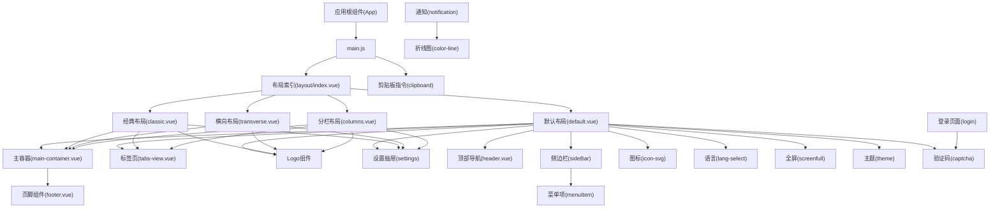
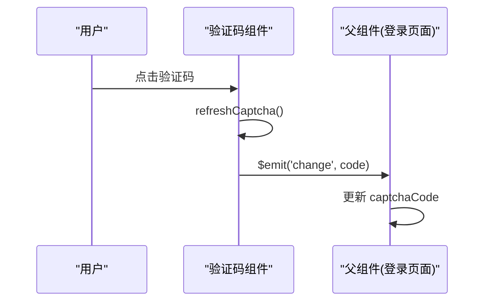
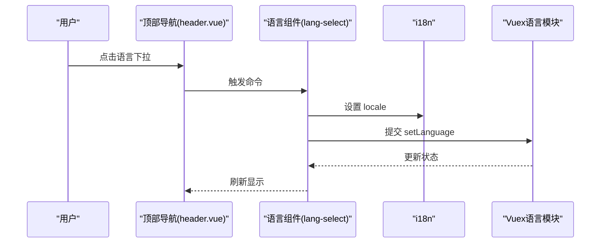
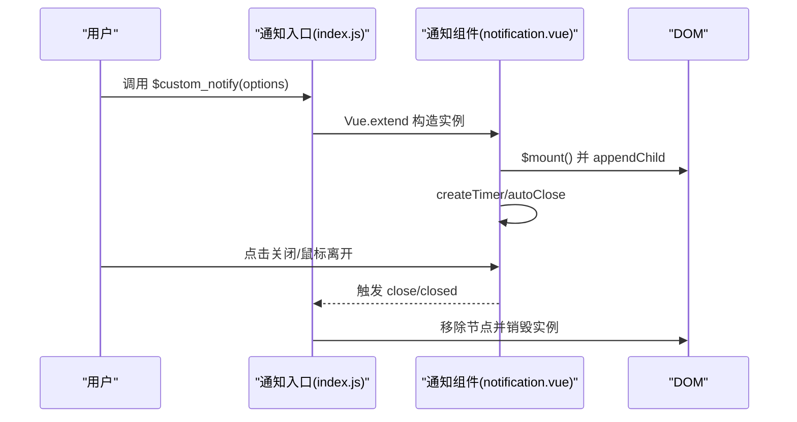
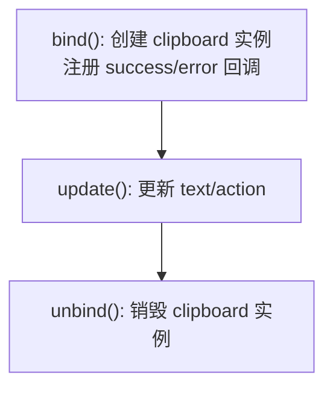
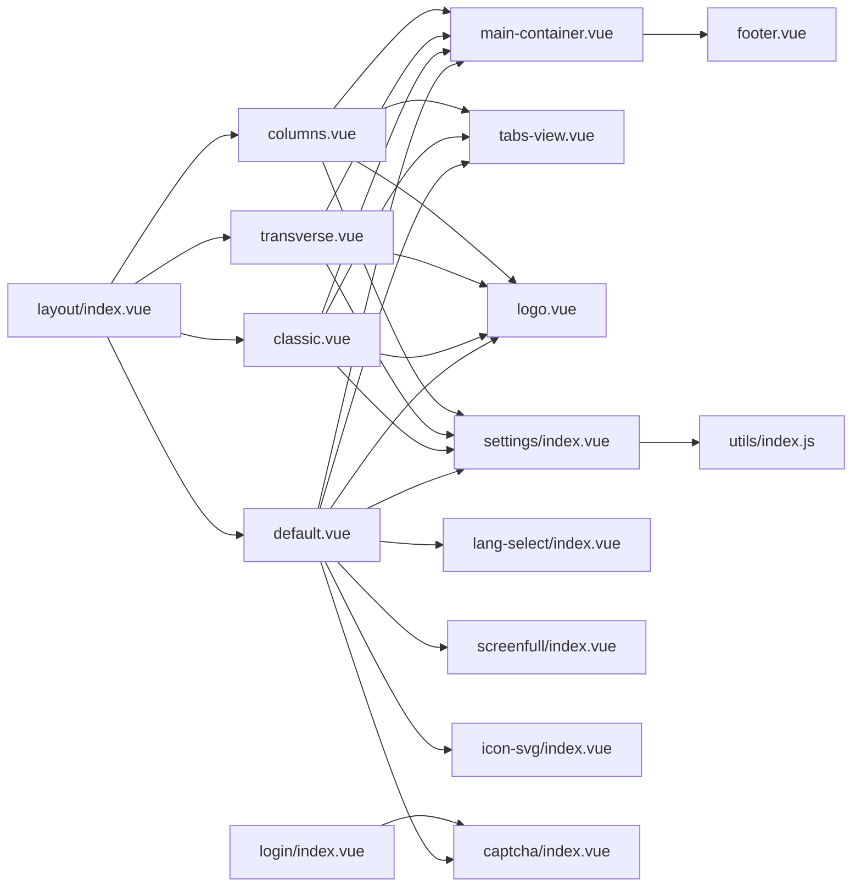

# 组件系统

<cite>
**本文引用的文件**   
- [src/components/captcha/index.vue](file://src/components/captcha/index.vue)
- [src/components/color-line/index.vue](file://src/components/color-line/index.vue)
- [src/components/icon-svg/index.vue](file://src/components/icon-svg/index.vue)
- [src/components/lang-select/index.vue](file://src/components/lang-select/index.vue)
- [src/components/notification/notification.vue](file://src/components/notification/notification.vue)
- [src/components/notification/index.js](file://src/components/notification/index.js)
- [src/components/screenfull/index.vue](file://src/components/screenfull/index.vue)
- [src/components/theme/index.vue](file://src/components/theme/index.vue)
- [src/directive/clipboard/clipboard.js](file://src/directive/clipboard/clipboard.js)
- [src/directive/clipboard/index.js](file://src/directive/clipboard/index.js)
- [src/layout/footer.vue](file://src/layout/footer.vue)
- [src/layout/index.vue](file://src/layout/index.vue)
- [src/layout/library/default.vue](file://src/layout/library/default.vue)
- [src/layout/library/classic.vue](file://src/layout/library/classic.vue)
- [src/layout/library/transverse.vue](file://src/layout/library/transverse.vue)
- [src/layout/library/columns.vue](file://src/layout/library/columns.vue)
- [src/layout/sidebar/index.vue](file://src/layout/sidebar/index.vue)
- [src/layout/sidebar/item.vue](file://src/layout/sidebar/item.vue)
- [src/layout/sidebar/sidebar-item.vue](file://src/layout/sidebar/sidebar-item.vue)
- [src/layout/main-container.vue](file://src/layout/main-container.vue)
- [src/layout/tabs-view.vue](file://src/layout/tabs-view.vue)
- [src/layout/logo.vue](file://src/layout/logo.vue)
- [src/layout/settings/index.vue](file://src/layout/settings/index.vue)
- [src/assets/custom-theme/science-blue.css](file://src/assets/custom-theme/science-blue.css)
- [src/utils/index.js](file://src/utils/index.js)
- [src/main.js](file://src/main.js)
- [src/views/login/index.vue](file://src/views/login/index.vue)
- [package.json](file://package.json)
</cite>

## 更新摘要
**变更内容**   
- 新增验证码组件 `captcha/index.vue`，提供116行Vue实现，包含画布渲染、随机字符生成、主题适配、交互刷新等功能
- 验证码组件作为新的业务组件加入组件系统，支持自定义尺寸和字符长度
- 在登录页面中集成验证码组件，实现完整的身份验证流程
- 验证码组件支持深色/浅色主题的动态适配，点击刷新功能
- 验证码组件通过事件机制与父组件通信，提供验证码变更通知

## 目录
1. [简介](#简介)
2. [项目结构](#项目结构)
3. [核心组件](#核心组件)
4. [架构总览](#架构总览)
5. [详细组件分析](#详细组件分析)
6. [依赖关系分析](#依赖关系分析)
7. [性能考量](#性能考量)
8. [故障排查指南](#故障排查指南)
9. [结论](#结论)
10. [附录](#附录)

## 简介
本文件系统性梳理 Vue CMS 的组件体系，覆盖布局组件、业务组件、自定义指令与图标系统，详解 props 传递、事件处理、插槽与生命周期管理，并给出组合模式、样式定制与主题适配、响应式设计、性能优化与懒加载策略、开发规范与测试调试建议，以及扩展与二次开发指导。

## 项目结构
- 组件按职责分层组织：
  - 布局组件：位于 src/layout 下，包含多种布局模式和独立的页脚组件。
  - 通用业务组件：位于 src/components 下，如验证码、通知、语言切换、全屏、主题切换、SVG 图标、折线图等。
  - 自定义指令：位于 src/directive 下，如剪贴板指令。
  - 工具与入口：src/utils 提供工具方法；src/main.js 注册全局组件与指令；package.json 定义依赖。
- 主题与样式：通过 CSS 变量与 SCSS 变量实现主题切换；自定义主题样式文件按需引入。

```mermaid
graph TB
subgraph "应用入口"
MAIN["main.js"]
END_INDEX["layout/index.vue"]
end
subgraph "布局组件"
L_DEFAULT["layout/library/default.vue"]
L_CLASSIC["layout/library/classic.vue"]
L_TRANSVERSE["layout/library/transverse.vue"]
L_COLUMNS["layout/library/columns.vue"]
L_MAIN["layout/main-container.vue"]
L_FOOTER["layout/footer.vue"]
L_TABS["layout/tabs-view.vue"]
L_LOGO["layout/logo.vue"]
L_SETTINGS["layout/settings/index.vue"]
end
subgraph "通用业务组件"
C_CAPTCHA["components/captcha/index.vue"]
C_ICON["components/icon-svg/index.vue"]
C_LANG["components/lang-select/index.vue"]
C_SCREEN["components/screenfull/index.vue"]
C_THEME["components/theme/index.vue"]
C_NOTI["components/notification/notification.vue"]
C_NOTI_ENTRY["components/notification/index.js"]
C_COLORLINE["components/color-line/index.vue"]
end
subgraph "自定义指令"
D_CLIPBOARD["directive/clipboard/clipboard.js"]
D_CLIPBOARD_IDX["directive/clipboard/index.js"]
end
subgraph "工具与主题"
U_UTILS["utils/index.js"]
THEME_BLUE["assets/custom-theme/science-blue.css"]
end
MAIN --> END_INDEX
END_INDEX --> L_DEFAULT
END_INDEX --> L_CLASSIC
END_INDEX --> L_TRANSVERSE
END_INDEX --> L_COLUMNS
L_DEFAULT --> L_MAIN
L_CLASSIC --> L_MAIN
L_TRANSVERSE --> L_MAIN
L_COLUMNS --> L_MAIN
L_MAIN --> L_FOOTER
L_DEFAULT --> L_TABS
L_CLASSIC --> L_TABS
L_COLUMNS --> L_TABS
L_DEFAULT --> L_LOGO
L_CLASSIC --> L_LOGO
L_TRANSVERSE --> L_LOGO
L_COLUMNS --> L_LOGO
L_DEFAULT --> L_SETTINGS
L_CLASSIC --> L_SETTINGS
L_TRANSVERSE --> L_SETTINGS
L_COLUMNS --> L_SETTINGS
L_MAIN --> C_LANG
L_MAIN --> C_SCREEN
L_MAIN --> C_ICON
C_THEME --> THEME_BLUE
C_NOTI_ENTRY --> C_NOTI
C_CAPTCHA --> C_LANG
C_CAPTCHA --> C_SCREEN
C_CAPTCHA --> C_ICON
D_CLIPBOARD_IDX --> D_CLIPBOARD
```

**图表来源**
- [src/main.js:1-73](file://src/main.js#L1-L73)
- [src/layout/index.vue:1-33](file://src/layout/index.vue#L1-L33)
- [src/layout/library/default.vue:1-409](file://src/layout/library/default.vue#L1-L409)
- [src/layout/library/classic.vue:1-401](file://src/layout/library/classic.vue#L1-L401)
- [src/layout/library/transverse.vue:1-285](file://src/layout/library/transverse.vue#L1-L285)
- [src/layout/library/columns.vue:1-419](file://src/layout/library/columns.vue#L1-L419)
- [src/layout/main-container.vue:1-134](file://src/layout/main-container.vue#L1-L134)
- [src/layout/footer.vue:1-107](file://src/layout/footer.vue#L1-L107)
- [src/layout/tabs-view.vue:1-218](file://src/layout/tabs-view.vue#L1-L218)
- [src/layout/logo.vue:1-94](file://src/layout/logo.vue#L1-L94)
- [src/layout/settings/index.vue:1-524](file://src/layout/settings/index.vue#L1-L524)
- [src/components/captcha/index.vue:1-117](file://src/components/captcha/index.vue#L1-L117)

**章节来源**
- [src/main.js:1-73](file://src/main.js#L1-L73)
- [src/layout/index.vue:1-33](file://src/layout/index.vue#L1-L33)
- [src/layout/library/default.vue:1-409](file://src/layout/library/default.vue#L1-L409)

## 核心组件
- 布局组件
  - 多布局模式：支持默认、经典、横向、分栏四种布局模式，每种模式有不同的导航和菜单结构。
  - 页脚组件：独立的页脚组件，支持品牌展示、版权信息和动画效果。
  - 标签页组件：支持多种标签页样式和缓存策略。
  - Logo 组件：根据布局模式和折叠状态智能显示。
  - 设置抽屉：主题色、暗色模式、布局切换、标签页与面包屑配置，新增页脚显示控制。
- 业务组件
  - 验证码组件：基于 HTML5 Canvas 的验证码生成组件，支持自定义尺寸、字符长度和主题适配，提供点击刷新功能。
  - SVG 图标：基于雪碧图的可复用图标组件。
  - 语言切换：下拉选择中英文，联动 i18n 与 Vuex。
  - 全屏：封装 screenfull，兼容浏览器能力检测。
  - 主题切换：内置主题类名切换与"自定义"提示。
  - 通知：基于 Vue.extend 的消息提示组件，支持队列与自动关闭。
  - 折线图：基于 ECharts 的轻量折线图组件。
- 自定义指令
  - 剪贴板：封装 clipboard 库，支持复制/剪切回调与生命周期清理。
- 工具与主题
  - 工具函数：防抖、类名操作、深拷贝等。
  - 主题样式：通过类名与 CSS 变量实现主题切换。

**章节来源**
- [src/layout/index.vue:1-33](file://src/layout/index.vue#L1-L33)
- [src/layout/library/default.vue:1-409](file://src/layout/library/default.vue#L1-L409)
- [src/layout/library/classic.vue:1-401](file://src/layout/library/classic.vue#L1-L401)
- [src/layout/library/transverse.vue:1-285](file://src/layout/library/transverse.vue#L1-L285)
- [src/layout/library/columns.vue:1-419](file://src/layout/library/columns.vue#L1-L419)
- [src/layout/footer.vue:1-107](file://src/layout/footer.vue#L1-L107)
- [src/layout/main-container.vue:1-134](file://src/layout/main-container.vue#L1-L134)
- [src/layout/tabs-view.vue:1-218](file://src/layout/tabs-view.vue#L1-L218)
- [src/layout/logo.vue:1-94](file://src/layout/logo.vue#L1-L94)
- [src/layout/settings/index.vue:1-524](file://src/layout/settings/index.vue#L1-L524)

## 架构总览
组件系统采用"布局容器 + 业务组件 + 指令 + 主题样式"的分层架构。布局组件负责页面骨架与导航，业务组件提供可复用能力，自定义指令增强交互体验，主题样式通过类名与 CSS 变量实现灵活切换。现在支持四种布局模式，每种模式都有独特的头部导航和菜单结构。新增的验证码组件作为业务组件的重要组成部分，为用户身份验证提供技术支持。

**图表来源**
- [src/main.js:1-73](file://src/main.js#L1-L73)
- [src/layout/index.vue:1-33](file://src/layout/index.vue#L1-L33)
- [src/layout/library/default.vue:1-409](file://src/layout/library/default.vue#L1-L409)
- [src/layout/library/classic.vue:1-401](file://src/layout/library/classic.vue#L1-L401)
- [src/layout/library/transverse.vue:1-285](file://src/layout/library/transverse.vue#L1-L285)
- [src/layout/library/columns.vue:1-419](file://src/layout/library/columns.vue#L1-L419)
- [src/layout/main-container.vue:1-134](file://src/layout/main-container.vue#L1-L134)
- [src/layout/footer.vue:1-107](file://src/layout/footer.vue#L1-L107)
- [src/layout/tabs-view.vue:1-218](file://src/layout/tabs-view.vue#L1-L218)
- [src/layout/logo.vue:1-94](file://src/layout/logo.vue#L1-L94)
- [src/layout/settings/index.vue:1-524](file://src/layout/settings/index.vue#L1-L524)
- [src/components/captcha/index.vue:1-117](file://src/components/captcha/index.vue#L1-L117)
- [src/views/login/index.vue:176-185](file://src/views/login/index.vue#L176-L185)

## 详细组件分析

### 布局组件
- 布局索引组件
  - 职责：根据主题配置动态选择布局模式，支持四种布局模式的切换。
  - 关键点：使用 Vue 的动态组件机制，根据配置渲染不同的布局组件。
- 默认布局
  - 职责：左侧菜单栏 + 右侧内容区的经典布局，包含顶部导航、侧边栏、标签页和主容器。
  - 关键点：支持面包屑导航、用户下拉菜单、设置面板、全屏等功能。
- 经典布局
  - 职责：顶部一级菜单 + 左侧二级菜单 + 右侧内容的布局模式。
  - 关键点：顶部横向菜单支持图标和标题，左侧二级菜单根据选中的一级菜单动态显示。
- 横向布局
  - 职责：顶部横向菜单 + 内容区域的简洁布局模式。
  - 关键点：菜单项支持图标和标题，适合移动端或空间有限的场景。
- 分栏布局
  - 职责：左侧图标栏 + 中间菜单栏 + 右侧内容的三栏布局。
  - 关键点：左侧图标菜单支持快速导航，中间菜单栏显示二级菜单，右侧面板为主内容区。
- 页脚组件
  - 职责：独立的页脚组件，显示品牌信息和版权信息。
  - 关键点：支持心跳动画效果，深色模式适配，条件渲染控制。
- 主容器组件
  - 职责：主内容区容器，支持页面切换动画和页脚条件渲染。
  - 关键点：根据布局类型计算主内容区样式，支持 keep-alive 缓存。
- 标签页组件
  - 职责：顶部标签页导航，支持多种样式和缓存策略。
  - 关键点：支持标签页滚动、关闭、缓存等功能。
- Logo 组件
  - 职责：根据布局模式和折叠状态智能显示 Logo。
  - 关键点：支持点击展开/收起菜单，不同布局模式下的显示策略。

**章节来源**
- [src/layout/index.vue:1-33](file://src/layout/index.vue#L1-L33)
- [src/layout/library/default.vue:1-409](file://src/layout/library/default.vue#L1-L409)
- [src/layout/library/classic.vue:1-401](file://src/layout/library/classic.vue#L1-L401)
- [src/layout/library/transverse.vue:1-285](file://src/layout/library/transverse.vue#L1-L285)
- [src/layout/library/columns.vue:1-419](file://src/layout/library/columns.vue#L1-L419)
- [src/layout/footer.vue:1-107](file://src/layout/footer.vue#L1-L107)
- [src/layout/main-container.vue:1-134](file://src/layout/main-container.vue#L1-L134)
- [src/layout/tabs-view.vue:1-218](file://src/layout/tabs-view.vue#L1-L218)
- [src/layout/logo.vue:1-94](file://src/layout/logo.vue#L1-L94)

### 业务组件
- 验证码组件
  - 设计：基于 HTML5 Canvas API 的验证码生成组件，支持自定义宽度、高度和字符长度。
  - 功能：随机字符生成、干扰线条绘制、干扰点绘制、字符旋转角度、主题适配。
  - 主题适配：根据深色/浅色主题自动调整背景色、字符颜色和干扰元素颜色。
  - 交互：支持点击刷新验证码，通过 change 事件向父组件传递验证码值。
  - 使用场景：主要用于登录页面的身份验证，与表单验证规则配合使用。
- SVG 图标组件
  - 设计：基于雪碧图的 use 方案，通过 iconClass 计算 xlink:href。
  - 使用：在菜单与导航中按需渲染，支持国际化标题。
- 语言切换组件
  - 设计：下拉选择中英文，联动 i18n 与 Vuex，禁用当前语言项。
- 全屏组件
  - 设计：封装 screenfull，检测浏览器能力，弹出消息提示。
- 主题切换组件
  - 设计：内置主题类名切换与"自定义"提示；通过工具函数添加/移除类名。
- 通知组件
  - 设计：基于 Vue.extend 的消息提示，支持队列、自动关闭、关闭事件。
  - 流程：构造实例 -> 挂载到 body -> 计算垂直偏移 -> 触发进入动画 -> 监听 closed/close 事件 -> 清理实例。
- 折线图组件
  - 设计：ECharts 初始化与选项配置，支持宽高、颜色、数据传参。

**图表来源**
- [src/components/captcha/index.vue:36-47](file://src/components/captcha/index.vue#L36-L47)
- [src/views/login/index.vue:244-246](file://src/views/login/index.vue#L244-L246)

**图表来源**
- [src/layout/library/default.vue:1-409](file://src/layout/library/default.vue#L1-L409)
- [src/components/lang-select/index.vue:1-39](file://src/components/lang-select/index.vue#L1-L39)

**图表来源**
- [src/components/notification/index.js:1-119](file://src/components/notification/index.js#L1-L119)
- [src/components/notification/notification.vue:1-90](file://src/components/notification/notification.vue#L1-L90)

**图表来源**
- [src/components/color-line/index.vue:1-87](file://src/components/color-line/index.vue#L1-L87)

**章节来源**
- [src/components/captcha/index.vue:1-117](file://src/components/captcha/index.vue#L1-L117)
- [src/components/icon-svg/index.vue:1-33](file://src/components/icon-svg/index.vue#L1-L33)
- [src/components/lang-select/index.vue:1-39](file://src/components/lang-select/index.vue#L1-L39)
- [src/components/screenfull/index.vue:1-53](file://src/components/screenfull/index.vue#L1-L53)
- [src/components/theme/index.vue:1-42](file://src/components/theme/index.vue#L1-L42)
- [src/components/notification/notification.vue:1-90](file://src/components/notification/notification.vue#L1-L90)
- [src/components/notification/index.js:1-119](file://src/components/notification/index.js#L1-L119)
- [src/components/color-line/index.vue:1-87](file://src/components/color-line/index.vue#L1-L87)

### 自定义指令
- 剪贴板指令
  - 设计：在 bind/update/unbind 生命周期中绑定/更新/解绑 clipboard 实例，支持 success/error 回调。
  - 使用：在模板中通过 v-clipboard:[arg] 指令绑定文本与动作。

**图表来源**
- [src/directive/clipboard/clipboard.js:1-58](file://src/directive/clipboard/clipboard.js#L1-L58)
- [src/directive/clipboard/index.js:1-15](file://src/directive/clipboard/index.js#L1-L15)

**章节来源**
- [src/directive/clipboard/clipboard.js:1-58](file://src/directive/clipboard/clipboard.js#L1-L58)
- [src/directive/clipboard/index.js:1-15](file://src/directive/clipboard/index.js#L1-L15)

### 图标系统
- 设计：通过 svg-sprite-loader 将 SVG 合成为雪碧图，组件通过 use:xlink:href 渲染。
- 使用：在菜单与导航中根据 icon 前缀区分 Element 图标与 SVG 图标。

**章节来源**
- [src/components/icon-svg/index.vue:1-33](file://src/components/icon-svg/index.vue#L1-L33)

### 主题与样式定制
- 类名切换：通过工具函数在 body 上添加/移除主题类名，配合主题样式文件生效。
- CSS 变量：设置抽屉通过 CSS 变量与 data-theme 控制主题色与暗色模式。
- 自定义主题：科学蓝主题样式文件覆盖菜单、标签页等组件样式。

**章节来源**
- [src/components/theme/index.vue:1-42](file://src/components/theme/index.vue#L1-L42)
- [src/assets/custom-theme/science-blue.css:1-49](file://src/assets/custom-theme/science-blue.css#L1-L49)
- [src/layout/settings/index.vue:1-524](file://src/layout/settings/index.vue#L1-L524)
- [src/utils/index.js:1-122](file://src/utils/index.js#L1-L122)

## 依赖关系分析
- 组件间依赖
  - layout/index.vue 依赖四种布局组件，根据配置动态渲染。
  - 各布局组件依赖 main-container、tabs-view、logo 等基础组件。
  - main-container 依赖 footer 组件进行条件渲染。
  - 设置组件依赖所有布局组件和业务组件。
  - 登录页面依赖验证码组件进行身份验证。
- 外部依赖
  - Element UI、Animate.css、screenfull、clipboard、echarts、mockjs 等。

**图表来源**
- [src/layout/index.vue:1-33](file://src/layout/index.vue#L1-L33)
- [src/layout/library/default.vue:1-409](file://src/layout/library/default.vue#L1-L409)
- [src/layout/library/classic.vue:1-401](file://src/layout/library/classic.vue#L1-L401)
- [src/layout/library/transverse.vue:1-285](file://src/layout/library/transverse.vue#L1-L285)
- [src/layout/library/columns.vue:1-419](file://src/layout/library/columns.vue#L1-L419)
- [src/layout/main-container.vue:1-134](file://src/layout/main-container.vue#L1-L134)
- [src/layout/footer.vue:1-107](file://src/layout/footer.vue#L1-L107)
- [src/layout/tabs-view.vue:1-218](file://src/layout/tabs-view.vue#L1-L218)
- [src/layout/logo.vue:1-94](file://src/layout/logo.vue#L1-L94)
- [src/layout/settings/index.vue:1-524](file://src/layout/settings/index.vue#L1-L524)
- [src/utils/index.js:1-122](file://src/utils/index.js#L1-L122)
- [src/views/login/index.vue:176-185](file://src/views/login/index.vue#L176-L185)

**章节来源**
- [src/layout/index.vue:1-33](file://src/layout/index.vue#L1-L33)
- [src/layout/library/default.vue:1-409](file://src/layout/library/default.vue#L1-L409)
- [src/layout/library/classic.vue:1-401](file://src/layout/library/classic.vue#L1-L401)
- [src/layout/library/transverse.vue:1-285](file://src/layout/library/transverse.vue#L1-L285)
- [src/layout/library/columns.vue:1-419](file://src/layout/library/columns.vue#L1-L419)
- [src/layout/main-container.vue:1-134](file://src/layout/main-container.vue#L1-L134)
- [src/layout/footer.vue:1-107](file://src/layout/footer.vue#L1-L107)
- [src/layout/tabs-view.vue:1-218](file://src/layout/tabs-view.vue#L1-L218)
- [src/layout/logo.vue:1-94](file://src/layout/logo.vue#L1-L94)
- [src/layout/settings/index.vue:1-524](file://src/layout/settings/index.vue#L1-L524)
- [src/utils/index.js:1-122](file://src/utils/index.js#L1-L122)
- [src/views/login/index.vue:176-185](file://src/views/login/index.vue#L176-L185)

## 性能考量
- 组件懒加载
  - 路由级异步组件：在路由配置中使用动态 import，减少首屏体积。
  - 布局容器在路由切换后延迟更新滚动条，避免频繁重排。
- 图表与第三方库
  - 折线图组件仅在挂载后初始化 ECharts，避免不必要的初始化开销。
  - 剪贴板指令在 unbind 时销毁实例，防止内存泄漏。
- 事件与计算
  - 通知组件在 beforeDestroy 中清理定时器，确保无残留任务。
  - 工具函数提供防抖与深拷贝，降低高频事件与复杂数据处理成本。
- 样式与主题
  - 通过 CSS 变量与类名切换实现主题切换，避免重复构建样式文件。
- 布局性能优化
  - 动态布局组件切换，避免不必要的组件渲染。
  - 页脚组件条件渲染，减少 DOM 节点数量。
- 验证码组件性能优化
  - Canvas 绘制采用高效的像素操作，避免频繁的 DOM 操作。
  - 主题适配通过 CSS 变量检测，减少样式计算开销。
  - 随机数生成使用 Math.random，性能稳定可靠。

**章节来源**
- [src/layout/index.vue:13-18](file://src/layout/index.vue#L13-L18)
- [src/layout/main-container.vue:9-10](file://src/layout/main-container.vue#L9-L10)
- [src/components/color-line/index.vue:71-77](file://src/components/color-line/index.vue#L71-L77)
- [src/directive/clipboard/clipboard.js:47-56](file://src/directive/clipboard/clipboard.js#L47-L56)
- [src/components/notification/index.js:44-46](file://src/components/notification/index.js#L44-L46)
- [src/utils/index.js:12-45](file://src/utils/index.js#L12-L45)
- [src/components/captcha/index.vue:48-99](file://src/components/captcha/index.vue#L48-L99)

## 故障排查指南
- 剪贴板不可用
  - 现象：点击无反应或报错。
  - 排查：确认已安装 clipboard 依赖；检查指令参数与回调是否正确绑定。
- 全屏失败
  - 现象：弹出警告提示浏览器不支持。
  - 排查：检查 screenfull 是否启用；确认浏览器权限与上下文。
- 通知未关闭或重复堆积
  - 现象：通知无法关闭或多个叠加。
  - 排查：确认 closed/close 事件监听；检查自动关闭定时器与实例清理。
- 主题切换无效
  - 现象：切换后样式未生效。
  - 排查：确认类名添加/移除逻辑；检查主题样式文件是否引入；确认 CSS 优先级。
- 布局切换异常
  - 现象：布局切换后样式错乱或组件不显示。
  - 排查：确认布局配置是否正确；检查各布局组件的依赖关系；验证动态组件渲染。
- 页脚不显示
  - 现象：设置了页脚显示但未显示。
  - 排查：确认设置中的页脚显示选项；检查 main-container 中的条件渲染逻辑；验证 footer 组件的导入。
- 验证码组件问题
  - 现象：验证码无法显示或显示异常。
  - 排查：确认 Canvas 元素是否正确渲染；检查主题变量是否正确设置；验证随机字符生成逻辑。
  - 现象：验证码点击无响应。
  - 排查：确认 click 事件绑定是否正确；检查 refreshCaptcha 方法是否正常执行；验证 change 事件是否正确触发。

**章节来源**
- [src/directive/clipboard/clipboard.js:3-5](file://src/directive/clipboard/clipboard.js#L3-L5)
- [src/components/screenfull/index.vue:30-37](file://src/components/screenfull/index.vue#L30-L37)
- [src/components/notification/index.js:102-111](file://src/components/notification/index.js#L102-L111)
- [src/components/theme/index.vue:20-38](file://src/components/theme/index.vue#L20-L38)
- [src/layout/index.vue:13-18](file://src/layout/index.vue#L13-L18)
- [src/layout/main-container.vue:9-10](file://src/layout/main-container.vue#L9-L10)
- [src/components/captcha/index.vue:32-47](file://src/components/captcha/index.vue#L32-L47)

## 结论
Vue CMS 的组件系统以多布局架构为核心，结合可复用业务组件、自定义指令与主题样式，形成清晰的分层架构。通过 props、事件、插槽与生命周期的规范使用，配合性能优化与懒加载策略，能够高效支撑复杂后台管理场景。新增的验证码组件作为重要的业务组件，提供了完整的身份验证解决方案，支持主题适配和交互刷新功能。多种布局模式进一步增强了系统的灵活性和用户体验。建议在二次开发中遵循统一的命名与职责划分，保持组件的低耦合与高内聚。

## 附录
- 组件开发规范
  - 命名：组件文件夹与 index.vue 对应，名称语义化；指令与组件同名目录。
  - Props：明确类型、默认值与必填项；避免在组件内直接修改 props。
  - 事件：使用语义化事件名，必要时提供默认行为；在 beforeDestroy 中清理事件与定时器。
  - 插槽：合理拆分内容区，提供默认插槽与具名插槽。
  - 样式：优先使用 CSS 变量与 SCSS；避免内联样式；主题切换通过类名或变量控制。
  - 布局：新增布局模式时，确保与现有布局组件的兼容性和一致性。
  - 验证码组件：支持自定义尺寸和字符长度，提供主题适配和交互刷新功能。
- 测试策略与调试技巧
  - 单元测试：对工具函数与纯函数进行断言；对组件 props 与事件输出进行验证。
  - 集成测试：模拟路由与 Vuex 状态，验证组件组合行为。
  - 调试：利用 Vue DevTools 观察组件树与状态；在关键生命周期打印日志；使用 Jest Snapshot 对比快照。
  - 布局测试：测试不同布局模式下的组件渲染和交互。
  - 验证码组件测试：验证 Canvas 绘制效果、主题适配、事件触发和性能表现。
- 扩展与二次开发
  - 新增组件：遵循现有目录结构；在入口统一注册；提供最小可用 API。
  - 新增指令：在 index.js 中导出 install 方法；在模板中按约定使用。
  - 主题扩展：新增主题样式文件，维护类名映射；在主题组件中增加选项。
  - 布局扩展：新增布局模式时，确保与设置组件的配置项一致；验证页脚组件的适配。
  - 验证码组件扩展：支持更多字符集、字体样式、动画效果和自定义配置选项。

**章节来源**
- [src/main.js:27-42](file://src/main.js#L27-L42)
- [src/directive/clipboard/index.js:1-15](file://src/directive/clipboard/index.js#L1-L15)
- [package.json:1-99](file://package.json#L1-L99)
- [src/layout/settings/index.vue:295-298](file://src/layout/settings/index.vue#L295-L298)
- [src/components/captcha/index.vue:8-21](file://src/components/captcha/index.vue#L8-L21)