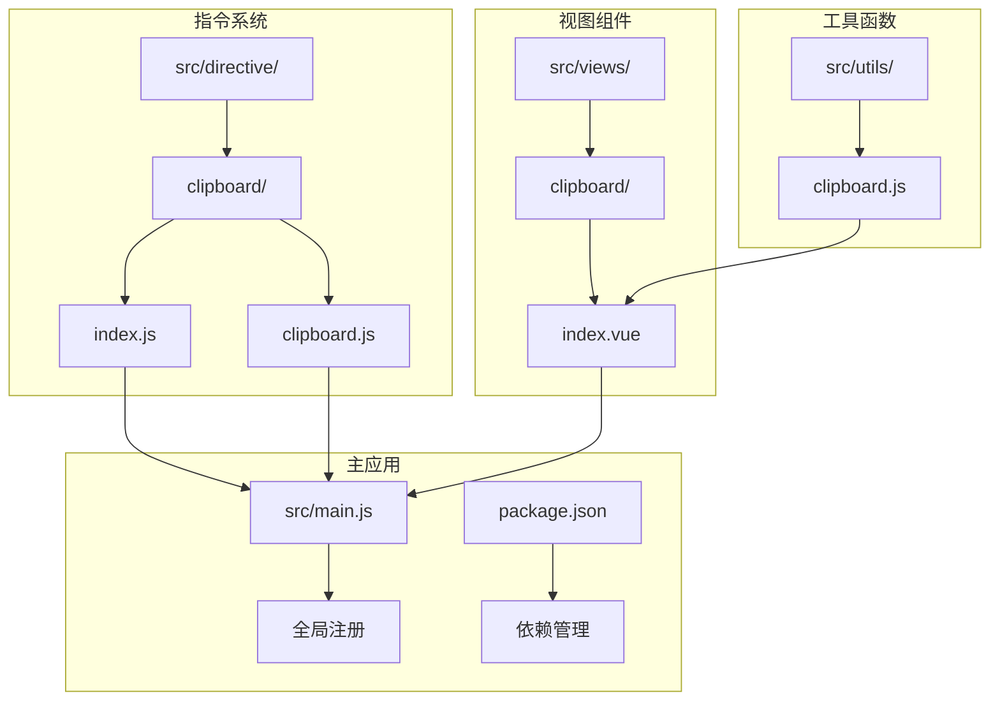
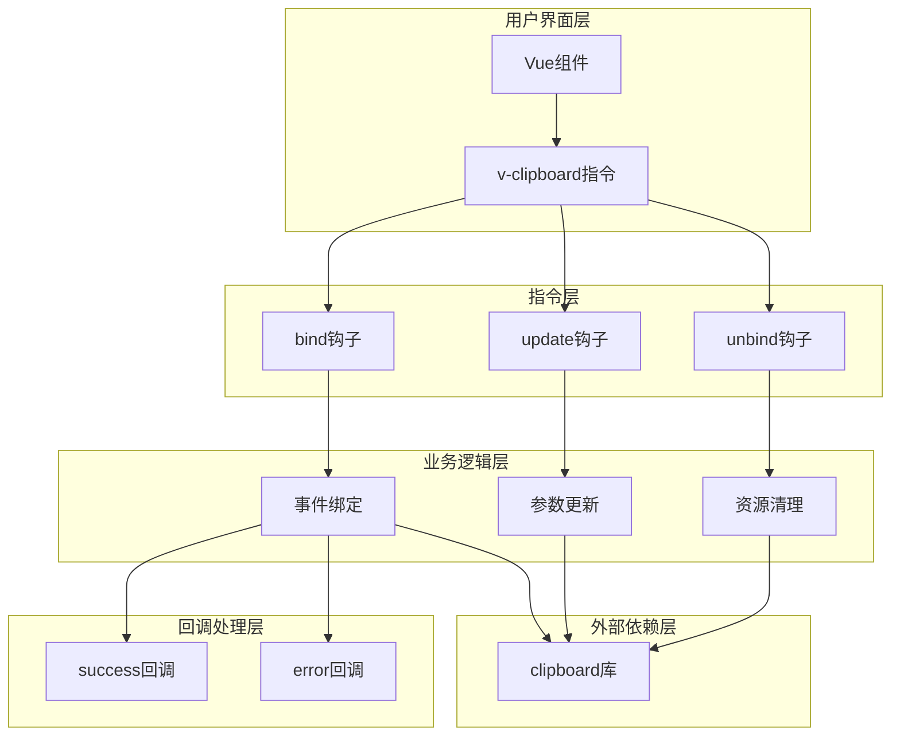
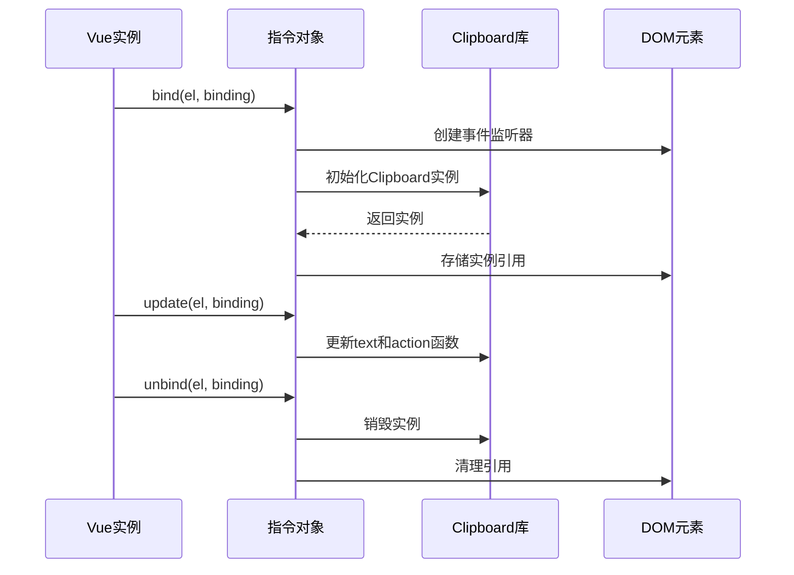
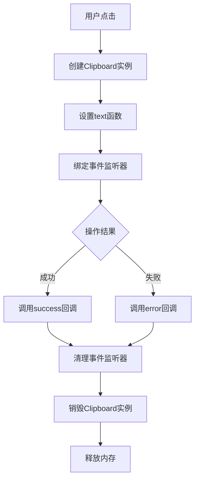
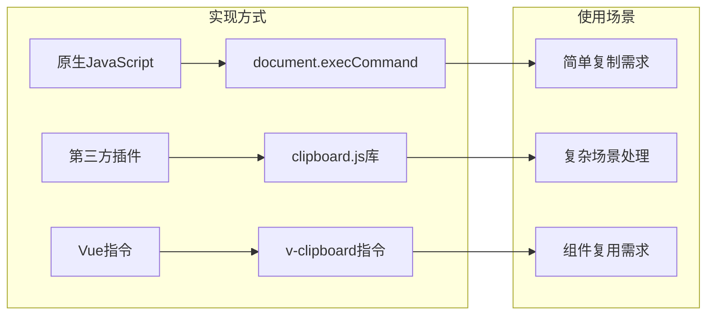
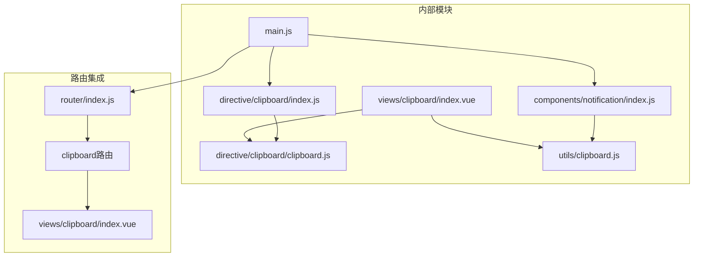

# 自定义指令

<cite>
**本文档引用的文件**
- [src/directive/clipboard/index.js](file://src/directive/clipboard/index.js)
- [src/directive/clipboard/clipboard.js](file://src/directive/clipboard/clipboard.js)
- [src/utils/clipboard.js](file://src/utils/clipboard.js)
- [src/views/clipboard/index.vue](file://src/views/clipboard/index.vue)
- [src/main.js](file://src/main.js)
- [package.json](file://package.json)
- [src/router/index.js](file://src/router/index.js)
- [src/permission.js](file://src/permission.js)
</cite>

## 目录
1. [简介](#简介)
2. [项目结构](#项目结构)
3. [核心组件](#核心组件)
4. [架构概览](#架构概览)
5. [详细组件分析](#详细组件分析)
6. [依赖关系分析](#依赖关系分析)
7. [性能考虑](#性能考虑)
8. [故障排除指南](#故障排除指南)
9. [结论](#结论)
10. [附录](#附录)

## 简介

Vue CMS项目实现了强大的自定义指令系统，其中剪贴板指令是一个重要的功能模块。该系统提供了三种不同的剪贴板操作方式：原生JavaScript方式、第三方插件方式和Vue指令方式。本文档将深入分析剪贴板指令的实现原理、使用方法和最佳实践。

剪贴板指令系统的核心价值在于：
- 统一的用户体验：提供一致的复制/剪切操作体验
- 灵活的配置选项：支持复制和剪切两种模式
- 完善的错误处理：提供成功的回调和错误的回调机制
- 良好的性能表现：最小化的DOM操作和内存管理

## 项目结构

Vue CMS项目采用模块化的组织方式，自定义指令系统位于专门的目录结构中：



**图表来源**
- [src/directive/clipboard/index.js:1-15](file://src/directive/clipboard/index.js#L1-L15)
- [src/directive/clipboard/clipboard.js:1-58](file://src/directive/clipboard/clipboard.js#L1-L58)
- [src/utils/clipboard.js:1-37](file://src/utils/clipboard.js#L1-L37)
- [src/views/clipboard/index.vue:1-77](file://src/views/clipboard/index.vue#L1-L77)

**章节来源**
- [src/directive/clipboard/index.js:1-15](file://src/directive/clipboard/index.js#L1-L15)
- [src/directive/clipboard/clipboard.js:1-58](file://src/directive/clipboard/clipboard.js#L1-L58)
- [src/utils/clipboard.js:1-37](file://src/utils/clipboard.js#L1-L37)
- [src/views/clipboard/index.vue:1-77](file://src/views/clipboard/index.vue#L1-L77)

## 核心组件

### 剪贴板指令核心实现

剪贴板指令系统主要由三个核心组件构成：

1. **指令定义文件** (`clipboard.js`)：实现Vue指令的生命周期钩子
2. **指令注册文件** (`index.js`)：提供全局注册和安装功能
3. **工具函数文件** (`utils/clipboard.js`)：提供独立的剪贴板操作函数

每个组件都有其特定的职责和实现细节，共同构成了完整的剪贴板功能体系。

**章节来源**
- [src/directive/clipboard/clipboard.js:7-58](file://src/directive/clipboard/clipboard.js#L7-L58)
- [src/directive/clipboard/index.js:3-14](file://src/directive/clipboard/index.js#L3-L14)
- [src/utils/clipboard.js:19-37](file://src/utils/clipboard.js#L19-L37)

## 架构概览

剪贴板指令系统采用分层架构设计，确保了良好的可维护性和扩展性：



**图表来源**
- [src/directive/clipboard/clipboard.js:8-56](file://src/directive/clipboard/clipboard.js#L8-L56)
- [src/utils/clipboard.js:19-36](file://src/utils/clipboard.js#L19-L36)

该架构设计确保了：
- 清晰的职责分离：不同钩子处理不同的生命周期阶段
- 良好的资源管理：及时清理事件监听器和DOM引用
- 灵活的回调机制：支持成功和错误的自定义处理

## 详细组件分析

### 剪贴板指令实现

#### 指令生命周期钩子

剪贴板指令实现了Vue指令的三个核心生命周期钩子：



**图表来源**
- [src/directive/clipboard/clipboard.js:8-56](file://src/directive/clipboard/clipboard.js#L8-L56)

#### 参数传递机制

指令支持多种参数传递方式：

| 参数类型 | 使用方式 | 功能描述 |
|---------|---------|----------|
| 基本值 | `v-clipboard="text"` | 直接传入要复制的文本 |
| 动态值 | `v-clipboard:copy="dynamicText"` | 支持响应式数据绑定 |
| 修饰符 | `v-clipboard:cut` | 切换到剪切模式 |
| 回调 | `v-clipboard:success="callback"` | 成功时的回调处理 |

**章节来源**
- [src/directive/clipboard/clipboard.js:8-56](file://src/directive/clipboard/clipboard.js#L8-L56)

### 工具函数实现

#### 独立剪贴板操作

工具函数提供了独立的剪贴板操作能力，不依赖Vue指令：



**图表来源**
- [src/utils/clipboard.js:19-36](file://src/utils/clipboard.js#L19-L36)

**章节来源**
- [src/utils/clipboard.js:1-37](file://src/utils/clipboard.js#L1-L37)

### 视图组件集成

#### 多种实现方式对比

剪贴板功能提供了三种不同的实现方式，每种都有其适用场景：



**图表来源**
- [src/views/clipboard/index.vue:4-23](file://src/views/clipboard/index.vue#L4-L23)

**章节来源**
- [src/views/clipboard/index.vue:1-77](file://src/views/clipboard/index.vue#L1-L77)

## 依赖关系分析

### 外部依赖

剪贴板指令系统依赖于以下关键外部库：

```mermaid
graph TB
subgraph "Vue生态系统"
A[Vue 2.7.16] --> B[Vue CLI 5.0.8]
B --> C[Element UI 2.15.14]
end
subgraph "剪贴板相关"
D[clipboard 2.0.1] --> E[核心功能]
F[js-cookie 2.2.1] --> G[会话管理]
end
subgraph "开发工具"
H[@vue/cli-service] --> I[构建工具]
J[jest] --> K[测试框架]
end
A --> D
A --> F
B --> H
B --> J
```

**图表来源**
- [package.json:33-63](file://package.json#L33-L63)

### 内部依赖关系



**图表来源**
- [src/main.js:1-53](file://src/main.js#L1-L53)
- [src/router/index.js:205-209](file://src/router/index.js#L205-L209)

**章节来源**
- [package.json:33-63](file://package.json#L33-L63)
- [src/main.js:1-53](file://src/main.js#L1-L53)
- [src/router/index.js:205-209](file://src/router/index.js#L205-L209)

## 性能考虑

### 内存管理优化

剪贴板指令系统在内存管理方面采用了多项优化措施：

1. **及时清理资源**：在`unbind`钩子中销毁Clipboard实例
2. **避免内存泄漏**：删除DOM元素上的私有属性引用
3. **事件监听器管理**：正确绑定和解绑事件监听器

### 性能优化建议

```javascript
// 推荐的优化做法
const optimizedDirective = {
  bind(el, binding) {
    // 避免重复创建实例
    if (!el._v_clipboard) {
      el._v_clipboard = new Clipboard(el, {
        text: () => binding.value,
        action: () => binding.arg === 'cut' ? 'cut' : 'copy'
      });
    }
  },
  
  unbind(el) {
    // 确保资源被正确清理
    if (el._v_clipboard) {
      el._v_clipboard.destroy();
      delete el._v_clipboard;
    }
  }
};
```

### 安全考虑

1. **权限检查**：确保用户具有执行复制操作的权限
2. **输入验证**：对复制内容进行适当的验证和清理
3. **错误处理**：提供完善的错误处理机制，避免影响用户体验

## 故障排除指南

### 常见问题及解决方案

#### 1. 指令未生效

**问题症状**：点击按钮无反应或报错

**可能原因**：
- 未正确导入指令
- Vue实例未正确初始化
- 浏览器兼容性问题

**解决方案**：
```javascript
// 确保正确导入和注册
import clipboard from '@/directive/clipboard'

export default {
  directives: {
    clipboard
  }
}
```

#### 2. 复制功能异常

**问题症状**：复制操作失败或返回错误

**可能原因**：
- 浏览器安全策略限制
- 页面HTTPS证书问题
- 用户权限不足

**解决方案**：
- 检查浏览器控制台错误信息
- 确认页面使用HTTPS协议
- 验证用户权限设置

#### 3. 内存泄漏问题

**问题症状**：长时间使用后页面性能下降

**可能原因**：
- 未正确清理事件监听器
- DOM元素引用未删除

**解决方案**：
- 确保在`unbind`钩子中清理所有资源
- 检查是否有循环引用

**章节来源**
- [src/directive/clipboard/clipboard.js:47-56](file://src/directive/clipboard/clipboard.js#L47-L56)

## 结论

Vue CMS项目的自定义指令系统展现了优秀的架构设计和实现质量。剪贴板指令不仅提供了完整的功能实现，还体现了以下优秀特性：

1. **模块化设计**：清晰的职责分离和模块边界
2. **生命周期管理**：完善的资源管理和清理机制
3. **错误处理**：健壮的错误处理和回退机制
4. **性能优化**：高效的内存管理和事件处理
5. **安全性考虑**：合理的权限检查和输入验证

该系统为Vue应用的自定义指令开发提供了良好的参考模板，展示了如何在实际项目中实现高质量的指令组件。

## 附录

### 使用示例

#### 全局注册方式

```javascript
// main.js
import Vue from 'vue'
import clipboard from '@/directive/clipboard'

Vue.use(clipboard)
```

#### 局部注册方式

```javascript
// 组件中
export default {
  directives: {
    clipboard
  }
}
```

#### 基本使用

```html
<!-- 复制文本 -->
<button v-clipboard="textToCopy">复制</button>

<!-- 剪切操作 -->
<button v-clipboard:cut="textToCut">剪切</button>

<!-- 自定义回调 -->
<button v-clipboard:copy="text" v-clipboard:success="onSuccess">复制</button>
```

### 最佳实践

1. **命名规范**：使用语义化的指令名称
2. **错误处理**：始终提供错误处理回调
3. **资源管理**：确保正确清理所有资源
4. **性能优化**：避免不必要的DOM操作
5. **文档编写**：为指令编写详细的使用文档

### 测试策略

1. **单元测试**：测试指令的生命周期钩子
2. **集成测试**：测试指令与组件的集成
3. **用户测试**：验证实际使用场景
4. **性能测试**：评估内存使用和执行效率