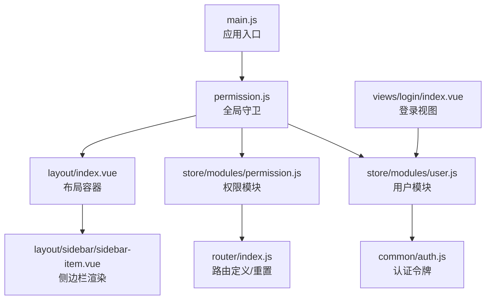
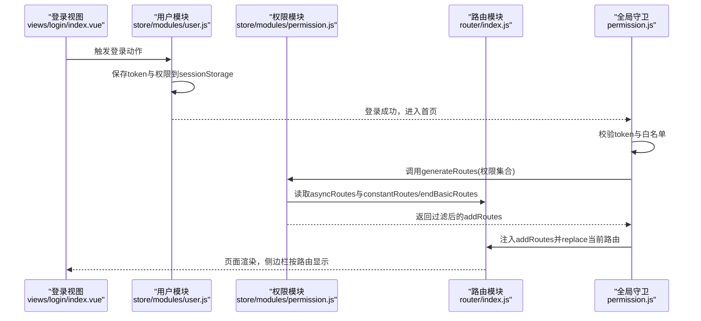
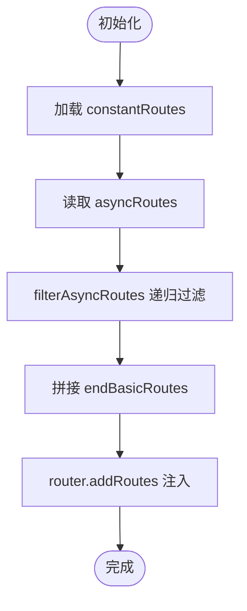
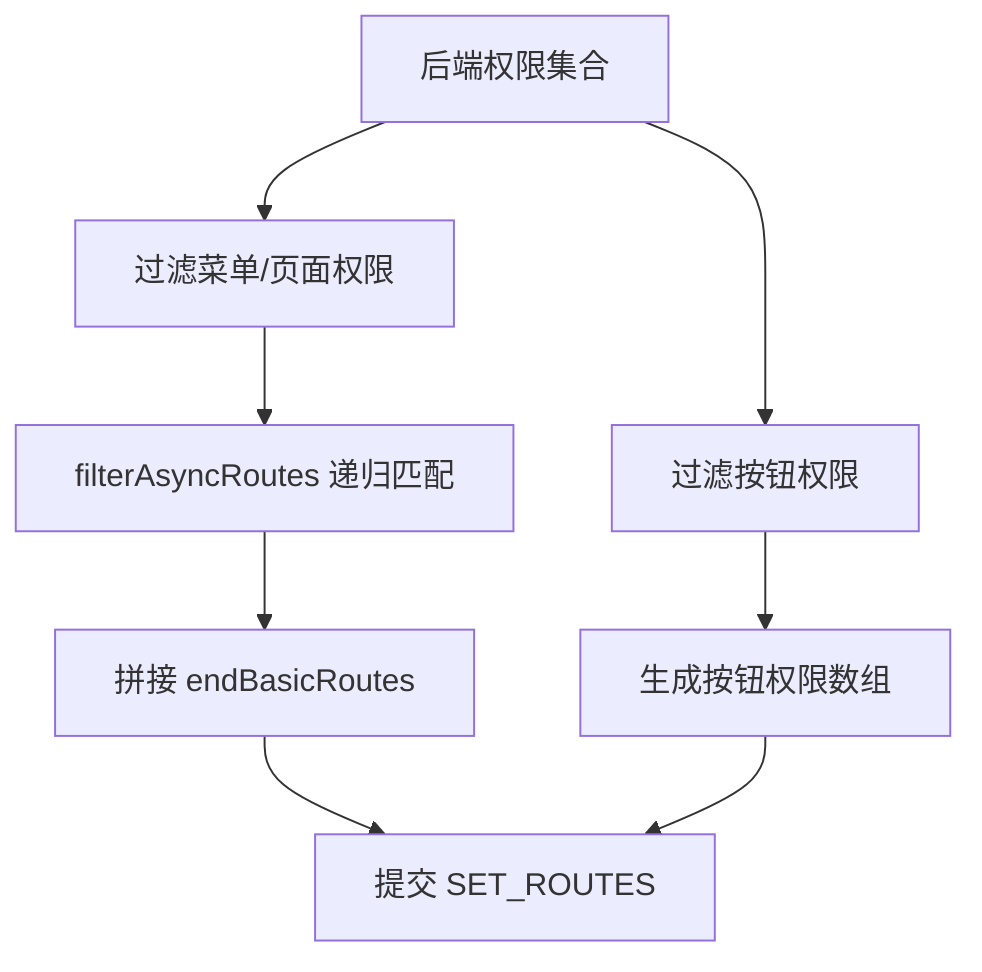
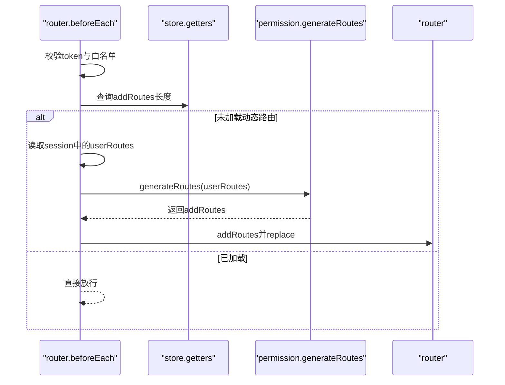
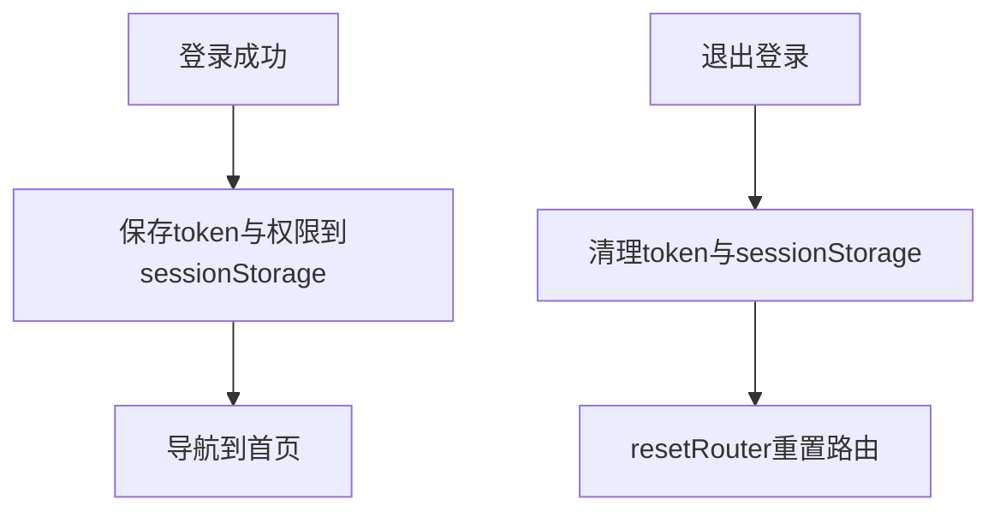
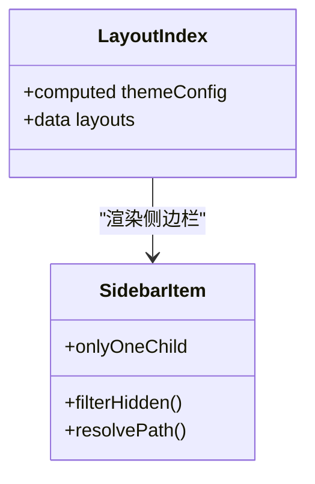
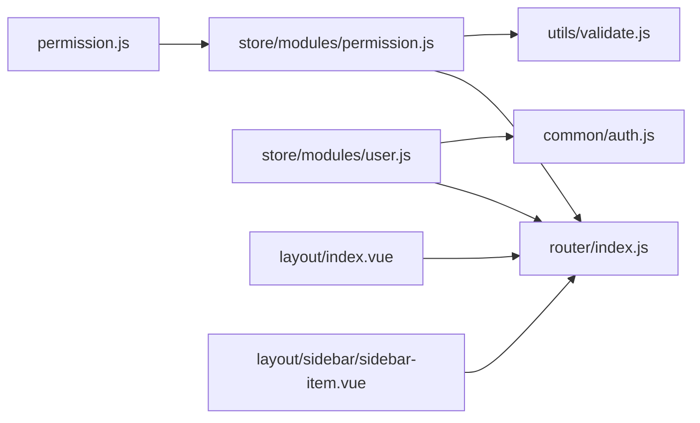

# 动态路由

<cite>
**本文引用的文件列表**
- [router/index.js](file://src/router/index.js)
- [store/modules/permission.js](file://src/store/modules/permission.js)
- [permission.js](file://src/permission.js)
- [store/modules/user.js](file://src/store/modules/user.js)
- [utils/validate.js](file://src/utils/validate.js)
- [store/index.js](file://src/store/index.js)
- [main.js](file://src/main.js)
- [common/auth.js](file://src/common/auth.js)
- [layout/index.vue](file://src/layout/index.vue)
- [layout/sidebar/sidebar-item.vue](file://src/layout/sidebar/sidebar-item.vue)
- [views/login/index.vue](file://src/views/login/index.vue)
</cite>

## 目录
1. [简介](#简介)
2. [项目结构](#项目结构)
3. [核心组件](#核心组件)
4. [架构总览](#架构总览)
5. [详细组件分析](#详细组件分析)
6. [依赖关系分析](#依赖关系分析)
7. [性能考量](#性能考量)
8. [故障排查指南](#故障排查指南)
9. [结论](#结论)
10. [附录](#附录)

## 简介
本文件面向Vue CMS动态路由系统，系统性阐述动态路由的概念、实现原理与权限控制集成方式，重点覆盖以下方面：
- 动态路由的三段式结构：基础路由、动态路由、末尾路由
- asyncRoutes的结构设计与权限过滤逻辑
- 动态路由与用户权限系统的关联：角色权限映射、路由过滤
- 动态路由的加载时机与更新机制
- 路由重置与刷新处理
- 多角色场景下的应用与最佳实践

## 项目结构
动态路由相关的核心文件分布如下：
- 路由定义与重置：src/router/index.js
- 权限过滤与路由生成：src/store/modules/permission.js
- 全局路由守卫与动态路由注入：src/permission.js
- 用户登录、权限存储与重置：src/store/modules/user.js
- 权限类型判断工具：src/utils/validate.js
- Vuex Store入口与全局Getter：src/store/index.js
- 应用入口与权限守卫挂载：src/main.js
- 认证令牌管理：src/common/auth.js
- 布局与侧边栏渲染：src/layout/index.vue、src/layout/sidebar/sidebar-item.vue
- 登录视图与触发登录流程：src/views/login/index.vue

**图表来源**
- [main.js:1-53](file://src/main.js#L1-L53)
- [permission.js:1-98](file://src/permission.js#L1-L98)
- [store/modules/user.js:1-154](file://src/store/modules/user.js#L1-L154)
- [store/modules/permission.js:1-187](file://src/store/modules/permission.js#L1-L187)
- [router/index.js:1-343](file://src/router/index.js#L1-L343)
- [common/auth.js:1-18](file://src/common/auth.js#L1-L18)
- [layout/index.vue:1-32](file://src/layout/index.vue#L1-L32)
- [layout/sidebar/sidebar-item.vue:1-106](file://src/layout/sidebar/sidebar-item.vue#L1-L106)
- [views/login/index.vue:1-261](file://src/views/login/index.vue#L1-L261)

**章节来源**
- [main.js:1-53](file://src/main.js#L1-L53)
- [router/index.js:1-343](file://src/router/index.js#L1-L343)
- [store/modules/permission.js:1-187](file://src/store/modules/permission.js#L1-L187)
- [permission.js:1-98](file://src/permission.js#L1-L98)
- [store/modules/user.js:1-154](file://src/store/modules/user.js#L1-L154)
- [utils/validate.js:1-56](file://src/utils/validate.js#L1-L56)
- [store/index.js:1-74](file://src/store/index.js#L1-L74)
- [common/auth.js:1-18](file://src/common/auth.js#L1-L18)
- [layout/index.vue:1-32](file://src/layout/index.vue#L1-L32)
- [layout/sidebar/sidebar-item.vue:1-106](file://src/layout/sidebar/sidebar-item.vue#L1-L106)
- [views/login/index.vue:1-261](file://src/views/login/index.vue#L1-L261)

## 核心组件
- 路由定义与重置
  - constantRoutes：基础路由，所有角色可访问
  - asyncRoutes：动态路由，按权限过滤生成
  - endBasicRoutes：末尾路由，始终附加在动态路由之后
  - resetRouter：重置路由实例与全局守卫
- 权限模块
  - generateRoutes：根据后端返回的权限集合过滤asyncRoutes，生成用户可用路由
  - filterAsyncRoutes：递归过滤动态路由树
  - hasPermission：基于后端返回的address与前端path匹配
- 全局守卫
  - 在路由跳转前判断token、加载动态路由、注入路由并替换历史记录
- 用户模块
  - 登录时保存权限与用户信息至sessionStorage
  - 退出登录时清理token与sessionStorage并重置路由
- 工具模块
  - isMenuPermissionByType、isBtnPermissionByType：区分菜单/页面/按钮权限类型
- 布局与侧边栏
  - 布局容器根据主题选择不同布局组件
  - 侧边栏根据路由visible/children数量决定是否展开与显示

**章节来源**
- [router/index.js:38-343](file://src/router/index.js#L38-L343)
- [store/modules/permission.js:143-179](file://src/store/modules/permission.js#L143-L179)
- [permission.js:22-91](file://src/permission.js#L22-L91)
- [store/modules/user.js:52-145](file://src/store/modules/user.js#L52-L145)
- [utils/validate.js:18-56](file://src/utils/validate.js#L18-L56)
- [layout/index.vue:15-31](file://src/layout/index.vue#L15-L31)
- [layout/sidebar/sidebar-item.vue:66-106](file://src/layout/sidebar/sidebar-item.vue#L66-L106)

## 架构总览
动态路由系统围绕“路由定义—权限过滤—全局守卫—用户状态—布局渲染”形成闭环。下图展示了从登录到路由注入的关键交互。

**图表来源**
- [views/login/index.vue:118-153](file://src/views/login/index.vue#L118-L153)
- [store/modules/user.js:54-74](file://src/store/modules/user.js#L54-L74)
- [store/modules/permission.js:147-178](file://src/store/modules/permission.js#L147-L178)
- [router/index.js:322-343](file://src/router/index.js#L322-L343)
- [permission.js:23-75](file://src/permission.js#L23-L75)

## 详细组件分析

### 路由定义与重置（router/index.js）
- 结构设计
  - constantRoutes：基础路由（如首页、登录、重定向），无需权限
  - asyncRoutes：动态路由（功能模块、嵌套菜单、富文本、主题等），按权限过滤
  - endBasicRoutes：末尾路由（404、无权限、通配符），始终附加
- 动态注入
  - 使用router.addRoutes注入过滤后的addRoutes
  - resetRouter通过重建router实例并重设matcher实现路由重置
- 路由属性
  - alwaysShow、hidden、meta.icon/title等用于菜单渲染与行为控制

**图表来源**
- [router/index.js:38-116](file://src/router/index.js#L38-L116)
- [router/index.js:322-343](file://src/router/index.js#L322-L343)
- [store/modules/permission.js:41-54](file://src/store/modules/permission.js#L41-L54)

**章节来源**
- [router/index.js:38-343](file://src/router/index.js#L38-L343)
- [store/modules/permission.js:41-54](file://src/store/modules/permission.js#L41-L54)

### 权限过滤与路由生成（store/modules/permission.js）
- 权限类型
  - 菜单/页面：type=1或2
  - 按钮：type=3
- 过滤策略
  - hasPermission：以后端返回的address与前端路由path精确匹配
  - filterAsyncRoutes：递归遍历asyncRoutes，保留有权限或存在有效子节点的路由
- 生成流程
  - generateRoutes：过滤菜单/按钮权限，生成按钮权限数组，调用filterAsyncRoutes，拼接末尾路由，提交SET_ROUTES

**图表来源**
- [store/modules/permission.js:147-178](file://src/store/modules/permission.js#L147-L178)
- [utils/validate.js:43-55](file://src/utils/validate.js#L43-L55)

**章节来源**
- [store/modules/permission.js:143-179](file://src/store/modules/permission.js#L143-L179)
- [utils/validate.js:18-56](file://src/utils/validate.js#L18-L56)

### 全局守卫与动态注入（permission.js）
- 加载时机
  - 首次进入受保护路由时，若未加载动态路由且session中存在权限，则调用generateRoutes并注入
- 流程
  - 校验token与白名单
  - 若无动态路由且session中存在权限，执行generateRoutes并router.addRoutes
  - 使用replace避免历史记录累积
- 错误处理
  - 异常时重置token并跳转登录

**图表来源**
- [permission.js:23-75](file://src/permission.js#L23-L75)
- [store/modules/permission.js:147-178](file://src/store/modules/permission.js#L147-L178)

**章节来源**
- [permission.js:1-98](file://src/permission.js#L1-L98)
- [store/modules/permission.js:143-179](file://src/store/modules/permission.js#L143-L179)

### 用户登录、权限存储与重置（store/modules/user.js）
- 登录流程
  - 调用登录接口，保存token与权限集合到sessionStorage
  - 提交用户信息与权限至state
- 退出登录
  - 清理token与sessionStorage
  - 调用resetRouter重置路由实例
- 重置路由
  - resetRouter内部重建router实例并重设matcher，确保后续注入新路由

**图表来源**
- [store/modules/user.js:54-74](file://src/store/modules/user.js#L54-L74)
- [store/modules/user.js:90-110](file://src/store/modules/user.js#L90-L110)
- [store/modules/user.js:135-145](file://src/store/modules/user.js#L135-L145)
- [router/index.js:332-340](file://src/router/index.js#L332-L340)

**章节来源**
- [store/modules/user.js:1-154](file://src/store/modules/user.js#L1-L154)
- [router/index.js:332-340](file://src/router/index.js#L332-L340)

### 布局与侧边栏渲染（layout/index.vue、layout/sidebar/sidebar-item.vue）
- 布局容器
  - 根据主题配置选择不同布局组件
- 侧边栏
  - 根据路由children数量与hidden属性决定是否显示父级菜单
  - 仅有一个可见子项时，父级可折叠显示

**图表来源**
- [layout/index.vue:15-31](file://src/layout/index.vue#L15-L31)
- [layout/sidebar/sidebar-item.vue:66-106](file://src/layout/sidebar/sidebar-item.vue#L66-L106)

**章节来源**
- [layout/index.vue:1-32](file://src/layout/index.vue#L1-L32)
- [layout/sidebar/sidebar-item.vue:1-106](file://src/layout/sidebar/sidebar-item.vue#L1-L106)

### 登录视图与触发流程（views/login/index.vue）
- 登录表单校验与提交
- 登录成功后写入本地存储并跳转首页
- 提供账号提示与粒子背景切换

**章节来源**
- [views/login/index.vue:118-153](file://src/views/login/index.vue#L118-L153)

## 依赖关系分析
- 模块耦合
  - permission.js依赖store/modules/permission.js与router/index.js
  - store/modules/permission.js依赖router/index.js与utils/validate.js
  - store/modules/user.js依赖router/index.js与common/auth.js
  - layout/index.vue与layout/sidebar/sidebar-item.vue依赖路由生成结果
- 外部依赖
  - Element UI、NProgress、js-cookie等

**图表来源**
- [permission.js:1-98](file://src/permission.js#L1-L98)
- [store/modules/permission.js:1-187](file://src/store/modules/permission.js#L1-L187)
- [router/index.js:1-343](file://src/router/index.js#L1-L343)
- [utils/validate.js:1-56](file://src/utils/validate.js#L1-L56)
- [store/modules/user.js:1-154](file://src/store/modules/user.js#L1-L154)
- [common/auth.js:1-18](file://src/common/auth.js#L1-L18)
- [layout/index.vue:1-32](file://src/layout/index.vue#L1-L32)
- [layout/sidebar/sidebar-item.vue:1-106](file://src/layout/sidebar/sidebar-item.vue#L1-L106)

**章节来源**
- [permission.js:1-98](file://src/permission.js#L1-L98)
- [store/modules/permission.js:1-187](file://src/store/modules/permission.js#L1-L187)
- [router/index.js:1-343](file://src/router/index.js#L1-L343)
- [utils/validate.js:1-56](file://src/utils/validate.js#L1-L56)
- [store/modules/user.js:1-154](file://src/store/modules/user.js#L1-L154)
- [common/auth.js:1-18](file://src/common/auth.js#L1-L18)
- [layout/index.vue:1-32](file://src/layout/index.vue#L1-L32)
- [layout/sidebar/sidebar-item.vue:1-106](file://src/layout/sidebar/sidebar-item.vue#L1-L106)

## 性能考量
- 路由注入策略
  - 使用router.addRoutes一次性注入，避免多次小粒度变更
  - resetRouter通过重建matcher实现彻底重置，减少旧路由残留
- 过滤算法
  - filterAsyncRoutes采用递归遍历，时间复杂度O(N)，其中N为动态路由节点数
- 渲染优化
  - 侧边栏仅渲染可见路由，减少DOM开销
- 缓存与持久化
  - 权限与用户信息存储于sessionStorage，避免重复请求

[本节为通用建议，不直接分析具体文件]

## 故障排查指南
- 登录后无法进入受保护页面
  - 检查token是否存在与白名单配置
  - 确认sessionStorage中userRoutes是否正确保存
- 动态路由未生效
  - 确认permission/generateRoutes已执行且返回addRoutes
  - 检查router.addRoutes是否被调用
- 退出登录后仍可访问
  - 确认resetRouter是否被调用并重建router实例
  - 检查sessionStorage是否被清空
- 路由重置无效
  - 确认resetRouter内部是否重设matcher
  - 检查全局守卫是否重新绑定

**章节来源**
- [permission.js:23-91](file://src/permission.js#L23-L91)
- [store/modules/user.js:135-145](file://src/store/modules/user.js#L135-L145)
- [router/index.js:332-340](file://src/router/index.js#L332-L340)

## 结论
本系统通过“基础路由+动态路由+末尾路由”的三段式结构，结合后端返回的权限集合与前端路由树的递归匹配，实现了灵活的动态路由生成与注入。配合全局守卫与用户状态管理，系统在登录、权限变更、退出登录等场景下具备良好的一致性与可维护性。建议在多角色场景中，后端返回的权限集合应包含完整的path与type信息，前端据此精确匹配，确保路由与菜单渲染的准确性。

[本节为总结性内容，不直接分析具体文件]

## 附录

### 动态路由配置示例（路径参考）
- 基础路由与末尾路由定义
  - [基础路由与末尾路由:38-116](file://src/router/index.js#L38-L116)
- 动态路由结构（asyncRoutes）
  - [动态路由集合:118-320](file://src/router/index.js#L118-L320)
- 权限过滤与生成
  - [权限过滤函数:41-54](file://src/store/modules/permission.js#L41-L54)
  - [生成路由动作:147-178](file://src/store/modules/permission.js#L147-L178)
- 全局守卫与注入
  - [路由守卫:23-75](file://src/permission.js#L23-L75)
- 用户登录与重置
  - [登录动作:54-74](file://src/store/modules/user.js#L54-L74)
  - [退出登录与重置:90-110](file://src/store/modules/user.js#L90-L110)
  - [重置路由:135-145](file://src/store/modules/user.js#L135-L145)
- 权限类型判断
  - [菜单/按钮类型判断:43-55](file://src/utils/validate.js#L43-L55)

### 多角色应用场景与最佳实践
- 角色权限映射
  - 后端返回的权限集合应包含type与address字段，前端据此区分菜单/页面/按钮
- 路由过滤逻辑
  - 使用hasPermission进行精确匹配，避免模糊匹配导致的权限泄露
- 动态路由注入
  - 在首次进入受保护路由时注入，避免重复注入
- 路由重置与刷新
  - 退出登录时调用resetRouter，确保下次登录注入新的权限路由
- 菜单渲染
  - 侧边栏根据children数量与hidden属性决定显示策略，提升用户体验

[本节为概念性内容，不直接分析具体文件]