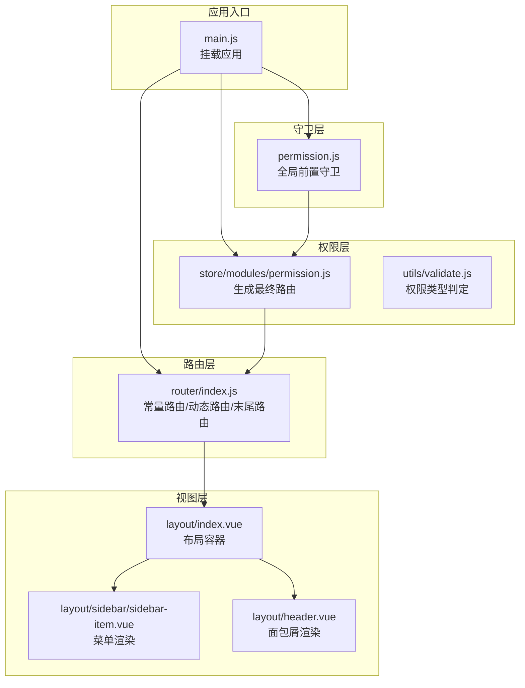
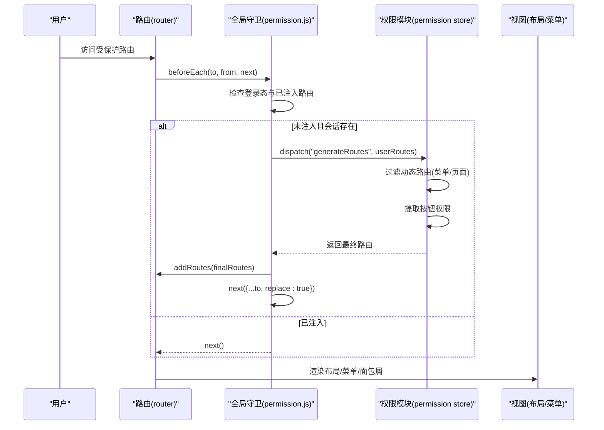
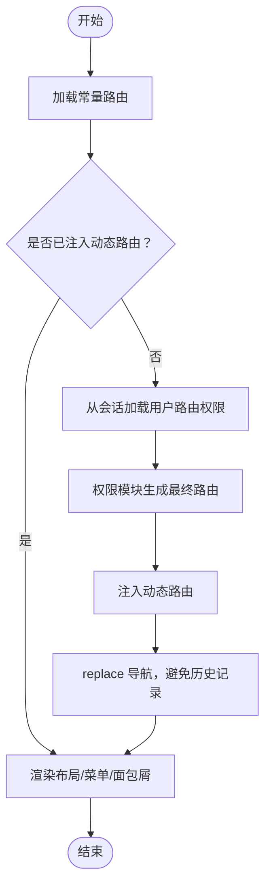
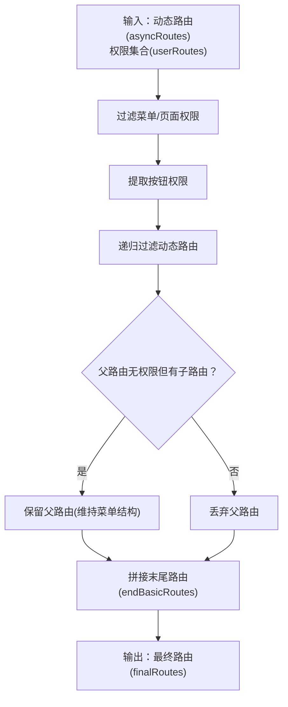
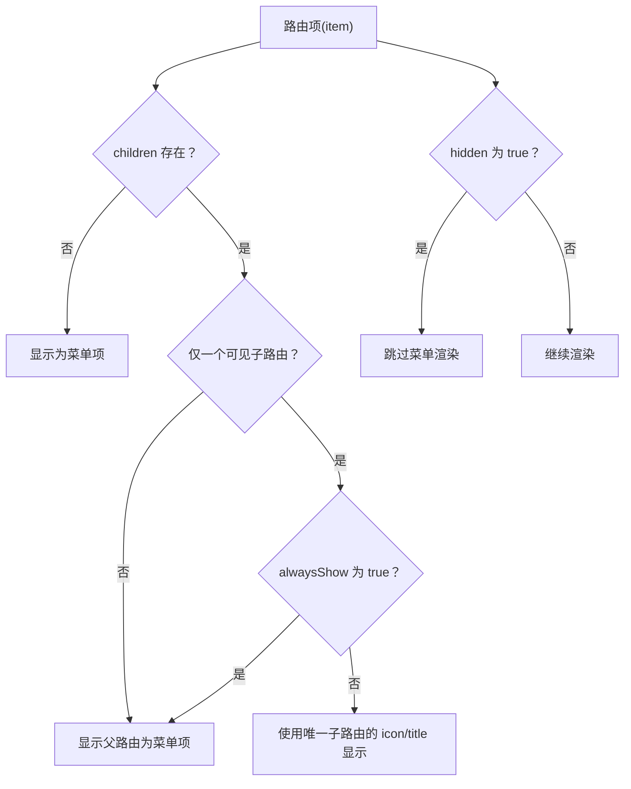
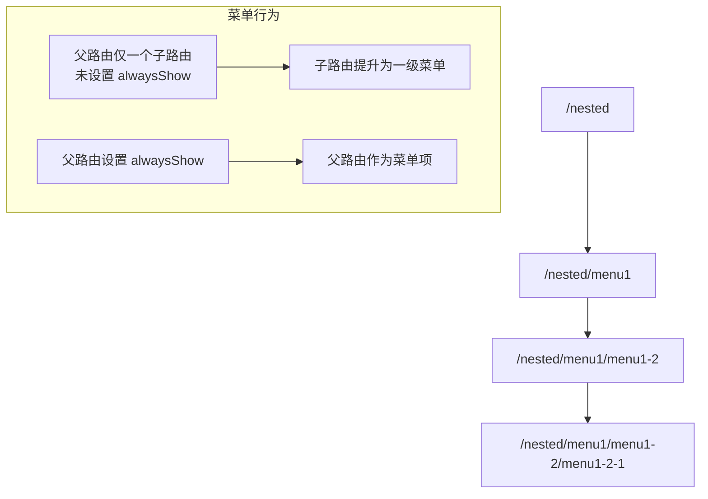
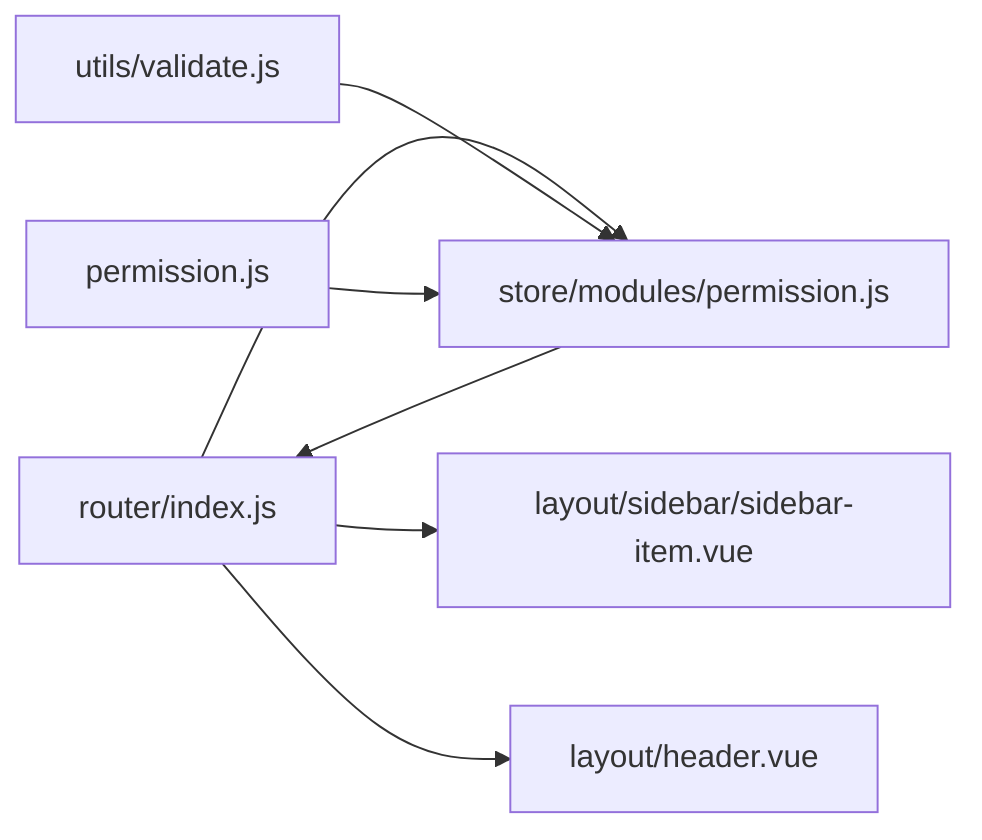

# 动态路由概念

<cite>
**本文引用的文件**
- [router/index.js](file://src/router/index.js)
- [permission.js](file://src/permission.js)
- [store/modules/permission.js](file://src/store/modules/permission.js)
- [store/modules/user.js](file://src/store/modules/user.js)
- [layout/sidebar/sidebar-item.vue](file://src/layout/sidebar/sidebar-item.vue)
- [layout/header.vue](file://src/layout/header.vue)
- [language/zh.js](file://src/language/zh.js)
- [utils/validate.js](file://src/utils/validate.js)
- [mock/modules/user.js](file://src/mock/modules/user.js)
- [main.js](file://src/main.js)
</cite>

## 目录
1. [引言](#引言)
2. [项目结构](#项目结构)
3. [核心组件](#核心组件)
4. [架构总览](#架构总览)
5. [详细组件分析](#详细组件分析)
6. [依赖关系分析](#依赖关系分析)
7. [性能考量](#性能考量)
8. [故障排查指南](#故障排查指南)
9. [结论](#结论)
10. [附录](#附录)

## 引言
本文件围绕 Vue CMS 的动态路由概念展开，系统阐释动态路由与静态路由的区别、动态路由在权限控制中的作用、三类路由（constantRoutes、asyncRoutes、endBasicRoutes）的设计目的与使用场景，以及路由配置的关键属性（alwaysShow、hidden、meta 等）的工作机制。文末提供最佳实践与常见错误规避建议，并通过图示展示路由层级结构与嵌套路由的实现方式。

## 项目结构
本项目采用“路由表 + 权限模块 + 全局守卫”的架构组织动态路由：
- 路由表集中定义于路由模块，分为基础路由、动态路由与末尾路由三部分。
- 权限模块负责根据后端返回的权限集合过滤动态路由，生成最终可访问路由。
- 全局前置守卫在首次进入受保护路由时触发权限加载与路由注入。
- 布局组件负责渲染菜单、面包屑与页面主体。

**图表来源**
- [main.js:1-53](file://src/main.js#L1-L53)
- [router/index.js:1-343](file://src/router/index.js#L1-L343)
- [store/modules/permission.js:1-187](file://src/store/modules/permission.js#L1-L187)
- [utils/validate.js:1-56](file://src/utils/validate.js#L1-L56)
- [permission.js:1-98](file://src/permission.js#L1-L98)
- [layout/index.vue:1-32](file://src/layout/index.vue#L1-L32)
- [layout/sidebar/sidebar-item.vue:1-106](file://src/layout/sidebar/sidebar-item.vue#L1-L106)
- [layout/header.vue:95-148](file://src/layout/header.vue#L95-L148)

**章节来源**
- [main.js:1-53](file://src/main.js#L1-L53)
- [router/index.js:1-343](file://src/router/index.js#L1-L343)

## 核心组件
- 路由表与配置
  - 常量路由（constantRoutes）：无需权限即可访问的基础页面，如首页、登录、重定向等。
  - 动态路由（asyncRoutes）：按用户角色/权限动态下发的菜单与页面。
  - 末尾路由（endBasicRoutes）：始终置于路由表末尾的兜底页面，如 404、无权限、通配符。
- 权限模块（permission store）
  - 生成最终路由：过滤动态路由，保留用户具备菜单/页面权限的部分，并追加末尾路由。
  - 提取按钮权限：从后端返回的权限集合中提取按钮级权限。
- 全局守卫（permission.js）
  - 在首次访问受保护路由时，检查登录态与用户路由权限，必要时从本地会话加载权限并注入动态路由。
- 布局与菜单
  - 菜单渲染：根据路由的 meta.icon/title 与 alwaysShow/hidden 控制菜单项显示与层级。
  - 面包屑：基于 matched 路由链路与 meta.title 渲染面包屑导航。

**章节来源**
- [router/index.js:38-116](file://src/router/index.js#L38-L116)
- [store/modules/permission.js:133-179](file://src/store/modules/permission.js#L133-L179)
- [permission.js:22-91](file://src/permission.js#L22-L91)
- [layout/sidebar/sidebar-item.vue:1-106](file://src/layout/sidebar/sidebar-item.vue#L1-L106)
- [layout/header.vue:128-148](file://src/layout/header.vue#L128-L148)

## 架构总览
动态路由的运行流程如下：
- 应用启动后，先注册常量路由。
- 用户访问受保护路由时，全局守卫检查登录态与已注入的动态路由。
- 若未注入或本地会话缺失，从会话加载权限并调用权限模块生成最终路由。
- 将最终路由注入到路由器，然后以 replace 方式重新导航，确保历史记录正确。

**图表来源**
- [permission.js:22-91](file://src/permission.js#L22-L91)
- [store/modules/permission.js:143-179](file://src/store/modules/permission.js#L143-L179)
- [router/index.js:322-343](file://src/router/index.js#L322-L343)

## 详细组件分析

### 路由表与三类路由
- 常量路由（constantRoutes）
  - 设计目的：承载无需权限即可访问的基础页面，保证系统基本可用性。
  - 使用场景：登录页、重定向、首页等。
- 动态路由（asyncRoutes）
  - 设计目的：按用户角色/权限下发菜单与页面，实现细粒度权限控制。
  - 使用场景：业务模块菜单、页面、嵌套路由等。
- 末尾路由（endBasicRoutes）
  - 设计目的：确保兜底页面始终位于路由表末尾，避免误匹配。
  - 使用场景：404、无权限、通配符页面。

**图表来源**
- [router/index.js:38-116](file://src/router/index.js#L38-L116)
- [store/modules/permission.js:143-179](file://src/store/modules/permission.js#L143-L179)
- [permission.js:40-74](file://src/permission.js#L40-L74)

**章节来源**
- [router/index.js:38-116](file://src/router/index.js#L38-L116)

### 权限过滤与最终路由生成
- 权限类型判定
  - 菜单/页面权限：type=1 或 2。
  - 按钮权限：type=3。
- 过滤策略
  - 对动态路由进行递归过滤，保留用户具备菜单/页面权限的路由及其子路由。
  - 若某父路由无权限但存在子路由，仍保留父路由以维持菜单结构（配合 alwaysShow 控制）。
- 结果拼接
  - 将过滤后的动态路由与末尾路由拼接，形成最终可注入的路由表。

**图表来源**
- [store/modules/permission.js:147-179](file://src/store/modules/permission.js#L147-L179)
- [utils/validate.js:43-55](file://src/utils/validate.js#L43-L55)

**章节来源**
- [store/modules/permission.js:143-179](file://src/store/modules/permission.js#L143-L179)
- [utils/validate.js:1-56](file://src/utils/validate.js#L1-L56)

### 菜单与面包屑渲染
- 菜单渲染规则
  - 单子路由且未设置 alwaysShow：将唯一子路由提升至一级菜单，使用其 meta.icon/title。
  - 多子路由或设置 alwaysShow：以父路由为菜单项，展开子菜单。
  - hidden=true：不在菜单中显示。
- 面包屑渲染
  - 基于 $route.matched 过滤 meta.title 存在且未 hidden 的路由项，逐级显示。

**图表来源**
- [layout/sidebar/sidebar-item.vue:1-106](file://src/layout/sidebar/sidebar-item.vue#L1-L106)
- [layout/header.vue:128-148](file://src/layout/header.vue#L128-L148)

**章节来源**
- [layout/sidebar/sidebar-item.vue:1-106](file://src/layout/sidebar/sidebar-item.vue#L1-L106)
- [layout/header.vue:128-148](file://src/layout/header.vue#L128-L148)

### 路由层级与嵌套路由
- 父子路由
  - 父路由 path 必须为完整路径，用于匹配与导航。
  - 子路由 path 可相对父路由，最终渲染时会拼接为完整路径。
- 嵌套示例
  - 一级菜单：/nested
  - 二级菜单：/nested/menu1
  - 三级菜单：/nested/menu1/menu1-2/menu1-2-1
  - alwaysShow 控制：若父路由仅一个子路由且未设置 alwaysShow，则将其子路由提升为一级菜单。

**图表来源**
- [router/index.js:226-268](file://src/router/index.js#L226-L268)
- [layout/sidebar/sidebar-item.vue:1-106](file://src/layout/sidebar/sidebar-item.vue#L1-L106)

**章节来源**
- [router/index.js:226-268](file://src/router/index.js#L226-L268)

### 路由配置关键属性说明
- alwaysShow
  - 作用：当父路由仅有一个子路由时，是否强制显示父路由而非将子路由提升为一级菜单。
  - 场景：希望保持父级菜单项的存在，便于统一管理图标与标题。
- hidden
  - 作用：是否在菜单中显示该路由项。
  - 场景：登录、重定向、404、无权限等页面通常设为 hidden=true。
- meta
  - noCache：是否缓存组件状态，默认 false。
  - icon：菜单图标。
  - title：菜单与面包屑显示的标题，支持国际化键值。
- isKeepAlive、isIframe
  - 作用：控制组件缓存与内嵌窗口行为（注释中给出）。
  - 场景：复杂页面或第三方页面嵌入。

**章节来源**
- [router/index.js:14-36](file://src/router/index.js#L14-L36)
- [language/zh.js:20-51](file://src/language/zh.js#L20-L51)

## 依赖关系分析
- 路由模块依赖
  - 路由模块导出三类路由，供权限模块与全局守卫使用。
- 权限模块依赖
  - 导入路由模块的三类路由，结合工具模块的权限类型判定，生成最终路由。
- 全局守卫依赖
  - 读取登录态与会话中的用户路由权限，触发权限模块生成最终路由并注入。
- 视图层依赖
  - 菜单组件依赖路由的 meta.icon/title/alwaysShow/hidden。
  - 面包屑组件依赖路由的 meta.title 与 matched 链路。

**图表来源**
- [router/index.js:1-343](file://src/router/index.js#L1-L343)
- [store/modules/permission.js:1-187](file://src/store/modules/permission.js#L1-L187)
- [utils/validate.js:1-56](file://src/utils/validate.js#L1-L56)
- [permission.js:1-98](file://src/permission.js#L1-L98)
- [layout/sidebar/sidebar-item.vue:1-106](file://src/layout/sidebar/sidebar-item.vue#L1-L106)
- [layout/header.vue:95-148](file://src/layout/header.vue#L95-L148)

**章节来源**
- [router/index.js:1-343](file://src/router/index.js#L1-L343)
- [store/modules/permission.js:1-187](file://src/store/modules/permission.js#L1-L187)
- [permission.js:1-98](file://src/permission.js#L1-L98)

## 性能考量
- 路由注入时机
  - 首次访问受保护路由时注入，避免应用启动即加载所有动态路由导致首屏卡顿。
- 路由复用
  - 使用 replace 导航，减少历史记录栈深度。
- 组件缓存
  - 合理使用 meta.noCache 控制组件缓存，平衡性能与交互体验。
- 权限过滤
  - 递归过滤动态路由时，尽量减少不必要的遍历与字符串匹配。

[本节为通用指导，不涉及具体文件分析]

## 故障排查指南
- 登录后仍跳回登录页
  - 检查会话中是否存在 userRoutes，确认权限模块是否成功生成最终路由并注入。
  - 查看全局守卫的错误分支，确认是否抛出异常或重置 token。
- 菜单显示不符合预期
  - 检查父路由是否设置 alwaysShow，以及子路由是否 hidden。
  - 确认 meta.icon/title 是否正确配置，且未被国际化覆盖。
- 404 页面未显示
  - 确认末尾路由是否正确拼接到最终路由。
  - 检查通配符路由是否位于路由表末尾。
- 嵌套路由层级异常
  - 确认父路由 path 为完整路径，子路由 path 为相对路径。
  - 检查 children 数组是否正确嵌套，meta 配置是否一致。

**章节来源**
- [permission.js:40-91](file://src/permission.js#L40-L91)
- [store/modules/permission.js:147-179](file://src/store/modules/permission.js#L147-L179)
- [router/index.js:77-116](file://src/router/index.js#L77-L116)

## 结论
动态路由通过“常量路由 + 动态路由 + 末尾路由”的组合，实现了灵活的权限控制与菜单渲染。配合全局守卫与权限模块，系统能够在用户首次访问时按需注入路由，既保证了安全性，又兼顾了性能与用户体验。合理使用 alwaysShow、hidden、meta 等属性，能够清晰表达路由层级与菜单行为，提升可维护性。

[本节为总结性内容，不涉及具体文件分析]

## 附录

### 最佳实践
- 路由层级
  - 父路由 path 必须为完整路径，子路由使用相对路径。
  - 严格区分菜单/页面/按钮权限，分别映射到 type=1/2/3。
- 菜单与标题
  - 使用 meta.title 指定菜单与面包屑标题，配合国际化键值。
  - alwaysShow 仅在确需保留父级菜单项时启用。
- 权限过滤
  - 优先使用后端返回的 address 字段进行精确匹配。
  - 递归过滤时保留父路由以维持菜单结构。
- 注入与复用
  - 首次访问受保护路由时注入动态路由，后续直接放行。
  - 使用 replace 导航，避免历史记录冗余。

### 常见错误与规避
- 错误：子路由未设置 alwaysShow，但期望父路由显示
  - 解决：为父路由设置 alwaysShow=true。
- 错误：meta.title 未配置或国际化键值无效
  - 解决：确保 meta.title 指向有效国际化键，或提供默认标题。
- 错误：通配符路由未置于末尾
  - 解决：将 * 路由放置在路由表最后，确保不会提前匹配。
- 错误：父路由 path 为相对路径
  - 解决：将父路由 path 设为完整路径，确保导航与匹配正确。

[本节为通用指导，不涉及具体文件分析]