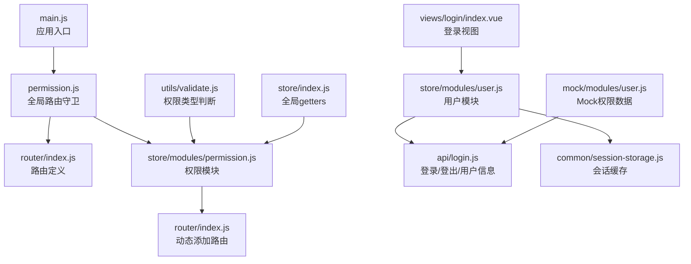
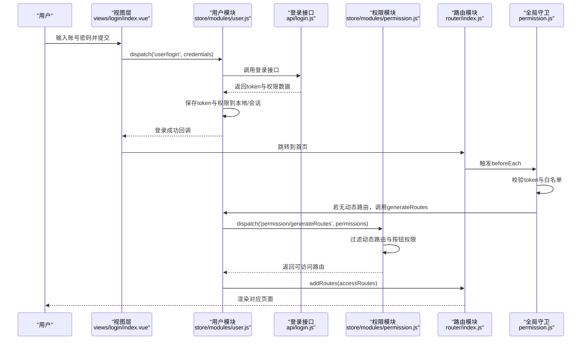
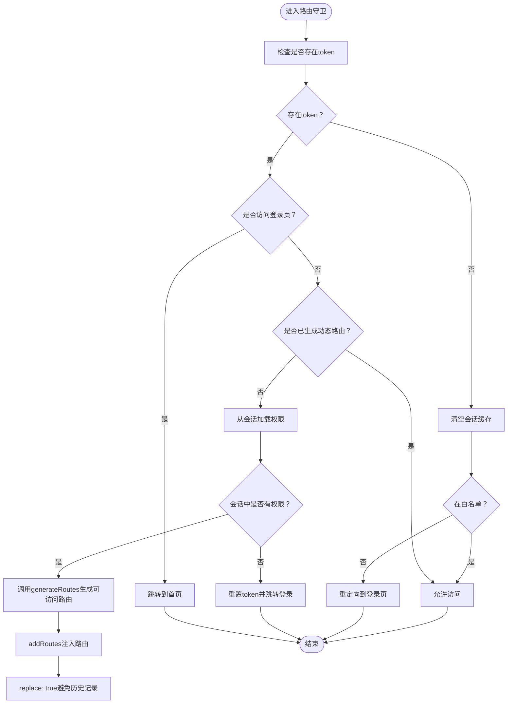
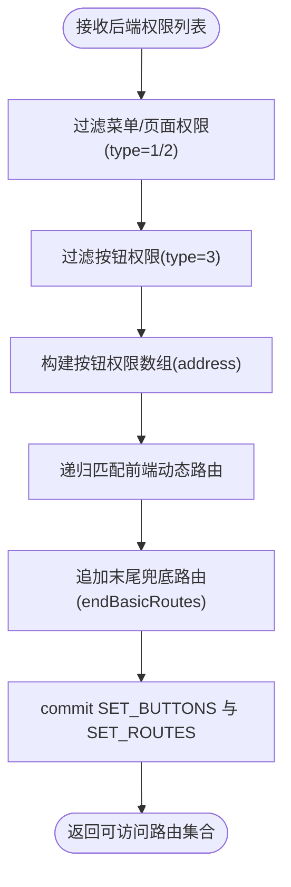
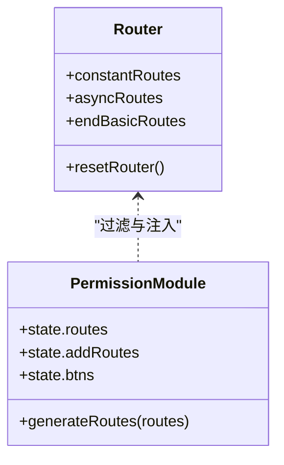
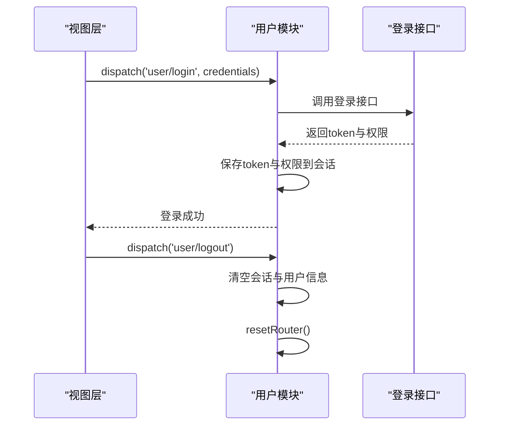
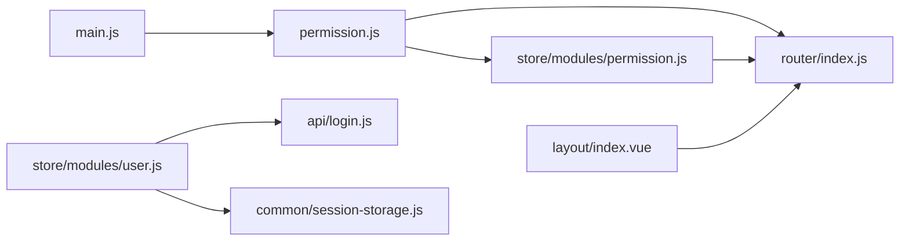

# 权限集成机制

<cite>
**本文引用的文件**
- [src/permission.js](file://src/permission.js)
- [src/store/modules/permission.js](file://src/store/modules/permission.js)
- [src/router/index.js](file://src/router/index.js)
- [src/store/modules/user.js](file://src/store/modules/user.js)
- [src/api/login.js](file://src/api/login.js)
- [src/utils/validate.js](file://src/utils/validate.js)
- [src/common/session-storage.js](file://src/common/session-storage.js)
- [src/main.js](file://src/main.js)
- [src/views/login/index.vue](file://src/views/login/index.vue)
- [src/mock/modules/user.js](file://src/mock/modules/user.js)
- [src/layout/index.vue](file://src/layout/index.vue)
- [src/store/index.js](file://src/store/index.js)
</cite>

## 目录
1. [引言](#引言)
2. [项目结构](#项目结构)
3. [核心组件](#核心组件)
4. [架构总览](#架构总览)
5. [详细组件分析](#详细组件分析)
6. [依赖关系分析](#依赖关系分析)
7. [性能考量](#性能考量)
8. [故障排查指南](#故障排查指南)
9. [结论](#结论)
10. [附录](#附录)

## 引言
本文件系统性阐述 Vue CMS 中动态路由与权限系统的集成机制，重点覆盖以下方面：
- 路由守卫与权限拦截的实现原理（permission.js）
- Vuex 中 permission 模块的状态管理（动态路由列表的存储与更新）
- 登录后基于角色权限过滤与生成可访问路由的流程
- 路由权限验证的完整链路：从认证到路由生成
- 权限配置示例与角色权限映射的实际应用
- 权限变更后的路由更新与页面刷新处理

## 项目结构
围绕权限与路由的关键文件组织如下：
- 入口与全局守卫：main.js 引入 permission.js，后者通过 beforeEach 实现全局路由守卫
- 路由定义：router/index.js 定义常量路由、动态路由与末尾兜底路由
- 权限模块：store/modules/permission.js 负责过滤与生成动态路由、维护按钮权限
- 用户模块：store/modules/user.js 负责登录、登出、token 与用户信息的持久化
- 登录接口：api/login.js 提供登录、登出、获取用户信息的 API
- 工具与缓存：utils/validate.js 提供权限类型判断；common/session-storage.js 提供 sessionStorage 的封装
- Mock 数据：mock/modules/user.js 提供不同角色的权限数据示例
- 布局与入口：layout/index.vue 作为布局容器；views/login/index.vue 为登录视图

**图表来源**
- [src/main.js:25](file://src/main.js#L25)
- [src/permission.js:5-6](file://src/permission.js#L5-L6)
- [src/router/index.js:43-111](file://src/router/index.js#L43-L111)
- [src/store/modules/permission.js:4](file://src/store/modules/permission.js#L4)
- [src/store/modules/user.js:1](file://src/store/modules/user.js#L1)
- [src/api/login.js:1](file://src/api/login.js#L1)
- [src/common/session-storage.js:19-47](file://src/common/session-storage.js#L19-L47)
- [src/views/login/index.vue:110-153](file://src/views/login/index.vue#L110-L153)
- [src/mock/modules/user.js:9-192](file://src/mock/modules/user.js#L9-L192)
- [src/utils/validate.js:25-55](file://src/utils/validate.js#L25-L55)
- [src/store/index.js:24-68](file://src/store/index.js#L24-L68)

**章节来源**
- [src/main.js:25](file://src/main.js#L25)
- [src/permission.js:5-6](file://src/permission.js#L5-L6)
- [src/router/index.js:43-111](file://src/router/index.js#L43-L111)
- [src/store/modules/permission.js:4](file://src/store/modules/permission.js#L4)
- [src/store/modules/user.js:1](file://src/store/modules/user.js#L1)
- [src/api/login.js:1](file://src/api/login.js#L1)
- [src/common/session-storage.js:19-47](file://src/common/session-storage.js#L19-L47)
- [src/views/login/index.vue:110-153](file://src/views/login/index.vue#L110-L153)
- [src/mock/modules/user.js:9-192](file://src/mock/modules/user.js#L9-L192)
- [src/utils/validate.js:25-55](file://src/utils/validate.js#L25-L55)
- [src/store/index.js:24-68](file://src/store/index.js#L24-L68)

## 核心组件
- 全局路由守卫（permission.js）：负责在每次路由跳转前进行权限校验，处理 token、白名单、动态路由注入与错误恢复
- 权限模块（store/modules/permission.js）：负责根据后端返回的权限列表过滤前端动态路由，生成可访问路由集合，并维护按钮权限
- 路由定义（router/index.js）：定义基础路由、动态路由与末尾兜底路由，提供 resetRouter 以重置路由
- 用户模块（store/modules/user.js）：负责登录、登出、token 与用户信息的持久化，以及退出时清理会话与重置路由
- 登录接口（api/login.js）：封装登录、登出、获取用户信息的请求
- 工具与缓存（utils/validate.js、common/session-storage.js）：提供权限类型判断与 sessionStorage 的安全封装
- Mock 数据（mock/modules/user.js）：提供不同角色的权限数据示例，便于演示与测试

**章节来源**
- [src/permission.js:23-91](file://src/permission.js#L23-L91)
- [src/store/modules/permission.js:147-178](file://src/store/modules/permission.js#L147-L178)
- [src/router/index.js:43-111](file://src/router/index.js#L43-L111)
- [src/store/modules/user.js:52-145](file://src/store/modules/user.js#L52-L145)
- [src/api/login.js:1](file://src/api/login.js#L1)
- [src/utils/validate.js:25-55](file://src/utils/validate.js#L25-L55)
- [src/common/session-storage.js:19-47](file://src/common/session-storage.js#L19-L47)
- [src/mock/modules/user.js:9-192](file://src/mock/modules/user.js#L9-L192)

## 架构总览
下图展示了从用户登录到动态路由生成与页面渲染的完整流程，包括权限拦截、路由过滤与注入、错误处理与页面刷新。

**图表来源**
- [src/views/login/index.vue:118-141](file://src/views/login/index.vue#L118-L141)
- [src/store/modules/user.js:54-74](file://src/store/modules/user.js#L54-L74)
- [src/api/login.js:3-23](file://src/api/login.js#L3-L23)
- [src/permission.js:23-91](file://src/permission.js#L23-L91)
- [src/store/modules/permission.js:147-178](file://src/store/modules/permission.js#L147-L178)
- [src/router/index.js:322-342](file://src/router/index.js#L322-L342)

## 详细组件分析

### 全局路由守卫（permission.js）
- 白名单机制：对特定路径（如登录、第三方回调等）放行
- Token 校验：通过工具函数获取 token，决定是否已登录
- 动态路由注入：若未生成过动态路由，从会话中加载权限并调用 generateRoutes，随后 addRoutes 注入
- 错误处理：异常时重置 token 并跳转登录页
- 进度条与标题：每次导航开始时设置页面标题并启动进度条，完成后结束

**图表来源**
- [src/permission.js:23-91](file://src/permission.js#L23-L91)
- [src/common/session-storage.js:30-41](file://src/common/session-storage.js#L30-L41)

**章节来源**
- [src/permission.js:23-91](file://src/permission.js#L23-L91)
- [src/common/session-storage.js:30-41](file://src/common/session-storage.js#L30-L41)

### Vuex 权限模块（store/modules/permission.js）
- 状态结构：包含按钮权限数组、最终路由集合、动态路由集合
- 路由过滤：根据后端返回的权限列表（type=1/2 表示菜单/页面）与前端动态路由进行匹配，递归过滤子路由
- 按钮权限：根据 type=3 的权限项提取地址，形成按钮权限数组
- 路由注入：将过滤后的动态路由与末尾兜底路由拼接，更新 state，并通过 mutation 暴露给全局

**图表来源**
- [src/store/modules/permission.js:147-178](file://src/store/modules/permission.js#L147-L178)
- [src/router/index.js:80-111](file://src/router/index.js#L80-L111)
- [src/utils/validate.js:43-55](file://src/utils/validate.js#L43-L55)

**章节来源**
- [src/store/modules/permission.js:7-14](file://src/store/modules/permission.js#L7-L14)
- [src/store/modules/permission.js:41-54](file://src/store/modules/permission.js#L41-L54)
- [src/store/modules/permission.js:147-178](file://src/store/modules/permission.js#L147-L178)
- [src/utils/validate.js:43-55](file://src/utils/validate.js#L43-L55)

### 路由定义（router/index.js）
- 常量路由：登录、首页、重定向等无需权限的基础路由
- 动态路由：前端预置的菜单/页面路由，按权限过滤后注入
- 末尾兜底路由：404、无权限、通配符兜底页面
- 路由重置：resetRouter 通过替换 matcher 实现路由重置，并重新挂载守卫

**图表来源**
- [src/router/index.js:43-111](file://src/router/index.js#L43-L111)
- [src/router/index.js:322-342](file://src/router/index.js#L322-L342)
- [src/store/modules/permission.js:147-178](file://src/store/modules/permission.js#L147-L178)

**章节来源**
- [src/router/index.js:43-111](file://src/router/index.js#L43-L111)
- [src/router/index.js:322-342](file://src/router/index.js#L322-L342)

### 用户模块（store/modules/user.js）
- 登录：调用登录接口，保存 token 与权限到会话，提交用户信息与权限到 state
- 登出：移除 token，清空会话，重置路由，清理用户信息
- 重置 token：触发登出流程，确保路由与状态一致性

**图表来源**
- [src/store/modules/user.js:54-110](file://src/store/modules/user.js#L54-L110)
- [src/api/login.js:3-23](file://src/api/login.js#L3-L23)

**章节来源**
- [src/store/modules/user.js:54-110](file://src/store/modules/user.js#L54-L110)
- [src/api/login.js:3-23](file://src/api/login.js#L3-L23)

### 登录视图（views/login/index.vue）
- 表单校验：用户名与密码通过工具函数校验
- 登录动作：调用 user/login，成功后跳转首页
- 记住账号：可选保存账号与密码到本地存储

**章节来源**
- [src/views/login/index.vue:118-141](file://src/views/login/index.vue#L118-L141)

### Mock 权限数据（mock/modules/user.js）
- 角色权限：admin 与 lucy 分别拥有不同的菜单/页面/按钮权限
- 权限结构：type 字段区分菜单、页面、按钮；address 字段为完整路由路径

**章节来源**
- [src/mock/modules/user.js:9-192](file://src/mock/modules/user.js#L9-L192)

## 依赖关系分析
- permission.js 依赖 router 与 store，负责在导航前进行权限拦截与动态路由注入
- permission 模块依赖 router 的常量与动态路由、validate 工具进行权限类型判断
- user 模块依赖 api/login.js 与 session-storage 进行登录/登出与数据持久化
- main.js 引入 permission.js，确保应用启动即启用全局守卫
- layout/index.vue 作为布局容器，配合路由渲染对应页面

**图表来源**
- [src/permission.js:5-6](file://src/permission.js#L5-L6)
- [src/router/index.js:43-111](file://src/router/index.js#L43-L111)
- [src/store/modules/permission.js:4](file://src/store/modules/permission.js#L4)
- [src/store/modules/user.js:1](file://src/store/modules/user.js#L1)
- [src/api/login.js:1](file://src/api/login.js#L1)
- [src/common/session-storage.js:19-47](file://src/common/session-storage.js#L19-L47)
- [src/main.js:25](file://src/main.js#L25)
- [src/layout/index.vue:1](file://src/layout/index.vue#L1)

**章节来源**
- [src/permission.js:5-6](file://src/permission.js#L5-L6)
- [src/router/index.js:43-111](file://src/router/index.js#L43-L111)
- [src/store/modules/permission.js:4](file://src/store/modules/permission.js#L4)
- [src/store/modules/user.js:1](file://src/store/modules/user.js#L1)
- [src/api/login.js:1](file://src/api/login.js#L1)
- [src/common/session-storage.js:19-47](file://src/common/session-storage.js#L19-L47)
- [src/main.js:25](file://src/main.js#L25)
- [src/layout/index.vue:1](file://src/layout/index.vue#L1)

## 性能考量
- 路由过滤复杂度：递归过滤动态路由的时间复杂度与动态路由树深度与宽度相关，建议控制动态路由层级与数量
- 会话缓存：使用 sessionStorage 存储用户路由与权限，避免重复请求，但需注意退出登录时及时清理
- 路由重置：resetRouter 通过替换 matcher 避免内存泄漏，适合在权限变更或登出后调用
- 进度条与标题：NProgress 仅在导航阶段启用，避免对渲染性能造成影响

[本节为通用指导，不涉及具体文件分析]

## 故障排查指南
- 登录后无法访问新路由
  - 检查会话中是否存在 userRoutes；若为空，守卫会重置 token 并跳转登录
  - 确认后端返回的权限地址与前端路由 path 完全一致
- 页面空白或404
  - 确认末尾兜底路由已注入；检查 endBasicRoutes 是否正确拼接
- 登出后仍可访问
  - 确认退出登录时调用了 resetRouter，并清理了 sessionStorage
- 权限类型不生效
  - 检查 isMenuPermissionByType 与 isBtnPermissionByType 的类型判断逻辑

**章节来源**
- [src/permission.js:40-70](file://src/permission.js#L40-L70)
- [src/store/modules/permission.js:147-178](file://src/store/modules/permission.js#L147-L178)
- [src/store/modules/user.js:90-145](file://src/store/modules/user.js#L90-L145)
- [src/utils/validate.js:43-55](file://src/utils/validate.js#L43-L55)

## 结论
本权限系统通过全局路由守卫与 Vuex 权限模块协同工作，实现了基于角色的动态路由过滤与注入。其核心优势在于：
- 明确的白名单与 token 校验机制
- 基于后端权限列表的精确路由过滤
- 会话缓存与路由重置保障用户体验与安全性
- 可扩展的按钮权限与多级菜单支持

在实际应用中，建议：
- 严格规范后端权限地址与前端路由 path 的一致性
- 在权限变更后主动调用 resetRouter 并清理会话
- 对动态路由进行合理分层与数量控制，提升性能

[本节为总结性内容，不涉及具体文件分析]

## 附录

### 权限配置示例与角色映射
- 角色 admin：拥有菜单、页面与按钮权限，覆盖多个功能模块
- 角色 lucy：仅部分菜单与页面权限，体现细粒度权限控制

**章节来源**
- [src/mock/modules/user.js:15-141](file://src/mock/modules/user.js#L15-L141)
- [src/mock/modules/user.js:143-188](file://src/mock/modules/user.js#L143-L188)

### 路由权限验证流程（从认证到生成）
- 登录成功后，用户模块保存 token 与权限
- 首次访问受保护路由时，全局守卫检测到未生成动态路由
- 调用权限模块 generateRoutes，过滤并注入可访问路由
- 页面渲染完成，后续导航不再重复生成

**章节来源**
- [src/views/login/index.vue:118-141](file://src/views/login/index.vue#L118-L141)
- [src/permission.js:23-91](file://src/permission.js#L23-L91)
- [src/store/modules/permission.js:147-178](file://src/store/modules/permission.js#L147-L178)

### 权限变更后的路由更新与页面刷新
- 登出或切换用户时，调用 resetRouter 重置路由
- 清空会话缓存，确保下次登录重新生成动态路由
- 刷新页面后，若会话中已有权限，可直接注入路由；否则引导至登录

**章节来源**
- [src/store/modules/user.js:90-145](file://src/store/modules/user.js#L90-L145)
- [src/router/index.js:322-342](file://src/router/index.js#L322-L342)