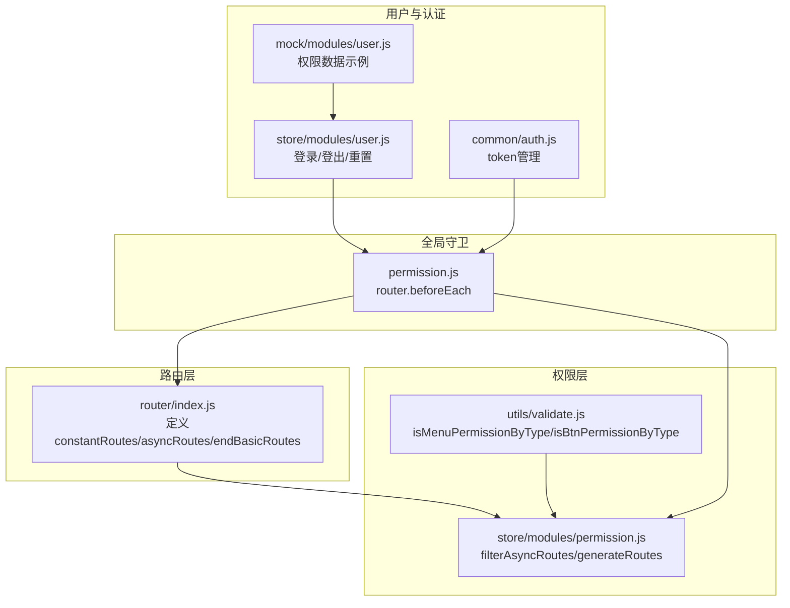
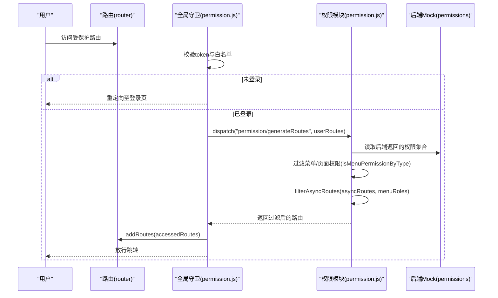
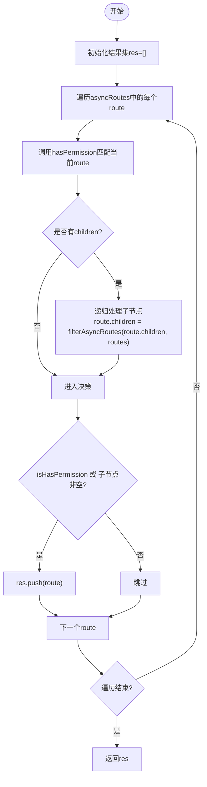
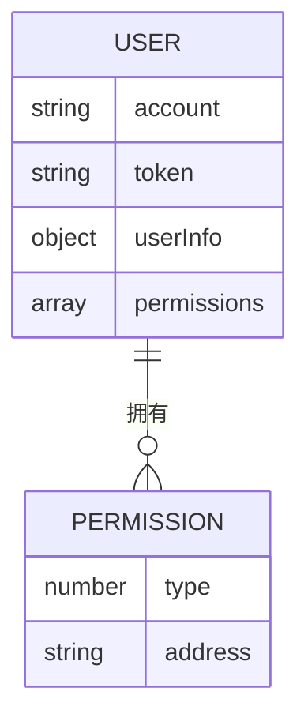
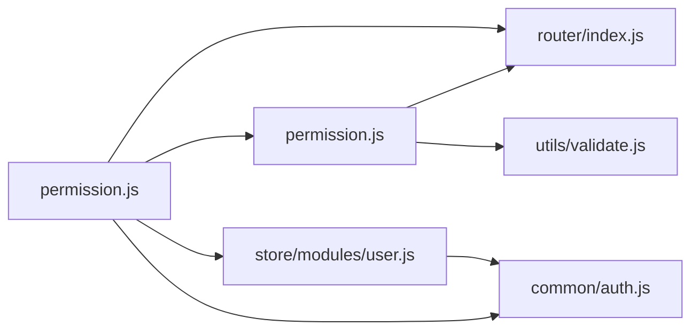

# 路由过滤算法

<cite>
**本文引用的文件**
- [router/index.js](file://src/router/index.js)
- [store/modules/permission.js](file://src/store/modules/permission.js)
- [permission.js](file://src/permission.js)
- [utils/validate.js](file://src/utils/validate.js)
- [store/modules/user.js](file://src/store/modules/user.js)
- [mock/modules/user.js](file://src/mock/modules/user.js)
- [common/auth.js](file://src/common/auth.js)
</cite>

## 目录
1. [简介](#简介)
2. [项目结构](#项目结构)
3. [核心组件](#核心组件)
4. [架构总览](#架构总览)
5. [详细组件分析](#详细组件分析)
6. [依赖关系分析](#依赖关系分析)
7. [性能考量](#性能考量)
8. [故障排查指南](#故障排查指南)
9. [结论](#结论)
10. [附录](#附录)

## 简介
本文件围绕 Vue CMS 的动态路由过滤算法进行系统化技术文档编写，重点解析以下内容：
- 如何基于用户权限筛选动态路由（asyncRoutes）
- 路由权限匹配的判断逻辑（后端返回的权限与前端路由 meta 的对应关系）
- 路由过滤过程中的递归处理与层级结构保持机制
- 性能优化策略与大数据量场景下的处理方案
- 调试方法与常见问题解决方案
- 不同权限级别用户的路由生成效果对比

## 项目结构
本项目采用典型的前端单页应用分层组织方式：
- 路由定义与常量路由：位于路由模块，包含基础路由、动态路由与末尾路由
- 权限模块：负责根据后端返回的权限集合过滤前端动态路由，并生成最终可挂载的路由表
- 全局守卫：在路由跳转前进行鉴权与动态路由注入
- 工具模块：提供权限类型判断与工具函数
- Mock 数据：用于演示不同用户权限下的路由差异

**图表来源**
- [router/index.js:1-343](file://src/router/index.js#L1-L343)
- [store/modules/permission.js:1-187](file://src/store/modules/permission.js#L1-L187)
- [utils/validate.js:1-56](file://src/utils/validate.js#L1-L56)
- [permission.js:1-98](file://src/permission.js#L1-L98)
- [store/modules/user.js:1-154](file://src/store/modules/user.js#L1-L154)
- [common/auth.js:1-18](file://src/common/auth.js#L1-L18)
- [mock/modules/user.js:1-204](file://src/mock/modules/user.js#L1-L204)

**章节来源**
- [router/index.js:1-343](file://src/router/index.js#L1-L343)
- [store/modules/permission.js:1-187](file://src/store/modules/permission.js#L1-L187)
- [permission.js:1-98](file://src/permission.js#L1-L98)
- [utils/validate.js:1-56](file://src/utils/validate.js#L1-L56)
- [store/modules/user.js:1-154](file://src/store/modules/user.js#L1-L154)
- [common/auth.js:1-18](file://src/common/auth.js#L1-L18)
- [mock/modules/user.js:1-204](file://src/mock/modules/user.js#L1-L204)

## 核心组件
- 路由表定义：包含基础路由、动态路由与末尾路由三部分，分别对应无需权限、按权限动态注入、以及兜底错误页
- 权限过滤器：根据后端返回的权限集合，递归筛选前端动态路由，保留父子关系
- 全局守卫：在路由跳转前判断登录态与动态路由注入时机
- 权限类型判断：区分菜单、页面与按钮权限，仅菜单/页面参与路由过滤
- 用户与认证：登录成功后保存权限与用户信息，登出时清理并重置路由

**章节来源**
- [router/index.js:38-320](file://src/router/index.js#L38-L320)
- [store/modules/permission.js:22-54](file://src/store/modules/permission.js#L22-L54)
- [permission.js:23-91](file://src/permission.js#L23-L91)
- [utils/validate.js:43-55](file://src/utils/validate.js#L43-L55)
- [store/modules/user.js:54-145](file://src/store/modules/user.js#L54-L145)

## 架构总览
下图展示了从登录到动态路由注入的关键流程，以及权限过滤算法在其中的位置。

**图表来源**
- [permission.js:23-91](file://src/permission.js#L23-L91)
- [store/modules/permission.js:147-178](file://src/store/modules/permission.js#L147-L178)
- [utils/validate.js:43-55](file://src/utils/validate.js#L43-L55)
- [mock/modules/user.js:28-141](file://src/mock/modules/user.js#L28-L141)

## 详细组件分析

### 路由表结构与权限字段映射
- 基础路由（constantRoutes）：无需权限即可访问
- 动态路由（asyncRoutes）：按用户权限动态注入
- 末尾路由（endBasicRoutes）：始终追加到最终路由表末尾，用于兜底错误页
- 路由元信息（meta）：包含图标、标题等前端展示字段，不影响权限过滤逻辑

**章节来源**
- [router/index.js:43-111](file://src/router/index.js#L43-L111)
- [router/index.js:118-320](file://src/router/index.js#L118-L320)

### 权限类型与匹配规则
- 后端返回的权限项包含 type 与 address 字段：
  - type=1 表示菜单权限
  - type=2 表示页面权限
  - type=3 表示按钮权限
- 前端仅将 type=1/2 的权限用于路由过滤，type=3 的权限用于按钮级权限控制
- 匹配规则：后端 address 必须存在，且与前端路由的 path 完全相等

**章节来源**
- [utils/validate.js:25-55](file://src/utils/validate.js#L25-L55)
- [store/modules/permission.js:22-32](file://src/store/modules/permission.js#L22-L32)
- [mock/modules/user.js:28-141](file://src/mock/modules/user.js#L28-L141)

### 权限过滤算法（递归与层级保持）
- hasPermission：对后端权限集合进行过滤，仅保留具有 address 的项，并与当前路由 path 进行严格相等匹配
- filterAsyncRoutes：递归遍历前端动态路由树，对每个节点执行权限匹配；若节点存在子节点，先递归处理子节点，再决定是否保留该节点
- 层级保持：通过递归处理子节点，确保父子关系在过滤后仍得以维持

**图表来源**
- [store/modules/permission.js:41-54](file://src/store/modules/permission.js#L41-L54)
- [store/modules/permission.js:22-32](file://src/store/modules/permission.js#L22-L32)

**章节来源**
- [store/modules/permission.js:22-54](file://src/store/modules/permission.js#L22-L54)

### 全局守卫与动态路由注入
- 在路由跳转前，根据 token 判断登录态
- 若动态路由尚未注入，尝试从 sessionStorage 中恢复用户路由权限，再调用 generateRoutes 进行过滤
- 注入完成后，使用 replace 策略避免历史记录冗余

**章节来源**
- [permission.js:23-91](file://src/permission.js#L23-L91)
- [store/modules/permission.js:147-178](file://src/store/modules/permission.js#L147-L178)

### 用户权限数据与效果对比
- Mock 数据中定义了两类用户：admin 与 lucy
- admin 拥有较全面的菜单/页面权限，可看到更多路由
- lucy 仅拥有部分菜单/页面权限，过滤后可见路由较少

**图表来源**
- [mock/modules/user.js:15-141](file://src/mock/modules/user.js#L15-L141)

**章节来源**
- [mock/modules/user.js:15-141](file://src/mock/modules/user.js#L15-L141)

## 依赖关系分析
- 权限模块依赖：
  - 路由模块：导入 constantRoutes、asyncRoutes、endBasicRoutes
  - 工具模块：使用 isMenuPermissionByType/isBtnPermissionByType 判断权限类型
- 全局守卫依赖：
  - 权限模块：调用 generateRoutes 生成路由
  - 路由模块：addRoutes 注入路由
  - 用户模块：登出时重置 token 与路由
  - 认证模块：获取/移除 token

**图表来源**
- [store/modules/permission.js:4-5](file://src/store/modules/permission.js#L4-L5)
- [utils/validate.js:5](file://src/utils/validate.js#L5)
- [permission.js:5-6](file://src/permission.js#L5-L6)
- [store/modules/user.js:2-4](file://src/store/modules/user.js#L2-L4)
- [common/auth.js:1-2](file://src/common/auth.js#L1-L2)

**章节来源**
- [store/modules/permission.js:4-5](file://src/store/modules/permission.js#L4-L5)
- [utils/validate.js:5](file://src/utils/validate.js#L5)
- [permission.js:5-6](file://src/permission.js#L5-L6)
- [store/modules/user.js:2-4](file://src/store/modules/user.js#L2-L4)
- [common/auth.js:1-2](file://src/common/auth.js#L1-L2)

## 性能考量
- 时间复杂度
  - hasPermission 对后端权限集合进行过滤与匹配，时间复杂度 O(n)，n 为后端权限项数
  - filterAsyncRoutes 递归遍历前端动态路由树，时间复杂度 O(m)，m 为动态路由节点总数
  - 整体复杂度 O(n + m)
- 空间复杂度
  - 递归深度取决于路由树的最大层级，空间复杂度 O(h)，h 为最大层级
- 优化建议
  - 预处理后端权限集合：在生成路由前对后端权限按 address 建立哈希索引，将匹配从 O(n) 降为 O(1)
  - 路由树预处理：对前端 asyncRoutes 按 path 建立映射，减少重复查找
  - 分批注入：对于超大路由树，可考虑分批注入并配合骨架屏提升用户体验
  - 缓存策略：将过滤结果与最终路由表缓存至 sessionStorage，避免重复计算
  - 并发优化：在多用户切换场景下，避免重复触发 generateRoutes

[本节为通用性能讨论，不直接分析具体文件]

## 故障排查指南
- 症状：动态路由未生效或为空
  - 检查后端返回的权限集合是否包含 address 字段
  - 确认 type 是否为 1 或 2（菜单/页面）
  - 核对前端路由 path 与后端 address 是否完全一致
- 症状：子路由被错误过滤
  - 确认 hasPermission 使用严格相等匹配，而非包含匹配
  - 检查 filterAsyncRoutes 的递归顺序：先处理子节点，再决定父节点是否保留
- 症状：登录后仍提示无权限
  - 检查全局守卫是否正确调用 generateRoutes
  - 确认 addRoutes 成功注入
  - 查看 sessionStorage 中 userRoutes 是否存在
- 症状：路由重复或历史记录异常
  - 确认使用 replace 策略跳转
- 症状：登出后路由未重置
  - 检查 resetToken 是否调用 resetRouter

**章节来源**
- [store/modules/permission.js:22-32](file://src/store/modules/permission.js#L22-L32)
- [store/modules/permission.js:41-54](file://src/store/modules/permission.js#L41-L54)
- [permission.js:50-74](file://src/permission.js#L50-L74)
- [store/modules/user.js:136-145](file://src/store/modules/user.js#L136-L145)

## 结论
本项目的动态路由过滤算法以“严格相等匹配 + 递归保留父子关系”为核心，结合权限类型过滤与全局守卫注入，实现了灵活可控的权限路由体系。通过预处理与缓存策略，可在保证正确性的前提下进一步提升性能，满足大规模路由场景的需求。

[本节为总结性内容，不直接分析具体文件]

## 附录

### 不同权限级别用户的路由生成效果对比
- admin 用户
  - 可见路由范围广，包含多个一级/二级/三级菜单
  - 过滤后路由数量较多，菜单层级丰富
- lucy 用户
  - 可见路由范围有限，主要集中在特定模块
  - 过滤后路由数量较少，菜单层级相对简单

**章节来源**
- [mock/modules/user.js:15-141](file://src/mock/modules/user.js#L15-L141)
- [store/modules/permission.js:147-178](file://src/store/modules/permission.js#L147-L178)