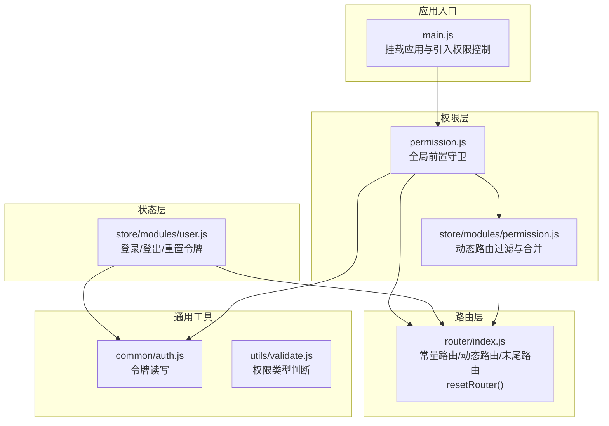
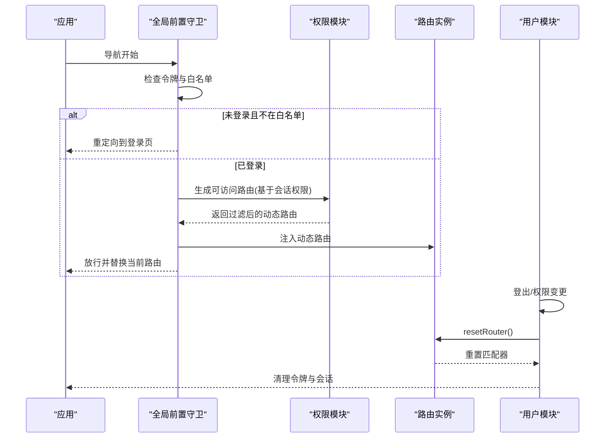
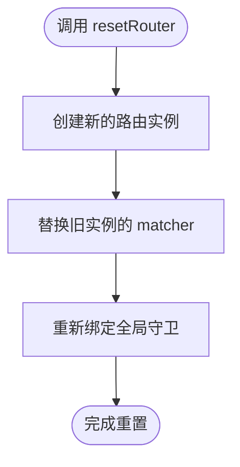
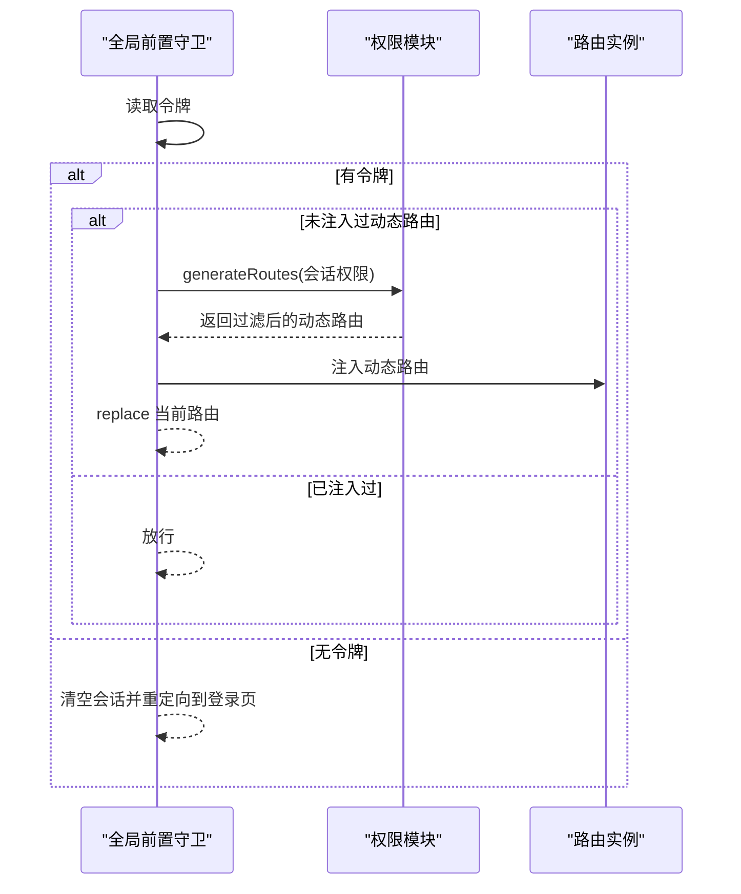
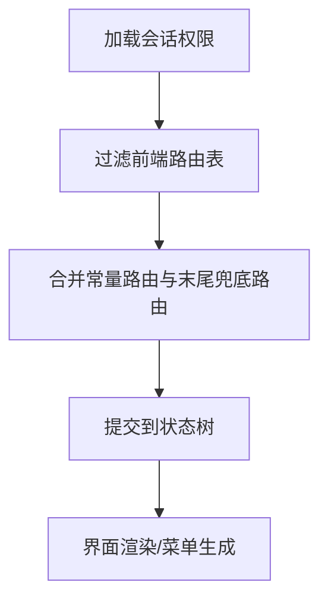
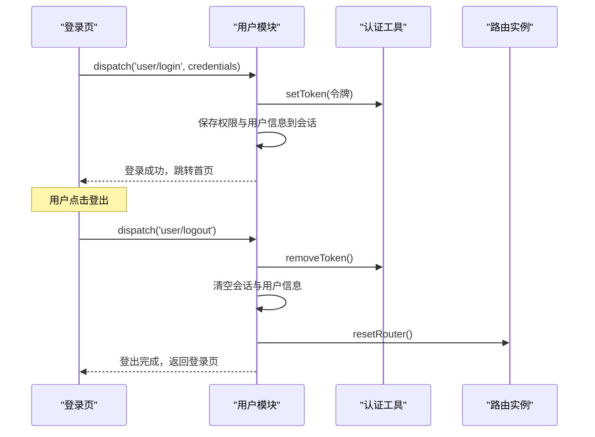
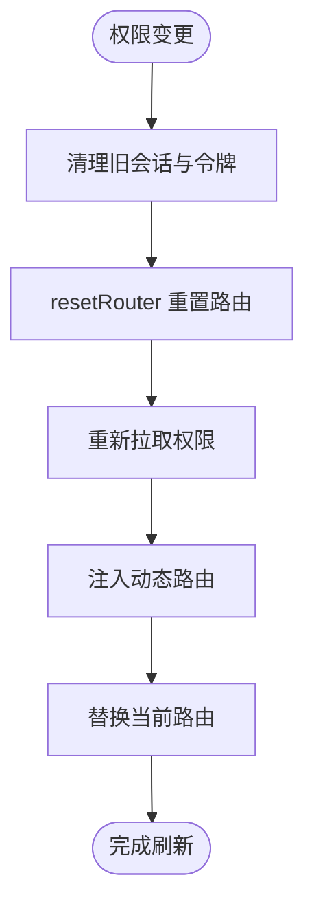
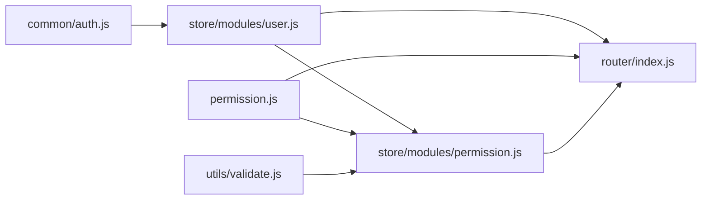

# 路由重置与刷新

<cite>
**本文引用的文件列表**
- [router/index.js](file://src/router/index.js)
- [permission.js](file://src/permission.js)
- [store/modules/permission.js](file://src/store/modules/permission.js)
- [store/modules/user.js](file://src/store/modules/user.js)
- [common/auth.js](file://src/common/auth.js)
- [main.js](file://src/main.js)
- [api/login.js](file://src/api/login.js)
- [views/login/index.vue](file://src/views/login/index.vue)
- [utils/validate.js](file://src/utils/validate.js)
</cite>

## 目录
1. [简介](#简介)
2. [项目结构](#项目结构)
3. [核心组件](#核心组件)
4. [架构总览](#架构总览)
5. [详细组件分析](#详细组件分析)
6. [依赖关系分析](#依赖关系分析)
7. [性能考量](#性能考量)
8. [故障排查指南](#故障排查指南)
9. [结论](#结论)
10. [附录](#附录)

## 简介
本文件聚焦于 Vue CMS 的“动态路由重置与刷新”机制，围绕 resetRouter 函数的工作原理、使用场景、与全局守卫的关系、权限变更后的刷新流程、登出时的应用以及最佳实践与性能优化展开。目标是帮助开发者在复杂权限体系下，安全、可控地重置路由并保证用户体验与稳定性。

## 项目结构
本项目采用典型的 Vue 单页应用分层组织：
- 路由层：定义基础路由、动态路由与末尾兜底路由，并提供 resetRouter 以重置路由匹配器。
- 权限层：通过全局前置守卫在导航时按需注入动态路由，结合 Vuex 权限模块进行过滤与合并。
- 状态层：用户模块负责登录、登出、令牌与会话清理，并在必要时触发 resetRouter。
- 视图层：登录页等视图与业务页面，配合权限控制与路由守卫。

**图表来源**
- [main.js:25](file://src/main.js#L25)
- [router/index.js:322-340](file://src/router/index.js#L322-L340)
- [permission.js:22-91](file://src/permission.js#L22-L91)
- [store/modules/permission.js:147-177](file://src/store/modules/permission.js#L147-L177)
- [store/modules/user.js:90-145](file://src/store/modules/user.js#L90-L145)
- [common/auth.js:1-18](file://src/common/auth.js#L1-L18)
- [utils/validate.js:25-55](file://src/utils/validate.js#L25-L55)

**章节来源**
- [main.js:25](file://src/main.js#L25)
- [router/index.js:322-340](file://src/router/index.js#L322-L340)
- [permission.js:22-91](file://src/permission.js#L22-L91)
- [store/modules/permission.js:147-177](file://src/store/modules/permission.js#L147-L177)
- [store/modules/user.js:90-145](file://src/store/modules/user.js#L90-L145)
- [common/auth.js:1-18](file://src/common/auth.js#L1-L18)
- [utils/validate.js:25-55](file://src/utils/validate.js#L25-L55)

## 核心组件
- resetRouter：重置路由匹配器，避免重复注入导致的路由冗余。
- 全局前置守卫：在导航时根据令牌与会话状态决定是否注入动态路由。
- 权限模块：基于后端返回的权限集合，过滤前端路由表并合并至最终路由。
- 用户模块：登录成功后保存权限与用户信息，登出时清理令牌与会话并触发 resetRouter。
- 认证工具：统一读写 Cookie 中的令牌。

**章节来源**
- [router/index.js:332-340](file://src/router/index.js#L332-L340)
- [permission.js:22-91](file://src/permission.js#L22-L91)
- [store/modules/permission.js:147-177](file://src/store/modules/permission.js#L147-L177)
- [store/modules/user.js:90-145](file://src/store/modules/user.js#L90-L145)
- [common/auth.js:1-18](file://src/common/auth.js#L1-L18)

## 架构总览
路由重置与刷新的关键流程如下：
- 应用启动时注册全局前置守卫，拦截所有导航。
- 登录成功后，将用户权限与用户信息写入会话，注入动态路由。
- 权限变更或登出时，调用 resetRouter 清理旧路由，确保后续导航不再包含旧权限。
- 重新登录时，再次按权限注入动态路由并替换历史记录，避免重复历史栈。

**图表来源**
- [permission.js:22-91](file://src/permission.js#L22-L91)
- [store/modules/permission.js:147-177](file://src/store/modules/permission.js#L147-L177)
- [router/index.js:332-340](file://src/router/index.js#L332-L340)
- [store/modules/user.js:90-145](file://src/store/modules/user.js#L90-L145)

## 详细组件分析

### resetRouter 工作原理与使用场景
- 工作原理
  - resetRouter 通过重新创建一个路由实例，并将旧实例的 matcher 替换为新实例的 matcher，从而清空旧路由注入的历史。
  - 该方法还包含“重新添加全局守卫”的注释，强调在重置后需要重新绑定守卫逻辑，以确保导航控制不受影响。
- 使用场景
  - 登出时：清理令牌与会话后，调用 resetRouter，防止下次进入受保护页面时仍能命中旧动态路由。
  - 权限变更后：当用户角色或权限集发生变化，需要完全刷新路由表，避免旧权限残留。
  - 应用初始化异常恢复：在极端情况下，需要彻底重置路由匹配器以修复导航问题。

**图表来源**
- [router/index.js:332-340](file://src/router/index.js#L332-L340)

**章节来源**
- [router/index.js:332-340](file://src/router/index.js#L332-L340)

### 全局守卫与路由注入流程
- 导航前检查
  - 获取令牌，若存在则视为已登录；否则进入白名单判断与重定向。
- 动态路由注入
  - 若当前未注入过动态路由，从会话加载权限，调用权限模块生成可访问路由，再注入到路由实例。
  - 使用“替换当前路由”的方式避免历史栈累积。
- 错误处理
  - 注入失败或会话缺失时，重置令牌并引导至登录页。

**图表来源**
- [permission.js:22-91](file://src/permission.js#L22-L91)
- [store/modules/permission.js:147-177](file://src/store/modules/permission.js#L147-L177)

**章节来源**
- [permission.js:22-91](file://src/permission.js#L22-L91)
- [store/modules/permission.js:147-177](file://src/store/modules/permission.js#L147-L177)

### 权限模块：动态路由过滤与合并
- 过滤逻辑
  - 基于后端返回的权限集合，筛选前端路由表中匹配的菜单与页面路由。
  - 通过工具函数判断权限类型（菜单/页面/按钮），分别提取按钮权限与路由权限。
- 合并与提交
  - 将过滤结果与常量路由合并，并追加末尾兜底路由，提交到状态树供界面渲染与菜单展示。

**图表来源**
- [store/modules/permission.js:147-177](file://src/store/modules/permission.js#L147-L177)
- [utils/validate.js:25-55](file://src/utils/validate.js#L25-L55)

**章节来源**
- [store/modules/permission.js:147-177](file://src/store/modules/permission.js#L147-L177)
- [utils/validate.js:25-55](file://src/utils/validate.js#L25-L55)

### 登录与登出：令牌、会话与路由重置
- 登录
  - 调用登录接口，成功后写入令牌与用户权限、用户信息到会话，随后导航到首页。
- 登出
  - 调用登出接口，移除令牌，清空用户信息与会话，调用 resetRouter 重置路由，最后返回登录页。

**图表来源**
- [views/login/index.vue:118-149](file://src/views/login/index.vue#L118-L149)
- [store/modules/user.js:90-145](file://src/store/modules/user.js#L90-L145)
- [common/auth.js:1-18](file://src/common/auth.js#L1-L18)
- [router/index.js:332-340](file://src/router/index.js#L332-L340)

**章节来源**
- [views/login/index.vue:118-149](file://src/views/login/index.vue#L118-L149)
- [store/modules/user.js:90-145](file://src/store/modules/user.js#L90-L145)
- [common/auth.js:1-18](file://src/common/auth.js#L1-L18)
- [router/index.js:332-340](file://src/router/index.js#L332-L340)

### 权限变更后的路由刷新流程
- 触发点
  - 用户角色或权限集发生变更（例如后台修改用户权限）。
- 流程
  - 清理旧会话权限与用户信息。
  - 调用 resetRouter 重置路由匹配器。
  - 重新拉取最新权限并注入动态路由。
  - 替换当前路由，避免历史栈污染。

**图表来源**
- [store/modules/user.js:135-145](file://src/store/modules/user.js#L135-L145)
- [router/index.js:332-340](file://src/router/index.js#L332-L340)
- [permission.js:22-91](file://src/permission.js#L22-L91)

**章节来源**
- [store/modules/user.js:135-145](file://src/store/modules/user.js#L135-L145)
- [router/index.js:332-340](file://src/router/index.js#L332-L340)
- [permission.js:22-91](file://src/permission.js#L22-L91)

## 依赖关系分析
- 路由层依赖
  - 常量路由与动态路由定义于路由文件，resetRouter 通过替换 matcher 实现重置。
- 权限层依赖
  - 全局守卫依赖令牌读取与会话清理，依赖权限模块生成可访问路由。
- 状态层依赖
  - 用户模块依赖认证工具与路由重置，依赖权限模块生成最终路由。
- 工具层依赖
  - 权限类型判断用于区分菜单、页面与按钮权限。

**图表来源**
- [common/auth.js:1-18](file://src/common/auth.js#L1-L18)
- [store/modules/user.js:90-145](file://src/store/modules/user.js#L90-L145)
- [router/index.js:322-340](file://src/router/index.js#L322-L340)
- [store/modules/permission.js:147-177](file://src/store/modules/permission.js#L147-L177)
- [permission.js:22-91](file://src/permission.js#L22-L91)
- [utils/validate.js:25-55](file://src/utils/validate.js#L25-L55)

**章节来源**
- [common/auth.js:1-18](file://src/common/auth.js#L1-L18)
- [store/modules/user.js:90-145](file://src/store/modules/user.js#L90-L145)
- [router/index.js:322-340](file://src/router/index.js#L322-L340)
- [store/modules/permission.js:147-177](file://src/store/modules/permission.js#L147-L177)
- [permission.js:22-91](file://src/permission.js#L22-L91)
- [utils/validate.js:25-55](file://src/utils/validate.js#L25-L55)

## 性能考量
- 路由注入成本
  - 动态路由注入发生在导航阶段，应尽量减少不必要的重复注入，避免历史栈膨胀。
- 令牌与会话
  - 登出与权限变更时及时清理会话与令牌，降低后续守卫判断开销。
- 重置时机
  - 仅在必要时调用 resetRouter，避免频繁重置带来的匹配器重建成本。
- UI 体验
  - 导航时使用进度条与替换当前路由，减少用户感知的“重复历史”。

[本节为通用性能建议，不直接分析特定文件]

## 故障排查指南
- 症状：登出后仍可访问旧权限页面
  - 检查是否调用了 resetRouter；确认全局守卫已重新绑定。
- 症状：权限变更后页面未刷新
  - 检查是否清理了会话权限与令牌；确认重新注入了动态路由并替换当前路由。
- 症状：导航卡顿或历史栈异常
  - 检查是否存在重复注入；确认使用“替换当前路由”而非“新增历史记录”。

**章节来源**
- [store/modules/user.js:90-145](file://src/store/modules/user.js#L90-L145)
- [router/index.js:332-340](file://src/router/index.js#L332-L340)
- [permission.js:22-91](file://src/permission.js#L22-L91)

## 结论
resetRouter 是实现“动态路由重置与刷新”的关键手段。通过在登出与权限变更场景下调用 resetRouter，并配合全局守卫与权限模块的协同工作，可以确保路由系统始终与用户权限保持一致，同时维持良好的用户体验与系统稳定性。

## 附录
- 最佳实践
  - 登出与权限变更时务必调用 resetRouter 并清理会话与令牌。
  - 在全局守卫中仅在必要时注入动态路由，避免重复注入。
  - 使用“替换当前路由”策略，减少历史栈污染。
- 用户体验优化
  - 导航时启用进度条，提供明确反馈。
  - 登出后自动清理所有会话数据，避免残留状态。
- 错误处理策略
  - 注入失败或会话缺失时，统一重置令牌并引导至登录页。

[本节为通用建议，不直接分析特定文件]