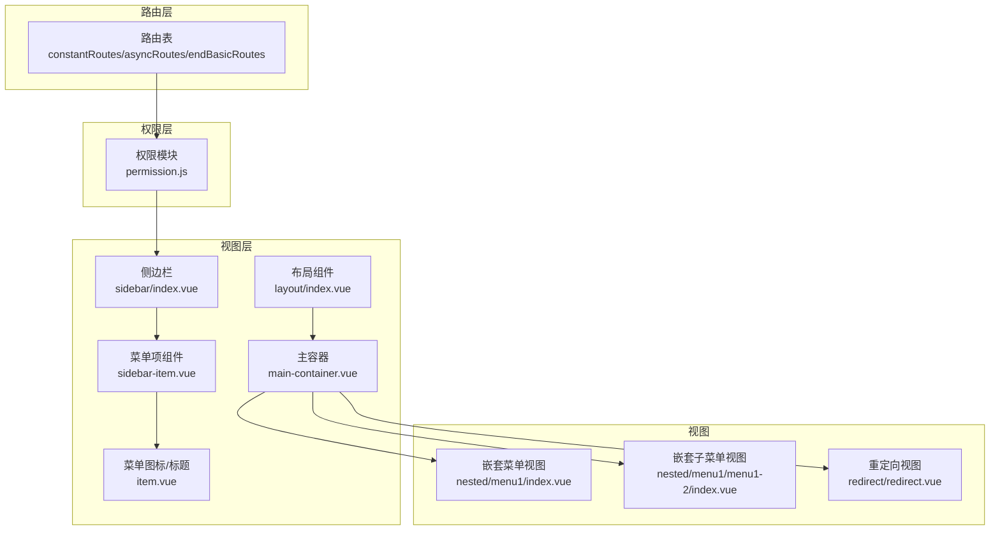
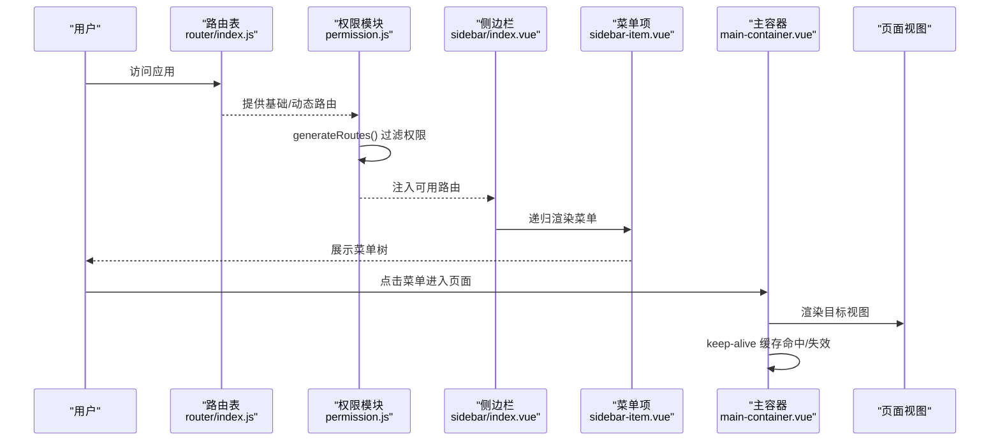
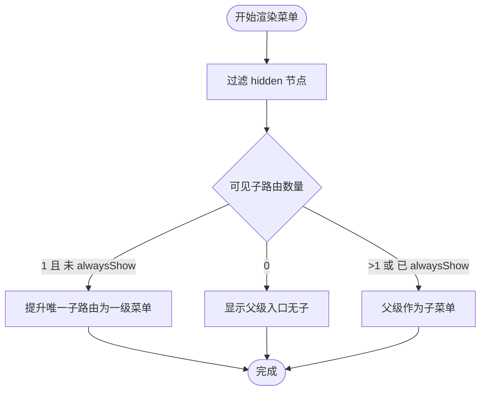
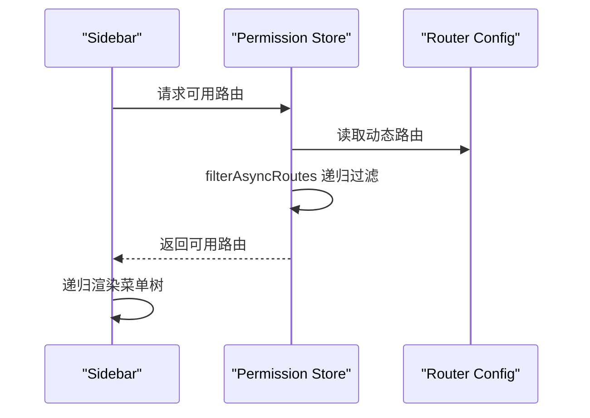
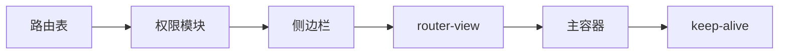

# 嵌套路由

<cite>
**本文引用的文件**
- [src/router/index.js](file://src/router/index.js)
- [src/layout/sidebar/index.vue](file://src/layout/sidebar/index.vue)
- [src/layout/sidebar/sidebar-item.vue](file://src/layout/sidebar/sidebar-item.vue)
- [src/layout/sidebar/item.vue](file://src/layout/sidebar/item.vue)
- [src/store/modules/permission.js](file://src/store/modules/permission.js)
- [src/layout/main-container.vue](file://src/layout/main-container.vue)
- [src/store/modules/tabsview.js](file://src/store/modules/tabsview.js)
- [src/views/nested/menu1/index.vue](file://src/views/nested/menu1/index.vue)
- [src/views/nested/menu1/menu1-2/index.vue](file://src/views/nested/menu1/menu1-2/index.vue)
- [src/views/redirect/redirect.vue](file://src/views/redirect/redirect.vue)
</cite>

## 目录
1. [引言](#引言)
2. [项目结构](#项目结构)
3. [核心组件](#核心组件)
4. [架构总览](#架构总览)
5. [详细组件分析](#详细组件分析)
6. [依赖关系分析](#依赖关系分析)
7. [性能考量](#性能考量)
8. [故障排查指南](#故障排查指南)
9. [结论](#结论)
10. [附录](#附录)

## 引言
本文件围绕 Vue CMS 的嵌套路由系统进行全面说明，涵盖父子路由关系与层级结构、alwaysShow 对菜单显示的影响、嵌套路由在侧边栏菜单生成中的作用、路径配置规则（相对/绝对）、动态菜单生成机制、复杂嵌套场景处理与最佳实践，以及与 keep-alive 缓存的协同。

## 项目结构
本项目采用“路由驱动菜单”的架构：路由表定义页面层级与权限，菜单通过递归渲染生成。侧边栏根据当前用户权限过滤后的路由集合生成菜单树，主容器负责页面切换与缓存控制。

**图表来源**
- [src/router/index.js:43-320](file://src/router/index.js#L43-L320)
- [src/store/modules/permission.js:147-178](file://src/store/modules/permission.js#L147-L178)
- [src/layout/index.vue:1-32](file://src/layout/index.vue#L1-L32)
- [src/layout/main-container.vue:1-13](file://src/layout/main-container.vue#L1-L13)
- [src/layout/sidebar/index.vue:1-16](file://src/layout/sidebar/index.vue#L1-L16)
- [src/layout/sidebar/sidebar-item.vue:1-36](file://src/layout/sidebar/sidebar-item.vue#L1-L36)
- [src/layout/sidebar/item.vue:1-48](file://src/layout/sidebar/item.vue#L1-L48)
- [src/views/nested/menu1/index.vue:1-6](file://src/views/nested/menu1/index.vue#L1-L6)
- [src/views/nested/menu1/menu1-2/index.vue:1-6](file://src/views/nested/menu1/menu1-2/index.vue#L1-L6)
- [src/views/redirect/redirect.vue:1-12](file://src/views/redirect/redirect.vue#L1-L12)

**章节来源**
- [src/router/index.js:43-320](file://src/router/index.js#L43-L320)
- [src/layout/sidebar/index.vue:1-16](file://src/layout/sidebar/index.vue#L1-L16)
- [src/layout/main-container.vue:1-13](file://src/layout/main-container.vue#L1-L13)

## 核心组件
- 路由表与配置
  - 基础路由 constantRoutes：登录、首页、重定向等无需权限页面
  - 动态路由 asyncRoutes：按用户权限动态注入的菜单路由
  - 末尾路由 endBasicRoutes：404、无权限、通配符兜底
  - 路由属性要点：path 必须为完整路径；alwaysShow 控制根菜单显示；hidden 控制菜单隐藏；meta.icon/title 控制菜单图标与标题；isKeepAlive/noCache 控制缓存策略
- 权限模块
  - generateRoutes：根据后端返回的菜单权限过滤前端路由，拼接末尾路由，写入状态
  - filterAsyncRoutes：递归过滤子路由，保留有权限或存在有效子路由的节点
- 侧边栏菜单
  - sidebar/index.vue：遍历当前可用路由生成 el-menu
  - sidebar-item.vue：递归渲染菜单项，处理单子路由提升、alwaysShow 判断、父子路径解析
  - item.vue：菜单图标与标题渲染，支持国际化
- 主容器与缓存
  - main-container.vue：包裹 router-view 并通过 keep-alive 缓存页面
  - tabsview.js：维护已访问的标签页列表（用于标签页导航）

**章节来源**
- [src/router/index.js:14-36](file://src/router/index.js#L14-L36)
- [src/router/index.js:43-320](file://src/router/index.js#L43-L320)
- [src/store/modules/permission.js:147-178](file://src/store/modules/permission.js#L147-L178)
- [src/layout/sidebar/index.vue:1-16](file://src/layout/sidebar/index.vue#L1-L16)
- [src/layout/sidebar/sidebar-item.vue:1-36](file://src/layout/sidebar/sidebar-item.vue#L1-L36)
- [src/layout/sidebar/item.vue:1-48](file://src/layout/sidebar/item.vue#L1-L48)
- [src/layout/main-container.vue:1-13](file://src/layout/main-container.vue#L1-L13)
- [src/store/modules/tabsview.js:1-49](file://src/store/modules/tabsview.js#L1-L49)

## 架构总览
下图展示了从路由配置到菜单渲染再到页面缓存的整体流程。

**图表来源**
- [src/router/index.js:43-320](file://src/router/index.js#L43-L320)
- [src/store/modules/permission.js:147-178](file://src/store/modules/permission.js#L147-L178)
- [src/layout/sidebar/index.vue:1-16](file://src/layout/sidebar/index.vue#L1-L16)
- [src/layout/sidebar/sidebar-item.vue:1-36](file://src/layout/sidebar/sidebar-item.vue#L1-L36)
- [src/layout/main-container.vue:1-13](file://src/layout/main-container.vue#L1-L13)

## 详细组件分析

### 路由表与嵌套层级
- 路由层级
  - 根布局 MainLayout 下挂载多级 children，形成父子关系
  - 子路由可再次包含 children，支持任意深度嵌套
- 路径规则
  - 所有路由 path 必须为完整路径（含前缀斜杠），便于统一解析与匹配
- alwaysShow 语义
  - 若未设置 alwaysShow，且仅有一个可见子路由，则将其提升到父级作为一级菜单项
  - 若设置 alwaysShow，则始终显示父级菜单入口，不进行提升
- 示例参考
  - 嵌套菜单示例：/nested -> /nested/menu1 -> /nested/menu1/menu1-1 与 /nested/menu1/menu1-2（其中 menu1-2 显式设置 alwaysShow）
  - 多级子菜单：/excel、/futures、/echarts 等均配置了多个子项

**章节来源**
- [src/router/index.js:14-36](file://src/router/index.js#L14-L36)
- [src/router/index.js:226-268](file://src/router/index.js#L226-L268)
- [src/views/nested/menu1/index.vue:1-6](file://src/views/nested/menu1/index.vue#L1-L6)
- [src/views/nested/menu1/menu1-2/index.vue:1-6](file://src/views/nested/menu1/menu1-2/index.vue#L1-L6)

### 侧边栏菜单生成与嵌套模式判断
- 单子路由提升逻辑
  - 当父级仅有一个可见子路由且未设置 alwaysShow 时，将该子路由直接作为一级菜单项显示，父级入口不展示
  - 若父级无可见子路由，也会视为“提升”到父级入口
- 嵌套模式
  - 当父级存在多个可见子路由或显式设置 alwaysShow 时，父级以可折叠子菜单形式出现，子项逐级展开
- 路径解析
  - resolvePath 返回完整路径，确保父子路由跳转正确
- 图标与标题
  - 菜单项图标与标题来自父级或子级 meta 字段，提升时使用子级 meta

**图表来源**
- [src/layout/sidebar/sidebar-item.vue:64-94](file://src/layout/sidebar/sidebar-item.vue#L64-L94)
- [src/layout/sidebar/sidebar-item.vue:95-99](file://src/layout/sidebar/sidebar-item.vue#L95-L99)

**章节来源**
- [src/layout/sidebar/sidebar-item.vue:1-36](file://src/layout/sidebar/sidebar-item.vue#L1-L36)
- [src/layout/sidebar/sidebar-item.vue:64-94](file://src/layout/sidebar/sidebar-item.vue#L64-L94)
- [src/layout/sidebar/sidebar-item.vue:95-99](file://src/layout/sidebar/sidebar-item.vue#L95-L99)
- [src/layout/sidebar/item.vue:1-48](file://src/layout/sidebar/item.vue#L1-L48)

### 动态菜单生成机制
- 权限过滤
  - generateRoutes：提取菜单类型权限，过滤前端动态路由，保留有权限或存在有效子路由的节点
  - 过滤后追加末尾路由（404、无权限、通配符）
- 路由注入
  - 将过滤后的路由与基础路由合并，写入状态，供侧边栏渲染
- 菜单渲染
  - 侧边栏组件遍历可用路由，递归调用菜单项组件，构建菜单树

**图表来源**
- [src/store/modules/permission.js:147-178](file://src/store/modules/permission.js#L147-L178)
- [src/store/modules/permission.js:41-54](file://src/store/modules/permission.js#L41-L54)
- [src/layout/sidebar/index.vue:1-16](file://src/layout/sidebar/index.vue#L1-L16)

**章节来源**
- [src/store/modules/permission.js:147-178](file://src/store/modules/permission.js#L147-L178)
- [src/store/modules/permission.js:41-54](file://src/store/modules/permission.js#L41-L54)
- [src/layout/sidebar/index.vue:1-16](file://src/layout/sidebar/index.vue#L1-L16)

### 路由嵌套与页面渲染
- 嵌套视图
  - 父级路由视图通过 router-view 嵌套子路由视图，实现多级页面联动
  - 示例：/nested/menu1 与 /nested/menu1/menu1-2 的视图均包含 router-view
- 重定向
  - 重定向视图根据参数将路由替换到目标路径，保证刷新与直连访问的正确性

**章节来源**
- [src/views/nested/menu1/index.vue:1-6](file://src/views/nested/menu1/index.vue#L1-L6)
- [src/views/nested/menu1/menu1-2/index.vue:1-6](file://src/views/nested/menu1/menu1-2/index.vue#L1-L6)
- [src/views/redirect/redirect.vue:1-12](file://src/views/redirect/redirect.vue#L1-L12)

### 与 keep-alive 缓存的配合
- 缓存范围
  - main-container.vue 中的 keep-alive 通过 include 控制缓存的组件名
  - tabsview.js 维护访问过的标签页，可作为缓存策略的输入
- 缓存策略建议
  - 对频繁切换的页面启用缓存，避免重复请求与计算
  - 对需要强制刷新的页面可通过 key 或路由元信息控制不缓存
- 注意事项
  - 缓存命中时组件生命周期钩子不会重复触发，需在 activated 中处理副作用
  - 大量缓存可能增加内存占用，应结合业务场景合理配置

**章节来源**
- [src/layout/main-container.vue:1-13](file://src/layout/main-container.vue#L1-L13)
- [src/store/modules/tabsview.js:1-49](file://src/store/modules/tabsview.js#L1-L49)

## 依赖关系分析
- 路由到权限
  - 路由表提供结构，权限模块基于后端返回的地址进行匹配与过滤
- 权限到菜单
  - 权限模块输出可用路由，侧边栏组件据此渲染菜单树
- 菜单到视图
  - 点击菜单触发路由跳转，主容器渲染对应视图并按策略缓存
- 路由到视图
  - 嵌套路由通过父级视图的 router-view 嵌套子视图

**图表来源**
- [src/router/index.js:43-320](file://src/router/index.js#L43-L320)
- [src/store/modules/permission.js:147-178](file://src/store/modules/permission.js#L147-L178)
- [src/layout/sidebar/index.vue:1-16](file://src/layout/sidebar/index.vue#L1-L16)
- [src/layout/main-container.vue:1-13](file://src/layout/main-container.vue#L1-L13)

**章节来源**
- [src/router/index.js:43-320](file://src/router/index.js#L43-L320)
- [src/store/modules/permission.js:147-178](file://src/store/modules/permission.js#L147-L178)
- [src/layout/sidebar/index.vue:1-16](file://src/layout/sidebar/index.vue#L1-L16)
- [src/layout/main-container.vue:1-13](file://src/layout/main-container.vue#L1-L13)

## 性能考量
- 路由与菜单渲染
  - 递归渲染菜单时尽量减少不必要的计算，优先使用 computed 与缓存
  - 对深层嵌套菜单，可考虑懒加载与虚拟滚动优化
- 缓存策略
  - 合理设置 keep-alive 的 include/exclude，避免过度缓存导致内存压力
  - 对大数据列表或图表类组件，可在 deactivated 中释放资源
- 路由切换
  - 使用过渡动画时注意动画时长与复杂度，避免阻塞主线程
  - 对大组件的初始化逻辑进行拆分，必要时采用异步加载

## 故障排查指南
- 菜单不显示
  - 检查路由是否设置 hidden
  - 确认权限过滤是否返回该路由（后端地址匹配）
- 子路由未提升
  - 若存在多个可见子路由或父级设置了 alwaysShow，则不会提升
- 路由跳转异常
  - 确认 path 为完整路径（以 / 开头）
  - 检查重定向视图是否正确替换路径
- 缓存问题
  - 检查 keep-alive include 列表与组件 name
  - 在 activated/deactivated 中处理副作用，避免状态错乱

**章节来源**
- [src/router/index.js:14-36](file://src/router/index.js#L14-L36)
- [src/store/modules/permission.js:22-32](file://src/store/modules/permission.js#L22-L32)
- [src/layout/sidebar/sidebar-item.vue:64-94](file://src/layout/sidebar/sidebar-item.vue#L64-L94)
- [src/views/redirect/redirect.vue:1-12](file://src/views/redirect/redirect.vue#L1-L12)
- [src/layout/main-container.vue:1-13](file://src/layout/main-container.vue#L1-L13)

## 结论
本项目通过“路由即菜单”的设计，实现了灵活的嵌套路由与菜单体系。alwaysShow 与单子路由提升逻辑确保了菜单层级的合理性；权限模块与动态路由的结合满足了多角色场景；keep-alive 与主容器配合提供了高效的页面缓存能力。遵循完整路径、明确的嵌套层级与合理的缓存策略，可支撑复杂业务的导航需求。

## 附录

### 路由配置要点速查
- 路径必须为完整路径
- alwaysShow 控制根菜单显示
- hidden 控制菜单可见性
- meta.icon/title 控制菜单图标与标题
- isKeepAlive/noCache 控制缓存策略

**章节来源**
- [src/router/index.js:14-36](file://src/router/index.js#L14-L36)

### 常见嵌套场景与最佳实践
- 仅一个子路由：默认提升为一级菜单；若需保留父级入口，设置 alwaysShow
- 多个子路由：父级作为子菜单，子项逐级展开
- 深度嵌套：保持清晰的 meta.title 与 meta.icon，便于识别层级
- 权限控制：后端返回地址与前端 path 匹配，确保菜单与页面一致

**章节来源**
- [src/router/index.js:226-268](file://src/router/index.js#L226-L268)
- [src/store/modules/permission.js:22-32](file://src/store/modules/permission.js#L22-L32)