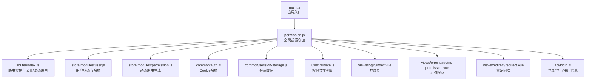
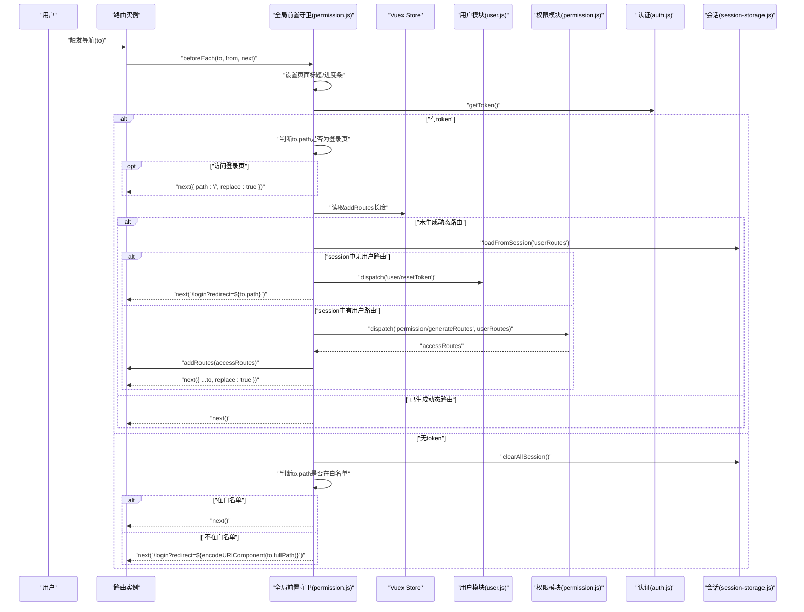
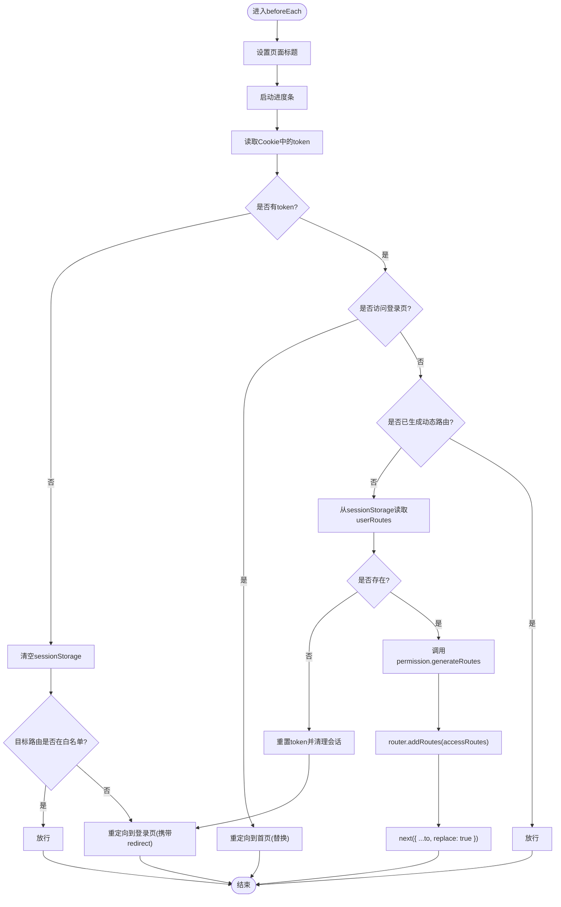
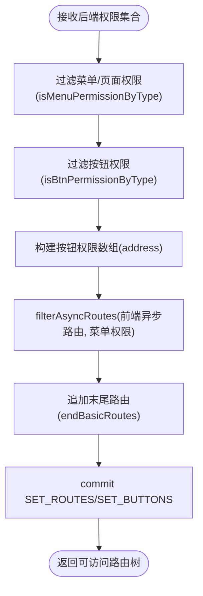
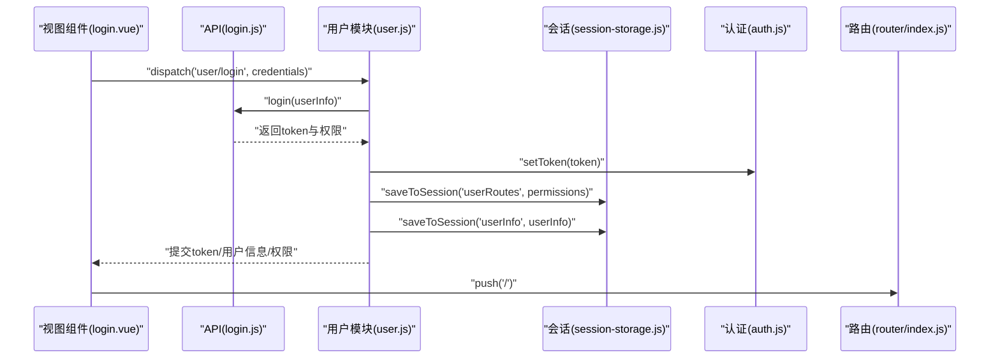
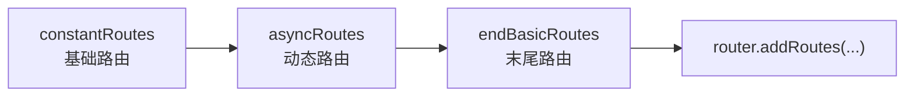
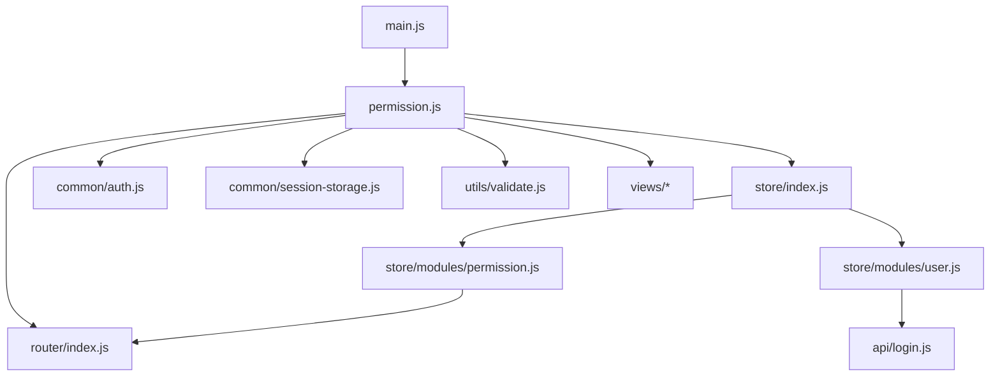

# 路由守卫

<cite>
**本文引用的文件列表**
- [src/router/index.js](file://src/router/index.js)
- [src/permission.js](file://src/permission.js)
- [src/store/modules/permission.js](file://src/store/modules/permission.js)
- [src/store/modules/user.js](file://src/store/modules/user.js)
- [src/common/auth.js](file://src/common/auth.js)
- [src/common/session-storage.js](file://src/common/session-storage.js)
- [src/utils/validate.js](file://src/utils/validate.js)
- [src/main.js](file://src/main.js)
- [src/views/login/index.vue](file://src/views/login/index.vue)
- [src/views/error-page/no-permission.vue](file://src/views/error-page/no-permission.vue)
- [src/views/redirect/redirect.vue](file://src/views/redirect/redirect.vue)
- [src/api/login.js](file://src/api/login.js)
</cite>

## 目录
1. [简介](#简介)
2. [项目结构](#项目结构)
3. [核心组件](#核心组件)
4. [架构总览](#架构总览)
5. [详细组件分析](#详细组件分析)
6. [依赖关系分析](#依赖关系分析)
7. [性能考量](#性能考量)
8. [故障排查指南](#故障排查指南)
9. [结论](#结论)
10. [附录](#附录)

## 简介
本文件面向Vue CMS的路由守卫系统，聚焦全局前置守卫beforeEach的实现逻辑与权限验证流程，系统阐述以下要点：
- 登录状态检查、权限验证与页面跳转控制机制
- 路由守卫与Vuex状态管理的集成方式
- 路由守卫的执行顺序与生命周期
- 配置示例与错误处理方法
- 登录拦截、权限拒绝与页面重定向的具体实现
- 路由守卫在用户体验优化方面的应用

## 项目结构
围绕路由守卫的关键文件组织如下：
- 路由定义与重置：src/router/index.js
- 全局前置守卫与后置守卫：src/permission.js
- 权限模块（动态路由生成、按钮权限提取）：src/store/modules/permission.js
- 用户模块（登录、登出、令牌与会话管理）：src/store/modules/user.js
- 认证与会话工具：src/common/auth.js、src/common/session-storage.js
- 权限类型判断工具：src/utils/validate.js
- 应用入口与守卫挂载：src/main.js
- 登录页、无权限页、重定向页：src/views/login/index.vue、src/views/error-page/no-permission.vue、src/views/redirect/redirect.vue
- 登录/登出/用户信息API：src/api/login.js

**图表来源**
- [src/main.js:25](file://src/main.js#L25)
- [src/permission.js:5-98](file://src/permission.js#L5-L98)
- [src/router/index.js:1-343](file://src/router/index.js#L1-L343)
- [src/store/modules/user.js:1-154](file://src/store/modules/user.js#L1-L154)
- [src/store/modules/permission.js:1-187](file://src/store/modules/permission.js#L1-L187)
- [src/common/auth.js:1-18](file://src/common/auth.js#L1-L18)
- [src/common/session-storage.js:1-48](file://src/common/session-storage.js#L1-L48)
- [src/utils/validate.js:1-56](file://src/utils/validate.js#L1-L56)
- [src/views/login/index.vue:1-261](file://src/views/login/index.vue#L1-L261)
- [src/views/error-page/no-permission.vue:1-4](file://src/views/error-page/no-permission.vue#L1-L4)
- [src/views/redirect/redirect.vue:1-13](file://src/views/redirect/redirect.vue#L1-L13)
- [src/api/login.js:1-24](file://src/api/login.js#L1-L24)

**章节来源**
- [src/main.js:25](file://src/main.js#L25)
- [src/router/index.js:1-343](file://src/router/index.js#L1-L343)
- [src/permission.js:5-98](file://src/permission.js#L5-L98)

## 核心组件
- 全局前置守卫：负责在路由切换前进行登录状态检查、权限验证与页面跳转控制，并集成进度条与页面标题设置。
- 动态路由生成：根据后端返回的权限集合，过滤前端配置的异步路由，生成可访问的路由树并注入到路由实例。
- 用户状态与令牌：通过Vuex管理token、用户信息与权限，提供登录、登出与令牌重置能力。
- 会话与认证：基于Cookie存储token，基于sessionStorage存储用户路由与用户信息等一次性数据。
- 权限类型判断：区分菜单/页面/按钮权限，用于动态路由与按钮级权限的提取与校验。

**章节来源**
- [src/permission.js:22-98](file://src/permission.js#L22-L98)
- [src/store/modules/permission.js:143-178](file://src/store/modules/permission.js#L143-L178)
- [src/store/modules/user.js:52-145](file://src/store/modules/user.js#L52-L145)
- [src/common/auth.js:1-18](file://src/common/auth.js#L1-L18)
- [src/common/session-storage.js:1-48](file://src/common/session-storage.js#L1-L48)
- [src/utils/validate.js:25-56](file://src/utils/validate.js#L25-L56)

## 架构总览
全局前置守卫的执行流程如下：
- 设置页面标题与进度条开始
- 读取Cookie中的token判断登录状态
- 若已登录：
  - 访问登录页则重定向至首页
  - 若未生成过动态路由：
    - 从sessionStorage读取用户路由权限
    - 若不存在则重置token并重定向至登录页（携带redirect参数）
    - 否则调用permission模块生成可访问路由并注入路由实例，replace当前导航
  - 若已存在动态路由，直接放行
- 若未登录：
  - 清空sessionStorage
  - 若目标路由在白名单则放行
  - 否则重定向至登录页（携带redirect参数）

**图表来源**
- [src/permission.js:22-98](file://src/permission.js#L22-L98)
- [src/store/modules/user.js:135-145](file://src/store/modules/user.js#L135-L145)
- [src/store/modules/permission.js:147-178](file://src/store/modules/permission.js#L147-L178)
- [src/common/auth.js:5-7](file://src/common/auth.js#L5-L7)
- [src/common/session-storage.js:43-45](file://src/common/session-storage.js#L43-L45)

## 详细组件分析

### 全局前置守卫 beforeEach 实现
- 登录状态检查：通过读取Cookie中的token判断是否已登录。
- 白名单策略：对特定路由（如登录页、单点登录、文件下载等）直接放行。
- 动态路由注入：首次进入且存在用户路由权限时，调用权限模块生成可访问路由并注入路由实例，随后replace当前导航避免历史记录污染。
- 页面重定向：未登录或权限不足时，重定向至登录页并携带redirect参数；登录页访问时重定向至首页。
- 进度条与标题：在守卫开始时启动进度条，在afterEach结束时完成进度条，并设置页面标题。

**图表来源**
- [src/permission.js:22-98](file://src/permission.js#L22-L98)
- [src/common/session-storage.js:43-45](file://src/common/session-storage.js#L43-L45)

**章节来源**
- [src/permission.js:22-98](file://src/permission.js#L22-L98)

### 动态路由生成与权限过滤
- 输入：后端返回的权限集合（包含菜单/页面/按钮类型），前端配置的异步路由表。
- 过滤逻辑：仅保留后端返回的address与前端路由path完全匹配的菜单/页面路由；递归处理子路由。
- 结果：生成可访问的路由树，同时提取按钮权限地址数组，提交至Vuex状态。
- 注入时机：在beforeEach中首次生成并注入路由实例，确保后续导航可命中。

**图表来源**
- [src/store/modules/permission.js:147-178](file://src/store/modules/permission.js#L147-L178)
- [src/utils/validate.js:43-55](file://src/utils/validate.js#L43-L55)

**章节来源**
- [src/store/modules/permission.js:143-178](file://src/store/modules/permission.js#L143-L178)
- [src/utils/validate.js:25-56](file://src/utils/validate.js#L25-L56)

### 用户状态与令牌管理
- 登录：调用登录API，成功后写入token至Cookie，将用户路由与用户信息写入sessionStorage，提交至Vuex。
- 登出：调用登出API，移除token，清空用户信息与权限，清理sessionStorage，重置路由实例。
- 令牌重置：在异常或会话失效时调用，确保状态一致性与安全性。

**图表来源**
- [src/views/login/index.vue:118-141](file://src/views/login/index.vue#L118-L141)
- [src/api/login.js:3-9](file://src/api/login.js#L3-L9)
- [src/store/modules/user.js:54-74](file://src/store/modules/user.js#L54-L74)
- [src/common/session-storage.js:19-28](file://src/common/session-storage.js#L19-L28)
- [src/common/auth.js:9-11](file://src/common/auth.js#L9-L11)
- [src/router/index.js:322-340](file://src/router/index.js#L322-L340)

**章节来源**
- [src/store/modules/user.js:52-145](file://src/store/modules/user.js#L52-L145)
- [src/views/login/index.vue:118-141](file://src/views/login/index.vue#L118-L141)
- [src/api/login.js:1-24](file://src/api/login.js#L1-L24)

### 路由表结构与重置
- 常量路由：无需权限的基础路由（首页、重定向、登录页等）。
- 动态路由：按角色生成的菜单/页面路由。
- 末尾路由：404、无权限、通配符路由，始终置于路由表末尾。
- 路由重置：在令牌重置后重建路由实例并重新挂载守卫，保证导航一致性。

**图表来源**
- [src/router/index.js:43-111](file://src/router/index.js#L43-L111)
- [src/router/index.js:117-320](file://src/router/index.js#L117-L320)
- [src/router/index.js:322-340](file://src/router/index.js#L322-L340)

**章节来源**
- [src/router/index.js:43-111](file://src/router/index.js#L43-L111)
- [src/router/index.js:117-320](file://src/router/index.js#L117-L320)
- [src/router/index.js:322-340](file://src/router/index.js#L322-L340)

### 页面重定向与无权限处理
- 登录拦截：未登录访问受保护路由时，重定向至登录页并携带redirect参数，登录成功后可回到原页面。
- 无权限：访问无权限路由时，重定向至无权限页。
- 重定向页：用于处理带参数的重定向，将params中的path拼接后replace到目标路由。

**章节来源**
- [src/permission.js:81-90](file://src/permission.js#L81-L90)
- [src/views/error-page/no-permission.vue:1-4](file://src/views/error-page/no-permission.vue#L1-L4)
- [src/views/redirect/redirect.vue:1-13](file://src/views/redirect/redirect.vue#L1-L13)

## 依赖关系分析
- 入口挂载：main.js引入permission.js，确保应用启动即挂载全局守卫。
- 守卫依赖：permission.js依赖router、store、auth、session-storage、validate、NProgress与页面标题工具。
- 权限模块：permission.js依赖router的常量/动态路由与endBasicRoutes，依赖validate进行权限类型判断。
- 用户模块：user.js依赖api/login.js与auth/session-storage，提供登录、登出与令牌重置。
- 路由重置：resetRouter在user模块中被调用，确保令牌重置后路由一致性。

**图表来源**
- [src/main.js:25](file://src/main.js#L25)
- [src/permission.js:5-98](file://src/permission.js#L5-L98)
- [src/router/index.js:1-343](file://src/router/index.js#L1-L343)
- [src/store/modules/user.js:1-154](file://src/store/modules/user.js#L1-L154)
- [src/store/modules/permission.js:1-187](file://src/store/modules/permission.js#L1-L187)
- [src/common/auth.js:1-18](file://src/common/auth.js#L1-L18)
- [src/common/session-storage.js:1-48](file://src/common/session-storage.js#L1-L48)
- [src/utils/validate.js:1-56](file://src/utils/validate.js#L1-L56)
- [src/api/login.js:1-24](file://src/api/login.js#L1-L24)

**章节来源**
- [src/main.js:25](file://src/main.js#L25)
- [src/permission.js:5-98](file://src/permission.js#L5-L98)

## 性能考量
- 动态路由注入：仅在首次进入且未生成时执行，避免重复注入带来的开销。
- 路由重置：resetRouter通过matcher替换减少不必要的路由重建成本。
- 进度条：在beforeEach启动、afterEach结束，避免阻塞UI渲染。
- 会话缓存：优先从sessionStorage读取用户路由权限，减少网络请求与计算开销。
- 页面标题：统一设置，避免重复DOM操作。

[本节为通用建议，不直接分析具体文件]

## 故障排查指南
- 登录后仍被重定向至登录页
  - 检查Cookie中token是否存在与正确
  - 确认sessionStorage中userRoutes是否已写入
  - 查看permission模块generateRoutes是否抛错
- 无法访问某些菜单
  - 检查后端返回的权限类型与address是否正确
  - 确认前端asyncRoutes的path与后端address一致
- 登录成功后未回到原页面
  - 检查登录页是否正确传递redirect参数并使用replace跳转
- 令牌重置后仍可访问受保护路由
  - 确认resetRouter是否被调用并重新挂载守卫
- 无权限页面未显示
  - 检查末尾路由endBasicRoutes是否被正确追加

**章节来源**
- [src/permission.js:40-70](file://src/permission.js#L40-L70)
- [src/store/modules/permission.js:147-178](file://src/store/modules/permission.js#L147-L178)
- [src/store/modules/user.js:135-145](file://src/store/modules/user.js#L135-L145)
- [src/views/login/index.vue:135-141](file://src/views/login/index.vue#L135-L141)

## 结论
该路由守卫系统通过“登录状态检查 + 权限过滤 + 动态路由注入 + 页面重定向”的闭环，实现了安全、可控且体验友好的导航控制。结合Vuex的状态管理与会话缓存，既保证了安全性，又兼顾了性能与可维护性。建议在实际部署中：
- 明确白名单路由范围，避免误放导致的安全风险
- 规范后端权限类型与地址映射，确保前端过滤准确
- 在afterEach中统一处理异常与兜底逻辑
- 对resetRouter与令牌重置进行可观测与日志记录

[本节为总结性内容，不直接分析具体文件]

## 附录

### 配置示例与最佳实践
- 白名单配置：在permission.js中维护白名单数组，确保不受登录状态影响
- 动态路由生成：在permission模块中扩展过滤规则，支持更复杂的权限匹配
- 会话缓存：合理利用sessionStorage存储一次性数据，避免与持久化数据混淆
- 错误处理：在beforeEach中捕获异常并统一提示，必要时重置token与路由

**章节来源**
- [src/permission.js:20-21](file://src/permission.js#L20-L21)
- [src/store/modules/permission.js:147-178](file://src/store/modules/permission.js#L147-L178)
- [src/common/session-storage.js:19-45](file://src/common/session-storage.js#L19-L45)