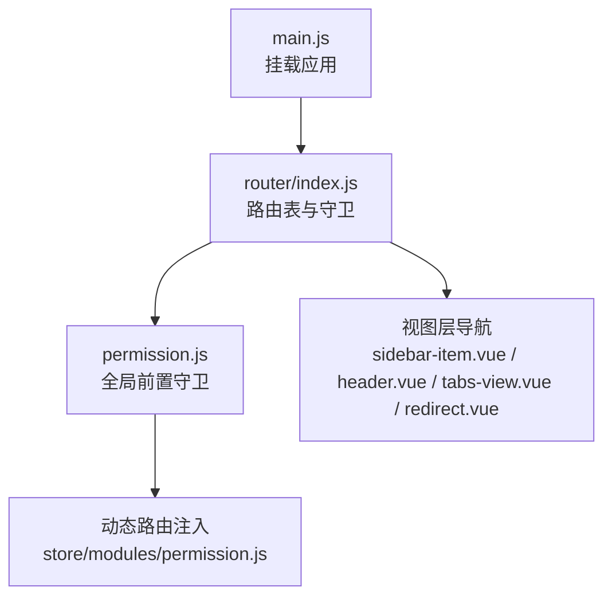
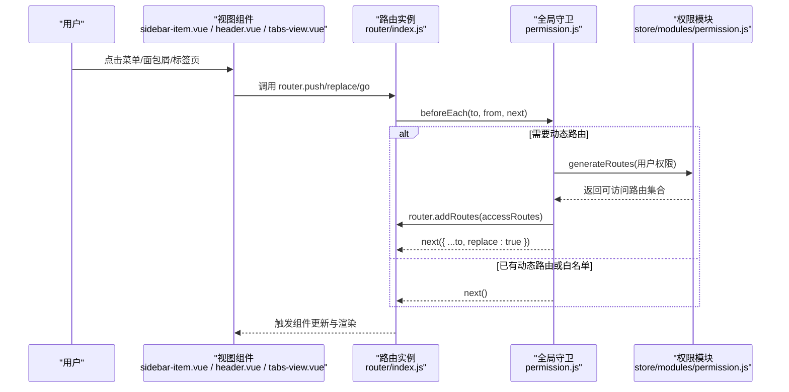
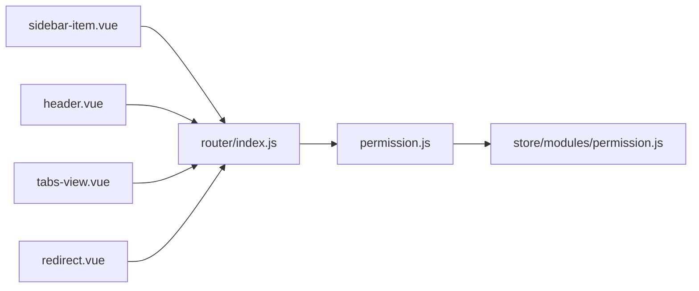

# 路由导航

<cite>
**本文引用的文件**
- [src/router/index.js](file://src/router/index.js)
- [src/main.js](file://src/main.js)
- [src/permission.js](file://src/permission.js)
- [src/views/redirect/redirect.vue](file://src/views/redirect/redirect.vue)
- [src/layout/sidebar/sidebar-item.vue](file://src/layout/sidebar/sidebar-item.vue)
- [src/layout/header.vue](file://src/layout/header.vue)
- [src/layout/tabs-view.vue](file://src/layout/tabs-view.vue)
- [src/store/modules/permission.js](file://src/store/modules/permission.js)
</cite>

## 目录
1. [简介](#简介)
2. [项目结构](#项目结构)
3. [核心组件](#核心组件)
4. [架构总览](#架构总览)
5. [详细组件分析](#详细组件分析)
6. [依赖关系分析](#依赖关系分析)
7. [性能考量](#性能考量)
8. [故障排查指南](#故障排查指南)
9. [结论](#结论)
10. [附录](#附录)

## 简介
本章节面向Vue CMS项目的路由导航体系，重点围绕编程式导航（router.push、router.replace、router.go）与模板指令（<router-link>）的使用差异、路由参数与查询字符串传递、重定向与别名的应用场景、以及在表单提交、页面跳转与状态同步中的实践。文档同时提供流程图与类图帮助理解系统行为。

## 项目结构
路由系统由三部分构成：
- 路由定义与基础配置：集中于路由表，包含常量路由、动态路由与末尾兜底路由。
- 全局前置守卫与权限控制：在进入路由前进行鉴权与动态路由注入。
- 导航实现：在视图层通过模板指令与编程式导航结合使用，覆盖菜单、面包屑、标签页与重定向场景。

**图示来源**
- [src/main.js:47-52](file://src/main.js#L47-L52)
- [src/router/index.js:322-342](file://src/router/index.js#L322-L342)
- [src/permission.js:23-91](file://src/permission.js#L23-L91)
- [src/store/modules/permission.js:41-54](file://src/store/modules/permission.js#L41-L54)

**章节来源**
- [src/router/index.js:43-111](file://src/router/index.js#L43-L111)
- [src/router/index.js:118-320](file://src/router/index.js#L118-L320)
- [src/main.js:6-6](file://src/main.js#L6-L6)

## 核心组件
- 路由表与导航入口
  - 常量路由：如首页重定向、登录页、重定向中间页等。
  - 动态路由：按权限生成，包含多级菜单与子路由。
  - 末尾兜底路由：404、无权限、通配符。
- 全局守卫
  - 登录态校验、动态路由注入、白名单放行、进度条与标题设置。
- 视图层导航
  - 侧边栏菜单使用<router-link>；面包屑与标签页使用编程式导航；重定向中间页使用router.replace。

**章节来源**
- [src/router/index.js:43-111](file://src/router/index.js#L43-L111)
- [src/router/index.js:118-320](file://src/router/index.js#L118-L320)
- [src/permission.js:23-91](file://src/permission.js#L23-L91)

## 架构总览
下图展示了从用户触发导航到页面渲染的关键流程，涵盖模板指令与编程式导航的协作、全局守卫与动态路由注入。

**图示来源**
- [src/layout/sidebar/sidebar-item.vue:28-32](file://src/layout/sidebar/sidebar-item.vue#L28-L32)
- [src/layout/header.vue:146-152](file://src/layout/header.vue#L146-L152)
- [src/layout/tabs-view.vue:54-66](file://src/layout/tabs-view.vue#L54-L66)
- [src/router/index.js:322-342](file://src/router/index.js#L322-L342)
- [src/permission.js:23-91](file://src/permission.js#L23-L91)
- [src/store/modules/permission.js:41-54](file://src/store/modules/permission.js#L41-L54)

## 详细组件分析

### 编程式导航：router.push、router.replace、router.go
- router.push
  - 用于“前进”式导航，保留历史记录，适合常规页面跳转。
  - 示例位置：
    - 面包屑点击跳转：[src/layout/header.vue:146-152](file://src/layout/header.vue#L146-L152)
    - 标签页关闭后回退到上一标签：[src/layout/tabs-view.vue:54-66](file://src/layout/tabs-view.vue#L54-L66)
- router.replace
  - 用于替换当前历史记录，常用于“一次性”跳转，避免返回。
  - 示例位置：
    - 重定向中间页：[src/views/redirect/redirect.vue:6-6](file://src/views/redirect/redirect.vue#L6-L6)
- router.go
  - 用于在历史记录中前进/后退指定步数，适合返回上级或跨页跳转。
  - 使用位置：在项目中未直接出现显式调用，可在业务中按需使用。

**章节来源**
- [src/layout/header.vue:146-152](file://src/layout/header.vue#L146-L152)
- [src/layout/tabs-view.vue:54-66](file://src/layout/tabs-view.vue#L54-L66)
- [src/views/redirect/redirect.vue:6-6](file://src/views/redirect/redirect.vue#L6-L6)

### 路由参数传递与查询字符串处理
- 路由参数（params）
  - 在路由定义中使用动态段（如/path/:id），在导航时传入params对象。
  - 实践要点：确保目标路由声明了对应的动态段；在组件内通过$route.params读取。
- 查询字符串（query）
  - 通过query对象传递键值对，适用于筛选、分页、来源标识等。
  - 实践要点：query会拼接到URL中，适合非敏感数据；注意编码与解码。
- 路由表中的重定向与通配符
  - 重定向中间页使用通配符捕获路径并透传query，再用router.replace跳转至目标路径。
  - 参考：[src/views/redirect/redirect.vue:4-6](file://src/views/redirect/redirect.vue#L4-L6)，[src/router/index.js:58-67](file://src/router/index.js#L58-L67)

**章节来源**
- [src/views/redirect/redirect.vue:4-6](file://src/views/redirect/redirect.vue#L4-L6)
- [src/router/index.js:58-67](file://src/router/index.js#L58-L67)

### 路由重定向机制与redirect配置
- redirect配置
  - 在路由表中为父级路由设置redirect，可将访问父级路径自动跳转到某个子路由，提升用户体验。
  - 示例位置：
    - 首页重定向：[src/router/index.js:47-47](file://src/router/index.js#L47-L47)
    - 多处父级路由设置redirect：[src/router/index.js:125-125](file://src/router/index.js#L125-L125)，[src/router/index.js:139-139](file://src/router/index.js#L139-L139)，[src/router/index.js:155-155](file://src/router/index.js#L155-L155)，[src/router/index.js:275-275](file://src/router/index.js#L275-L275)
- 重定向中间页
  - 通过通配符捕获原始路径与查询参数，再用router.replace进行无痕跳转。
  - 参考：[src/views/redirect/redirect.vue:6-6](file://src/views/redirect/redirect.vue#L6-L6)，[src/router/index.js:58-67](file://src/router/index.js#L58-L67)

**章节来源**
- [src/router/index.js:47-47](file://src/router/index.js#L47-L47)
- [src/router/index.js:125-125](file://src/router/index.js#L125-L125)
- [src/router/index.js:139-139](file://src/router/index.js#L139-L139)
- [src/router/index.js:155-155](file://src/router/index.js#L155-L155)
- [src/router/index.js:275-275](file://src/router/index.js#L275-L275)
- [src/views/redirect/redirect.vue:6-6](file://src/views/redirect/redirect.vue#L6-L6)
- [src/router/index.js:58-67](file://src/router/index.js#L58-L67)

### 路由别名alias
- 当前路由表未使用alias配置。若需为现有路由提供额外访问路径（如短链、兼容旧路径），可在路由定义中增加alias字段，使多个路径指向同一组件。
- 应用场景建议：
  - 保持对外链接稳定，内部结构调整不影响外部访问。
  - 为特定功能提供更直观的路径别称。

[本小节为概念性说明，不涉及具体文件分析]

### 编程式导航与模板指令v-router-link的对比与选择
- 适用场景
  - <router-link>：静态菜单、面包屑、标签页等固定路径跳转，简洁直观。
  - 编程式导航：动态路径、条件跳转、跨组件交互、表单提交后跳转、状态同步等复杂逻辑。
- 性能与体验
  - <router-link>在渲染时即确定目标，适合高频点击场景。
  - 编程式导航在运行时计算，适合需要条件判断或副作用处理的场景。
- 项目中的使用
  - 菜单与子菜单：使用<router-link>，见[sidebar-item.vue:28-32](file://src/layout/sidebar/sidebar-item.vue#L28-L32)。
  - 面包屑与标签页：使用router.push，见[header.vue:146-152](file://src/layout/header.vue#L146-L152)、[tabs-view.vue:54-66](file://src/layout/tabs-view.vue#L54-L66)。
  - 一次性跳转：使用router.replace，见[redirect.vue:6-6](file://src/views/redirect/redirect.vue#L6-L6)。

**章节来源**
- [src/layout/sidebar/sidebar-item.vue:28-32](file://src/layout/sidebar/sidebar-item.vue#L28-L32)
- [src/layout/header.vue:146-152](file://src/layout/header.vue#L146-L152)
- [src/layout/tabs-view.vue:54-66](file://src/layout/tabs-view.vue#L54-L66)
- [src/views/redirect/redirect.vue:6-6](file://src/views/redirect/redirect.vue#L6-L6)

### 路由导航在表单提交、页面跳转与状态同步中的应用
- 表单提交后的页面跳转
  - 在提交成功后使用router.push跳转至详情或列表页，保留历史记录以便返回。
  - 若为一次性操作（如导入完成），可用router.replace替换当前页。
- 页面跳转与状态同步
  - 面包屑与标签页联动：点击面包屑或标签项时，先计算目标路由，再调用router.push；若目标路由包含redirect优先使用redirect。
  - 参考：[header.vue:146-152](file://src/layout/header.vue#L146-L152)、[tabs-view.vue:54-66](file://src/layout/tabs-view.vue#L54-L66)
- 动态路由注入与权限控制
  - 登录后根据用户权限生成可访问路由，注入后使用replace避免重复历史记录。
  - 参考：[permission.js:54-63](file://src/permission.js#L54-L63)

**章节来源**
- [src/layout/header.vue:146-152](file://src/layout/header.vue#L146-L152)
- [src/layout/tabs-view.vue:54-66](file://src/layout/tabs-view.vue#L54-L66)
- [src/permission.js:54-63](file://src/permission.js#L54-L63)

## 依赖关系分析
- 组件耦合
  - 视图组件依赖路由实例进行导航；全局守卫依赖权限模块生成动态路由；重定向中间页依赖路由表的通配符配置。
- 外部依赖
  - Element UI的<router-link>与<el-breadcrumb>等组件配合实现导航与面包屑。
- 潜在风险
  - 动态路由注入后未正确replace可能导致历史栈异常。
  - 重定向中间页未透传query会导致参数丢失。

**图示来源**
- [src/layout/sidebar/sidebar-item.vue:28-32](file://src/layout/sidebar/sidebar-item.vue#L28-L32)
- [src/layout/header.vue:146-152](file://src/layout/header.vue#L146-L152)
- [src/layout/tabs-view.vue:54-66](file://src/layout/tabs-view.vue#L54-L66)
- [src/views/redirect/redirect.vue:6-6](file://src/views/redirect/redirect.vue#L6-L6)
- [src/router/index.js:322-342](file://src/router/index.js#L322-L342)
- [src/permission.js:23-91](file://src/permission.js#L23-L91)
- [src/store/modules/permission.js:41-54](file://src/store/modules/permission.js#L41-L54)

**章节来源**
- [src/layout/sidebar/sidebar-item.vue:28-32](file://src/layout/sidebar/sidebar-item.vue#L28-L32)
- [src/layout/header.vue:146-152](file://src/layout/header.vue#L146-L152)
- [src/layout/tabs-view.vue:54-66](file://src/layout/tabs-view.vue#L54-L66)
- [src/views/redirect/redirect.vue:6-6](file://src/views/redirect/redirect.vue#L6-L6)
- [src/router/index.js:322-342](file://src/router/index.js#L322-L342)
- [src/permission.js:23-91](file://src/permission.js#L23-L91)
- [src/store/modules/permission.js:41-54](file://src/store/modules/permission.js#L41-L54)

## 性能考量
- 路由懒加载
  - 路由组件采用动态导入，减少首屏体积，提升初始化速度。
  - 参考：[src/router/index.js:52-52](file://src/router/index.js#L52-L52)、[src/router/index.js:130-130](file://src/router/index.js#L130-L130)等。
- 历史记录管理
  - 对一次性跳转使用router.replace，避免历史栈膨胀。
  - 对需要返回的场景使用router.push。
- 动态路由注入
  - 注入完成后使用replace，确保首次进入目标页不产生多余历史记录。
  - 参考：[src/permission.js:63-63](file://src/permission.js#L63-L63)

**章节来源**
- [src/router/index.js:52-52](file://src/router/index.js#L52-L52)
- [src/router/index.js:130-130](file://src/router/index.js#L130-L130)
- [src/permission.js:63-63](file://src/permission.js#L63-L63)

## 故障排查指南
- 登录后无法进入受控页面
  - 检查全局守卫是否正确注入动态路由并使用replace。
  - 参考：[src/permission.js:54-63](file://src/permission.js#L54-L63)
- 面包屑点击无效或跳转错误
  - 确认目标路由是否存在redirect，若有优先使用redirect。
  - 参考：[src/layout/header.vue:146-152](file://src/layout/header.vue#L146-L152)
- 重定向后参数丢失
  - 确保重定向中间页透传query。
  - 参考：[src/views/redirect/redirect.vue:4-6](file://src/views/redirect/redirect.vue#L4-L6)
- 标签页关闭后未正确回退
  - 检查关闭逻辑是否调用router.push跳转至上一个标签。
  - 参考：[src/layout/tabs-view.vue:54-66](file://src/layout/tabs-view.vue#L54-L66)

**章节来源**
- [src/permission.js:54-63](file://src/permission.js#L54-L63)
- [src/layout/header.vue:146-152](file://src/layout/header.vue#L146-L152)
- [src/views/redirect/redirect.vue:4-6](file://src/views/redirect/redirect.vue#L4-L6)
- [src/layout/tabs-view.vue:54-66](file://src/layout/tabs-view.vue#L54-L66)

## 结论
本项目通过清晰的路由表设计、完善的全局守卫与动态路由注入机制，以及模板指令与编程式导航的合理搭配，实现了灵活、可维护的导航体系。在实际开发中，应根据场景选择合适的导航方式，注意历史记录管理与参数传递，确保用户体验与性能的平衡。

## 附录
- 路由表结构概览（简化）
  - 常量路由：首页重定向、登录页、重定向中间页。
  - 动态路由：多级菜单与子路由，按权限生成。
  - 末尾路由：404、无权限、通配符兜底。
- 关键实现位置索引
  - 路由表与守卫：[src/router/index.js:43-111](file://src/router/index.js#L43-L111)、[src/router/index.js:118-320](file://src/router/index.js#L118-L320)、[src/permission.js:23-91](file://src/permission.js#L23-L91)
  - 导航实现：[src/layout/sidebar/sidebar-item.vue:28-32](file://src/layout/sidebar/sidebar-item.vue#L28-L32)、[src/layout/header.vue:146-152](file://src/layout/header.vue#L146-L152)、[src/layout/tabs-view.vue:54-66](file://src/layout/tabs-view.vue#L54-L66)、[src/views/redirect/redirect.vue:6-6](file://src/views/redirect/redirect.vue#L6-L6)