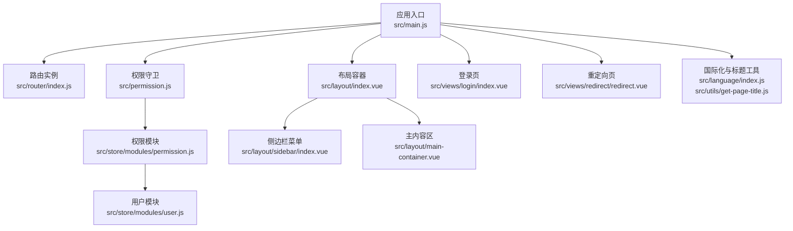
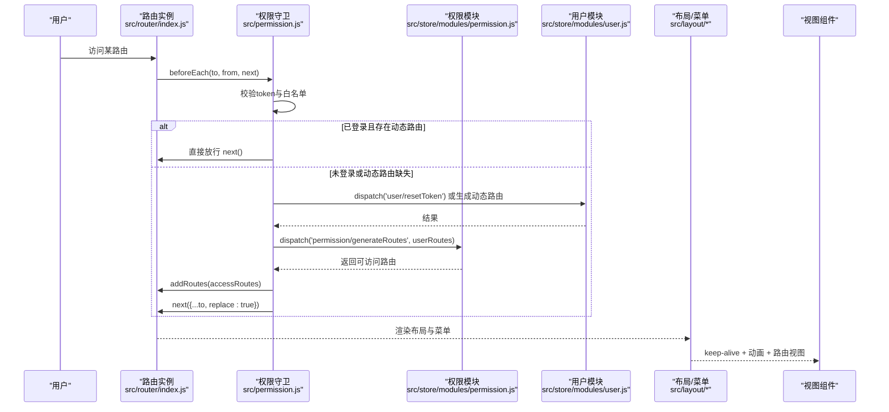
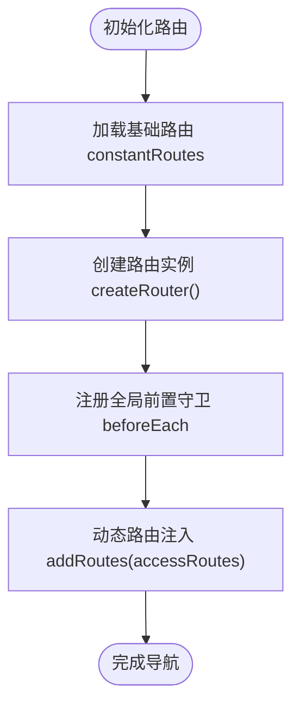
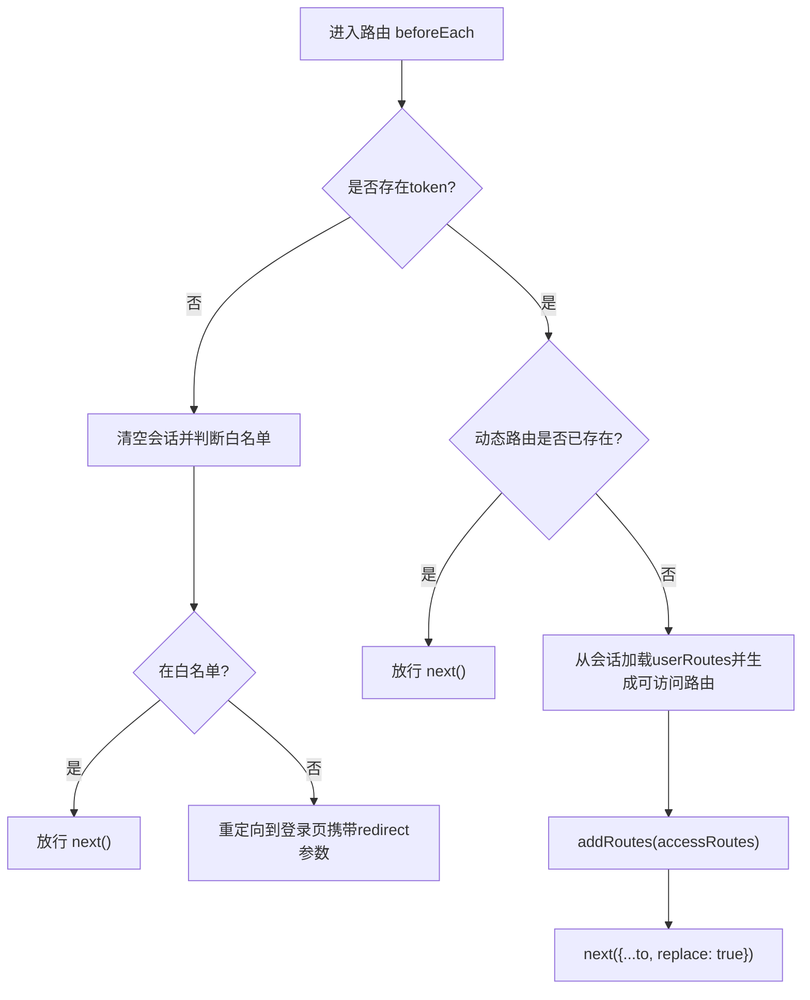
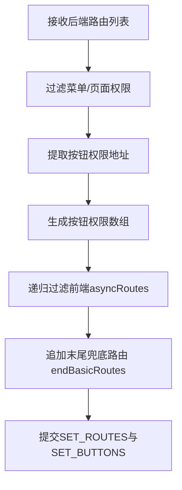
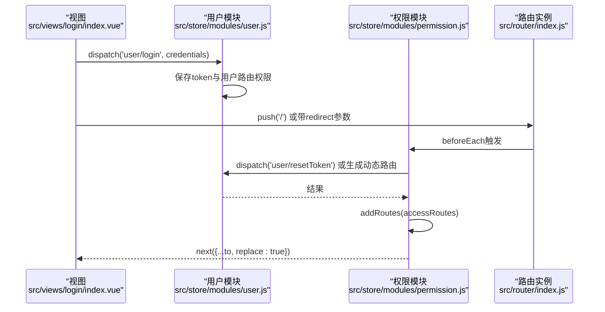
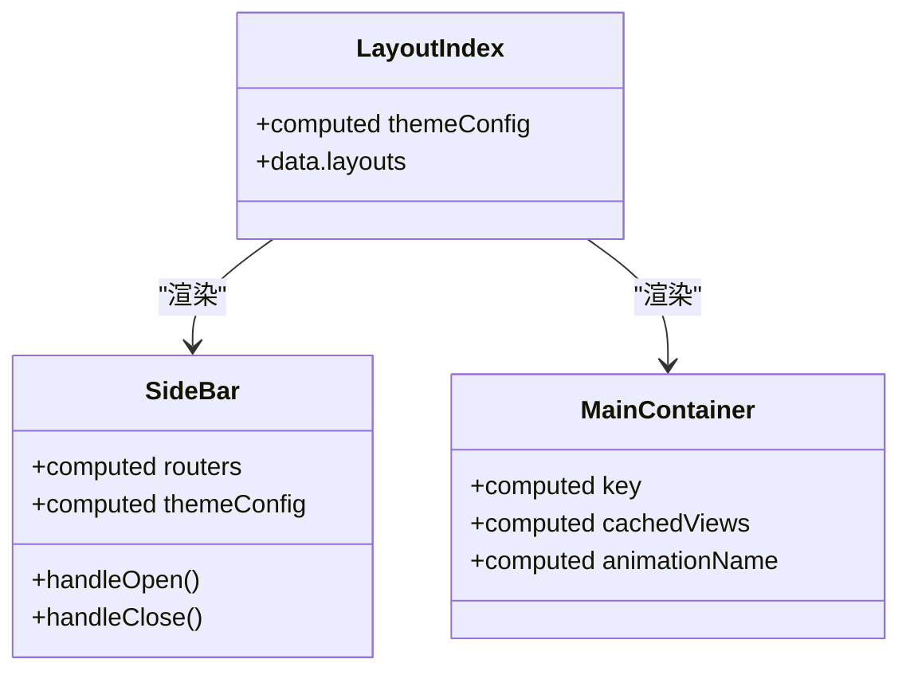
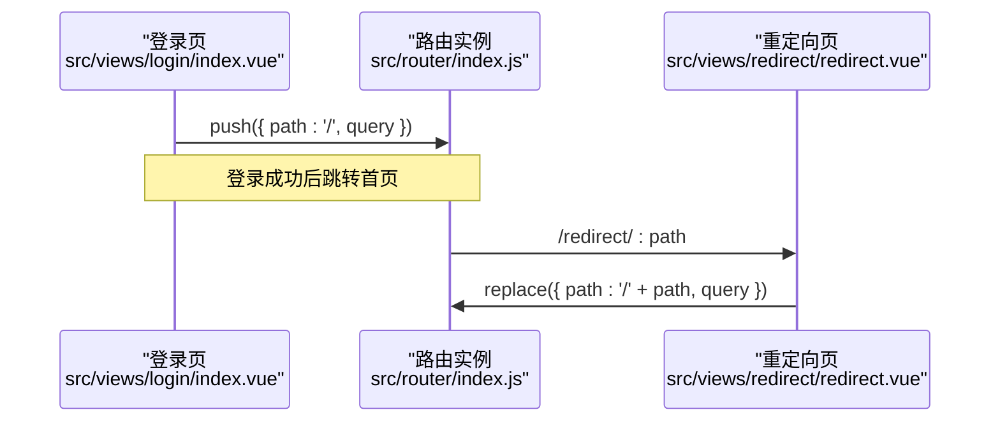
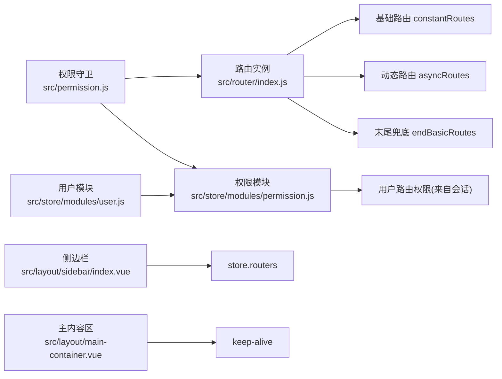

# 路由系统

<cite>
**本文引用的文件**
- [src/router/index.js](file://src/router/index.js)
- [src/permission.js](file://src/permission.js)
- [src/store/modules/permission.js](file://src/store/modules/permission.js)
- [src/store/modules/user.js](file://src/store/modules/user.js)
- [src/store/modules/tabsview.js](file://src/store/modules/tabsview.js)
- [src/layout/index.vue](file://src/layout/index.vue)
- [src/layout/sidebar/index.vue](file://src/layout/sidebar/index.vue)
- [src/layout/main-container.vue](file://src/layout/main-container.vue)
- [src/views/login/index.vue](file://src/views/login/index.vue)
- [src/views/redirect/redirect.vue](file://src/views/redirect/redirect.vue)
- [src/utils/validate.js](file://src/utils/validate.js)
- [src/utils/get-page-title.js](file://src/utils/get-page-title.js)
- [src/common/lang.js](file://src/common/lang.js)
- [src/language/index.js](file://src/language/index.js)
- [src/main.js](file://src/main.js)
</cite>

## 目录
1. [简介](#简介)
2. [项目结构](#项目结构)
3. [核心组件](#核心组件)
4. [架构总览](#架构总览)
5. [详细组件分析](#详细组件分析)
6. [依赖关系分析](#依赖关系分析)
7. [性能考量](#性能考量)
8. [故障排查指南](#故障排查指南)
9. [结论](#结论)
10. [附录](#附录)

## 简介
本文件面向Vue CMS项目的路由系统，系统基于 Vue Router 实现，采用“静态基础路由 + 动态权限路由 + 末尾兜底路由”的三层路由结构，并通过全局前置守卫完成登录态与权限控制。文档覆盖以下主题：
- 静态路由与动态路由的设计与实现
- 路由守卫机制与权限验证流程
- 嵌套路由、路由懒加载与路由元信息
- 路由跳转、参数传递与查询字符串处理
- 路由与权限系统的集成、动态菜单生成
- 路由缓存与页面状态保持策略
- 路由扩展与新页面开发最佳实践与安全建议

## 项目结构
路由系统主要由以下模块构成：
- 路由定义与配置：src/router/index.js
- 权限与守卫：src/permission.js、src/store/modules/permission.js、src/store/modules/user.js
- 布局与菜单：src/layout/index.vue、src/layout/sidebar/index.vue、src/layout/main-container.vue
- 登录与跳转：src/views/login/index.vue、src/views/redirect/redirect.vue
- 工具与国际化：src/utils/validate.js、src/utils/get-page-title.js、src/common/lang.js、src/language/index.js
- 应用入口：src/main.js

**图表来源**
- [src/main.js:1-53](file://src/main.js#L1-L53)
- [src/router/index.js:1-343](file://src/router/index.js#L1-L343)
- [src/permission.js:1-98](file://src/permission.js#L1-L98)
- [src/store/modules/permission.js:1-187](file://src/store/modules/permission.js#L1-L187)
- [src/store/modules/user.js:1-154](file://src/store/modules/user.js#L1-L154)
- [src/layout/index.vue:1-32](file://src/layout/index.vue#L1-L32)
- [src/layout/sidebar/index.vue:1-142](file://src/layout/sidebar/index.vue#L1-L142)
- [src/layout/main-container.vue:1-109](file://src/layout/main-container.vue#L1-L109)
- [src/views/login/index.vue:1-261](file://src/views/login/index.vue#L1-L261)
- [src/views/redirect/redirect.vue:1-12](file://src/views/redirect/redirect.vue#L1-L12)
- [src/utils/get-page-title.js:1-9](file://src/utils/get-page-title.js#L1-L9)
- [src/language/index.js:1-27](file://src/language/index.js#L1-L27)

**章节来源**
- [src/main.js:1-53](file://src/main.js#L1-L53)
- [src/router/index.js:1-343](file://src/router/index.js#L1-L343)

## 核心组件
- 路由表与配置
  - 基础路由：常量路由，无需权限即可访问（如首页、登录、重定向等）
  - 动态路由：根据用户权限过滤生成的路由集合
  - 末尾路由：404、无权限、通配符兜底页面
  - 路由元信息：icon、title、noCache、alwaysShow、hidden、isKeepAlive、isIframe 等
  - 路由懒加载：通过动态 import 实现按需加载
- 权限与守卫
  - 全局前置守卫：登录态校验、白名单放行、动态路由注入、错误处理与重定向
  - 权限模块：过滤前端路由与后端权限匹配，生成可访问路由与按钮权限
  - 用户模块：登录、拉取用户信息、退出登录、重置路由与清理会话
- 布局与菜单
  - 主布局：支持多布局切换
  - 侧边栏：基于 store 中的路由集合渲染菜单树
  - 主内容区：keep-alive 缓存与路由切换动画
- 工具与国际化
  - 页面标题拼接工具
  - 国际化配置与语言切换

**章节来源**
- [src/router/index.js:38-343](file://src/router/index.js#L38-L343)
- [src/permission.js:22-98](file://src/permission.js#L22-L98)
- [src/store/modules/permission.js:143-178](file://src/store/modules/permission.js#L143-L178)
- [src/store/modules/user.js:52-145](file://src/store/modules/user.js#L52-L145)
- [src/layout/index.vue:15-31](file://src/layout/index.vue#L15-L31)
- [src/layout/sidebar/index.vue:1-142](file://src/layout/sidebar/index.vue#L1-L142)
- [src/layout/main-container.vue:15-109](file://src/layout/main-container.vue#L15-L109)
- [src/utils/get-page-title.js:1-9](file://src/utils/get-page-title.js#L1-L9)
- [src/language/index.js:1-27](file://src/language/index.js#L1-L27)

## 架构总览
路由系统围绕“静态基础路由 + 动态权限路由 + 兜底路由”展开，配合全局守卫在进入路由前完成鉴权与动态路由注入。布局层负责菜单渲染与主内容区展示，keep-alive 与动画提升用户体验。

**图表来源**
- [src/permission.js:22-98](file://src/permission.js#L22-L98)
- [src/store/modules/permission.js:143-178](file://src/store/modules/permission.js#L143-L178)
- [src/store/modules/user.js:135-145](file://src/store/modules/user.js#L135-L145)
- [src/router/index.js:322-343](file://src/router/index.js#L322-L343)
- [src/layout/index.vue:15-31](file://src/layout/index.vue#L15-L31)
- [src/layout/main-container.vue:15-109](file://src/layout/main-container.vue#L15-L109)

## 详细组件分析

### 路由表与配置（静态/动态/兜底）
- 静态基础路由
  - 根路径重定向至首页
  - 登录页与重定向页（含通配符参数）
- 动态路由
  - 以 MainLayout 作为容器，支持多级嵌套
  - 使用 alwaysShow 控制菜单是否始终显示
  - 使用 meta.icon/title 控制菜单图标与标题
  - 使用 isKeepAlive/isIframe 控制缓存与内嵌
- 末尾兜底路由
  - 404、无权限、通配符兜底页面
- 路由懒加载
  - 子路由组件通过动态 import 实现按需加载
- 路由重置
  - resetRouter 通过替换 matcher 与重新挂载守卫保证路由状态一致性

**图表来源**
- [src/router/index.js:322-343](file://src/router/index.js#L322-L343)
- [src/router/index.js:43-111](file://src/router/index.js#L43-L111)
- [src/router/index.js:117-320](file://src/router/index.js#L117-L320)

**章节来源**
- [src/router/index.js:38-343](file://src/router/index.js#L38-L343)

### 权限与路由守卫
- 白名单与登录态
  - 白名单包含登录、单点登录等页面
  - 有 token 则视为已登录，否则清空会话并重定向登录
- 动态路由注入
  - 若 store 中已有动态路由则直接放行
  - 否则从会话加载用户路由权限，调用权限模块生成可访问路由并注入
  - 注入后使用 replace: true 避免历史记录
- 错误处理
  - 发生异常时重置 token 并提示错误，引导重新登录

**图表来源**
- [src/permission.js:22-98](file://src/permission.js#L22-L98)

**章节来源**
- [src/permission.js:19-98](file://src/permission.js#L19-L98)

### 权限模块（前端路由与后端权限匹配）
- 过滤规则
  - 仅保留后端返回 address 与前端路由 path 完全匹配的路由
  - 支持递归过滤子路由
- 按类型拆分
  - 菜单/页面权限：type=1/2
  - 按钮权限：type=3
- 生成结果
  - 将可访问路由与末尾兜底路由合并，写入 store.state.routes

**图表来源**
- [src/store/modules/permission.js:143-178](file://src/store/modules/permission.js#L143-L178)
- [src/utils/validate.js:43-55](file://src/utils/validate.js#L43-L55)

**章节来源**
- [src/store/modules/permission.js:1-187](file://src/store/modules/permission.js#L1-L187)
- [src/utils/validate.js:1-56](file://src/utils/validate.js#L1-L56)

### 用户模块（登录/退出/重置）
- 登录
  - 调用后端接口，保存 token、用户信息与用户路由权限到会话
- 退出
  - 清理 token、用户信息与会话，调用 resetRouter 重置路由
- 重置
  - 清理 token 与会话，重置路由实例

**图表来源**
- [src/views/login/index.vue:118-153](file://src/views/login/index.vue#L118-L153)
- [src/store/modules/user.js:52-145](file://src/store/modules/user.js#L52-L145)
- [src/store/modules/permission.js:143-178](file://src/store/modules/permission.js#L143-L178)
- [src/router/index.js:322-343](file://src/router/index.js#L322-L343)

**章节来源**
- [src/views/login/index.vue:118-153](file://src/views/login/index.vue#L118-L153)
- [src/store/modules/user.js:52-145](file://src/store/modules/user.js#L52-L145)

### 布局与菜单（动态菜单生成）
- 主布局
  - 根据主题配置选择不同布局组件
- 侧边栏
  - 从 store 获取 routers 并渲染菜单树
  - 支持折叠、唯一展开、滚动条
- 主内容区
  - keep-alive 缓存 + 动画过渡
  - key 与路由 path 绑定，避免同路由复用导致的组件不刷新

**图表来源**
- [src/layout/index.vue:15-31](file://src/layout/index.vue#L15-L31)
- [src/layout/sidebar/index.vue:1-142](file://src/layout/sidebar/index.vue#L1-L142)
- [src/layout/main-container.vue:15-109](file://src/layout/main-container.vue#L15-L109)

**章节来源**
- [src/layout/index.vue:1-32](file://src/layout/index.vue#L1-L32)
- [src/layout/sidebar/index.vue:1-142](file://src/layout/sidebar/index.vue#L1-L142)
- [src/layout/main-container.vue:15-109](file://src/layout/main-container.vue#L15-L109)

### 路由跳转、参数传递与查询字符串
- 登录成功后跳转
  - 视图层通过 $router.push('/') 或携带 redirect 参数跳转
- 重定向页
  - 通过 params.path 与 query 实现原路径与查询参数的还原
- 路由懒加载
  - 子路由组件通过动态 import 实现按需加载，减少首屏体积

**图表来源**
- [src/views/login/index.vue:134-141](file://src/views/login/index.vue#L134-L141)
- [src/views/redirect/redirect.vue:1-12](file://src/views/redirect/redirect.vue#L1-L12)
- [src/router/index.js:58-75](file://src/router/index.js#L58-L75)

**章节来源**
- [src/views/login/index.vue:118-153](file://src/views/login/index.vue#L118-L153)
- [src/views/redirect/redirect.vue:1-12](file://src/views/redirect/redirect.vue#L1-L12)

### 路由元信息与国际化
- 路由元信息
  - icon/title 用于菜单与面包屑
  - noCache 控制 keep-alive 缓存
  - alwaysShow/hidden 控制菜单显示与嵌套模式
  - isKeepAlive/isIframe 控制缓存与内嵌窗口
- 页面标题
  - 通过 getPageTitle 拼接当前路由 meta.title 与应用标题
- 国际化
  - VueI18n 配置中英文语言包，Element UI 与业务文案统一

**章节来源**
- [src/router/index.js:14-36](file://src/router/index.js#L14-L36)
- [src/utils/get-page-title.js:1-9](file://src/utils/get-page-title.js#L1-L9)
- [src/language/index.js:1-27](file://src/language/index.js#L1-L27)
- [src/common/lang.js:1-17](file://src/common/lang.js#L1-L17)

### 路由缓存与页面状态保持
- keep-alive 缓存
  - 主内容区通过 <keep-alive :include="cachedViews"> 缓存组件状态
  - 当前实现中 cachedViews 受主题配置影响，可按需启用
- 页面切换动画
  - 根据主题配置选择滑动或淡入淡出动画
- 标签页视图
  - store.modules.tabsview 记录访问过的标签页，支持关闭与去重

**章节来源**
- [src/layout/main-container.vue:15-109](file://src/layout/main-container.vue#L15-L109)
- [src/store/modules/tabsview.js:1-49](file://src/store/modules/tabsview.js#L1-L49)

## 依赖关系分析
- 路由依赖
  - 路由实例依赖基础路由与动态路由，最终合并为完整路由表
  - resetRouter 依赖 createRouter 与守卫重新挂载
- 权限依赖
  - 权限模块依赖后端返回的用户路由权限列表
  - 与用户模块协作完成登录态与会话管理
- 布局依赖
  - 侧边栏依赖 store.routers 渲染菜单
  - 主内容区依赖 keep-alive 与动画配置

**图表来源**
- [src/router/index.js:322-343](file://src/router/index.js#L322-L343)
- [src/permission.js:22-98](file://src/permission.js#L22-L98)
- [src/store/modules/permission.js:143-178](file://src/store/modules/permission.js#L143-L178)
- [src/store/modules/user.js:135-145](file://src/store/modules/user.js#L135-L145)
- [src/layout/sidebar/index.vue:1-142](file://src/layout/sidebar/index.vue#L1-L142)
- [src/layout/main-container.vue:15-109](file://src/layout/main-container.vue#L15-L109)

**章节来源**
- [src/router/index.js:322-343](file://src/router/index.js#L322-L343)
- [src/permission.js:22-98](file://src/permission.js#L22-L98)
- [src/store/modules/permission.js:143-178](file://src/store/modules/permission.js#L143-L178)
- [src/store/modules/user.js:135-145](file://src/store/modules/user.js#L135-L145)

## 性能考量
- 路由懒加载
  - 使用动态 import 减少首屏资源加载，提升初始渲染速度
- keep-alive 策略
  - 对频繁访问的页面启用缓存，避免重复请求与计算
  - 对瞬时页面或高内存占用页面禁用缓存，降低内存压力
- 动画与滚动
  - 合理的过渡动画与滚动行为提升交互体验，但应避免过度复杂动画造成卡顿
- 路由重置
  - resetRouter 与重新挂载守卫确保路由状态一致性，避免重复监听导致的内存泄漏

[本节为通用性能建议，不涉及特定文件分析]

## 故障排查指南
- 登录后仍被重定向到登录页
  - 检查 token 是否正确保存与读取
  - 确认权限模块是否成功生成可访问路由并注入
- 动态路由未生效
  - 确认会话中 userRoutes 是否存在
  - 检查后端返回的 address 与前端 path 是否完全一致
- 菜单不显示或显示异常
  - 检查 alwaysShow/hidden 与 children 数量的关系
  - 确认 meta.icon/title 是否正确配置
- 页面状态丢失
  - 检查 keep-alive include 列表与路由 key 绑定
  - 确认页面是否被 noCache 标记
- 标题未国际化
  - 确认 meta.title 是否对应语言包键值

**章节来源**
- [src/permission.js:22-98](file://src/permission.js#L22-L98)
- [src/store/modules/permission.js:143-178](file://src/store/modules/permission.js#L143-L178)
- [src/router/index.js:14-36](file://src/router/index.js#L14-L36)
- [src/layout/main-container.vue:15-109](file://src/layout/main-container.vue#L15-L109)

## 结论
本路由系统通过“静态基础路由 + 动态权限路由 + 兜底路由”的组合，结合全局守卫与权限模块，实现了灵活的权限控制与良好的用户体验。配合布局层的菜单渲染与 keep-alive 缓存策略，满足了多页面、多权限场景下的实际需求。建议在后续扩展中持续关注路由懒加载、缓存策略与国际化的一致性，确保系统在功能与性能上的平衡。

[本节为总结性内容，不涉及特定文件分析]

## 附录

### 路由配置最佳实践
- 路由层级与路径
  - 父子路由 path 必须为完整路径，避免相对路径导致的匹配问题
  - 使用 alwaysShow 控制菜单显示与嵌套模式
- 菜单与权限
  - 后端返回的 address 与前端 path 必须完全一致
  - 按类型区分菜单/页面/按钮权限，分别处理
- 路由懒加载
  - 对非首屏页面使用动态 import，减少首屏体积
- 元信息规范
  - icon/title 用于菜单与面包屑
  - noCache 控制缓存
  - isKeepAlive/isIframe 控制缓存与内嵌
- 守卫与会话
  - 白名单页面明确列出
  - 动态路由注入后使用 replace: true 避免历史记录
  - 异常时重置 token 与路由，保障状态一致性

**章节来源**
- [src/router/index.js:14-36](file://src/router/index.js#L14-L36)
- [src/router/index.js:322-343](file://src/router/index.js#L322-L343)
- [src/store/modules/permission.js:143-178](file://src/store/modules/permission.js#L143-L178)
- [src/permission.js:22-98](file://src/permission.js#L22-L98)

### 安全考虑
- 登录态与令牌
  - 严格校验 token，未登录时清空会话并重定向
  - 退出登录时清理 token、用户信息与会话
- 路由注入
  - 仅注入后端授权的路由，避免越权访问
  - 异常时重置路由，防止状态污染
- 兜底路由
  - 404/无权限/通配符兜底页面避免暴露内部路由细节

**章节来源**
- [src/permission.js:22-98](file://src/permission.js#L22-L98)
- [src/store/modules/user.js:90-145](file://src/store/modules/user.js#L90-L145)
- [src/router/index.js:80-111](file://src/router/index.js#L80-L111)

### 新页面开发指引
- 路由定义
  - 在 asyncRoutes 中新增路由，配置 meta.icon/title/alwaysShow/hidden 等
  - 子路由使用动态 import 实现懒加载
- 权限对接
  - 后端返回 address 与前端 path 保持一致
  - 按类型配置菜单/页面/按钮权限
- 布局与缓存
  - 选择合适的布局容器
  - 对需要保持状态的页面启用 keep-alive 或合理使用 key
- 国际化
  - meta.title 使用语言包键值，确保多语言一致

**章节来源**
- [src/router/index.js:117-320](file://src/router/index.js#L117-L320)
- [src/store/modules/permission.js:143-178](file://src/store/modules/permission.js#L143-L178)
- [src/layout/main-container.vue:15-109](file://src/layout/main-container.vue#L15-L109)