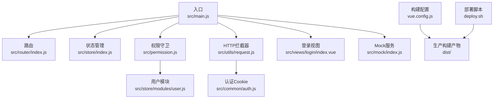
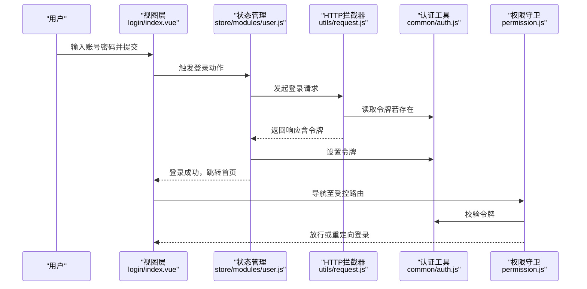
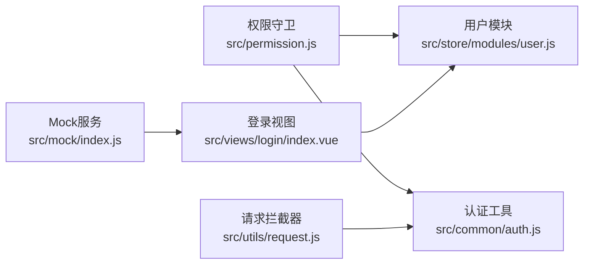

# 安全加固

<cite>
**本文引用的文件**
- [package.json](file://package.json)
- [vue.config.js](file://vue.config.js)
- [src/main.js](file://src/main.js)
- [src/utils/request.js](file://src/utils/request.js)
- [src/common/auth.js](file://src/common/auth.js)
- [src/store/modules/user.js](file://src/store/modules/user.js)
- [src/permission.js](file://src/permission.js)
- [src/views/login/index.vue](file://src/views/login/index.vue)
- [src/mock/index.js](file://src/mock/index.js)
- [deploy.sh](file://deploy.sh)
</cite>

## 目录
1. [简介](#简介)
2. [项目结构](#项目结构)
3. [核心组件](#核心组件)
4. [架构总览](#架构总览)
5. [详细组件分析](#详细组件分析)
6. [依赖关系分析](#依赖关系分析)
7. [性能考量](#性能考量)
8. [故障排查指南](#故障排查指南)
9. [结论](#结论)
10. [附录](#附录)

## 简介
本指南面向Vue CMS项目的前端侧安全加固，聚焦于内容安全策略（CSP）、跨站脚本（XSS）防护、HTTPS与证书管理、安全响应头（如HSTS、X-Frame-Options、X-Content-Type-Options）、敏感信息保护（API密钥与环境变量）、跨域资源共享（CORS）限制、安全审计与漏洞扫描方法，以及常见Web攻击（CSRF、SQL注入、文件上传）的前端协同防护要点。由于该仓库为前端工程，本文在“可落地”的范围内提供加固建议与最佳实践，涉及后端与运维的部分将以“协作”方式说明。

## 项目结构
本项目采用Vue CLI 5.x标准目录结构，前端构建与开发服务器由vue.config.js配置，运行时通过src/main.js挂载应用，业务逻辑分布在src/api、src/store、src/router、src/utils等模块中；开发阶段使用Mock服务模拟后端接口。

图表来源
- [src/main.js:1-53](file://src/main.js#L1-L53)
- [src/permission.js:1-98](file://src/permission.js#L1-L98)
- [src/utils/request.js:1-139](file://src/utils/request.js#L1-L139)
- [src/common/auth.js:1-18](file://src/common/auth.js#L1-L18)
- [src/store/modules/user.js:1-154](file://src/store/modules/user.js#L1-L154)
- [src/views/login/index.vue:1-261](file://src/views/login/index.vue#L1-L261)
- [src/mock/index.js:1-38](file://src/mock/index.js#L1-L38)
- [vue.config.js:1-144](file://vue.config.js#L1-L144)
- [deploy.sh:1-26](file://deploy.sh#L1-L26)

章节来源
- [vue.config.js:14-50](file://vue.config.js#L14-L50)
- [src/main.js:1-53](file://src/main.js#L1-L53)

## 核心组件
- 认证与会话
  - Cookie键值通过环境变量注入，令牌读取、设置、移除均通过统一工具模块实现。
- 请求拦截器
  - 统一设置基础URL、请求头、超时、语言头、GET请求防缓存参数。
- 权限守卫
  - 基于路由守卫进行登录态校验与白名单放行。
- Mock服务
  - 开发阶段提供本地接口模拟，避免真实后端依赖。
- 构建与部署
  - 生产构建关闭source map，开发服务器支持代理与跨域配置。

章节来源
- [src/common/auth.js:1-18](file://src/common/auth.js#L1-L18)
- [src/utils/request.js:1-139](file://src/utils/request.js#L1-L139)
- [src/permission.js:1-98](file://src/permission.js#L1-L98)
- [src/mock/index.js:1-38](file://src/mock/index.js#L1-L38)
- [vue.config.js:22-27](file://vue.config.js#L22-L27)
- [vue.config.js:29-50](file://vue.config.js#L29-L50)

## 架构总览
下图展示前端在登录、鉴权、请求拦截与权限控制方面的交互流程。

图表来源
- [src/views/login/index.vue:118-153](file://src/views/login/index.vue#L118-L153)
- [src/store/modules/user.js:54-74](file://src/store/modules/user.js#L54-L74)
- [src/utils/request.js:18-52](file://src/utils/request.js#L18-L52)
- [src/common/auth.js:5-15](file://src/common/auth.js#L5-L15)
- [src/permission.js:23-91](file://src/permission.js#L23-L91)

## 详细组件分析

### 内容安全策略（CSP）与XSS防护
- CSP配置
  - 当前仓库未见CSP内联策略或meta标签配置。建议在生产环境通过HTTP响应头启用严格CSP，限制脚本来源、内联脚本与eval使用，并对iframe来源进行白名单控制。
  - 前端构建产物已关闭source map，有助于降低源码泄露风险。
- XSS防护
  - 使用Element UI组件库渲染用户输入，建议避免将不可信数据直接写入DOM（如dangerouslyUseHTMLString）。对富文本编辑器输出应进行二次清理与白名单过滤。
  - 对外链与图片路径进行来源校验，避免指向不受信任的CDN或第三方域名。
- 令牌与Cookie
  - 令牌通过Cookie存储，建议配合HttpOnly、SameSite、Secure标志，防止XSS窃取与CSRF攻击。当前仓库未见安全Cookie标志设置，建议在后端统一设置。

章节来源
- [vue.config.js:27](file://vue.config.js#L27)
- [src/views/login/index.vue:155-170](file://src/views/login/index.vue#L155-L170)
- [src/common/auth.js:3](file://src/common/auth.js#L3)

### HTTPS与SSL证书管理
- 开发环境
  - 开发服务器允许所有主机访问，建议在开发阶段使用localhost或内网域名，避免暴露至公网。
- 生产环境
  - 建议强制HTTPS重定向与HSTS响应头，证书由可信CA签发并定期轮换。前端可通过CSP升级与HSTS协同提升安全性。

章节来源
- [vue.config.js:42](file://vue.config.js#L42)

### 安全响应头（HSTS、X-Frame-Options、X-Content-Type-Options）
- 建议在后端统一设置以下响应头：
  - HSTS：Strict-Transport-Security，开启并包含subdomains。
  - X-Frame-Options：DENY或SAMEORIGIN，防止点击劫持。
  - X-Content-Type-Options：nosniff，阻止MIME嗅探。
- 前端无法直接设置这些头，需与后端协作。

章节来源
- [src/utils/request.js:12-15](file://src/utils/request.js#L12-L15)

### 敏感信息保护（API密钥与环境变量）
- 环境变量
  - 基础URL与代理API通过环境变量注入，建议将密钥类信息置于后端，前端仅使用只读的公开配置。
- 构建产物
  - 生产构建关闭source map，避免泄露源码与变量名。
- 令牌管理
  - 令牌通过Cookie存储，建议后端设置HttpOnly与Secure标志，前端通过SameSite策略降低CSRF风险。

章节来源
- [vue.config.js:27](file://vue.config.js#L27)
- [src/utils/request.js:9-15](file://src/utils/request.js#L9-L15)
- [src/common/auth.js:3](file://src/common/auth.js#L3)

### 跨域资源共享（CORS）与安全限制
- 开发代理
  - 开发服务器配置了代理，将前端请求转发至后端API，避免浏览器同源策略限制。
- 生产环境
  - CORS由后端统一控制，前端需遵循后端的Access-Control-Allow-Origin、Allow-Headers、Allow-Methods等策略。避免使用通配符Origin与Credentials组合，除非明确必要。

章节来源
- [vue.config.js:33-41](file://vue.config.js#L33-L41)

### 权限控制与路由守卫
- 白名单机制
  - 登录、重定向等页面加入白名单，无令牌时可直接访问。
- 动态路由
  - 登录成功后根据权限生成动态路由并注入，避免越权访问。
- 令牌失效处理
  - 对特定错误码触发重新登录流程，清理会话并刷新页面。

章节来源
- [src/permission.js:20](file://src/permission.js#L20)
- [src/permission.js:29-91](file://src/permission.js#L29-L91)
- [src/store/modules/user.js:91-110](file://src/store/modules/user.js#L91-L110)

### 请求拦截器与超时控制
- 请求头
  - 统一设置Content-Type、语言头与缓存控制，GET请求附加时间戳参数防止缓存。
- 错误处理
  - 对超时、网络错误与业务错误进行分类提示，避免将错误信息直接暴露给用户。

章节来源
- [src/utils/request.js:18-52](file://src/utils/request.js#L18-L52)
- [src/utils/request.js:55-136](file://src/utils/request.js#L55-L136)

### Mock服务与开发安全
- Mock服务用于开发阶段快速迭代，建议在生产构建中禁用Mock，避免与真实后端混淆。
- 开发阶段注意不要在Mock中输出敏感数据。

章节来源
- [src/mock/index.js:1-38](file://src/mock/index.js#L1-L38)
- [src/main.js:34](file://src/main.js#L34)

### 登录流程与本地存储
- 登录成功后可选择记住账号密码，但不建议在本地明文存储密码。建议仅存储令牌与必要标识。
- 登录页使用通知组件提示账号信息，注意不要在生产环境暴露默认凭证。

章节来源
- [src/views/login/index.vue:118-153](file://src/views/login/index.vue#L118-L153)
- [src/views/login/index.vue:155-170](file://src/views/login/index.vue#L155-L170)

### 部署与静态资源安全
- 构建产物位于dist目录，部署时建议启用压缩与缓存控制，同时确保静态资源不可执行。
- 部署脚本使用GitHub Pages发布，注意分支与推送目标的安全性。

章节来源
- [vue.config.js:23-24](file://vue.config.js#L23-L24)
- [deploy.sh:6-25](file://deploy.sh#L6-L25)

## 依赖关系分析
- 组件耦合
  - 权限守卫依赖认证工具与状态管理；请求拦截器依赖认证工具与国际化；登录视图依赖状态管理与本地存储。
- 外部依赖
  - Axios用于HTTP请求；Element UI用于界面组件；Mock用于开发模拟；js-cookie用于令牌存储。

图表来源
- [src/permission.js:1-98](file://src/permission.js#L1-L98)
- [src/common/auth.js:1-18](file://src/common/auth.js#L1-L18)
- [src/store/modules/user.js:1-154](file://src/store/modules/user.js#L1-L154)
- [src/utils/request.js:1-139](file://src/utils/request.js#L1-L139)
- [src/views/login/index.vue:1-261](file://src/views/login/index.vue#L1-L261)
- [src/mock/index.js:1-38](file://src/mock/index.js#L1-L38)

## 性能考量
- 生产构建关闭source map，减少体积与泄露风险。
- 预加载与预取插件按需启用，避免对首屏性能产生反效果。
- 图片与字体资源建议CDN分发并开启缓存控制。

章节来源
- [vue.config.js:27](file://vue.config.js#L27)
- [vue.config.js:66-88](file://vue.config.js#L66-L88)

## 故障排查指南
- 登录失败
  - 检查基础URL与代理配置是否正确；确认后端返回的令牌格式与有效期。
- 路由跳转异常
  - 查看权限守卫中的白名单与动态路由生成逻辑；确认会话存储中的用户路由是否存在。
- 请求超时或网络错误
  - 检查拦截器中的超时设置与错误提示；确认后端接口可达性。
- Mock冲突
  - 确认生产构建已禁用Mock；避免与真实后端接口混淆。

章节来源
- [vue.config.js:33-41](file://vue.config.js#L33-L41)
- [src/permission.js:20-91](file://src/permission.js#L20-L91)
- [src/utils/request.js:110-135](file://src/utils/request.js#L110-L135)
- [src/mock/index.js:16-34](file://src/mock/index.js#L16-L34)

## 结论
本指南基于现有代码库提出了前端侧可立即落地的安全加固建议，重点覆盖CSP与XSS、HTTPS与安全头、敏感信息保护、CORS限制、权限控制与请求拦截等方面。对于无法在前端直接实现的安全头与证书管理，建议与后端团队协作完善。通过持续的安全审计与漏洞扫描，结合严格的开发与发布流程，可显著提升Vue CMS的整体安全性。

## 附录

### 安全配置检查清单
- [ ] 启用并验证CSP响应头（限制脚本来源、内联脚本、eval）
- [ ] 启用HSTS、X-Frame-Options、X-Content-Type-Options
- [ ] Cookie设置HttpOnly、Secure、SameSite
- [ ] 生产构建关闭source map
- [ ] 强制HTTPS与证书轮换
- [ ] CORS策略最小授权，避免通配符Origin与Credentials混用
- [ ] 令牌与密钥仅在后端管理，前端仅使用只读配置
- [ ] 对富文本输出进行白名单清理
- [ ] 登录页默认凭证仅用于演示，生产禁用
- [ ] 部署脚本与分支权限最小化

### 常见Web攻击防护要点（前端协同）
- CSRF
  - 前端通过SameSite Cookie与后端CSRF Token协同；避免GET请求副作用。
- SQL注入
  - 前端不直接拼接SQL，仅传递参数；后端严格参数化查询。
- 文件上传
  - 前端限制文件类型与大小；后端严格校验与隔离存储。