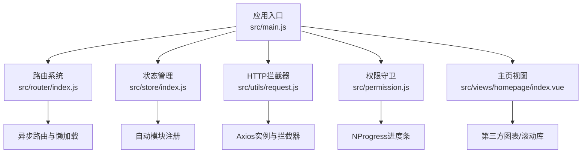
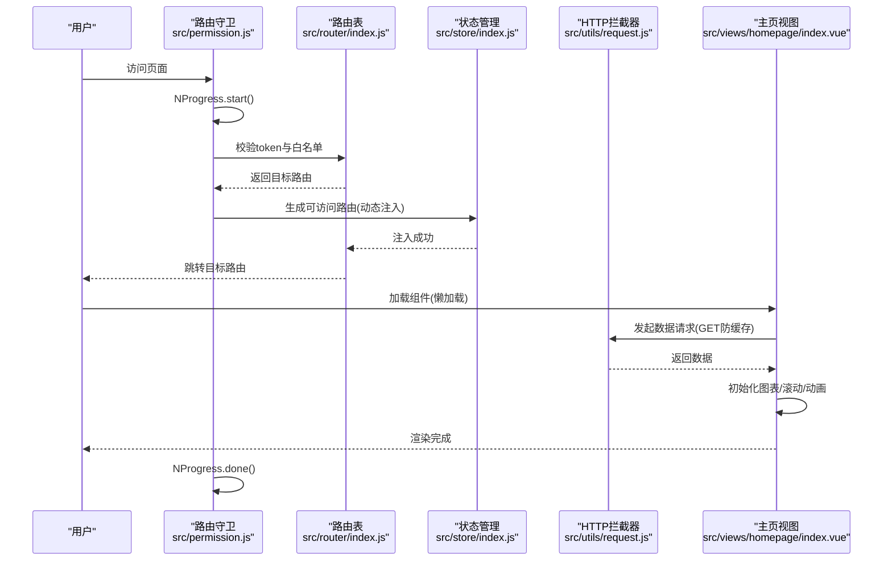
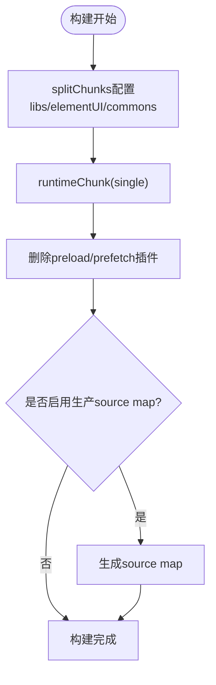
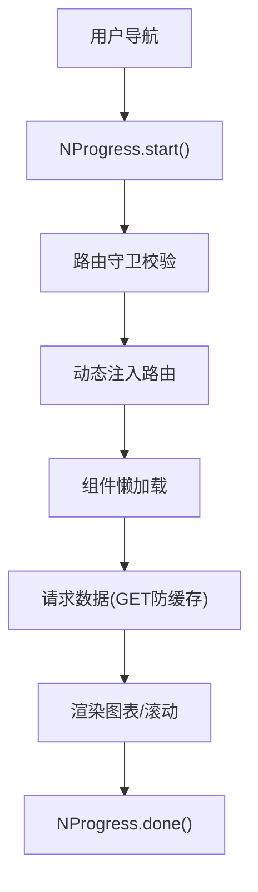
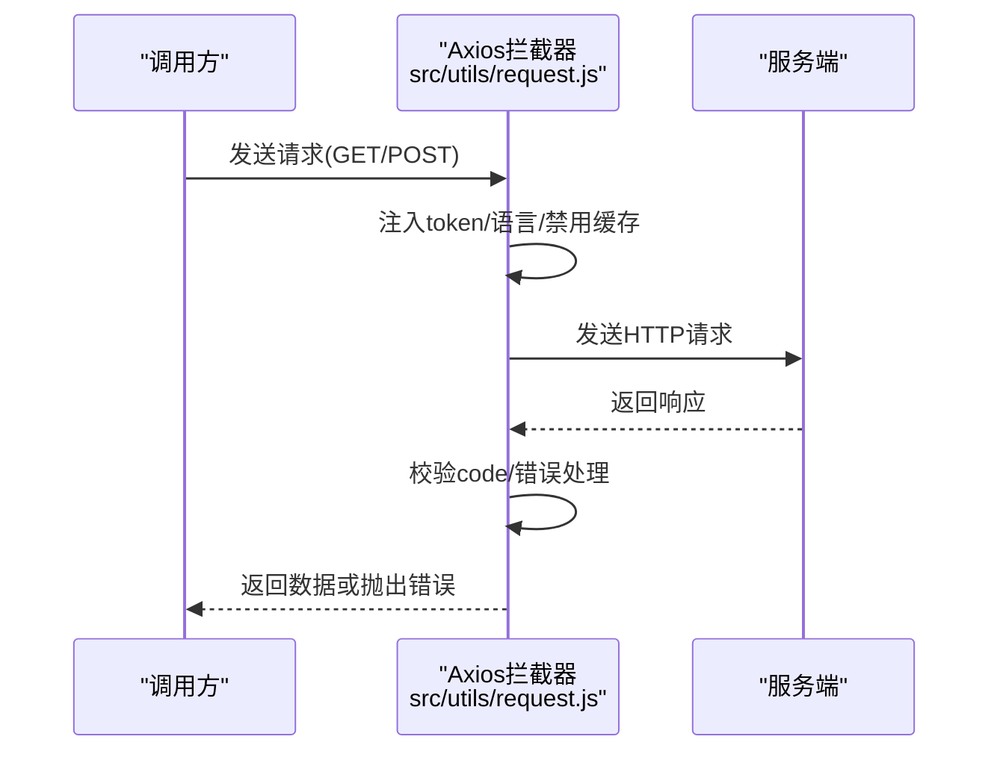
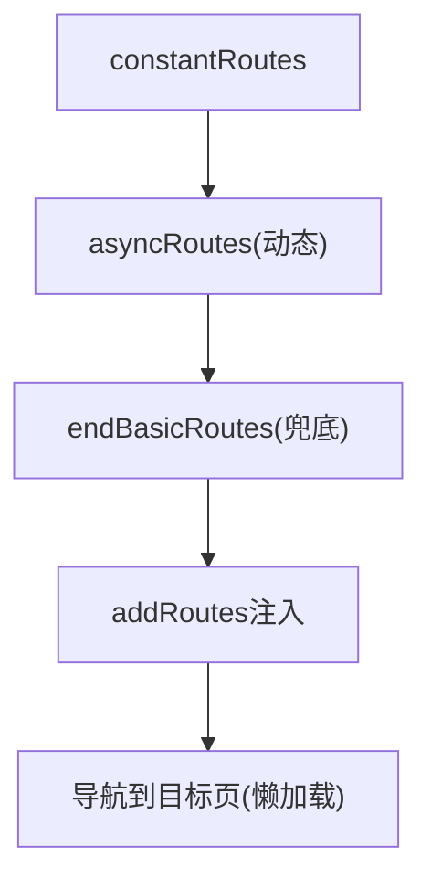
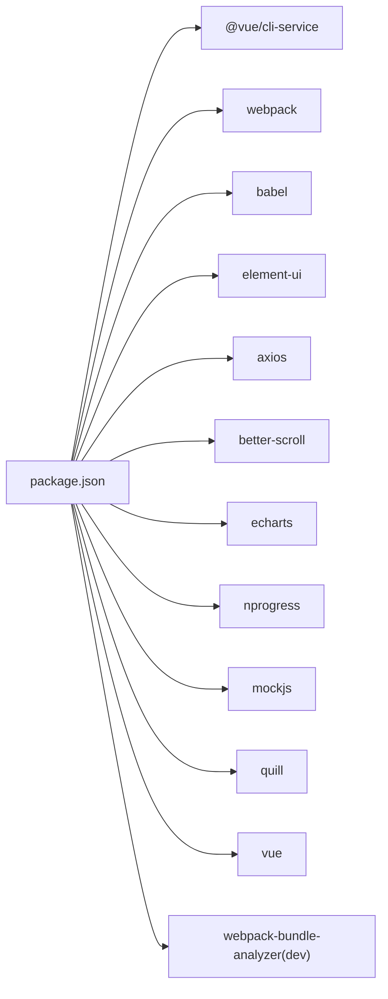

# 性能监控

<cite>
**本文引用的文件**
- [package.json](file://package.json)
- [vue.config.js](file://vue.config.js)
- [babel.config.js](file://babel.config.js)
- [src/main.js](file://src/main.js)
- [src/router/index.js](file://src/router/index.js)
- [src/store/index.js](file://src/store/index.js)
- [src/utils/request.js](file://src/utils/request.js)
- [src/permission.js](file://src/permission.js)
- [src/views/homepage/index.vue](file://src/views/homepage/index.vue)
- [src/common/auth.js](file://src/common/auth.js)
- [src/assets/style/index.scss](file://src/assets/style/index.scss)
</cite>

## 目录
1. [简介](#简介)
2. [项目结构](#项目结构)
3. [核心组件](#核心组件)
4. [架构总览](#架构总览)
5. [详细组件分析](#详细组件分析)
6. [依赖分析](#依赖分析)
7. [性能考量](#性能考量)
8. [故障排查指南](#故障排查指南)
9. [结论](#结论)
10. [附录](#附录)

## 简介
本指南面向Vue CMS项目的性能监控与优化，围绕构建期与运行期两条主线展开：构建期重点覆盖打包体积分析与分包策略；运行期聚焦页面加载、首屏渲染与交互响应的监控与优化。同时提供PWA与离线缓存思路、性能指标定义与告警建议、以及常见性能问题的诊断与修复路径。

## 项目结构
本项目采用Vue CLI脚手架工程化组织，核心入口为应用挂载点与路由、状态管理、HTTP拦截器、权限守卫等模块。构建配置集中在vue.config.js中，通过splitChunks与runtimeChunk实现分包与运行时拆分；Babel配置启用按需polyfill以降低体积。

**图示来源**
- [src/main.js:1-53](file://src/main.js#L1-L53)
- [src/router/index.js:1-343](file://src/router/index.js#L1-L343)
- [src/store/index.js:1-74](file://src/store/index.js#L1-L74)
- [src/utils/request.js:1-139](file://src/utils/request.js#L1-L139)
- [src/permission.js:1-98](file://src/permission.js#L1-L98)
- [src/views/homepage/index.vue:1-654](file://src/views/homepage/index.vue#L1-L654)

**章节来源**
- [src/main.js:1-53](file://src/main.js#L1-L53)
- [vue.config.js:14-144](file://vue.config.js#L14-L144)
- [babel.config.js:1-12](file://babel.config.js#L1-L12)

## 核心组件
- 应用入口与全局插件：Element UI、国际化、通知组件、Mock数据、全局样式等。
- 路由系统：常量路由、动态路由与末尾兜底路由，配合懒加载组件。
- 状态管理：自动扫描modules目录，集中getters便于跨模块取值。
- HTTP层：Axios实例封装，请求/响应拦截，GET防缓存策略与错误处理。
- 权限与导航：路由守卫、NProgress进度条、白名单控制。
- 主页视图：图表与滚动库集成，计数动画与滚动初始化，生命周期内存释放。

**章节来源**
- [src/main.js:1-53](file://src/main.js#L1-L53)
- [src/router/index.js:1-343](file://src/router/index.js#L1-L343)
- [src/store/index.js:1-74](file://src/store/index.js#L1-L74)
- [src/utils/request.js:1-139](file://src/utils/request.js#L1-L139)
- [src/permission.js:1-98](file://src/permission.js#L1-L98)
- [src/views/homepage/index.vue:176-277](file://src/views/homepage/index.vue#L176-L277)

## 架构总览
下图展示从用户访问到首屏渲染的关键链路，涵盖路由守卫、动态路由注入、组件懒加载、HTTP请求与图表渲染等环节。

**图示来源**
- [src/permission.js:23-97](file://src/permission.js#L23-L97)
- [src/router/index.js:322-342](file://src/router/index.js#L322-L342)
- [src/store/index.js:10-17](file://src/store/index.js#L10-L17)
- [src/utils/request.js:17-52](file://src/utils/request.js#L17-L52)
- [src/views/homepage/index.vue:233-264](file://src/views/homepage/index.vue#L233-L264)

## 详细组件分析

### 组件A：构建与分包策略
- 分包策略：通过splitChunks将node_modules、Element UI与公共组件分别打包，提升缓存命中率与并行加载效率。
- 运行时拆分：runtimeChunk设为single，避免每次业务变更导致长缓存失效。
- 预加载/预取：默认删除preload与prefetch插件，避免多页面场景下的无效请求；可根据实际页面数量评估是否开启preload。
- 生产source map：关闭以缩短构建时间并减小产物体积。

**图示来源**
- [vue.config.js:116-141](file://vue.config.js#L116-L141)

**章节来源**
- [vue.config.js:14-144](file://vue.config.js#L14-L144)

### 组件B：运行时性能监控（页面加载/首屏/交互）
- 页面加载与首屏：利用路由守卫中的NProgress进行导航阶段的可见进度反馈；结合浏览器Performance API与Web Vitals指标采集首屏时间（FCP/LCP）与导航耗时。
- 交互响应：对高频事件（滚动、点击）使用节流/防抖；组件销毁时及时清理第三方实例（如better-scroll）以避免内存泄漏。
- 图表与滚动：在mounted后初始化，updated时避免重复初始化；必要时在beforeDestroy中销毁实例。

**图示来源**
- [src/permission.js:23-97](file://src/permission.js#L23-L97)
- [src/views/homepage/index.vue:210-231](file://src/views/homepage/index.vue#L210-L231)

**章节来源**
- [src/permission.js:14-17](file://src/permission.js#L14-L17)
- [src/views/homepage/index.vue:267-271](file://src/views/homepage/index.vue#L267-L271)

### 组件C：HTTP请求与缓存策略
- Axios实例：统一基地址、超时、请求头设置；GET请求附加时间戳参数以规避缓存。
- 响应拦截：根据自定义code判定业务状态，错误提示与登出流程；网络异常与超时提示。
- 与权限：结合token与白名单，确保未登录用户无法访问受保护路由。

**图示来源**
- [src/utils/request.js:17-52](file://src/utils/request.js#L17-L52)
- [src/utils/request.js:54-136](file://src/utils/request.js#L54-L136)

**章节来源**
- [src/utils/request.js:1-139](file://src/utils/request.js#L1-L139)
- [src/common/auth.js:1-18](file://src/common/auth.js#L1-L18)

### 组件D：路由与懒加载
- 路由表：常量路由、动态路由与末尾兜底路由三段式设计；动态路由按需注入。
- 懒加载：所有页面组件均使用动态import实现按需加载，减少首屏JS体积。
- 重置路由：提供resetRouter能力，配合权限变更重新注入路由。

**图示来源**
- [src/router/index.js:43-111](file://src/router/index.js#L43-L111)
- [src/router/index.js:118-320](file://src/router/index.js#L118-L320)
- [src/router/index.js:322-342](file://src/router/index.js#L322-L342)

**章节来源**
- [src/router/index.js:1-343](file://src/router/index.js#L1-L343)

### 组件E：状态管理与自动模块注册
- 自动扫描：通过require.context自动导入modules目录下的子模块，减少手动维护成本。
- Getters集中：提供统一getters便于跨模块取值，降低耦合。

**章节来源**
- [src/store/index.js:10-73](file://src/store/index.js#L10-L73)

## 依赖分析
- 第三方库：Element UI、Axios、better-scroll、countup.js、echarts、mockjs、nprogress、quill、vue等。
- 构建工具：@vue/cli-service、webpack、babel、svg-sprite-loader等。
- 性能相关：webpack-bundle-analyzer（用于体积分析）。

**图示来源**
- [package.json:33-64](file://package.json#L33-L64)
- [package.json:65-84](file://package.json#L65-L84)

**章节来源**
- [package.json:1-99](file://package.json#L1-L99)

## 性能考量
- 构建期
  - 使用webpack-bundle-analyzer生成报告，识别大体积依赖与重复模块，针对性优化分包策略。
  - 保持productionSourceMap关闭以减少构建与产物体积。
  - 评估是否开启preload以优化首屏关键资源加载。
- 运行期
  - 首屏渲染：减少首屏组件数量与复杂度，延迟非关键资源；对图表组件采用懒初始化。
  - 交互响应：对滚动、搜索等高频事件使用节流/防抖；组件销毁时释放第三方实例。
  - 缓存策略：GET请求已加入防缓存参数；可结合Service Worker实现离线缓存与渐进式增强（见附录）。
- 样式与资源
  - 全局样式按需引入，避免冗余；SVG使用svg-sprite-loader统一管理。

**章节来源**
- [vue.config.js:26-27](file://vue.config.js#L26-L27)
- [vue.config.js:66-87](file://vue.config.js#L66-L87)
- [src/views/homepage/index.vue:210-231](file://src/views/homepage/index.vue#L210-L231)
- [src/utils/request.js:34-43](file://src/utils/request.js#L34-L43)

## 故障排查指南
- 首屏慢
  - 检查是否存在大组件未懒加载；确认分包策略是否合理；使用分析工具定位瓶颈模块。
- 交互卡顿
  - 检查是否有频繁DOM操作或未释放的第三方实例；确认节流/防抖是否正确使用。
- 资源加载失败
  - 核对Axios拦截器的错误处理与白名单配置；检查NProgress与路由守卫的执行顺序。
- 内存泄漏
  - 在组件销毁钩子中销毁第三方实例（如better-scroll）；避免在组件外持有DOM引用。

**章节来源**
- [src/views/homepage/index.vue:267-271](file://src/views/homepage/index.vue#L267-L271)
- [src/utils/request.js:108-136](file://src/utils/request.js#L108-L136)
- [src/permission.js:93-97](file://src/permission.js#L93-L97)

## 结论
通过合理的构建分包、运行期监控与优化策略，以及规范的生命周期资源管理，Vue CMS项目可在保证功能完整性的同时显著提升性能体验。建议持续使用体积分析工具与Web Vitals指标进行迭代优化，并结合Service Worker实现PWA与离线缓存能力。

## 附录
- 性能指标定义与监控告警
  - 首屏时间（FCP/LCP）、导航时间（Navigation Timing）、交互延迟（INP）等Web Vitals指标建议接入前端监控SDK并设置阈值告警。
- PWA与离线缓存
  - 可引入workbox或sw-toolbox，在构建阶段生成Service Worker，对静态资源与API响应进行缓存；结合manifest实现应用安装与离线可用性。
- Bundle Analyzer使用建议
  - 在CI中生成并对比分析报告，关注vendor与业务代码占比变化，及时调整splitChunks策略。