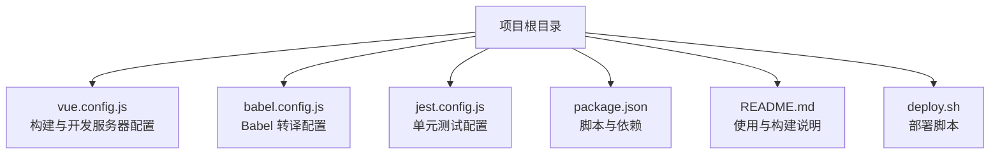
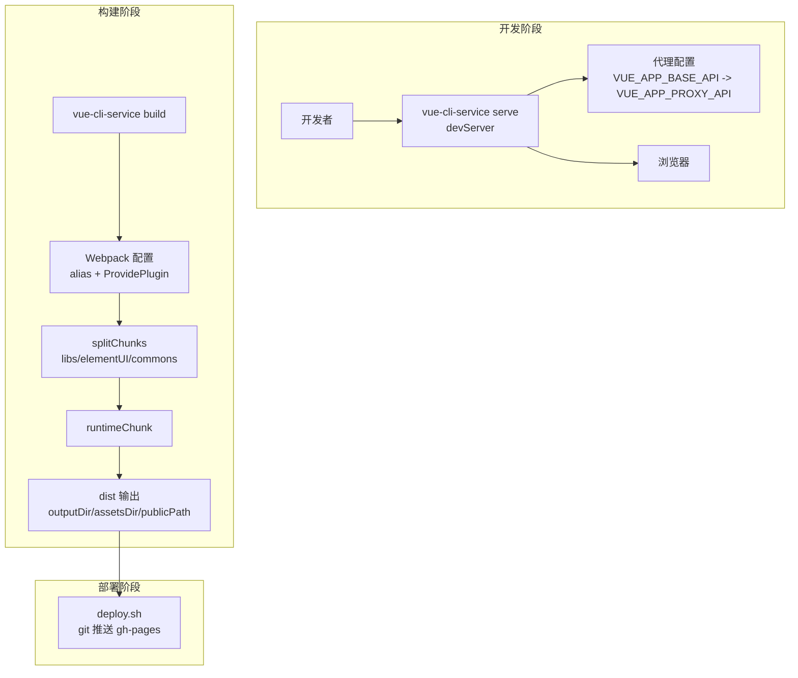
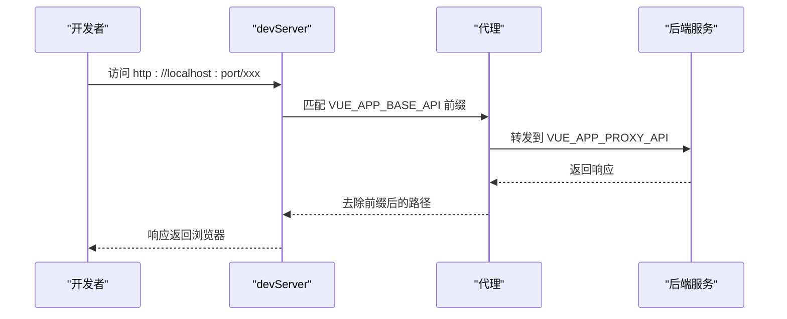
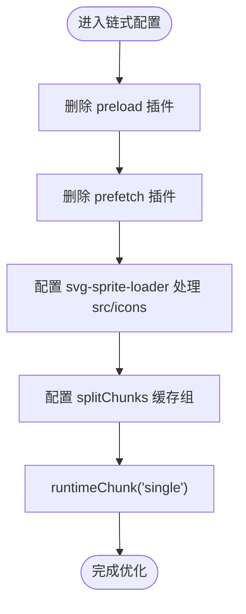
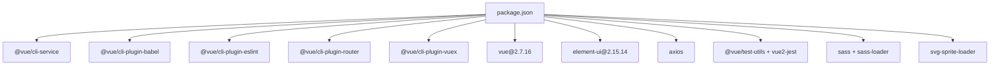

# 构建配置

<cite>
**本文引用的文件**
- [vue.config.js](file://vue.config.js)
- [babel.config.js](file://babel.config.js)
- [package.json](file://package.json)
- [README.md](file://README.md)
- [deploy.sh](file://deploy.sh)
- [jest.config.js](file://jest.config.js)
</cite>

## 目录
1. [简介](#简介)
2. [项目结构](#项目结构)
3. [核心组件](#核心组件)
4. [架构总览](#架构总览)
5. [详细组件分析](#详细组件分析)
6. [依赖关系分析](#依赖关系分析)
7. [性能考量](#性能考量)
8. [故障排查指南](#故障排查指南)
9. [结论](#结论)
10. [附录](#附录)

## 简介
本文件系统性梳理 Vue CMS 项目的构建配置与优化实践，重点围绕以下方面展开：
- vue.config.js 中的路径与开发服务器配置（publicPath、outputDir、assetsDir、devServer、代理、热重载等）
- Webpack 优化策略（代码分割、缓存、运行时文件处理）
- Babel 转译与 polyfill 配置
- ESLint 规则与脚本集成
- 生产环境构建优化建议（压缩、去重、性能调优）
- 构建产物分析与体积优化方法

## 项目结构
本项目采用 Vue CLI 5.x 脚手架，核心构建配置集中在 vue.config.js，转译与测试配置分别位于 babel.config.js 与 jest.config.js，构建脚本与环境变量由 package.json 与 README.md 提供上下文。

**章节来源**
- [README.md: 39-72:39-72](file://README.md#L39-L72)
- [package.json: 24-32:24-32](file://package.json#L24-L32)

## 核心组件
本节聚焦 vue.config.js 的关键配置项及其作用：

- 路径与输出
  - publicPath：用于部署子路径或 CDN 场景的公共路径前缀，默认值为“/”，当前项目设置为“./”，适配相对路径部署。
  - outputDir：生产构建输出目录，默认 dist，当前项目保持默认。
  - assetsDir：静态资源目录，默认 static，当前项目保持默认。
  - lintOnSave：开发环境下保存时进行代码风格检查，当前项目按 NODE_ENV 控制。
  - productionSourceMap：生产环境关闭 Source Map，提升构建速度与安全性。

- 开发服务器（devServer）
  - host：绑定主机地址，当前为 0.0.0.0，便于局域网访问。
  - port：监听端口，优先从环境变量读取，否则默认 8888。
  - open：启动后自动打开浏览器。
  - proxy：基于环境变量 VUE_APP_BASE_API 与 VUE_APP_PROXY_API 实现代理转发，支持路径重写。
  - allowedHosts：允许所有主机，便于容器化或特殊网络环境。
  - client.overlay：控制编译错误覆盖层显示，仅显示错误，不显示警告。

- Webpack 注入与别名
  - configureWebpack.resolve.alias：将 @ 映射到 src 目录，简化导入路径。
  - ProvidePlugin：全局注入 Quill 富文本编辑器，避免各处重复引入。

- 链式配置（chainWebpack）
  - 删除 preload 与 prefetch 插件，避免多余请求。
  - SVG 图标：排除默认 svg 处理，使用 svg-sprite-loader 处理 src/icons 下的 SVG，并以 icon-[name] 作为符号 ID。
  - 生产环境优化：
    - splitChunks：按 chunks、cacheGroups 策略拆分第三方库、Element UI 与通用组件，提升缓存命中率。
    - runtimeChunk：将运行时抽离为独立 chunk，利于长期缓存。

**章节来源**
- [vue.config.js: 14-144:14-144](file://vue.config.js#L14-L144)

## 架构总览
下图展示从开发到生产的整体流程，以及关键配置点如何影响构建结果。

**图示来源**
- [vue.config.js: 29-65:29-65](file://vue.config.js#L29-L65)
- [vue.config.js: 104-141:104-141](file://vue.config.js#L104-L141)
- [deploy.sh: 6-25:6-25](file://deploy.sh#L6-L25)

## 详细组件分析

### 路径与输出配置
- publicPath：当前设置为“./”，适合相对路径部署；若部署到子路径或 CDN，需根据实际路径调整。
- outputDir：默认 dist，无需修改。
- assetsDir：默认 static，便于区分业务资源与构建产物。
- lintOnSave：开发环境启用，有助于即时发现风格问题。
- productionSourceMap：关闭以提升构建速度与安全性。

**章节来源**
- [vue.config.js: 22-27:22-27](file://vue.config.js#L22-L27)

### 开发服务器与代理
- 主机与端口：host 为 0.0.0.0，port 从环境变量读取，便于团队协作与容器化。
- 自动打开：open 为 true，提升开发体验。
- 代理规则：基于两个环境变量动态配置，支持路径重写，将带前缀的 API 请求转发至目标地址。
- 错误覆盖层：仅显示错误，避免干扰。

**图示来源**
- [vue.config.js: 33-41:33-41](file://vue.config.js#L33-L41)

**章节来源**
- [vue.config.js: 30-50:30-50](file://vue.config.js#L30-L50)

### Webpack 优化与运行时处理
- 代码分割（splitChunks）
  - libs：抽取 node_modules 中的第三方依赖，优先级较高。
  - elementUI：单独拆分 Element UI，避免与业务代码混合。
  - commons：抽取 src/components 下复用组件，设置最小引用次数，提升缓存命中。
- 运行时文件（runtimeChunk）
  - 单独提取运行时，降低主包体积，提升长期缓存效果。
- 预加载与预取
  - 显式删除 preload 与 prefetch 插件，避免在多页面场景下产生无效请求。

**图示来源**
- [vue.config.js: 79-87:79-87](file://vue.config.js#L79-L87)
- [vue.config.js: 89-102:89-102](file://vue.config.js#L89-L102)
- [vue.config.js: 116-141:116-141](file://vue.config.js#L116-L141)

**章节来源**
- [vue.config.js: 66-142:66-142](file://vue.config.js#L66-L142)

### Babel 转译与 Polyfill
- 预设：使用 @vue/cli-plugin-babel/preset，结合 useBuiltIns 与 core-js 版本控制。
- useBuiltIns：支持“entry”或“usage”，推荐“usage”以按需注入 polyfill，减小体积。
- core-js：指定版本，确保兼容性与稳定性。

**章节来源**
- [babel.config.js: 1-12:1-12](file://babel.config.js#L1-L12)

### ESLint 规则与脚本
- 依赖：项目包含 @vue/cli-plugin-eslint 与相关生态依赖，保证与 Vue CLI 的一致性。
- 规则：通过 @vue/eslint-config-prettier 与 eslint-plugin-prettier 实现 Prettier 与 ESLint 的协同，避免格式冲突。
- 脚本：提供 lint 与 lint-fix，便于在 CI/CD 中统一校验与修复。

**章节来源**
- [package.json: 67-83:67-83](file://package.json#L67-L83)

### 测试配置
- Jest 预设：使用 @vue/cli-plugin-unit-jest，简化 Vue 2 组件的单元测试配置。

**章节来源**
- [jest.config.js: 1-4:1-4](file://jest.config.js#L1-L4)

## 依赖关系分析
- 构建工具链
  - @vue/cli-service：提供 serve/build/lint/test 等命令与底层 Webpack 配置。
  - @vue/cli-plugin-babel、@vue/cli-plugin-eslint、@vue/cli-plugin-router、@vue/cli-plugin-vuex：扩展能力插件。
- 运行时依赖
  - vue、vue-router、vuex、element-ui、axios 等：业务核心库。
- 开发依赖
  - sass、sass-loader、svg-sprite-loader：样式与图标处理。
  - @vue/test-utils、@vue/vue2-jest：单元测试。
- 浏览器兼容
  - browserslist：面向现代浏览器与 IE10+ 的兼容范围。

**图示来源**
- [package.json: 33-84:33-84](file://package.json#L33-L84)

**章节来源**
- [package.json: 33-98:33-98](file://package.json#L33-L98)

## 性能考量
- 代码分割
  - 使用 splitChunks 将第三方库、UI 组件与通用组件拆分为独立 chunk，配合 runtimeChunk 提升缓存命中率。
- 资源处理
  - SVG 图标使用 svg-sprite-loader，减少 HTTP 请求与体积。
- 预加载与预取
  - 删除 preload 与 prefetch 插件，避免在多页面场景下的无效请求。
- Source Map
  - 生产环境关闭，减少体积与构建时间。
- Babel 与 Polyfill
  - useBuiltIns: usage 按需注入，降低冗余 polyfill。
- 浏览器兼容
  - 合理的 browserslist 配置，避免过度兼容导致的体积膨胀。

**章节来源**
- [vue.config.js: 116-141:116-141](file://vue.config.js#L116-L141)
- [babel.config.js: 6-8:6-8](file://babel.config.js#L6-L8)
- [package.json: 92-97:92-97](file://package.json#L92-L97)

## 故障排查指南
- 代理不生效
  - 检查环境变量 VUE_APP_BASE_API 与 VUE_APP_PROXY_API 是否正确设置。
  - 确认 devServer.proxy 的键名与路径重写规则一致。
- 端口占用
  - 修改环境变量 PORT 或更换端口，确保端口可用。
- 热重载失效
  - 检查 allowedHosts 与 host 设置，确保浏览器可访问。
  - 若使用代理，确认代理目标可达且未开启跨域限制。
- 构建体积过大
  - 使用生产构建参数生成报告，定位大体积模块。
  - 调整 splitChunks 策略与缓存组，确保关键依赖稳定缓存。
- 部署失败
  - 确认 dist 目录已生成，deploy.sh 脚本中 git remote 地址与权限正确。

**章节来源**
- [vue.config.js: 33-41:33-41](file://vue.config.js#L33-L41)
- [vue.config.js: 104-141:104-141](file://vue.config.js#L104-L141)
- [deploy.sh: 6-25:6-25](file://deploy.sh#L6-L25)

## 结论
本项目的构建配置在路径、开发服务器、Webpack 优化与转译方面形成了完整的体系：通过合理的 publicPath 与输出目录设置，配合 devServer 代理与热重载，显著提升开发效率；借助 splitChunks 与 runtimeChunk，在生产环境实现更优的缓存与加载性能；Babel 与 ESLint 的组合保障了代码质量与兼容性。建议在后续迭代中持续关注体积分析与缓存策略，以进一步优化用户体验。

## 附录
- 构建与部署脚本
  - 构建：npm run build
  - 生成报告：npm run build --report
  - 部署：bash ./deploy.sh

**章节来源**
- [README.md: 61-72:61-72](file://README.md#L61-L72)
- [deploy.sh: 6-25:6-25](file://deploy.sh#L6-L25)