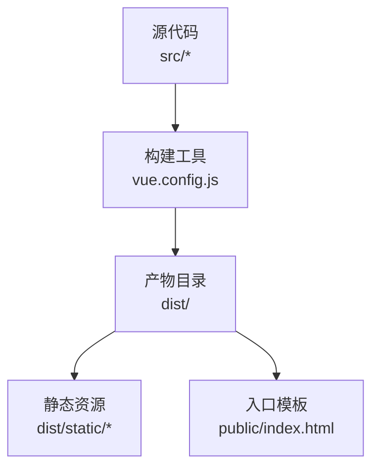
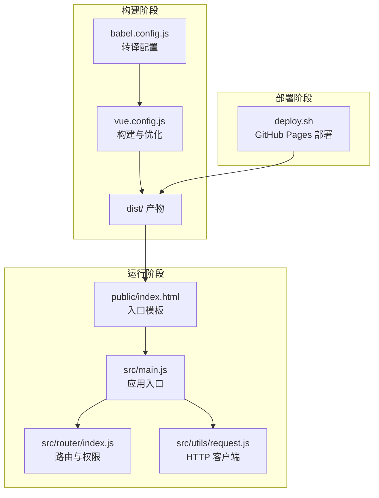
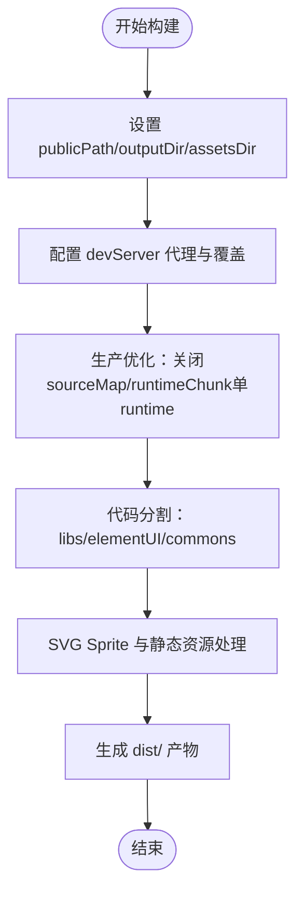
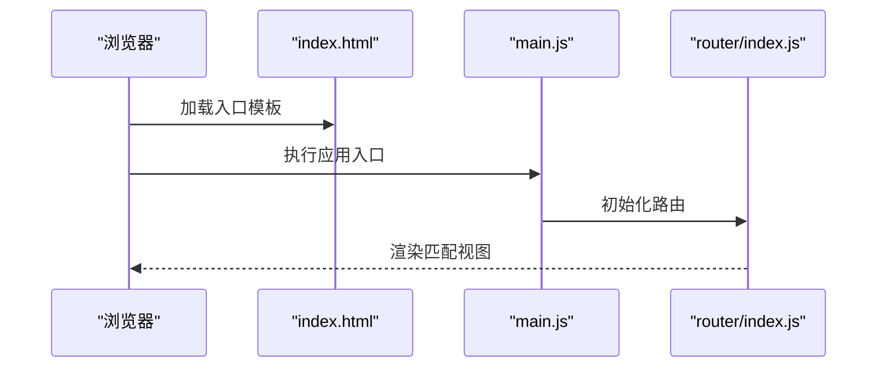
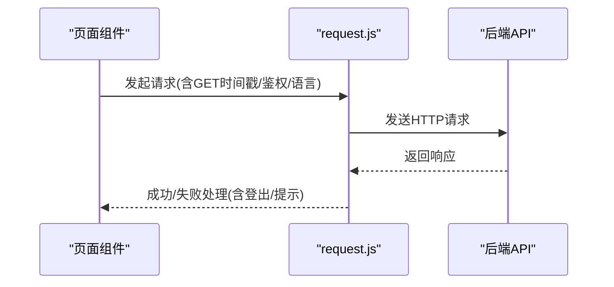
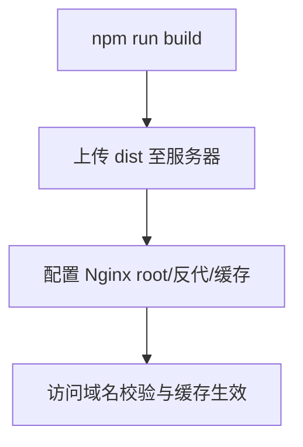
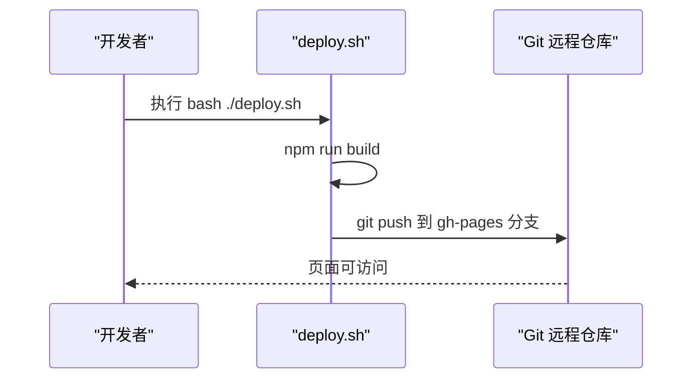
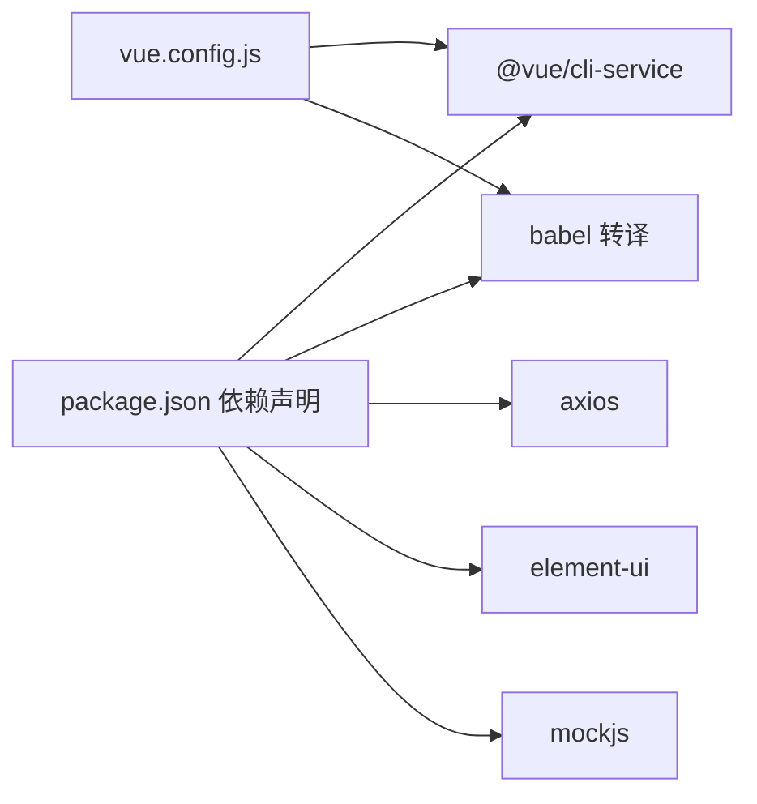

# 部署指南

<cite>
**本文引用的文件**
- [package.json](file://package.json)
- [vue.config.js](file://vue.config.js)
- [babel.config.js](file://babel.config.js)
- [public/index.html](file://public/index.html)
- [src/main.js](file://src/main.js)
- [src/router/index.js](file://src/router/index.js)
- [src/utils/request.js](file://src/utils/request.js)
- [deploy.sh](file://deploy.sh)
- [README.md](file://README.md)
</cite>

## 目录
1. [简介](#简介)
2. [项目结构](#项目结构)
3. [核心组件](#核心组件)
4. [架构总览](#架构总览)
5. [详细组件分析](#详细组件分析)
6. [依赖关系分析](#依赖关系分析)
7. [性能考量](#性能考量)
8. [故障排除指南](#故障排除指南)
9. [结论](#结论)
10. [附录](#附录)

## 简介
本指南面向运维与开发团队，提供 Vue CMS 项目的完整部署方案，涵盖生产构建配置、静态资源与缓存策略、代码分割优化、多部署方案（Nginx、GitHub Pages）、环境变量与敏感信息保护、CDN 与 HTTPS 安全加固、性能监控与日志收集、版本管理与回滚策略，以及部署检查清单与常见问题诊断。

## 项目结构
- 构建产物输出至 dist，静态资源位于 dist/static。
- 开发服务器代理配置基于环境变量 VUE_APP_BASE_API 与 VUE_APP_PROXY_API。
- 生产环境关闭 source map，提升构建速度与安全性。
- 通过链式配置禁用 preload/prefetch，按需使用 SVG Sprite Loader 优化图标体积。

**图表来源**
- [vue.config.js:14-28](file://vue.config.js#L14-L28)
- [vue.config.js:104-141](file://vue.config.js#L104-L141)
- [public/index.html:1-21](file://public/index.html#L1-L21)

**章节来源**
- [vue.config.js:14-28](file://vue.config.js#L14-L28)
- [vue.config.js:104-141](file://vue.config.js#L104-L141)
- [public/index.html:1-21](file://public/index.html#L1-L21)

## 核心组件
- 构建配置与优化
  - publicPath 使用相对路径，便于子路径部署与 CDN 替换。
  - 关闭生产 source map，提升构建速度与安全性。
  - 代码分割：第三方库、Element UI、通用组件拆分，runtime 单独提取。
  - 禁用 preload/prefetch，避免首屏无关资源占用带宽。
  - SVG 图标使用 sprite loader，减少 HTTP 请求。
- 运行时入口与路由
  - 应用入口引入 Element UI、国际化、全局样式与 Mock 数据。
  - 路由采用异步加载与嵌套路由，支持权限控制与 keep-alive 缓存。
- 请求拦截与环境变量
  - Axios 实例通过环境变量注入 API 基础地址。
  - 请求头携带鉴权与语言信息，GET 请求附加时间戳参数防止缓存。

**章节来源**
- [vue.config.js:22](file://vue.config.js#L22)
- [vue.config.js:27](file://vue.config.js#L27)
- [vue.config.js:116-141](file://vue.config.js#L116-L141)
- [vue.config.js:89-102](file://vue.config.js#L89-L102)
- [src/main.js:16-42](file://src/main.js#L16-L42)
- [src/router/index.js:43-111](file://src/router/index.js#L43-L111)
- [src/utils/request.js:8-15](file://src/utils/request.js#L8-L15)
- [src/utils/request.js:24-32](file://src/utils/request.js#L24-L32)
- [src/utils/request.js:34-43](file://src/utils/request.js#L34-L43)

## 架构总览
下图展示从构建到运行的关键流程与组件交互。

**图表来源**
- [vue.config.js:14-28](file://vue.config.js#L14-L28)
- [babel.config.js:1-12](file://babel.config.js#L1-L12)
- [public/index.html:1-21](file://public/index.html#L1-L21)
- [src/main.js:1-53](file://src/main.js#L1-L53)
- [src/router/index.js:1-343](file://src/router/index.js#L1-L343)
- [src/utils/request.js:1-139](file://src/utils/request.js#L1-L139)
- [deploy.sh:1-26](file://deploy.sh#L1-L26)

## 详细组件分析

### 构建与优化配置
- 输出与资源目录
  - outputDir: dist
  - assetsDir: static
  - publicPath: 相对路径，便于 CDN 替换与子路径部署
- 生产优化
  - productionSourceMap: 关闭
  - runtimeChunk: single
  - splitChunks: 第三方库、Element UI、通用组件三组缓存分组
- 资源加载
  - 禁用 preload/prefetch，避免首屏无关资源
  - SVG 图标使用 sprite loader，统一符号命名
- 开发服务器
  - 代理基于环境变量 VUE_APP_BASE_API 与 VUE_APP_PROXY_API
  - 允许跨域主机与错误覆盖

**图表来源**
- [vue.config.js:22](file://vue.config.js#L22)
- [vue.config.js:27](file://vue.config.js#L27)
- [vue.config.js:116-141](file://vue.config.js#L116-L141)
- [vue.config.js:89-102](file://vue.config.js#L89-L102)
- [vue.config.js:29-50](file://vue.config.js#L29-L50)

**章节来源**
- [vue.config.js:14-28](file://vue.config.js#L14-L28)
- [vue.config.js:104-141](file://vue.config.js#L104-L141)
- [vue.config.js:89-102](file://vue.config.js#L89-L102)
- [vue.config.js:29-50](file://vue.config.js#L29-L50)

### 运行时入口与路由
- 入口初始化
  - 引入 Element UI、国际化、全局样式与通知组件
  - 加载 Mock 数据（开发/生产均加载）
- 路由设计
  - 常量路由、动态路由与末尾兜底路由
  - 异步组件按需加载，支持嵌套与权限控制

**图表来源**
- [public/index.html:1-21](file://public/index.html#L1-L21)
- [src/main.js:16-42](file://src/main.js#L16-L42)
- [src/router/index.js:43-111](file://src/router/index.js#L43-L111)

**章节来源**
- [src/main.js:16-42](file://src/main.js#L16-L42)
- [src/router/index.js:43-111](file://src/router/index.js#L43-L111)

### 请求拦截与环境变量
- Axios 实例
  - 基于环境变量 VUE_APP_BASE_API 注入 baseURL
  - GET 请求附加时间戳参数防止缓存
  - 请求头携带 Authorization 与 Accept-Language
- 错误处理
  - 统一响应拦截，根据业务码与 HTTP 状态处理消息与登出逻辑

**图表来源**
- [src/utils/request.js:8-15](file://src/utils/request.js#L8-L15)
- [src/utils/request.js:24-32](file://src/utils/request.js#L24-L32)
- [src/utils/request.js:34-43](file://src/utils/request.js#L34-L43)
- [src/utils/request.js:54-107](file://src/utils/request.js#L54-L107)

**章节来源**
- [src/utils/request.js:8-15](file://src/utils/request.js#L8-L15)
- [src/utils/request.js:24-32](file://src/utils/request.js#L24-L32)
- [src/utils/request.js:34-43](file://src/utils/request.js#L34-L43)
- [src/utils/request.js:54-107](file://src/utils/request.js#L54-L107)

### 部署方案与实施步骤

#### Nginx 部署
- 步骤
  - 构建：npm run build
  - 上传：将 dist 目录上传至服务器站点根目录或子路径
  - 配置：设置 root 指向 dist；location / 指向 index.html；静态资源缓存与 gzip
  - 反向代理：将 /api 前缀转发至后端服务
- 注意
  - publicPath 为相对路径，利于子路径部署与 CDN 替换
  - 若启用 CDN，建议将 dist/static 下的文件指向 CDN 域名

**图表来源**
- [vue.config.js:22](file://vue.config.js#L22)
- [README.md:61-72](file://README.md#L61-L72)

**章节来源**
- [vue.config.js:22](file://vue.config.js#L22)
- [README.md:61-72](file://README.md#L61-L72)

#### GitHub Pages 部署
- 使用脚本 deploy.sh
  - 生成 dist 并提交到 gh-pages 分支
  - 支持手动与自动两种推送方式（需配置 token）

**图表来源**
- [deploy.sh:1-26](file://deploy.sh#L1-L26)

**章节来源**
- [deploy.sh:1-26](file://deploy.sh#L1-L26)

### 环境变量与敏感信息保护
- 环境变量
  - VUE_APP_BASE_API：后端接口基础地址
  - VUE_APP_PROXY_API：开发代理目标地址
  - VUE_APP_BASE_API 用于 Axios 实例与开发代理
- 敏感信息保护
  - 不在客户端暴露密钥；后端签发短期令牌
  - 使用 HTTPS 传输，避免明文泄露
  - 严格控制 .env 文件权限与版本控制忽略

**章节来源**
- [vue.config.js:33-41](file://vue.config.js#L33-L41)
- [src/utils/request.js:8-15](file://src/utils/request.js#L8-L15)

### CDN 集成与 HTTPS 配置
- CDN 集成
  - 将 dist/static 下的静态资源指向 CDN 域名
  - 保持 publicPath 为相对路径，便于替换
- HTTPS 配置
  - 证书与 TLS 版本策略由 Nginx/CDN 提供
  - 强制 HSTS 与安全重定向

**章节来源**
- [vue.config.js:22](file://vue.config.js#L22)

### 性能监控、日志收集与故障排除
- 性能监控
  - 使用浏览器性能面板与 Lighthouse
  - 关注首屏时间、资源大小与请求数
- 日志收集
  - 前端：统一错误上报与埋点
  - 后端：接口日志与错误追踪
- 常见问题
  - 资源 404：检查 publicPath 与静态资源目录映射
  - 鉴权失败：确认 Authorization 头与后端令牌有效期
  - 首屏慢：检查 splitChunks 与缓存命中率

**章节来源**
- [vue.config.js:116-141](file://vue.config.js#L116-L141)

### 版本管理与回滚策略
- 版本管理
  - 使用 Git 标签标记发布版本
  - CI/CD 自动构建并部署到 staging → prod
- 回滚策略
  - 快速回滚：切换到上一个稳定标签
  - 渐进式回滚：灰度流量切换

**章节来源**
- [package.json:3](file://package.json#L3)

## 依赖关系分析
- 构建期依赖
  - @vue/cli-service、babel、webpack 相关插件
- 运行期依赖
  - Vue 2.7、Element UI、axios、mockjs、quill 等
- 代理与开发服务器
  - webpack-dev-server、http-proxy-middleware

**图表来源**
- [package.json:33-64](file://package.json#L33-L64)
- [package.json:65-84](file://package.json#L65-L84)
- [vue.config.js:14-28](file://vue.config.js#L14-L28)

**章节来源**
- [package.json:33-64](file://package.json#L33-L64)
- [package.json:65-84](file://package.json#L65-L84)
- [vue.config.js:14-28](file://vue.config.js#L14-L28)

## 性能考量
- 代码分割
  - libs：node_modules 第三方库
  - elementUI：Element UI 单独分包
  - commons：src/components 复用组件，最小引用次数阈值
- 首屏优化
  - 禁用 preload/prefetch，避免无关资源
  - runtime 单独提取，提升缓存命中
- 资源体积
  - SVG Sprite 减少请求与体积
  - 关闭生产 source map，减小产物体积

**章节来源**
- [vue.config.js:116-141](file://vue.config.js#L116-L141)
- [vue.config.js:79](file://vue.config.js#L79)
- [vue.config.js:87](file://vue.config.js#L87)
- [vue.config.js:89-102](file://vue.config.js#L89-L102)
- [vue.config.js:27](file://vue.config.js#L27)

## 故障排除指南
- 构建失败
  - 检查 Node 与 npm 版本要求
  - 清理 node_modules 并重新安装
- 静态资源 404
  - 确认 publicPath 与部署路径一致
  - 检查 dist/static 是否随 dist 一起部署
- 代理无效
  - 确认 VUE_APP_BASE_API 与 VUE_APP_PROXY_API 已正确设置
- 登录鉴权失败
  - 检查 Authorization 头与后端令牌有效期
  - 查看响应拦截中的业务码处理逻辑

**章节来源**
- [package.json:88-91](file://package.json#L88-L91)
- [vue.config.js:33-41](file://vue.config.js#L33-L41)
- [src/utils/request.js:24-32](file://src/utils/request.js#L24-L32)
- [src/utils/request.js:54-107](file://src/utils/request.js#L54-L107)

## 结论
通过合理的构建配置、代码分割与缓存策略，结合 Nginx 与 GitHub Pages 的部署方案，以及完善的环境变量与安全加固措施，Vue CMS 项目可在生产环境中实现高性能、高可用与易维护的交付。配合版本管理与回滚策略，可进一步提升发布效率与稳定性。

## 附录

### 部署检查清单
- 构建
  - npm run build 产物完整
  - dist/static 资源可访问
- 服务器
  - Nginx root 指向 dist
  - 静态资源缓存与 gzip 已启用
  - 反向代理 /api 指向后端
- 安全
  - HTTPS 证书有效
  - 强制 HSTS 与安全重定向
- 监控
  - 前端错误上报与埋点
  - 后端接口日志与告警
- 回滚
  - Git 标签与回滚脚本准备

### 最佳实践
- 使用相对 publicPath，便于 CDN 与子路径部署
- 合理设置 splitChunks，平衡缓存与体积
- 生产关闭 source map，提升安全性
- 严格区分 .env 与 .env.production，避免敏感信息泄露
- 采用 HTTPS 与安全响应头，强化传输安全