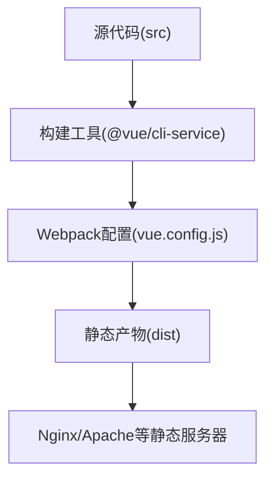
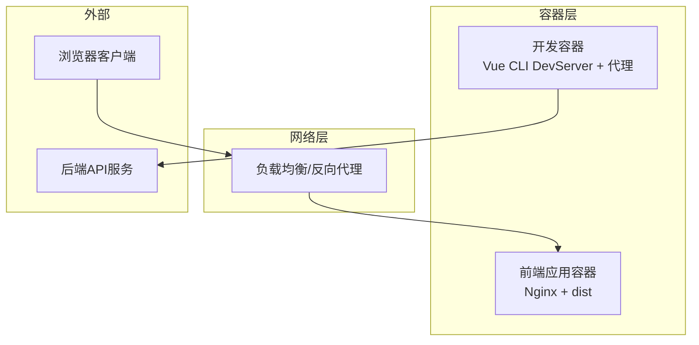
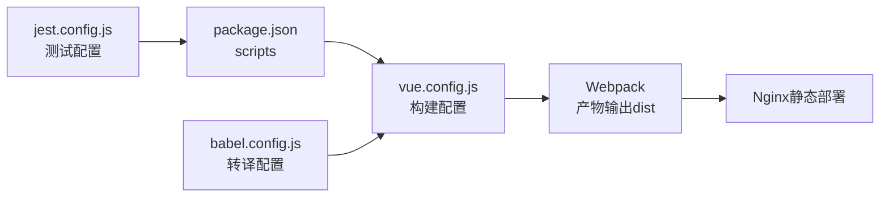

# Docker容器化部署

<cite>
**本文引用的文件**
- [package.json](file://package.json)
- [vue.config.js](file://vue.config.js)
- [babel.config.js](file://babel.config.js)
- [jest.config.js](file://jest.config.js)
- [.gitignore](file://.gitignore)
- [README.md](file://README.md)
- [deploy.sh](file://deploy.sh)
</cite>

## 目录
1. [简介](#简介)
2. [项目结构](#项目结构)
3. [核心组件](#核心组件)
4. [架构总览](#架构总览)
5. [详细组件分析](#详细组件分析)
6. [依赖关系分析](#依赖关系分析)
7. [性能考量](#性能考量)
8. [故障排除指南](#故障排除指南)
9. [结论](#结论)
10. [附录](#附录)

## 简介
本指南面向Vue CMS项目的Docker容器化部署，提供从Dockerfile多阶段构建、docker-compose编排到CI/CD集成的完整实践路径。文档结合项目现有配置与脚本，给出可落地的镜像构建策略、服务编排参数、运行与运维建议，以及监控与排障方法，帮助实现环境一致性、快速部署与弹性伸缩。

## 项目结构
该Vue项目采用Vue CLI 5脚手架，核心产物为静态资源（dist），开发与生产配置集中在vue.config.js中，构建脚本由package.json定义。构建后产物输出至dist目录，符合静态站点部署的典型模式。

**图表来源**
- [vue.config.js:14-144](file://vue.config.js#L14-L144)
- [package.json:24-32](file://package.json#L24-L32)

**章节来源**
- [package.json:24-32](file://package.json#L24-L32)
- [vue.config.js:22-24](file://vue.config.js#L22-L24)
- [README.md:118-131](file://README.md#L118-L131)

## 核心组件
- 构建与打包
  - 使用Vue CLI提供的构建脚本，输出静态资源到dist目录。
  - 生产环境关闭source map以提升构建速度与安全性。
- 开发与代理
  - devServer配置支持跨域代理，便于前后端分离联调。
- 依赖与环境
  - package.json声明Node与NPM版本要求，Babel配置使用@vue/cli-plugin-babel预设。
- 测试与单元测试
  - Jest配置由@vue/cli-plugin-unit-jest提供默认模板。

**章节来源**
- [package.json:24-32](file://package.json#L24-L32)
- [vue.config.js:26-27](file://vue.config.js#L26-L27)
- [vue.config.js:29-50](file://vue.config.js#L29-L50)
- [babel.config.js:1-12](file://babel.config.js#L1-L12)
- [jest.config.js:1-4](file://jest.config.js#L1-L4)

## 架构总览
下图展示了容器化部署的总体架构：前端应用以静态站点形式运行，通过反向代理对外提供服务；开发与生产环境分别对应不同的构建与运行策略。

[此图为概念性架构示意，不直接映射具体源码文件，故无“图表来源”标注]

## 详细组件分析

### Dockerfile多阶段构建
目标
- 最小化镜像体积，缩短构建时间，提升安全与可重复性。
- 将构建产物dist作为静态站点部署，避免在运行时安装依赖。

策略
- 阶段一：构建环境（Node + 依赖安装 + 构建）
  - 基础镜像：官方Node LTS（建议使用alpine以减小体积）
  - 工作目录：/app
  - 依赖安装：使用package-lock.json锁定版本
  - 构建命令：npm run build
- 阶段二：运行环境（Nginx）
  - 基础镜像：官方Nginx（或Nginx-alpine）
  - 将dist目录复制到Nginx默认站点目录
  - 配置Nginx以静态方式提供dist内容，设置合适的缓存与压缩策略
  - 暴露端口：80
  - 健康检查：GET /
  - 启动命令：nginx -g "daemon off;"

优势
- 构建与运行分离，运行镜像不含Node与构建工具链
- 更小的镜像体积，更快的拉取与启动速度
- 更高的安全性（移除了开发期依赖）

[本节为通用实践说明，未直接分析具体源码文件，故无“章节来源”与“图表来源”标注]

### docker-compose编排
服务定义
- 前端服务（nginx）
  - 基于自定义镜像或直接使用官方Nginx镜像
  - 映射宿主机端口到容器80
  - 挂载dist目录或通过构建上下文复制
  - 设置健康检查
- 开发服务（可选）
  - 基于Node镜像，运行npm run serve
  - 暴露开发端口（如8080）
  - 挂载源代码目录实现热重载

环境变量
- NODE_ENV：区分开发/生产
- PORT：开发端口
- VUE_APP_BASE_API、VUE_APP_PROXY_API：开发代理配置

数据卷
- dist目录：用于静态资源
- 日志目录：Nginx访问/错误日志
- 源代码目录：开发模式热更新

[本节为通用实践说明，未直接分析具体源码文件，故无“章节来源”与“图表来源”标注]

### 构建与运行命令
- 镜像构建
  - docker build -t vue-cms-frontend .
- 容器启动
  - docker run -d -p 80:80 --name frontend vue-cms-frontend
- 查看日志
  - docker logs -f frontend
- 进入容器调试
  - docker exec -it frontend /bin/sh

[本节为通用实践说明，未直接分析具体源码文件，故无“章节来源”与“图表来源”标注]

### CI/CD集成
- 触发条件
  - 分支保护、PR合并、tag推送
- 步骤
  - 依赖安装（使用package-lock.json）
  - 单元测试（可选）
  - 构建静态资源
  - 构建镜像并推送到镜像仓库
  - 可选：部署到测试环境
  - 可选：部署到生产环境（灰度/蓝绿）
- 缓存策略
  - 缓存Node依赖目录，减少重复安装时间
- 安全扫描
  - 在CI中集成镜像漏洞扫描

[本节为通用实践说明，未直接分析具体源码文件，故无“章节来源”与“图表来源”标注]

## 依赖关系分析
- 构建链路
  - package.json中的scripts驱动构建流程
  - vue.config.js控制Webpack与devServer行为
  - babel.config.js提供转译配置
  - jest.config.js提供测试配置
- 输出产物
  - dist目录为最终静态资源，需在Nginx中正确配置根路径与静态文件分发

**图表来源**
- [package.json:24-32](file://package.json#L24-L32)
- [vue.config.js:14-144](file://vue.config.js#L14-L144)
- [babel.config.js:1-12](file://babel.config.js#L1-12)
- [jest.config.js:1-4](file://jest.config.js#L1-L4)

**章节来源**
- [package.json:24-32](file://package.json#L24-L32)
- [vue.config.js:22-24](file://vue.config.js#L22-L24)
- [babel.config.js:1-12](file://babel.config.js#L1-L12)
- [jest.config.js:1-4](file://jest.config.js#L1-L4)

## 性能考量
- 构建优化
  - 生产环境关闭source map，减少体积与构建时间
  - 合理拆分代码块，利用缓存组与运行时分块
- 镜像优化
  - 使用多阶段构建，仅在最终镜像中保留dist
  - 选择轻量基础镜像（如alpine）
- 运行优化
  - Nginx启用Gzip/HTTP/2
  - 静态资源设置长缓存与ETag
  - CDN分发静态资源（可选）

[本节为通用实践说明，未直接分析具体源码文件，故无“章节来源”与“图表来源”标注]

## 故障排除指南
- 构建失败
  - 检查Node与NPM版本是否满足package.json engines要求
  - 清理依赖缓存后重试
- 访问异常
  - 确认Nginx根路径指向dist
  - 检查publicPath与静态资源路径
- 开发代理问题
  - 核对vue.config.js devServer代理配置与环境变量
- 容器日志
  - 使用docker logs查看容器标准输出与错误
  - 检查Nginx访问/错误日志

**章节来源**
- [package.json:88-91](file://package.json#L88-L91)
- [vue.config.js:22](file://vue.config.js#L22)
- [vue.config.js:33-40](file://vue.config.js#L33-L40)

## 结论
通过多阶段构建与静态站点部署，Vue CMS项目可在Docker中实现高效、一致且易于扩展的交付。配合docker-compose与CI/CD流水线，可进一步提升交付质量与运维效率。建议在生产环境中启用缓存、压缩与健康检查，并结合监控与日志体系完善可观测性。

## 附录

### 关键配置要点
- 构建输出
  - outputDir: dist
  - assetsDir: static
- 开发代理
  - devServer.proxy基于环境变量动态配置
- 生产优化
  - productionSourceMap: false
  - splitChunks与runtimeChunk优化

**章节来源**
- [vue.config.js:22-24](file://vue.config.js#L22-L24)
- [vue.config.js:26-27](file://vue.config.js#L26-L27)
- [vue.config.js:104-141](file://vue.config.js#L104-L141)