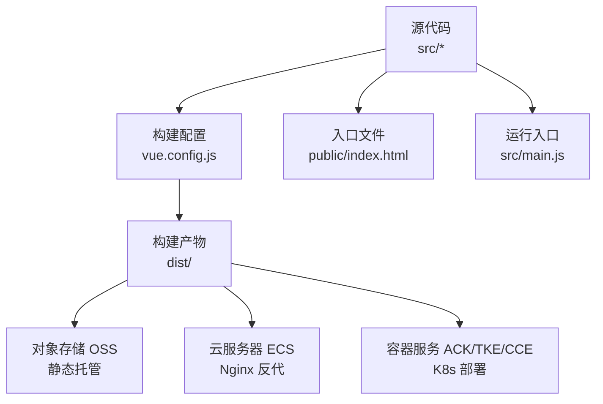
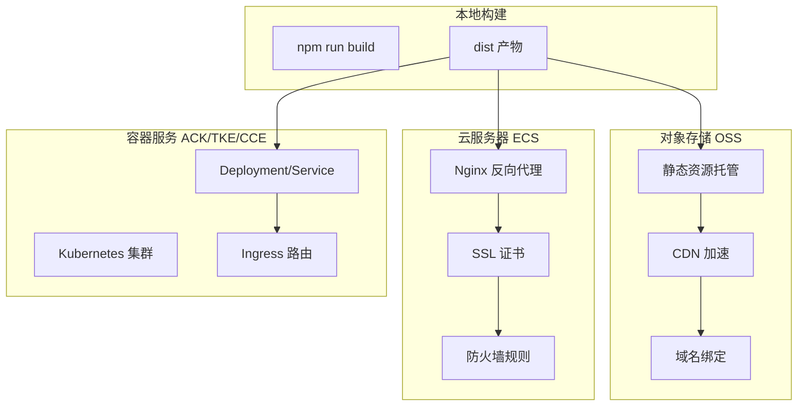
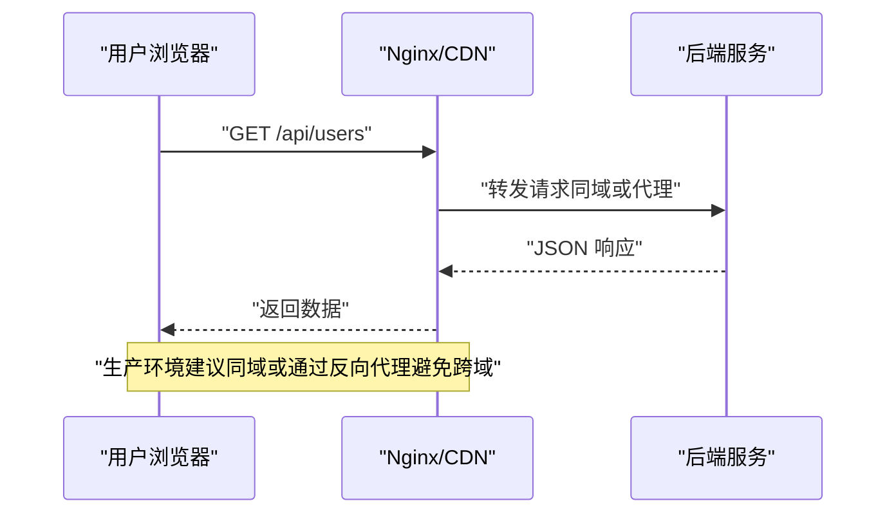
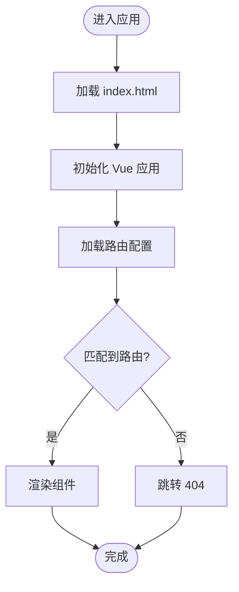
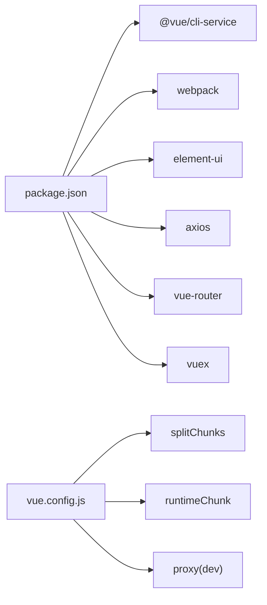

# 云平台部署

<cite>
**本文引用的文件**
- [package.json](file://package.json)
- [vue.config.js](file://vue.config.js)
- [README.md](file://README.md)
- [public/index.html](file://public/index.html)
- [src/main.js](file://src/main.js)
- [src/router/index.js](file://src/router/index.js)
- [src/store/index.js](file://src/store/index.js)
- [src/utils/request.js](file://src/utils/request.js)
- [src/mock/index.js](file://src/mock/index.js)
- [babel.config.js](file://babel.config.js)
- [deploy.sh](file://deploy.sh)
</cite>

## 目录
1. [简介](#简介)
2. [项目结构](#项目结构)
3. [核心组件](#核心组件)
4. [架构总览](#架构总览)
5. [详细组件分析](#详细组件分析)
6. [依赖关系分析](#依赖关系分析)
7. [性能考虑](#性能考虑)
8. [故障排查指南](#故障排查指南)
9. [结论](#结论)
10. [附录](#附录)

## 简介
本指南面向在阿里云、腾讯云、华为云等国内主流云平台部署 Vue CMS 项目的工程团队，提供从对象存储 OSS（静态资源托管）、CDN 加速、域名绑定，到云服务器 ECS（Nginx、SSL 证书、防火墙）、容器服务 ACK/TKE/CCE（Kubernetes 集群与 Ingress）的完整落地步骤与配置要点。同时涵盖监控、日志与告警最佳实践，以及成本优化与资源管理策略。

## 项目结构
该 Vue 2.x 项目采用 Vue CLI 5.x 脚手架，核心产物为纯静态资源（HTML、JS、CSS、图片等），适合直接部署至对象存储或反向代理服务器。关键目录与文件：
- 构建输出：dist（由构建命令生成）
- 静态资源：public（入口 HTML、favicon、静态资源）
- 源码：src（入口 main.js、路由 router、状态 store、工具 request、Mock 数据等）
- 构建配置：vue.config.js（publicPath、devServer、分包策略、SVG 图标处理等）
- 环境变量：.env.*（开发/生产环境变量，如 VUE_APP_BASE_API）
- 构建脚本：deploy.sh（示例自动化脚本）

**图表来源**
- [vue.config.js:14-28](file://vue.config.js#L14-L28)
- [public/index.html:1-21](file://public/index.html#L1-L21)
- [src/main.js:1-53](file://src/main.js#L1-L53)

**章节来源**
- [README.md:39-72](file://README.md#L39-L72)
- [vue.config.js:14-28](file://vue.config.js#L14-L28)
- [public/index.html:1-21](file://public/index.html#L1-L21)
- [src/main.js:1-53](file://src/main.js#L1-L53)

## 核心组件
- 构建与分包策略
  - 使用 splitChunks 对第三方库、Element UI、公共组件进行分包，提升缓存命中率与首屏性能。
  - runtimeChunk 单独提取，便于长期缓存。
- 开发与代理
  - devServer 支持跨域代理，便于联调后端接口。
- 生产构建
  - publicPath 设为相对路径，适配子路径部署与 CDN 场景。
  - 关闭生产 source map，降低体积与泄露风险。
- 资源加载
  - SVG 图标通过 svg-sprite-loader 统一处理，避免重复请求。
- 运行时入口
  - main.js 注入 Element UI、国际化、Mock 数据、全局通知组件等。
- 路由与权限
  - 路由采用常量路由 + 动态路由 + 末尾兜底路由的组合，支持权限控制与嵌套路由。
- 状态管理
  - 自动扫描 modules 文件夹，统一 getters，兼容子路径部署下的静态资源路径修正。
- 网络层
  - axios 实例封装，统一设置 baseURL、超时、请求头、拦截器与错误处理。
- Mock 数据
  - 自动扫描 modules，按模块注册 Mock 规则，便于前后端并行开发。

**章节来源**
- [vue.config.js:104-141](file://vue.config.js#L104-L141)
- [vue.config.js:29-50](file://vue.config.js#L29-L50)
- [vue.config.js:22](file://vue.config.js#L22)
- [src/main.js:10-42](file://src/main.js#L10-L42)
- [src/router/index.js:43-111](file://src/router/index.js#L43-L111)
- [src/store/index.js:10-17](file://src/store/index.js#L10-L17)
- [src/store/index.js:24-68](file://src/store/index.js#L24-L68)
- [src/utils/request.js:8-15](file://src/utils/request.js#L8-L15)
- [src/mock/index.js:20-34](file://src/mock/index.js#L20-L34)

## 架构总览
下图展示了从构建到多云部署的总体流程与关键节点：

**图表来源**
- [package.json:24-31](file://package.json#L24-L31)
- [vue.config.js:22](file://vue.config.js#L22)

## 详细组件分析

### 对象存储 OSS 部署（静态资源托管 + CDN + 域名）
- 部署步骤
  - 本地构建：执行构建命令生成 dist 目录。
  - 上传 OSS：将 dist 内容上传至 OSS Bucket，建议开启静态网站托管或通过 CDN 源站指向 OSS。
  - CDN 加速：在 CDN 控制台配置回源至 OSS Bucket，开启压缩、缓存策略与 HTTPS。
  - 域名绑定：在 CDN 为站点配置 CNAME 或 A 记录，确保 SSL 证书覆盖该域名。
- 关键配置要点
  - publicPath 为相对路径，适配 OSS/CDN 子路径场景。
  - 静态资源缓存：合理设置 Cache-Control 与版本号策略，结合分包策略提升命中率。
  - CORS 与安全：为 API 跨域配置允许的来源，避免静态站点调用后端接口时的跨域问题。
  - HTTPS：CDN 侧启用 HTTPS 并正确配置证书链。
- 适用场景
  - 低运维成本、高可用、全球加速的静态站点。

**章节来源**
- [vue.config.js:22](file://vue.config.js#L22)
- [package.json:24-31](file://package.json#L24-L31)

### 云服务器 ECS 部署（Nginx + SSL + 防火墙）
- 部署步骤
  - 选择 ECS 实例，安装 Nginx。
  - 将 dist 目录上传至 ECS，配置 Nginx 指向 dist 目录。
  - 配置 SSL 证书（可使用免费证书或云平台证书服务）。
  - 配置防火墙放行 80/443 端口。
- Nginx 配置要点
  - root 指向 dist 目录，设置 index 为 index.html。
  - 静态资源 gzip/缓存策略，提升首屏与后续访问性能。
  - 反向代理：如需将 API 请求转发至后端服务，在同一域名下配置 location，避免跨域。
  - 强制 HTTPS：重定向 80 至 443。
- 防火墙与安全
  - 仅开放必要端口（80/443/SSH），其余端口拒绝。
  - 配置安全组策略，限制来源 IP。
- 适用场景
  - 需要灵活反向代理、与后端服务同域部署、对网络延迟敏感的场景。

**章节来源**
- [vue.config.js:22](file://vue.config.js#L22)
- [public/index.html:1-21](file://public/index.html#L1-L21)

### 容器服务 ACK/TKE/CCE 部署（Kubernetes + Ingress）
- 集群准备
  - 创建 Kubernetes 集群，确保节点规格满足业务峰值。
  - 准备镜像仓库（可使用云平台镜像服务），将前端产物打包为镜像或使用静态镜像（nginx:alpine）。
- 部署清单
  - Deployment：暴露副本数、容器镜像、端口映射。
  - Service：ClusterIP/NodePort/LoadBalancer，按需选择。
  - Ingress：配置域名、TLS 证书、路径转发，将流量接入到 Service。
- Ingress 路由与证书
  - 使用注解或 IngressClass 配置 TLS 证书（可使用云平台提供的证书管理服务）。
  - 路径前缀与重写：确保与 publicPath 保持一致，避免 404。
- CI/CD 集成
  - 在流水线中执行构建、镜像构建与推送、kubectl apply 或 Helm 安装。
- 适用场景
  - 高并发、弹性扩缩容、多环境隔离、标准化交付的场景。

**章节来源**
- [vue.config.js:22](file://vue.config.js#L22)
- [package.json:24-31](file://package.json#L24-L31)

### API 与跨域配置
- 环境变量
  - VUE_APP_BASE_API：后端接口基础地址，生产环境通过环境变量注入。
- 本地开发代理
  - devServer.proxy 将以 VUE_APP_BASE_API 开头的请求代理到目标地址，便于联调。
- 生产跨域
  - 若静态站点与后端不在同域，需在后端配置 CORS，或通过反向代理统一域名。
- 错误处理
  - axios 拦截器统一处理超时、网络错误与业务错误码，保障用户体验。

**图表来源**
- [src/utils/request.js:8-15](file://src/utils/request.js#L8-L15)
- [vue.config.js:33-41](file://vue.config.js#L33-L41)

**章节来源**
- [src/utils/request.js:8-15](file://src/utils/request.js#L8-L15)
- [vue.config.js:33-41](file://vue.config.js#L33-L41)

### 路由与权限（SPA 单页应用）
- 路由结构
  - 常量路由：登录、重定向、404 等。
  - 动态路由：根据权限动态注入。
  - 末尾兜底路由：未匹配到路由跳转至 404。
- 子路径部署
  - publicPath 为相对路径，保证子路径部署时资源路径正确解析。
- 嵌套路由与 Keep-alive
  - 支持多级嵌套与组件缓存，结合路由 meta 控制缓存策略。

**图表来源**
- [src/router/index.js:43-111](file://src/router/index.js#L43-L111)
- [vue.config.js:22](file://vue.config.js#L22)

**章节来源**
- [src/router/index.js:43-111](file://src/router/index.js#L43-L111)
- [vue.config.js:22](file://vue.config.js#L22)

### 状态管理与静态资源路径
- 自动模块扫描
  - store 自动扫描 modules 目录，统一注册模块与 getters。
- 静态资源路径修正
  - 当头像等资源路径以 /static/ 开头时，根据 BASE_URL 修正为相对路径，适配子路径部署。

**章节来源**
- [src/store/index.js:10-17](file://src/store/index.js#L10-L17)
- [src/store/index.js:24-68](file://src/store/index.js#L24-L68)

### 构建与开发配置
- 构建脚本
  - npm scripts 提供 serve/build/test/lint 等常用命令。
- Babel 配置
  - preset 使用 @vue/cli-plugin-babel，core-js 版本与 useBuiltIns 策略已明确。
- Mock 数据
  - 开发阶段可直接使用 Mock 数据，生产环境注释或移除。

**章节来源**
- [package.json:24-31](file://package.json#L24-L31)
- [babel.config.js:1-12](file://babel.config.js#L1-L12)
- [src/mock/index.js:20-34](file://src/mock/index.js#L20-L34)

## 依赖关系分析
- 构建期依赖
  - @vue/cli-service、webpack、svg-sprite-loader、splitChunks/runtimeChunk 等。
- 运行期依赖
  - Vue 2.x、Element UI、axios、vuex、vue-router 等。
- 环境变量
  - VUE_APP_BASE_API、VUE_APP_PROXY_API（开发代理）等。

**图表来源**
- [package.json:33-84](file://package.json#L33-L84)
- [vue.config.js:104-141](file://vue.config.js#L104-L141)
- [vue.config.js:29-50](file://vue.config.js#L29-L50)

**章节来源**
- [package.json:33-84](file://package.json#L33-L84)
- [vue.config.js:104-141](file://vue.config.js#L104-L141)
- [vue.config.js:29-50](file://vue.config.js#L29-L50)

## 性能考虑
- 分包与缓存
  - 第三方库与业务代码分离，提升缓存命中率；runtimeChunk 单独提取，利于长期缓存。
- 首屏优化
  - 预加载关键资源（如 main.js、首屏 CSS），减少白屏时间。
- 资源压缩
  - 启用 gzip/br 压缩，合理设置 Cache-Control。
- CDN 与边缘缓存
  - 静态资源走 CDN，缩短网络路径；结合版本号策略避免缓存污染。
- 网络层优化
  - axios 设置合理超时与重试策略，避免长时间阻塞。

**章节来源**
- [vue.config.js:104-141](file://vue.config.js#L104-L141)
- [src/utils/request.js:8-15](file://src/utils/request.js#L8-L15)

## 故障排查指南
- 构建失败
  - 检查 Node 版本与 engines 字段，确认依赖安装成功。
- 静态资源 404
  - 确认 publicPath 与部署路径一致；检查 CDN/反代是否正确回源。
- 路由刷新 404
  - SPA 路由需配合 Nginx/Ingress 重写至 index.html；确保兜底路由生效。
- 跨域问题
  - 生产环境建议同域或通过反向代理；后端正确配置 CORS。
- API 超时/网络错误
  - 检查 axios 超时设置与网络连通性；查看拦截器错误提示。

**章节来源**
- [package.json:88-97](file://package.json#L88-L97)
- [vue.config.js:22](file://vue.config.js#L22)
- [src/utils/request.js:108-135](file://src/utils/request.js#L108-L135)

## 结论
Vue CMS 项目具备良好的静态化特性与可移植性，可在 OSS/CDN、ECS、容器服务等多种云平台上高效部署。通过合理的分包策略、CDN 缓存与反向代理配置，可显著提升性能与稳定性。结合监控、日志与告警体系，以及成本优化与资源管理策略，可实现高可用、低成本、易维护的生产环境。

## 附录
- 自动化部署脚本参考
  - 可参考现有脚本思路，结合云平台 CI/CD 工具链实现一键部署。
- 环境变量建议
  - VUE_APP_BASE_API：后端接口地址
  - VUE_APP_PROXY_API：开发代理目标地址
- 最佳实践清单
  - 构建产物开启 gzip/br 压缩
  - CDN 缓存策略与版本号管理
  - 反向代理统一域名，避免跨域
  - 证书与防火墙最小暴露面原则
  - 监控指标：QPS、P95 延迟、错误率、缓存命中率
  - 成本优化：按峰值规划实例规格、CDN 缓存命中率、冷热资源分层存储

**章节来源**
- [deploy.sh:1-26](file://deploy.sh#L1-L26)
- [src/utils/request.js:8-15](file://src/utils/request.js#L8-L15)