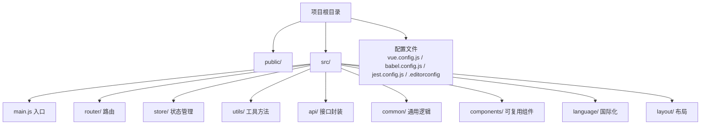
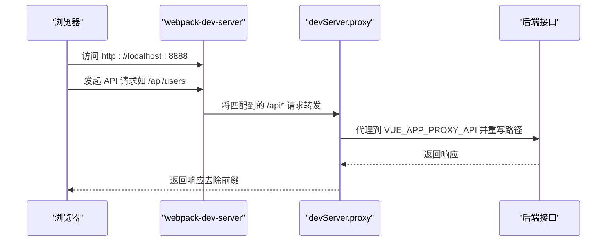
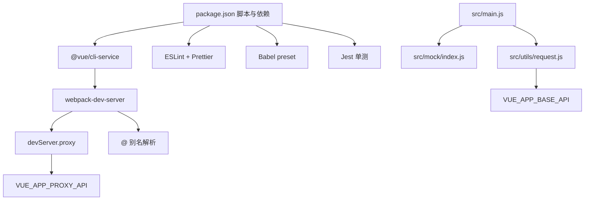

# 开发环境部署

<cite>
**本文引用的文件**
- [package.json](file://package.json)
- [vue.config.js](file://vue.config.js)
- [.editorconfig](file://.editorconfig)
- [babel.config.js](file://babel.config.js)
- [jest.config.js](file://jest.config.js)
- [README.md](file://README.md)
- [src/main.js](file://src/main.js)
- [src/utils/request.js](file://src/utils/request.js)
- [src/common/auth.js](file://src/common/auth.js)
- [src/router/index.js](file://src/router/index.js)
- [src/store/index.js](file://src/store/index.js)
</cite>

## 目录
1. [简介](#简介)
2. [项目结构](#项目结构)
3. [核心组件](#核心组件)
4. [架构总览](#架构总览)
5. [详细组件分析](#详细组件分析)
6. [依赖关系分析](#依赖关系分析)
7. [性能考虑](#性能考虑)
8. [故障排查指南](#故障排查指南)
9. [结论](#结论)
10. [附录](#附录)

## 简介
本指南面向首次参与 Vue CMS 项目的开发者，提供从环境准备、依赖安装、开发服务器启动，到 IDE 规范配置与常见问题排查的全流程说明。项目采用 Vue CLI 5.x 与 Vue 2.7 生态，结合 Element-UI、Axios、MockJS 等技术栈，提供完善的开发与构建能力。

## 项目结构
项目采用典型的 Vue CLI 单页应用结构，关键目录与职责概览：
- public：公共资源与入口 HTML
- src：源代码，包含入口、路由、状态管理、API、通用工具、国际化、组件等
- 配置文件：vue.config.js（CLI 配置）、babel.config.js（Babel）、jest.config.js（单元测试）、.editorconfig（编辑器规范）

章节来源
- [README.md: 98-132:98-132](file://README.md#L98-L132)

## 核心组件
- 依赖与脚本：通过 package.json 的 scripts 字段提供开发、构建、测试、代码检查与格式化命令
- 开发服务器：基于 @vue/cli-service 的 webpack-dev-server，默认监听端口可通过环境变量覆盖
- 代理配置：通过 vue.config.js 的 devServer.proxy 将 API 前缀转发至目标服务
- 请求封装：Axios 封装在 utils/request.js，自动注入环境变量指定的 API 基础地址
- Mock 数据：开发阶段默认加载 src/mock/index.js，便于前后端并行开发
- 国际化与主题：Element-UI 国际化与主题切换在入口处初始化

章节来源
- [package.json: 24-32:24-32](file://package.json#L24-L32)
- [vue.config.js: 14-50:14-50](file://vue.config.js#L14-L50)
- [src/utils/request.js: 8-15:8-15](file://src/utils/request.js#L8-L15)
- [src/main.js: 34](file://src/main.js#L34)
- [src/common/auth.js: 3](file://src/common/auth.js#L3)

## 架构总览
下图展示了开发时从浏览器发起请求到后端接口的关键流程，包括本地开发服务器、代理与 Axios 请求拦截器的协作关系。

图表来源
- [vue.config.js: 29-50:29-50](file://vue.config.js#L29-L50)
- [src/utils/request.js: 8-15:8-15](file://src/utils/request.js#L8-L15)

章节来源
- [vue.config.js: 29-50:29-50](file://vue.config.js#L29-L50)
- [src/utils/request.js: 8-15:8-15](file://src/utils/request.js#L8-L15)

## 详细组件分析

### 开发服务器与代理配置（vue.config.js）
- 端口与主机
  - 默认端口：8888（可通过环境变量 PORT 覆盖）
  - 主机：0.0.0.0，允许外部访问
- 代理规则
  - 基于环境变量 VUE_APP_BASE_API 作为前缀匹配
  - 目标地址由 VUE_APP_PROXY_API 指定
  - 路径重写：移除前缀，使后端感知到“根路径”请求
- 客户端错误覆盖层
  - 仅显示错误，隐藏警告，提升开发专注度
- 资源与别名
  - publicPath 使用相对路径，适配子路径部署
  - Webpack 别名 @ 指向 src，便于导入
- 插件与 Loader
  - ProvidePlugin 注入 Quill 全局
  - SVG Sprite Loader 用于图标组件
- 优化策略（生产）
  - 分包策略：libs、elementUI、commons
  - runtimeChunk 单独提取，提升缓存命中

章节来源
- [vue.config.js: 10-11:10-11](file://vue.config.js#L10-L11)
- [vue.config.js: 29-50:29-50](file://vue.config.js#L29-L50)
- [vue.config.js: 51-65:51-65](file://vue.config.js#L51-L65)
- [vue.config.js: 89-102:89-102](file://vue.config.js#L89-L102)
- [vue.config.js: 104-141:104-141](file://vue.config.js#L104-L141)

### 环境变量与 API 地址
- 环境变量文件
  - .env：所有环境均加载
  - .env.development：仅开发环境加载
  - .env.production：仅构建环境加载
- API 基础地址
  - VUE_APP_BASE_API：Axios baseURL 与 devServer.proxy 前缀
  - VUE_APP_PROXY_API：代理目标地址
- Cookie Key
  - VUE_APP_Cookie_Key：Cookie 名称键值

章节来源
- [README.md: 119-121:119-121](file://README.md#L119-L121)
- [src/utils/request.js: 9](file://src/utils/request.js#L9)
- [src/common/auth.js: 3](file://src/common/auth.js#L3)

### 依赖安装与启动流程
- Node.js 版本要求
  - engines 要求：Node >= 6.0.0，npm >= 3.0.0
  - 实际运行依赖：webpack-dev-server 要求 Node >= 12.13.0
- 安装建议
  - 使用 yarn 或国内镜像源加速 npm install
  - 避免使用 cnpm，以减少潜在问题
- 启动命令
  - npm start 或 npm run serve 启动开发服务器
  - 浏览器访问 http://localhost:8888（默认端口）

章节来源
- [package.json: 88-91:88-91](file://package.json#L88-L91)
- [package.json: 24-31:24-31](file://package.json#L24-L31)
- [README.md: 48-57:48-57](file://README.md#L48-L57)

### 代码规范与 IDE 配置
- EditorConfig
  - 统一缩进风格、字符集、行尾等基础规范
- ESLint
  - 通过 @vue/cli-plugin-eslint 与 @vue/eslint-config-prettier 集成
  - 建议在 VS Code 安装 ESLint 扩展，并启用保存时自动修复
- Prettier
  - 通过 @vue/cli-plugin-eslint 与 @vue/eslint-config-prettier 配置
  - 建议在 VS Code 安装 Prettier 扩展，并启用保存时格式化
- Babel
  - preset 使用 @vue/cli-plugin-babel/preset，core-js 3 与按需 polyfill
- 单元测试
  - Jest 预设：@vue/cli-plugin-unit-jest

章节来源
- [.editorconfig: 1-26:1-26](file://.editorconfig#L1-L26)
- [package.json: 65-84:65-84](file://package.json#L65-L84)
- [babel.config.js: 1-12:1-12](file://babel.config.js#L1-L12)
- [jest.config.js: 1-4:1-4](file://jest.config.js#L1-L4)

### Axios 请求封装与 Mock 数据
- Axios 基础配置
  - baseURL 来自 VUE_APP_BASE_API
  - 超时、Content-Type、Accept-Language 等头部处理
  - 请求拦截：注入 Authorization 与缓存控制；GET 请求追加时间戳参数避免缓存
  - 响应拦截：统一错误提示与登录状态校验；支持 Blob/ArrayBuffer 直接透传
- Mock 数据
  - 开发阶段默认加载 src/mock/index.js，便于联调与演示

章节来源
- [src/utils/request.js: 8-15:8-15](file://src/utils/request.js#L8-L15)
- [src/utils/request.js: 18-52:18-52](file://src/utils/request.js#L18-L52)
- [src/utils/request.js: 54-136:54-136](file://src/utils/request.js#L54-L136)
- [src/main.js: 34](file://src/main.js#L34)

### 路由与状态管理
- 路由
  - constantRoutes：无需权限的基础路由
  - asyncRoutes：动态路由（按权限生成）
  - endBasicRoutes：兜底路由（404、无权限等）
- 状态管理
  - 自动扫描 modules 子目录，统一注册命名空间模块
  - 全局 getters 提供常用派生状态

章节来源
- [src/router/index.js: 43-111:43-111](file://src/router/index.js#L43-L111)
- [src/router/index.js: 118-320:118-320](file://src/router/index.js#L118-L320)
- [src/store/index.js: 10-17:10-17](file://src/store/index.js#L10-L17)
- [src/store/index.js: 24-68:24-68](file://src/store/index.js#L24-L68)

## 依赖关系分析
下图展示开发与构建期间的关键依赖关系与工具链交互。

图表来源
- [package.json: 24-32:24-32](file://package.json#L24-L32)
- [vue.config.js: 14-65:14-65](file://vue.config.js#L14-L65)
- [src/main.js: 34](file://src/main.js#L34)
- [src/utils/request.js: 8-15:8-15](file://src/utils/request.js#L8-L15)

章节来源
- [package.json: 24-32:24-32](file://package.json#L24-L32)
- [vue.config.js: 14-65:14-65](file://vue.config.js#L14-L65)
- [src/main.js: 34](file://src/main.js#L34)
- [src/utils/request.js: 8-15:8-15](file://src/utils/request.js#L8-L15)

## 性能考虑
- 首屏优化
  - 预加载关键资源（已通过注释保留配置思路）
  - 预取（Prefetch）在多页面场景可能带来冗余请求，已默认禁用
- 生产构建优化
  - SplitChunks：libs、elementUI、commons 三类分包
  - runtimeChunk 单独提取，提升长期缓存效果
- 资源目录
  - outputDir=dist，assetsDir=static，publicPath 使用相对路径，便于子路径部署

章节来源
- [vue.config.js: 66-88:66-88](file://vue.config.js#L66-L88)
- [vue.config.js: 104-141:104-141](file://vue.config.js#L104-L141)
- [vue.config.js: 22-25:22-25](file://vue.config.js#L22-L25)

## 故障排查指南
- 端口占用
  - 现象：无法启动开发服务器
  - 处理：修改环境变量 PORT 或关闭占用进程
  - 参考：[vue.config.js: 10](file://vue.config.js#L10)
- 代理不生效
  - 现象：前端请求 404 或跨域
  - 处理：确认 VUE_APP_BASE_API 与 VUE_APP_PROXY_API 已正确设置，且路径重写符合预期
  - 参考：[vue.config.js: 33-40:33-40](file://vue.config.js#L33-L40)，[src/utils/request.js: 9](file://src/utils/request.js#L9)
- 请求超时或网络错误
  - 现象：控制台报错“请求超时”或“网络错误”
  - 处理：检查后端接口可用性、代理目标地址、超时阈值
  - 参考：[src/utils/request.js: 110-127:110-127](file://src/utils/request.js#L110-L127)
- Mock 数据未生效
  - 现象：未使用本地模拟数据
  - 处理：确认 src/main.js 中已加载 src/mock/index.js
  - 参考：[src/main.js: 34](file://src/main.js#L34)
- ESLint/Prettier 报错
  - 现象：保存时报错或格式化不生效
  - 处理：安装 VS Code ESLint/Prettier 扩展，启用保存时修复与格式化
  - 参考：[package.json: 65-84:65-84](file://package.json#L65-L84)，[.editorconfig: 1-26:1-26](file://.editorconfig#L1-L26)
- Node 版本不兼容
  - 现象：安装或启动时报 Node 版本相关错误
  - 处理：升级 Node 至满足 engines 与 webpack-dev-server 的最低要求
  - 参考：[package.json: 88-91:88-91](file://package.json#L88-L91)，[package-lock.json: 19916-19918:19916-19918](file://package-lock.json#L19916-L19918)

章节来源
- [vue.config.js: 10](file://vue.config.js#L10)
- [vue.config.js: 33-40:33-40](file://vue.config.js#L33-L40)
- [src/utils/request.js: 9](file://src/utils/request.js#L9)
- [src/utils/request.js: 110-127:110-127](file://src/utils/request.js#L110-L127)
- [src/main.js: 34](file://src/main.js#L34)
- [package.json: 88-91:88-91](file://package.json#L88-L91)
- [package-lock.json: 19916-19918:19916-19918](file://package-lock.json#L19916-L19918)

## 结论
本指南围绕 Vue CMS 的开发环境配置与启动流程进行了系统性梳理，涵盖 Node.js 版本、依赖安装、开发服务器与代理、环境变量、IDE 规范、以及常见问题排查。按照上述步骤执行，可快速搭建稳定、高效的本地开发环境，并顺利开展后续功能迭代与联调工作。

## 附录

### 环境变量清单（示例）
- VUE_APP_BASE_API：API 基础路径（如 /api）
- VUE_APP_PROXY_API：代理目标地址（如 http://localhost:3000）
- VUE_APP_Cookie_Key：Cookie 键名（如 token）
- PORT：开发服务器端口（如 8888）

章节来源
- [src/utils/request.js: 9](file://src/utils/request.js#L9)
- [src/common/auth.js: 3](file://src/common/auth.js#L3)
- [vue.config.js: 10](file://vue.config.js#L10)