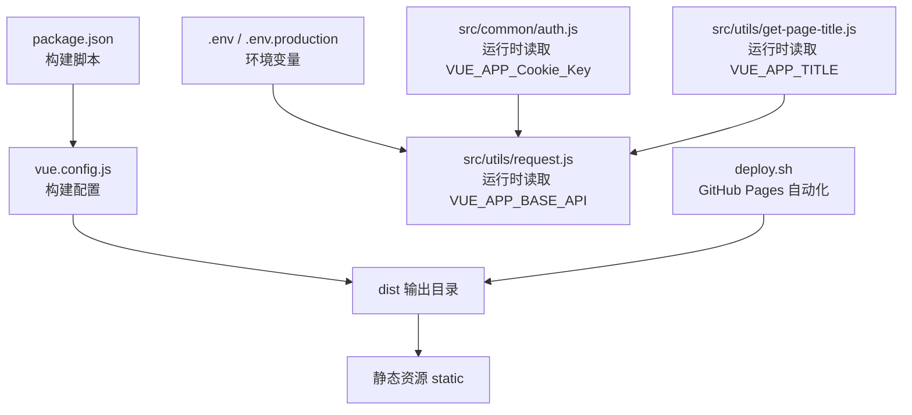
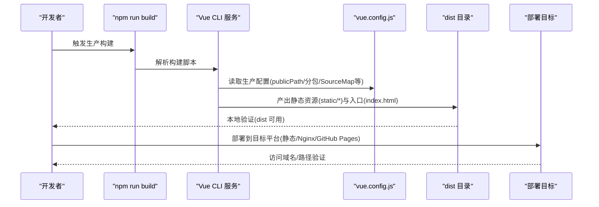
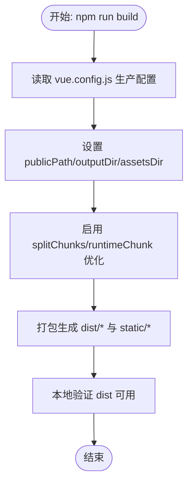
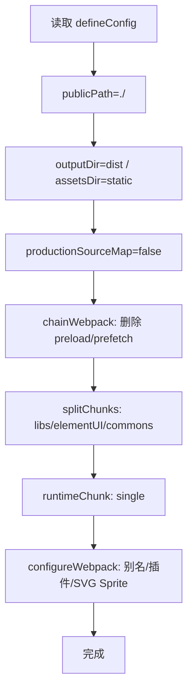
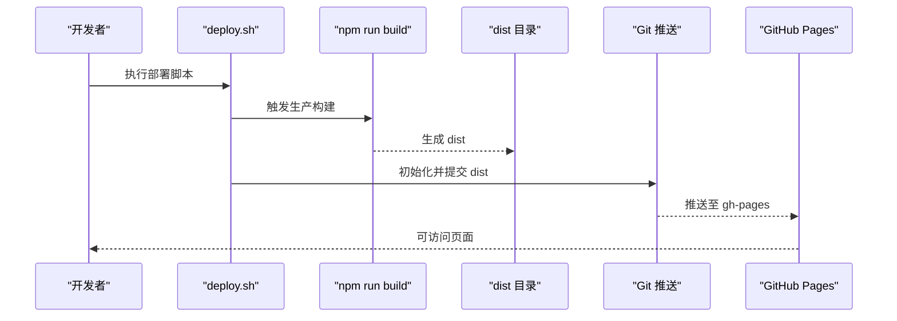
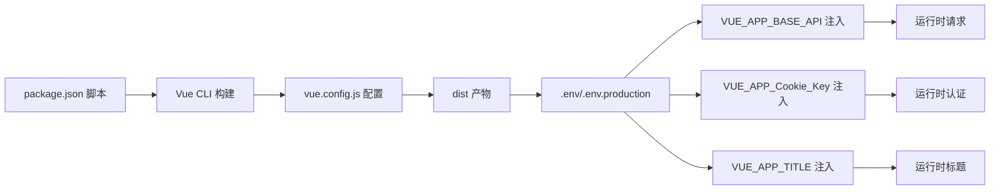

# 生产环境部署

<cite>
**本文引用的文件**
- [package.json](file://package.json)
- [vue.config.js](file://vue.config.js)
- [README.md](file://README.md)
- [deploy.sh](file://deploy.sh)
- [src/main.js](file://src/main.js)
- [src/utils/request.js](file://src/utils/request.js)
- [src/common/auth.js](file://src/common/auth.js)
- [src/utils/get-page-title.js](file://src/utils/get-page-title.js)
- [src/router/index.js](file://src/router/index.js)
</cite>

## 目录
1. [简介](#简介)
2. [项目结构](#项目结构)
3. [核心组件](#核心组件)
4. [架构总览](#架构总览)
5. [详细组件分析](#详细组件分析)
6. [依赖分析](#依赖分析)
7. [性能考虑](#性能考虑)
8. [故障排查指南](#故障排查指南)
9. [结论](#结论)
10. [附录](#附录)

## 简介
本指南面向生产环境部署 Vue CMS 项目，覆盖从 npm run build 到 dist 目录产物生成、vue.config.js 生产配置要点（静态资源路径、代码压缩、Source Map）、多场景部署方案（静态文件服务器、Nginx 反向代理、GitHub Pages）、环境变量配置（VUE_APP_*）以及性能优化与部署后验证流程。

## 项目结构
- 构建入口与脚本位于 package.json 的 scripts 字段，生产构建命令为 npm run build。
- 构建产物输出目录与静态资源目录在 vue.config.js 中定义，输出目录为 dist，静态资源目录为 static。
- 开发与生产环境变量文件在 README.md 中列出，分别为 .env 与 .env.production。
- 部署自动化脚本 deploy.sh 提供了基于 Git 的 GitHub Pages 部署流程参考。



**图表来源**
- [package.json:24-32](file://package.json#L24-L32)
- [vue.config.js:22-24](file://vue.config.js#L22-L24)
- [src/utils/request.js:8-15](file://src/utils/request.js#L8-L15)
- [src/common/auth.js:2-3](file://src/common/auth.js#L2-L3)
- [src/utils/get-page-title.js:1](file://src/utils/get-page-title.js#L1)
- [deploy.sh:6-25](file://deploy.sh#L6-L25)

**章节来源**
- [package.json:24-32](file://package.json#L24-L32)
- [vue.config.js:22-24](file://vue.config.js#L22-L24)
- [README.md:119-121](file://README.md#L119-L121)
- [deploy.sh:6-25](file://deploy.sh#L6-L25)

## 核心组件
- 构建脚本与产物
  - 生产构建命令：npm run build，产物输出至 dist，静态资源放置在 static 子目录。
- 生产配置要点
  - publicPath：生产环境使用相对路径 ./，便于子路径部署与 CDN。
  - productionSourceMap：关闭以提升构建速度与产物体积。
  - splitChunks/runtimeChunk：生产环境启用代码分包与独立 runtime，优化首屏与缓存命中。
- 环境变量
  - VUE_APP_BASE_API：后端接口前缀，运行时注入 axios 实例。
  - VUE_APP_Cookie_Key：Cookie 名称，用于认证令牌存储键名。
  - VUE_APP_TITLE：网页标题前缀，用于页面标题拼接。
- 部署自动化
  - deploy.sh：先执行构建，再进入 dist 目录初始化 Git 并推送到 gh-pages 分支。

**章节来源**
- [package.json:24-32](file://package.json#L24-L32)
- [vue.config.js:22-27](file://vue.config.js#L22-L27)
- [vue.config.js:104-141](file://vue.config.js#L104-L141)
- [src/utils/request.js:8-15](file://src/utils/request.js#L8-L15)
- [src/common/auth.js:2-3](file://src/common/auth.js#L2-L3)
- [src/utils/get-page-title.js:1](file://src/utils/get-page-title.js#L1)
- [deploy.sh:6-25](file://deploy.sh#L6-L25)

## 架构总览
下图展示了生产构建与部署的关键流程：从 npm run build 到 dist 产物生成，再到不同部署目标（静态服务器、Nginx、GitHub Pages）的落地方式。



**图表来源**
- [package.json:27](file://package.json#L27)
- [vue.config.js:22-27](file://vue.config.js#L22-L27)
- [vue.config.js:104-141](file://vue.config.js#L104-L141)
- [deploy.sh:6-25](file://deploy.sh#L6-L25)

## 详细组件分析

### 构建与产物生成（npm run build）
- 执行步骤
  - 通过 npm run build 触发 Vue CLI 构建。
  - 产物输出目录 outputDir 为 dist，静态资源目录 assetsDir 为 static。
  - publicPath 设为相对路径 ./，适配子路径部署与 CDN。
- 产物构成
  - HTML：入口 index.html。
  - JS/CSS：按分包策略拆分，包含 runtime 单独 chunk。
  - 静态资源：图片、字体等位于 static 子目录。



**图表来源**
- [package.json:27](file://package.json#L27)
- [vue.config.js:22-24](file://vue.config.js#L22-L24)
- [vue.config.js:104-141](file://vue.config.js#L104-L141)

**章节来源**
- [package.json:27](file://package.json#L27)
- [vue.config.js:22-24](file://vue.config.js#L22-L24)
- [vue.config.js:104-141](file://vue.config.js#L104-L141)

### 生产环境配置（vue.config.js）
- 关键项说明
  - publicPath：相对路径 ./，便于部署在子路径或 CDN。
  - outputDir/assetsDir：dist/static，保证静态资源与 HTML 的相对引用正确。
  - productionSourceMap：关闭，减少构建时间与产物体积。
  - devServer：开发服务器代理配置，使用 VUE_APP_BASE_API/VUE_APP_PROXY_API。
  - configureWebpack/chainWebpack：别名、插件、SVG Sprite、分包与 runtime 策略。
- 性能优化点
  - splitChunks：将 node_modules、element-ui、公共组件分别抽离，提升缓存命中。
  - runtimeChunk('single')：独立运行时，避免频繁改动导致业务 chunk 缓存失效。



**图表来源**
- [vue.config.js:14-143](file://vue.config.js#L14-L143)

**章节来源**
- [vue.config.js:14-143](file://vue.config.js#L14-L143)

### 环境变量与运行时注入
- VUE_APP_BASE_API
  - 用于 axios 实例的 baseURL，运行时从 process.env 读取。
  - 与 devServer 代理规则配合，开发与生产保持一致的 API 前缀。
- VUE_APP_Cookie_Key
  - 用于 Cookie 名称，控制认证令牌存储键名。
- VUE_APP_TITLE
  - 用于页面标题拼接，作为默认站点标题。
- 配置位置
  - README.md 列出 .env 与 .env.production 文件。
  - 运行时读取位置：请求封装、认证工具、页面标题工具。

```mermaid
sequenceDiagram
participant App as "应用启动"
participant Main as "src/main.js"
participant Req as "src/utils/request.js"
participant Auth as "src/common/auth.js"
participant Title as "src/utils/get-page-title.js"
App->>Main : 初始化 Vue 应用
Main->>Req : 创建 axios 实例(baseURL=VUE_APP_BASE_API)
Main->>Auth : 读取 Cookie 键(VUE_APP_Cookie_Key)
Main->>Title : 读取站点标题(VUE_APP_TITLE)
Req-->>App : 请求拦截器生效
Auth-->>App : 认证令牌读写
Title-->>App : 页面标题拼接
```

**图表来源**
- [src/main.js:34](file://src/main.js#L34)
- [src/utils/request.js:8-15](file://src/utils/request.js#L8-L15)
- [src/common/auth.js:2-3](file://src/common/auth.js#L2-L3)
- [src/utils/get-page-title.js:1](file://src/utils/get-page-title.js#L1)
- [README.md:119-121](file://README.md#L119-L121)

**章节来源**
- [src/utils/request.js:8-15](file://src/utils/request.js#L8-L15)
- [src/common/auth.js:2-3](file://src/common/auth.js#L2-L3)
- [src/utils/get-page-title.js:1](file://src/utils/get-page-title.js#L1)
- [README.md:119-121](file://README.md#L119-L121)

### 部署方案

#### 方案一：静态文件服务器部署
- 适用场景
  - 简单直传 dist 目录到任意静态服务器（如 Apache/Nginx/AWS S3）。
- 注意事项
  - 确保 publicPath 与服务器路径一致（当前为相对路径 ./）。
  - 若部署在子路径，需调整 publicPath 为实际子路径。
  - 静态资源引用 static/* 与 index.html 的相对关系由构建配置保证。

**章节来源**
- [vue.config.js:22-24](file://vue.config.js#L22-L24)

#### 方案二：Nginx 反向代理与静态托管
- 通用建议
  - 将 dist 作为静态资源根目录。
  - 配置 gzip/缓存/HTTP/HTTPS 等优化。
  - 对 SPA 路由回退到 index.html（参考路由配置与部署平台能力）。
- 与项目适配点
  - publicPath 使用相对路径，利于 Nginx 直配。
  - 代码分包与 runtime 独立，有利于浏览器缓存与长缓存策略。

**章节来源**
- [vue.config.js:22-27](file://vue.config.js#L22-L27)
- [vue.config.js:104-141](file://vue.config.js#L104-L141)

#### 方案三：GitHub Pages 部署
- 自动化流程
  - deploy.sh 先执行 npm run build，再进入 dist 初始化 Git 并推送至 gh-pages 分支。
  - 适合个人或开源项目快速上线演示。
- 注意事项
  - 若项目主页非根路径，需根据 GitHub Pages 规则调整 publicPath 或仓库设置。
  - 由于使用相对路径 ./，在 gh-pages 上通常无需额外修改。



**图表来源**
- [deploy.sh:6-25](file://deploy.sh#L6-L25)
- [package.json:27](file://package.json#L27)

**章节来源**
- [deploy.sh:6-25](file://deploy.sh#L6-L25)
- [package.json:27](file://package.json#L27)

### 路由与 SPA 回退
- 项目采用 Vue Router，路由模式未强制 history，且存在兜底 404/无权限页面。
- 部署到静态服务器或 Nginx 时，需确保 404 回退到 index.html，以支持前端路由。

**章节来源**
- [src/router/index.js:322-342](file://src/router/index.js#L322-L342)

## 依赖分析
- 构建链路
  - npm run build -> Vue CLI -> vue.config.js -> dist/static -> 部署目标。
- 运行时依赖
  - axios 通过 VUE_APP_BASE_API 注入 baseURL。
  - js-cookie 通过 VUE_APP_Cookie_Key 控制令牌键名。
  - 页面标题通过 VUE_APP_TITLE 拼接。



**图表来源**
- [package.json:24-32](file://package.json#L24-L32)
- [vue.config.js:22-27](file://vue.config.js#L22-L27)
- [src/utils/request.js:8-15](file://src/utils/request.js#L8-L15)
- [src/common/auth.js:2-3](file://src/common/auth.js#L2-L3)
- [src/utils/get-page-title.js:1](file://src/utils/get-page-title.js#L1)

**章节来源**
- [package.json:24-32](file://package.json#L24-L32)
- [vue.config.js:22-27](file://vue.config.js#L22-L27)
- [src/utils/request.js:8-15](file://src/utils/request.js#L8-L15)
- [src/common/auth.js:2-3](file://src/common/auth.js#L2-L3)
- [src/utils/get-page-title.js:1](file://src/utils/get-page-title.js#L1)

## 性能考虑
- 代码分包与缓存
  - splitChunks 将第三方库、element-ui、公共组件拆分，提升长期缓存命中率。
  - runtimeChunk 独立，避免业务代码变更导致运行时缓存失效。
- 构建优化
  - 关闭 productionSourceMap，缩短构建时间并减小产物体积。
  - 删除 preload/prefetch 插件，避免在多页面场景下的无效请求。
- 静态资源与 CDN
  - static 目录下的资源可结合 CDN 加速，注意 publicPath 与 CDN 域名一致性。
- 传输优化
  - 建议在服务器端启用 Gzip/Brotli 压缩与合适的缓存头。
- 首屏体验
  - 保留必要的预加载策略（如按需开启 preload），优先加载首屏关键资源。

**章节来源**
- [vue.config.js:26-27](file://vue.config.js#L26-L27)
- [vue.config.js:79-87](file://vue.config.js#L79-L87)
- [vue.config.js:116-141](file://vue.config.js#L116-L141)

## 故障排查指南
- 构建失败或产物缺失
  - 确认 npm run build 成功，dist 与 static 目录存在。
  - 检查 vue.config.js 中 publicPath/outputDir/assetsDir 是否符合预期。
- 接口 404/跨域
  - 确认 VUE_APP_BASE_API 已在 .env.production 正确设置。
  - 核对后端接口可达性与 CORS 配置。
- 认证失败或 Cookie 未生效
  - 检查 VUE_APP_Cookie_Key 是否与后端一致。
  - 确认 Cookie 作用域与 SameSite/Secure 设置。
- 页面标题异常
  - 检查 VUE_APP_TITLE 是否设置，确认运行时读取逻辑。
- GitHub Pages 访问空白或路由 404
  - 确认 dist 已推送到 gh-pages 分支。
  - 若使用自定义域名或子路径，需调整 publicPath 或平台设置。

**章节来源**
- [vue.config.js:22-24](file://vue.config.js#L22-L24)
- [src/utils/request.js:8-15](file://src/utils/request.js#L8-L15)
- [src/common/auth.js:2-3](file://src/common/auth.js#L2-L3)
- [src/utils/get-page-title.js:1](file://src/utils/get-page-title.js#L1)
- [deploy.sh:6-25](file://deploy.sh#L6-L25)

## 结论
本指南围绕 Vue CMS 的生产环境部署，系统梳理了构建流程、关键配置、环境变量、多场景部署与性能优化，并提供了故障排查与验证建议。遵循上述实践，可在不同平台上稳定交付高质量的前端产物。

## 附录

### A. 生产构建命令与产物
- 命令：npm run build
- 产物：dist 目录，静态资源位于 static 子目录
- 配置：publicPath=./，outputDir=dist，assetsDir=static

**章节来源**
- [package.json:27](file://package.json#L27)
- [vue.config.js:22-24](file://vue.config.js#L22-L24)

### B. 环境变量清单与用途
- VUE_APP_BASE_API：后端接口前缀，axios 实例注入
- VUE_APP_Cookie_Key：Cookie 名称，认证令牌存储键名
- VUE_APP_TITLE：页面标题前缀，用于拼接站点标题
- 配置文件：.env（所有环境）与 .env.production（仅构建）

**章节来源**
- [src/utils/request.js:8-15](file://src/utils/request.js#L8-L15)
- [src/common/auth.js:2-3](file://src/common/auth.js#L2-L3)
- [src/utils/get-page-title.js:1](file://src/utils/get-page-title.js#L1)
- [README.md:119-121](file://README.md#L119-L121)

### C. 部署验证清单
- 本地验证：打开 dist/index.html，检查静态资源加载与路由跳转。
- 线上验证：访问部署域名/路径，核对接口连通性、登录认证、页面标题。
- 缓存与压缩：确认静态资源缓存头与 Gzip/Brotli 压缩生效。

**章节来源**
- [vue.config.js:22-27](file://vue.config.js#L22-L27)
- [vue.config.js:104-141](file://vue.config.js#L104-L141)