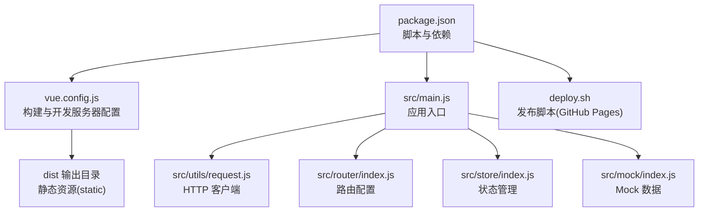
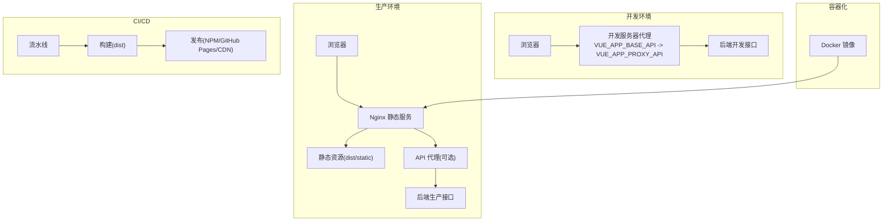
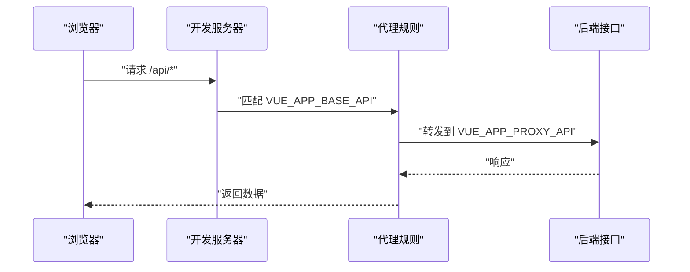
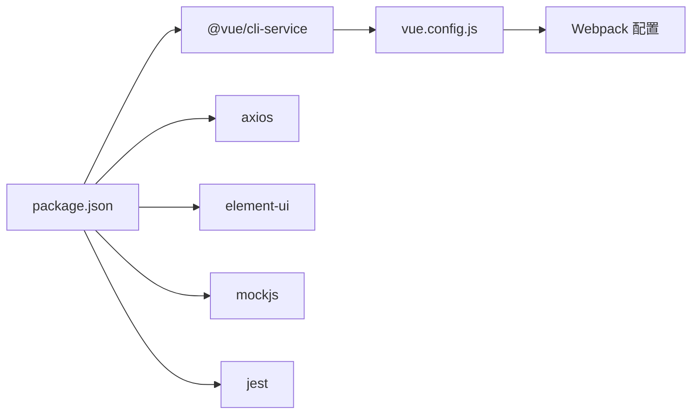

# 部署环境

<cite>
**本文引用的文件**
- [package.json](file://package.json)
- [README.md](file://README.md)
- [vue.config.js](file://vue.config.js)
- [deploy.sh](file://deploy.sh)
- [src/main.js](file://src/main.js)
- [src/utils/request.js](file://src/utils/request.js)
- [src/store/index.js](file://src/store/index.js)
- [src/router/index.js](file://src/router/index.js)
- [src/mock/index.js](file://src/mock/index.js)
- [babel.config.js](file://babel.config.js)
</cite>

## 目录
1. [简介](#简介)
2. [项目结构](#项目结构)
3. [核心组件](#核心组件)
4. [架构总览](#架构总览)
5. [详细组件分析](#详细组件分析)
6. [依赖分析](#依赖分析)
7. [性能考虑](#性能考虑)
8. [故障排查指南](#故障排查指南)
9. [结论](#结论)
10. [附录](#附录)

## 简介
本指南面向Vue CMS项目的多环境部署，覆盖开发、测试、生产三类环境的差异与配置要点，解释环境变量的使用与配置方法（如 VUE_APP_BASE_API、VUE_APP_PROXY_API 等），提供 Nginx 部署配置思路（静态资源处理、反向代理、缓存策略）、Docker 容器化部署方案（Dockerfile 编写与镜像构建）、云平台部署步骤（阿里云、腾讯云等主流平台）、以及 CI/CD 流水线与自动化部署策略。文档力求兼顾技术细节与可操作性，便于不同背景读者落地实施。

## 项目结构
该项目采用 Vue CLI 5.x 脚手架，前端工程化配置集中在 vue.config.js，运行时通过环境变量控制 API 基址与开发服务器代理，构建产物输出至 dist 目录，支持通过脚本一键发布到 GitHub Pages。

**图表来源**
- [package.json:1-99](file://package.json#L1-L99)
- [vue.config.js:14-144](file://vue.config.js#L14-L144)
- [src/main.js:1-53](file://src/main.js#L1-L53)
- [src/utils/request.js:1-139](file://src/utils/request.js#L1-L139)
- [src/router/index.js:1-343](file://src/router/index.js#L1-L343)
- [src/store/index.js:1-74](file://src/store/index.js#L1-L74)
- [src/mock/index.js:1-38](file://src/mock/index.js#L1-L38)
- [deploy.sh:1-26](file://deploy.sh#L1-L26)

**章节来源**
- [package.json:24-32](file://package.json#L24-L32)
- [README.md:119-132](file://README.md#L119-L132)
- [vue.config.js:22-50](file://vue.config.js#L22-L50)

## 核心组件
- 构建与开发服务器配置：通过 vue.config.js 控制 publicPath、输出目录、静态资源目录、devServer 代理、生产 Source Map、Webpack 插件与优化策略。
- 环境变量与运行时：通过 VUE_APP_* 前缀的环境变量注入到客户端代码，用于 API 基址、代理目标、标题等。
- HTTP 客户端：基于 axios 的封装，读取 VUE_APP_BASE_API 作为 baseURL，统一拦截器处理鉴权、语言、超时与错误提示。
- 应用入口：初始化 Element UI、国际化、Mock 数据、权限控制等。
- 发布脚本：一键构建并推送到 GitHub Pages 分支。

**章节来源**
- [vue.config.js:14-144](file://vue.config.js#L14-L144)
- [src/utils/request.js:8-15](file://src/utils/request.js#L8-L15)
- [src/main.js:34-42](file://src/main.js#L34-L42)
- [deploy.sh:6-23](file://deploy.sh#L6-L23)

## 架构总览
下图展示了多环境部署的关键交互：开发环境使用本地代理转发到后端；生产环境通过 Nginx 提供静态资源与 API 代理；Docker 容器化部署将 Nginx 作为静态服务；CI/CD 自动化触发构建与发布。

**图表来源**
- [vue.config.js:29-50](file://vue.config.js#L29-L50)
- [src/utils/request.js:8-15](file://src/utils/request.js#L8-L15)
- [deploy.sh:6-23](file://deploy.sh#L6-L23)

## 详细组件分析

### 环境变量与配置要点
- VUE_APP_BASE_API：用于设置 axios 的 baseURL，决定所有 API 请求的前缀路径。
- VUE_APP_PROXY_API：用于开发服务器代理的目标地址，将匹配 VUE_APP_BASE_API 的请求转发到该地址。
- VUE_APP_TITLE：用于网页标题，默认回退值来自环境变量。
- Cookie 相关键：用于 Cookie 名称或加密键等配置项。
- NODE_ENV：影响 ESLint 校验与 Source Map 等行为。

建议在各环境分别维护 .env 文件：
- .env（通用）
- .env.development（开发）
- .env.test（测试）
- .env.production（生产）

注意：.env.* 文件仅在构建阶段注入，运行时可通过部署平台的环境变量覆盖。

**章节来源**
- [src/utils/request.js:8-15](file://src/utils/request.js#L8-L15)
- [vue.config.js:33-40](file://vue.config.js#L33-L40)
- [src/common/auth.js:2](file://src/common/auth.js#L2)
- [src/utils/get-page-title.js:1](file://src/utils/get-page-title.js#L1)
- [README.md:119-121](file://README.md#L119-L121)

### 开发环境部署
- 启动命令：使用 npm scripts 启动开发服务器。
- 代理配置：通过 devServer.proxy 将以 VUE_APP_BASE_API 开头的请求转发到 VUE_APP_PROXY_API，并重写路径。
- Mock 数据：应用入口引入 Mock，便于前后端并行开发。
- 端口与主机：host 与 port 由环境变量控制，允许外网访问。

**图表来源**
- [vue.config.js:29-50](file://vue.config.js#L29-L50)
- [src/mock/index.js:1-38](file://src/mock/index.js#L1-L38)

**章节来源**
- [package.json:26](file://package.json#L26)
- [vue.config.js:29-50](file://vue.config.js#L29-L50)
- [src/main.js:34](file://src/main.js#L34)

### 测试环境部署
- 构建产物：使用构建脚本生成 dist 目录，静态资源位于 static 子目录。
- 代理与 API：测试环境通常仍使用 VUE_APP_BASE_API 指向测试后端，或通过 Nginx 代理到测试集群。
- Mock 数据：可在测试环境选择性关闭或保留，视联调需求而定。

**章节来源**
- [package.json:27](file://package.json#L27)
- [vue.config.js:22-25](file://vue.config.js#L22-L25)

### 生产环境部署
- 构建与输出：publicPath 默认为相对路径，assetsDir 为 static，生产不生成 Source Map。
- 静态资源：dist/static 下承载 JS/CSS/媒体等资源，需确保 Nginx 正确映射。
- API 访问：通过 VUE_APP_BASE_API 指向生产后端；若跨域或域名不同，建议在 Nginx 层统一代理。
- 页面标题：可由 VUE_APP_TITLE 控制，避免硬编码。

**章节来源**
- [vue.config.js:22-27](file://vue.config.js#L22-L27)
- [src/utils/get-page-title.js:1](file://src/utils/get-page-title.js#L1)

### Nginx 部署配置要点
- 静态资源处理：将 /static/* 映射到 dist/static。
- 单页应用回退：将未命中资源的请求回退到 index.html，交由前端路由接管。
- API 代理：将 /api/* 代理到后端服务，或根据业务拆分路径。
- 缓存策略：对静态资源启用长缓存，对 HTML 禁用缓存；合理设置 ETag/Last-Modified。
- 安全与性能：开启 gzip/br，限制上传大小，配置 CORS，启用 HTTPS。

说明：以上为通用实践建议，具体路径与域名需结合实际部署环境调整。

### Docker 容器化部署
- 基础镜像：选择轻量级 Nginx 镜像。
- 构建步骤：在 CI 中执行构建，产出 dist；在容器中将 dist 挂载到 Nginx 的站点目录。
- 配置挂载：将 Nginx 配置文件挂载到容器内，或在镜像构建时复制。
- 环境变量：通过 Docker 环境变量注入 VUE_APP_*，由构建阶段注入到静态资源。
- 健康检查：配置 HTTP 健康检查端点，保障容器可用性。

说明：Dockerfile 示例与 Nginx 配置文件不在仓库中，此处提供通用方案以便快速落地。

### 云平台部署指南（阿里云/腾讯云）
- 阿里云
  - 对象存储 OSS：上传 dist 静态资源，配置 CDN 加速与回源。
  - 云服务器 ECS：部署 Nginx，挂载 dist 目录，配置 SSL 与安全组。
  - API 网关/SLB：将 /api/* 转发到后端服务。
- 腾讯云
  - COS + CDN：与 OSS 类似，上传 dist 并配置回源。
  - 负载均衡 CLB：统一接入与健康检查。
  - 云 API 网关：统一接入 /api/*。
- 共同步骤：准备证书、配置域名解析、设置缓存与压缩、监控告警。

说明：具体控制台操作以各平台最新文档为准，建议结合自身业务与合规要求制定策略。

### CI/CD 流水线与自动化部署
- 触发条件：push 到主分支、打 Tag、PR 合并等。
- 构建阶段：安装依赖、执行 Lint/单元测试、构建 dist。
- 发布阶段：GitHub Pages（deploy.sh）、CDN（OSS/COS）、容器镜像推送与编排。
- 环境管理：使用环境变量区分开发/测试/生产，敏感信息使用密钥管理服务。
- 质量门禁：失败即阻断，支持灰度发布与回滚。

**章节来源**
- [deploy.sh:6-23](file://deploy.sh#L6-L23)
- [package.json:24-31](file://package.json#L24-L31)

## 依赖分析
- 构建工具链：@vue/cli-service、babel、webpack 插件等。
- 运行时依赖：axios、element-ui、vue 生态等。
- Mock 与测试：mockjs、jest 等。
- 性能优化：splitChunks、runtimeChunk、SVG Sprite 等。

**图表来源**
- [package.json:33-84](file://package.json#L33-L84)
- [vue.config.js:51-65](file://vue.config.js#L51-L65)

**章节来源**
- [package.json:33-84](file://package.json#L33-L84)
- [babel.config.js:1-12](file://babel.config.js#L1-L12)

## 性能考虑
- 构建优化：生产关闭 Source Map，按需拆分第三方库与公共组件，启用 runtimeChunk。
- 首屏优化：预加载关键资源，减少不必要的 prefetch。
- 资源压缩：启用 gzip/br，合理分包与懒加载。
- 缓存策略：静态资源强缓存，HTML 无缓存或短缓存。
- 网络层：CDN 加速、就近接入、TLS 优化。

**章节来源**
- [vue.config.js:104-141](file://vue.config.js#L104-L141)

## 故障排查指南
- API 404/跨域
  - 检查 VUE_APP_BASE_API 与后端实际域名是否一致。
  - 开发环境确认 devServer 代理已启用且匹配路径。
- 请求超时/网络错误
  - 检查后端接口可用性与网络连通性。
  - 客户端拦截器已对超时与网络错误进行提示，关注控制台日志。
- Mock 数据未生效
  - 确认应用入口已引入 Mock，并检查模块注册逻辑。
- 静态资源加载失败
  - 确认 Nginx 静态目录映射正确，路径与 publicPath 保持一致。
- 页面白屏或路由异常
  - 检查 Nginx 回退到 index.html 的配置，确保前端路由正常工作。

**章节来源**
- [src/utils/request.js:108-135](file://src/utils/request.js#L108-L135)
- [src/main.js:34](file://src/main.js#L34)
- [vue.config.js:22](file://vue.config.js#L22)

## 结论
通过规范的环境变量管理、清晰的构建与代理配置、合理的 Nginx 与容器化策略，以及完善的 CI/CD 流水线，Vue CMS 项目可在开发、测试、生产三类环境中稳定交付。建议在各环境严格执行“最小暴露面”原则，配合监控与回滚机制，持续提升发布质量与效率。

## 附录
- 关键配置清单
  - 构建输出：outputDir、assetsDir、publicPath
  - 开发代理：devServer.proxy、VUE_APP_BASE_API、VUE_APP_PROXY_API
  - 生产优化：productionSourceMap、splitChunks、runtimeChunk
  - 环境变量：VUE_APP_BASE_API、VUE_APP_PROXY_API、VUE_APP_TITLE、NODE_ENV
- 常见问题速查
  - 代理不生效：核对 VUE_APP_BASE_API 前缀与 pathRewrite 规则。
  - Mock 不生效：确认 require('@/mock/index.js') 已执行。
  - 静态资源 404：核对 Nginx 静态目录与 dist/static 映射。