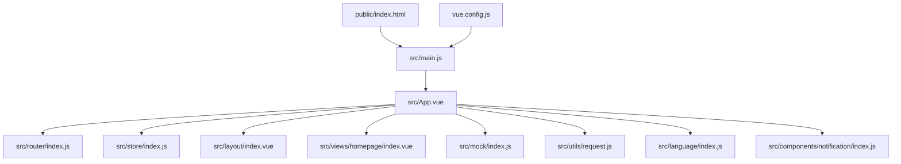
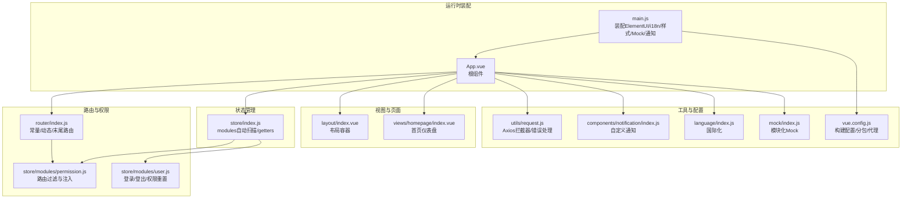
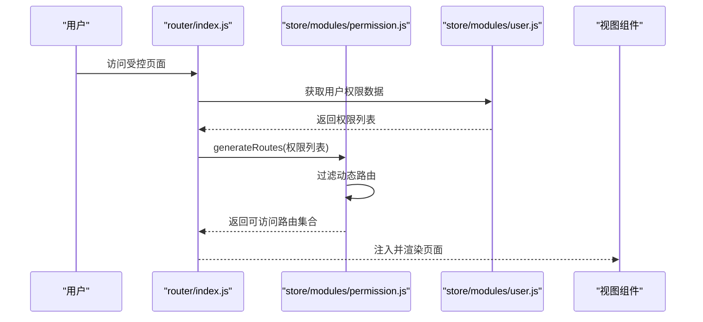
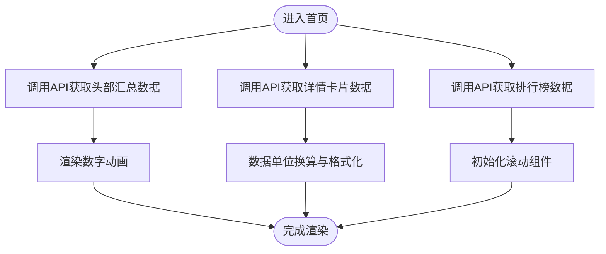
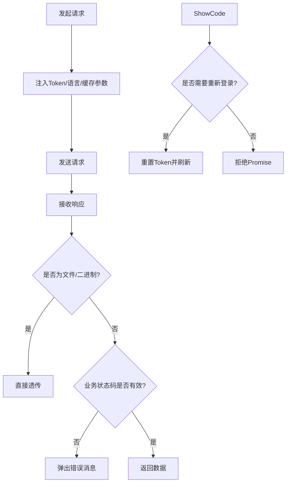
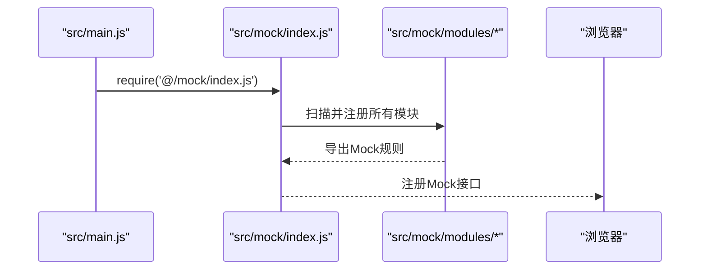
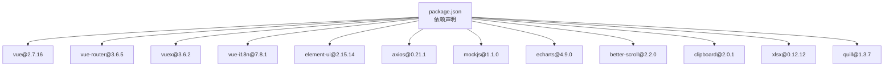

# 项目概述

<cite>
**本文引用的文件**
- [README.md](file://README.md)
- [package.json](file://package.json)
- [src/main.js](file://src/main.js)
- [src/App.vue](file://src/App.vue)
- [src/router/index.js](file://src/router/index.js)
- [src/store/index.js](file://src/store/index.js)
- [src/store/modules/user.js](file://src/store/modules/user.js)
- [src/store/modules/permission.js](file://src/store/modules/permission.js)
- [src/layout/index.vue](file://src/layout/index.vue)
- [src/views/homepage/index.vue](file://src/views/homepage/index.vue)
- [src/mock/index.js](file://src/mock/index.js)
- [src/utils/request.js](file://src/utils/request.js)
- [src/language/index.js](file://src/language/index.js)
- [src/components/notification/index.js](file://src/components/notification/index.js)
- [vue.config.js](file://vue.config.js)
</cite>

## 目录
1. [简介](#简介)
2. [项目结构](#项目结构)
3. [核心组件](#核心组件)
4. [架构总览](#架构总览)
5. [详细组件分析](#详细组件分析)
6. [依赖关系分析](#依赖关系分析)
7. [性能考量](#性能考量)
8. [故障排查指南](#故障排查指南)
9. [结论](#结论)
10. [附录](#附录)

## 简介
本项目是一个基于 Vue.js 2.7.16 与 Element UI 2.15.14 的企业级后台管理系统，旨在提供一套开箱即用、可扩展、可维护的管理平台解决方案。项目内置国际化、动态路由、权限控制、主题换肤、图表可视化、Excel 导入导出、富文本编辑、Svg 图标体系、全屏切换、列表拖拽等丰富能力，适合中大型后台系统的快速搭建与迭代。

项目定位与价值：
- 企业级后台：提供完善的权限模型、路由与菜单动态化、国际化、主题切换等企业常用能力。
- 开发效率：统一的工具链、约定式目录结构、Mock 数据、Axios 封装、组件与指令扩展，降低重复工作量。
- 学习参考：涵盖路由嵌套、权限过滤、状态管理、图表集成、富文本、Excel 处理等常见场景的最佳实践与技术尝试。

发展历程与适用范围：
- 发展历程：项目采用 vue-cli@5.x 脚手架，结合 Vue 2.x 生态，持续演进中；README 明确了版本与功能清单，便于新成员快速上手。
- 适用范围：适用于金融、运营、内容管理、数据分析等后台管理类业务场景，支持多语言、多环境部署与多终端适配。

## 项目结构
项目采用“按功能域分层 + 约定式目录”的组织方式，核心目录与职责如下：
- public：静态资源与入口模板
- src：源码目录
  - api：接口层，封装各业务模块的请求方法
  - assets：静态资源（图片、字体、样式）
  - common：通用工具（鉴权、字典、本地存储、校验等）
  - components：可复用组件（通知、图标、全屏、主题等）
  - config：配置项（动画、粒子效果等）
  - decorator：装饰器（防抖、节流等）
  - directive：自定义指令（剪贴板等）
  - icons：SVG 图标与加载器
  - language：国际化配置与多语言资源
  - layout：布局容器与侧边栏、头部、标签页等
  - mock：本地 Mock 数据与模块化注册
  - router：路由配置与动态路由
  - store：状态管理（modules 分模块）
  - utils：通用工具（请求、校验、检测前缀等）
  - views：页面视图（首页、登录、Excel、图表、富文本、主题等）
- 测试：单元测试配置与样例
- 构建配置：vue.config.js、babel.config.js、jest.config.js 等

**图示来源**
- [src/main.js:1-53](file://src/main.js#L1-L53)
- [src/App.vue:1-35](file://src/App.vue#L1-L35)
- [src/router/index.js:1-343](file://src/router/index.js#L1-L343)
- [src/store/index.js:1-74](file://src/store/index.js#L1-L74)
- [src/layout/index.vue:1-32](file://src/layout/index.vue#L1-L32)
- [src/views/homepage/index.vue:1-654](file://src/views/homepage/index.vue#L1-L654)
- [src/mock/index.js:1-38](file://src/mock/index.js#L1-L38)
- [src/utils/request.js:1-139](file://src/utils/request.js#L1-L139)
- [src/language/index.js:1-28](file://src/language/index.js#L1-L28)
- [src/components/notification/index.js:1-119](file://src/components/notification/index.js#L1-L119)
- [vue.config.js:1-144](file://vue.config.js#L1-L144)

**章节来源**
- [README.md:98-132](file://README.md#L98-L132)
- [vue.config.js:14-65](file://vue.config.js#L14-L65)

## 核心组件
- 应用入口与全局装配
  - main.js：引入 Element UI、国际化、全局样式、Mock、通知组件；挂载根实例。
  - App.vue：应用根组件，承载路由视图与系统设置面板。
- 路由与权限
  - router/index.js：常量路由、动态路由、末尾路由；支持嵌套路由、菜单图标、标题、缓存与 iframe 展示等元信息。
  - store/modules/permission.js：根据后端返回的权限数据过滤前端路由，生成最终路由树并注入全局路由。
  - store/modules/user.js：登录、登出、拉取用户信息、头像更新、权限重置等用户态管理。
- 状态管理
  - store/index.js：自动扫描 modules 文件夹，聚合模块与 getters，提供统一取值入口。
- 视图与页面
  - views/homepage/index.vue：首页仪表盘，包含数字动画、滚动列表、图表组件等。
- 工具与配置
  - utils/request.js：Axios 封装，拦截器处理 Token、语言、错误提示与超时处理。
  - language/index.js：国际化配置，整合 Element UI 语言包与项目语言资源。
  - components/notification/index.js：自定义通知组件，支持多实例堆叠与自动关闭。
  - mock/index.js：模块化注册 Mock 数据，统一响应格式。
  - vue.config.js：构建配置，包括代理、别名、SVG Sprite、分包策略与运行时优化。

**章节来源**
- [src/main.js:1-53](file://src/main.js#L1-L53)
- [src/App.vue:1-35](file://src/App.vue#L1-L35)
- [src/router/index.js:1-343](file://src/router/index.js#L1-L343)
- [src/store/index.js:1-74](file://src/store/index.js#L1-L74)
- [src/store/modules/user.js:1-154](file://src/store/modules/user.js#L1-L154)
- [src/store/modules/permission.js:1-187](file://src/store/modules/permission.js#L1-L187)
- [src/views/homepage/index.vue:1-654](file://src/views/homepage/index.vue#L1-L654)
- [src/utils/request.js:1-139](file://src/utils/request.js#L1-L139)
- [src/language/index.js:1-28](file://src/language/index.js#L1-L28)
- [src/components/notification/index.js:1-119](file://src/components/notification/index.js#L1-L119)
- [src/mock/index.js:1-38](file://src/mock/index.js#L1-L38)
- [vue.config.js:14-144](file://vue.config.js#L14-L144)

## 架构总览
系统采用“入口装配 → 路由与权限 → 状态管理 → 视图与页面 → 工具与配置”的分层架构，配合 Mock 与 Axios 封装实现前后端解耦，满足开发与生产的不同阶段需求。

**图示来源**
- [src/main.js:1-53](file://src/main.js#L1-L53)
- [src/App.vue:1-35](file://src/App.vue#L1-L35)
- [src/router/index.js:1-343](file://src/router/index.js#L1-L343)
- [src/store/index.js:1-74](file://src/store/index.js#L1-L74)
- [src/store/modules/user.js:1-154](file://src/store/modules/user.js#L1-L154)
- [src/store/modules/permission.js:1-187](file://src/store/modules/permission.js#L1-L187)
- [src/layout/index.vue:1-32](file://src/layout/index.vue#L1-L32)
- [src/views/homepage/index.vue:1-654](file://src/views/homepage/index.vue#L1-L654)
- [src/utils/request.js:1-139](file://src/utils/request.js#L1-L139)
- [src/components/notification/index.js:1-119](file://src/components/notification/index.js#L1-L119)
- [src/language/index.js:1-28](file://src/language/index.js#L1-L28)
- [src/mock/index.js:1-38](file://src/mock/index.js#L1-L38)
- [vue.config.js:14-144](file://vue.config.js#L14-L144)

## 详细组件分析

### 路由与权限流程
系统通过“常量路由 + 动态路由 + 末尾路由”组合，结合后端返回的权限数据，动态生成用户可见的完整路由树。流程要点：
- 常量路由：登录、重定向、404 等无需权限页面
- 动态路由：根据用户权限过滤后的菜单与页面路由
- 末尾路由：兜底 404、无权限等页面
- 权限过滤：按路由地址匹配，保留有权限的菜单与子路由，并注入全局路由

**图示来源**
- [src/router/index.js:117-343](file://src/router/index.js#L117-L343)
- [src/store/modules/permission.js:143-179](file://src/store/modules/permission.js#L143-L179)
- [src/store/modules/user.js:52-110](file://src/store/modules/user.js#L52-L110)

**章节来源**
- [src/router/index.js:1-343](file://src/router/index.js#L1-L343)
- [src/store/modules/permission.js:1-187](file://src/store/modules/permission.js#L1-L187)
- [src/store/modules/user.js:1-154](file://src/store/modules/user.js#L1-L154)

### 首页仪表盘数据流
首页通过 API 获取头部汇总、详情卡片、排行榜等数据，结合数字动画与滚动组件提升交互体验。

**图示来源**
- [src/views/homepage/index.vue:177-277](file://src/views/homepage/index.vue#L177-L277)

**章节来源**
- [src/views/homepage/index.vue:1-654](file://src/views/homepage/index.vue#L1-L654)

### 请求拦截与错误处理
Axios 封装统一处理请求头（Token、语言）、GET 请求缓存参数、响应状态码与错误提示，并在特定错误码时触发重新登录流程。

**图示来源**
- [src/utils/request.js:17-136](file://src/utils/request.js#L17-L136)

**章节来源**
- [src/utils/request.js:1-139](file://src/utils/request.js#L1-L139)

### Mock 数据与模块化注册
项目采用 Mock.js，通过模块化扫描与正则匹配注册 Mock 接口，统一响应格式，便于前后端并行开发。

**图示来源**
- [src/main.js:34-34](file://src/main.js#L34-L34)
- [src/mock/index.js:20-34](file://src/mock/index.js#L20-L34)

**章节来源**
- [src/mock/index.js:1-38](file://src/mock/index.js#L1-L38)
- [src/main.js:30-35](file://src/main.js#L30-L35)

### 国际化与主题换肤
- 国际化：通过 vue-i18n 与 Element UI 语言包整合，支持中英文切换与项目语言资源覆盖。
- 主题换肤：通过布局设置面板与自定义主题文件实现界面风格切换。

**章节来源**
- [src/language/index.js:1-28](file://src/language/index.js#L1-L28)
- [src/layout/index.vue:1-32](file://src/layout/index.vue#L1-L32)

## 依赖关系分析
- 运行时依赖
  - Vue 生态：vue、vue-router、vuex、vue-i18n
  - UI 组件：element-ui、normalize.css、animate.css
  - 工具库：axios、mockjs、echarts、better-scroll、clipboard、xlsx、quill 等
- 开发依赖
  - 构建与脚手架：@vue/cli-service、@vue/cli-plugin-*、babel
  - 样式与工具：sass、sass-loader、svg-sprite-loader、eslint、jest
- 版本与浏览器支持
  - Node >= 6.0.0，NPM >= 3.0.0
  - 浏览器支持现代浏览器与 IE10+

**图示来源**
- [package.json:33-63](file://package.json#L33-L63)

**章节来源**
- [package.json:1-99](file://package.json#L1-L99)

## 性能考量
- 构建优化
  - 分包策略：libs、elementUI、components 等独立 chunk，提升缓存命中率
  - 运行时优化：runtimeChunk 单独提取，减少重复代码
  - 预加载与预取：按需启用 preload/prefetch，缩短首屏加载时间
- 开发体验
  - 代理配置：本地开发跨域代理，提升联调效率
  - 热重载与错误覆盖：客户端 overlay 配置，快速定位问题
- 运行时优化
  - Axios 请求头与缓存参数：GET 请求附加时间戳参数，避免缓存导致的数据陈旧
  - 组件懒加载：路由级按需加载页面组件，降低首屏体积

**章节来源**
- [vue.config.js:66-141](file://vue.config.js#L66-L141)
- [src/utils/request.js:34-43](file://src/utils/request.js#L34-L43)

## 故障排查指南
- 登录与权限
  - 登录失败：检查后端返回的 Token 与权限数据结构，确认 sessionStorage 中的用户信息是否正确写入。
  - 页面无权限：核对后端返回的权限地址与前端路由 path 是否一致，确认权限过滤逻辑。
- 请求与网络
  - 超时/网络错误：查看 Axios 拦截器错误处理分支，确认提示文案与日志输出。
  - 401/403：根据业务状态码触发重新登录流程，检查 Token 清理与路由重置逻辑。
- Mock 与接口
  - Mock 未生效：确认 main.js 中已引入 mock 入口，且模块化注册逻辑正常。
  - 接口路径不匹配：检查 Mock 正则匹配与实际请求 URL 参数。
- 构建与部署
  - 跨域问题：检查 devServer.proxy 配置与环境变量 VUE_APP_BASE_API/VUE_APP_PROXY_API。
  - 资源路径：确认 publicPath 与 BASE_URL 使用，避免静态资源 404。

**章节来源**
- [src/store/modules/user.js:52-110](file://src/store/modules/user.js#L52-L110)
- [src/store/modules/permission.js:143-179](file://src/store/modules/permission.js#L143-L179)
- [src/utils/request.js:54-136](file://src/utils/request.js#L54-L136)
- [src/main.js:30-35](file://src/main.js#L30-L35)
- [vue.config.js:29-50](file://vue.config.js#L29-L50)

## 结论
本项目以 Vue 2.7 与 Element UI 为基础，围绕“路由权限、状态管理、国际化、工具链与构建配置”形成了一套成熟的企业级后台解决方案。其模块化设计、Mock 与 Axios 封装、丰富的页面与组件示例，既适合初学者快速理解企业后台的典型架构，也为有经验的开发者提供了可扩展、可维护的工程范式。通过合理的分包与运行时优化，项目在性能与开发效率之间取得良好平衡，具备较强的落地价值与推广意义。

## 附录
- 在线演示与截图：README 中提供在线体验链接与多张截图，便于直观了解系统界面与功能。
- 浏览器支持：现代浏览器与 IE10+，满足企业内网与部分遗留环境需求。
- 功能清单：登录/注销、权限验证、动态侧边栏、国际化、Screenfull 全屏、列表拖拽、Svg Sprite、Dashboard、本地 Mock、ECharts、Excel 导入导出、富文本等。

**章节来源**
- [README.md:22-169](file://README.md#L22-L169)